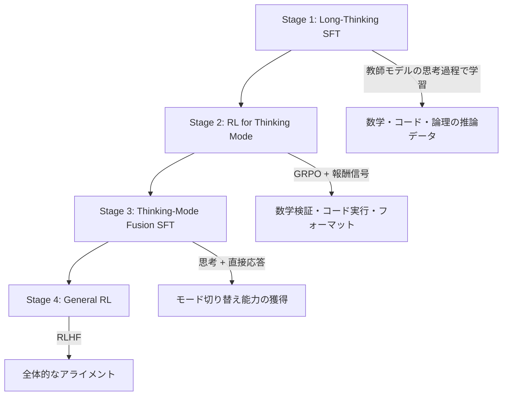

## 論文概要（Abstract）

Qwen3はAlibaba Group Qwenチームが開発した最新世代の大規模言語モデルファミリーである。Dense（0.6B〜32B）とMoE（30B-A3B、235B-A22B）の包括的なモデルスイートを提供し、**Thinking Mode（拡張推論）とNon-Thinking Mode（高速応答）を単一モデル内に統合**した点が最大の特徴。約36兆トークンの事前学習コーパスに加え、4段階のポストトレーニングパイプラインで段階的に思考能力を強化している。Qwen3-30B-A3B（活性化3Bのみ）はQwen2.5-72B-Instructを上回り、フラッグシップのQwen3-235B-A22BはGPT-4.1やGemini-2.5-Proを多くのベンチマークで凌駕する。全モデルがApache 2.0ライセンスで公開されている。

この記事は [Zenn記事: Qwen3.5徹底解説：397B MoEモデルをvLLMでデプロイする実践ガイド](https://zenn.dev/0h_n0/articles/657d35a2bbf71d) の深掘りです。

## 情報源

- **arXiv ID**: 2504.05737
- **URL**: [https://arxiv.org/abs/2504.05737](https://arxiv.org/abs/2504.05737)
- **著者**: Qwen Team, Alibaba Group
- **発表年**: 2025年4月
- **分野**: cs.CL, cs.AI, cs.LG

## 背景と動機（Background & Motivation）

LLMの競争が激化する2025年において、Qwenチームが取り組んだ課題は3つある：

1. **推論効率と知識量のトレードオフ**: 72Bパラメータ級の知識を、数Bの計算コストでアクセスするMoEアーキテクチャの実現
2. **思考モードの統合**: 数学・コーディング等の複雑タスク向け「深い推論」と、チャットボット等の「高速応答」を1つのモデルで切り替え
3. **多言語対応の拡大**: Qwen2.5の29言語から119言語・方言への大幅拡張

Qwen3はこれらの課題に対し、MoEアーキテクチャの洗練と4段階ポストトレーニングパイプラインという体系的なアプローチで解答を提示した。本技術報告はQwen3.5の直接的な設計基盤であり、MoEルーティング・訓練パイプラインの知見がQwen3.5に継承されている。

## 主要な貢献（Key Contributions）

- **MoEモデル30B-A3Bの効率性実証**: 活性化パラメータ3Bで72B級の性能を達成（約20倍のパラメータ効率）
- **4段階ポストトレーニングパイプライン**: Long-Thinking SFT → RL for Thinking → Fusion SFT → General RL
- **Thinking/Non-Thinkingモード統合**: `<think>...</think>`タグによる思考過程の制御と動的切り替え
- **119言語対応**: 前世代比で4倍以上の言語サポート

## 技術的詳細（Technical Details）

### MoEアーキテクチャ

Qwen3のMoEモデルは**fine-grained expert segmentation**を採用し、128個のエキスパート（1共有 + 127ルーティング）からトークンごとにTop-8を選択する。

**Qwen3-30B-A3B**:

| パラメータ | 値 |
|-----------|-----|
| 層数 | 48 |
| Attentionヘッド (Q / KV) | 32 / 8 (GQA) |
| エキスパート数 (共有 / ルーティング) | 1 / 127 |
| 選択エキスパート数 | Top-8 |
| 活性化 / 総パラメータ | 3B / 30B |

**Qwen3-235B-A22B**:

| パラメータ | 値 |
|-----------|-----|
| 層数 | 94 |
| Attentionヘッド (Q / KV) | 64 / 4 (GQA) |
| エキスパート数 (共有 / ルーティング) | 1 / 127 |
| 選択エキスパート数 | Top-8 |
| 活性化 / 総パラメータ | 22B / 235B |

**Qwen2.5との比較（Denseモデルの変更点）**:
- GQA（Grouped Query Attention）を全モデルに適用
- 入出力Embedding非共有化
- 全Bias項を除去
- QKVレイヤーにRMS Normを追加（学習安定性向上）

**Qwen3.5との関係**: Qwen3.5-397B-A17BはQwen3のMoE設計をさらに発展させ、エキスパート数を512に増加（10ルーティング + 1共有を選択）、Gated DeltaNet/Gated Attentionハイブリッドアーキテクチャを導入している。

### ルーティング機構

各MoE層で入力トークン$x$に対し、ルーターが128個のエキスパートのスコアを計算し、上位8個を選択する：

$$
g(x) = \text{TopK}(\text{softmax}(W_r x), k=8)
$$

$$
\text{MoE}(x) = E_{\text{shared}}(x) + \sum_{i \in \text{TopK}} g_i(x) \cdot E_i(x)
$$

ここで、$E_{\text{shared}}$は共有エキスパート（常時活性化）、$E_i$はルーティングされたエキスパート、$g_i(x)$はゲーティング重みである。

### 4段階ポストトレーニングパイプライン



**Stage 1: Long-Thinking SFT**

教師モデルまたは自動パイプラインで生成した「長い思考チェーン」データでSFT。数学・コーディング・論理推論が主要タスク。この段階でモデルは`<think>...</think>`タグ内にステップバイステップの推論を生成する能力を獲得する。

**Stage 2: RL for Thinking Mode**

GRPO（Group Relative Policy Optimization）を適用し、思考品質をさらに強化。報酬信号は：
- **数学**: 正答判定（自動検証）
- **コード**: テスト実行結果
- **フォーマット**: 推論チェーンの構造的正しさ

**Stage 3: Thinking-Mode Fusion SFT**

思考モードと非思考モードの両方のデータでSFT。この段階で単一チェックポイントが両モードに対応する能力を獲得する。

**Stage 4: General RL**

最終アライメント段階。RLHFシグナルで全体的な有用性・安全性を最適化。思考・非思考両モードの性能を同時に向上させる。

### Thinking Mode と Non-Thinking Mode

```python
from openai import OpenAI

client = OpenAI(base_url="http://localhost:8000/v1", api_key="EMPTY")

# Thinking Mode（デフォルト: 複雑な推論タスク向け）
response = client.chat.completions.create(
    model="Qwen/Qwen3-235B-A22B",
    messages=[{"role": "user", "content": "フェルマーの最終定理の証明の概要を説明してください"}],
    max_tokens=81920,
    temperature=0.6,
    top_p=0.95,
)
# → <think>段階的な推論過程</think> の後に回答

# Non-Thinking Mode（/no_think: 高速応答向け）
response = client.chat.completions.create(
    model="Qwen/Qwen3-235B-A22B",
    messages=[
        {"role": "system", "content": "/no_think"},
        {"role": "user", "content": "東京の天気は？"}
    ],
    max_tokens=32768,
    temperature=0.7,
)
# → 直接回答（推論ステップなし）
```

**Budget Forcing**: 思考モードの最大トークン数をユーザーが指定可能（精度とレイテンシのトレードオフ制御）。

## 実験結果（Results）

### 主要ベンチマーク

| ベンチマーク | Qwen3-235B-A22B | DeepSeek-R1 | GPT-4.1 |
|-------------|-----------------|-------------|---------|
| AIME 2025 (Pass@1) | **85.7** | 79.8 | — |
| MMLU-Pro | **~79.3** | — | ~73 |
| LiveCodeBench | **~70+** | 65.9 | — |

### パラメータ効率の実証

Qwen3-30B-A3B（活性化3B）vs Qwen2.5-72B-Instruct（活性化72B）:
- 多くのベンチマークでQwen3-30B-A3Bが上回る
- **推論コスト約20分の1**で同等以上の性能

これはMoEアーキテクチャの成熟度を示す重要な結果であり、Qwen3.5-397B-A17B（活性化17B）がGPT-5.2やClaude Opus 4.5と競合できる根拠の一つとなっている。

## 実運用への応用（Practical Applications）

### Qwen3からQwen3.5への発展

Qwen3 Technical Reportで確立された知見がQwen3.5にどう継承されたかを整理する：

| Qwen3の設計 | Qwen3.5での発展 |
|------------|---------------|
| 128エキスパート・Top-8 | **512エキスパート・Top-10 + 1共有** |
| 標準Attention (GQA) | **Gated DeltaNet + Gated Attention ハイブリッド** |
| 4段階ポストトレーニング | 継承（+ ネイティブマルチモーダル学習） |
| テキストのみ | **テキスト + 画像 + 動画 + 音声（早期融合）** |
| 32Kコンテキスト | **256Kコンテキスト（19倍高速化）** |
| Apache 2.0 | Apache 2.0（継続） |

### デプロイメント上の考慮事項

- **vLLMのQwen3対応**: vLLM v0.5+で安定サポート。`--reasoning-parser qwen3`でThinkingモードに対応
- **MoE固有のメモリ要件**: 総パラメータ235Bはメモリにロード必要。推論時の計算量は22B相当だが、GPUメモリは235B分確保が必要
- **Thinking Mode制御**: API経由での`/no_think`指定によりレイテンシ要件に応じた切り替えが可能

## 関連研究（Related Work）

- **DeepSeek-R1**: 大規模RLによる推論能力の獲得。Qwen3はSFT先行の4段階アプローチで安定的に同等以上の推論性能を実現
- **Gated Delta Networks (arXiv 2412.06464)**: Qwen3.5で採用されたGDNアーキテクチャの基盤論文。Qwen3のGQAベースAttentionからの進化
- **Gated Attention (arXiv 2505.06708)**: Qwen3-Next/3.5のFull Attention層に採用。Qwen3段階では未適用

## まとめと今後の展望

Qwen3 Technical Reportは、MoEアーキテクチャと多段階ポストトレーニングによるLLMの効率化・高性能化の体系的なアプローチを提示した。特に「活性化3Bで72B級性能」という成果は、MoEの実用性を明確に示している。

4段階ポストトレーニングパイプラインで確立されたThinking/Non-Thinkingモード統合は、Qwen3.5にそのまま継承されており、vLLMでの`--reasoning-parser qwen3`オプションとして実装されている。Qwen3の設計思想を理解することは、Qwen3.5の本番デプロイメントを最適化する上で不可欠である。

## 参考文献

- **arXiv**: [https://arxiv.org/abs/2504.05737](https://arxiv.org/abs/2504.05737)
- **Code**: [https://github.com/QwenLM/Qwen3](https://github.com/QwenLM/Qwen3)
- **HuggingFace**: [https://huggingface.co/Qwen](https://huggingface.co/Qwen)
- **Related Zenn article**: [https://zenn.dev/0h_n0/articles/657d35a2bbf71d](https://zenn.dev/0h_n0/articles/657d35a2bbf71d)
- **DeepSeek-R1**: [https://arxiv.org/abs/2501.12599](https://arxiv.org/abs/2501.12599)

---

:::message
この記事はAI（Claude Code）により自動生成されました。内容の正確性については元論文と照合して検証していますが、実際の利用時は公式ドキュメントもご確認ください。
:::
