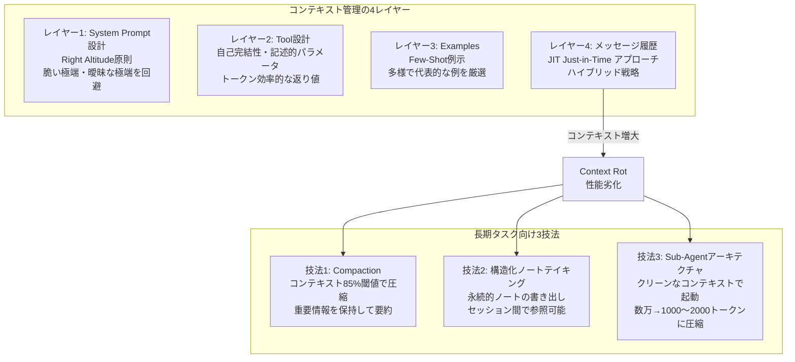

## ブログ概要（Summary）

Anthropicが公開した「Effective Context Engineering for AI Agents」は、Claude Codeの開発・運用経験から導かれたコンテキスト管理の設計原則と実装パターンを体系的にまとめた公式ガイドである。コンテキストウィンドウを「有限の注意力予算（attention budget）」として捉え、**最小限の高信号トークンを配置する**ことの重要性を強調する。特にContext Rot（コンテキスト腐敗）問題への対処法として、System Prompt設計、Tool設計、例示、メッセージ履歴管理、そして長期タスク向けのCompaction・Sub-Agent・構造化ノートの3技法を提示している。

この記事は [Zenn記事: LLMエージェントのContext Engineering実践：4戦略でトークンコスト50%削減](https://zenn.dev/0h_n0/articles/e918777f3aa87c) の深掘りです。

## 情報源

- **種別**: 企業テックブログ（Anthropic Engineering Blog）
- **URL**: [https://www.anthropic.com/engineering/effective-context-engineering-for-ai-agents](https://www.anthropic.com/engineering/effective-context-engineering-for-ai-agents)
- **組織**: Anthropic（Claude開発元）
- **発表日**: 2025年

## 技術的背景（Technical Background）

### Context Engineeringとは何か

Anthropicは、Context Engineeringを「**LLM推論時の最適なトークンセットをキュレーションし維持する技術**」と定義している。これはプロンプトエンジニアリング（1回の入力に最適化）とは根本的に異なり、エージェントの**全ライフサイクル**にわたるコンテキスト状態（システム命令、ツール、MCP、外部データ、メッセージ履歴）の管理を対象とする。

### Context Rot問題

Needle-in-a-haystackスタイルのベンチマークで確認された現象として、**Context Rot**がある。コンテキストウィンドウのトークン数が増加するにつれ、モデルの情報想起精度が低下する。200Kトークン対応モデルであっても、この問題は発生する。

**核心的な洞察**: ウィンドウサイズの拡大は根本解決にならない。重要なのは「**各ステップで必要十分な高信号トークンのみを配置する**」ことである。

### なぜこの技術が重要か

Claude Codeのようなプロダクションレベルのエージェントでは、数百ターンにわたるツール呼び出しが発生する。各ターンのツール出力がコンテキストに蓄積されると、トークン数は急速に膨張し、以下の問題が顕在化する：

1. **コスト増大**: トークン使用量に比例してAPI課金が増加
2. **精度低下**: Context Rotにより、重要な初期情報の想起が困難に
3. **レイテンシ増加**: コンテキスト長に応じた推論時間の延長

## 実装アーキテクチャ（Architecture）

Anthropicのガイドは、コンテキスト管理を4つのレイヤーに分類している。

### レイヤー1: System Prompt設計

**「Right Altitude（適切な高度）」の原則**:

2つの失敗モードを回避する：

1. **Brittle Extreme（脆い極端）**: 複雑なロジックをハードコードすると、エッジケースで脆弱になる
2. **Vague Extreme（曖昧な極端）**: 高レベルなガイダンスだけでは、具体的な行動指針にならない

**推奨構造**:

```markdown
<background_information>
プロジェクトの背景情報
</background_information>

<instructions>
## ツールの使い方
- ファイル読み取り: Readツールを使用（catではなく）
- ファイル検索: Globツールを使用（findではなく）

## 出力フォーマット
- Markdown形式で出力
- コードブロックには言語を指定
</instructions>
```

**ベストプラクティス**: 最小限から始め、失敗モードを観察してから指示を追加する。

### レイヤー2: Tool設計

ツール設計の4原則：

1. **自己完結性**: 各ツールの意図が明確
2. **記述的パラメータ**: 入力パラメータの名前と説明が曖昧でない
3. **機能の重複最小化**: 「人間のエンジニアがどのツールを使うべきか迷うなら、AIも迷う」
4. **トークン効率的な返り値**: 必要最小限の情報を返す

```python
# 悪い例: 曖昧なツール名
def search(query: str):
    """何かを検索する"""
    ...

# 良い例: 自己完結的な名前と説明
def search_codebase_by_regex(
    pattern: str,
    file_glob: str = "**/*",
    max_results: int = 50,
) -> list[SearchResult]:
    """正規表現パターンでコードベースを検索する

    Args:
        pattern: ripgrep互換の正規表現パターン
        file_glob: 検索対象ファイルのglobパターン
        max_results: 返す結果の最大数

    Returns:
        マッチしたファイルパス・行番号・内容のリスト
    """
    ...
```

### レイヤー3: Examples（Few-Shot）

Anthropicは「**LLMにとって、例は千の言葉に値する**」と述べている。

- 多様で代表的な例を厳選する
- エッジケースの網羅的リストは避ける
- 良い例と悪い例のペアが効果的

### レイヤー4: メッセージ履歴とコンテキスト検索

**Just-in-Time（JIT）アプローチ**が推奨される：

```python
# 悪い例: 全データをプリロード
context = load_all_project_files()  # 大量のトークンを消費
response = llm.invoke(context + user_message)

# 良い例: 識別子のみ保持し、必要時に取得
context = {
    "project_structure": get_file_tree(),  # パスのみ
    "recent_changes": get_git_diff(),       # 差分のみ
}
# ツール呼び出しで必要なファイルを動的に取得
```

**ハイブリッド戦略**（Anthropic推奨）:

1. **プリロード**: 重要な設定ファイル（CLAUDE.md等）は初期コンテキストに含める
2. **動的検索**: コードベースの探索はgrep/globツールで実行時に取得
3. **利点**: 古いインデックスの問題を回避し、常に最新の情報を取得

## 長期タスク向け3技法



### 技法1: Compaction（圧縮）

コンテキスト制限に近づいたとき、会話内容を要約して圧縮する：

**保持すべき情報**:
- アーキテクチャ上の決定事項
- 未解決のバグ情報
- 実装の詳細

**破棄してよい情報**:
- 冗長なツール出力
- 繰り返しのメッセージ

**実装パターン**:
```python
def compact_context(
    messages: list[Message],
    threshold: float = 0.85,  # コンテキスト使用率の閾値
) -> list[Message]:
    """コンテキストが閾値を超えたら圧縮する

    Args:
        messages: 全メッセージ履歴
        threshold: 圧縮トリガーの閾値（0.0-1.0）

    Returns:
        圧縮されたメッセージ履歴
    """
    usage_ratio = count_tokens(messages) / MAX_CONTEXT_TOKENS

    if usage_ratio < threshold:
        return messages  # 閾値未満ならそのまま

    # LLMで要約生成（最近アクセスしたファイルは保持）
    summary = summarize_llm(
        messages=messages,
        preserve=["architectural_decisions", "unresolved_bugs"],
        discard=["redundant_tool_outputs", "repeated_messages"],
    )

    # 要約 + 最近アクセスしたファイル情報で再構築
    recent_files = get_recently_accessed_files()
    return [summary] + recent_files
```

**最も安全で軽量な圧縮**: ツール結果のクリアリング（ツール出力をプレースホルダーに置換）

### 技法2: 構造化ノートテイキング（Agentic Memory）

エージェントがコンテキストウィンドウ外に**永続的なノート**を書き出し、後で読み出す仕組み：

```python
class AgenticMemory:
    """エージェントが自律的にノートを管理するメモリシステム"""

    def write_note(self, key: str, content: str) -> None:
        """進捗・決定事項をノートに記録

        Args:
            key: ノートの識別子（例: "auth_design_decision"）
            content: 記録内容
        """
        self.store.put(key=key, value=content)

    def read_notes(self, pattern: str = "*") -> list[str]:
        """関連するノートを検索・取得

        Args:
            pattern: 検索パターン（glob形式）

        Returns:
            マッチしたノートのリスト
        """
        return self.store.search(pattern=pattern)
```

**実例**: Claude CodeがPokémonをプレイする際、「明示的なプロンプトなしに、数千のゲームステップにわたって正確な記録を維持した」とAnthropicは報告している。

### 技法3: Sub-Agentアーキテクチャ

複雑なタスクを専門的なサブエージェントに委譲する：

- 各サブエージェントは**クリーンなコンテキストウィンドウ**で起動
- 数万トークンの探索結果を**1,000〜2,000トークンの要約**に圧縮してメインに返す
- メインエージェントは高レベルの計画に集中

```python
# Sub-Agentパターン
def explore_with_subagent(
    task: str,
    max_tokens: int = 2000,
) -> str:
    """サブエージェントで探索し、要約を返す

    Args:
        task: サブエージェントへの探索タスク
        max_tokens: 返す要約の最大トークン数

    Returns:
        探索結果の要約（1,000-2,000トークン）
    """
    subagent = spawn_agent(
        system_prompt=EXPLORATION_PROMPT,
        tools=["read_file", "glob", "grep"],
        max_context=100_000,  # サブエージェント専用のコンテキスト
    )

    # サブエージェントが自律的に探索
    raw_result = subagent.run(task)  # 数万トークンの探索結果

    # 要約して返す
    summary = summarize(raw_result, max_tokens=max_tokens)
    return summary  # 1,000-2,000トークンに圧縮
```

## パフォーマンス最適化（Performance）

### Progressive Disclosure（段階的開示）

Anthropicは「エージェントが**探索を通じて関連コンテキストを段階的に発見する**」ことを推奨する。全情報を事前にロードするのではなく、ファイル階層やネーミング規則といった**メタデータシグナル**を手がかりに、必要な情報に到達する設計が望ましい。

### トークン予算の考え方

コンテキストウィンドウを「**有限の注意力予算**」として扱い、各トークンが予算を消費すると考える。

$$
\text{Budget} = \text{MaxTokens} - \sum_{i} \text{tokens}(m_i)
$$

各メッセージ$m_i$のトークン数を常に監視し、予算が閾値を下回ったら圧縮を実行する。

### 最適化の優先順位

1. **まずリコール最大化**: 重要な情報が欠落しないことを確認
2. **次に精度向上**: 不要な情報を削減して信号/ノイズ比を改善
3. **最後にコスト最適化**: トークン使用量とレイテンシを削減

## 運用での学び（Production Lessons）

### Claude Codeからの教訓

1. **最もシンプルなものから始める**: 複雑な仕組みよりも、単純なルールベースの圧縮が最初は効果的
2. **ツール結果のクリアリング**: 最も安全で軽量な圧縮手段。古いツール出力をプレースホルダーに置換する
3. **CLAUDE.mdファイル**: プロジェクト固有の知識を構造化して永続化し、セッション開始時にプリロードする
4. **失敗モード駆動の改善**: 実際の失敗を観察してからシステムプロンプトに指示を追加する

### Context Rotへの対処

- **予防**: 不要な情報をコンテキストに入れない（JITアプローチ）
- **検知**: 同じ質問への回答品質が低下し始めたらContext Rotのサイン
- **対処**: Compaction実行、またはSub-Agentへの委譲でコンテキストをリフレッシュ

## 学術研究との関連（Academic Connection）

### 関連する学術研究

Anthropicのガイドは、以下の学術的知見を実務に応用している：

- **Needle-in-a-haystack研究**: Context Rotの根拠。Liu et al. (2024) "Lost in the Middle"が代表的
- **RAG研究**: Select戦略の学術的基盤。Lewis et al. (2020) "Retrieval-Augmented Generation"
- **メモリ拡張LLM**: Write戦略の学術的基盤。Packer et al. (2023) "MemGPT"
- **マルチエージェント研究**: Isolate戦略の基盤。Anthropic自身のマルチエージェント研究

### 論文からの改変点

- **理論 → 実装**: 学術研究の概念をプロダクション品質の実装パターンに変換
- **単一タスク → 長期タスク**: ベンチマークの単一タスク評価から、数百ターンの長期タスクへの適用
- **コスト無視 → コスト意識**: 学術研究では無視されがちなコスト効率を主要な設計制約として扱う

## まとめと実践への示唆

### 核心メッセージ

「**モデルが高性能化するほど、課題は完璧なプロンプトの作成ではなく、各ステップでモデルの限られた注意力予算に何の情報を入れるかを思慮深くキュレーションすることになる**」

### 実践への適用ポイント

1. **コンテキストは「注意力予算」**: 各トークンが予算を消費するという意識で設計する
2. **JITアプローチ**: 識別子（パス、ID）のみ保持し、内容は必要時に動的取得
3. **3技法の組み合わせ**: Compaction + 構造化ノート + Sub-Agentを状況に応じて使い分け
4. **失敗駆動の改善**: 最小限から始め、実際の失敗を観察してから最適化

### Zenn記事との対応

Zenn記事で紹介した4戦略（Write / Select / Compress / Isolate）は、まさにこのAnthropicガイドに基づいている。本記事では各戦略の**実装パターンとプロダクション運用の知見**を深掘りした。

## 参考文献

- **Blog URL**: [https://www.anthropic.com/engineering/effective-context-engineering-for-ai-agents](https://www.anthropic.com/engineering/effective-context-engineering-for-ai-agents)
- **Related**: [Anthropic - Building Effective Agents](https://www.anthropic.com/engineering/building-effective-agents)
- **Related**: [Anthropic - Multi-Agent Research System](https://www.anthropic.com/engineering/multi-agent-research-system)
- **Related Zenn article**: [https://zenn.dev/0h_n0/articles/e918777f3aa87c](https://zenn.dev/0h_n0/articles/e918777f3aa87c)
