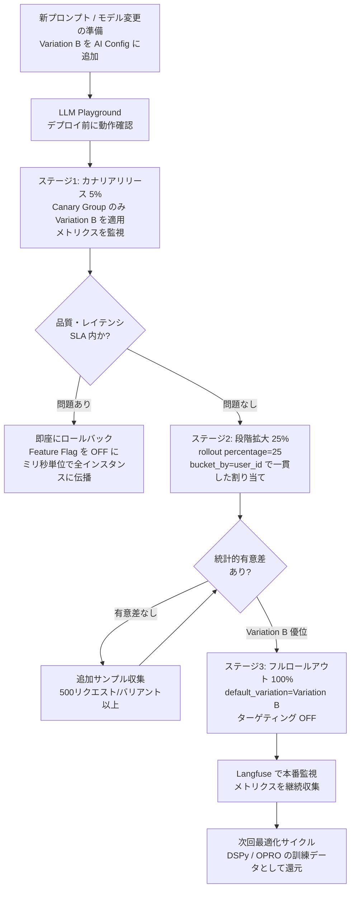

## ブログ概要（Summary）

LaunchDarkly AI Configsは、LLMアプリケーションにおけるモデル設定・プロンプト・ツール定義をランタイムに制御するための機能である。コードデプロイなしでモデル切り替え・プロンプト更新・段階的ロールアウト（5%→25%→100%）を実現し、ユーザーセグメント別のターゲティング・メトリクスベースの実験を可能にする。Completion Mode（単一ステップ補完）とAgent Mode（マルチステップワークフロー）の2つの動作モードを提供する。

この記事は [Zenn記事: LLMプロンプト管理CI/CD：Langfuse×LaunchDarklyでA/Bテストと安全ロールアウト](https://zenn.dev/0h_n0/articles/9fc2f8c4a420e4) の深掘りです。

## 情報源

- **種別**: 企業テックブログ / 公式ドキュメント
- **URL**: [https://launchdarkly.com/docs/home/ai-configs](https://launchdarkly.com/docs/home/ai-configs)
- **組織**: LaunchDarkly
- **発表日**: 2025-2026（継続的更新）

## 技術的背景（Technical Background）

LLMアプリケーションの本番運用では、以下の課題が顕在化している:

1. **モデルバージョン管理**: GPT-4o → GPT-4o-mini への切り替えをコードデプロイなしで行いたい
2. **プロンプト変更の影響範囲制御**: プロンプト変更を全ユーザーに一括適用するリスクを避けたい
3. **ユーザーセグメント別最適化**: 無料/有料ユーザーで異なるモデル・プロンプトを使いたい
4. **コスト制御**: トラフィック量に応じてモデルを動的に切り替えたい（ピーク時はGPT-4o-mini、通常時はGPT-4o）

LaunchDarkly AI Configsは、これらの課題をFeature Flag基盤の上に解決する。Zenn記事ではLaunchDarklyのランタイム切替の概要を紹介したが、本記事では公式ドキュメントベースでCompletion Mode / Agent Modeの技術的詳細と実装パターンを深掘りする。

## 実装アーキテクチャ（Architecture）

### AI Configsのデータモデル

AI Configsは単一のリソースとして、以下のコンポーネントで構成される:

```
AI Config
├── variations: [                 # バリエーション（複数定義可能）
│   ├── Variation A: {
│   │   model: { name: "gpt-4o", temperature: 0.3 },
│   │   messages: [
│   │     { role: "system", content: "..." },
│   │     { role: "user", content: "{{input}}" }
│   │   ]
│   │ }
│   └── Variation B: {
│       model: { name: "gpt-4o-mini", temperature: 0.5 },
│       messages: [
│         { role: "system", content: "..." },
│         { role: "user", content: "{{input}}" }
│       ]
│     }
│ ]
├── targeting_rules: [            # ターゲティングルール
│   ├── Rule 1: "premium users" → Variation A
│   └── Rule 2: "free users" → Variation B
│ ]
├── rollout: {                    # 段階的ロールアウト設定
│   percentage: 25,               # Variation Aを25%のトラフィックに適用
│   fallback: "Variation B"
│ }
└── metrics: {                    # 自動トラッキング
    generation_count,
    token_usage,
    satisfaction_rate
  }
```

### Completion Mode vs Agent Mode

**Completion Mode**: 単一ステップの補完に使用。メッセージとロールでプロンプトを構成する。

```typescript
// Completion Mode の実装例
const aiConfig = await aiClient.completionConfig(
  "article-summarizer",           // AI Config名
  { kind: "user", key: userId },  // ユーザーコンテキスト
  { enabled: false },             // デフォルト値（フォールバック）
  { article: articleText }        // テンプレート変数
);

if (!aiConfig.enabled) {
  return fallbackSummarize(articleText);
}

const completion = await aiConfig.tracker.trackOpenAIMetrics(
  async () => openai.chat.completions.create({
    messages: aiConfig.messages ?? [],
    model: aiConfig.model?.name ?? "gpt-4o",
  })
);
```

**Agent Mode**: マルチステップのワークフローに使用。命令文とオプショナルなツール定義で構成する。

```typescript
// Agent Mode の実装例（マルチエージェント）
const agentConfig = await aiClient.agentConfig(
  "research-agent",
  { kind: "user", key: userId },
  { enabled: false },
  { query: userQuery }
);

// 命令文とツール定義をランタイムで取得
const instructions = agentConfig.instructions;
const tools = agentConfig.tools;

// LangGraphやOpenAI Agents SDKとの統合
const agent = new Agent({
  instructions: instructions,
  tools: tools,
  model: agentConfig.model?.name
});
```

Agent Modeでは、ツールの追加・削除・パラメータ変更もコードデプロイなしで実行可能。

### SDK統合（5言語対応）

LaunchDarkly AI SDKは以下の言語をサポート:

| 言語 | パッケージ | 備考 |
|------|-----------|------|
| Node.js | `@launchdarkly/server-sdk-ai` | サーバーサイド用 |
| Python | `launchdarkly-server-sdk-ai` | FastAPI/Django統合 |
| .NET | `LaunchDarkly.ServerSdk.Ai` | ASP.NET Core対応 |
| Go | `github.com/launchdarkly/go-server-sdk-ai` | 高パフォーマンス用 |
| Ruby | `launchdarkly-server-sdk-ai` | Rails統合 |

#### Node.js実装の完全例

```typescript
import { init } from "@launchdarkly/node-server-sdk";
import { initAi } from "@launchdarkly/server-sdk-ai";
import OpenAI from "openai";

// LaunchDarklyクライアント初期化
const ldClient = init(process.env.LAUNCHDARKLY_SDK_KEY!);
await ldClient.waitForInitialization();
const aiClient = initAi(ldClient);

export async function summarize(
  userId: string,
  text: string
): Promise<string> {
  // AI Configから設定を取得
  const aiConfig = await aiClient.completionConfig(
    "article-summarizer",
    { kind: "user", key: userId },
    { enabled: false },
    { article: text }
  );

  // フォールバック（Feature Flagが無効の場合）
  if (!aiConfig.enabled) {
    return fallbackSummarize(text);
  }

  // メトリクス自動トラッキング付きのOpenAI呼び出し
  const completion = await aiConfig.tracker.trackOpenAIMetrics(
    async () => new OpenAI().chat.completions.create({
      messages: aiConfig.messages ?? [],
      model: aiConfig.model?.name ?? "gpt-4o",
    })
  );

  return completion.choices[0].message.content ?? "";
}
```

## パフォーマンス最適化（Performance）

### 段階的ロールアウト戦略

Zenn記事で紹介した段階的ロールアウト（5%→25%→100%）の技術的実装:



**ステージ1: カナリアリリース（5%）**
```
ターゲティングルール:
  IF user.id IN canary_group THEN
    → Variation B (新プロンプト)
  ELSE
    → Variation A (現行プロンプト)
```

**ステージ2: 段階拡大（25%）**
```
ロールアウト設定:
  percentage: 25
  bucket_by: "user_id"  # ユーザー単位で一貫したバリアント割り当て
```

**ステージ3: フルロールアウト（100%）**
```
targeting: OFF
default_variation: Variation B
```

### メトリクスダッシュボード

AI Configsは以下のメトリクスを自動収集する:

| メトリクス | 説明 | 判定基準例 |
|-----------|------|-----------|
| Generation Count | 各バリエーションの呼び出し回数 | 統計的有意性の確認 |
| Token Usage | 入力/出力トークン数 | コスト比較 |
| Latency | 応答時間（p50, p95, p99） | SLA遵守 |
| Satisfaction | ユーザー満足度スコア | 品質ゲート |

### LLM Playground

AI Configsに統合されたLLM Playgroundで、デプロイ前にプロンプトの動作確認が可能:

1. LaunchDarkly UIでプロンプトを編集
2. Playgroundでテスト入力に対する応答を確認
3. 問題なければバリエーションとして保存
4. ターゲティングルールを設定してロールアウト

## 運用での学び（Production Lessons）

### Langfuseとの使い分け

| 機能 | Langfuse | LaunchDarkly AI Configs |
|------|----------|----------------------|
| プロンプトバージョニング | ○（線形バージョン） | ○（バリエーション） |
| A/Bテスト | ○（ランダム選択） | ○（ターゲティング対応） |
| 段階的ロールアウト | △（手動） | ○（%指定で自動） |
| ユーザーセグメント別 | △（アプリ側実装） | ○（ターゲティングルール） |
| オブザーバビリティ | ○（詳細トレーシング） | △（メトリクスのみ） |
| コスト | 無料（OSS版） | 有料（エンタープライズ） |
| セルフホスト | ○ | × |

**推奨アーキテクチャ**: LangfuseとLaunchDarklyは競合ではなく補完関係。Langfuseは**詳細トレーシング・評価・プロンプト開発**に、LaunchDarklyは**段階ロールアウト・ターゲティング・緊急ロールバック**に使う。

### 緊急ロールバック

```typescript
// 緊急時: Feature Flagを無効化して全トラフィックをフォールバックに
// LaunchDarkly UIから1クリック、またはAPI:
await ldClient.variation("article-summarizer", user, { enabled: false });
// → 全ユーザーがfallbackSummarize()を使用
```

ロールバック完了まで**ミリ秒単位**。LaunchDarkly SDKのストリーミング接続により、フラグ変更はリアルタイムに全インスタンスへ伝播する。

### RAG構成管理への応用

AI Configsの高度な応用として、RAG（検索拡張生成）の構成要素もランタイム制御できる:

- **検索戦略**: どのベクトルインデックスを使用するか
- **チャンキング戦略**: チャンクサイズ・オーバーラップの設定
- **プロンプト構成**: 検索結果の注入方法

```typescript
const ragConfig = await aiClient.completionConfig(
  "rag-pipeline",
  { kind: "user", key: userId },
  { enabled: false },
  {
    query: userQuery,
    retrieval_source: "pinecone-v2",  // LaunchDarklyで切替可能
    chunk_size: 512                    // LaunchDarklyで調整可能
  }
);
```

## 学術研究との関連（Academic Connection）

### Feature Flagの学術的位置づけ

Feature Flagは元来、ソフトウェアエンジニアリングのデプロイ手法として研究されてきた。LLMアプリケーションへの応用は、以下の学術的文脈に位置づけられる:

- **MLOps (Symeonidis et al., 2022)**: 機械学習の運用ライフサイクル全体の管理
- **Continuous Experimentation**: A/Bテストと段階的ロールアウトの体系的実施
- **Safety-Critical ML Deployment**: 医療・金融など高リスクドメインでの段階的導入

LaunchDarkly AI Configsは、これらの学術的知見を製品化したものと位置づけられる。特にOPRO（arXiv: 2309.03409）やDSPy（arXiv: 2310.11511）で最適化されたプロンプトを**安全にデプロイする出口**としてのFeature Flag基盤の役割が重要。

### Langfuseフィードバックループとの統合

1. DSPy/OPROで最適化 → 候補プロンプト生成
2. Promptfooで品質ゲート → CI/CDで自動評価
3. **LaunchDarkly AI Configsで段階ロールアウト** → 5%→25%→100%
4. Langfuseで本番監視 → メトリクス収集
5. フィードバック → 次回DSPy/OPRO最適化の入力

## まとめと実践への示唆

LaunchDarkly AI Configsは、LLMアプリケーションの「デプロイの最後の一マイル」を安全にする。Zenn記事の3層防御アーキテクチャにおけるLayer 2（Feature Flag段階的ロールアウト）の実装基盤として、プロンプト変更による本番障害ゼロの実現に寄与する。

月間10万リクエスト以上のプロダクションでは、LaunchDarklyのターゲティング・段階ロールアウト・リアルタイムメトリクスのROIが特に高い。10万リクエスト未満の場合は、Langfuseのラベル機能によるシンプルなA/Bテストで十分にスタートできる。

## 参考文献

- **Blog URL**: [https://launchdarkly.com/docs/home/ai-configs](https://launchdarkly.com/docs/home/ai-configs)
- **AI Prompt Flags**: [https://launchdarkly.com/docs/home/flags/ai-prompt-flags](https://launchdarkly.com/docs/home/flags/ai-prompt-flags)
- **Quickstart**: [https://launchdarkly.com/docs/home/ai-configs/quickstart](https://launchdarkly.com/docs/home/ai-configs/quickstart)
- **Related Zenn article**: [https://zenn.dev/0h_n0/articles/9fc2f8c4a420e4](https://zenn.dev/0h_n0/articles/9fc2f8c4a420e4)
