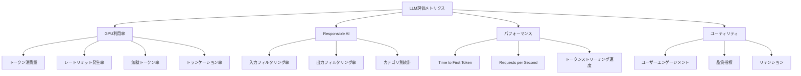
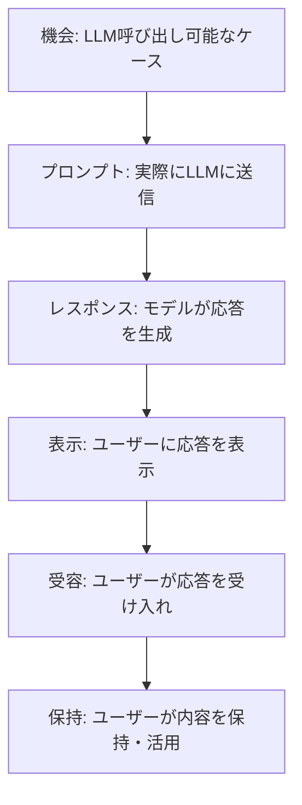
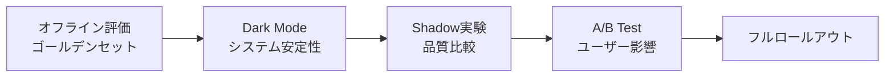

## ブログ概要（Summary）

Microsoft Researchの「How to Evaluate LLMs: A Complete Metric Framework」は、Azure AI Foundryでの大規模LLM運用経験から導き出された**包括的な評価メトリクスフレームワーク**を体系化した記事である。評価軸を**GPU利用率**・**Responsible AI**・**パフォーマンス**・**ユーティリティ**の4次元に分類し、各軸に具体的なメトリクスと測定方法を定義する。さらに、**シャドウ実験**（Shadow Experiment）と**0-1実験**による段階的デプロイ手法を提案し、本番トラフィックでのLLM品質を安全に検証する方法論を示している。

この記事は [Zenn記事: LLMアプリの本番CI/CD戦略：カナリアデプロイと品質ゲートで安全にリリースする](https://zenn.dev/0h_n0/articles/d13e9d53c69e12) の深掘りです。

## 情報源

- **種別**: 企業テックブログ（Microsoft Research）
- **URL**: [https://www.microsoft.com/en-us/research/articles/how-to-evaluate-llms-a-complete-metric-framework/](https://www.microsoft.com/en-us/research/articles/how-to-evaluate-llms-a-complete-metric-framework/)
- **組織**: Microsoft Research, Experimentation Platform (ExP) チーム
- **発表日**: 2024年

## 技術的背景（Technical Background）

### なぜ従来のベンチマークでは不十分か

Microsoftは、MMLU等の学術ベンチマークだけでは本番LLMの品質を評価できないと指摘する。その理由：

1. **ユーザー行動の反映**: ベンチマークは人工的なタスクセットであり、実際のユーザーの使い方を反映しない
2. **ビジネスインパクト**: 精度0.5%の改善がユーザー体験にどの程度影響するかがベンチマークからは分からない
3. **安全性の網羅性**: ベンチマークでは現れない攻撃パターンが本番環境では発生する
4. **コスト効率**: GPU利用率とモデル品質のトレードオフはベンチマークでは測定できない

「**ユーザートラフィックでのLLM性能測定が不可欠**」—これが本フレームワークの出発点である。

### LLM固有の評価課題

| 課題 | 説明 | 対処法 |
|------|------|--------|
| 非決定性 | 同一入力に対して出力が変動 | 複数回実行の統計処理 |
| 多次元品質 | 正確性・流暢性・安全性が独立 | 多軸メトリクス |
| グラウンドトゥルース不在 | 正解が定義できないタスク | LLM-as-Judge |
| 長期効果 | ユーザー定着率への影響 | 長期A/B実験 |

## 実装アーキテクチャ（Architecture）

### 4次元メトリクスフレームワーク



#### 軸1: GPU利用率メトリクス

LLM推論のコスト効率を測定する。

**トークン消費量**:

$$
C_{\text{total}} = C_{\text{prompt}} + C_{\text{completion}}
$$

ここで、
- $C_{\text{prompt}}$: 入力プロンプトのトークン数
- $C_{\text{completion}}$: 出力のトークン数

Microsoftによると、**1トークン ≈ 4文字 ≈ 0.75単語**（英語の場合）が実用的な変換係数である。

**無駄トークン率（Wasted Utilization）**:

$$
W = \frac{C_{\text{non-actionable}}}{C_{\text{total}}}
$$

ここで $C_{\text{non-actionable}}$ はトランケーション、エラー応答、無関係な出力に消費されたトークン数。この指標を最適化することで、不要なAPIコストを削減できる。

**トランケーション検出**:

```python
from dataclasses import dataclass

@dataclass
class CompletionMetrics:
    """LLM応答のメトリクス集計

    API応答からGPU利用率メトリクスを収集する。
    """
    total_prompt_tokens: int = 0
    total_completion_tokens: int = 0
    truncation_count: int = 0
    error_count: int = 0
    rate_limit_count: int = 0

    def record_response(self, response: dict) -> None:
        """API応答からメトリクスを記録

        Args:
            response: LLM APIのレスポンス辞書
        """
        usage = response.get("usage", {})
        self.total_prompt_tokens += usage.get("prompt_tokens", 0)
        self.total_completion_tokens += usage.get("completion_tokens", 0)

        # トランケーション検出
        finish_reason = response.get("choices", [{}])[0].get(
            "finish_reason", ""
        )
        if finish_reason == "length":
            self.truncation_count += 1

    def record_error(self, status_code: int) -> None:
        """エラーレスポンスを記録

        Args:
            status_code: HTTPステータスコード
        """
        if status_code == 429:
            self.rate_limit_count += 1
        self.error_count += 1

    @property
    def wasted_ratio(self) -> float:
        """無駄トークン率を計算

        Returns:
            無駄トークンの割合（0.0-1.0）
        """
        total = self.total_prompt_tokens + self.total_completion_tokens
        if total == 0:
            return 0.0
        # トランケーション分のトークンは無駄
        estimated_waste = self.truncation_count * 100  # 概算
        return min(estimated_waste / total, 1.0)
```

#### 軸2: Responsible AI メトリクス

安全性と倫理的側面を定量化する：

- **入力フィルタリング率**: Content Filterによるプロンプトブロック率（HTTP 400）
- **出力フィルタリング率**: 応答のフィルタリング率（finish_reason: content_filter）
- **カテゴリ別統計**: violence, sexual, hate, self-harm等のカテゴリ別ブロック率

これらのメトリクスは、モデル変更やプロンプト変更後の**安全性リグレッション検出**に使用する。

#### 軸3: パフォーマンスメトリクス

ユーザー体験に直結するレイテンシとスループット：

$$
T_{\text{TTFT}} = t_{\text{first\_token}} - t_{\text{request}}
$$

ここで、
- $T_{\text{TTFT}}$: Time to First Token（最初のトークンまでの時間）
- $t_{\text{first\_token}}$: 最初のトークン受信時刻
- $t_{\text{request}}$: リクエスト送信時刻

パーセンタイルでの計測が推奨される：P50, P90, P95, P99。

**トークンストリーミング速度**:

$$
v_{\text{stream}} = \frac{N_{\text{tokens}}}{T_{\text{total}} - T_{\text{TTFT}}}
$$

ここで $N_{\text{tokens}}$ は生成トークン数、$T_{\text{total}}$ は応答完了までの総時間。

#### 軸4: ユーティリティメトリクス

実際のユーザー価値を測定する、最も重要かつ測定困難な軸。

**プロンプト-レスポンスファネル**:



各段階での離脱率を測定することで、LLM品質のボトルネックを特定できる。

**品質シグナル**:

```python
from dataclasses import dataclass
from typing import Optional

@dataclass
class UtilityMetrics:
    """ユーティリティメトリクスの収集と分析

    ユーザーのLLM応答に対するエンゲージメントを多角的に測定。
    """
    # エンゲージメント
    thumbs_up: int = 0
    thumbs_down: int = 0
    # 品質シグナル
    prompt_lengths: list[int] = None
    response_lengths: list[int] = None
    edit_distances: list[float] = None
    # リテンション
    conversation_lengths: list[int] = None
    daily_active_users: int = 0

    def __post_init__(self) -> None:
        self.prompt_lengths = self.prompt_lengths or []
        self.response_lengths = self.response_lengths or []
        self.edit_distances = self.edit_distances or []
        self.conversation_lengths = self.conversation_lengths or []

    @property
    def satisfaction_rate(self) -> Optional[float]:
        """ユーザー満足率

        Returns:
            thumbs_up / (thumbs_up + thumbs_down)、データ不足時はNone
        """
        total = self.thumbs_up + self.thumbs_down
        if total == 0:
            return None
        return self.thumbs_up / total

    @property
    def reformulation_rate(self) -> float:
        """プロンプト再構成率（ユーザーが質問を言い換えた割合）

        連続するプロンプト間の編集距離が閾値以上の場合を
        「再構成」と判定する。

        Returns:
            再構成の割合（0.0-1.0）
        """
        if len(self.edit_distances) < 2:
            return 0.0
        threshold = 0.3  # 30%以上の変更 = 再構成
        reformulations = sum(
            1 for d in self.edit_distances if d > threshold
        )
        return reformulations / len(self.edit_distances)
```

**Edit Distance メトリクス**:

連続するプロンプト間の編集距離は、ユーザーがLLMの応答に満足しているかの間接指標：

$$
d_{\text{edit}}(p_t, p_{t+1}) = \frac{\text{Levenshtein}(p_t, p_{t+1})}{\max(|p_t|, |p_{t+1}|)}
$$

高い再構成率は、LLMの応答品質が低い（ユーザーが質問を何度も言い換える必要がある）ことを示唆する。

### 実験手法（Experimentation）

Microsoftが提案する段階的なデプロイ実験手法：

#### Phase 1: Dark Mode Experiment（暗黙的実験）

機能のコンポーネントをロードするが、ユーザーには見せない。

**目的**: システム安定性の確認（GPU利用率、レイテンシ、エラー率のみ計測）

```python
class DarkModeExperiment:
    """Dark Mode実験の制御

    LLM機能を内部的にロードするがユーザーには非公開。
    システムメトリクスのみを収集する。
    """

    def __init__(self, feature_flag: str, sample_rate: float = 0.01):
        """
        Args:
            feature_flag: 機能フラグ名
            sample_rate: サンプリング率（デフォルト1%）
        """
        self.feature_flag = feature_flag
        self.sample_rate = sample_rate

    def should_activate(self, user_id: str) -> bool:
        """Dark Modeを有効化すべきか判定

        Args:
            user_id: ユーザーID

        Returns:
            有効化する場合True
        """
        import hashlib
        h = int(hashlib.sha256(user_id.encode()).hexdigest(), 16)
        return (h % 10000) < (self.sample_rate * 10000)

    def execute(self, user_id: str, prompt: str) -> dict:
        """Dark Modeでの実行（結果はユーザーに見せない）

        Args:
            user_id: ユーザーID
            prompt: プロンプト

        Returns:
            メトリクスのみ含む辞書
        """
        if not self.should_activate(user_id):
            return {"activated": False}

        # LLM呼び出し（結果はメトリクス収集のみに使用）
        metrics = self._collect_metrics(prompt)
        return {"activated": True, "metrics": metrics}

    def _collect_metrics(self, prompt: str) -> dict:
        """メトリクス収集（実装は環境依存）"""
        raise NotImplementedError
```

#### Phase 2: 0-1 Experiment（フル機能ロールアウト）

制御されたフェーズでの完全な機能公開。

**目的**: GPU容量の確保、全体的なプロダクトメトリクスの保持、生産性向上の実証

#### Phase 3: Shadow Experiment（シャドウ実験）

同一ユーザーにcontrolとtreatmentの両方の応答を生成するが、ユーザーにはcontrolのみを表示。

$$
\text{ATE} = \frac{1}{N} \sum_{i=1}^{N} (Y_i^{\text{treatment}} - Y_i^{\text{control}})
$$

ここで、
- $\text{ATE}$: Average Treatment Effect（平均処置効果）
- $Y_i^{\text{treatment}}$: 処置群（新バージョン）のメトリクス
- $Y_i^{\text{control}}$: 対照群（現行バージョン）のメトリクス

**シャドウ実験の利点**:
- 同一ユーザーの比較（対応のある検定）により、**分散が大幅に削減**され、少ないサンプル数で有意差を検出可能
- ユーザー体験にリスクなし（常にcontrolを表示）
- GPU利用率、レイテンシ、RAIメトリクス、トークン効率を安全に比較

**シャドウ実験の制約**:
- ユーザーエンゲージメント指標（thumbs up/down等）は測定不可能（treatmentが非表示のため）
- GPUコストが2倍（両方の応答を生成するため）

#### Phase 4: 1-N Experiment（A/B テスト）

標準的なA/Bテスト。プロンプト最適化、モデルバージョンアップグレード、UX改善の反復評価。

**統計的考慮事項**: シャドウ実験では**対応のあるt検定**（paired-sample t-test）を使用し、感度を最大化する。

## パフォーマンス最適化（Performance）

### コスト最適化のレバー

1. **Completion Token削減**: `max_tokens`パラメータの適切な設定で不要なトークン生成を防止
2. **トランケーション削減**: 出力が切れる場合はmax_tokensを増やすか、プロンプトを短縮
3. **キャッシング**: 同一プロンプトの応答をキャッシュ（Braintrust LLM Proxyのアプローチ）
4. **モデルルーティング**: タスク難易度に応じて軽量モデル/重量モデルを使い分け

### レイテンシ最適化

| 最適化手法 | P50改善 | P99改善 | 適用条件 |
|-----------|---------|---------|---------|
| ストリーミング応答 | -50% TTFT | -30% TTFT | インタラクティブUI |
| プロンプト圧縮 | -20% E2E | -15% E2E | 長文コンテキスト |
| バッチ処理 | +200% スループット | — | 非同期処理 |
| モデルルーティング | -60% E2E (簡易タスク) | — | 混合ワークロード |

## 運用での学び（Production Lessons）

### データ収集パイプライン

本フレームワークの実装には以下のデータ収集が必須：

1. **OpenAI API応答のプロパティ全収集**: usage（トークン数）、finish_reason、モデルID
2. **エンドユーザーID**: A/B実験のバケット割り当てに必要
3. **ユーザー編集とマシン編集の区別**: Auto-completionシナリオでは、ユーザーの手動編集とLLM生成の区別が品質評価に不可欠

### 実験設計のベストプラクティス

- **オフライン評価をまず実施**: 本番トラフィックへの影響を最小化
- **次にDark Mode / Shadow**: システムメトリクスを安全に検証
- **最後にA/B Test**: ユーザーエンゲージメントの最終検証



## 学術研究との関連（Academic Connection）

- **A/B Testing at Scale**: Microsoft ExPチームの実験プラットフォームは、Kohavi et al. (2020) "Trustworthy Online Controlled Experiments"の実装
- **LLM-as-Judge**: 本フレームワークのユーティリティ評価は、Zheng et al. (2023) "MT-Bench and Chatbot Arena"で提案されたLLM審判手法を実運用に適用
- **Causal Inference**: Shadow実験のATEは、Rubin (1974) の因果推論フレームワークをLLM評価に応用

## まとめと実践への示唆

Microsoftの評価メトリクスフレームワークは、LLMの本番運用における品質管理を4軸で体系化した実践的な指針である。

**主要なポイント**:
- GPU利用率・安全性・パフォーマンス・ユーティリティの4軸で多角的に評価
- シャドウ実験で対応のあるt検定を使用し、少ないサンプル数で品質差を検出
- プロンプト-レスポンスファネルでLLM品質のボトルネックを可視化

**Zenn記事への示唆**:
[元のZenn記事](https://zenn.dev/0h_n0/articles/d13e9d53c69e12)のカナリアデプロイは、本フレームワークの「Phase 2: 0-1 Experiment」に相当する。Shadow Experiment（Phase 3）を追加することで、ユーザー体験にリスクなく品質比較が可能になる。特に、分散削減による少サンプルでの有意差検出は、Zenn記事で指摘した「カナリア比率5%ではサンプル数が少なく統計的に有意な差を検出できない」問題への有力な解決策となる。

## 参考文献

- **Blog URL**: [https://www.microsoft.com/en-us/research/articles/how-to-evaluate-llms-a-complete-metric-framework/](https://www.microsoft.com/en-us/research/articles/how-to-evaluate-llms-a-complete-metric-framework/)
- **Azure AI Foundry Evaluation**: [https://techcommunity.microsoft.com/blog/azure-ai-foundry-blog/how-microsoft-evaluates-llms-in-azure-ai-foundry-a-practical-end-to-end-playbook/4459449](https://techcommunity.microsoft.com/blog/azure-ai-foundry-blog/how-microsoft-evaluates-llms-in-azure-ai-foundry-a-practical-end-to-end-playbook/4459449)
- **Related Papers**: Kohavi et al. (2020) "Trustworthy Online Controlled Experiments"
- **Related Zenn article**: [https://zenn.dev/0h_n0/articles/d13e9d53c69e12](https://zenn.dev/0h_n0/articles/d13e9d53c69e12)
