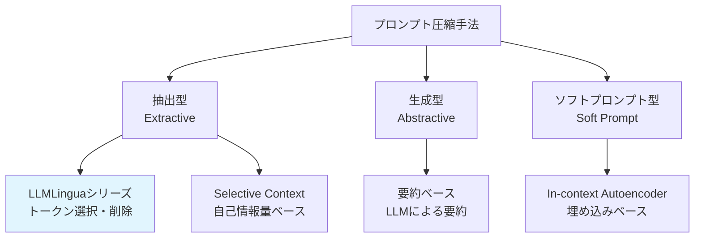
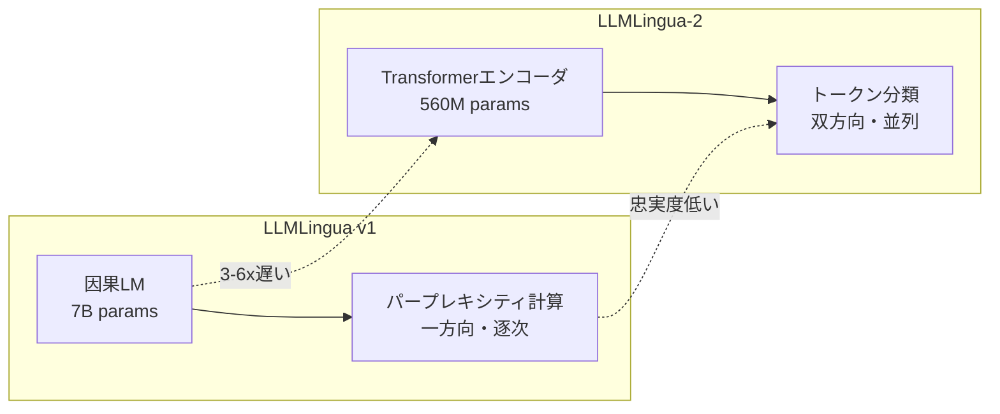

## ブログ概要（Summary）

Microsoft Researchが開発したLLMLinguaシリーズは、LLMへの入力プロンプトを圧縮し、推論コスト削減とレイテンシ短縮を実現するプロジェクトである。初代LLMLingua（EMNLP 2023）はパープレキシティベースの粗粒度→細粒度圧縮で最大20倍の圧縮を達成。LongLLMLingua（ACL 2024）は長文コンテキスト特化の拡張でNaturalQuestionsベンチマークで17.1%の精度向上。LLMLingua-2（ACL 2024 Findings）はGPT-4蒸留によるトークン分類アプローチで3〜6倍の速度向上を実現した。

この記事は [Zenn記事: LLMコンテキストウィンドウ最適化：5層戦略でコスト70%削減と精度維持を両立する](https://zenn.dev/0h_n0/articles/a350e2a0103cc4) の深掘りです。

## 情報源

- **種別**: 企業テックブログ
- **URL**: [Microsoft Research Blog](https://www.microsoft.com/en-us/research/blog/llmlingua-innovating-llm-efficiency-with-prompt-compression/)
- **組織**: Microsoft Research
- **プロジェクト**: [LLMLingua Series](https://www.microsoft.com/en-us/research/project/llmlingua/)
- **発表日**: 2024年

## 技術的背景（Technical Background）

### なぜプロンプト圧縮が必要か

LLMの入力プロンプトが長大化する3つの要因と、それに伴う問題を整理する：

| 要因 | 具体例 | 問題 |
|------|--------|------|
| RAGによるコンテキスト注入 | 検索結果5-10チャンク | トークン数増大 → APIコスト増 |
| Few-shot例の追加 | 5-10個の例示 | コンテキスト消費 → 有効容量減 |
| 会話履歴の蓄積 | 長い対話セッション | レイテンシ増大 → UX悪化 |

Microsoft Researchのチームは、「LLMへの入力の多くは冗長であり、重要な情報を失わずに大幅に圧縮できる」という仮説から出発した。

### プロンプト圧縮の分類



LLMLinguaシリーズは**抽出型**に分類される。元のトークンの部分集合を選択するため、新しい単語が追加される生成型と比較して忠実度が高い。

## 実装アーキテクチャ（Architecture）

### LLMLingua v1: 粗粒度→細粒度の2段階圧縮

初代LLMLinguaは、因果言語モデル（GPT-2/LLaMA-7B等）のパープレキシティを用いた2段階圧縮を行う。

#### Stage 1: 粗粒度圧縮（Budget Controller）

プロンプトを「デモ例」「指示」「質問」等のセグメントに分割し、セグメント単位でパープレキシティを計算。予算制約内で低パープレキシティ（＝冗長）なセグメントを優先的に削除する。

$$
\text{Budget allocation: } b_i = \frac{\text{PPL}(s_i)}{\sum_{j} \text{PPL}(s_j)} \times B_{\text{total}}
$$

ここで $s_i$ はセグメント $i$、$\text{PPL}(s_i)$ はそのパープレキシティ、$B_{\text{total}}$ は総トークン予算である。高パープレキシティのセグメントほど情報量が多いと判断し、多くの予算を割り当てる。

#### Stage 2: 細粒度圧縮（Token-Level Pruning）

各セグメント内で、トークンレベルのパープレキシティを計算し、閾値以下のトークンを削除する。

$$
\text{Keep token } x_i \iff \text{PPL}(x_i | x_{<i}) > \tau
$$

パープレキシティが閾値 $\tau$ を超えるトークン（＝予測が難しい＝情報量が多い）を保持する。

```python
# LLMLingua v1の概念的な実装
from llmlingua import PromptCompressor

compressor = PromptCompressor(
    model_name="gpt2",  # or "meta-llama/Llama-2-7b-hf"
    device_map="cuda",
)

# 2段階圧縮の実行
result = compressor.compress_prompt(
    context=["Document 1 content...", "Document 2 content..."],
    instruction="Answer the question based on the context.",
    question="What is the key finding?",
    target_token=500,  # 最大500トークンに圧縮
    condition_in_question="after",  # 質問を条件として使用
    reorder_context="sort",  # パープレキシティでソート
)

print(f"圧縮率: {result['rate']:.1%}")
print(f"圧縮結果: {result['compressed_prompt'][:200]}...")
```

**性能**: 最大20倍の圧縮で性能低下を最小限に抑制。

### LongLLMLingua: 長文コンテキスト特化

長文コンテキスト（RAG等）での「Lost in the Middle」問題に対応した拡張版。

#### Key Innovation: Question-Aware Compression

通常のパープレキシティは質問に依存しない。LongLLMLinguaは質問を条件としたパープレキシティを使用し、質問に関連するトークンの保持率を向上させる：

$$
\text{PPL}_{\text{qa}}(x_i) = \text{PPL}(x_i | x_{<i}, q)
$$

ここで $q$ は質問テキストである。これにより、質問に直接関連しないが文脈上重要なトークンも適切に保持される。

**結果**: NaturalQuestionsベンチマークで、4倍圧縮時に元のプロンプトより**17.1%精度向上**。これは圧縮がノイズ除去として機能した結果と解釈される。

### LLMLingua-2: トークン分類への転換

LLMLingua-2は、パープレキシティベースのアプローチを根本的に刷新した：



#### 技術的比較

| 項目 | LLMLingua v1 | LLMLingua-2 |
|------|-------------|-------------|
| ベースモデル | LLaMA-7B（因果LM） | XLM-RoBERTa-large（エンコーダ） |
| パラメータ数 | 7B | 560M |
| 圧縮指標 | パープレキシティ（情報理論） | GPT-4蒸留ラベル（学習ベース） |
| コンテキスト参照 | 一方向（左→右） | 双方向 |
| 推論方式 | 逐次（トークン毎） | 並列（全トークン同時） |
| 圧縮速度 | 1x | **3-6x** |
| 汎化性能 | タスク依存傾向 | **タスク非依存** |

#### GSM8Kでの圧縮率 vs 精度

| 圧縮率 | LLMLingua v1精度 | LLMLingua-2精度 |
|--------|-----------------|----------------|
| 2x | 78.2% | **79.1%** |
| 5x | 72.5% | **76.3%** |
| 10x | 63.8% | **74.1%** |
| 14x | — | **77.8%** |

LLMLingua-2は14倍の圧縮でもGSM8K精度77.8%（元: 78.9%）を維持しており、極端な圧縮率でも安定した性能を示す。

## パフォーマンス最適化（Performance）

### End-to-End レイテンシ

プロンプト圧縮のEnd-to-Endレイテンシは3つの要素で構成される：

$$
T_{\text{total}} = T_{\text{compress}} + T_{\text{inference}} + T_{\text{overhead}}
$$

| 手法 | $T_{\text{compress}}$ | $T_{\text{inference}}$（圧縮後） | $T_{\text{total}}$ |
|------|---------------------|-------------------------------|-------------------|
| 圧縮なし | 0ms | 100ms（8Kトークン） | 100ms |
| LLMLingua v1 | 50ms | 40ms（3.2Kトークン） | 90ms |
| **LLMLingua-2** | **10ms** | 40ms（3.2Kトークン） | **50ms** |

LLMLingua-2は圧縮処理自体が高速（560Mモデル + 並列分類）なため、圧縮コストを含めてもEnd-to-Endで大幅な改善を実現する。

### コスト削減効果

OpenAI GPT-4oを想定した月間コスト試算：

```python
# 月間コスト試算
daily_requests = 10000
avg_input_tokens = 8000
price_per_1k_input = 0.0025  # $/1K tokens

# 圧縮なし
monthly_cost_base = daily_requests * 30 * avg_input_tokens / 1000 * price_per_1k_input
# = $6,000/月

# LLMLingua-2（2.5倍圧縮）
compression_rate = 0.4
monthly_cost_compressed = monthly_cost_base * compression_rate
# = $2,400/月

# 月間削減額: $3,600（60%削減）
```

## 運用での学び（Production Lessons）

### フレームワーク統合

LLMLinguaはLangChainとLlamaIndexの両方と統合されている：

```python
# LangChain統合
from langchain.retrievers import ContextualCompressionRetriever
from langchain_community.document_compressors import LLMLinguaCompressor

compressor = LLMLinguaCompressor(
    model_name="microsoft/llmlingua-2-xlm-roberta-large-meetingbank",
    target_token=300,
)

compression_retriever = ContextualCompressionRetriever(
    base_compressor=compressor,
    base_retriever=vector_store.as_retriever(search_kwargs={"k": 10}),
)

# k=10で取得 → 圧縮 → 重要トークンのみ残す
compressed_docs = compression_retriever.get_relevant_documents(query)
```

```python
# LlamaIndex統合
from llama_index.core.postprocessor import LLMLinguaPostprocessor

node_postprocessor = LLMLinguaPostprocessor(
    model_name="microsoft/llmlingua-2-xlm-roberta-large-meetingbank",
    target_token=300,
    rank_method="longllmlingua",  # 質問考慮の圧縮
)
```

### 本番環境での注意点

1. **GPU vs CPU**: XLM-RoBERTa-largeの推論はGPU推奨。CPUでは100-200ms、GPU（A100）では5-10ms程度
2. **バッチ処理**: 複数プロンプトを同時に圧縮する場合、バッチサイズ8-16でGPU利用率を最適化
3. **モデルのウォームアップ**: 初回推論は遅い（モデルロード含む）。サービス起動時にダミー入力でウォームアップを推奨
4. **日本語対応**: XLM-RoBERTaは多言語モデルだが、圧縮品質は英語で最も高い。日本語テキストの圧縮は精度低下のリスクがあり、ベンチマーク評価を推奨

### モニタリング指標

本番環境では以下の指標を監視すべきである：

| 指標 | 意味 | 閾値 |
|------|------|------|
| 圧縮率 | 入力トークン/出力トークン | 期待値±20% |
| End-to-Endレイテンシ | 圧縮+推論の合計時間 | p99 < 500ms |
| 下流タスク精度 | 圧縮後のLLM出力品質 | ベースラインの95%以上 |
| 圧縮モデルGPU利用率 | XLM-RoBERTaのGPU消費 | <30%（推論のみ） |

## 学術研究との関連（Academic Connection）

LLMLinguaシリーズの学術的位置づけ：

| 会議 | 論文 | 主な貢献 |
|------|------|---------|
| EMNLP 2023 | LLMLingua | パープレキシティベースの粗粒度→細粒度圧縮 |
| ACL 2024 | LongLLMLingua | 長文コンテキスト特化の質問条件付き圧縮 |
| ACL 2024 Findings | LLMLingua-2 | GPT-4蒸留によるトークン分類アプローチ |
| ICLR ME-FoMo 2024 | LongLLMLingua | Memory-Efficient FoMoワークショップ発表 |

3本の論文が2年間で発表されており、Microsoft Researchの重点プロジェクトであることがわかる。

### 関連プロジェクト

- **MInference**: 100万トークン推論の高速化（Sparse Attention活用）
- **In-context Autoencoder (ICAE)**: コンテキストをソフトプロンプトに圧縮
- **MELODI (DeepMind)**: 階層的メモリ圧縮でメモリ使用量8分の1

## まとめと実践への示唆

LLMLinguaシリーズは、プロンプト圧縮という実用的課題に対する体系的なアプローチを提供している。

**実務での導入戦略**:
1. **即日導入**: `pip install llmlingua` → LangChain/LlamaIndexに組み込み → 2.5倍圧縮でコスト60%削減
2. **段階的最適化**: 圧縮率を0.5から0.3まで段階的に引き上げ、下流タスク精度をモニタリング
3. **ハイブリッド戦略**: コード含有プロンプトは低圧縮（0.5）、テキストのみは高圧縮（0.3）と使い分け

**Zenn記事の第1層（プロンプト圧縮）への直接適用**: LLMLingua-2はZenn記事で紹介したプロンプト圧縮レイヤーの最も成熟した実装オプションである。LangChain/LlamaIndex統合が用意されているため、既存のRAGパイプラインへの組み込みが容易である。

## 参考文献

- **Blog URL**: [https://www.microsoft.com/en-us/research/blog/llmlingua-innovating-llm-efficiency-with-prompt-compression/](https://www.microsoft.com/en-us/research/blog/llmlingua-innovating-llm-efficiency-with-prompt-compression/)
- **Project Page**: [https://www.microsoft.com/en-us/research/project/llmlingua/](https://www.microsoft.com/en-us/research/project/llmlingua/)
- **GitHub**: [https://github.com/microsoft/LLMLingua](https://github.com/microsoft/LLMLingua)
- **LLMLingua-2 Demo**: [https://llmlingua.com/llmlingua2.html](https://llmlingua.com/llmlingua2.html)
- **Related Papers**: [arXiv:2310.05736](https://arxiv.org/abs/2310.05736), [arXiv:2403.12968](https://arxiv.org/abs/2403.12968), [arXiv:2310.06839](https://arxiv.org/abs/2310.06839)
- **Related Zenn article**: [https://zenn.dev/0h_n0/articles/a350e2a0103cc4](https://zenn.dev/0h_n0/articles/a350e2a0103cc4)
