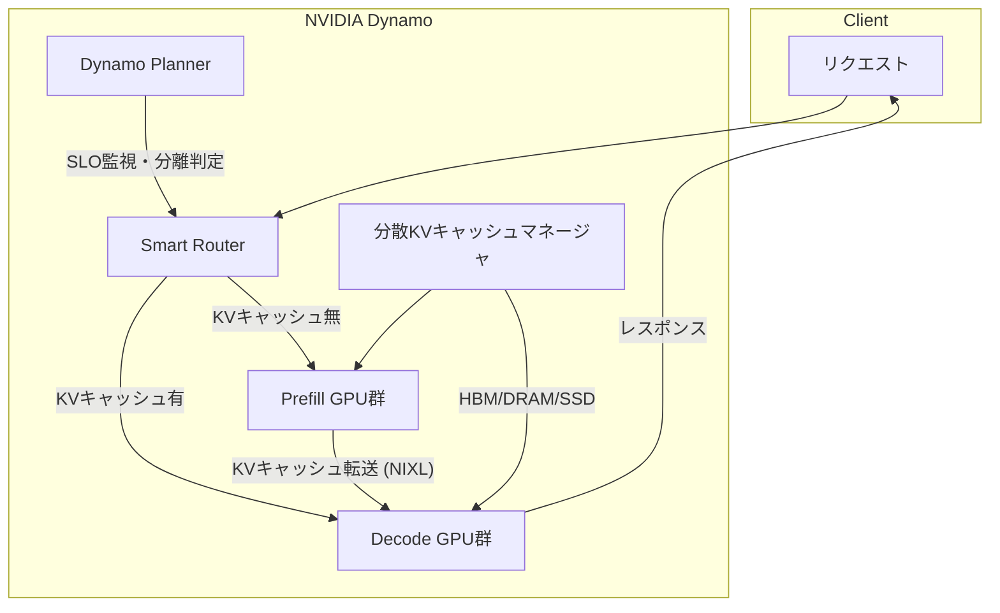

## ブログ概要

NVIDIA Dynamoは、推論AIモデル（特にMoEアーキテクチャ）のスケーリングを目的とした**低レイテンシ分散推論フレームワーク**である。2025年にオープンソースとして公開され（`ai-dynamo/dynamo`リポジトリ）、vLLM・SGLang・TensorRT-LLMと統合可能。中核技術は**Prefill/Decode分離サービング**、**分散KVキャッシュ管理**、**NIXL（NVIDIA Inference Transfer Library）**の3つで、DeepSeek-R1 671BモデルでGB200 NVL72上**最大30倍のスループット向上**を報告している。

この記事は [Zenn記事: Qwen3.5徹底解説：397B MoEモデルをvLLMでデプロイする実践ガイド](https://zenn.dev/0h_n0/articles/657d35a2bbf71d) の深掘りです。

## 情報源

- **公式ブログ**: [Introducing NVIDIA Dynamo](https://developer.nvidia.com/blog/introducing-nvidia-dynamo-a-low-latency-distributed-inference-framework-for-scaling-reasoning-ai-models/)
- **GitHub**: [ai-dynamo/dynamo](https://github.com/ai-dynamo/dynamo)
- **発表**: 2025年

## 技術的背景

LLM推論は2つのフェーズに分かれる：

1. **Prefill（プリフィル）**: ユーザー入力の全トークンを処理し、最初の出力トークンを生成。**計算律速**（Compute-bound）
2. **Decode（デコード）**: 後続トークンを逐次生成。**メモリ帯域律速**（Memory-bound）

従来のサービングフレームワーク（vLLM等）は同一GPUで両フェーズを処理するが、**計算特性が根本的に異なる**ため、GPUリソースの利用効率が悪い。特にMoEモデル（Qwen3.5-397B-A17B、DeepSeek-R1 671B等）ではエキスパート並列が加わり、フェーズ分離の効果がさらに大きくなる。

## 実装アーキテクチャ

NVIDIA Dynamoは4つのコアコンポーネントで構成される。



### 1. 分離型Prefill/Decode

Prefill GPUとDecode GPUを**物理的に分離**し、各フェーズの計算特性に最適化する：

- **Prefill GPU群**: 低いTensor Parallelism（TP）で通信オーバーヘッドを削減。計算密度を最大化
- **Decode GPU群**: 高いTPでメモリ帯域を最大化。KVキャッシュアクセスを高速化

Prefill完了後、KVキャッシュをNIXL経由でDecode GPUに転送する。この分離により、各フェーズのGPUが**常に最適な計算パターンで稼働**できる。

### 2. Dynamo Planner

GPU使用率・キューの深さ・リクエストレートをリアルタイム監視し、アプリケーションSLO（TTFT: Time-To-First-Token、ITL: Inter-Token Latency）と組み合わせて**分離の要否を動的に判定**する。

- 低負荷時: 分離せず同一GPUで処理（オーバーヘッド回避）
- 高負荷時: Prefill/Decode分離を有効化（スループット最大化）

この適応的な判定により、負荷変動に対してロバストなサービングを実現する。

### 3. Smart Router（KVキャッシュルーティング）

**Radix Tree構造**でKVキャッシュの所在をGPUフリート全体で追跡する：

- 新規リクエストのプロンプトをハッシュ化し、既存KVキャッシュとの共通プレフィックスを検索
- キャッシュヒット時は該当GPUにルーティング → **再計算コストをゼロに**
- キャッシュミス時はPrefill GPU群に転送
- 専用のキャッシュ挿入/追い出しアルゴリズムで効率的なキャッシュ管理を実現

マルチターン対話やSystem Promptの共有など、**プレフィックスが共通するリクエストが多い環境**でTTFTを大幅に削減する。

### 4. NIXL（NVIDIA Inference Transfer Library）

**ハードウェア非依存の通信ライブラリ**で、異種メモリ間のデータ移動を統一APIで抽象化する：

- **対応メモリ**: HBM（GPU）、DRAM（CPU）、ローカルSSD、ネットワークストレージ
- **転送方式**: GPUDirect RDMAによるノード間直接通信
- **設計思想**: 高スループット・低レイテンシのPoint-to-Point通信に特化

KVキャッシュのPrefill→Decode転送や、分散KVキャッシュマネージャのストレージ階層間移動で使用される。

## パフォーマンス最適化

### 分散KVキャッシュ管理

アクセス頻度の低いKVキャッシュブロックを**コスト効率の良いストレージ階層にオフロード**する：

```
ストレージ階層:
├── HBM（GPU）: 高速、高コスト → ホットデータ
├── DRAM（CPU）: 中速、中コスト → ウォームデータ
├── ローカルSSD: 低速、低コスト → コールドデータ
└── ネットワークストレージ: 最低速、最低コスト → アーカイブ
```

これにより**ペタバイト規模のKVキャッシュストレージ**を実現しつつ、キャッシュ再利用のメリットを維持する。

### ベンチマーク結果

| 構成 | 結果 |
|------|------|
| DeepSeek-R1 671B on GB200 NVL72 | **最大30倍スループット向上** |
| Llama 70B on Hopper | **2倍以上の性能向上** |
| Smart Router | TTFT・平均リクエストレイテンシの削減 |

### 対応並列化手法

- **Tensor Parallelism（TP）**: Attention/FFN層の分割
- **Pipeline Parallelism（PP）**: 層単位のパイプライン処理
- **Expert Parallelism（EP）**: MoEモデルのエキスパート分散

Qwen3.5-397B-A17BのようなMoEモデルでは、EP + TPの組み合わせでPrefill/Decode分離の効果が最大化される。

## 運用での学び

### フレームワーク統合

DynamoはKVキャッシュマネージャが**フレームワーク非依存**で設計されており、既存のLLMサービングスタック（PyTorch、TensorRT-LLM、vLLM、SGLang）にプラグイン可能。

Qwen3.5のvLLMデプロイにおいて、Dynamoの分離サービングを併用することで：
- **TTFT削減**: Prefill専用GPUで計算密度を最大化
- **ITL削減**: Decode専用GPUでメモリ帯域を最大化
- **KVキャッシュ効率**: Smart Routerによるプレフィックスキャッシュ再利用

### エンタープライズ展開

- **オープンソース**: `ai-dynamo/dynamo`（GitHub）
- **エンタープライズ**: NVIDIA NIMマイクロサービス、NVIDIA AI Enterprise経由

### Qwen3.5デプロイへの示唆

Qwen3.5-397B-A17B（397Bパラメータ、17Bアクティベート）のデプロイにおいて、Dynamoが提供する価値：

1. **メモリ効率**: 397BのパラメータはGPUメモリに常駐が必要だが、活性化は17Bのみ。Prefill/Decode分離でGPUメモリの用途を明確に分割
2. **Expert Parallelism**: 512エキスパートの分散配置とルーティングを最適化
3. **長文コンテキスト**: 256KトークンのKVキャッシュを分散ストレージ階層で管理

## 学術研究との関連

### 分離型サービング研究

Dynamoの分離アーキテクチャは、以下の学術研究の実プロダクション化と位置づけられる：

- **DistServe** (Zhong et al., 2024): Prefill/Decode分離の理論的根拠を提示
- **Splitwise** (Patel et al., 2024): 異種GPU環境でのPhase分離

### MoE推論最適化

- **Expert Parallelism**: GShard (Lepikhin et al., 2021)で提案されたエキスパート分散手法をDynamoが推論時に適用
- **All-to-All通信**: MoEモデルのトークンルーティングに伴うGPU間通信をNIXLが最適化

## まとめ

NVIDIA Dynamoは、MoEモデルの本番推論における3つの根本課題（Prefill/Decode計算特性の不一致、KVキャッシュの分散管理、異種メモリ間通信）に体系的な解決策を提供する。

Qwen3.5-397B-A17BのようなスパースMoEモデルにとって、Dynamoの分離サービングは**活性化17Bの計算効率を最大限に引き出す推論基盤**となる。vLLM/SGLangとの統合が進むことで、`vllm serve`コマンドの背後でDynamoの最適化が透過的に適用される将来が見込まれる。

## 参考文献

- **公式ブログ**: [Introducing NVIDIA Dynamo](https://developer.nvidia.com/blog/introducing-nvidia-dynamo-a-low-latency-distributed-inference-framework-for-scaling-reasoning-ai-models/)
- **GitHub**: [ai-dynamo/dynamo](https://github.com/ai-dynamo/dynamo)
- **Related Zenn article**: [https://zenn.dev/0h_n0/articles/657d35a2bbf71d](https://zenn.dev/0h_n0/articles/657d35a2bbf71d)

---

:::message
この記事はAI（Claude Code）により自動生成されました。内容の正確性については元ブログと照合して検証していますが、実際の利用時は公式ドキュメントもご確認ください。
:::
