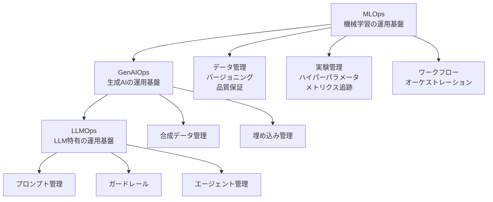
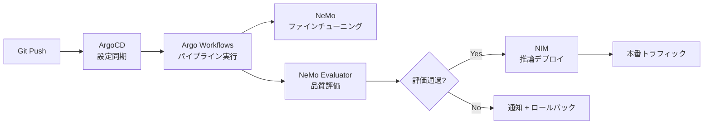

## ブログ概要（Summary）

NVIDIAの技術ブログ「Mastering LLM Techniques: LLMOps」は、LLMアプリケーションを本番環境で運用するための**LLMOps（LLM Operations）**のフレームワークを体系化した記事である。従来のMLOpsを基盤としつつ、LLM固有の5つの運用柱—**プロンプト管理**、**RAGアーキテクチャ**、**ガードレール**、**エージェント/チェーン管理**、**合成データ管理**—を定義する。各柱について技術的な背景、アーキテクチャパターン、具体的なツール（NeMo Guardrails, NIM等）を解説している。

この記事は [Zenn記事: LLMアプリの本番CI/CD戦略：カナリアデプロイと品質ゲートで安全にリリースする](https://zenn.dev/0h_n0/articles/d13e9d53c69e12) の深掘りです。

## 情報源

- **種別**: 企業テックブログ
- **URL**: [https://developer.nvidia.com/blog/mastering-llm-techniques-llmops/](https://developer.nvidia.com/blog/mastering-llm-techniques-llmops/)
- **組織**: NVIDIA
- **発表日**: 2023年11月（更新あり）

## 技術的背景（Technical Background）

### MLOps → GenAIOps → LLMOps の階層構造

NVIDIAは、LLMOpsをMLOpsの特殊化として位置づけている：



従来のMLOpsが提供する6つの基盤機能（インフラ、データ、ワークフロー、モデルレジストリ、実験管理、開発環境）は引き続き必要であり、その上にLLM固有の機能が追加される構造となっている。

### なぜLLMOpsが必要か

従来のMLOpsとLLMOpsの根本的な違い：

| 観点 | 従来のMLOps | LLMOps |
|------|-----------|--------|
| モデルサイズ | 数MB〜数GB | 数GB〜数TB |
| 学習サイクル | 定期的な再学習 | 事前学習+ファインチューニング/プロンプト |
| テスト | 精度・再現率等の決定論的メトリクス | 品質スコア分布（非決定論的） |
| デプロイ単位 | モデルバイナリ | モデル + プロンプト + コンテキスト |
| 推論コスト | 低〜中 | 高（GPU必須） |
| 入出力 | 構造化データ | 非構造化テキスト |

## 実装アーキテクチャ（Architecture）

### 5つの柱の詳細

#### 柱1: プロンプト管理（Prompt Management）

プロンプトを「テキスト」ではなく「パラメータ付きテンプレート」として管理する：

```python
from dataclasses import dataclass
from typing import Any

@dataclass
class PromptTemplate:
    """パラメータ化されたプロンプトテンプレート

    テンプレート変数とモデルパラメータを分離管理し、
    再現可能なLLM呼び出しを実現する。
    """
    template: str
    model: str
    temperature: float
    max_tokens: int
    stop_sequences: list[str]
    metadata: dict[str, Any]

    def render(self, variables: dict[str, str]) -> str:
        """テンプレート変数を展開

        Args:
            variables: テンプレート変数の辞書

        Returns:
            展開されたプロンプト文字列
        """
        rendered = self.template
        for key, value in variables.items():
            rendered = rendered.replace(f"{{{{{key}}}}}", value)
        return rendered

    def to_api_params(self, variables: dict[str, str]) -> dict[str, Any]:
        """API呼び出しパラメータを生成

        Args:
            variables: テンプレート変数の辞書

        Returns:
            LLM API呼び出し用のパラメータ辞書
        """
        return {
            "model": self.model,
            "messages": [{"role": "user", "content": self.render(variables)}],
            "temperature": self.temperature,
            "max_tokens": self.max_tokens,
            "stop": self.stop_sequences,
        }
```

NVIDIAブログが強調する管理の4フェーズ：

1. **作成**: テンプレートの設計と変数定義
2. **保存・バージョニング**: Git管理 + メタデータ（モデル名、パラメータ）
3. **最適化**: A/Bテストと評価メトリクスに基づく反復改善
4. **デプロイ**: ステージング→本番の段階的ロールアウト

#### 柱2: RAGアーキテクチャ（Retrieval-Augmented Generation）

RAGは2段階のプロセスで構成される：

**Stage 1: ドキュメントインジェスト**

$$
\mathbf{e}_i = f_{\text{embed}}(\text{chunk}_i), \quad i = 1, \ldots, N
$$

ここで、
- $\text{chunk}_i$: ドキュメントを分割したテキストチャンク
- $f_{\text{embed}}$: 埋め込みモデル（例: text-embedding-ada-002）
- $\mathbf{e}_i \in \mathbb{R}^d$: $d$次元の埋め込みベクトル
- $N$: チャンク総数

**Stage 2: クエリ処理**

$$
\text{context} = \text{top-}k\left(\text{sim}(f_{\text{embed}}(q), \mathbf{e}_i)\right)_{i=1}^{N}
$$

$$
\text{response} = \text{LLM}(q \oplus \text{context})
$$

ここで、
- $q$: ユーザークエリ
- $\text{sim}(\cdot, \cdot)$: ベクトル類似度関数（コサイン類似度）
- $k$: 取得するコンテキスト数
- $\oplus$: テキスト連結

RAGの品質メトリクス：
- **Citation Coverage**: 応答に含まれる引用元の網羅率
- **Hallucination Rate**: 根拠のない主張の割合
- **Groundedness Score**: コンテキストに基づく応答の割合

#### 柱3: ガードレール（Guardrails）

入出力の安全性を保証するフィルタリング機構：

```python
from enum import Enum

class FilterResult(Enum):
    """フィルタリング結果"""
    PASS = "pass"
    BLOCK = "block"
    WARN = "warn"

class GuardrailPipeline:
    """入出力ガードレールパイプライン

    プロンプトインジェクション検出、有害コンテンツフィルタリング、
    PII除去を段階的に適用する。
    """

    def check_input(self, user_input: str) -> tuple[FilterResult, str]:
        """入力ガードレール

        Args:
            user_input: ユーザー入力テキスト

        Returns:
            (フィルタリング結果, 理由)
        """
        # 1. プロンプトインジェクション検出
        if self._detect_injection(user_input):
            return FilterResult.BLOCK, "prompt_injection_detected"

        # 2. PII検出
        if self._detect_pii(user_input):
            return FilterResult.WARN, "pii_detected"

        # 3. トピック制約チェック
        if not self._check_topic_boundary(user_input):
            return FilterResult.BLOCK, "off_topic"

        return FilterResult.PASS, "ok"

    def check_output(self, llm_output: str) -> tuple[FilterResult, str]:
        """出力ガードレール

        Args:
            llm_output: LLMの出力テキスト

        Returns:
            (フィルタリング結果, 理由)
        """
        # 1. 有害コンテンツチェック
        if self._detect_harmful_content(llm_output):
            return FilterResult.BLOCK, "harmful_content"

        # 2. ファクトチェック（RAGの場合）
        if self._check_groundedness(llm_output):
            return FilterResult.PASS, "grounded"
        else:
            return FilterResult.WARN, "potentially_ungrounded"

    def _detect_injection(self, text: str) -> bool:
        """プロンプトインジェクション検出（NeMo Guardrails等で実装）"""
        raise NotImplementedError

    def _detect_pii(self, text: str) -> bool:
        """PII検出"""
        raise NotImplementedError

    def _check_topic_boundary(self, text: str) -> bool:
        """トピック境界チェック"""
        raise NotImplementedError

    def _detect_harmful_content(self, text: str) -> bool:
        """有害コンテンツ検出"""
        raise NotImplementedError

    def _check_groundedness(self, text: str) -> bool:
        """根拠性チェック"""
        raise NotImplementedError
```

NeMo Guardrailsフレームワークの特徴：
- 宣言的なルール定義（Colangドメイン固有言語）
- 入力・出力の両方向をガード
- トピック制約とファクトチェックの統合

#### 柱4: エージェント/チェーン管理

複数のLLM呼び出しを連結するアプリケーションパターン：

- **Sequential Chain**: A → B → C の直列実行
- **Router Chain**: 入力に応じて異なるLLMパイプラインを選択
- **Agent**: ツール呼び出しを含むループ的な実行

これらの管理には、各ステップのトレーシングとバージョニングが不可欠である。

#### 柱5: 合成データ管理

学習・評価データの生成と品質管理：

- **ドメインランダム化**: エッジケースの宣言的定義
- **品質フィルタリング**: 生成データの自動品質評価
- **多様性メトリクス**: データセットのカバレッジ分析

## パフォーマンス最適化（Performance）

### NVIDIA NIMによる推論最適化

NVIDIA NIM（NVIDIA Inference Microservices）は、LLMの推論を最適化するマイクロサービス基盤：

| 最適化手法 | 効果 | 適用条件 |
|-----------|------|---------|
| TensorRT-LLM | レイテンシ40-60%削減 | NVIDIA GPU |
| KV-Cache最適化 | メモリ効率20-30%向上 | 長文コンテキスト |
| バッチ推論 | スループット3-5倍向上 | 高トラフィック |
| 量子化（INT8/FP8） | メモリ使用量50%削減 | リソース制約環境 |

### ArgoCD + Argo Workflowによるオーケストレーション

NVIDIAブログのアップデート版（2025年6月）では、ArgoCD + Argo Workflowsを使用したLLMOpsパイプラインのオーケストレーションが紹介されている：



このGitOpsアプローチにより：
- すべての設定がGitでバージョン管理される（再現性の保証）
- パイプラインの定義がコードとして管理される（Infrastructure as Code）
- 評価ゲートの通過が自動でデプロイをトリガー

## 運用での学び（Production Lessons）

### 評価パイプラインの設計

NVIDIAブログが推奨する多段階評価パイプライン：

1. **リグレッションテスト**: 標準ベンチマーク（MMLU, HumanEval等）での性能確認
2. **ビジネス評価**: LLM-as-Judgeによるドメイン固有の品質評価
3. **安全性評価**: NeMo Guardrailsを使用したトピック制約・有害性チェック
4. **パフォーマンステスト**: レイテンシ・スループットのSLO準拠確認

### モニタリング戦略

本番環境での継続的モニタリングに必要なメトリクス：

| メトリクス | 説明 | 閾値例 |
|-----------|------|--------|
| Citation Coverage | 引用元の網羅率 | ≥ 80% |
| Hallucination Rate | ハルシネーション発生率 | ≤ 5% |
| P99 Latency | 99パーセンタイルレイテンシ | ≤ 3s |
| Error Rate | API エラー率 | ≤ 1% |
| Concept Drift | 入力分布の変化 | KL divergence ≤ 0.1 |

### 障害対応パターン

- **モデル劣化**: NeMo Evaluatorでのスコア低下 → 前バージョンへの自動ロールバック
- **レイテンシスパイク**: NIMのオートスケーリング → リソース追加
- **安全性違反**: NeMo Guardrailsでのブロック率上昇 → ルール見直し + プロンプト修正

## 学術研究との関連（Academic Connection）

NVIDIAブログの内容は、以下の学術研究と密接に関連：

- **RAG**: Lewis et al. (2020) "Retrieval-Augmented Generation for Knowledge-Intensive NLP Tasks"の産業実装
- **ガードレール**: Rebedea et al. (2023) "NeMo Guardrails: A Toolkit for Controllable and Safe LLM Applications with Programmable Rails"の実用化
- **評価パイプライン**: Zheng et al. (2023) "Judging LLM-as-a-Judge with MT-Bench and Chatbot Arena"の運用適用
- **LLMOps**: Shankar et al. (2024) "Who Validates the Validators? Aligning LLM-Assisted Evaluation of LLM Outputs with Human Preferences"で示された課題への対処

## まとめと実践への示唆

NVIDIAのLLMOpsフレームワークは、LLMアプリケーションの本番運用に必要な包括的な設計パターンを提供する。

**主要なポイント**:
- MLOps → GenAIOps → LLMOps の階層的な位置づけにより、既存のMLOps基盤の上にLLM固有機能を追加する段階的導入が可能
- 5つの柱（プロンプト管理・RAG・ガードレール・エージェント管理・合成データ）がLLMOpsの全体像を構成
- ArgoCD + Argo WorkflowsによるGitOpsアプローチで、再現性と自動化を同時に実現

**Zenn記事への示唆**:
[元のZenn記事](https://zenn.dev/0h_n0/articles/d13e9d53c69e12)ではBraintrust + GitHub Actionsによる品質ゲートを紹介しているが、NVIDIAのフレームワークはより広い視点からLLMOps全体を設計するための指針を提供する。特に、ガードレール（安全性保証）とRAG品質管理（Citation Coverage, Hallucination Rate）の観点は、CI/CDの品質ゲートに追加すべきチェック項目として参考になる。

## 参考文献

- **Blog URL**: [https://developer.nvidia.com/blog/mastering-llm-techniques-llmops/](https://developer.nvidia.com/blog/mastering-llm-techniques-llmops/)
- **NeMo Guardrails**: [https://github.com/NVIDIA/NeMo-Guardrails](https://github.com/NVIDIA/NeMo-Guardrails)
- **NVIDIA NIM**: [https://developer.nvidia.com/nim](https://developer.nvidia.com/nim)
- **Related Zenn article**: [https://zenn.dev/0h_n0/articles/d13e9d53c69e12](https://zenn.dev/0h_n0/articles/d13e9d53c69e12)
