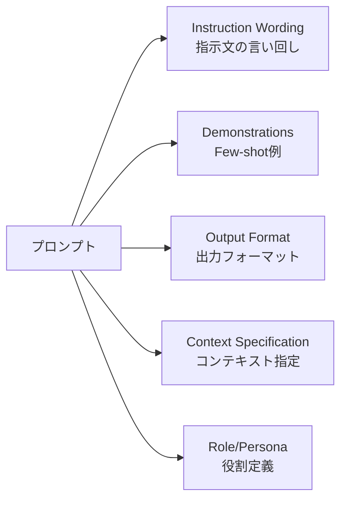

## 論文概要（Abstract）

「PromptEval: Evaluating What Matters in Prompt Engineering」（2024年4月、arXiv:2404.04507）は、プロンプトエンジニアリングにおける各コンポーネントが性能に与える影響を定量的に評価するフレームワークです。プロンプトを指示文の言い回し・デモンストレーション・出力フォーマット・コンテキスト指定・役割定義の複数次元に分解し、分散分析（ANOVA）を用いて各次元の寄与率を測定します。主要な発見として、指示文の言い回しが最も影響力が大きく（$\eta^2 > 0.3$）、モデル間の転移性は限定的（Spearman $\rho \approx 0.4$-$0.6$）であることを示しています。

この記事は [Zenn記事: LLM評価駆動開発（EDD）実践：Promptfooでテストファーストなプロンプト改善を回す](https://zenn.dev/0h_n0/articles/18d31ec58faffb) の深掘りです。

## 情報源

- **arXiv ID**: 2404.04507
- **URL**: [https://arxiv.org/abs/2404.04507](https://arxiv.org/abs/2404.04507)
- **著者**: Shachar Don-Yehiya, Leshem Choshen, Omri Abend（Hebrew University of Jerusalem / MIT-IBM Watson AI Lab）
- **発表年**: 2024年4月
- **分野**: cs.CL, cs.AI, cs.LG
- **コード**: [https://github.com/IBM/PromptEval](https://github.com/IBM/PromptEval)（Apache 2.0）

## 背景と動機（Background & Motivation）

プロンプトエンジニアリングの先行研究は「プロンプトの性能には高い分散がある」ことを示していますが、**どのコンポーネントが重要なのか**は明確にされていませんでした。開発者はアドホックな試行錯誤でプロンプトを改善しますが、どの部分に注力すべきかの優先度付けが困難です。

従来のアプローチの問題点は3つあります。第一に、プロンプトを**一体的に**評価するため、どの要素が性能に寄与しているか分離できません。第二に、あるモデルで最適化されたプロンプトが別のモデルでどの程度有効かの**転移性**が不明です。第三に、プロンプト空間の全探索はAPIコストが膨大で、**効率的なサンプリング戦略**が必要です。

本論文は、これらの問題に対して統計学の分散分析（ANOVA）を適用し、プロンプトの各次元の重要度を定量化する体系的な手法を提案します。

## 主要な貢献（Key Contributions）

- **貢献1**: プロンプトの多次元分解 — プロンプトを独立な次元（指示文・例・フォーマット・コンテキスト・役割）に分解し、それぞれの影響を測定可能に
- **貢献2**: ANOVAベースの重要度推定 — 各次元の分散への寄与率（$\eta^2$）を統計的に定量化
- **貢献3**: 転移性の定量評価 — モデル間・タスク間でのプロンプト最適性の転移をSpearman $\rho$ で測定
- **貢献4**: 効率的サンプリング — 全組み合わせの20-30%のサンプリングで安定した推定が可能

## 技術的詳細（Technical Details）

### プロンプトの次元分解

PromptEvalでは、プロンプトを以下の独立した次元に分解します。



各次元で複数のバリエーションを定義します。例えば「指示文の言い回し」次元では：

- "Please classify the following text..."
- "Determine whether the text..."
- "Label the following as..."
- "Read the text and identify..."
- "Your task is to categorize..."

### ANOVAによる重要度推定

各次元がモデル性能に与える影響を**一元配置分散分析（One-way ANOVA）**で定量化します。

$$
\text{SS}_{\text{total}} = \text{SS}_{\text{between}} + \text{SS}_{\text{within}}
$$

ここで、
- $\text{SS}_{\text{total}}$: 全変動（Total Sum of Squares）
- $\text{SS}_{\text{between}}$: 群間変動（次元内のバリエーション間の差）
- $\text{SS}_{\text{within}}$: 群内変動（同一バリエーション内のばらつき）

効果量（Effect Size）として$\eta^2$（イータ二乗）を使用します：

$$
\eta^2 = \frac{\text{SS}_{\text{between}}}{\text{SS}_{\text{total}}}
$$

$\eta^2$の解釈：
- $\eta^2 < 0.01$: 効果なし
- $0.01 \leq \eta^2 < 0.06$: 小さい効果
- $0.06 \leq \eta^2 < 0.14$: 中程度の効果
- $\eta^2 \geq 0.14$: 大きい効果

### 効率的サンプリング戦略

全次元の直積空間を網羅するのはコスト的に非現実的です。例えば、5次元×各5バリエーション=$5^5 = 3125$通りの組み合わせがあります。

PromptEvalでは、ランダムサンプリングにより全組み合わせの20-30%で安定した$\eta^2$推定が可能であることを示しています。

$$
n_{\text{sample}} = \lceil r \cdot \prod_{d=1}^{D} |V_d| \rceil, \quad r \in [0.2, 0.3]
$$

ここで、
- $D$: 次元数
- $|V_d|$: 次元$d$のバリエーション数
- $r$: サンプリング率

### 転移性の評価

あるモデル$M_1$で最適なプロンプトが別のモデル$M_2$でも最適かを、ランク相関で測定します。

$$
\rho = 1 - \frac{6 \sum_{i=1}^{n} d_i^2}{n(n^2 - 1)}
$$

ここで、
- $\rho$: Spearmanの順位相関係数
- $d_i$: $i$番目のプロンプトのモデル$M_1$とモデル$M_2$でのランク差
- $n$: プロンプト数

### アルゴリズム

PromptEvalの実行手順を擬似コードで示します：

```python
from itertools import product
from typing import Any
import random
import pingouin as pg
import pandas as pd

def prompt_eval(
    dimensions: dict[str, list[str]],
    model: str,
    test_set: list[dict],
    sampling_rate: float = 0.25,
    metric_fn: Any = None
) -> dict:
    """PromptEvalの実行

    Args:
        dimensions: 次元名→バリエーションリストの辞書
            例: {"instruction": ["Please classify...", "Determine..."],
                 "examples": [set_A, set_B],
                 "format": ["Answer: {label}", "{label}"]}
        model: 評価対象モデル名
        test_set: テストデータセット
        sampling_rate: サンプリング率 (0.2-0.3推奨)
        metric_fn: 評価関数（Accuracy, F1等）

    Returns:
        各次元のη²と統計的有意性
    """
    # Step 1: 全組み合わせからサンプリング
    dim_names = list(dimensions.keys())
    all_combos = list(product(*dimensions.values()))
    n_sample = int(len(all_combos) * sampling_rate)
    sampled = random.sample(all_combos, k=n_sample)

    # Step 2: 各プロンプトバリアントを評価
    results = []
    for combo in sampled:
        prompt = build_prompt(dict(zip(dim_names, combo)))
        score = evaluate_model(model, prompt, test_set, metric_fn)
        row = dict(zip(dim_names, combo))
        row["score"] = score
        results.append(row)

    df = pd.DataFrame(results)

    # Step 3: 各次元のANOVAを実行
    importance = {}
    for dim in dim_names:
        aov = pg.anova(data=df, dv="score", between=[dim])
        eta_sq = aov["np2"].iloc[0]  # partial eta-squared
        p_value = aov["p-unc"].iloc[0]
        importance[dim] = {
            "eta_squared": eta_sq,
            "p_value": p_value,
            "significant": p_value < 0.05
        }

    # Step 4: 重要度でソート
    importance = dict(
        sorted(importance.items(),
               key=lambda x: x[1]["eta_squared"],
               reverse=True)
    )

    return importance
```

### 転移性評価の実装

```python
from scipy.stats import spearmanr

def evaluate_transferability(
    model_a: str,
    model_b: str,
    prompt_variants: list[str],
    test_set: list[dict],
    metric_fn: Any
) -> dict:
    """モデル間のプロンプト転移性を評価

    Args:
        model_a: モデルA
        model_b: モデルB
        prompt_variants: プロンプトバリアントのリスト
        test_set: テストデータセット
        metric_fn: 評価関数

    Returns:
        Spearman ρ と p値
    """
    scores_a = [evaluate_model(model_a, p, test_set, metric_fn)
                for p in prompt_variants]
    scores_b = [evaluate_model(model_b, p, test_set, metric_fn)
                for p in prompt_variants]

    rho, p_value = spearmanr(scores_a, scores_b)

    return {
        "spearman_rho": rho,
        "p_value": p_value,
        "transferable": rho > 0.7  # 経験的閾値
    }
```

## 実験結果（Results）

### 実験設定

**評価タスク**: SuperGLUEサブセット（BoolQ, CB, MultiRC, RTE, WiC, WSC）、BIG-Bench Hardサブセット

**評価モデル**: GPT-3.5-turbo, GPT-4, Llama系列, Mistral系列

### 主要な発見

**Finding 1: 指示文の言い回しが最も影響力が大きい**

多くのタスクで、Instruction Wordingの$\eta^2 > 0.3$（大きい効果）が観測されました。同じ意味の指示でも、表現の違いだけで精度が10ポイント以上変動するケースがあります。

| 次元 | $\eta^2$（平均） | 効果の大きさ |
|---|---|---|
| Instruction Wording | **0.30+** | **大** |
| Demonstrations | 0.10-0.25 | 中〜大 |
| Output Format | < 0.10 | 小 |
| Context Specification | 0.05-0.15 | 小〜中 |
| Role/Persona | 0.03-0.10 | 小 |

**Finding 2: Few-shot例の選択もモデル・タスクに依存して有意**

デモンストレーションの$\eta^2$は0.10-0.25の範囲で、タスクによって変動します。Few-shot例の内容だけでなく順序も影響し、例の順序を変えるだけで精度が5ポイント変わるケースも報告されています。

**Finding 3: 出力フォーマットの影響は限定的**

JSON, bullet points, plain textなどの出力フォーマット変更は、多くのタスクで$\eta^2 < 0.10$と小さな効果に留まりました。ただし、構造化出力が要求されるタスクでは影響が大きくなる可能性があります。

**Finding 4: モデル間転移性は中程度**

GPT-3.5で最適なプロンプトがGPT-4でも最適とは限りません。

$$
\rho_{\text{GPT-3.5} \to \text{GPT-4}} \approx 0.4 - 0.6
$$

この$\rho$の値は「中程度の相関」であり、モデル変更時にはプロンプトの再最適化が推奨されます。

**Finding 5: タスク間転移も低い**

同一モデルでもタスクが異なると最適プロンプトは転移しにくく、タスク固有のプロンプト最適化が必要であることが示されました。

**Finding 6: 効率的サンプリング**

全組み合わせの20-30%のサンプリングで、$\eta^2$の推定値は全数評価の結果と高い相関（$r > 0.95$）を示しました。これにより、APIコストを70-80%削減しつつ信頼性のある重要度推定が可能です。

## 実装のポイント（Implementation）

### 実務での導入手順

**Step 1: 次元定義（YAML形式）**

```yaml
# prompt_dimensions.yaml
dimensions:
  instruction:
    - "以下のテキストを分類してください"
    - "テキストの内容を判定してください"
    - "次のテキストのカテゴリを特定してください"

  examples:
    - type: "set_a"
      items:
        - input: "例1の入力"
          output: "例1の出力"
    - type: "set_b"
      items:
        - input: "例2の入力"
          output: "例2の出力"

  format:
    - "回答: {label}"
    - "{label}"
    - "カテゴリ: {label}"

sampling_rate: 0.25
significance_level: 0.05
```

**Step 2: 実行とレポート生成**

```python
# 実行例
results = prompt_eval(
    dimensions=load_yaml("prompt_dimensions.yaml"),
    model="gpt-4o",
    test_set=load_test_data("test_set.jsonl"),
    sampling_rate=0.25,
    metric_fn=accuracy_score
)

# 結果レポート
for dim, stats in results.items():
    status = "✅ 重要" if stats["eta_squared"] > 0.14 else "⚠️ 要確認" if stats["eta_squared"] > 0.06 else "ℹ️ 影響小"
    print(f"{status} {dim}: η²={stats['eta_squared']:.3f} (p={stats['p_value']:.4f})")
```

出力例:
```
✅ 重要 instruction: η²=0.342 (p=0.0001)
✅ 重要 examples: η²=0.187 (p=0.0023)
⚠️ 要確認 context: η²=0.089 (p=0.0341)
ℹ️ 影響小 format: η²=0.045 (p=0.1204)
ℹ️ 影響小 role: η²=0.031 (p=0.2156)
```

**ハイパーパラメータの推奨値**:
- サンプリング率: 0.25（計算コストと推定精度のバランス）
- 評価データセットサイズ: タスクあたり200-500サンプル
- 各次元のバリエーション数: 3-7個
- 統計的有意水準: $\alpha = 0.05$

**よくある落とし穴**:
- 次元間の交互作用: 独立性仮定が崩れるとANOVAの精度が低下 → 二元配置ANOVAで交互作用を検出可能
- サンプリングの偏り: ランダムサンプリング時にシードを固定して再現性を確保
- APIコスト見積もり漏れ: 事前にコスト試算を実施（25%サンプリングでも数千回のAPI呼び出し）

## Production Deployment Guide

### AWS実装パターン（コスト最適化重視）

PromptEvalを定期的に実行するプロンプト最適化パイプラインの推奨構成です。

**トラフィック量別の推奨構成**:

| 規模 | 評価頻度 | 推奨構成 | 月額コスト | 主要サービス |
|------|---------|---------|-----------|------------|
| **Small** | 週1回 | Serverless | $30-80 | Lambda + Bedrock + S3 |
| **Medium** | 日次 | Hybrid | $200-500 | Step Functions + Bedrock Batch + S3 |
| **Large** | 常時 | Container | $800-2,000 | ECS + Bedrock + ElastiCache |

**Small構成の詳細** (月額$30-80):
- **Lambda**: 評価パイプライン実行 ($10/月)
- **Bedrock**: Claude 3.5 Haiku, 週1回のバッチ評価 ($40/月)
- **S3**: プロンプトバリアント・評価結果保存 ($5/月)
- **EventBridge**: 週次スケジュール実行 ($1/月)

**コスト削減テクニック**:
- Bedrock Batch APIで50%削減（非リアルタイム評価に最適）
- Prompt Caching: 同一評価プロンプトの再利用で30-90%削減
- サンプリング率25%で計算コスト75%削減（論文実証済み）

**コスト試算の注意事項**:
- 上記は2026年2月時点のAWS ap-northeast-1料金に基づく概算値です
- プロンプトバリアント数×テストセットサイズでAPIコストが線形増加します
- 最新料金は [AWS料金計算ツール](https://calculator.aws/) で確認してください

### Terraformインフラコード

```hcl
# --- EventBridge: 週次評価スケジュール ---
resource "aws_cloudwatch_event_rule" "weekly_eval" {
  name                = "prompteval-weekly"
  schedule_expression = "cron(0 3 ? * MON *)"  # 毎週月曜3:00 UTC
}

resource "aws_cloudwatch_event_target" "eval_lambda" {
  rule      = aws_cloudwatch_event_rule.weekly_eval.name
  target_id = "prompteval-runner"
  arn       = aws_lambda_function.prompteval_runner.arn
}

# --- Lambda: PromptEval実行 ---
resource "aws_lambda_function" "prompteval_runner" {
  function_name = "prompteval-runner"
  role          = aws_iam_role.prompteval_role.arn
  handler       = "prompteval_runner.handler"
  runtime       = "python3.12"
  timeout       = 900  # 15分（バッチ評価用）
  memory_size   = 2048
  environment {
    variables = {
      BEDROCK_MODEL_ID = "anthropic.claude-3-5-haiku-20241022-v1:0"
      S3_BUCKET        = aws_s3_bucket.eval_results.id
      SAMPLING_RATE    = "0.25"
    }
  }
}

resource "aws_iam_role" "prompteval_role" {
  name = "prompteval-lambda-role"
  assume_role_policy = jsonencode({
    Version = "2012-10-17"
    Statement = [{
      Action    = "sts:AssumeRole"
      Effect    = "Allow"
      Principal = { Service = "lambda.amazonaws.com" }
    }]
  })
}

resource "aws_iam_role_policy" "prompteval_policy" {
  role = aws_iam_role.prompteval_role.id
  policy = jsonencode({
    Version = "2012-10-17"
    Statement = [
      {
        Effect   = "Allow"
        Action   = ["bedrock:InvokeModel"]
        Resource = "arn:aws:bedrock:ap-northeast-1::foundation-model/anthropic.claude-*"
      },
      {
        Effect   = "Allow"
        Action   = ["s3:PutObject", "s3:GetObject"]
        Resource = "${aws_s3_bucket.eval_results.arn}/*"
      }
    ]
  })
}

resource "aws_s3_bucket" "eval_results" {
  bucket = "prompteval-results-${data.aws_caller_identity.current.account_id}"
}

resource "aws_s3_bucket_lifecycle_configuration" "eval_results_lifecycle" {
  bucket = aws_s3_bucket.eval_results.id
  rule {
    id     = "expire-old-results"
    status = "Enabled"
    expiration { days = 90 }  # 90日で自動削除
  }
}
```

### 運用・監視設定

```python
import boto3

cloudwatch = boto3.client('cloudwatch')

# PromptEval実行時間監視
cloudwatch.put_metric_alarm(
    AlarmName='prompteval-duration-spike',
    ComparisonOperator='GreaterThanThreshold',
    EvaluationPeriods=1,
    MetricName='Duration',
    Namespace='AWS/Lambda',
    Period=3600,
    Statistic='Maximum',
    Threshold=600000,  # 10分超過でアラート
    AlarmDescription='PromptEval実行時間異常'
)
```

### コスト最適化チェックリスト

**評価頻度の最適化**:
- [ ] 開発フェーズ: 日次評価（Bedrock Batch API活用）
- [ ] 安定運用フェーズ: 週次評価（EventBridge スケジュール）
- [ ] モデル変更時: 即時評価（転移性評価を含む）

**計算コスト削減**:
- [ ] サンプリング率25%で75%削減
- [ ] Bedrock Batch APIで50%削減
- [ ] Prompt Cachingで30-90%削減
- [ ] 重要度の低い次元（$\eta^2 < 0.06$）の探索を省略

**監視・アラート**:
- [ ] AWS Budgets: 月額予算設定
- [ ] CloudWatch: 実行時間・コスト監視
- [ ] S3ライフサイクル: 古い評価結果の自動削除
- [ ] 評価結果のSlack/SNS通知

## 実運用への応用（Practical Applications）

PromptEvalは、Zenn記事で紹介されているPromptfooのテスト設計に直接活用できます。具体的には、PromptEvalで$\eta^2$が高い次元（例：指示文の言い回し）を特定し、その次元のバリエーションをPromptfooのプロンプト比較機能で重点的にテストする、というワークフローが有効です。

また、Promptfooの`promptfooconfig.yaml`でプロンプトバリアントを定義する際、PromptEvalの知見に基づいて「どの部分のバリアントを用意すべきか」を優先度付けできます。

## 関連研究（Related Work）

- **PromptBench** (Zhu et al., 2023): 敵対的プロンプトに対する堅牢性評価。PromptEvalの「何が重要か」の問いとは異なり、「何に弱いか」に焦点
- **HELM** (Liang et al., 2022): ホリスティックLLM評価。モデル全体の能力をベンチマークするが、プロンプトのコンポーネント分解は行わない
- **DSPy** (Khattab et al., 2023): 自動プロンプト最適化。PromptEvalの知見（どの次元が重要か）をDSPyの探索空間制限に活用可能

## まとめと今後の展望

PromptEvalは、プロンプトエンジニアリングを「何が重要かを定量化してから改善する」というデータドリブンなアプローチに変革する手法です。主要な知見として、（1）指示文の言い回しが一貫して最も重要、（2）モデル間転移性は限定的でモデル変更時は再最適化が必要、（3）25%サンプリングで信頼性の高い推定が可能、という3点が実務に直結します。

今後の課題として、多言語（日本語含む）での次元重要度の検証、生成タスク（要約・翻訳）への拡張、次元間交互作用の詳細分析が挙げられています。

## 参考文献

- **arXiv**: [https://arxiv.org/abs/2404.04507](https://arxiv.org/abs/2404.04507)
- **Code**: [https://github.com/IBM/PromptEval](https://github.com/IBM/PromptEval)
- **Related Zenn article**: [https://zenn.dev/0h_n0/articles/18d31ec58faffb](https://zenn.dev/0h_n0/articles/18d31ec58faffb)
