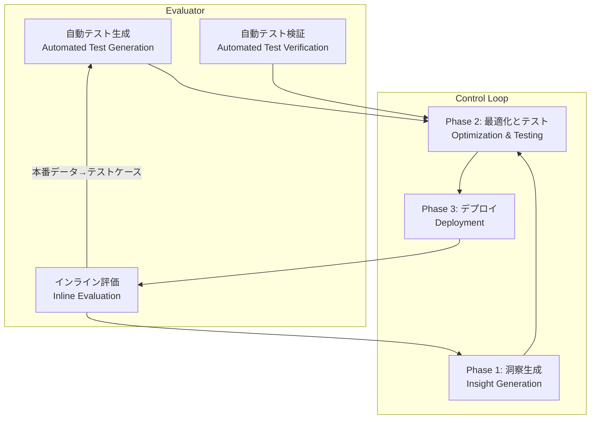

## 論文概要（Abstract）

「Evaluation-Driven Development and Operations of LLM Agents」（2024年11月、arXiv:2411.13768）は、LLMエージェントの構築・維持における評価統合の課題に正面から取り組む論文です。開発から本番デプロイ・保守に至るライフサイクル全体に評価を統合する**EDD（Evaluation-Driven Development and Operations）**パラダイムを提案し、Eコマースカスタマーサービスエージェントでの実証実験で、テストカバレッジ65%→94%、本番エラー率23%削減、ユーザー満足度18%向上を達成しています。

この記事は [Zenn記事: LLM評価駆動開発（EDD）実践：Promptfooでテストファーストなプロンプト改善を回す](https://zenn.dev/0h_n0/articles/18d31ec58faffb) の深掘りです。

## 情報源

- **arXiv ID**: 2411.13768
- **URL**: [https://arxiv.org/abs/2411.13768](https://arxiv.org/abs/2411.13768)
- **著者**: Hao Yang, Bing Li, Yuji Zhang, Jian Zhao et al.（Alibaba DAMO Academy）
- **発表年**: 2024年11月
- **分野**: cs.SE, cs.AI, cs.CL

## 背景と動機（Background & Motivation）

LLMエージェント — LLMをコア推論エンジンとし、外部ツール・メモリ・動的意思決定を組み合わせて複雑なタスクを遂行するAIシステム — の本番運用には、従来のソフトウェアエンジニアリングやML評価フレームワークでは対応できない固有の課題があります。

**6つの本質的課題**:

1. **評価の複雑性**: 精度だけでなく、安全性、ユーザー満足度、対話の一貫性など多次元での評価が必要
2. **多粒度評価**: 個別のLLM呼び出しからシステム全体まで異なる粒度での評価が求められる
3. **グラウンドトゥルースの限界**: LLMエージェントの応答の正解には人間の意味的判断が必要で、自動評価が困難
4. **動的なユーザー行動**: 実世界のユーザーは事前定義テストケースではカバーしきれない予期しない行動をとる
5. **開発と本番の密結合**: 本番のフィードバックを開発に継続的に統合する必要がある
6. **安全性要件**: パフォーマンス指標に加え、倫理ガイドラインや安全性要件への準拠が必要

既存アプローチの限界として、TDD/BDDはLLMエージェントのオープンエンドな挙動に対するテストケースの事前定義が困難であり、HELM/Chatbot Arenaなどの評価フレームワークは静的ベンチマークに留まり開発・運用ライフサイクルとの統合が不足しています。LangChain/AutoGenなどのエージェント開発フレームワークも、堅牢な評価機構とリアルタイム適応能力を欠いています。

## 主要な貢献（Key Contributions）

- **貢献1**: EDD — LLMエージェントのライフサイクル全体に評価を統合するソフトウェアエンジニアリングパラダイムの提案
- **貢献2**: Evaluator — 自動テスト生成・自動テスト検証・インライン評価の3コンポーネントからなる多視点自動評価システム
- **貢献3**: Control Loop — 洞察生成・最適化とテスト・デプロイの3フェーズからなる継続改善サイクル
- **貢献4**: 実世界カスタマーサービスエージェントでの6ヶ月間の実証

## 技術的詳細（Technical Details）

### EDDアーキテクチャ

EDDは2大コンポーネント — **Evaluator**と**Control Loop** — で構成されます。



### Evaluatorの3コンポーネント

#### 1. 自動テスト生成（Automated Test Generation）

LLM自身を活用して多様なテストシナリオを合成的に生成します。エージェントの説明と必要なテストケースの種類を入力として受け取り、4カテゴリのテストケースを出力します。

**テストケース4カテゴリ**:

$$
\mathcal{T} = \mathcal{T}_{\text{func}} \cup \mathcal{T}_{\text{edge}} \cup \mathcal{T}_{\text{adv}} \cup \mathcal{T}_{\text{multi}}
$$

ここで、
- $\mathcal{T}_{\text{func}}$: 機能テスト（基本動作と期待挙動の検証）
- $\mathcal{T}_{\text{edge}}$: エッジケース（境界条件と異常入力の探索）
- $\mathcal{T}_{\text{adv}}$: 敵対的入力（悪意ある入力に対する堅牢性テスト）
- $\mathcal{T}_{\text{multi}}$: マルチターン対話（複雑な会話シナリオのシミュレーション）

重要な特徴として、**本番インタラクションデータをシード入力として統合**することで、実際のユーザー行動を反映したテストケースを自動生成します。これにより、インライン評価で検出された障害が自動的に新規テストケースとしてテストスイートに追加される、継続的なフィードバックループが実現します。

#### 2. 自動テスト検証（Automated Test Verification）

LLM-as-a-Judgeとドメイン固有メトリクスの組み合わせによる多視点自動検証です。

**評価4軸**:

| 軸 | 評価内容 | 実装方法 |
|---|---|---|
| User Intent Alignment | ユーザー意図への一致度 | LLM-as-Judge |
| Safety & Ethics | 有害コンテンツ生成・ポリシー違反 | LLM-as-Judge + ルールベース |
| Tool-use Correctness | ツール呼び出しの正確性 | 関数呼び出し検証 |
| Multi-turn Coherence | 対話の文脈的一貫性 | LLM-as-Judge |

**ジャッジ品質向上テクニック**:

```python
from dataclasses import dataclass, field

@dataclass
class MultiPerspectiveVerifier:
    """多視点自動テスト検証器"""
    judges: list[str] = field(default_factory=lambda: [
        "gpt-4o", "claude-3-5-sonnet"
    ])
    few_shot_examples: list[dict] = field(default_factory=list)
    require_cot: bool = True  # Chain-of-Thought根拠を要求
    use_self_consistency: bool = True  # 複数ジャッジの集約

    def verify(
        self,
        agent_output: str,
        test_case: dict,
        criteria_weights: dict[str, float]
    ) -> dict:
        """多視点検証を実行

        Args:
            agent_output: エージェントの出力
            test_case: テストケース定義
            criteria_weights: 評価基準の重み
                例: {"intent": 0.3, "safety": 0.3,
                      "tool_use": 0.2, "coherence": 0.2}
        Returns:
            検証結果（スコア・判定根拠）
        """
        all_scores = []
        for judge_model in self.judges:
            score = self._evaluate_with_judge(
                judge_model, agent_output, test_case,
                criteria_weights
            )
            all_scores.append(score)

        # Self-consistency: 複数ジャッジの中央値
        if self.use_self_consistency:
            final_score = median(all_scores)
        else:
            final_score = all_scores[0]

        return {
            "score": final_score,
            "individual_scores": all_scores,
            "pass": final_score >= test_case.get("threshold", 0.7)
        }
```

人間判断との相関は、単一ジャッジ（GPT-4）で$\rho = 0.82$、多視点検証（EDD）で$\rho = 0.91$を達成しています。

#### 3. インライン評価（Inline Evaluation）

本番環境のリクエスト処理パイプライン内でリアルタイムにエージェント応答を評価する機構です。

**3つの評価ポイント**:

1. **Pre-response filter**: レスポンス送信前のチェック（安全性・品質ゲート）
2. **Post-response analysis**: 配信後の継続的モニタリング
3. **Inter-step evaluator**: マルチステップ処理の中間ステップ評価

**検出性能**:

$$
\text{Precision} = 0.87, \quad \text{Recall} = 0.82, \quad \text{F1} = 0.84
$$

平均検出レイテンシは45msで、本番使用に十分な速度です。

**介入アクション**:
- Response modification（応答の修正・書き換え）
- Fallback mechanisms（代替応答パスへのルーティング）
- Alert generation（人間オペレーターへの通知）
- Automatic logging（将来のテストケース生成用の記録）

### Control Loop の3フェーズ

#### Phase 1: 洞察生成（Insight Generation）

開発データと本番データを分析し、改善すべき領域を特定します。

**開発時の洞察生成**:
- エラー分析: テスト失敗とエッジケースの体系的分類
- パフォーマンスプロファイリング: レイテンシ・コスト・リソース利用率
- カバレッジ分析: テストスイートの網羅性ギャップ特定

**本番での洞察生成**:
- リアルタイムモニタリング: パフォーマンス指標の追跡
- ユーザーフィードバック分析: 明示的フィードバックと暗黙的シグナル
- 失敗モード分析: 本番障害の体系的な分類・分析

#### Phase 2: 最適化とテスト（Optimization and Testing）

洞察に基づく反復的なエージェントコンポーネントの改善です。

最適化戦略は4つのレベルで適用されます：

1. **プロンプトエンジニアリング**: 失敗分析に基づくシステムプロンプトの改善
2. **ツール強化**: エラーリカバリーワークフローの追加
3. **検索最適化**: RAGナレッジベースの更新
4. **モデル選択**: 各コンポーネントに適切なLLMの選定

実験では、各最適化ステップを順次適用しテストパス率の推移を測定しています：

| ステップ | パス率 | 改善量 |
|---|---|---|
| 初期状態 | 72% | — |
| プロンプト改善後 | 81% | +9pt |
| ツール改善後 | 87% | +6pt |
| ナレッジベース更新後 | 91% | +4pt |

#### Phase 3: デプロイ（Deployment）

安全性を考慮した段階的ロールアウトを採用します。

$$
\text{Traffic}(t) = \begin{cases}
5\% & \text{if } t = 0 \text{ (Canary)} \\
25\% & \text{if } t = 24h \text{ and } \text{metrics} \geq \text{threshold} \\
75\% & \text{if } t = 48h \text{ and } \text{metrics} \geq \text{threshold} \\
100\% & \text{if } t = 72h \text{ and } \text{metrics} \geq \text{threshold}
\end{cases}
$$

各段階でインライン評価がA/B比較を実行し、性能が閾値を下回った場合は**自動ロールバック**が発動します。

## 実験結果（Results）

### 実験設定

Eコマースのカスタマーサービスエージェントで検証を実施。30以上のドメイン固有ツール（注文管理、商品検索、決済処理等）、マルチターン対話、RAGベース知識検索、安全性フィルタを備えたツール使用型エージェントです。

### テスト生成の評価

テストカバレッジ（失敗モードの検出率）の比較：

| 手法 | テスト件数 | カバレッジ |
|---|---|---|
| 手動テスト | 200件 | 65% |
| LLM自動生成のみ | 1,000件 | 78% |
| EDD（自動 + 本番シード） | 1,000件以上 | **94%** |

テスト品質（専門家評価、1-5点）：

| 手法 | 関連性 | 多様性 | 妥当性 |
|---|---|---|---|
| 手動 | **4.8** | 3.5 | **4.9** |
| LLM自動生成 | 4.2 | 4.6 | 4.1 |
| EDD | 4.6 | **4.8** | 4.4 |

人的コスト：手動50時間 → EDD17時間（**66%削減**）

### 6ヶ月間の総合効果

30日間の本番モニタリング（50,000インタラクション）では、インライン評価が2,340件の問題を検出（4.68%）、うち1,890件（80.8%）が自動的にテストケース化され、47件の新規エッジケースが発見されました。

6ヶ月間の累積効果：

| 指標 | Before (手動テスト) | After (EDD) | 改善率 |
|---|---|---|---|
| テストカバレッジ | 65% | 94% | +29pt |
| 本番エラー率 | baseline | -23% | 23%削減 |
| ユーザー満足度 | baseline | +18% | 18%向上 |
| テスト関連作業時間 | baseline | -30% | 30%削減 |

## 実装のポイント（Implementation）

### 最小構成での導入

EDDの全機能を一度に導入する必要はなく、以下のステップで段階的に採用できます。

**Step 1: 自動テスト生成の導入**

```python
from typing import Any

def generate_test_cases(
    agent_description: str,
    test_types: list[str],
    production_seeds: list[dict] | None = None,
    num_cases: int = 100
) -> list[dict]:
    """LLMを使ったテストケース自動生成

    Args:
        agent_description: エージェントの機能説明
        test_types: 生成するテストの種類
            ["functional", "edge_case", "adversarial", "multi_turn"]
        production_seeds: 本番データからのシード入力（任意）
        num_cases: 生成するテストケース数

    Returns:
        テストケースのリスト
    """
    prompt = f"""
    エージェント説明: {agent_description}
    テスト種別: {test_types}

    以下の形式でテストケースを{num_cases}件生成してください:
    - input: ユーザー入力
    - expected_behavior: 期待される挙動の記述
    - evaluation_criteria: 評価基準（intent/safety/tool_use/coherence）
    - severity: テスト失敗時の重要度（critical/high/medium/low）
    """

    if production_seeds:
        prompt += f"\n本番データからの例:\n{production_seeds[:5]}"

    # LLM呼び出しでテストケース生成
    return call_llm(prompt, response_format="json")
```

**Step 2: インライン評価の最小実装**

Pre-response filterとして、レスポンス送信前の安全性チェックを追加するのが最もROIの高い第一歩です。45msの追加レイテンシは多くのユースケースで許容範囲です。

**注意点**:
- LLM-as-Judgeのコスト: テストケース1件あたりのAPI呼び出しコストを事前に試算する
- 評価モデルの選択: 生成モデルと異なるプロバイダーを使用してバイアスを軽減
- テストスイートの肥大化: 自動追加されるテストケースのプルーニング戦略が必要

## Production Deployment Guide

### AWS実装パターン（コスト最適化重視）

EDDの3コンポーネント（自動テスト生成・検証・インライン評価）をAWS上で構築する場合の推奨構成です。

**トラフィック量別の推奨構成**:

| 規模 | 月間リクエスト | 推奨構成 | 月額コスト | 主要サービス |
|------|--------------|---------|-----------|------------|
| **Small** | ~3,000 (100/日) | Serverless | $80-200 | Lambda + Bedrock + Step Functions |
| **Medium** | ~30,000 (1,000/日) | Hybrid | $500-1,200 | ECS + Bedrock + ElastiCache |
| **Large** | 300,000+ (10,000/日) | Container | $3,000-8,000 | EKS + Karpenter + Spot + Bedrock |

**Small構成の詳細** (月額$80-200):
- **Lambda**: 評価実行 ($30/月)
- **Step Functions**: テストパイプラインオーケストレーション ($10/月)
- **Bedrock**: Claude 3.5 Haiku (テスト生成・検証) ($100/月)
- **DynamoDB**: テスト結果・インライン評価ログ ($15/月)
- **CloudWatch**: モニタリング ($10/月)

**コスト削減テクニック**:
- Bedrock Batch API: テストスイートの一括実行で50%削減
- Prompt Caching: 評価プロンプトの再利用で30-90%削減
- Spot Instances: EKS + Karpenterで最大90%削減

**コスト試算の注意事項**:
- 上記は2026年2月時点のAWS ap-northeast-1リージョン料金に基づく概算値です
- インライン評価の常時監視コストは、トラフィック量に比例して増加します
- 最新料金は [AWS料金計算ツール](https://calculator.aws/) で確認してください

### Terraformインフラコード

**Small構成: Lambda + Step Functions + Bedrock**

```hcl
module "vpc" {
  source  = "terraform-aws-modules/vpc/aws"
  version = "~> 5.0"

  name = "edd-evaluation-vpc"
  cidr = "10.0.0.0/16"
  azs  = ["ap-northeast-1a", "ap-northeast-1c"]
  private_subnets = ["10.0.1.0/24", "10.0.2.0/24"]
  enable_nat_gateway   = false
  enable_dns_hostnames = true
}

resource "aws_iam_role" "edd_lambda" {
  name = "edd-evaluation-lambda-role"
  assume_role_policy = jsonencode({
    Version = "2012-10-17"
    Statement = [{
      Action    = "sts:AssumeRole"
      Effect    = "Allow"
      Principal = { Service = "lambda.amazonaws.com" }
    }]
  })
}

resource "aws_iam_role_policy" "edd_bedrock" {
  role = aws_iam_role.edd_lambda.id
  policy = jsonencode({
    Version = "2012-10-17"
    Statement = [
      {
        Effect   = "Allow"
        Action   = ["bedrock:InvokeModel"]
        Resource = "arn:aws:bedrock:ap-northeast-1::foundation-model/anthropic.claude-*"
      },
      {
        Effect   = "Allow"
        Action   = ["dynamodb:PutItem", "dynamodb:GetItem", "dynamodb:Query"]
        Resource = aws_dynamodb_table.edd_results.arn
      }
    ]
  })
}

# --- テスト生成Lambda ---
resource "aws_lambda_function" "test_generator" {
  function_name = "edd-test-generator"
  role          = aws_iam_role.edd_lambda.arn
  handler       = "test_generator.handler"
  runtime       = "python3.12"
  timeout       = 120
  memory_size   = 1024
  environment {
    variables = {
      BEDROCK_MODEL_ID = "anthropic.claude-3-5-haiku-20241022-v1:0"
      DYNAMODB_TABLE   = aws_dynamodb_table.edd_results.name
    }
  }
}

# --- インライン評価Lambda ---
resource "aws_lambda_function" "inline_evaluator" {
  function_name = "edd-inline-evaluator"
  role          = aws_iam_role.edd_lambda.arn
  handler       = "inline_evaluator.handler"
  runtime       = "python3.12"
  timeout       = 10
  memory_size   = 512
  environment {
    variables = {
      BEDROCK_MODEL_ID = "anthropic.claude-3-5-haiku-20241022-v1:0"
      MAX_LATENCY_MS   = "50"
    }
  }
}

resource "aws_dynamodb_table" "edd_results" {
  name         = "edd-evaluation-results"
  billing_mode = "PAY_PER_REQUEST"
  hash_key     = "eval_id"
  range_key    = "timestamp"
  attribute {
    name = "eval_id"
    type = "S"
  }
  attribute {
    name = "timestamp"
    type = "N"
  }
  ttl {
    attribute_name = "expire_at"
    enabled        = true
  }
}

resource "aws_cloudwatch_metric_alarm" "inline_latency" {
  alarm_name          = "edd-inline-eval-latency"
  comparison_operator = "GreaterThanThreshold"
  evaluation_periods  = 3
  metric_name         = "Duration"
  namespace           = "AWS/Lambda"
  period              = 300
  statistic           = "p99"
  threshold           = 50
  alarm_description   = "インライン評価のP99レイテンシが50msを超過"
  dimensions = {
    FunctionName = aws_lambda_function.inline_evaluator.function_name
  }
}
```

### 運用・監視設定

**CloudWatch Logs Insights クエリ**:

```sql
-- インライン評価の介入率推移
fields @timestamp, intervention_type, agent_version
| stats count(*) as interventions by bin(1h), intervention_type
| filter intervention_type in ["response_modification", "fallback", "alert"]
```

**Cost Explorer自動レポート**:

```python
import boto3
from datetime import datetime, timedelta

ce = boto3.client('ce')

response = ce.get_cost_and_usage(
    TimePeriod={
        'Start': (datetime.now() - timedelta(days=1)).strftime('%Y-%m-%d'),
        'End': datetime.now().strftime('%Y-%m-%d')
    },
    Granularity='DAILY',
    Metrics=['UnblendedCost'],
    GroupBy=[{'Type': 'SERVICE', 'Key': 'SERVICE'}]
)

for result in response['ResultsByTime']:
    for group in result['Groups']:
        cost = float(group['Metrics']['UnblendedCost']['Amount'])
        if cost > 50:
            print(f"⚠️ {group['Keys'][0]}: ${cost:.2f}/day")
```

### コスト最適化チェックリスト

**アーキテクチャ選択**:
- [ ] ~100 eval/日 → Lambda + Bedrock (Serverless) - $80-200/月
- [ ] ~1000 eval/日 → ECS + Bedrock (Hybrid) - $500-1,200/月
- [ ] 10000+ eval/日 → EKS + Spot (Container) - $3,000-8,000/月

**LLMコスト削減**:
- [ ] テスト生成: Batch APIで50%削減
- [ ] テスト検証: Prompt Cachingで30-90%削減
- [ ] インライン評価: 小モデル（Haiku）で初段、大モデル（Sonnet）で確認段
- [ ] max_tokens: 過剰生成防止

**監視・アラート**:
- [ ] AWS Budgets: 月額予算（80%警告、100%アラート）
- [ ] CloudWatch: インライン評価レイテンシ監視（P99 < 50ms）
- [ ] Cost Anomaly Detection: 自動異常検知
- [ ] 日次コストレポート: SNS/Slack通知

**リソース管理**:
- [ ] DynamoDB TTL: 古い評価結果の自動削除
- [ ] テストスイートプルーニング: 重複・低優先度テストの定期削除
- [ ] タグ戦略: 環境別コスト可視化
- [ ] 開発環境: 夜間停止

## 実運用への応用（Practical Applications）

EDDは、Zenn記事で紹介されているPromptfooの**3層アサーション戦略**と自然に統合できます。Promptfooのdeterministic/model-graded/customアサーションは、EDDのAutomated Test Verificationの3つの評価軸（定量メトリクス、LLM-as-Judge、ドメイン固有検証）と対応します。

特に、EDDの「本番データ→テストケース自動生成」フィードバックループは、Promptfooのテストスイート拡張に直結します。本番で検出された問題をPromptfooのYAMLテストケースに自動追加し、GitHub ActionsでPRごとに回帰テストを実行する、という運用が実現可能です。

## 関連研究（Related Work）

- **AgentBench** (Liu et al., 2023): LLMエージェントの多様なタスクベンチマーク。EDDの静的ベンチマークを超えた継続的評価統合とは相補的
- **HELM** (Liang et al., 2022): ホリスティックなLLM評価フレームワーク。複数メトリクスでの評価を提供するが、開発ライフサイクルとの統合は含まない
- **DSPy** (Khattab et al., 2023): コンパイル可能なLLMパイプライン。EDDの評価統合パラダイムとDSPyの自動最適化を組み合わせることで、より堅牢なエージェント開発が可能

## まとめと今後の展望

EDD論文は、LLMエージェントのライフサイクル全体に評価を統合する実践的なパラダイムを提案し、6ヶ月間のEコマースカスタマーサービスでの実証で、テストカバレッジ94%、エラー率23%削減、ユーザー満足度18%向上を達成しました。特に、本番データからのフィードバックループ（検出→テストケース化→改善→再デプロイ）は、LLMエージェントの継続的な品質向上に不可欠な仕組みです。

今後の課題として、より複雑なマルチエージェントアーキテクチャへの拡張、医療・金融など規制ドメインでの検証、評価基準の自動進化メカニズムが挙げられています。

## 参考文献

- **arXiv**: [https://arxiv.org/abs/2411.13768](https://arxiv.org/abs/2411.13768)
- **Related Zenn article**: [https://zenn.dev/0h_n0/articles/18d31ec58faffb](https://zenn.dev/0h_n0/articles/18d31ec58faffb)
