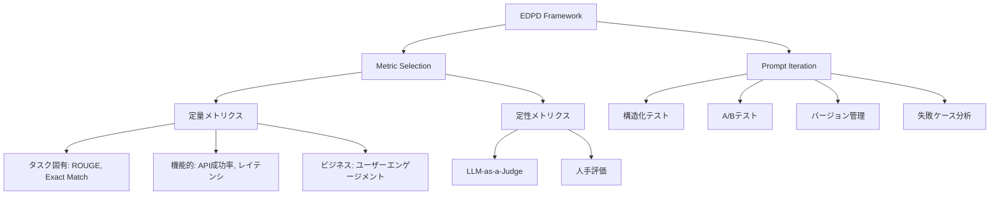

## 論文概要（Abstract）

「When Better Prompts Hurt: Evaluation-Driven Iteration for LLM Applications」（2025年1月、arXiv:2601.22025）は、LLMのプロンプトエンジニアリングにおける体系的な評価方法論の欠如がもたらす問題に取り組む論文です。直感的に「改善」と思える変更（Chain-of-Thought追加、Few-shot例の増加など）が実際にはモデルやタスクによって性能劣化を引き起こすことを実証し、**EDPD（Evaluation-Driven Prompt Development）**フレームワークを提案します。

この記事は [Zenn記事: LLM評価駆動開発（EDD）実践：Promptfooでテストファーストなプロンプト改善を回す](https://zenn.dev/0h_n0/articles/18d31ec58faffb) の深掘りです。

## 情報源

- **arXiv ID**: 2601.22025
- **URL**: [https://arxiv.org/abs/2601.22025](https://arxiv.org/abs/2601.22025)
- **発表年**: 2025年1月
- **分野**: cs.CL, cs.AI, cs.SE

## 背景と動機（Background & Motivation）

LLMを本番環境にデプロイする際、プロンプトの継続的な改善が不可欠です。しかし、現状のプロンプトエンジニアリングは**定性的な評価**や**非公式なテスト**に依存しており、改善が検証されないまま本番環境に適用されるケースが多々あります。

従来の問題点は3つに集約されます。第一に、限られたテストケースで「改善に見える」変更が、広範な評価では性能劣化を起こす**アライメント問題**があります。第二に、開発者の直感に基づくプロンプト改善では、回帰バグの検知が不可能です。第三に、あるモデルで有効な変更が別のモデルでは逆効果になる**モデル固有の挙動**を、体系的に検証する手段がありません。

たとえば、カスタマーサービスチャットボットに「ユーザーの質問をより丁寧に理解して答えてください」という明確化文を追加する場面を考えます。一見合理的ですが、体系的な評価フレームワークなしでは、この変更が（1）単純なクエリに対する過度に冗長な回答、（2）従来正しかった応答の破壊、（3）新たな失敗モードの出現、を引き起こすかどうかを判断できません。

## 主要な貢献（Key Contributions）

- **貢献1**: EDPD（Evaluation-Driven Prompt Development）フレームワークの提案 — メトリクス選定とプロンプト反復の2コンポーネントからなる体系的な評価駆動開発の枠組み
- **貢献2**: ビジネスゴールに整合したメトリクス選定ガイドライン — 定量（タスク固有・機能的・ビジネス）と定性（LLM-as-a-Judge・人手評価）の両面を網羅
- **貢献3**: 反直感的な実証的知見 — Chain-of-Thought（CoT）が構造化出力タスクで性能を劣化させること、Few-shot例のモデル依存性を5モデル×3データセットで体系的に検証

## 技術的詳細（Technical Details）

### EDPDフレームワークの設計

EDPDは2つの主要コンポーネントで構成されます。



#### メトリクス選定（Metric Selection）

EDPD のメトリクス選定は、定量メトリクスと定性メトリクスの組み合わせに基づきます。

**定量メトリクス**は3カテゴリに分類されます：

$$
\text{Metrics}_{\text{quant}} = \{ \text{Task-specific}, \text{Functional}, \text{Business} \}
$$

ここで、
- Task-specific: ROUGE、完全一致（Exact Match）、F1スコアなどタスクに固有の指標
- Functional: APIコール成功率、レスポンスレイテンシなど機能に関する指標
- Business: ユーザーエンゲージメント、タスク完了率などビジネス目標に関する指標

**定性メトリクス**には、LLM-as-a-Judge（LaaJ）と人手評価が含まれます。LaaJの実装においては、**生成モデルと評価モデルは異なるLLMを使う**ことで評価バイアスを軽減するべきとされています。

#### プロンプト反復（Prompt Iteration）

プロンプト反復の4要素は以下の通りです。

1. **構造化テスト**: プロンプト変更前後でテストスイートを実行し、before/afterを比較
2. **A/Bテスト**: ベースラインと変更版をペアで評価
3. **バージョン管理**: 変更理由・具体的修正内容・評価結果をチェンジログに記録
4. **失敗ケース分析**: 低スコアのケースを体系的に分類・対処

### 10のガイドライン

EDPDでは実務者向けに10のガイドラインが提示されます。

| # | ガイドライン | 要点 |
|---|---|---|
| G1 | LaaJの活用 | 定量メトリクスでカバーできないニュアンスの評価にLLM-as-a-Judgeを使用 |
| G2 | 包括的データセット | 典型ケースとエッジケースの両方を網羅 |
| G3 | 統計的有意性 | McNemar検定やブートストラップで信頼区間を報告 |
| G4 | バージョン管理 | 全プロンプト変更を詳細なチェンジログで管理 |
| G5 | 仮説駆動 | 「Xをプロンプトに追加→メトリクスYが改善」の形で仮説を立案 |
| G6 | 1修正ずつ | 複数変更を同時に行わず、効果を個別に検証 |
| G7 | スキーマ明示 | 構造化出力タスクではターゲットスキーマをプロンプトに含める |
| G8 | Few-shotの慎重な使用 | モデルによってFew-shotが有害になりうることを意識 |
| G9 | フォーマット指示優先 | CoTより先にフォーマット指示を試す |
| G10 | モデル固有の評価 | 実際にデプロイするモデルで評価を実行 |

### 評価指標の設計

本論文は構造化出力生成タスクに特化した2つの評価指標を設計しています。

**Error Rate（ER）**:

$$
\text{ER} = \frac{\text{Number of schema violations}}{\text{Total samples}}
$$

ERは低いほど良く、出力がJSONスキーマに準拠しなかったサンプルの割合を測定します。

**Schema Validity Score（SVS）**:

$$
\text{SVS} = \frac{1}{N} \sum_{i=1}^{N} \frac{\text{Satisfied rules}_i}{\text{Total rules}_i}
$$

ここで、
- $N$: サンプル数
- $\text{Satisfied rules}_i$: $i$番目のサンプルで満たされたフィールドレベルの検証ルール数
- $\text{Total rules}_i$: $i$番目のサンプルの全検証ルール数

SVSはERとは異なり**部分的な正しさ**を捉えることができます。スキーマの10フィールド中8フィールドが正しい場合、ERでは「失敗」ですがSVSは0.8を返します。

### アルゴリズム

EDPDの反復プロセスを擬似コードで示します：

```python
from dataclasses import dataclass
from typing import Callable

@dataclass
class PromptVersion:
    """プロンプトバージョン管理"""
    content: str
    version: str
    hypothesis: str  # G5: 仮説
    changelog: str   # G4: 変更記録

def edpd_iteration(
    baseline: PromptVersion,
    candidate: PromptVersion,
    test_suite: list[dict],
    metrics: list[Callable],
    significance_level: float = 0.05
) -> dict:
    """EDPDの1反復を実行

    Args:
        baseline: 現在のプロンプト
        candidate: 変更候補プロンプト
        test_suite: テストケースのリスト（G2: 包括的データセット）
        metrics: 評価関数のリスト
        significance_level: 統計的有意水準（G3）

    Returns:
        評価結果の辞書
    """
    # Step 1: ベースラインと候補の両方で評価実行
    baseline_scores = evaluate(baseline, test_suite, metrics)
    candidate_scores = evaluate(candidate, test_suite, metrics)

    # Step 2: 統計的有意性検定（G3）
    from scipy.stats import mcnemar
    contingency = build_contingency_table(baseline_scores, candidate_scores)
    stat, p_value = mcnemar(contingency, exact=True)

    # Step 3: 判定
    if p_value < significance_level:
        if mean(candidate_scores) > mean(baseline_scores):
            return {"decision": "ADOPT", "p_value": p_value}
        else:
            return {"decision": "REJECT_REGRESSION", "p_value": p_value}
    else:
        return {"decision": "NO_SIGNIFICANT_DIFFERENCE", "p_value": p_value}
```

## 実験結果（Results）

### 実験設定

3つの構造化出力生成データセット × 5モデル × 8プロンプトバリアントで体系的な評価が行われました。

**データセット**:

| ID | タスク | サイズ |
|---|---|---|
| D1: AddParsing | テキストからの住所情報JSON抽出 | 200件 |
| D2: JsonMapping | 製品情報のJSON正規化 | 100件 |
| D3: FinExtract | 財務レポートからの数値抽出 | 100件 |

**評価モデル**: GPT-4o-mini、Gemini 1.5 Flash、Claude Haiku 3.5、LLaMA 3.2 3B、LLaMA 3.2 11B

**プロンプトバリアント**:

| ID | 説明 |
|---|---|
| V0 | Zero-shot（スキーマなし） |
| V1 | Zero-shot（スキーマあり） |
| V2-V4 | Few-shot（1, 3, 5例） |
| V5 | フォーマット指示のみ |
| V6 | CoTのみ |
| V7 | フォーマット指示 + CoT |

### 主要な発見

**Finding 1: スキーマ追加は常に有効**

V0→V1（スキーマ追加）は全モデル・全データセットで統計的に有意な改善（$p < 0.001$）を示しました。

**Finding 2: CoTが構造化出力で性能劣化を引き起こす**

これが最も重要な発見です。CoT（V6）を追加すると、以下のモデルで性能が顕著に劣化しました：

| モデル | ER（V1: ベースライン） | ER（V6: CoT追加） | 変化 |
|---|---|---|---|
| Claude Haiku 3.5 | 0.18 | 0.24 | **+0.06（劣化）** |
| LLaMA 3.2 3B | 0.26 | 0.48 | **+0.22（大幅劣化）** |

この劣化はMcNemar検定で統計的に有意（$p < 0.05$）です。CoTは推論タスクでは有効ですが、構造化出力タスクでは冗長な出力を促し、必要なフォーマットからの逸脱を引き起こします。

**Finding 3: フォーマット指示 + CoTの組み合わせは効果薄**

V7（フォーマット指示 + CoT）はV5（フォーマット指示のみ）を一貫して上回ることはなく、複数のケースでV5より劣化しました。「良いプラクティスの足し算」は成り立ちません。

**Finding 4: Few-shotの効果はモデル依存**

GeminiとGPT-4o-miniはFew-shotの恩恵を受ける傾向がありましたが、LLaMAモデルでは不安定で、Claude HaikuはFew-shot例が少ない方が良いケースも観測されました。

### LLM-as-a-Judgeによる定性分析

GPT-4oをジャッジとして使用した定性分析では、以下の知見が得られました：

- Claude HaikuのCoT使用時の出力は冗長になり、抽出精度が低下
- LLaMA 3.2 3BはCoT使用時にフォーマット制約を維持できない
- テストケースに類似しすぎたFew-shot例は**パターンマッチング**を誘発し、真のタスク理解を阻害

## 実装のポイント（Implementation）

### 実務での導入ステップ

EDPDを既存のプロンプトエンジニアリングワークフローに導入する際の実装ポイントは以下の通りです。

**Step 1: メトリクス設計**

```python
from dataclasses import dataclass
from enum import Enum

class MetricType(Enum):
    DETERMINISTIC = "deterministic"  # 高速・確実
    MODEL_GRADED = "model_graded"    # 文脈理解可能
    CUSTOM = "custom"                # ドメイン固有

@dataclass
class EvaluationMetric:
    """評価メトリクスの定義"""
    name: str
    metric_type: MetricType
    weight: float  # 重み付け
    threshold: float  # 閾値

# MVES-Core準拠のデフォルト設定
default_metrics = [
    EvaluationMetric("format_validation", MetricType.DETERMINISTIC, 3.0, 0.95),
    EvaluationMetric("factuality", MetricType.MODEL_GRADED, 2.0, 0.80),
    EvaluationMetric("latency_ms", MetricType.DETERMINISTIC, 1.0, 3000),
    EvaluationMetric("cost_usd", MetricType.DETERMINISTIC, 1.0, 0.01),
]
```

**Step 2: テストスイート構築**

テストスイートは「典型ケース70% + エッジケース20% + 敵対的入力10%」のバランスで構成します。サンプルサイズは$n \geq 100$が推奨（$n < 100$ではブートストラップ法を使用）。

**ハイパーパラメータの推奨値**:
- 統計的有意水準: $\alpha = 0.05$
- ブートストラップサンプル数: $n = 1000$
- temperature: $0$（再現性のため）
- テスト実行回数: 中央値を採用する場合、3回以上

**よくある落とし穴**:
- 「CoTは常に良い」という思い込み → 構造化出力タスクでは検証必須
- Few-shot例の安易なコピー → テストケースとの類似度が高いと過学習的挙動を誘発
- 複数変更の同時適用 → 効果の分離が不可能に

## Production Deployment Guide

### AWS実装パターン（コスト最適化重視）

EDPDフレームワークをAWS上で本番運用する場合の推奨構成を示します。

**トラフィック量別の推奨構成**:

| 規模 | 月間リクエスト | 推奨構成 | 月額コスト | 主要サービス |
|------|--------------|---------|-----------|------------|
| **Small** | ~3,000 (100/日) | Serverless | $50-150 | Lambda + Bedrock + DynamoDB |
| **Medium** | ~30,000 (1,000/日) | Hybrid | $300-800 | Lambda + ECS Fargate + ElastiCache |
| **Large** | 300,000+ (10,000/日) | Container | $2,000-5,000 | EKS + Karpenter + EC2 Spot |

**Small構成の詳細** (月額$50-150):
- **Lambda**: 1GB RAM, 60秒タイムアウト ($20/月)
- **Bedrock**: Claude 3.5 Haiku, Prompt Caching有効 ($80/月)
- **DynamoDB**: On-Demand, テスト結果キャッシュ ($10/月)
- **S3**: プロンプトバージョン・テスト結果保存 ($5/月)
- **CloudWatch**: 基本監視 ($5/月)

**Medium構成の詳細** (月額$300-800):
- **ECS Fargate**: 0.5 vCPU, 1GB RAM × 2タスク ($120/月) — 評価パイプライン常駐
- **Bedrock**: Claude 3.5 Sonnet, Batch API活用 ($400/月)
- **ElastiCache Redis**: cache.t3.micro, テスト結果キャッシュ ($15/月)
- **Step Functions**: 評価ワークフローオーケストレーション ($20/月)

**コスト削減テクニック**:
- Spot Instances使用で最大90%削減（EKS + Karpenter）
- Bedrock Batch API使用で50%削減（テストスイートの一括評価に最適）
- Prompt Caching有効化で30-90%削減（同一評価プロンプトの再利用）

**コスト試算の注意事項**:
- 上記は2026年2月時点のAWS ap-northeast-1（東京）リージョン料金に基づく概算値です
- 実際のコストはトラフィックパターン、バースト使用量により変動します
- 最新料金は [AWS料金計算ツール](https://calculator.aws/) で確認してください

### Terraformインフラコード

**Small構成 (Serverless): Lambda + Bedrock + DynamoDB**

```hcl
# --- VPC基盤 ---
module "vpc" {
  source  = "terraform-aws-modules/vpc/aws"
  version = "~> 5.0"

  name = "edpd-eval-vpc"
  cidr = "10.0.0.0/16"
  azs  = ["ap-northeast-1a", "ap-northeast-1c"]
  private_subnets = ["10.0.1.0/24", "10.0.2.0/24"]

  enable_nat_gateway   = false
  enable_dns_hostnames = true
}

# --- IAMロール（最小権限） ---
resource "aws_iam_role" "edpd_lambda" {
  name = "edpd-lambda-role"
  assume_role_policy = jsonencode({
    Version = "2012-10-17"
    Statement = [{
      Action = "sts:AssumeRole"
      Effect = "Allow"
      Principal = { Service = "lambda.amazonaws.com" }
    }]
  })
}

resource "aws_iam_role_policy" "bedrock_invoke" {
  role = aws_iam_role.edpd_lambda.id
  policy = jsonencode({
    Version = "2012-10-17"
    Statement = [{
      Effect   = "Allow"
      Action   = ["bedrock:InvokeModel", "bedrock:InvokeModelWithResponseStream"]
      Resource = "arn:aws:bedrock:ap-northeast-1::foundation-model/anthropic.claude-3-5-haiku*"
    }]
  })
}

# --- Lambda: 評価実行関数 ---
resource "aws_lambda_function" "edpd_evaluator" {
  filename      = "edpd_evaluator.zip"
  function_name = "edpd-prompt-evaluator"
  role          = aws_iam_role.edpd_lambda.arn
  handler       = "index.handler"
  runtime       = "python3.12"
  timeout       = 60
  memory_size   = 1024

  environment {
    variables = {
      BEDROCK_MODEL_ID    = "anthropic.claude-3-5-haiku-20241022-v1:0"
      DYNAMODB_TABLE      = aws_dynamodb_table.eval_results.name
      ENABLE_PROMPT_CACHE = "true"
    }
  }
}

# --- DynamoDB: テスト結果保存 ---
resource "aws_dynamodb_table" "eval_results" {
  name         = "edpd-eval-results"
  billing_mode = "PAY_PER_REQUEST"
  hash_key     = "prompt_version"
  range_key    = "test_case_id"

  attribute {
    name = "prompt_version"
    type = "S"
  }
  attribute {
    name = "test_case_id"
    type = "S"
  }

  ttl {
    attribute_name = "expire_at"
    enabled        = true
  }
}

# --- CloudWatch: コスト監視 ---
resource "aws_cloudwatch_metric_alarm" "eval_cost" {
  alarm_name          = "edpd-eval-cost-spike"
  comparison_operator = "GreaterThanThreshold"
  evaluation_periods  = 1
  metric_name         = "Duration"
  namespace           = "AWS/Lambda"
  period              = 3600
  statistic           = "Sum"
  threshold           = 100000
  alarm_description   = "EDPD評価Lambda実行時間異常（コスト急増の可能性）"
  dimensions = {
    FunctionName = aws_lambda_function.edpd_evaluator.function_name
  }
}
```

### セキュリティベストプラクティス

- **IAMロール**: 最小権限の原則（Bedrock InvokeModel のみ許可、特定モデルID指定）
- **ネットワーク**: Lambda VPC内配置、パブリックサブネット不使用
- **シークレット管理**: AWS Secrets Manager使用、環境変数へのハードコード禁止
- **暗号化**: S3/DynamoDB全てKMS暗号化
- **監査**: CloudTrail全リージョン有効化

### 運用・監視設定

**CloudWatch Logs Insights クエリ**:

```sql
-- EDPD評価結果の異常検知: プロンプトバージョン間の回帰検出
fields @timestamp, prompt_version, metric_name, score
| stats avg(score) as avg_score by prompt_version, metric_name
| filter avg_score < 0.7
```

**CloudWatch アラーム (コスト重視)**:

```python
import boto3

cloudwatch = boto3.client('cloudwatch')

cloudwatch.put_metric_alarm(
    AlarmName='edpd-bedrock-token-spike',
    ComparisonOperator='GreaterThanThreshold',
    EvaluationPeriods=1,
    MetricName='TokenUsage',
    Namespace='Custom/EDPD',
    Period=3600,
    Statistic='Sum',
    Threshold=500000,
    ActionsEnabled=True,
    AlarmActions=['arn:aws:sns:ap-northeast-1:123456789:edpd-alerts'],
    AlarmDescription='EDPD評価のBedrockトークン使用量異常'
)
```

### コスト最適化チェックリスト

**アーキテクチャ選択**:
- [ ] ~100 eval/日 → Lambda + Bedrock (Serverless) - $50-150/月
- [ ] ~1000 eval/日 → ECS Fargate + Bedrock (Hybrid) - $300-800/月
- [ ] 10000+ eval/日 → EKS + Spot Instances (Container) - $2,000-5,000/月

**LLMコスト削減**:
- [ ] Bedrock Batch API: テストスイートの一括評価で50%削減
- [ ] Prompt Caching: 評価プロンプト（LaaJ）のキャッシュで30-90%削減
- [ ] モデル選択ロジック: 初段Haiku ($0.25/MTok)、確認段Sonnet ($3/MTok)
- [ ] max_tokens設定: 過剰生成防止

**監視・アラート**:
- [ ] AWS Budgets: 月額予算設定（80%で警告、100%でアラート）
- [ ] CloudWatch アラーム: トークン使用量スパイク検知
- [ ] Cost Anomaly Detection: 自動異常検知
- [ ] 日次コストレポート: SNS/Slackへ自動送信

**リソース管理**:
- [ ] 未使用リソース削除: Lambda Insights活用
- [ ] タグ戦略: 環境別（dev/staging/prod）でコスト可視化
- [ ] ライフサイクルポリシー: DynamoDB TTLで古い評価結果を自動削除
- [ ] テスト環境の夜間停止: ECS Fargate Auto Scaling to Zero

## 実運用への応用（Practical Applications）

EDPDは、Zenn記事で紹介されているPromptfooと組み合わせることで即座に実践可能です。具体的には、Promptfooの`promptfooconfig.yaml`でテストスイートを宣言し、EDPDのガイドラインG5（仮説駆動）とG6（1修正ずつ）に従ってプロンプトを反復改善するワークフローが構築できます。

特に構造化出力を扱うLLMアプリケーション（データ抽出、フォーム処理、API応答の構造化など）では、本論文のFinding 4（CoTの性能劣化）を考慮し、CoTの代わりにフォーマット指示（G9）を優先的に適用すべきです。

## 関連研究（Related Work）

- **DSPy** (Khattab et al., 2023): モジュラーで可コンパイルなLLMパイプライン最適化。EDPDは手動プロンプトエンジニアリングでのフレームワークであり、DSPyの自動最適化とは相補的
- **PromptBreeder** (Fernando et al., 2023): プロンプトの自己進化フレームワーク。自動探索アプローチだが、EDPDが重視する統計的厳密性は含まない
- **OPRO** (Yang et al., 2024): LLMを使った自然言語最適化。EDPDの手動反復と比較して、探索空間が広いが再現性に課題

## まとめと今後の展望

本論文は「良いプロンプト改善が逆に性能を悪化させる」という反直感的な発見を体系的に実証し、10のガイドラインを含むEDPDフレームワークを提案しました。主要な教訓は次の3点です。（1）体系的評価は必須であり、直感では改善パラドックスを検知できない。（2）最適なプロンプト戦略はモデル・タスクに依存するため、デプロイ先のモデルでの評価が不可欠。（3）統計的有意性検定により、偽の改善確信を排除できる。

今後の課題として、構造化出力以外のタスク（創作、要約）への拡張、メトリクス選定の自動化、モデル間転移的なプロンプト最適化が挙げられています。

## 参考文献

- **arXiv**: [https://arxiv.org/abs/2601.22025](https://arxiv.org/abs/2601.22025)
- **Related Zenn article**: [https://zenn.dev/0h_n0/articles/18d31ec58faffb](https://zenn.dev/0h_n0/articles/18d31ec58faffb)
