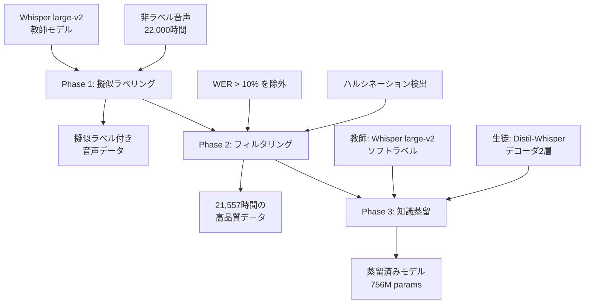
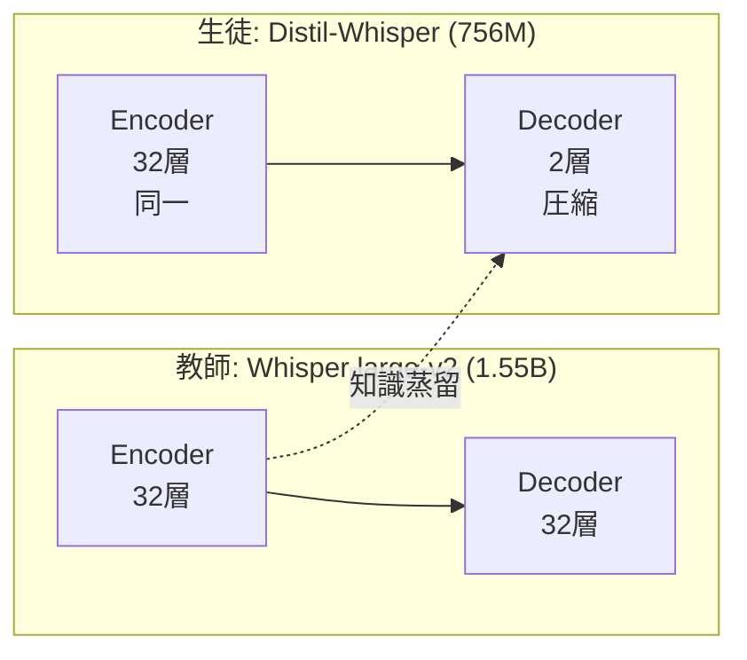

## 論文概要（Abstract）

Distil-Whisperは、Hugging Faceの研究チームが開発した**Whisperの軽量蒸留版**ASRモデルです。Whisper large-v2（1.55Bパラメータ）を教師モデルとして、22,000時間の非ラベル音声データに対する擬似ラベリングと知識蒸留を組み合わせ、**デコーダ層を32層から2層に削減**しました。結果として、パラメータ数49%削減（1.55B → 756M）、推論速度6.3倍高速化を達成しながら、英語ASRのWERを1.5%以内に抑えています。

この記事は [Zenn記事: エッジデバイスで動くTTS・STTモデル最前線2026](https://zenn.dev/0h_n0/articles/a89f23951e5ff8) の深掘りです。

## 情報源

- **arXiv ID**: 2311.00430
- **URL**: [https://arxiv.org/abs/2311.00430](https://arxiv.org/abs/2311.00430)
- **著者**: Sanchit Gandhi, Patrick von Platen, Alexander M. Rush（Hugging Face）
- **発表年**: 2023年
- **分野**: cs.CL, cs.SD, eess.AS

## 背景と動機（Background & Motivation）

Whisperは680,000時間のラベル付き音声データで学習された大規模ASRモデルで、多言語・ノイズ環境での頑健性が高く評価されています。しかし、本番環境へのデプロイには以下の課題があります。

1. **推論コスト**: Whisper large-v2は1.55Bパラメータ。リアルタイムASR APIでは1リクエストあたりのGPU使用時間がコストに直結
2. **レイテンシ**: デコーダの自己回帰（autoregressive）生成が逐次実行のため、長い音声ほどレイテンシが増加
3. **エッジデプロイ**: パラメータ数とメモリ要件がエッジデバイスには大きすぎる

Moonshineは「エンコーダのアーキテクチャ変更」でエッジ最適化するアプローチですが、Distil-Whisperは「**Whisperの知識をそのまま小さいモデルに蒸留する**」アプローチです。Whisperのエンコーダ表現力を維持しつつ、デコーダのみを圧縮することで、精度劣化を最小限に抑えています。

## 主要な貢献（Key Contributions）

- **貢献1**: 22,000時間の擬似ラベルデータセットを構築し、WERフィルタリングによりハルシネーションリスクを軽減した学習パイプラインの提案
- **貢献2**: デコーダ32層→2層の大幅な圧縮でも、Short-form WER劣化を0.3%ポイントに抑制（2.7% → 3.0%）
- **貢献3**: Speculative Decoding（投機的デコーディング）のdraftモデルとして使用することで、**Whisper large-v2の出力を数学的に保証しつつ2倍高速化**

## 技術的詳細（Technical Details）

### 知識蒸留のフレームワーク

Distil-Whisperの蒸留は、以下の3つのフェーズで構成されます。



### Phase 1: 大規模擬似ラベリング

教師モデル（Whisper large-v2）を使用して、以下のラベルなし音声データセットに擬似ラベル（転写テキスト）を付与します。

| データセット | 時間 | ドメイン |
|-------------|------|---------|
| GigaSpeech | 10,000h | YouTube, Podcast |
| SPGISpeech | 5,000h | 金融カンファレンスコール |
| Libri-Light | 6,000h | オーディオブック |
| VoxPopuli | 1,000h | 欧州議会 |
| **合計** | **22,000h** | 多ドメイン |

### Phase 2: WERベースフィルタリング

擬似ラベルの品質を確保するため、**WERベースのヒューリスティック**でフィルタリングします。

$$
\text{filtered} = \{(x_i, \hat{y}_i) \mid \text{WER}(\hat{y}_i, y_i^{\text{ref}}) \leq \tau \}
$$

ここで、
- $x_i$: 音声入力
- $\hat{y}_i$: 教師モデルの擬似ラベル
- $y_i^{\text{ref}}$: 参照ラベル（利用可能な場合）
- $\tau = 10\%$: WER閾値

さらに、Whisperのハルシネーション（音声とは無関係なテキストを生成する現象）を検出する追加フィルタも適用します。

### Phase 3: 知識蒸留

**蒸留損失関数**:

$$
\mathcal{L} = \lambda \cdot \mathcal{L}_{\text{KD}} + (1 - \lambda) \cdot \mathcal{L}_{\text{CTC}}
$$

**KL Divergence損失（ソフトラベル蒸留）**:

$$
\mathcal{L}_{\text{KD}} = \sum_{t=1}^{T} \text{KL}\left(p_{\text{teacher}}(y_t | y_{<t}, x; \theta_T) \| p_{\text{student}}(y_t | y_{<t}, x; \theta_S)\right)
$$

ここで、
- $p_{\text{teacher}}$: 教師モデルの出力確率分布（temperature $\tau_{\text{KD}}$ でソフト化）
- $p_{\text{student}}$: 生徒モデルの出力確率分布
- $\theta_T, \theta_S$: 教師・生徒モデルのパラメータ
- $T$: デコーダのタイムステップ数
- $\text{KL}$: Kullback-Leibler divergence

**CTC損失（エンコーダの補助損失）**:

$$
\mathcal{L}_{\text{CTC}} = -\log P_{\text{CTC}}(y | x; \theta_S)
$$

CTC損失はエンコーダの出力に対して適用され、デコーダに依存しないアライメント学習を補助します。

### アーキテクチャの変更点

**教師モデル（Whisper large-v2）**:
- エンコーダ: 32層 Transformer（1.55B params の大部分）
- デコーダ: 32層 Transformer

**生徒モデル（Distil-Whisper large-v2）**:
- エンコーダ: **32層（教師と同一、変更なし）**
- デコーダ: **2層（32層から30層を削除）**



**なぜエンコーダは圧縮しないのか**: Whisperの音声表現能力の大部分はエンコーダに集中しています。デコーダは主に「エンコーダ出力をテキストトークン列に変換する」役割であり、2層でも十分な性能を維持できます。

### Speculative Decoding

Distil-Whisperの応用の1つとして、**Speculative Decoding**（投機的デコーディング）があります。

```python
import torch
from transformers import (
    AutoModelForSpeechSeq2Seq,
    AutoProcessor,
    pipeline,
)

# 教師モデル（高精度、低速）
teacher = AutoModelForSpeechSeq2Seq.from_pretrained(
    "openai/whisper-large-v2",
    torch_dtype=torch.float16,
    device_map="cuda",
)

# 生徒モデル（Draft model、高速）
student = AutoModelForSpeechSeq2Seq.from_pretrained(
    "distil-whisper/distil-large-v2",
    torch_dtype=torch.float16,
    device_map="cuda",
)

processor = AutoProcessor.from_pretrained("openai/whisper-large-v2")

# Speculative Decoding pipeline
pipe = pipeline(
    "automatic-speech-recognition",
    model=teacher,
    tokenizer=processor.tokenizer,
    feature_extractor=processor.feature_extractor,
    generate_kwargs={
        "assistant_model": student,  # Draft model として使用
    },
    torch_dtype=torch.float16,
    device="cuda",
)

# 推論: 教師モデルと同じ出力を数学的に保証しつつ2倍高速
result = pipe("audio.wav", chunk_length_s=30)
print(result["text"])
```

**Speculative Decodingの仕組み**:
1. Draft model（Distil-Whisper）が複数トークンを高速に生成
2. Target model（Whisper large-v2）が生成されたトークンを並列に検証
3. 不一致があれば、Target modelの出力で置き換え
4. **結果**: Target modelと数学的に同一の出力を保証しつつ、約2倍高速

## 実装のポイント（Implementation）

### Hugging Face Transformersでの利用

```python
import torch
from transformers import pipeline

# Distil-Whisper single pipeline
pipe = pipeline(
    "automatic-speech-recognition",
    model="distil-whisper/distil-large-v2",
    torch_dtype=torch.float16,
    device="cuda",
)

# 基本的な推論
result = pipe("audio.wav")
print(result["text"])

# Long-form推論（30秒チャンク分割）
result = pipe(
    "long_audio.wav",
    chunk_length_s=30,
    return_timestamps=True,
)
for chunk in result["chunks"]:
    print(f"[{chunk['timestamp'][0]:.1f}s - {chunk['timestamp'][1]:.1f}s] {chunk['text']}")
```

### INT8量子化によるエッジデプロイ

```python
from transformers import AutoModelForSpeechSeq2Seq
from optimum.onnxruntime import ORTModelForSpeechSeq2Seq

# ONNX + INT8量子化エクスポート
model = ORTModelForSpeechSeq2Seq.from_pretrained(
    "distil-whisper/distil-large-v2",
    export=True,
    provider="CPUExecutionProvider",
)
# INT8量子化（動的量子化）
model.save_pretrained(
    "distil-whisper-int8",
    quantization_config={"is_static": False},
)
```

### ハマりポイント

1. **30秒チャンク分割の問題**: Distil-WhisperもWhisper同様に30秒の固定チャンクを使用します。Moonshineのような可変長エンコーダではないため、短い発話でも30秒分の計算が走ります。高速化は主に**デコーダの軽量化**によるものです
2. **Long-form推論のハルシネーション**: 5分以上の長尺音声では、チャンク間の文脈が失われハルシネーションが発生する場合があります。`condition_on_prev_tokens=True`で前チャンクの出力を次チャンクのprefixとして渡すことで軽減可能
3. **英語専用**: Distil-Whisper large-v2は英語のみ対応。日本語には使用できません。多言語版の蒸留モデル（Multilingual DistilWhisper）は別論文（2311.01070）を参照

### ハイパーパラメータの推奨値

| パラメータ | 推奨値 | 理由 |
|-----------|--------|------|
| `chunk_length_s` | 30 | Whisperの設計に準拠 |
| `batch_size` | 16 (GPU) / 1 (CPU) | GPU VRAMに応じて調整 |
| `torch_dtype` | float16 | FP16でメモリ半減、精度維持 |
| `beam_size` | 1 (greedy) | エッジではビームサーチ不要 |
| `return_timestamps` | True | Long-form推論時 |

## Production Deployment Guide

### AWS実装パターン（コスト最適化重視）

**トラフィック量別の推奨構成**:

| 規模 | 月間リクエスト | 推奨構成 | 月額コスト | 主要サービス |
|------|--------------|---------|-----------|------------|
| **Small** | ~3,000 (100/日) | Serverless | $50-150 | Lambda + S3 |
| **Medium** | ~30,000 (1,000/日) | Hybrid | $300-800 | ECS Fargate (CPU) + ElastiCache |
| **Large** | 300,000+ (10,000/日) | GPU Container | $2,000-5,000 | EKS + GPU Spot |

Distil-Whisperは756Mパラメータですが、**CPU推論でもWhisper large-v2比6倍高速**のため、中規模まではCPU構成で十分です。

**Small構成の詳細** (月額$50-150):
- **Lambda**: 3GB RAM, 120秒タイムアウト。Hugging Face Transformers + ONNX Runtime ($40/月)
- **S3**: モデルファイル + 音声ファイル保存 ($10/月)
- **API Gateway**: REST API ($5/月)

**Medium構成の詳細** (月額$300-800):
- **ECS Fargate**: 2 vCPU, 8GB RAM × 2タスク。INT8量子化モデル使用 ($250/月)
- **ElastiCache Redis**: 転写結果キャッシュ ($15/月)
- **Application Load Balancer**: ($20/月)

**コスト削減テクニック**:
- INT8動的量子化でCPU推論速度2倍向上 → 必要インスタンス数半減
- Speculative Decoding: Distil-WhisperをDraftモデルとして使用し、Whisper large-v2相当の精度を2倍速で実現
- 音声前処理: VADで無音区間を除去し、推論する音声長を最小化
- バッチ推論: 非リアルタイム用途ではバッチサイズ16で処理しスループット向上

**コスト試算の注意事項**:
- 上記は2026年2月時点のAWS ap-northeast-1（東京）リージョン料金に基づく概算値
- 最新料金は [AWS料金計算ツール](https://calculator.aws/) で確認してください

### Terraformインフラコード

**Small構成 (Serverless): Lambda + ONNX Runtime**

```hcl
# --- Lambda関数（Distil-Whisper推論） ---
resource "aws_lambda_function" "distil_whisper" {
  filename      = "lambda-distil-whisper.zip"
  function_name = "distil-whisper-transcribe"
  role          = aws_iam_role.whisper_lambda.arn
  handler       = "handler.transcribe"
  runtime       = "python3.11"
  timeout       = 120
  memory_size   = 3008  # 最大RAM（Distil-Whisperモデル用）

  environment {
    variables = {
      MODEL_ID     = "distil-whisper/distil-large-v2"
      USE_ONNX     = "true"
      QUANTIZATION = "int8"
    }
  }
}

# --- ECS Fargate（Medium構成） ---
resource "aws_ecs_task_definition" "distil_whisper" {
  family                   = "distil-whisper-asr"
  requires_compatibilities = ["FARGATE"]
  network_mode             = "awsvpc"
  cpu                      = 2048   # 2 vCPU
  memory                   = 8192   # 8GB RAM

  container_definitions = jsonencode([{
    name  = "distil-whisper"
    image = "ghcr.io/example/distil-whisper-asr:latest"
    portMappings = [{
      containerPort = 8080
      protocol      = "tcp"
    }]
    environment = [
      { name = "MODEL_ID", value = "distil-whisper/distil-large-v2" },
      { name = "NUM_THREADS", value = "2" },
      { name = "USE_INT8", value = "true" },
    ]
    logConfiguration = {
      logDriver = "awslogs"
      options = {
        awslogs-group         = "/ecs/distil-whisper"
        awslogs-region        = "ap-northeast-1"
        awslogs-stream-prefix = "ecs"
      }
    }
  }])
}
```

### 運用・監視設定

```python
import boto3

cloudwatch = boto3.client('cloudwatch')

# Distil-Whisper推論レイテンシ監視
cloudwatch.put_metric_alarm(
    AlarmName='distil-whisper-latency-p95',
    ComparisonOperator='GreaterThanThreshold',
    EvaluationPeriods=2,
    MetricName='TranscriptionLatency',
    Namespace='DistilWhisper',
    Period=300,
    Statistic='p95',
    Threshold=10000,  # 10秒超過でアラート
    AlarmDescription='Distil-Whisper転写レイテンシP95が10秒を超過'
)

# WER品質監視（サンプリングベース）
cloudwatch.put_metric_alarm(
    AlarmName='distil-whisper-wer-degradation',
    ComparisonOperator='GreaterThanThreshold',
    EvaluationPeriods=3,
    MetricName='SampledWER',
    Namespace='DistilWhisper',
    Period=3600,
    Statistic='Average',
    Threshold=5.0,  # WER 5%超過で品質劣化アラート
    AlarmDescription='Distil-Whisper WER品質劣化検知'
)
```

### コスト最適化チェックリスト

- [ ] ~100 req/日 → Lambda + ONNX INT8 - $50-150/月
- [ ] ~1000 req/日 → ECS Fargate CPU - $300-800/月
- [ ] 10000+ req/日 → EKS + GPU Spot - $2,000-5,000/月
- [ ] INT8動的量子化: CPU推論速度2倍
- [ ] Speculative Decoding: Whisper large-v2精度を2倍速で
- [ ] VAD前処理: 無音区間除去で推論コスト削減
- [ ] バッチ推論: 非リアルタイム処理のスループット向上
- [ ] Lambda: メモリ3008MBが必要（モデルサイズ756M）
- [ ] CloudWatch: レイテンシP95 + WER品質の二重監視
- [ ] AWS Budgets: 月額予算設定

## 実験結果（Results）

### ベンチマーク

| モデル | パラメータ数 | Short-form WER | Long-form WER | 推論速度 |
|--------|------------|---------------|---------------|---------|
| Whisper large-v2 | 1.55B | 2.7% | 8.4% | 1.0x |
| **Distil-Whisper large-v2** | 756M | 3.0% | 11.3% | 6.3x |
| Distil-Whisper medium.en | 394M | 3.4% | 12.1% | 5.8x |
| Whisper Tiny | 39M | 12.81% | — | ~4x |
| Moonshine Tiny | 27M | 12.66% | — | ~8x (CPU) |

**分析ポイント**:
- Short-form WER: Distil-Whisper large-v2は教師モデル比わずか+0.3%ポイント（2.7% → 3.0%）の劣化で、6.3倍高速化を達成
- Long-form WER: 教師モデル比+2.9%ポイント（8.4% → 11.3%）と劣化が大きい。デコーダ2層ではチャンク間の長距離文脈保持が困難
- Moonshineとの比較: WERは圧倒的にDistil-Whisperが優位（3.0% vs 12.66%）だが、Moonshineはエンコーダの計算量自体が小さいため、CPU上での実効速度は同等レベル

### 蒸留によるパラメータ効率

| コンポーネント | Whisper large-v2 | Distil-Whisper | 削減率 |
|--------------|-----------------|---------------|--------|
| エンコーダ | 32層, 640M | 32層, 640M | 0% |
| デコーダ | 32層, 910M | 2層, 116M | 87% |
| **合計** | **1.55B** | **756M** | **51%** |

デコーダの87%圧縮（910M → 116M）が全体の51%パラメータ削減に貢献しています。

## 実運用への応用（Practical Applications）

### Moonshineとの使い分け

Zenn記事ではMoonshine Tinyをエッジデバイス上のSTTとして推奨していますが、ネットワーク接続が可能な場合、Distil-Whisperをクラウド側で使用する**ハイブリッド構成**が有効です。

- **オフライン時**: Moonshine Tiny（エッジ、WER ~12%）
- **オンライン時**: Distil-Whisper（クラウドAPI、WER ~3%）
- **高精度要件**: Speculative Decoding（クラウドAPI、WER ~2.7%、Whisper large-v2と同一）

### バッチ転写サービス

Distil-Whisperの6.3倍の推論速度は、バッチ転写（大量の音声ファイルを一括処理）で特に威力を発揮します。1時間の音声をDistil-Whisperは約10分で転写できます（Whisper large-v2の場合は約60分）。

### リアルタイム字幕

RTF < 0.16（GPU上）のため、ストリーミング音声のリアルタイム字幕生成に十分な速度です。VADでセグメント分割→Distil-Whisperで転写→WebSocketで配信、というパイプラインが実用的です。

## 関連研究（Related Work）

- **Whisper** (Radford et al., 2022): 680,000時間のラベル付きデータで学習した大規模ASR。Distil-Whisperの教師モデル
- **Moonshine** (Useful Sensors, 2024): RoPEベース可変長エンコーダによるエッジASR。Distil-Whisperとは異なるアプローチ（アーキテクチャ変更 vs 知識蒸留）
- **Multilingual DistilWhisper** (Gaido et al., 2023): 多言語版の蒸留Whisper。言語特化エキスパートモジュールによるモジュラーな蒸留手法

## まとめと今後の展望

Distil-Whisperは、**知識蒸留による「Whisperの民主化」**と位置付けられます。デコーダを32層から2層に圧縮するという大胆な設計で、6.3倍の高速化を達成しつつ、WER劣化をわずか0.3%ポイントに抑えました。

**Moonshine vs Distil-Whisperの設計思想の違い**:
- **Moonshine**: 新しいアーキテクチャ（RoPE可変長エンコーダ）→ エッジ特化、超軽量（27M）
- **Distil-Whisper**: 既存Whisperの蒸留 → Whisperエコシステム互換、高精度（WER 3.0%）

**今後の展望**:
- 多言語蒸留モデルの充実（日本語対応）
- エンコーダ側の圧縮（現在は教師と同一）
- INT4量子化とSpeculative Decodingの組み合わせによるさらなる高速化
- Flash Attention 2統合による推論メモリ削減

## 参考文献

- **arXiv**: [https://arxiv.org/abs/2311.00430](https://arxiv.org/abs/2311.00430)
- **Code**: [https://github.com/huggingface/distil-whisper](https://github.com/huggingface/distil-whisper)
- **HuggingFace**: [https://huggingface.co/distil-whisper/distil-large-v2](https://huggingface.co/distil-whisper/distil-large-v2)
- **Related Zenn article**: [https://zenn.dev/0h_n0/articles/a89f23951e5ff8](https://zenn.dev/0h_n0/articles/a89f23951e5ff8)
