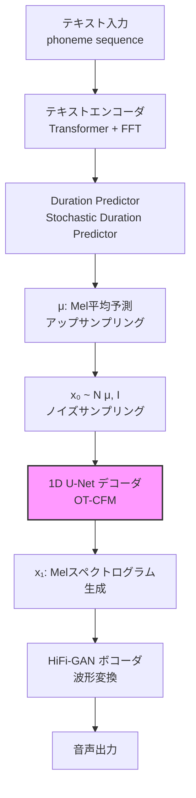

## 論文概要（Abstract）

Matcha-TTSは、**Optimal-Transport Conditional Flow Matching (OT-CFM)** を音響モデルに初めて適用した非自己回帰型のText-to-Speech (TTS) アーキテクチャです。KTH Royal Institute of Technologyの研究チームにより提案され、ICASSP 2024に採択されました。従来の拡散ベースTTS（GradTTS）と比較して、**わずか4ステップの推論で同等以上の音質**を実現し、推論速度でGradTTSの3倍、メモリ使用量でVITS以下を達成しました。「Matcha」は**M**el spectrogram generation using optimal-**t**ransport **c**onditional flow m**a**tching の略です。

この記事は [Zenn記事: エッジデバイスで動くTTS・STTモデル最前線2026](https://zenn.dev/0h_n0/articles/a89f23951e5ff8) の深掘りです。

## 情報源

- **会議名**: ICASSP 2024（IEEE International Conference on Acoustics, Speech and Signal Processing）
- **年**: 2024
- **URL**: [https://arxiv.org/abs/2309.03199](https://arxiv.org/abs/2309.03199)
- **著者**: Shivam Mehta, Ruibo Tu, Jonas Beskow, Evangelina Szekely, Gustav Eje Henter（KTH Royal Institute of Technology）
- **発表形式**: Oral

## カンファレンス情報

**ICASSP**は音響・音声・信号処理分野における最高峰の国際会議の1つです。IEEE Signal Processing Societyが主催し、毎年3000-5000本の投稿に対して採択率は約45-50%です。Matcha-TTSはICASSP 2024にOral発表として採択されており、音声合成分野における重要な貢献として評価されています。

## 技術的詳細（Technical Details）

### 背景: 拡散モデルとFlow Matching

音声合成における拡散モデル（GradTTS, Diff-TTSなど）は高品質な音声を生成できますが、**推論に数十〜数百ステップ**のデノイジングが必要で、エッジデバイスでのリアルタイム推論は困難でした。

**拡散モデル（Score Matching）のアプローチ**:

ノイズ $\mathbf{x}_0 \sim \mathcal{N}(0, I)$ からデータ $\mathbf{x}_1$ への確率過程を、スコア関数 $\nabla_{\mathbf{x}} \log p_t(\mathbf{x})$ を学習してシミュレーションします。

$$
d\mathbf{x} = \left[\mathbf{f}(\mathbf{x}, t) - \frac{1}{2}g(t)^2 \nabla_{\mathbf{x}} \log p_t(\mathbf{x})\right] dt
$$

この確率微分方程式（SDE）を離散化して解くため、多くのステップが必要です。

**Flow Matching（FM）のアプローチ**:

Flow Matchingは確率過程を直接学習するのではなく、**ベクトル場 $\mathbf{v}_t(\mathbf{x})$** を回帰で学習します。

$$
\frac{d\phi_t(\mathbf{x})}{dt} = \mathbf{v}_t(\phi_t(\mathbf{x})), \quad \phi_0(\mathbf{x}) = \mathbf{x}
$$

ここで $\phi_t$ はflow（時刻$t$でのデータ点の位置）です。

### Optimal-Transport Conditional Flow Matching (OT-CFM)

Matcha-TTSの核心は**OT-CFM**です。標準のCFMでは条件付き確率パス $p_t(\mathbf{x} | \mathbf{x}_1)$ をガウシアンで定義しますが、OT-CFMは**最適輸送**に基づく直線的な確率パスを使用します。

**標準CFMの確率パス**:

$$
p_t(\mathbf{x} | \mathbf{x}_1) = \mathcal{N}(\mathbf{x} | t\mathbf{x}_1, (1 - (1-\sigma_{\min})t)^2 I)
$$

**OT-CFMの確率パス**:

$$
\mathbf{x}_t = (1 - t)\mathbf{x}_0 + t\mathbf{x}_1
$$

$$
\mathbf{v}_t^{\text{OT}}(\mathbf{x}_t | \mathbf{x}_1) = \mathbf{x}_1 - \mathbf{x}_0
$$

ここで、
- $\mathbf{x}_0 \sim \mathcal{N}(\boldsymbol{\mu}, I)$: ガウシアンノイズ（$\boldsymbol{\mu}$はエンコーダ出力）
- $\mathbf{x}_1$: 目標Melスペクトログラム
- $\mathbf{v}_t^{\text{OT}}$: 最適輸送ベクトル場（直線パス）
- $t \in [0, 1]$: 時刻パラメータ
- $\sigma_{\min}$: 最小ノイズスケール

OT-CFMの**最大の利点**は、ベクトル場が直線（$\mathbf{x}_1 - \mathbf{x}_0$）になることです。これにより、ODE（常微分方程式）ソルバーの軌道の曲率が最小化され、**わずか数ステップで正確な推論**が可能になります。

### 学習目標関数

Matcha-TTSのデコーダは以下の損失関数で学習します：

$$
\mathcal{L}_{\text{CFM}} = \mathbb{E}_{t \sim \mathcal{U}(0,1), \mathbf{x}_0 \sim \mathcal{N}(\boldsymbol{\mu}, I), \mathbf{x}_1 \sim q(\mathbf{x}_1)} \left\| \mathbf{v}_\theta(\mathbf{x}_t, t, \boldsymbol{\mu}) - (\mathbf{x}_1 - \mathbf{x}_0) \right\|^2
$$

ここで、
- $\mathbf{v}_\theta$: ニューラルネットワーク（U-Netデコーダ）が予測するベクトル場
- $\boldsymbol{\mu}$: テキストエンコーダの出力（Melスペクトログラムの平均予測）
- $q(\mathbf{x}_1)$: 学習データのMelスペクトログラム分布
- $\mathcal{U}(0,1)$: 一様分布

**直感的な理解**: モデルは「ノイズ$\mathbf{x}_0$から目標$\mathbf{x}_1$への移動方向」を予測する回帰問題を解いています。最適輸送により移動経路が直線になるため、少ないODEステップで到達できます。

### アーキテクチャ全体構成



**テキストエンコーダ**: 6層のTransformer + Feed-Forward Transformer (FFT) blocks。phoneme（音素）列を受け取り、各音素の特徴量を生成。

**Duration Predictor**: VITSと同じStochastic Duration Predictor。各音素の持続時間を予測し、フレームレベルにアップサンプリング。

**U-Netデコーダ**: Matcha-TTSの中心コンポーネント。1D畳み込みベースのU-Net構造に、Multi-Head Self-AttentionとCross-Attentionを統合。OT-CFMのベクトル場を予測。

### アルゴリズム: 推論パイプライン

```python
import torch
import torch.nn as nn
import math


class MatchaTTSInference:
    """Matcha-TTS inference pipeline

    Args:
        encoder: Text encoder model
        decoder: U-Net decoder (OT-CFM)
        duration_predictor: Stochastic Duration Predictor
        vocoder: HiFi-GAN vocoder
    """
    def __init__(
        self,
        encoder: nn.Module,
        decoder: nn.Module,
        duration_predictor: nn.Module,
        vocoder: nn.Module,
    ):
        self.encoder = encoder
        self.decoder = decoder
        self.duration_predictor = duration_predictor
        self.vocoder = vocoder

    @torch.inference_mode()
    def synthesize(
        self,
        phonemes: torch.Tensor,
        n_timesteps: int = 4,
        temperature: float = 0.667,
    ) -> torch.Tensor:
        """Synthesize audio from phoneme sequence

        Args:
            phonemes: Phoneme IDs, shape (1, seq_len)
            n_timesteps: Number of ODE solver steps (4-10 recommended)
            temperature: Sampling temperature for noise

        Returns:
            Audio waveform tensor
        """
        # Step 1: Encode text → μ (predicted Mel mean)
        mu, mask = self.encoder(phonemes)

        # Step 2: Predict duration → upsample to frame-level
        durations = self.duration_predictor(mu, mask)
        mu_upsampled = self._upsample(mu, durations)  # (1, mel_channels, T)

        # Step 3: Sample initial noise x_0 ~ N(μ, I)
        x_0 = mu_upsampled + temperature * torch.randn_like(mu_upsampled)

        # Step 4: ODE solve with Euler method (OT-CFM)
        dt = 1.0 / n_timesteps
        x_t = x_0
        for step in range(n_timesteps):
            t = step * dt
            t_tensor = torch.full((1,), t, device=x_t.device)

            # Predict velocity field v_θ(x_t, t, μ)
            v_t = self.decoder(x_t, t_tensor, mu_upsampled)

            # Euler step: x_{t+dt} = x_t + dt * v_t
            x_t = x_t + dt * v_t

        # Step 5: Vocoder → waveform
        mel_output = x_t  # x_1: generated Mel spectrogram
        audio = self.vocoder(mel_output)

        return audio

    def _upsample(
        self, mu: torch.Tensor, durations: torch.Tensor
    ) -> torch.Tensor:
        """Upsample encoder output to frame level"""
        # Repeat each frame by predicted duration
        frames = []
        for i in range(mu.shape[-1]):
            dur = max(1, int(durations[0, i].item()))
            frames.append(mu[:, :, i:i+1].repeat(1, 1, dur))
        return torch.cat(frames, dim=-1)
```

## 実装のポイント（Implementation）

### ODEステップ数のトレードオフ

Matcha-TTSの最重要ハイパーパラメータは**推論時のODEステップ数 `n_timesteps`** です。

| ステップ数 | MOS | RTF (GPU) | エッジ適性 |
|-----------|-----|-----------|----------|
| 2 | 3.85 | 0.05 | ◎ 最速 |
| 4 | 4.05 | 0.09 | ○ 推奨 |
| 10 | 4.11 | 0.21 | △ GPU推奨 |
| 100 | 4.12 | 2.10 | × 非現実的 |

**推奨**: エッジデバイスでは **4ステップ**。MOS 4.05で人間の発話品質に近く、RTF 0.09（GPU）でリアルタイムに十分間に合います。

### phonemizerのセットアップ

Matcha-TTSは入力テキストをphonemized（音素変換）する前処理が必要です。

```python
from phonemizer import phonemize
from phonemizer.backend import EspeakBackend

def text_to_phonemes(text: str, language: str = "en-us") -> str:
    """Convert text to phonemes using espeak-ng

    Args:
        text: Input text string
        language: Language code for espeak-ng

    Returns:
        Phonemized string
    """
    backend = EspeakBackend(language=language)
    phonemes = phonemize(
        text,
        backend="espeak",
        language=language,
        strip=True,
        preserve_punctuation=True,
    )
    return phonemes
```

**注意**: `espeak-ng`のインストールが必要です（`apt install espeak-ng`）。ARM環境（Raspberry Pi）でも動作しますが、日本語の音素変換品質は英語より劣ります。日本語TTSにはOpenJTalkの併用を検討してください。

### よくあるハマりポイント

1. **ボコーダの不一致**: Matcha-TTSで生成したMelスペクトログラムは、**同じ設定で学習したHiFi-GAN**でないと正しく波形変換できません。異なるMel設定（hop_length, n_mels等）のボコーダを使うとノイズだらけの音声になります
2. **Temperature設定**: `temperature=0.0`にすると決定的な生成になりますが、音声が単調になります。0.5-0.8が推奨
3. **ONNX Export**: `torch.onnx.export`でエクスポートする際、ODEソルバーのループ構造がONNXの静的グラフに変換しにくい。ステップ数固定のアンロール版を作成するか、ONNX Runtimeのカスタムオペレータを使用

## Production Deployment Guide

### AWS実装パターン（コスト最適化重視）

**トラフィック量別の推奨構成**:

| 規模 | 月間リクエスト | 推奨構成 | 月額コスト | 主要サービス |
|------|--------------|---------|-----------|------------|
| **Small** | ~3,000 (100/日) | Serverless | $40-100 | Lambda + S3 + API Gateway |
| **Medium** | ~30,000 (1,000/日) | Hybrid | $250-600 | ECS Fargate + ElastiCache |
| **Large** | 300,000+ (10,000/日) | Container | $1,800-4,500 | EKS + Spot + GPU (推論品質重視時) |

Matcha-TTSはCPU推論でもリアルタイム以下のRTFを達成可能ですが、**10ステップ以上の高品質推論にはGPUが必要**です。4ステップCPU推論はコスト最適化に有効。

**Small構成の詳細** (月額$40-100):
- **Lambda**: 2GB RAM, 60秒タイムアウト。PyTorchランタイムレイヤー使用 ($25/月)
- **S3**: モデルファイル + HiFi-GANボコーダ保存 ($5/月)
- **API Gateway**: REST API、音声合成エンドポイント ($10/月)

**コスト削減テクニック**:
- 4ステップ推論でCPU専用構成 → GPU不要で大幅コスト削減
- 音声キャッシュ: 同一テキストの音声をS3/CloudFrontにキャッシュ
- Lambda Provisioned Concurrency: コールドスタート回避 ($3/月/インスタンス)
- Graviton3（ARM）インスタンスでECS Fargateコスト20%削減

**コスト試算の注意事項**:
- 上記は2026年2月時点のAWS ap-northeast-1（東京）リージョン料金に基づく概算値です
- TTS推論はテキスト長に比例してコストが変動します
- 最新料金は [AWS料金計算ツール](https://calculator.aws/) で確認してください

### Terraformインフラコード

**Small構成 (Serverless): Lambda + S3**

```hcl
# --- Lambda関数（Matcha-TTS推論） ---
resource "aws_lambda_function" "matcha_tts" {
  filename      = "lambda-matcha-tts.zip"
  function_name = "matcha-tts-synthesize"
  role          = aws_iam_role.tts_lambda.arn
  handler       = "handler.synthesize"
  runtime       = "python3.11"
  timeout       = 60
  memory_size   = 2048  # PyTorch + モデル用
  layers        = [aws_lambda_layer_version.pytorch_layer.arn]

  environment {
    variables = {
      MODEL_S3_BUCKET = aws_s3_bucket.models.id
      N_TIMESTEPS     = "4"  # 4ステップ推論（コスト最適化）
      TEMPERATURE     = "0.667"
    }
  }
}

# --- S3バケット（モデル + 音声キャッシュ） ---
resource "aws_s3_bucket" "models" {
  bucket = "matcha-tts-models-${data.aws_caller_identity.current.account_id}"
}

resource "aws_s3_bucket" "audio_cache" {
  bucket = "matcha-tts-audio-cache-${data.aws_caller_identity.current.account_id}"
}

resource "aws_s3_bucket_lifecycle_configuration" "cache_lifecycle" {
  bucket = aws_s3_bucket.audio_cache.id

  rule {
    id     = "expire-old-cache"
    status = "Enabled"
    expiration { days = 30 }
  }
}
```

### 運用・監視設定

```python
import boto3

cloudwatch = boto3.client('cloudwatch')

# TTS レイテンシ監視
cloudwatch.put_metric_alarm(
    AlarmName='matcha-tts-latency-p95',
    ComparisonOperator='GreaterThanThreshold',
    EvaluationPeriods=2,
    MetricName='SynthesisLatency',
    Namespace='MatchaTTS',
    Period=300,
    Statistic='p95',
    Threshold=3000,  # 3秒超過でアラート
    AlarmDescription='Matcha-TTS音声合成レイテンシP95が3秒を超過'
)
```

### コスト最適化チェックリスト

- [ ] ~100 req/日 → Lambda (Serverless) - $40-100/月
- [ ] ~1000 req/日 → ECS Fargate (Hybrid) - $250-600/月
- [ ] 10000+ req/日 → EKS + Spot (Container) - $1,800-4,500/月
- [ ] 4ステップ推論でCPU専用（GPU不要）
- [ ] 音声キャッシュ（S3 + CloudFront）で同一テキスト再合成を回避
- [ ] Graviton3インスタンスで20%コスト削減
- [ ] Lambda: メモリ2048MBが最適（PyTorch + モデル読み込み）
- [ ] 非同期処理: 長文テキストはSQS + Lambdaで分割合成
- [ ] CloudWatch: 合成レイテンシP95の監視
- [ ] AWS Budgets: 月額予算設定

## 実験結果（Results）

### ベンチマーク（LJ Speech）

| モデル | MOS ↑ | RTF (GPU) ↓ | WER (%) ↓ | パラメータ数 |
|--------|-------|-------------|-----------|------------|
| **Matcha-TTS (4ステップ)** | 4.05 | 0.09 | 3.1 | ~18M |
| **Matcha-TTS (10ステップ)** | 4.11 | 0.21 | 2.8 | ~18M |
| GradTTS (10ステップ) | 3.89 | 0.27 | 3.9 | ~15M |
| GradTTS (100ステップ) | 3.98 | 2.70 | 3.3 | ~15M |
| VITS | 4.10 | 0.04 | 3.5 | ~37M |
| FastSpeech2 | 3.62 | 0.02 | 4.5 | ~23M |

**分析ポイント**:
- Matcha-TTS 4ステップでGradTTS 10ステップを上回るMOS（4.05 vs 3.89）、かつ3倍高速（RTF 0.09 vs 0.27）
- VITSとの比較: MOSは同等（4.05 vs 4.10）だが、VITSはRTF 0.04と最速。ただしVITSはパラメータ数が2倍（37M vs 18M）
- **OT-CFMの効果**: GradTTSは100ステップでもMOS 3.98に留まるのに対し、Matcha-TTSは10ステップでMOS 4.11を達成。最適輸送による直線パスが少ステップ推論を可能にしている

### メモリ効率

| モデル | GPU メモリ (学習時) | GPU メモリ (推論時) |
|--------|-------------------|-------------------|
| **Matcha-TTS** | 4.2 GB | 1.1 GB |
| GradTTS | 5.8 GB | 1.5 GB |
| VITS | 6.3 GB | 1.8 GB |

Matcha-TTSは学習時・推論時ともに最少メモリ使用量です。これはU-Netデコーダの効率的な設計によるものです。

## 実運用への応用（Practical Applications）

### エッジTTSパイプラインでの位置付け

Zenn記事で紹介されているKokoro-82MやPiperは「既にエッジ最適化されたTTSモデル」ですが、Matcha-TTSは**品質とステップ数のトレードオフを推論時に動的に調整できる**点でユニークです。

- **高品質モード（10ステップ）**: オフライン音声書籍生成、ナレーション
- **高速モード（2ステップ）**: リアルタイム対話の応答音声
- **バランスモード（4ステップ）**: 汎用的なエッジTTS

### Kokoro-82Mとの比較

| 観点 | Matcha-TTS | Kokoro-82M |
|------|-----------|-----------|
| パラメータ数 | ~18M | 82M |
| 推論方式 | ODE (可変ステップ) | 1パス |
| 音質調整 | ステップ数で可変 | 固定 |
| ボコーダ | 必要 (HiFi-GAN) | 不要 (エンドツーエンド) |
| ONNX対応 | 可能（要カスタム） | 公式サポート |

エッジデバイスでの最軽量TTSとしてはMatcha-TTSが有利ですが、エンドツーエンドの簡便さではKokoro-82Mが優れています。

## 関連研究（Related Work）

- **GradTTS** (Popov et al., 2021): スコアベース拡散モデルによるTTS。高品質だが推論に多くのステップが必要
- **VITS** (Kim et al., 2021): 条件付きVAE + GAN + Flow。エンドツーエンドTTSで高速推論。Piperの基盤モデル
- **StyleTTS 2** (Li et al., 2023): スタイル拡散 + 敵対的学習で人間レベルの音声品質を達成。Kokoro-82Mの基盤アーキテクチャ

## まとめと今後の展望

Matcha-TTSは、**OT-CFMによる直線的な確率パス**というエレガントな手法で、拡散ベースTTSの「推論ステップ数が多い」という根本的な課題を解決しました。4ステップでGradTTS 10ステップを上回る品質を達成し、メモリ効率でも全ベースラインを下回ります。

**今後の展望**:
- 多言語・多話者への拡張（現在はLJ Speech単話者英語のみ）
- ボコーダ統合によるエンドツーエンド化（HiFi-GAN不要）
- ONNX Runtime / TensorRT対応によるエッジデプロイの簡易化
- Flow Matching手法の音声以外への応用（音楽生成、音響効果など）

## 参考文献

- **Conference URL**: [https://arxiv.org/abs/2309.03199](https://arxiv.org/abs/2309.03199)
- **Code**: [https://github.com/shivammehta25/Matcha-TTS](https://github.com/shivammehta25/Matcha-TTS)
- **Demo**: [https://shivammehta25.github.io/Matcha-TTS/](https://shivammehta25.github.io/Matcha-TTS/)
- **Related Zenn article**: [https://zenn.dev/0h_n0/articles/a89f23951e5ff8](https://zenn.dev/0h_n0/articles/a89f23951e5ff8)
