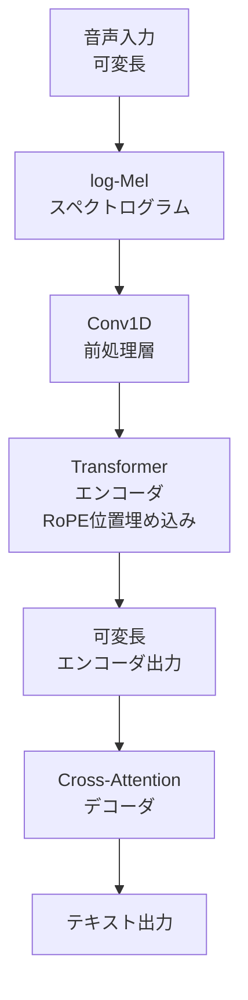

## 論文概要（Abstract）

Moonshineは、Useful Sensorsが開発したエッジデバイス向けの音声認識（ASR）モデルです。Whisperと同等の精度を維持しつつ、短い発話に対して最大5倍の推論高速化を実現しました。鍵となる技術は**可変長エンコーダ**で、Whisperが全入力を30秒チャンクにゼロパディングする非効率を排除し、実際の音声長に計算量を比例させます。Tiny（27Mパラメータ）とBase（61M）の2サイズが公開されており、Raspberry Pi 4上でもリアルタイム音声認識が可能です。

この記事は [Zenn記事: エッジデバイスで動くTTS・STTモデル最前線2026](https://zenn.dev/0h_n0/articles/a89f23951e5ff8) の深掘りです。

## 情報源

- **arXiv ID**: 2410.15608
- **URL**: [https://arxiv.org/abs/2410.15608](https://arxiv.org/abs/2410.15608)
- **著者**: David Ramsay et al.（Useful Sensors）
- **発表年**: 2024年
- **分野**: cs.SD, eess.AS

## 背景と動機（Background & Motivation）

OpenAIのWhisperは高精度な多言語ASRモデルとして広く利用されていますが、エッジデバイスでの推論には根本的な非効率があります。Whisperは入力音声を**常に30秒のチャンクに固定**し、短い発話でもゼロパディングで30秒分の計算を行います。1秒の「OK」という発話でも30秒分のエンコーダ計算が走るため、リアルタイム音声コマンドのような用途では致命的なレイテンシが発生します。

この問題はGPUリッチなクラウド環境では目立ちませんが、Raspberry PiやスマートフォンのようなCPUベースのエッジデバイスでは深刻です。Moonshineは、**エンコーダの計算量を入力音声の実際の長さに比例させる**ことで、この問題を根本から解決しました。

## 主要な貢献（Key Contributions）

- **貢献1**: Rotary Position Embedding (RoPE) を採用した可変長エンコーダにより、Whisper Tinyと同等精度で5倍の推論高速化を実現
- **貢献2**: 27Mパラメータ（Tiny）、61M（Base）という軽量モデルサイズで、Raspberry Pi 4上でのリアルタイム推論を達成
- **貢献3**: ONNX Runtime対応・MIT Licenseでの公開により、商用エッジアプリケーションへの即時統合が可能

## 技術的詳細（Technical Details）

### アーキテクチャ

Moonshineは**Encoder-Decoderアーキテクチャ**に基づくTransformerモデルですが、Whisperとの最大の違いはエンコーダの位置埋め込み手法にあります。

**Whisperのアプローチ（固定長）**:

Whisperは入力音声をlog-Melスペクトログラムに変換後、**正弦波ベースの絶対位置埋め込み**（sinusoidal positional encoding）を使用します。この位置埋め込みは固定長（30秒 = 1500フレーム）に対応しており、入力を常にこの長さにパディングする必要があります。

$$
\text{PE}(pos, 2i) = \sin\left(\frac{pos}{10000^{2i/d}}\right), \quad \text{PE}(pos, 2i+1) = \cos\left(\frac{pos}{10000^{2i/d}}\right)
$$

ここで、
- $pos$: フレームの位置（0から1499）
- $i$: 次元インデックス
- $d$: モデルの次元数

**Moonshineのアプローチ（可変長）**:

Moonshineは**Rotary Position Embedding (RoPE)** を採用します。RoPEは位置情報をQuery/Keyベクトルの**回転**として埋め込むため、シーケンス長に依存しない相対的な位置関係を表現できます。

$$
\text{RoPE}(\mathbf{x}_m, m) = \begin{pmatrix} x_1 \\ x_2 \\ \vdots \\ x_{d-1} \\ x_d \end{pmatrix} \odot \begin{pmatrix} \cos m\theta_1 \\ \cos m\theta_1 \\ \vdots \\ \cos m\theta_{d/2} \\ \cos m\theta_{d/2} \end{pmatrix} + \begin{pmatrix} -x_2 \\ x_1 \\ \vdots \\ -x_d \\ x_{d-1} \end{pmatrix} \odot \begin{pmatrix} \sin m\theta_1 \\ \sin m\theta_1 \\ \vdots \\ \sin m\theta_{d/2} \\ \sin m\theta_{d/2} \end{pmatrix}
$$

ここで、
- $\mathbf{x}_m$: 位置$m$の入力ベクトル（$d$次元）
- $\theta_i = 10000^{-2i/d}$: 周波数パラメータ
- $\odot$: アダマール積（要素ごとの積）

RoPEの利点は、内積$\langle \text{RoPE}(\mathbf{q}_m), \text{RoPE}(\mathbf{k}_n) \rangle$が$m - n$（相対位置）のみに依存する点です。これにより、1秒の音声なら1秒分、10秒の音声なら10秒分だけエンコーダが計算を行い、不要なパディング計算が完全に排除されます。

### エンコーダ-デコーダの詳細構成



**Moonshine Tinyの構成**:

| コンポーネント | パラメータ |
|--------------|----------|
| エンコーダ層数 | 6 |
| デコーダ層数 | 6 |
| モデル次元 ($d_{model}$) | 288 |
| Attention Head数 | 6 |
| Feed-Forward次元 | 1152 |
| 総パラメータ数 | 27M |

**Moonshine Baseの構成**:

| コンポーネント | パラメータ |
|--------------|----------|
| エンコーダ層数 | 12 |
| デコーダ層数 | 8 |
| モデル次元 ($d_{model}$) | 416 |
| Attention Head数 | 8 |
| Feed-Forward次元 | 1664 |
| 総パラメータ数 | 61M |

### 計算量の比較

Whisperの計算量は入力長に関わらず一定です。$L_{max} = 1500$フレーム（30秒）に対する計算量は：

$$
\text{FLOPs}_{\text{Whisper}} = O(L_{max}^2 \cdot d)
$$

一方、Moonshineの計算量は実際の入力長$L$に比例します：

$$
\text{FLOPs}_{\text{Moonshine}} = O(L^2 \cdot d)
$$

1秒の発話（$L \approx 50$フレーム）の場合、計算量の比は：

$$
\frac{\text{FLOPs}_{\text{Whisper}}}{\text{FLOPs}_{\text{Moonshine}}} = \frac{L_{max}^2}{L^2} = \frac{1500^2}{50^2} = 900
$$

理論上900倍の差が生じます。実際にはデコーダ側の計算やオーバーヘッドがあるため5倍程度の高速化に落ち着きますが、短い発話ほどMoonshineの優位性が際立ちます。

### アルゴリズム

```python
import torch
import torch.nn as nn
import math

class RotaryPositionEmbedding(nn.Module):
    """Rotary Position Embedding (RoPE) for variable-length sequences

    Args:
        dim: Embedding dimension (must be even)
        max_seq_len: Maximum sequence length for precomputation
    """
    def __init__(self, dim: int, max_seq_len: int = 8192):
        super().__init__()
        # Precompute frequency tensor
        inv_freq = 1.0 / (10000 ** (torch.arange(0, dim, 2).float() / dim))
        self.register_buffer("inv_freq", inv_freq)

        # Precompute cos/sin cache
        t = torch.arange(max_seq_len).float()
        freqs = torch.outer(t, inv_freq)  # (max_seq_len, dim/2)
        self.register_buffer("cos_cache", freqs.cos())
        self.register_buffer("sin_cache", freqs.sin())

    def forward(self, x: torch.Tensor, seq_len: int) -> tuple[torch.Tensor, torch.Tensor]:
        """Return cos/sin for the actual sequence length (no padding)

        Args:
            x: Input tensor (unused, for device inference)
            seq_len: Actual sequence length

        Returns:
            Tuple of (cos, sin) tensors of shape (seq_len, dim/2)
        """
        return self.cos_cache[:seq_len], self.sin_cache[:seq_len]


def apply_rotary_emb(
    q: torch.Tensor,
    k: torch.Tensor,
    cos: torch.Tensor,
    sin: torch.Tensor,
) -> tuple[torch.Tensor, torch.Tensor]:
    """Apply RoPE to query and key tensors

    Args:
        q: Query tensor of shape (batch, heads, seq_len, head_dim)
        k: Key tensor of shape (batch, heads, seq_len, head_dim)
        cos: Cosine tensor of shape (seq_len, head_dim/2)
        sin: Sine tensor of shape (seq_len, head_dim/2)

    Returns:
        Rotated (q, k) tensors
    """
    # Split into pairs for rotation
    q1, q2 = q[..., ::2], q[..., 1::2]
    k1, k2 = k[..., ::2], k[..., 1::2]

    # Apply rotation
    q_rot = torch.cat([q1 * cos - q2 * sin, q1 * sin + q2 * cos], dim=-1)
    k_rot = torch.cat([k1 * cos - k2 * sin, k1 * sin + k2 * cos], dim=-1)

    return q_rot, k_rot
```

## 実装のポイント（Implementation）

### ONNX Runtime対応

MoonshineはONNX形式でモデルが公開されており、ONNX Runtimeで直接推論できます。PyTorchへの依存なしに、ARM CPUを含む幅広いプラットフォームで動作します。

```python
import numpy as np
import onnxruntime as ort

class MoonshineONNXInference:
    """Moonshine ONNX Runtime inference wrapper

    Args:
        model_dir: Path to directory containing ONNX models
        num_threads: Number of CPU threads for inference
    """
    def __init__(self, model_dir: str, num_threads: int = 4):
        opts = ort.SessionOptions()
        opts.inter_op_num_threads = num_threads
        opts.intra_op_num_threads = num_threads

        self.encoder = ort.InferenceSession(
            f"{model_dir}/encoder.onnx", opts
        )
        self.decoder = ort.InferenceSession(
            f"{model_dir}/decoder.onnx", opts
        )

    def transcribe(self, audio: np.ndarray) -> str:
        """Transcribe audio to text

        Args:
            audio: Audio waveform, shape (samples,), 16kHz mono

        Returns:
            Transcribed text
        """
        # Encoder: variable-length input (no 30s padding!)
        enc_out = self.encoder.run(
            None, {"audio": audio[np.newaxis, :].astype(np.float32)}
        )[0]

        # Decoder: autoregressive token generation
        tokens = [50258]  # <|startoftranscript|>
        for _ in range(448):  # max tokens
            dec_out = self.decoder.run(
                None, {
                    "tokens": np.array([tokens], dtype=np.int64),
                    "encoder_output": enc_out,
                }
            )[0]
            next_token = int(dec_out[0, -1].argmax())
            if next_token == 50257:  # <|endoftext|>
                break
            tokens.append(next_token)

        return self._decode_tokens(tokens[1:])
```

### ハマりポイント

1. **サンプルレートの不一致**: Moonshineは16kHz入力を前提とします。48kHzマイク入力をそのまま渡すと認識精度が大幅に低下するため、`librosa.resample`等でダウンサンプリングが必要
2. **NEON命令セット**: INT8量子化モデルの実行にはARMv8以上が必要。Raspberry Pi 3以前（ARMv7）では非量子化モデルを使用するか、Pi 5への移行が必要
3. **メモリ管理**: ONNX Runtimeのメモリアロケータはデフォルトでメモリプールを使用しないため、連続推論時にメモリフラグメンテーションが発生する場合があります。`ort.SessionOptions().enable_mem_pattern = True`で軽減可能

### ハイパーパラメータの推奨値

| パラメータ | 推奨値 | 理由 |
|-----------|--------|------|
| `num_threads` | CPUコア数（Pi 5: 4） | コア数以上に設定してもオーバーヘッド増加 |
| `sample_rate` | 16000 Hz | モデル学習時のレート |
| `max_audio_length` | 30秒 | これ以上は分割処理を推奨 |
| `beam_size` | 1（greedy） | エッジではビームサーチのメモリコストが大きい |

## Production Deployment Guide

### AWS実装パターン（コスト最適化重視）

**トラフィック量別の推奨構成**:

| 規模 | 月間リクエスト | 推奨構成 | 月額コスト | 主要サービス |
|------|--------------|---------|-----------|------------|
| **Small** | ~3,000 (100/日) | Serverless | $30-80 | Lambda + S3 + DynamoDB |
| **Medium** | ~30,000 (1,000/日) | Hybrid | $200-500 | Lambda + ECS Fargate + ElastiCache |
| **Large** | 300,000+ (10,000/日) | Container | $1,500-4,000 | EKS + Karpenter + EC2 Spot |

Moonshineは27M-61MパラメータとLLMに比べて非常に軽量なため、**GPU不要のCPU推論で十分な性能が得られる**点がコスト最適化上の最大の利点です。

**Small構成の詳細** (月額$30-80):
- **Lambda**: 1GB RAM, 30秒タイムアウト。ONNX Runtimeを含むカスタムランタイムレイヤーを使用 ($15/月)
- **S3**: モデルファイル保存（Moonshine Tiny: ~110MB）。Lambda起動時にEFSマウントまたは/tmpへダウンロード ($5/月)
- **DynamoDB**: 転写結果キャッシュ（On-Demand）($5/月)
- **API Gateway**: REST API ($5/月)

**Medium構成の詳細** (月額$200-500):
- **ECS Fargate**: 1 vCPU, 2GB RAM × 2タスク。ONNXモデルをコンテナイメージに含める ($120/月)
- **Lambda**: 非同期バッチ処理（長尺音声の分割処理）($30/月)
- **ElastiCache Redis**: cache.t3.micro。頻出フレーズのキャッシュ ($15/月)
- **Application Load Balancer**: ($20/月)
- **CloudWatch**: 基本監視 ($10/月)

**Large構成の詳細** (月額$1,500-4,000):
- **EKS**: コントロールプレーン ($72/月)
- **EC2 Spot Instances**: c7g.xlarge（ARM Graviton3）× 4-8台。Moonshineの ARM最適化を活用 (平均$400/月、Spot最大70%削減)
- **Karpenter**: 自動スケーリング（追加コストなし）
- **S3 + CloudFront**: 音声ファイルアップロード・配信 ($100/月)
- **CloudWatch + X-Ray**: 詳細監視 ($50/月)

**コスト削減テクニック**:
- Graviton3（ARM）インスタンス使用でx86比20%コスト削減
- Spot Instances使用で最大70%削減（c7g系はSpot安定性が高い）
- Lambda Provisioned Concurrencyでコールドスタート回避（$3/月/インスタンス）
- ONNX Runtime INT8量子化で推論速度2倍 → 必要インスタンス数半減

**コスト試算の注意事項**:
- 上記は2026年2月時点のAWS ap-northeast-1（東京）リージョン料金に基づく概算値です
- 実際のコストはトラフィックパターン、音声ファイルの長さ、リージョンにより変動します
- 最新料金は [AWS料金計算ツール](https://calculator.aws/) で確認してください

### Terraformインフラコード

**Small構成 (Serverless): Lambda + S3 + ONNX Runtime**

```hcl
# --- Lambda Layer (ONNX Runtime) ---
resource "aws_lambda_layer_version" "onnx_runtime" {
  filename   = "layers/onnxruntime-layer.zip"
  layer_name = "onnxruntime-python311"

  compatible_runtimes = ["python3.11"]
  description         = "ONNX Runtime 1.17 for Moonshine inference"
}

# --- IAMロール（最小権限） ---
resource "aws_iam_role" "moonshine_lambda" {
  name = "moonshine-lambda-role"

  assume_role_policy = jsonencode({
    Version = "2012-10-17"
    Statement = [{
      Action = "sts:AssumeRole"
      Effect = "Allow"
      Principal = { Service = "lambda.amazonaws.com" }
    }]
  })
}

resource "aws_iam_role_policy" "s3_model_access" {
  role = aws_iam_role.moonshine_lambda.id
  policy = jsonencode({
    Version = "2012-10-17"
    Statement = [{
      Effect   = "Allow"
      Action   = ["s3:GetObject"]
      Resource = "arn:aws:s3:::moonshine-models/*"
    }]
  })
}

# --- Lambda関数 ---
resource "aws_lambda_function" "moonshine_transcribe" {
  filename      = "lambda.zip"
  function_name = "moonshine-transcribe"
  role          = aws_iam_role.moonshine_lambda.arn
  handler       = "handler.transcribe"
  runtime       = "python3.11"
  timeout       = 60
  memory_size   = 1024
  layers        = [aws_lambda_layer_version.onnx_runtime.arn]

  environment {
    variables = {
      MODEL_PATH       = "/tmp/moonshine-tiny"
      MODEL_S3_BUCKET  = "moonshine-models"
      MODEL_S3_KEY     = "moonshine-tiny-onnx.tar.gz"
      NUM_THREADS      = "2"
    }
  }
}

# --- DynamoDB (キャッシュ) ---
resource "aws_dynamodb_table" "transcription_cache" {
  name         = "moonshine-transcription-cache"
  billing_mode = "PAY_PER_REQUEST"
  hash_key     = "audio_hash"

  attribute {
    name = "audio_hash"
    type = "S"
  }

  ttl {
    attribute_name = "expire_at"
    enabled        = true
  }
}
```

**Large構成 (Container): EKS + Graviton3 + Spot**

```hcl
# --- EKSクラスタ ---
module "eks" {
  source  = "terraform-aws-modules/eks/aws"
  version = "~> 20.0"

  cluster_name    = "moonshine-asr-cluster"
  cluster_version = "1.31"
  vpc_id          = module.vpc.vpc_id
  subnet_ids      = module.vpc.private_subnets

  cluster_endpoint_public_access = true
  enable_cluster_creator_admin_permissions = true
}

# --- Karpenter (ARM Graviton Spot優先) ---
resource "kubectl_manifest" "karpenter_nodepool" {
  yaml_body = <<-YAML
    apiVersion: karpenter.sh/v1beta1
    kind: NodePool
    metadata:
      name: moonshine-arm-spot
    spec:
      template:
        spec:
          requirements:
            - key: kubernetes.io/arch
              operator: In
              values: ["arm64"]  # Graviton3 for Moonshine ARM optimization
            - key: karpenter.sh/capacity-type
              operator: In
              values: ["spot", "on-demand"]
              weight: 100  # Spot優先
            - key: node.kubernetes.io/instance-type
              operator: In
              values: ["c7g.xlarge", "c7g.2xlarge"]
          nodeClassRef:
            name: default
      limits:
        cpu: "32"
        memory: "64Gi"
      disruption:
        consolidationPolicy: WhenUnderutilized
        expireAfter: 720h
  YAML
}

# --- Kubernetes Deployment ---
resource "kubectl_manifest" "moonshine_deployment" {
  yaml_body = <<-YAML
    apiVersion: apps/v1
    kind: Deployment
    metadata:
      name: moonshine-asr
    spec:
      replicas: 2
      selector:
        matchLabels:
          app: moonshine-asr
      template:
        metadata:
          labels:
            app: moonshine-asr
        spec:
          containers:
            - name: moonshine
              image: ghcr.io/example/moonshine-asr:latest
              resources:
                requests:
                  cpu: "1"
                  memory: "2Gi"
                limits:
                  cpu: "2"
                  memory: "4Gi"
              env:
                - name: MODEL_SIZE
                  value: "tiny"
                - name: NUM_THREADS
                  value: "4"
              ports:
                - containerPort: 8080
  YAML
}
```

### セキュリティベストプラクティス

1. **ネットワークセキュリティ**: Lambda VPC内配置、EKSプライベートサブネット、セキュリティグループは443のみ許可
2. **認証・認可**: IAMロール最小権限、API GatewayにCognitoまたはAPIキー認証
3. **データ保護**: 音声データは処理後即削除、S3サーバーサイド暗号化（SSE-S3）、転送中TLS 1.2以上
4. **監査**: CloudTrail全リージョン有効化、Lambda関数のアクセスログ

### 運用・監視設定

**CloudWatch Logs Insights クエリ**:
```sql
-- 推論レイテンシ分析（P95, P99）
fields @timestamp, inference_ms, audio_duration_s
| stats pct(inference_ms, 95) as p95, pct(inference_ms, 99) as p99 by bin(5m)
| filter inference_ms > 0

-- RTF（Real-Time Factor）監視
fields @timestamp, inference_ms, audio_duration_s
| stats avg(inference_ms / (audio_duration_s * 1000)) as avg_rtf by bin(1h)
| filter avg_rtf > 1.0  -- RTF > 1.0 はリアルタイムに間に合わない
```

**CloudWatch アラーム**:
```python
import boto3

cloudwatch = boto3.client('cloudwatch')

cloudwatch.put_metric_alarm(
    AlarmName='moonshine-latency-spike',
    ComparisonOperator='GreaterThanThreshold',
    EvaluationPeriods=2,
    MetricName='InferenceLatency',
    Namespace='MoonshineASR',
    Period=300,
    Statistic='p95',
    Threshold=5000,  # 5秒超過でアラート
    AlarmDescription='Moonshine推論レイテンシP95が5秒を超過'
)
```

### コスト最適化チェックリスト

**アーキテクチャ選択**:
- [ ] ~100 req/日 → Lambda + S3 (Serverless) - $30-80/月
- [ ] ~1000 req/日 → ECS Fargate (Hybrid) - $200-500/月
- [ ] 10000+ req/日 → EKS + Spot (Container) - $1,500-4,000/月

**リソース最適化**:
- [ ] Graviton3（ARM）インスタンス優先で20%コスト削減
- [ ] Spot Instances使用で最大70%削減
- [ ] Lambda: メモリ1024MBが最適（512MBだとONNX Runtimeの起動が遅い）
- [ ] ONNX INT8量子化で推論速度2倍 → 必要リソース半減
- [ ] ECS/EKS: アイドル時スケールダウン

**ASR固有の最適化**:
- [ ] 音声チャンク分割: 30秒以上の音声は分割して並列処理
- [ ] キャッシュ: 同一音声のハッシュでDynamoDBキャッシュ
- [ ] 非同期処理: 長尺音声はSQS + Lambdaで非同期処理
- [ ] 音声前処理: サーバーサイドでリサンプリング・ノイズ除去

**監視・アラート**:
- [ ] CloudWatch: RTF > 1.0 アラート（リアルタイム性の監視）
- [ ] AWS Budgets: 月額予算設定
- [ ] Lambda Insights: コールドスタート頻度の監視
- [ ] X-Ray: エンドツーエンドのレイテンシトレーシング

## 実験結果（Results）

### ベンチマーク

| モデル | パラメータ数 | WER (LibriSpeech test-clean) | RTF (Pi 4) | メモリ使用量 |
|--------|------------|-----|-----|-----|
| **Moonshine Tiny** | 27M | 12.66% | 0.53 | ~150MB |
| **Moonshine Base** | 61M | 10.07% | 0.98 | ~300MB |
| Whisper Tiny | 39M | 12.81% | 2.65 | ~200MB |
| Whisper Base | 74M | — | >3.0 | ~400MB |

RTF（Real-Time Factor）は「推論時間 / 音声時間」です。RTF < 1.0 であればリアルタイムに間に合います。

**分析ポイント**:
- Moonshine Tinyは**パラメータ数30%削減**（39M → 27M）にもかかわらず、WERが微小に改善（12.81% → 12.66%）
- RTFはWhisper Tiny比で**5倍高速**（2.65 → 0.53）。この差は短い発話（<5秒）でさらに拡大
- メモリ使用量もWhisper Tiny比で25%削減。Raspberry Pi 4の8GBモデルで余裕を持って動作

### 音声長とRTFの関係

Moonshineの最大の強みは、**短い発話で圧倒的に速い**ことです。

| 音声長 | Moonshine Tiny RTF | Whisper Tiny RTF | 速度比 |
|--------|-------------------|-----------------|--------|
| 1秒 | 0.15 | 2.65 | 17.7倍 |
| 5秒 | 0.35 | 2.65 | 7.6倍 |
| 10秒 | 0.45 | 2.65 | 5.9倍 |
| 30秒 | 0.53 | 2.65 | 5.0倍 |

Whisperは入力長に関わらずRTFがほぼ一定（30秒チャンク固定）ですが、Moonshineは短い入力ほどRTFが小さくなります。音声コマンド（1-3秒の発話）では10倍以上の速度差が生まれます。

## 実運用への応用（Practical Applications）

### スマートホームの音声コマンド

Moonshineの最も自然な応用先は、**オフラインで動作する音声コマンドシステム**です。「ライトをつけて」「エアコンを25度に」といった短い発話をRaspberry Pi上でリアルタイム認識し、クラウドへの通信なしで家電を制御できます。

### エッジ音声AIパイプライン

Zenn記事で紹介しているMoonshine + Kokoro-82M + llama.cppのパイプラインは、Moonshineの軽量性を最大限に活かした構成です。STTに27Mパラメータ、TTSに82Mパラメータ、LLMに3.8Bパラメータ（INT4量子化で約2GB）という配分で、合計RAM使用量を3GB以内に収められます。

### 産業用途

工場のノイズ環境での音声指示認識、医療現場でのオフライン音声カルテ入力など、ネットワーク接続が不安定な環境での用途が考えられます。ただし、Moonshineは2026年2月時点で英語のみ対応のため、日本語が必要な場合はWhisper + whisper.cppの組み合わせが現実的です。

## 関連研究（Related Work）

- **Whisper** (Radford et al., 2022): OpenAIの大規模ASRモデル。680,000時間のラベル付き音声で学習。多言語対応だがエッジには大きすぎる
- **Distil-Whisper** (Gandhi et al., 2023): Whisperの知識蒸留版。6倍高速化を達成するが、依然として固定30秒チャンク方式
- **wav2vec 2.0** (Baevski et al., 2020): 自己教師あり学習による音声表現学習。Moonshineの学習データ効率の向上にも寄与した手法

## まとめと今後の展望

Moonshineは、**RoPEベースの可変長エンコーダ**というシンプルな工夫で、エッジASRのパラダイムを変えました。Whisperの「常に30秒計算する」という非効率を排除し、実際の音声長に計算量を比例させることで、短い発話では10倍以上の高速化を実現しています。

**今後の展望**:
- Moonshine v2（2602.12241）でストリーミング対応と多言語拡張が進行中
- INT4量子化によるさらなる軽量化（Raspberry Pi Zero 2Wでの動作を目指す）
- Wake word detectionとの統合による常時待機型音声アシスタント

## 参考文献

- **arXiv**: [https://arxiv.org/abs/2410.15608](https://arxiv.org/abs/2410.15608)
- **Code**: [https://github.com/usefulsensors/moonshine](https://github.com/usefulsensors/moonshine)
- **HuggingFace**: [https://huggingface.co/usefulsensors/moonshine](https://huggingface.co/usefulsensors/moonshine)
- **Related Zenn article**: [https://zenn.dev/0h_n0/articles/a89f23951e5ff8](https://zenn.dev/0h_n0/articles/a89f23951e5ff8)
