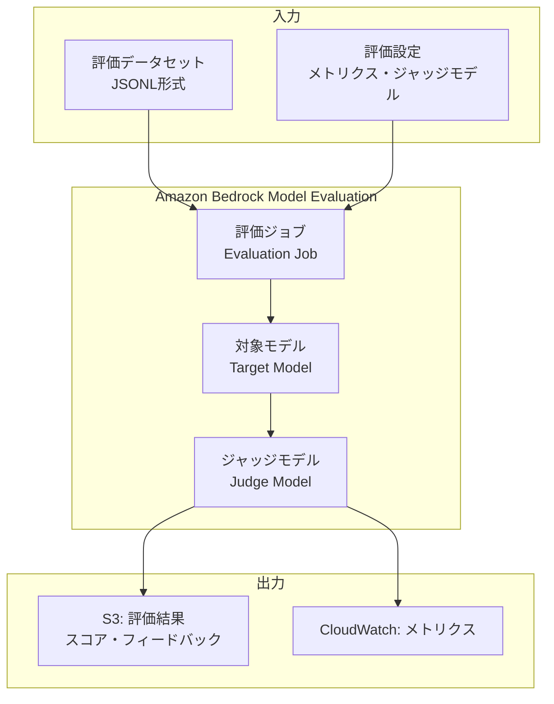
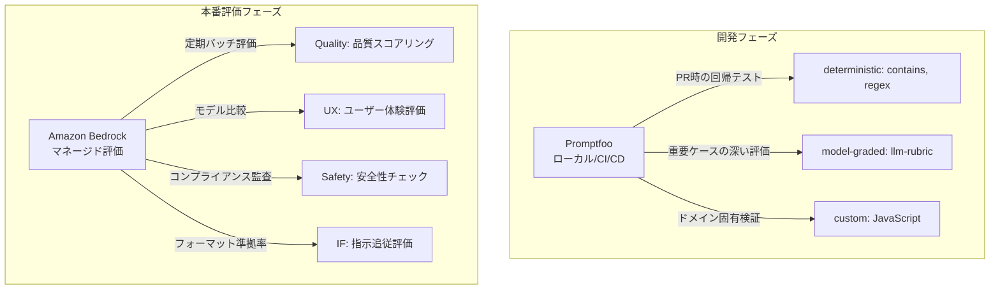

## ブログ概要（Summary）

AWSが2025年2月に公開した「LLM-as-a-judge on Amazon Bedrock Model Evaluation」は、Amazon BedrockのマネージドLLM評価機能を使って、LLM出力の品質を自動評価する方法を解説した技術ブログです。品質（Quality）、ユーザーエクスペリエンス（UX）、指示追従（Instruction Following）、安全性（Safety）の4軸でLLMの出力を自動スコアリングし、コンソールUIとPython SDK（Boto3）の両方から評価ジョブを実行する方法を示しています。

この記事は [Zenn記事: LLM評価駆動開発（EDD）実践：Promptfooでテストファーストなプロンプト改善を回す](https://zenn.dev/0h_n0/articles/18d31ec58faffb) の深掘りです。

## 情報源

- **種別**: 企業テックブログ
- **URL**: [https://aws.amazon.com/blogs/machine-learning/llm-as-a-judge-on-amazon-bedrock-model-evaluation/](https://aws.amazon.com/blogs/machine-learning/llm-as-a-judge-on-amazon-bedrock-model-evaluation/)
- **組織**: AWS / Amazon Web Services
- **発表日**: 2025年2月

## 技術的背景（Technical Background）

LLMの出力品質を評価する従来の方法には、人手評価とルールベースの自動評価がありましたが、それぞれ重大な制約を抱えています。

**人手評価の課題**:
- 高コスト（1件あたり数分のレビュー時間）
- スケーラビリティの欠如（大規模テストスイートに対応困難）
- 評価者間のばらつき（Inter-rater reliability）
- CI/CDへの組み込みが不可能

**ルールベース自動評価の課題**:
- BLEU/ROUGEは表面的な一致のみを測定
- セマンティックな品質を捉えられない
- 新しいタスクごとにルール設計が必要

LLM-as-a-Judgeは、LLMの推論能力を活用して、人手評価に近い品質の自動評価を実現する第三のアプローチです。Zenn記事のPromptfooでは`llm-rubric`や`factuality`アサーションとしてこの手法が実装されていますが、Amazon BedrockはこれをマネージドサービスとしてAWSインフラに統合し、インフラ管理なしで評価ジョブを実行できるようにしています。

## 実装アーキテクチャ（Architecture）

### Amazon Bedrock Model Evaluationの全体構成



### 4軸評価フレームワーク

Amazon Bedrockは、LLM出力を以下の4軸で評価します。

**1. 品質（Quality）**:

$$
\text{Quality Score} = f(\text{Correctness}, \text{Completeness}, \text{Coherence})
$$

回答の正確性・完全性・一貫性を総合的に評価します。事実に基づいているか、必要な情報を網羅しているか、論理的に一貫しているかをジャッジモデルが判定します。

**2. ユーザーエクスペリエンス（UX）**:

$$
\text{UX Score} = f(\text{Helpfulness}, \text{Clarity}, \text{Tone})
$$

ユーザーにとっての有用性・明瞭さ・トーンの適切さを評価します。技術的に正確でも、ユーザーの理解度に合わない回答は低評価になります。

**3. 指示追従（Instruction Following）**:

$$
\text{IF Score} = f(\text{Format Compliance}, \text{Constraint Adherence}, \text{Task Completion})
$$

指定されたフォーマット制約の遵守、出力長さ制限の遵守、タスクの完了度を評価します。Promptfooの`contains`/`not-contains`アサーションはこのdeterministic版に相当します。

**4. 安全性（Safety）**:

$$
\text{Safety Score} = f(\text{Harmlessness}, \text{Policy Compliance}, \text{Bias Detection})
$$

有害コンテンツの不生成、ポリシー遵守、バイアスの検出を評価します。

### コンソールUIでの評価ジョブ作成

AWSコンソールからの評価ジョブ作成手順：

1. **Amazon Bedrock コンソール** → **Model evaluation** → **Create evaluation job**
2. **評価タイプ選択**: 「LLM-as-a-judge」を選択
3. **対象モデル選択**: 評価したいモデル（例: Claude 3.5 Sonnet）
4. **ジャッジモデル選択**: 評価に使用するモデル（例: Claude 3.5 Haiku）
5. **メトリクス選択**: 品質/UX/指示追従/安全性から選択
6. **データセット指定**: S3上のJSONLファイルを指定
7. **出力先設定**: S3バケットとプレフィックスを指定

### Python SDK（Boto3）での評価ジョブ実行

```python
import boto3
import json
from datetime import datetime

def create_bedrock_evaluation_job(
    target_model_id: str,
    judge_model_id: str,
    dataset_s3_uri: str,
    output_s3_uri: str,
    evaluation_metrics: list[str],
    job_name: str | None = None
) -> dict:
    """Amazon BedrockのLLM-as-a-Judge評価ジョブを作成

    Args:
        target_model_id: 評価対象モデルのID
            例: "anthropic.claude-3-5-sonnet-20241022-v2:0"
        judge_model_id: ジャッジモデルのID
            例: "anthropic.claude-3-5-haiku-20241022-v1:0"
        dataset_s3_uri: 評価データセットのS3 URI
            例: "s3://my-bucket/eval-dataset.jsonl"
        output_s3_uri: 結果出力先のS3 URI
            例: "s3://my-bucket/eval-results/"
        evaluation_metrics: 評価メトリクスのリスト
            例: ["quality", "instruction_following", "safety"]
        job_name: ジョブ名（省略時は自動生成）

    Returns:
        作成されたジョブの情報
    """
    client = boto3.client('bedrock', region_name='ap-northeast-1')

    if job_name is None:
        timestamp = datetime.now().strftime("%Y%m%d-%H%M%S")
        job_name = f"llm-eval-{timestamp}"

    # 評価設定の構築
    evaluation_config = {
        "automated": {
            "datasetMetricConfigs": [
                {
                    "taskType": "General",
                    "dataset": {
                        "name": "eval-dataset",
                        "datasetLocation": {
                            "s3Uri": dataset_s3_uri
                        }
                    },
                    "metricNames": evaluation_metrics
                }
            ]
        }
    }

    # ジャッジモデルの設定
    inference_config = {
        "models": [
            {
                "bedrockModel": {
                    "modelIdentifier": target_model_id,
                    "inferenceParams": json.dumps({
                        "temperature": 0,  # 再現性のため
                        "max_tokens": 4096
                    })
                }
            }
        ]
    }

    response = client.create_evaluation_job(
        jobName=job_name,
        evaluationConfig=evaluation_config,
        inferenceConfig=inference_config,
        outputDataConfig={
            "s3Uri": output_s3_uri
        },
        roleArn="arn:aws:iam::role/BedrockEvaluationRole"
    )

    return {
        "job_arn": response["jobArn"],
        "job_name": job_name,
        "status": "CREATED"
    }


def wait_for_evaluation_job(job_arn: str) -> dict:
    """評価ジョブの完了を待機

    Args:
        job_arn: ジョブのARN

    Returns:
        ジョブの最終ステータスと結果
    """
    import time
    client = boto3.client('bedrock', region_name='ap-northeast-1')

    while True:
        response = client.get_evaluation_job(jobIdentifier=job_arn)
        status = response["status"]

        if status in ["Completed", "Failed", "Stopped"]:
            return {
                "status": status,
                "output_s3_uri": response.get("outputDataConfig", {}).get("s3Uri"),
                "metrics": response.get("evaluationResults", {})
            }

        time.sleep(30)  # 30秒ごとにポーリング
```

### 評価データセットの形式

Amazon Bedrock Model Evaluationでは、以下のJSONL形式のデータセットを使用します。

```json
{"prompt": "日本の首都はどこですか？", "referenceResponse": "東京都です。"}
{"prompt": "Pythonでリストをソートする方法は？", "referenceResponse": "sorted()関数またはlist.sort()メソッドを使用します。"}
{"prompt": "量子コンピューティングとは何ですか？", "referenceResponse": "量子力学の原理を利用して計算を行うコンピューティング技術です。"}
```

## Promptfooとの統合パターン

Zenn記事で紹介されているPromptfooとAmazon Bedrock Model Evaluationは、以下のように使い分けることが推奨されます。



**使い分けの指針**:

| ユースケース | 推奨ツール | 理由 |
|---|---|---|
| PR時の回帰テスト | Promptfoo | 高速、ローカル実行、GitHub Actions統合 |
| モデル比較（A/B） | Bedrock | 複数モデルの同時評価、マネージド実行 |
| 安全性監査 | Bedrock | 標準化された安全性メトリクス |
| カスタムドメイン評価 | Promptfoo | 柔軟なアサーション定義 |
| 定期バッチ評価 | Bedrock | スケーラブル、インフラ管理不要 |

## パフォーマンス最適化（Performance）

**Amazon Bedrock Model Evaluationの性能特性**:

| 項目 | 値 | 備考 |
|---|---|---|
| ジョブ開始時間 | 1-3分 | ジョブキューの混雑度に依存 |
| 評価スループット | 50-200件/分 | モデルのInference速度に依存 |
| 結果取得 | ジョブ完了後即時 | S3に自動出力 |
| 最大データセットサイズ | 10,000件 | 1ジョブあたり |

**最適化テクニック**:

1. **並列ジョブ実行**: 複数の評価ジョブを同時実行して総時間を短縮
2. **データセット分割**: 大規模データセットを複数ジョブに分割して並列処理
3. **ジャッジモデルの選択**: Haiku（高速・低コスト）でスクリーニング→ Sonnet（高精度）で詳細評価
4. **Prompt Caching**: 同一ジャッジプロンプトの再利用でコスト削減

## 運用での学び（Production Lessons）

AWSブログから読み取れる実運用上の教訓：

**1. ジャッジモデルと対象モデルの分離**

同一プロバイダー・同一モデルをジャッジと対象の両方に使うと**自己優遇バイアス**が発生します。Claude Sonnetを評価する場合、ジャッジにはGPT-4oを使う、あるいはその逆が推奨されます。Amazon Bedrockでは複数プロバイダーのモデルにアクセスできるため、このクロスプロバイダー評価が容易です。

**2. temperature=0での評価**

評価の再現性を確保するため、ジャッジモデルの`temperature`は`0`に設定します。これにより、同じ入力に対して同じ評価結果が得られ、プロンプト変更のbefore/after比較が信頼できるものになります。

**3. 評価結果の統計的解釈**

単一のスコアだけでなく、スコアの分布（平均・標準偏差・中央値・四分位範囲）を確認します。平均スコアが改善しても標準偏差が増加している場合、一部のケースで劣化が起きている可能性があります。

**4. コスト管理**

LLM-as-a-Judgeの評価にはAPI呼び出しコストがかかります。1テストケースあたりのコストを事前に試算し、評価頻度とのバランスを取ることが重要です。

| モデル（ジャッジ） | コスト/1Kトークン | 100件評価の概算 |
|---|---|---|
| Claude 3.5 Haiku | $0.25 入力 / $1.25 出力 | ~$0.50 |
| Claude 3.5 Sonnet | $3.00 入力 / $15.00 出力 | ~$6.00 |
| GPT-4o | $2.50 入力 / $10.00 出力 | ~$5.00 |

## 学術研究との関連（Academic Connection）

Amazon BedrockのLLM-as-a-Judge機能は、以下の学術研究を基盤としています。

- **MT-Bench / Chatbot Arena** (Zheng et al., 2023, arXiv:2306.05685): LLM-as-a-Judgeの概念と位置バイアスの発見。Bedrockの評価エンジンの理論的基盤
- **When Better Prompts Hurt** (arXiv:2601.22025): 評価駆動プロンプト開発の必要性を実証。Bedrockのmodel evaluationはこのフレームワークの実装の一形態
- **Judging LLM-as-a-Judge** (Zheng et al., 2023): ジャッジモデルのバイアスと信頼性の分析。Bedrockの評価設計に影響

## Production Deployment Guide

### AWS実装パターン（コスト最適化重視）

Amazon Bedrock Model Evaluationを中心とした評価パイプラインの構成です。

**トラフィック量別の推奨構成**:

| 規模 | 評価頻度 | 推奨構成 | 月額コスト | 主要サービス |
|------|---------|---------|-----------|------------|
| **Small** | 週1回 | マネージド | $30-80 | Bedrock Eval + S3 |
| **Medium** | 日次 | Hybrid | $200-600 | Bedrock Eval + Step Functions + SNS |
| **Large** | 常時 | Full Pipeline | $1,000-3,000 | Bedrock Eval + ECS + ElastiCache |

**Small構成の詳細** (月額$30-80):
- **Bedrock Evaluation Job**: 週1回のバッチ評価 ($40/月)
- **S3**: データセット・結果保存 ($5/月)
- **EventBridge**: 週次スケジュール ($1/月)
- **Lambda**: 結果通知 ($5/月)

**コスト削減テクニック**:
- ジャッジモデルにHaikuを使用（Sonnet比で80%以上削減）
- 評価データセットのサンプリング（全件ではなく代表サンプルで評価）
- 変更があったプロンプト/モデルのみ再評価

**コスト試算の注意事項**:
- 上記は2026年2月時点のAWS ap-northeast-1料金に基づく概算値です
- Bedrockの評価ジョブはInferenceコスト（入出力トークン課金）が主なコスト要因です
- 最新料金は [AWS料金計算ツール](https://calculator.aws/) で確認してください

### Terraformインフラコード

```hcl
# --- IAMロール: Bedrock Evaluation ---
resource "aws_iam_role" "bedrock_eval" {
  name = "bedrock-evaluation-role"
  assume_role_policy = jsonencode({
    Version = "2012-10-17"
    Statement = [{
      Action    = "sts:AssumeRole"
      Effect    = "Allow"
      Principal = { Service = "bedrock.amazonaws.com" }
    }]
  })
}

resource "aws_iam_role_policy" "bedrock_eval_policy" {
  role = aws_iam_role.bedrock_eval.id
  policy = jsonencode({
    Version = "2012-10-17"
    Statement = [
      {
        Effect = "Allow"
        Action = [
          "bedrock:InvokeModel",
          "bedrock:CreateEvaluationJob",
          "bedrock:GetEvaluationJob"
        ]
        Resource = "*"
      },
      {
        Effect = "Allow"
        Action = ["s3:GetObject", "s3:PutObject", "s3:ListBucket"]
        Resource = [
          aws_s3_bucket.eval_data.arn,
          "${aws_s3_bucket.eval_data.arn}/*"
        ]
      }
    ]
  })
}

# --- S3: 評価データ・結果保存 ---
resource "aws_s3_bucket" "eval_data" {
  bucket = "bedrock-eval-data-${data.aws_caller_identity.current.account_id}"
}

resource "aws_s3_bucket_server_side_encryption_configuration" "eval_data_enc" {
  bucket = aws_s3_bucket.eval_data.id
  rule {
    apply_server_side_encryption_by_default {
      sse_algorithm = "aws:kms"
    }
  }
}

resource "aws_s3_bucket_lifecycle_configuration" "eval_lifecycle" {
  bucket = aws_s3_bucket.eval_data.id
  rule {
    id     = "expire-old-results"
    status = "Enabled"
    filter { prefix = "results/" }
    expiration { days = 90 }
  }
}

# --- EventBridge: 週次評価スケジュール ---
resource "aws_cloudwatch_event_rule" "weekly_eval" {
  name                = "bedrock-weekly-eval"
  schedule_expression = "cron(0 4 ? * MON *)"
}

# --- Lambda: 評価ジョブ起動・結果通知 ---
resource "aws_lambda_function" "eval_trigger" {
  function_name = "bedrock-eval-trigger"
  role          = aws_iam_role.eval_trigger_role.arn
  handler       = "eval_trigger.handler"
  runtime       = "python3.12"
  timeout       = 60
  memory_size   = 256
  environment {
    variables = {
      EVAL_ROLE_ARN       = aws_iam_role.bedrock_eval.arn
      S3_DATASET_URI      = "s3://${aws_s3_bucket.eval_data.id}/datasets/"
      S3_OUTPUT_URI       = "s3://${aws_s3_bucket.eval_data.id}/results/"
      TARGET_MODEL_ID     = "anthropic.claude-3-5-sonnet-20241022-v2:0"
      JUDGE_MODEL_ID      = "anthropic.claude-3-5-haiku-20241022-v1:0"
      SNS_TOPIC_ARN       = aws_sns_topic.eval_notifications.arn
    }
  }
}

resource "aws_iam_role" "eval_trigger_role" {
  name = "bedrock-eval-trigger-role"
  assume_role_policy = jsonencode({
    Version = "2012-10-17"
    Statement = [{
      Action    = "sts:AssumeRole"
      Effect    = "Allow"
      Principal = { Service = "lambda.amazonaws.com" }
    }]
  })
}

# --- SNS: 評価結果通知 ---
resource "aws_sns_topic" "eval_notifications" {
  name = "bedrock-eval-notifications"
}

# --- CloudWatch: コスト監視 ---
resource "aws_budgets_budget" "eval_budget" {
  name         = "bedrock-eval-monthly"
  budget_type  = "COST"
  limit_amount = "200"
  limit_unit   = "USD"
  time_unit    = "MONTHLY"

  notification {
    comparison_operator       = "GREATER_THAN"
    threshold                 = 80
    threshold_type            = "PERCENTAGE"
    notification_type         = "ACTUAL"
    subscriber_email_addresses = ["ops@example.com"]
  }
}
```

### セキュリティベストプラクティス

- **IAMロール**: Bedrock EvaluationJobの最小権限（CreateEvaluationJob, GetEvaluationJob, InvokeModel）
- **S3暗号化**: KMSによるサーバーサイド暗号化必須
- **ネットワーク**: VPCエンドポイント経由でBedrockにアクセス（パブリックインターネット不使用）
- **監査**: CloudTrailで全Bedrock API呼び出しを記録

### コスト最適化チェックリスト

**ジャッジモデル選択**:
- [ ] スクリーニング: Claude 3.5 Haiku ($0.25/MTok) — 大量評価向け
- [ ] 詳細評価: Claude 3.5 Sonnet ($3/MTok) — 重要ケースのみ
- [ ] クロスプロバイダー: GPT-4o — バイアス軽減用

**評価頻度最適化**:
- [ ] 開発フェーズ: Promptfooでローカル評価（コスト最小）
- [ ] プレリリース: Bedrock Eval週次バッチ
- [ ] モデル変更時: Bedrock Eval即時実行
- [ ] 定期監査: Bedrock Eval月次フル評価

**監視・アラート**:
- [ ] AWS Budgets: 月額$200上限
- [ ] CloudWatch: 評価ジョブ失敗アラート
- [ ] SNS: 評価結果のスコア低下通知
- [ ] Cost Anomaly Detection有効化

**データ管理**:
- [ ] S3ライフサイクル: 90日で結果自動削除
- [ ] データセットバージョニング: S3バージョニング有効化
- [ ] 結果のタグ付け: プロンプトバージョン・モデルID・日時

## まとめと実践への示唆

Amazon BedrockのLLM-as-a-Judge機能は、Zenn記事で紹介されているPromptfooの`model-graded`アサーションをマネージドサービス化したものと位置づけられます。Promptfooが開発者ワークフロー（ローカル実行・GitHub Actions統合）に最適化されているのに対し、Bedrockは大規模な本番環境での定期評価・モデル比較・コンプライアンス監査に適しています。

実務での推奨パターンは、**開発フェーズではPromptfooでPR時の回帰テスト**、**本番フェーズではBedrock Model Evaluationで定期バッチ評価**という二層構成です。これにより、開発速度とスケーラビリティの両方を確保できます。

品質・UX・指示追従・安全性の4軸評価は、Promptfooの3層アサーション（deterministic/model-graded/custom）と組み合わせることで、包括的なLLM品質保証体制を構築できます。

## 参考文献

- **Blog URL**: [https://aws.amazon.com/blogs/machine-learning/llm-as-a-judge-on-amazon-bedrock-model-evaluation/](https://aws.amazon.com/blogs/machine-learning/llm-as-a-judge-on-amazon-bedrock-model-evaluation/)
- **Related Papers**: MT-Bench (arXiv:2306.05685), When Better Prompts Hurt (arXiv:2601.22025)
- **Related Zenn article**: [https://zenn.dev/0h_n0/articles/18d31ec58faffb](https://zenn.dev/0h_n0/articles/18d31ec58faffb)
