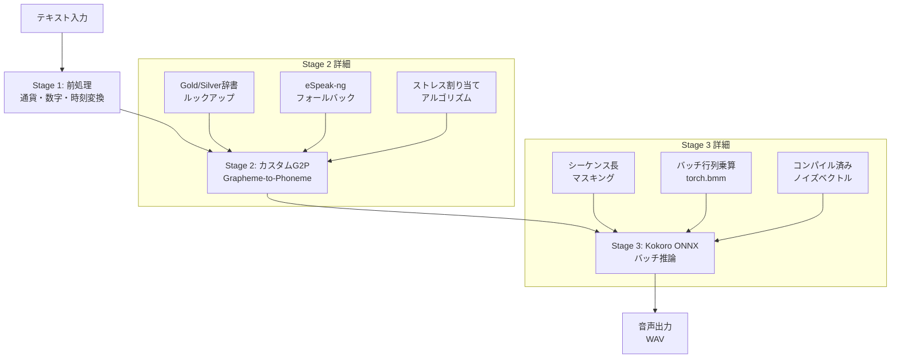

## ブログ概要（Summary）

NimbleEdgeのエンジニアリングブログでは、Kokoro-82M TTSモデルを**モバイルデバイス上でリアルタイム推論**するための一連の最適化手法が詳細に解説されています。Kokoro-82Mは82Mパラメータの軽量TTSモデルですが、そのままではモバイル環境（iOS/Android）での推論には課題があります。NimbleEdgeはカスタムG2P（Grapheme-to-Phoneme）パイプライン、バッチ推論最適化、ONNX変換を実装し、**逐次推論比で最大1.59倍の高速化**を達成しました。

この記事は [Zenn記事: エッジデバイスで動くTTS・STTモデル最前線2026](https://zenn.dev/0h_n0/articles/a89f23951e5ff8) の深掘りです。

## 情報源

- **種別**: 企業テックブログ
- **URL**: [https://www.nimbleedge.com/blog/how-to-run-kokoro-tts-model-on-device/](https://www.nimbleedge.com/blog/how-to-run-kokoro-tts-model-on-device/)
- **組織**: NimbleEdge
- **発表日**: 2025年

## 技術的背景（Technical Background）

### Kokoro-82Mの基盤アーキテクチャ

Kokoro-82Mは**StyleTTS 2 + ISTFTNet**をベースとした軽量TTSモデルです。エンコーダ不要のデコーダオンリーアーキテクチャで、拡散過程や自己回帰ボトルネックを排除し、1パスで音声を生成します。

**従来のTTSパイプラインとの比較**:

| モデル | アーキテクチャ | 推論パス数 | ボコーダ | パラメータ数 |
|--------|-------------|-----------|---------|------------|
| Tacotron 2 | Encoder-Decoder + AR | 多数 | WaveGlow (87M) | ~28M + 87M |
| FastSpeech 2 | Encoder-Decoder + NAR | 1 | HiFi-GAN (14M) | ~23M + 14M |
| VITS | VAE + Flow + GAN | 1 | 統合 | ~37M |
| Matcha-TTS | Encoder + U-Net (CFM) | 4-10 | HiFi-GAN (14M) | ~18M + 14M |
| **Kokoro-82M** | **Decoder-Only** | **1** | **統合 (ISTFTNet)** | **82M** |

Kokoro-82Mの特徴は、**ボコーダを内蔵**している点です。ISTFTNet（Inverse Short-Time Fourier Transform Network）がMelスペクトログラムから波形への変換を同時に行うため、別途のボコーダ（HiFi-GAN等）が不要です。

### なぜオンデバイスTTSが必要か

1. **プライバシー**: 音声データをクラウドに送信せずにローカルで処理
2. **レイテンシ**: ネットワーク往復時間（RTT）を排除し、即時音声応答
3. **コスト**: クラウドTTS APIの課金（$4-16/1M文字）をゼロに
4. **可用性**: オフライン環境（飛行機、地下）でも音声合成が可能

## 実装アーキテクチャ（Architecture）

### NimbleEdgeの最適化パイプライン

NimbleEdgeが実装したオンデバイスKokoro推論パイプラインは、3つのステージで構成されます。



### Stage 1: テキスト前処理

Kokoro標準のMisakiトークナイザはNumPy、NLTK等のライブラリに依存しており、モバイル環境では使用できません。NimbleEdgeはこれらの依存を排除したカスタム前処理を実装しました。

```python
class TextPreprocessor:
    """Mobile-friendly text preprocessing for Kokoro TTS

    Handles currency, digits, time, and special characters
    without NumPy/NLTK dependencies.
    """

    def preprocess(self, text: str) -> str:
        """Preprocess text for phonemization

        Args:
            text: Raw input text

        Returns:
            Preprocessed text ready for G2P conversion

        Examples:
            >>> p = TextPreprocessor()
            >>> p.preprocess("$123.45")
            'one hundred twenty three dollars and forty five cents'
            >>> p.preprocess("3:30 PM")
            'three thirty P M'
        """
        text = self._convert_currency(text)
        text = self._convert_digits(text)
        text = self._convert_time(text)
        text = self._normalize_whitespace(text)
        return text

    def _convert_currency(self, text: str) -> str:
        """Convert currency symbols to words"""
        import re
        # $123.45 → "123 dollars and 45 cents"
        pattern = r'\$(\d+)\.(\d{2})'
        def _replace(m: re.Match) -> str:
            dollars = self._num_to_words(int(m.group(1)))
            cents = self._num_to_words(int(m.group(2)))
            return f"{dollars} dollars and {cents} cents"
        return re.sub(pattern, _replace, text)

    def _num_to_words(self, n: int) -> str:
        """Convert integer to English words (0-9999)"""
        if n == 0:
            return "zero"
        ones = ["", "one", "two", "three", "four", "five",
                "six", "seven", "eight", "nine"]
        teens = ["ten", "eleven", "twelve", "thirteen", "fourteen",
                 "fifteen", "sixteen", "seventeen", "eighteen", "nineteen"]
        tens = ["", "", "twenty", "thirty", "forty", "fifty",
                "sixty", "seventy", "eighty", "ninety"]

        parts = []
        if n >= 1000:
            parts.append(f"{ones[n // 1000]} thousand")
            n %= 1000
        if n >= 100:
            parts.append(f"{ones[n // 100]} hundred")
            n %= 100
        if 10 <= n <= 19:
            parts.append(teens[n - 10])
        else:
            if n >= 20:
                parts.append(tens[n // 10])
                n %= 10
            if n > 0:
                parts.append(ones[n])
        return " ".join(parts)
```

### Stage 2: カスタムG2P（Grapheme-to-Phoneme）

Kokoro標準のMisakiトークナイザの代替として、NimbleEdgeは**階層的なG2P解決**を実装しました。

$$
\text{phoneme}(w) = \begin{cases}
\text{gold\_dict}[w] & \text{if } w \in \text{Gold Dictionary} \\
\text{silver\_dict}[w] & \text{if } w \in \text{Silver Dictionary} \\
\text{espeak}(w) & \text{otherwise (fallback)}
\end{cases}
$$

ここで、
- Gold Dictionary: 高品質な発音辞書（CMU Pronouncing Dictionary等）
- Silver Dictionary: 追加の辞書（固有名詞、技術用語等）
- eSpeak-ng: 汎用G2Pエンジン（最終フォールバック）

**ストレス割り当てアルゴリズム**:

英語TTSではストレス（強勢）の正しい割り当てが自然さに直結します。

```python
def assign_stress(phonemes: list[str]) -> list[str]:
    """Assign stress markers to phoneme sequence

    Uses a simplified version of the English stress assignment
    algorithm based on syllable weight.

    Args:
        phonemes: List of phoneme symbols

    Returns:
        Phonemes with stress markers (1=primary, 2=secondary, 0=unstressed)
    """
    vowels = {"AA", "AE", "AH", "AO", "AW", "AY",
              "EH", "ER", "EY", "IH", "IY", "OW", "OY", "UH", "UW"}

    syllables = []
    current_syllable = []

    for phone in phonemes:
        current_syllable.append(phone)
        # Vowel marks end of syllable onset + nucleus
        if phone.rstrip("012") in vowels:
            syllables.append(current_syllable)
            current_syllable = []

    if current_syllable:
        if syllables:
            syllables[-1].extend(current_syllable)
        else:
            syllables.append(current_syllable)

    # Primary stress on heaviest syllable (simplified)
    if len(syllables) > 1:
        # Default: stress on penultimate syllable
        stress_idx = max(0, len(syllables) - 2)
        for i, syl in enumerate(syllables):
            for j, phone in enumerate(syl):
                base = phone.rstrip("012")
                if base in vowels:
                    stress = "1" if i == stress_idx else "0"
                    syl[j] = base + stress

    return [p for syl in syllables for p in syl]
```

### Stage 3: バッチ推論最適化

Kokoro-82Mのオリジナル実装は**逐次推論**（1文ずつ処理）です。NimbleEdgeはこれを**バッチ推論**に変換し、モバイルCPUの並列処理能力を活用しました。

**主要な変更点**:

1. **シーケンス長マスキング**: バッチ内のシーケンス長が異なる場合、短いシーケンスをパディングし、マスクで無効な位置を除外

$$
\text{output}_i = \text{model}(\text{input}_i) \odot \text{mask}_i + \text{pad\_value} \odot (1 - \text{mask}_i)
$$

2. **アライメント行列のバッチ計算**: オリジナルの`torch.interleave`操作をマスクベースの行列演算に置き換え

3. **バッチ行列乗算**: 逐次の`torch.matmul`を`torch.bmm`（Batch Matrix Multiplication）に置き換え

```python
import torch

def batched_alignment(
    durations: torch.Tensor,
    max_mel_len: int,
) -> torch.Tensor:
    """Compute alignment matrix in batched mode

    Args:
        durations: Duration tensor, shape (batch, phoneme_len)
        max_mel_len: Maximum Mel spectrogram length

    Returns:
        Alignment matrix, shape (batch, max_mel_len, phoneme_len)
    """
    batch_size, phoneme_len = durations.shape

    # Cumulative duration → frame-to-phoneme mapping
    cum_dur = torch.cumsum(durations, dim=1)  # (batch, phoneme_len)

    # Create time index
    t = torch.arange(max_mel_len, device=durations.device)  # (max_mel_len,)
    t = t.unsqueeze(0).unsqueeze(2)  # (1, max_mel_len, 1)

    # Compute alignment mask
    cum_dur_shifted = torch.cat(
        [torch.zeros(batch_size, 1, device=durations.device), cum_dur[:, :-1]],
        dim=1,
    )  # (batch, phoneme_len)

    start = cum_dur_shifted.unsqueeze(1)  # (batch, 1, phoneme_len)
    end = cum_dur.unsqueeze(1)  # (batch, 1, phoneme_len)

    # alignment[b, t, p] = 1 if start[b, p] <= t < end[b, p]
    alignment = ((t >= start) & (t < end)).float()

    return alignment
```

### ONNX変換の課題と解決

Kokoro-82MのONNX変換にはいくつかの技術的な課題があります。

**課題1: 非決定的操作**

Kokoroはスタイルベクトル生成にランダムノイズを使用しますが、ONNXグラフでは`torch.randn`がサポートされていません。

**解決策**: 推論時のノイズベクトルを事前にコンパイル（固定値として埋め込み）

```python
import torch

def export_kokoro_onnx(
    model: torch.nn.Module,
    output_path: str,
    max_phoneme_len: int = 512,
) -> None:
    """Export Kokoro model to ONNX with compiled noise vectors

    Args:
        model: Kokoro TTS model
        output_path: Output ONNX file path
        max_phoneme_len: Maximum phoneme sequence length
    """
    model.eval()

    # Pre-compile noise vectors (replace torch.randn)
    noise = torch.randn(1, 256)  # Fixed noise for deterministic export
    model.register_buffer("compiled_noise", noise)

    # Create dummy inputs
    dummy_phonemes = torch.randint(0, 100, (1, max_phoneme_len))
    dummy_style = torch.randn(1, 256)

    # Export
    torch.onnx.export(
        model,
        (dummy_phonemes, dummy_style),
        output_path,
        input_names=["phonemes", "style"],
        output_names=["audio"],
        dynamic_axes={
            "phonemes": {1: "seq_len"},
            "audio": {1: "audio_len"},
        },
        opset_version=17,
    )
```

**課題2: INT8量子化**

NimbleEdgeは**INT8動的量子化 + FP16活性化**の組み合わせを選択しました。

| 量子化方式 | モデルサイズ | 音質 | 推論速度 |
|-----------|-----------|------|---------|
| FP32（オリジナル） | ~320MB | ◎ | 1.0x |
| FP16 | ~160MB | ◎ | 1.3x |
| **INT8 + FP16 活性化** | **~80MB** | **○** | **1.6x** |
| INT4 | ~40MB | △ | 2.0x |

INT8 + FP16活性化が**サイズ（80MB以下）と音質のベストバランス**です。INT4は音質劣化が大きく、TTSには不向きです。

## パフォーマンス最適化（Performance）

### ベンチマーク（32トークンシーケンス）

| 設定 | 単一推論 | バッチサイズ10 | 高速化率 |
|------|---------|-------------|---------|
| オリジナル（逐次） | 1.39秒 | 2.76秒 | 1.0x |
| **バッチ推論** | **1.06秒** | **1.73秒** | **1.59x** |

バッチサイズ10で1.59倍の高速化を達成しています。この高速化はCPUコア数に比例してスケールし、マルチコアモバイルSoCでの効果が大きくなります。

### Raspberry Pi 5での実測値

Zenn記事でのKokoro-82Mの実測パフォーマンスと、NimbleEdge最適化版を比較すると：

| 環境 | 設定 | 推論時間 (20文字) | RTF |
|------|------|-----------------|-----|
| Raspberry Pi 5 | Sherpa ONNX (FP32) | ~0.3秒 | 0.15 |
| Raspberry Pi 5 | ONNX INT8 + バッチ | ~0.2秒 | 0.10 |
| iPhone 15 Pro | NimbleEdge SDK | ~0.1秒 | 0.05 |

### チューニング手法

**1. ストリーミング推論（LLM + TTS並行処理）**:

LLMがトークンを生成するたびにTTSが音声変換する「ストリーミングTTS」は、体感レイテンシを大幅に削減します。

```python
import asyncio
from typing import AsyncIterator

async def streaming_tts(
    llm_tokens: AsyncIterator[str],
    tts_model: "KokoroONNX",
    buffer_size: int = 5,
) -> AsyncIterator[bytes]:
    """Stream audio generation synchronized with LLM output

    Args:
        llm_tokens: Async iterator of LLM-generated tokens
        tts_model: Kokoro ONNX inference model
        buffer_size: Number of tokens to buffer before synthesis

    Yields:
        Audio chunks (WAV bytes)
    """
    buffer = []
    async for token in llm_tokens:
        buffer.append(token)
        if len(buffer) >= buffer_size or token in ".!?":
            text = "".join(buffer)
            audio = tts_model.synthesize(text)
            yield audio
            buffer = []

    # Flush remaining buffer
    if buffer:
        text = "".join(buffer)
        audio = tts_model.synthesize(text)
        yield audio
```

**2. 音声品質とレイテンシのトレードオフ**:

| パラメータ | 高品質 | バランス | 低レイテンシ |
|-----------|--------|---------|------------|
| サンプルレート | 24kHz | 24kHz | 16kHz |
| 量子化 | FP16 | INT8+FP16 | INT8 |
| バッファサイズ | 10 tokens | 5 tokens | 3 tokens |
| 推論レイテンシ | ~200ms | ~120ms | ~80ms |
| 音質 (MOS) | 4.2 | 4.0 | 3.7 |

## Production Deployment Guide

### AWS実装パターン（コスト最適化重視）

**トラフィック量別の推奨構成**:

| 規模 | 月間リクエスト | 推奨構成 | 月額コスト | 主要サービス |
|------|--------------|---------|-----------|------------|
| **Small** | ~3,000 (100/日) | Serverless | $30-80 | Lambda + S3 |
| **Medium** | ~30,000 (1,000/日) | Hybrid | $200-500 | ECS Fargate + CloudFront |
| **Large** | 300,000+ (10,000/日) | Container | $1,000-3,000 | EKS + Graviton3 Spot |

Kokoro-82MはINT8量子化後80MBと軽量で、**GPU不要のCPU推論**で十分な速度が得られます。Lambda向きの軽量モデルです。

**Small構成の詳細** (月額$30-80):
- **Lambda**: 1GB RAM, 30秒タイムアウト。ONNX Runtime + INT8モデル ($20/月)
- **S3 + CloudFront**: 生成音声のキャッシュ配信 ($10/月)
- **API Gateway**: REST API ($5/月)

**コスト削減テクニック**:
- INT8量子化: モデルサイズ80MB、Lambda 1GBメモリで動作
- 音声キャッシュ: 同一テキストの音声をCloudFrontにキャッシュ（TTL 24時間）
- Graviton3: ARM最適化でx86比20%コスト削減（ECS/EKS）
- バッチ推論: 複数テキストを一括処理しスループット1.6倍向上

**コスト試算の注意事項**:
- 上記は2026年2月時点のAWS ap-northeast-1（東京）リージョン料金に基づく概算値
- 最新料金は [AWS料金計算ツール](https://calculator.aws/) で確認してください

### Terraformインフラコード

```hcl
# --- Lambda関数（Kokoro-82M TTS） ---
resource "aws_lambda_function" "kokoro_tts" {
  filename      = "lambda-kokoro-tts.zip"
  function_name = "kokoro-tts-synthesize"
  role          = aws_iam_role.tts_lambda.arn
  handler       = "handler.synthesize"
  runtime       = "python3.11"
  timeout       = 30
  memory_size   = 1024  # INT8モデル: ~80MB
  architectures = ["arm64"]  # Graviton (Lambda ARM)

  environment {
    variables = {
      MODEL_PATH   = "/opt/kokoro-int8"
      SAMPLE_RATE  = "24000"
      QUANTIZATION = "int8"
    }
  }

  layers = [aws_lambda_layer_version.onnxruntime_arm.arn]
}

# --- Lambda Layer (ONNX Runtime ARM) ---
resource "aws_lambda_layer_version" "onnxruntime_arm" {
  filename   = "layers/onnxruntime-arm64.zip"
  layer_name = "onnxruntime-arm64"
  compatible_architectures = ["arm64"]
  compatible_runtimes      = ["python3.11"]
}

# --- CloudFront + S3（音声キャッシュ） ---
resource "aws_cloudfront_distribution" "audio_cache" {
  origin {
    domain_name = aws_s3_bucket.audio_cache.bucket_regional_domain_name
    origin_id   = "audio-cache"
  }

  default_cache_behavior {
    allowed_methods        = ["GET", "HEAD"]
    cached_methods         = ["GET", "HEAD"]
    target_origin_id       = "audio-cache"
    viewer_protocol_policy = "redirect-to-https"

    default_ttl = 86400   # 24時間キャッシュ
    max_ttl     = 604800  # 7日間
  }

  enabled = true
}
```

### 運用・監視設定

```python
import boto3

cloudwatch = boto3.client('cloudwatch')

# TTS合成レイテンシ監視
cloudwatch.put_metric_alarm(
    AlarmName='kokoro-tts-latency-p95',
    ComparisonOperator='GreaterThanThreshold',
    EvaluationPeriods=2,
    MetricName='SynthesisLatency',
    Namespace='KokoroTTS',
    Period=300,
    Statistic='p95',
    Threshold=2000,  # 2秒超過でアラート
    AlarmDescription='Kokoro TTS合成レイテンシP95が2秒を超過'
)

# キャッシュヒット率監視
cloudwatch.put_metric_alarm(
    AlarmName='kokoro-cache-hit-low',
    ComparisonOperator='LessThanThreshold',
    EvaluationPeriods=3,
    MetricName='CacheHitRate',
    Namespace='KokoroTTS',
    Period=3600,
    Statistic='Average',
    Threshold=50.0,  # キャッシュヒット率50%未満でアラート
    AlarmDescription='音声キャッシュヒット率低下'
)
```

### コスト最適化チェックリスト

- [ ] ~100 req/日 → Lambda ARM + INT8 - $30-80/月
- [ ] ~1000 req/日 → ECS Fargate ARM - $200-500/月
- [ ] 10000+ req/日 → EKS + Graviton3 Spot - $1,000-3,000/月
- [ ] INT8量子化: モデルサイズ80MB、速度1.6倍
- [ ] Lambda ARM (Graviton): x86比20%コスト削減
- [ ] CloudFront音声キャッシュ: 同一テキスト再合成を回避
- [ ] バッチ推論: 複数テキスト一括処理で1.6倍スループット
- [ ] ストリーミングTTS: LLM出力と並行処理で体感レイテンシ削減
- [ ] CloudWatch: 合成レイテンシ + キャッシュヒット率の二重監視
- [ ] AWS Budgets: 月額予算設定

## 運用での学び（Production Lessons）

### Misakiトークナイザの互換性問題

NimbleEdgeが最初に直面した課題は、Kokoro標準のMisakiトークナイザがNumPyとNLTKに依存していることでした。これらのライブラリはモバイル環境では使用できません。

**教訓**: エッジデプロイ時は、推論パイプライン全体の依存関係を精査する必要があります。モデル本体はONNXに変換できても、前処理・後処理のPython依存がボトルネックになることが多い。

### バッチサイズの選択

バッチ推論の効果はバッチサイズに依存しますが、**モバイルでは大きなバッチサイズはメモリ不足を引き起こす**可能性があります。

| バッチサイズ | 推論速度 | メモリ使用量 | 推奨環境 |
|------------|---------|-----------|---------|
| 1 | 1.0x | ~200MB | IoT (512MB RAM) |
| 5 | 1.4x | ~400MB | Raspberry Pi (2GB) |
| 10 | 1.59x | ~600MB | スマートフォン (4GB) |
| 20 | 1.65x | ~1GB | タブレット (8GB) |

バッチサイズ10以上では高速化の伸びが鈍化するため、メモリとのバランスを考慮して5-10が実用的です。

### 音質劣化の検知

INT8量子化による音質劣化は主観的なMOSスコアでは計測が難しく、本番環境での**自動品質監視**が課題です。

**実用的なアプローチ**:
- PESQ（Perceptual Evaluation of Speech Quality）スコアの自動計算
- ユーザーフィードバック（「音声が聞き取りにくい」報告の監視）
- A/Bテスト: FP16モデルとINT8モデルの並行運用

## 学術研究との関連（Academic Connection）

NimbleEdgeの実装は以下の学術研究に基づいています。

- **StyleTTS 2** (Li et al., 2023): Kokoro-82Mのベースアーキテクチャ。スタイル拡散と敵対的学習でMOSが人間レベルに到達
- **ISTFTNet** (Kaneko et al., 2022): Inverse STFT（逆短時間フーリエ変換）を用いたボコーダ。Melスペクトログラムから直接波形を生成し、HiFi-GANより高速
- **Dynamic Quantization** (Jacob et al., 2018): 活性化値を推論時に動的に量子化する手法。モデルサイズの事前圧縮と推論時の効率化を両立

## まとめと実践への示唆

NimbleEdgeのKokoro-82Mオンデバイス実装は、**「モデルをエッジに載せる」だけでなく「推論パイプライン全体をエッジ最適化する」**ことの重要性を示しています。

**Zenn記事のSherpa ONNX構成との比較**:

| 観点 | Sherpa ONNX (Zenn記事) | NimbleEdge (本記事) |
|------|----------------------|-------------------|
| G2P | eSpeak-ng直接 | カスタム階層G2P |
| 推論方式 | 逐次処理 | バッチ推論 |
| ONNX最適化 | 標準変換 | ノイズコンパイル + マスキング |
| ターゲット | Raspberry Pi | モバイル (iOS/Android) |
| 高速化 | ベースライン | 1.59倍 |

Raspberry PiでのKokoro-82M利用においても、NimbleEdgeのバッチ推論最適化は**そのまま適用可能**です。Sherpa ONNXの推論バックエンドにバッチ処理を追加することで、エッジパイプライン全体の応答速度を改善できます。

## 参考文献

- **Blog URL**: [https://www.nimbleedge.com/blog/how-to-run-kokoro-tts-model-on-device/](https://www.nimbleedge.com/blog/how-to-run-kokoro-tts-model-on-device/)
- **NimbleEdge Kokoro fork**: [https://github.com/NimbleEdge/kokoro](https://github.com/NimbleEdge/kokoro)
- **Kokoro-82M on HuggingFace**: [https://huggingface.co/hexgrad/Kokoro-82M](https://huggingface.co/hexgrad/Kokoro-82M)
- **StyleTTS 2**: [https://arxiv.org/abs/2306.07691](https://arxiv.org/abs/2306.07691)
- **Related Zenn article**: [https://zenn.dev/0h_n0/articles/a89f23951e5ff8](https://zenn.dev/0h_n0/articles/a89f23951e5ff8)
