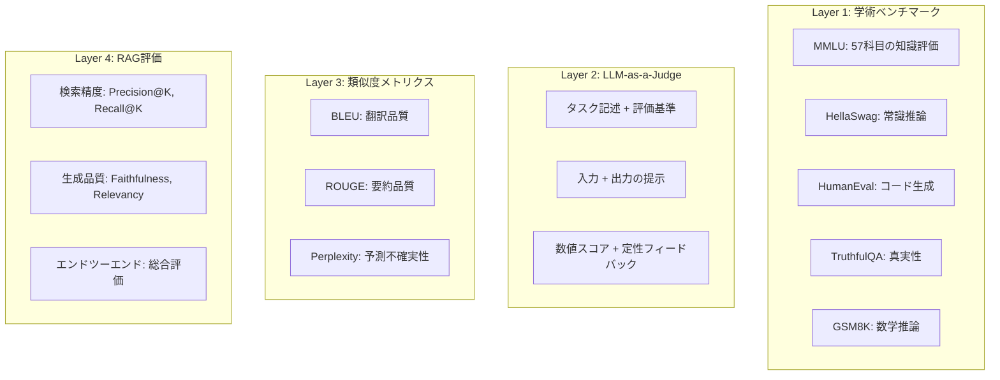
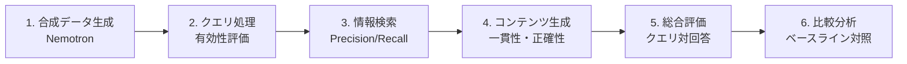

## ブログ概要（Summary）

NVIDIAが2025年1月に公開した「Mastering LLM Techniques: Evaluation」は、LLMおよびRAGシステムの評価に関する包括的な技術ガイドです。学術ベンチマーク、LLM-as-a-Judge手法、類似度メトリクス、RAG専用評価フレームワークの4つのアプローチを体系的に整理し、NVIDIAのNeMo Evaluatorによるエンタープライズ向け評価パイプラインの構築方法を解説しています。

この記事は [Zenn記事: LLM評価駆動開発（EDD）実践：Promptfooでテストファーストなプロンプト改善を回す](https://zenn.dev/0h_n0/articles/18d31ec58faffb) の深掘りです。

## 情報源

- **種別**: 企業テックブログ
- **URL**: [https://developer.nvidia.com/blog/mastering-llm-techniques-evaluation/](https://developer.nvidia.com/blog/mastering-llm-techniques-evaluation/)
- **組織**: NVIDIA
- **著者**: Amit Bleiweiss, Lior Cohen, Gordana Neskovic, Chris Alexiuk, Vivienne Zhang
- **発表日**: 2025年1月29日

## 技術的背景（Technical Background）

従来のMLモデル評価は、精度・F1スコア・AUCなどの明確な正解に基づく指標で完結していました。しかしLLMは自由形式のテキストを生成するため、「決定的な正解」が存在しない場合が多く、従来の評価手法では不十分です。

NVIDIAが特定した**LLM評価の根本的課題**は以下の4点です：

1. **ドメイン固有の評価ギャップ**: 汎用ベンチマークでは実世界の特定ドメイン（医療、法律、金融）での性能を正確に評価できない
2. **人手アノテーションのコスト**: 高品質な評価データセットの作成には膨大なリソースが必要
3. **LLMでLLMを評価するバイアス**: 評価者LLMが生成者LLMの出力に偏向した評価を行うリスク
4. **ベンチマークハッキング**: モデルが評価テクニック自体に最適化し、真の能力向上とは乖離するリスク

## 実装アーキテクチャ（Architecture）

### 4層評価フレームワーク

NVIDIAのブログは、LLM評価を4層のアプローチで構成しています。



### Layer 1: 学術ベンチマーク

ブログでは、主要なベンチマークを以下のように分類しています。

**コア知識・推論**:

| ベンチマーク | 対象 | サイズ | 評価内容 |
|---|---|---|---|
| MMLU | 知識 | 57科目 | 多領域の知識理解 |
| HellaSwag | 推論 | 10K問題 | 常識的推論能力 |
| WinoGrande | 推論 | 44K問題 | 代名詞照応の推論 |
| ARC Challenge | QA | 7,787問題 | 科学的推論 |
| TruthfulQA | 真実性 | 817問題 | 誤情報生成の抑制度 |
| GSM8K | 数学 | 8,500問題 | 段階的数学推論 |

**専門領域**:

| ベンチマーク | 対象 | 評価内容 |
|---|---|---|
| HumanEval | コーディング | 関数の正確な実装 |
| CodeXGLUE | コーディング | コード理解・生成の総合評価 |
| FinanceBench | 金融 | 財務分析・数値推論 |
| RewardBench | 報酬モデル | 人間選好の模倣精度 |
| IFEVAL | 指示追従 | 500プロンプトでの指示遵守 |

**多言語・長文**:

| ベンチマーク | 対象 | 評価内容 |
|---|---|---|
| MGSM | 多言語 | 数学推論の多言語評価 |
| XNLI | 多言語 | 自然言語推論の多言語評価 |
| LongGenBench | 長文 | 長文生成の品質評価 |
| ZeroSCROLLS | 長文 | ゼロショット長文理解 |

### Layer 2: LLM-as-a-Judge

LLMの推論能力を活用して、生成物の品質を自動評価する手法です。Zenn記事で紹介されている Promptfoo の `llm-rubric` や `factuality` アサーションはこのアプローチの実装です。

**実装パターン**:

```python
from typing import Literal

def llm_as_judge(
    task_description: str,
    evaluation_criteria: list[str],
    input_text: str,
    model_output: str,
    judge_model: str = "gpt-4o",
    scoring_type: Literal["absolute", "pairwise"] = "absolute"
) -> dict:
    """LLM-as-a-Judge評価の実装

    Args:
        task_description: タスクの説明
        evaluation_criteria: 評価基準のリスト
        input_text: モデルへの入力
        model_output: モデルの出力
        judge_model: ジャッジに使用するモデル
        scoring_type: "absolute"（絶対評価）or "pairwise"（ペア比較）

    Returns:
        スコアとフィードバックの辞書
    """
    criteria_text = "\n".join(
        f"- {c}" for c in evaluation_criteria
    )

    prompt = f"""
    あなたはLLM出力の品質を評価する専門家です。

    ## タスク
    {task_description}

    ## 評価基準
    {criteria_text}

    ## 入力
    {input_text}

    ## モデル出力
    {model_output}

    ## 評価指示
    各基準について1-5のスコアと根拠を出力してください。
    Chain-of-Thoughtで段階的に評価してください。
    """

    response = call_llm(judge_model, prompt)
    return parse_evaluation(response)
```

**NVIDIAが指摘するLLM-as-a-Judgeの課題**:

1. **位置バイアス**: ペア比較時に1番目の回答を好む傾向 → 順序をランダム化して軽減
2. **自己優遇バイアス**: 同一プロバイダーのモデルを過大評価する傾向 → 異なるプロバイダーのモデルをジャッジに使用
3. **冗長性バイアス**: 長い回答を品質が高いと誤判定する傾向 → 明示的な簡潔性基準を評価項目に追加

### Layer 3: 類似度メトリクス

従来のNLPメトリクスは、参照テキストとの表面的な一致を測定します。

**BLEU（Bilingual Evaluation Understudy）**:

$$
\text{BLEU} = \text{BP} \cdot \exp\left(\sum_{n=1}^{N} w_n \log p_n\right)
$$

ここで、
- $\text{BP}$: Brevity Penalty（短すぎる生成への罰則）
- $p_n$: $n$-gram精度
- $w_n$: 重み（通常$w_n = 1/N$）

**ROUGE-L（Longest Common Subsequence）**:

$$
\text{ROUGE-L} = F_{\text{lcs}} = \frac{(1 + \beta^2) R_{\text{lcs}} P_{\text{lcs}}}{R_{\text{lcs}} + \beta^2 P_{\text{lcs}}}
$$

ここで、$R_{\text{lcs}}$はLCS再現率、$P_{\text{lcs}}$はLCS精度、$\beta$はバランス係数です。

**Perplexity**:

$$
\text{PPL}(W) = \exp\left(-\frac{1}{N} \sum_{i=1}^{N} \log p(w_i | w_{<i})\right)
$$

PPLは低いほど良く、モデルがテキストをどの程度「予測可能」と見なしているかを示します。

### Layer 4: RAG評価フレームワーク

RAGシステムの評価は、検索と生成の2段階を個別および統合的に評価する必要があります。

**Ragasフレームワークの主要メトリクス**:

| メトリクス | 評価対象 | 計算方法 |
|---|---|---|
| Context Precision | 検索精度 | 関連コンテキストの正確性 |
| Context Recall | 検索再現率 | 関連コンテキストの網羅性 |
| Faithfulness | 生成の忠実性 | 回答がコンテキストに基づいているか |
| Answer Relevancy | 回答の関連性 | 回答がクエリに適切に応答しているか |

**6段階RAG評価パイプライン**:



## NeMo Evaluatorの活用

NVIDIA NeMo Evaluatorは、上記の4層評価アプローチを統合するエンタープライズ向け評価プラットフォームです。

**主要機能**:
- **Out-of-the-boxベンチマーク**: MMLU, HumanEval, GSM8K等の主要ベンチマークに対応
- **マイクロサービスアーキテクチャ**: 評価パイプラインを独立したサービスとして構築・運用
- **モジュラー構成**: 評価ステージの追加・削除が柔軟
- **CI/CD統合**: GitHub Actions等との連携で継続的評価が可能
- **Nemotronモデル**: 評価専用のReward/Instructモデルバリアント

**Promptfooとの比較**:

| 機能 | Promptfoo | NeMo Evaluator |
|---|---|---|
| デプロイ | CLI/GitHub Actions | マイクロサービス |
| 対象規模 | 小〜中規模 | エンタープライズ |
| カスタマイズ | YAML宣言型 | API + SDK |
| RAG評価 | プラグイン対応 | ネイティブ対応 |
| GPU最適化 | なし | NVIDIA GPU最適化 |
| コスト | OSS無料 | NVIDIAライセンス |

Zenn記事で紹介されているPromptfooは小〜中規模チームに最適で、NeMo Evaluatorは大規模プロダクションでの利用に適しています。両者は相補的であり、開発初期はPromptfooで素早くテストスイートを構築し、スケールアウト時にNeMo Evaluatorへ移行するパスが実用的です。

## パフォーマンス最適化（Performance）

**評価パイプラインの最適化ポイント**:

1. **並列評価**: 複数のテストケースを並列実行してスループットを向上
2. **キャッシング**: 同一プロンプト・同一入力の評価結果をキャッシュ（Promptfooも同様の機能を持つ）
3. **バッチ処理**: LLM-as-a-Judgeの呼び出しをバッチ化してAPIコストを削減
4. **段階的評価**: deterministic → model-graded の順に実行し、明らかな失敗を早期に除外

**NVIDIAが推奨するパフォーマンス指標**:

| 指標 | 推奨値 | 測定方法 |
|---|---|---|
| 評価スループット | 100+ ケース/分 | テストケース処理速度 |
| LLM-as-Judge一致率 | > 0.85 | 人間評価との相関 |
| 評価コスト | < $0.01/ケース | API呼び出しコスト |
| パイプレイテンシ | < 30秒/ケース | エンドツーエンドの処理時間 |

## 運用での学び（Production Lessons）

NVIDIAブログが強調する実運用での教訓：

1. **単一指標への依存を避ける**: BLEU/ROUGEだけでなく、LLM-as-a-Judge、人手評価を組み合わせる。Zenn記事の3層アサーション戦略（deterministic/model-graded/custom）と同じ考え方
2. **評価の継続性**: 一度きりのベンチマークではなく、CI/CDに組み込んで継続的に評価する
3. **ドメイン適応**: 汎用ベンチマークだけでなく、ドメイン固有の評価データセットを構築する
4. **データフライホイール**: 本番の評価結果を次の改善サイクルに活用する循環を構築する

## 学術研究との関連（Academic Connection）

NVIDIAのブログは以下の学術研究を実装・商用化したものです：

- **MT-Bench / Chatbot Arena** (Zheng et al., 2023): LLM-as-a-Judgeの学術的基盤。NeMo Evaluatorの自動評価機能に反映
- **Ragas** (Shahul et al., 2023): RAG評価フレームワーク。NeMo EvaluatorのRAG評価パイプラインの設計に影響
- **HELM** (Liang et al., 2022): ホリスティックLLM評価。NeMo Evaluatorの多次元ベンチマーク対応の設計思想に影響

## Production Deployment Guide

### AWS実装パターン（コスト最適化重視）

NeMo Evaluatorまたは類似の評価パイプラインをAWSで構築する場合の推奨構成です。

**トラフィック量別の推奨構成**:

| 規模 | 評価量 | 推奨構成 | 月額コスト | 主要サービス |
|------|-------|---------|-----------|------------|
| **Small** | ~1,000件/月 | Serverless | $50-120 | Lambda + Bedrock + S3 |
| **Medium** | ~10,000件/月 | Hybrid | $400-900 | ECS + Bedrock + ElastiCache |
| **Large** | 100,000件+/月 | Container | $2,500-6,000 | EKS + GPU + Bedrock |

**Small構成の詳細** (月額$50-120):
- **Lambda**: 評価パイプラインオーケストレーション ($15/月)
- **Bedrock**: Claude 3.5 Haiku (LLM-as-Judge) ($60/月)
- **S3**: ベンチマークデータ・結果保存 ($5/月)
- **CloudWatch**: モニタリング ($5/月)

**コスト削減テクニック**:
- Deterministic評価を先に実行し、model-graded評価は必要なケースのみ（コスト50-70%削減）
- Bedrock Batch APIで一括評価（50%削減）
- Prompt Cachingで評価プロンプトを再利用（30-90%削減）

**コスト試算の注意事項**:
- 上記は2026年2月時点のAWS ap-northeast-1料金に基づく概算値です
- GPU利用（NeMo Evaluator使用時）は別途$500-2,000/月の追加コストが発生します
- 最新料金は [AWS料金計算ツール](https://calculator.aws/) で確認してください

### Terraformインフラコード

```hcl
# --- 評価パイプライン Lambda ---
resource "aws_lambda_function" "eval_pipeline" {
  function_name = "llm-eval-pipeline"
  role          = aws_iam_role.eval_role.arn
  handler       = "eval_pipeline.handler"
  runtime       = "python3.12"
  timeout       = 300
  memory_size   = 1024
  environment {
    variables = {
      BEDROCK_JUDGE_MODEL = "anthropic.claude-3-5-haiku-20241022-v1:0"
      S3_RESULTS_BUCKET   = aws_s3_bucket.eval_results.id
      EVAL_MODE           = "layered"  # deterministic → model-graded
    }
  }
}

resource "aws_iam_role" "eval_role" {
  name = "llm-eval-pipeline-role"
  assume_role_policy = jsonencode({
    Version = "2012-10-17"
    Statement = [{
      Action    = "sts:AssumeRole"
      Effect    = "Allow"
      Principal = { Service = "lambda.amazonaws.com" }
    }]
  })
}

resource "aws_iam_role_policy" "eval_policy" {
  role = aws_iam_role.eval_role.id
  policy = jsonencode({
    Version = "2012-10-17"
    Statement = [
      {
        Effect   = "Allow"
        Action   = ["bedrock:InvokeModel"]
        Resource = "arn:aws:bedrock:ap-northeast-1::foundation-model/anthropic.claude-*"
      },
      {
        Effect   = "Allow"
        Action   = ["s3:PutObject", "s3:GetObject"]
        Resource = "${aws_s3_bucket.eval_results.arn}/*"
      }
    ]
  })
}

resource "aws_s3_bucket" "eval_results" {
  bucket = "llm-eval-results-${data.aws_caller_identity.current.account_id}"
}

resource "aws_cloudwatch_metric_alarm" "eval_cost" {
  alarm_name          = "llm-eval-cost-spike"
  comparison_operator = "GreaterThanThreshold"
  evaluation_periods  = 1
  metric_name         = "Duration"
  namespace           = "AWS/Lambda"
  period              = 3600
  statistic           = "Sum"
  threshold           = 300000
  alarm_description   = "LLM評価パイプラインの実行時間異常"
  dimensions = {
    FunctionName = aws_lambda_function.eval_pipeline.function_name
  }
}
```

### セキュリティベストプラクティス

- **IAMロール**: Bedrock InvokeModelとS3の最小権限のみ付与
- **ネットワーク**: VPC内でのLambda実行を推奨
- **データ保護**: S3バケットのKMS暗号化有効化
- **シークレット管理**: APIキー等はSecrets Managerで管理

### コスト最適化チェックリスト

**評価戦略**:
- [ ] 段階的評価: deterministic → model-graded（コスト50-70%削減）
- [ ] Batch API活用: 一括評価で50%削減
- [ ] Prompt Caching: 評価プロンプト再利用で30-90%削減
- [ ] モデル選択: 初段Haiku ($0.25/MTok)、確認段Sonnet ($3/MTok)

**監視・アラート**:
- [ ] AWS Budgets: 月額予算（80%警告）
- [ ] CloudWatch: 評価パイプライン実行時間監視
- [ ] Cost Anomaly Detection有効化
- [ ] 日次コストレポート

**リソース管理**:
- [ ] S3ライフサイクル: 古い評価結果を90日で自動削除
- [ ] Lambda Insights: メモリ・実行時間の最適化
- [ ] タグ戦略: 環境別コスト追跡

## まとめと実践への示唆

NVIDIAの「Mastering LLM Techniques: Evaluation」は、LLM評価を4層（学術ベンチマーク・LLM-as-a-Judge・類似度メトリクス・RAG評価）で体系的に整理した実務的ガイドです。Zenn記事で紹介されているPromptfooの3層アサーション（deterministic/model-graded/custom）は、このNVIDIAフレームワークのLayer 1-3と概念的に対応しており、さらにRAG評価（Layer 4）にはRagasフレームワークの統合が推奨されます。

実務への最も重要な示唆は、「単一の評価手法に依存せず、複数のアプローチを組み合わせる」という原則です。開発チームはまずPromptfooでdeterministic評価を構築し、model-graded評価を追加し、スケールアウト時にNeMo Evaluatorへの移行を検討する、という段階的なアプローチが推奨されます。

## 参考文献

- **Blog URL**: [https://developer.nvidia.com/blog/mastering-llm-techniques-evaluation/](https://developer.nvidia.com/blog/mastering-llm-techniques-evaluation/)
- **Related Papers**: MT-Bench (arXiv:2306.05685), Ragas (arXiv:2309.15217)
- **Related Zenn article**: [https://zenn.dev/0h_n0/articles/18d31ec58faffb](https://zenn.dev/0h_n0/articles/18d31ec58faffb)
