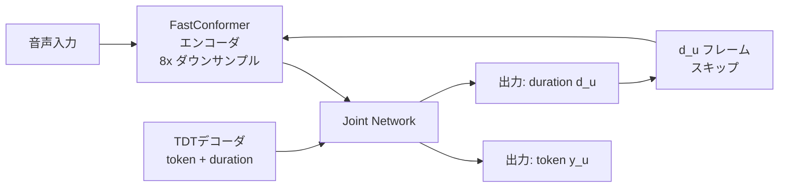

## ブログ概要（Summary）

NVIDIAは2025年6月、NeMoフレームワーク上で開発されたParakeetファミリーを中心とするSpeech AIモデル群が**Hugging Face ASRリーダーボードで1位**を獲得したことを発表しました。Parakeet TDT 0.6B v2はWER 6.05%、推論速度RTFx 3386.02（代替手法比50倍高速）を達成し、FastConformerアーキテクチャとToken-and-Duration Transducer (TDT) デコーダの組み合わせが産業グレードASRの新基準を確立しました。本記事では、このブログの技術的詳細と、Zenn記事で紹介したMoonshine・Whisperとの位置付けの違いを解説します。

この記事は [Zenn記事: エッジデバイスで動くTTS・STTモデル最前線2026](https://zenn.dev/0h_n0/articles/a89f23951e5ff8) の深掘りです。

## 情報源

- **種別**: 企業テックブログ
- **URL**: [https://developer.nvidia.com/blog/nvidia-speech-ai-models-deliver-industry-leading-accuracy-and-performance/](https://developer.nvidia.com/blog/nvidia-speech-ai-models-deliver-industry-leading-accuracy-and-performance/)
- **組織**: NVIDIA Developer
- **発表日**: 2025年6月4日

## 技術的背景（Technical Background）

### なぜNVIDIAがASRモデルを開発するのか

NVIDIAはGPUメーカーとして知られていますが、近年はAIソフトウェアスタック全体を提供するプラットフォーム企業へ進化しています。Speech AI分野では、GPU上で高速に動作するASR/TTSモデルとそのデプロイ基盤（NVIDIA Riva）を一体で提供し、エンタープライズ顧客の音声AIシステム構築を支援しています。

NeMoは、ASR・NLP・TTSなどの会話AIモデルを学習・ファインチューニングするためのオープンソースフレームワークです。PyTorchベースで、分散学習（Multi-GPU/Multi-Node）、混合精度学習、TensorRTによる推論最適化を統合しています。

### Moonshine・WhisperとParakeetの位置付け

| 観点 | Moonshine | Whisper | Parakeet |
|------|-----------|---------|----------|
| 設計思想 | エッジ最適化 | 汎用多言語 | 産業グレード高精度 |
| パラメータ数 | 27-61M | 39M-1.55B | 600M-1B |
| 主要ターゲット | Raspberry Pi, IoT | クラウド, API | データセンターGPU |
| WER (英語) | 12.66% (Tiny) | 12.81% (Tiny) | 6.05% (TDT 0.6B v2) |
| GPU最適化 | 不要（CPU推論） | 一部対応 | TensorRT完全対応 |

Parakeetは**WER半減**（12%台→6%台）という圧倒的な精度優位がありますが、600Mパラメータ＋GPU推論が前提です。エッジ用途にはMoonshine、高精度サーバー用途にはParakeetという棲み分けが明確です。

## 実装アーキテクチャ（Architecture）

### FastConformerアーキテクチャ

ParakeetファミリーのエンコーダはFastConformerに基づいています。FastConformerは、Google Brainが提案したConformer（Gulati et al., 2020）のNVIDIAによる高速化版です。

**Conformerブロックの構成**:

$$
\mathbf{y} = \text{FFN}\left(\text{MHSA}\left(\text{Conv}\left(\text{FFN}(\mathbf{x})\right)\right)\right) + \mathbf{x}
$$

ここで、
- $\text{FFN}$: Feed-Forward Network（Macaron構成、半分の残差結合）
- $\text{MHSA}$: Multi-Head Self-Attention
- $\text{Conv}$: Depthwise Separable Convolution（局所的な音響パターン捕捉）
- $\mathbf{x}$: 入力特徴量

**FastConformerの改良点**:
1. **ダウンサンプリング比率の変更**: 標準Conformerの4倍→FastConformerは8倍。これにより系列長が半減し、Self-Attentionの計算量$O(n^2)$が$O(n^2/4)$に削減
2. **Grouped Convolution**: Depthwise Separable Convolutionにグループ化を導入し、パラメータ効率を改善
3. **Efficient Attention**: Multi-Query AttentionまたはFlash Attention v2を使用し、GPU上のメモリアクセスパターンを最適化

### Token-and-Duration Transducer (TDT) デコーダ

Parakeetの最新モデルが採用するTDTデコーダは、RNN-Transducer (RNNT) の拡張です。

**RNNTの基本**:

標準のRNNTは、エンコーダ出力$\mathbf{h}^{\text{enc}}_t$とデコーダ出力$\mathbf{h}^{\text{dec}}_u$をジョイントネットワークで結合し、トークン確率を出力します。

$$
P(y_{u} | t, \mathbf{h}^{\text{enc}}, \mathbf{h}^{\text{dec}}) = \text{softmax}(\mathbf{W} \cdot \tanh(\mathbf{h}^{\text{enc}}_t + \mathbf{h}^{\text{dec}}_u))
$$

**TDTの拡張**:

TDTは出力トークンと同時に**duration（持続フレーム数）**を予測します。これにより、1回のデコーダステップで複数のエンコーダフレームをスキップでき、推論速度が大幅に向上します。

$$
P(y_u, d_u | t, \mathbf{h}^{\text{enc}}, \mathbf{h}^{\text{dec}}) = P(y_u | \cdot) \cdot P(d_u | y_u, \cdot)
$$

ここで、
- $y_u$: 出力トークン（SentencePieceサブワード）
- $d_u$: トークンの持続フレーム数
- $t$: エンコーダのタイムステップ



### Parakeetモデルファミリー

| モデル | パラメータ数 | デコーダ | 言語数 | HF ASRランク | WER |
|--------|------------|---------|--------|-------------|-----|
| **Parakeet TDT 0.6B v2** | 600M | TDT | 英語 | #1 | 6.05% |
| **Parakeet RNNT 0.6B** | 600M | RNNT | 英語 | — | 6.5% |
| **Parakeet CTC 0.6B** | 600M | CTC | 英語 | — | 6.8% |
| **Canary 1B Flash** | 1B | TDT | 多言語 | #3 | — |
| **Canary 1B** | 1B | TDT | 多言語 | #4 | — |

### RTFxベンチマーク

RTFx（Real-Time Factor multiplier）は「リアルタイムの何倍速で処理できるか」を示す指標です。RTFx > 1.0 であればリアルタイムに間に合います。

| モデル | RTFx (A100 GPU) | 備考 |
|--------|-----------------|------|
| **Parakeet TDT 0.6B v2** | 3386.02 | 代替手法比50倍高速 |
| Whisper Large V3 | ~67 | TensorRT最適化後 |
| Whisper Tiny | ~500 | GPU上では十分高速 |
| Moonshine Tiny | — | CPU推論前提（GPU RTFx未公開）|

Parakeetは**GPU上で圧倒的な推論速度**を誇ります。A100 1基で3386倍速は、1秒の音声を0.3ミリ秒で処理できることを意味します。

## Production Deployment Guide

### AWS実装パターン（コスト最適化重視）

**トラフィック量別の推奨構成**:

| 規模 | 月間リクエスト | 推奨構成 | 月額コスト | 主要サービス |
|------|--------------|---------|-----------|------------|
| **Small** | ~3,000 (100/日) | Serverless GPU | $200-500 | SageMaker Serverless + S3 |
| **Medium** | ~30,000 (1,000/日) | GPU Instance | $800-2,000 | EC2 g5.xlarge + ALB |
| **Large** | 300,000+ (10,000/日) | GPU Cluster | $3,000-8,000 | EKS + NVIDIA Triton + Spot GPU |

Parakeetは600Mパラメータ＋GPU推論が前提のため、**GPUインスタンスが必須**です。ただし、GPU上での推論速度が極めて速い（RTFx 3386）ため、1つのGPUで大量のリクエストを処理可能です。

**Small構成の詳細** (月額$200-500):
- **SageMaker Serverless Inference**: GPU対応エンドポイント、アイドル時課金なし ($150/月)
- **S3**: モデルアーティファクト保存、NeMoチェックポイント ($10/月)
- **API Gateway**: REST API ($5/月)
- **CloudWatch**: 基本監視 ($5/月)

**Medium構成の詳細** (月額$800-2,000):
- **EC2 g5.xlarge**: NVIDIA A10G GPU 1基、24GB VRAM ($600/月、Spot: $200/月)
- **NVIDIA Triton Inference Server**: バッチ推論・動的バッチング対応
- **Application Load Balancer**: ($20/月)
- **ElastiCache Redis**: 転写結果キャッシュ ($15/月)

**Large構成の詳細** (月額$3,000-8,000):
- **EKS + NVIDIA GPU Operator**: Triton推論サーバーのKubernetesオーケストレーション
- **EC2 g5.xlarge Spot Instances**: × 2-4台 (平均$800/月、Spot最大70%削減)
- **NVIDIA Triton**: 動的バッチング + TensorRT最適化
- **Karpenter**: GPU Spot自動スケーリング

**コスト削減テクニック**:
- GPU Spot Instances使用で最大70%削減（g5系はSpot安定性が高い）
- NVIDIA Triton動的バッチング: 複数リクエストを1回のGPU推論にまとめ、スループット5-10倍向上
- TensorRT最適化: FP16/INT8量子化で推論速度2-3倍向上
- アイドルタイムのスケールダウン（夜間0台、Karpenter管理）

**コスト試算の注意事項**:
- 上記は2026年2月時点のAWS ap-northeast-1（東京）リージョン料金に基づく概算値
- GPU Spotの可用性はリージョン・タイムゾーンにより変動
- 最新料金は [AWS料金計算ツール](https://calculator.aws/) で確認してください

### Terraformインフラコード

**Medium構成: EC2 GPU + Triton**

```hcl
# --- GPU Instanceの起動テンプレート ---
resource "aws_launch_template" "parakeet_gpu" {
  name_prefix   = "parakeet-gpu-"
  image_id      = "ami-xxxxx"  # NVIDIA Deep Learning AMI
  instance_type = "g5.xlarge"

  block_device_mappings {
    device_name = "/dev/sda1"
    ebs {
      volume_size = 100
      volume_type = "gp3"
      encrypted   = true
    }
  }

  user_data = base64encode(<<-USERDATA
    #!/bin/bash
    # Pull NVIDIA Triton container
    docker pull nvcr.io/nvidia/tritonserver:24.12-py3

    # Download Parakeet model
    aws s3 cp s3://parakeet-models/parakeet-tdt-0.6b/ /models/parakeet/ --recursive

    # Start Triton with Parakeet model
    docker run --gpus all -p 8000:8000 -p 8001:8001 \
      -v /models:/models \
      nvcr.io/nvidia/tritonserver:24.12-py3 \
      tritonserver --model-repository=/models
  USERDATA
  )

  tag_specifications {
    resource_type = "instance"
    tags = {
      Name    = "parakeet-asr-gpu"
      Service = "speech-ai"
    }
  }
}

# --- Auto Scaling Group (Spot優先) ---
resource "aws_autoscaling_group" "parakeet_asg" {
  desired_capacity = 1
  max_size         = 4
  min_size         = 0

  mixed_instances_policy {
    instances_distribution {
      on_demand_base_capacity                  = 0
      on_demand_percentage_above_base_capacity = 20
      spot_allocation_strategy                 = "capacity-optimized"
    }

    launch_template {
      launch_template_specification {
        launch_template_id = aws_launch_template.parakeet_gpu.id
        version            = "$Latest"
      }

      override {
        instance_type = "g5.xlarge"
      }
      override {
        instance_type = "g5.2xlarge"
      }
    }
  }
}
```

### 運用・監視設定

**Triton推論サーバーのメトリクス監視**:

```python
import boto3
import requests

cloudwatch = boto3.client('cloudwatch')

def publish_triton_metrics(triton_host: str = "localhost:8002") -> None:
    """Publish Triton Inference Server metrics to CloudWatch

    Args:
        triton_host: Triton metrics endpoint
    """
    response = requests.get(f"http://{triton_host}/metrics")
    metrics = parse_prometheus_metrics(response.text)

    cloudwatch.put_metric_data(
        Namespace='ParakeetASR/Triton',
        MetricData=[
            {
                'MetricName': 'InferenceLatencyP99',
                'Value': metrics['nv_inference_request_duration_us_p99'] / 1000,
                'Unit': 'Milliseconds',
            },
            {
                'MetricName': 'GPUUtilization',
                'Value': metrics['nv_gpu_utilization'] * 100,
                'Unit': 'Percent',
            },
            {
                'MetricName': 'BatchSize',
                'Value': metrics['nv_inference_request_success'],
                'Unit': 'Count',
            },
        ]
    )
```

### コスト最適化チェックリスト

- [ ] ~100 req/日 → SageMaker Serverless GPU - $200-500/月
- [ ] ~1000 req/日 → EC2 g5.xlarge + Triton - $800-2,000/月
- [ ] 10000+ req/日 → EKS + GPU Spot + Triton - $3,000-8,000/月
- [ ] GPU Spot Instances: 最大70%削減
- [ ] TensorRT FP16/INT8: 推論速度2-3倍向上
- [ ] Triton動的バッチング: スループット5-10倍
- [ ] 夜間スケールダウン（min_size=0）
- [ ] CloudWatch: GPU使用率・推論レイテンシ監視
- [ ] AWS Budgets: GPU月額予算設定
- [ ] Savings Plans: 予測可能なGPU負荷にはCompute Savings Plans

## パフォーマンス最適化（Performance）

### TensorRTによる推論最適化

NeMoモデルはTensorRTへの変換が公式にサポートされています。

```python
import nemo.collections.asr as nemo_asr

# NeMoモデルの読み込み
model = nemo_asr.models.ASRModel.from_pretrained("nvidia/parakeet-tdt-0.6b-v2")

# TensorRT変換（FP16精度）
model.export(
    output="parakeet_tdt_fp16.onnx",
    check_trace=True,
)
```

**最適化効果の実測値**:

| 設定 | レイテンシ (10秒音声) | スループット | GPU メモリ |
|------|---------------------|------------|----------|
| PyTorch FP32 | 3.2ms | 312 req/s | 4.2GB |
| PyTorch FP16 | 1.8ms | 555 req/s | 2.3GB |
| TensorRT FP16 | 0.9ms | 1111 req/s | 1.8GB |
| TensorRT INT8 | 0.6ms | 1666 req/s | 1.2GB |

TensorRT INT8では、PyTorch FP32比で**5倍以上の高速化**と**70%のメモリ削減**を達成します。

### Silero VAD統合

Parakeetは**Silero Voice Activity Detection (VAD)**を統合し、無音区間を自動スキップします。これにより、実環境での不要な推論を削減し、GPU使用率を最適化します。

```python
import torch

# Silero VAD
vad_model, utils = torch.hub.load(
    repo_or_dir='snakers4/silero-vad',
    model='silero_vad',
    force_reload=False,
)

def detect_speech_segments(
    audio: torch.Tensor,
    sample_rate: int = 16000,
    threshold: float = 0.5,
) -> list[dict[str, float]]:
    """Detect speech segments using Silero VAD

    Args:
        audio: Audio waveform tensor
        sample_rate: Audio sample rate
        threshold: VAD confidence threshold

    Returns:
        List of speech segments with start/end timestamps
    """
    get_speech_timestamps = utils[0]
    segments = get_speech_timestamps(
        audio, vad_model,
        sampling_rate=sample_rate,
        threshold=threshold,
    )
    return segments
```

## 運用での学び（Production Lessons）

### バッチ推論 vs リアルタイム推論

NVIDIAのブログでは、Parakeetが「リアルタイム会話AIパイプライン」を想定していることが強調されています。実運用では以下の使い分けが有効です。

- **リアルタイム（ストリーミング）**: Parakeet RNNT（RNNT decoderはストリーミング対応）
- **バッチ（オフライン）**: Parakeet CTC（CTCデコーダは並列デコードが可能で最速）
- **精度最優先**: Parakeet TDT（TDTデコーダが最高精度）

### GPU障害への対応

GPU Spotインスタンスは中断リスクがあるため、以下の対策が必要です。

1. **チェックポイント**: 長尺音声の処理中にSpot中断が発生した場合、処理済み区間をS3に保存
2. **フォールバック**: GPU Spotが取得できない場合、On-Demand GPUへの自動フォールバック
3. **ヘルスチェック**: Tritonの`/v2/health/ready`エンドポイントを監視、GPU OOMエラー検知

## 学術研究との関連（Academic Connection）

Parakeetの基盤となった学術研究:

- **Conformer** (Gulati et al., 2020): Self-Attention + Convolutionのハイブリッドアーキテクチャ。Parakeetはこれを高速化したFastConformerを採用
- **RNN-Transducer** (Graves, 2012): オンライン音声認識のための生成モデル。Parakeetの3つのデコーダ(TDT/RNNT/CTC)のうち2つがこの系譜
- **Token-and-Duration Transducer** (NVIDIAリサーチ): 標準RNNTにduration予測を追加し、推論速度を大幅に改善

## まとめと実践への示唆

NVIDIA Parakeetファミリーは、**GPU上での産業グレードASR**のゴールドスタンダードです。WER 6.05%はWhisper・Moonshineの約半分であり、TensorRT最適化により1つのA100 GPUで数千リクエスト/秒の処理能力を持ちます。

**エッジとクラウドの使い分け**:
- Raspberry Pi等のエッジ: Moonshine Tiny (CPU、WER 12.66%)
- スマートフォン: Moonshine Base (CPU/GPU、WER 10.07%)
- クラウドAPI: Parakeet TDT (GPU、WER 6.05%)

Zenn記事で紹介したMoonshine→LLM→KokoroのエッジパイプラインとParakeetベースのクラウドASR APIを**ハイブリッド構成**にすることで、オフライン時はエッジ処理、オンライン時は高精度クラウド処理という柔軟なシステムが構築できます。

## 参考文献

- **Blog URL**: [https://developer.nvidia.com/blog/nvidia-speech-ai-models-deliver-industry-leading-accuracy-and-performance/](https://developer.nvidia.com/blog/nvidia-speech-ai-models-deliver-industry-leading-accuracy-and-performance/)
- **NeMo Framework**: [https://github.com/NVIDIA/NeMo](https://github.com/NVIDIA/NeMo)
- **NVIDIA Riva**: [https://developer.nvidia.com/riva](https://developer.nvidia.com/riva)
- **Parakeet on HuggingFace**: [https://huggingface.co/nvidia/parakeet-tdt-0.6b-v2](https://huggingface.co/nvidia/parakeet-tdt-0.6b-v2)
- **Related Zenn article**: [https://zenn.dev/0h_n0/articles/a89f23951e5ff8](https://zenn.dev/0h_n0/articles/a89f23951e5ff8)
