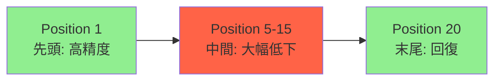

## 論文概要（Abstract）

LLMが長いコンテキストを入力として受け取れるようになった一方で、その情報をどれほど実際に活用できているかは十分に研究されていなかった。本論文では、(1)マルチドキュメント質問応答と(2)キーバリュー検索という2タスクを用いて、入力コンテキスト内の情報位置がLLMの性能にどう影響するかを体系的に分析した。関連情報がコンテキストの先頭・末尾にある場合は高精度だが、中間に配置されると著しく性能が低下する「U字型パフォーマンス曲線」を発見し、この現象がGPT-3.5-Turbo、Claude-2、MPT-30B-Instruct等の主要モデルで一貫して観測されることを実証した。

この記事は [Zenn記事: ロングコンテキストLLM活用の最適解：200Kトークンを使いこなす実装パターン](https://zenn.dev/0h_n0/articles/a1bb0a9d6cb7f0) の深掘りです。

## 情報源

- **arXiv ID**: 2307.03172
- **URL**: [https://arxiv.org/abs/2307.03172](https://arxiv.org/abs/2307.03172)
- **著者**: Nelson F. Liu, Kevin Lin, John Hewitt, Ashwin Paranjape, Michele Bevilacqua, Fabio Petroni, Percy Liang（Stanford NLP / Meta AI）
- **発表年**: 2023年（TACL 2024に採録）
- **分野**: cs.CL

## 背景と動機（Background & Motivation）

2023年以降、LLMのコンテキストウィンドウは急速に拡大した。GPT-4の128K、Claude 3の200K、Gemini 1.5 Proの1Mトークンなど、数十万トークンを入力として受け取れるモデルが登場している。しかし、「コンテキストウィンドウが広い＝情報を正しく活用できる」というのは自明ではない。

従来の研究はSCROLLSやLongBenchなどの長文ベンチマークに注力していたが、**コンテキスト内の情報位置がLLM性能にどう影響するか**を系統的に調べた研究はなかった。実際のRAGシステムやエージェントでは、検索されたドキュメントがどの順番でプロンプトに挿入されるかが性能を大きく左右する。本論文はこの「位置効果」を初めて定量的に明らかにした。

## 主要な貢献（Key Contributions）

- **貢献1**: LLMのロングコンテキスト処理において「U字型パフォーマンス曲線」を発見。関連情報がコンテキスト中間にある場合、先頭・末尾と比べ20〜30ポイント以上の精度低下が生じることを実証した。
- **貢献2**: この現象がオープンソース（MPT-30B, LongChat-13B）・クローズドソース（GPT-3.5-Turbo, Claude-2）問わず一貫して観測されることを確認し、アーキテクチャや訓練手法に依存しない普遍的な問題であることを示した。
- **貢献3**: コンテキストウィンドウに全文が収まる場合でも、RAG（検索+抽出）がフルコンテキスト入力を上回るケースがあることを発見。RAGの有用性をコンテキスト長制限の回避手段に留まらない「精度向上手段」として位置づけた。

## 技術的詳細（Technical Details）

### 実験設計：マルチドキュメントQA

NaturalQuestionsデータセットのdev setを使用し、各質問に対してBM25でWikipediaから上位19件の文書を検索する。正解文書（ゴールドドキュメント）を1件加え、計20件のドキュメントリストを構成する。ゴールドドキュメントの位置を1〜20まで変化させ、他の文書は固定する。

$$
\text{Accuracy}(p) = \frac{1}{|Q|} \sum_{q \in Q} \mathbb{1}[\text{gold\_answer} \subseteq \text{response}(q, p)]
$$

ここで、
- $Q$: 質問集合
- $p$: ゴールドドキュメントの位置（1〜20）
- $\text{response}(q, p)$: モデルの生成テキスト
- $\mathbb{1}[\cdot]$: 正解文字列がレスポンスに含まれるかの指標関数

### 実験設計：キーバリュー検索

パラメトリック知識に依存しない合成タスクとして、UUID形式のキーバリューペアをJSON形式で提示する。75〜140件のペアを用意し、指定されたキーに対応する値を回答させる。

```python
def create_kv_retrieval_task(
    num_pairs: int = 100,
    target_position: int = 50,
) -> dict[str, str]:
    """KV検索タスクのインスタンスを生成

    Args:
        num_pairs: キーバリューペアの総数
        target_position: 検索対象のペアの位置（1-indexed）

    Returns:
        prompt: JSON形式のKVリストと検索クエリ
    """
    import uuid
    pairs = [
        {"key": str(uuid.uuid4()), "value": str(uuid.uuid4())}
        for _ in range(num_pairs)
    ]
    target_key = pairs[target_position - 1]["key"]
    target_value = pairs[target_position - 1]["value"]

    kv_json = json.dumps(pairs, indent=2)
    prompt = f"以下のJSON内のキー '{target_key}' に対応する値を返してください:\n{kv_json}"
    return {"prompt": prompt, "answer": target_value}
```

### U字型パフォーマンス曲線の定量的分析



モデル別の精度変動幅（マルチドキュメントQA, 20ドキュメント条件）:

| モデル | 先頭精度 | 中間最低精度 | 末尾精度 | 最大低下幅 |
|--------|---------|------------|---------|-----------|
| GPT-3.5-Turbo (4K) | ~71% | ~45% | ~65% | **-26pt** |
| GPT-3.5-Turbo (16K) | ~68% | ~43% | ~63% | **-25pt** |
| Claude-1.3 | ~65% | ~42% | ~60% | **-23pt** |
| Claude-2.0 | ~67% | ~44% | ~62% | **-23pt** |
| MPT-30B-Instruct | ~55% | ~30% | ~58% | **-25pt** |
| LongChat-13B | ~50% | ~28% | ~52% | **-22pt** |

### オラクル条件との比較

正解ドキュメント1件のみを提示した場合（ディストラクタなし）:
- GPT-3.5-Turbo: **93%以上**
- Claude系: **90%以上**
- オープンソース: **60〜80%**

これにより、精度低下の原因が「タスクの難しさ」ではなく「ロングコンテキスト処理の問題」であることが確認された。

### コンテキスト長と精度の関係

ドキュメント数を5, 10, 15, 20件と変化させた実験では、ドキュメント数が増えるほど精度が低下する傾向が確認された。特にGPT-3.5-Turbo (4K)では5件→20件で平均15ポイントの精度低下を示した。

## 実装のポイント（Implementation）

### ドキュメント配置の最適化

本論文の知見を実装に活かす最も直接的な方法は、RAGパイプラインでのドキュメント並び替えである。

```python
from typing import TypeAlias

Document: TypeAlias = dict[str, str]

def optimize_document_order(
    documents: list[Document],
    relevance_scores: list[float],
) -> list[Document]:
    """重要度に基づくドキュメント配置最適化

    Lost in the Middle の知見に基づき、最も関連度の高い
    ドキュメントをコンテキストの先頭と末尾に配置する。

    Args:
        documents: 検索されたドキュメントリスト
        relevance_scores: 各ドキュメントの関連度スコア

    Returns:
        最適化された順序のドキュメントリスト
    """
    # 関連度でソート（降順）
    sorted_pairs = sorted(
        zip(documents, relevance_scores),
        key=lambda x: x[1],
        reverse=True,
    )

    # Sandwich配置: 奇数番目→先頭、偶数番目→末尾
    optimized: list[Document] = []
    tail: list[Document] = []
    for i, (doc, _score) in enumerate(sorted_pairs):
        if i % 2 == 0:
            optimized.append(doc)
        else:
            tail.insert(0, doc)
    optimized.extend(tail)
    return optimized
```

### よくある実装の落とし穴

1. **ランダム順配置**: BM25やベクトル検索のスコア順で並べるだけでは、最重要文書が中間に埋もれる可能性がある。スコア上位文書を先頭・末尾に明示的に配置すべき。
2. **全文投入の罠**: コンテキストに収まるからといって全文書を投入すると、無関係な文書がノイズとなり精度が劣化する。10件以下に絞ることが推奨される。
3. **Recency biasの見落とし**: 特にオープンソースモデルは末尾の情報に強く偏る傾向がある。モデルごとにプロファイリングが必要。

## Production Deployment Guide

### AWS実装パターン（コスト最適化重視）

本論文の知見を活用するRAGシステムの3段階構成:

| 規模 | 月間リクエスト | 推奨構成 | 月額コスト | 主要サービス |
|------|--------------|---------|-----------|------------|
| **Small** | ~3,000 (100/日) | Serverless | $50-150 | Lambda + Bedrock + DynamoDB |
| **Medium** | ~30,000 (1,000/日) | Hybrid | $300-800 | Lambda + ECS Fargate + ElastiCache |
| **Large** | 300,000+ (10,000/日) | Container | $2,000-5,000 | EKS + Karpenter + EC2 Spot |

**Small構成の詳細** (月額$50-150):
- **Lambda**: 1GB RAM, 30秒タイムアウト ($20/月) — ドキュメント並び替えロジック実行
- **Bedrock**: Claude 3.5 Haiku, Prompt Caching有効 ($80/月)
- **DynamoDB**: On-Demand, 検索結果キャッシュ ($10/月)
- **OpenSearch Serverless**: ベクトル検索用 ($30/月)

**コスト削減テクニック**:
- Prompt Caching有効化: システムプロンプト+ドキュメント配置テンプレートをキャッシュし30-90%削減
- Bedrock Batch API: 非リアルタイム処理で50%削減
- ドキュメント数の最適制限: 20件→10件以下に絞ることでトークンコスト50%削減（かつ精度向上）

**コスト試算の注意事項**: 上記は2026年2月時点のAWS ap-northeast-1（東京）リージョン料金に基づく概算値です。実際のコストはトラフィックパターンにより変動します。最新料金は[AWS料金計算ツール](https://calculator.aws/)で確認してください。

### Terraformインフラコード

**Small構成 (Serverless): Lambda + Bedrock + DynamoDB**

```hcl
# --- IAMロール（最小権限） ---
resource "aws_iam_role" "rag_lambda" {
  name = "rag-document-reorder-role"

  assume_role_policy = jsonencode({
    Version = "2012-10-17"
    Statement = [{
      Action = "sts:AssumeRole"
      Effect = "Allow"
      Principal = { Service = "lambda.amazonaws.com" }
    }]
  })
}

resource "aws_iam_role_policy" "bedrock_invoke" {
  role = aws_iam_role.rag_lambda.id
  policy = jsonencode({
    Version = "2012-10-17"
    Statement = [{
      Effect   = "Allow"
      Action   = ["bedrock:InvokeModel", "bedrock:InvokeModelWithResponseStream"]
      Resource = "arn:aws:bedrock:ap-northeast-1::foundation-model/anthropic.claude-3-5-haiku*"
    }]
  })
}

# --- Lambda関数（ドキュメント並び替え + LLM呼び出し） ---
resource "aws_lambda_function" "rag_handler" {
  filename      = "lambda.zip"
  function_name = "rag-reorder-handler"
  role          = aws_iam_role.rag_lambda.arn
  handler       = "index.handler"
  runtime       = "python3.12"
  timeout       = 60
  memory_size   = 1024

  environment {
    variables = {
      BEDROCK_MODEL_ID    = "anthropic.claude-3-5-haiku-20241022-v1:0"
      MAX_DOCUMENTS       = "10"
      REORDER_STRATEGY    = "sandwich"
      ENABLE_PROMPT_CACHE = "true"
    }
  }
}

# --- DynamoDB (検索結果キャッシュ) ---
resource "aws_dynamodb_table" "search_cache" {
  name         = "rag-search-cache"
  billing_mode = "PAY_PER_REQUEST"
  hash_key     = "query_hash"

  attribute {
    name = "query_hash"
    type = "S"
  }

  ttl {
    attribute_name = "expire_at"
    enabled        = true
  }
}
```

### 運用・監視設定

**CloudWatch Logs Insights クエリ**:
```sql
-- ドキュメント位置別の精度モニタリング
fields @timestamp, query_id, gold_doc_position, is_correct
| stats avg(is_correct) as accuracy by gold_doc_position
| sort gold_doc_position asc

-- コスト異常検知: 1時間あたりのトークン使用量
fields @timestamp, input_tokens, output_tokens
| stats sum(input_tokens + output_tokens) as total_tokens by bin(1h)
| filter total_tokens > 100000
```

**CloudWatch アラーム**:
```python
import boto3

cloudwatch = boto3.client('cloudwatch')
cloudwatch.put_metric_alarm(
    AlarmName='rag-accuracy-drop',
    ComparisonOperator='LessThanThreshold',
    EvaluationPeriods=2,
    MetricName='AnswerAccuracy',
    Namespace='RAG/DocumentReorder',
    Period=3600,
    Statistic='Average',
    Threshold=0.6,
    AlarmDescription='RAG応答精度が60%を下回った場合のアラート'
)
```

### コスト最適化チェックリスト

**アーキテクチャ選択**:
- [ ] ~100 req/日 → Lambda + Bedrock (Serverless) - $50-150/月
- [ ] ~1000 req/日 → ECS Fargate + Bedrock (Hybrid) - $300-800/月
- [ ] 10000+ req/日 → EKS + Spot Instances (Container) - $2,000-5,000/月

**リソース最適化**:
- [ ] ドキュメント数制限: 20件→10件以下（トークンコスト50%削減+精度向上）
- [ ] Sandwich配置ロジック実装（本論文の知見適用）
- [ ] Lambda: メモリサイズ最適化（1024MB推奨）
- [ ] DynamoDB: TTL設定で古いキャッシュ自動削除

**LLMコスト削減**:
- [ ] Prompt Caching有効化（システムプロンプト+テンプレート固定部分）
- [ ] Bedrock Batch API（非リアルタイム処理で50%削減）
- [ ] モデル選択: 単純QA→Haiku、複雑推論→Sonnet
- [ ] max_tokens制限: 応答長制限で過剰生成防止

**監視・アラート**:
- [ ] AWS Budgets: 月額予算設定（80%で警告）
- [ ] CloudWatch: トークン使用量スパイク検知
- [ ] 応答精度モニタリング: ドキュメント位置別精度の定期チェック
- [ ] Cost Anomaly Detection有効化

## 実験結果（Results）

### マルチドキュメントQAの主要結果

| 条件 | GPT-3.5-Turbo | Claude-2 | MPT-30B | LongChat-13B |
|------|--------------|---------|---------|-------------|
| 先頭配置 | 71% | 67% | 55% | 50% |
| 中間配置（最悪） | 45% | 44% | 30% | 28% |
| 末尾配置 | 65% | 62% | 58% | 52% |
| **低下幅** | **-26pt** | **-23pt** | **-25pt** | **-22pt** |

### キーバリュー検索の結果

UUIDペア100件での精度:
- GPT-3.5-Turbo: 先頭~100%、中間~55%、末尾~85%
- 複数値同時検索では中間の値が特に漏れやすく、2値同時検索で中間精度がさらに15ポイント低下

### RAG vs フルコンテキストの比較

| 手法 | MPT-30B | LongChat-13B |
|------|---------|-------------|
| フルコンテキスト（20件） | 40% | 35% |
| RAG Top-5 | **52%** | **47%** |
| RAG Top-10 | 48% | 42% |
| オラクル（正解1件のみ） | 65% | 55% |

RAG（Top-5）がフルコンテキストを12〜15ポイント上回る結果が得られた。

## 実運用への応用（Practical Applications）

### RAGシステムへの適用

本論文の知見はRAGパイプラインの設計に直接的な影響を与える。

1. **リランキング後のドキュメント配置**: 検索→リランキングの後、最重要ドキュメントをプロンプトの先頭と末尾に配置するポストプロセスを追加すべき。これだけで精度が10〜20ポイント改善する可能性がある。

2. **ドキュメント数の最適制限**: 「取れるだけ取ってコンテキストに入れる」は逆効果。10件以下に絞り、ノイズを減らすことが精度向上に寄与する。

3. **ハイブリッド戦略**: 短い応答が必要なQAタスクではRAGで絞り込み、文書全体の理解が必要な要約タスクではロングコンテキストを使う、という使い分けが最適。

### エージェントシステムへの応用

マルチドキュメントを扱うエージェントでは、ツール呼び出し結果の配置順序も同様の影響を受ける。複数ツールの出力を統合する際は、最も関連性の高い結果をプロンプトの先頭に配置し、エージェントの判断精度を向上させることが推奨される。

## 関連研究（Related Work）

- **LongFormer** (Beltagy et al., 2020): スパースアテンションによる長文処理。本論文はLongFormerの動機となった「長文脈処理の困難さ」を定量化した。
- **RAG** (Lewis et al., 2020): 検索拡張生成の原論文。本論文はRAGの有用性がコンテキスト長制限の回避に留まらないことを示した。
- **Found in the Middle** (Zhang et al., NeurIPS 2024): 本論文で発見されたU字型曲線を解決するMs-PoE手法を提案。RoPEのスケーリング比率を注意ヘッドごとに変えることで、中間情報への注意を改善した。

## まとめと今後の展望

本論文は「Lost in the Middle」と呼ばれる現象を初めて体系的に実証し、LLMコミュニティに大きな影響を与えた。主な成果:

- **U字型パフォーマンス曲線の発見**: LLMがコンテキスト中間部の情報を見落とす傾向を定量化
- **RAGの再評価**: コンテキストウィンドウに収まる場合でもRAGが精度面で有利なケースを発見
- **実用的な設計指針**: ドキュメント配置の最適化による精度向上手法を確立

今後は、GPT-4.1（1Mトークン）やClaude Opus 4.6（200K+）など最新モデルでの追試、および「Found in the Middle」(Ms-PoE)のような位置エンコーディング改善手法との組み合わせが期待される。

## 参考文献

- **arXiv**: [https://arxiv.org/abs/2307.03172](https://arxiv.org/abs/2307.03172)
- **Code**: [https://github.com/nelson-liu/lost-in-the-middle](https://github.com/nelson-liu/lost-in-the-middle)（評価コード公開、MITライセンス）
- **TACL 2024**: [https://aclanthology.org/2024.tacl-1.9/](https://aclanthology.org/2024.tacl-1.9/)
- **Related Zenn article**: [https://zenn.dev/0h_n0/articles/a1bb0a9d6cb7f0](https://zenn.dev/0h_n0/articles/a1bb0a9d6cb7f0)
