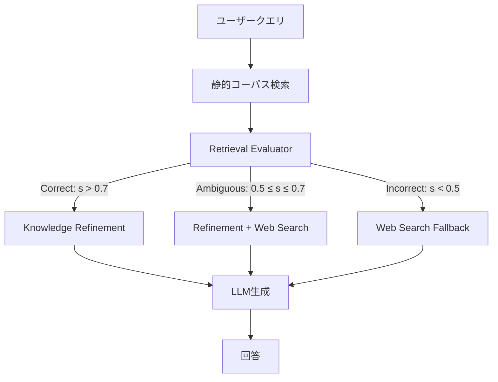

## 論文概要（Abstract）

Corrective Retrieval Augmented Generation（CRAG）は、RAGパイプラインの検索品質を自動評価し、品質に応じて異なる補正アクションを発火させるプラグイン型フレームワークである。軽量なRetrieval Evaluator（T5ベース）が検索結果の関連性を3段階（Correct / Ambiguous / Incorrect）に分類し、低品質時にはWeb検索へのフォールバック、高品質時にはdecompose-then-recomposeによる情報精製を行う。PopQA、Biography、PubHealth、Arc-Challengeの4データセットで、Self-RAGを含む既存手法を上回る精度を達成した。

この記事は [Zenn記事: LangGraph Agentic RAGで社内検索の回答精度を大幅改善する実装手法](https://zenn.dev/0h_n0/articles/4c869d366e5200) の深掘りです。

## 情報源

- **arXiv ID**: 2401.15884
- **URL**: [https://arxiv.org/abs/2401.15884](https://arxiv.org/abs/2401.15884)
- **著者**: Shi-Qi Yan, Jia-Chen Gu, Yun Zhu, Zhen-Hua Ling（中国科学技術大学）
- **発表年**: 2024
- **分野**: cs.CL, cs.AI

## 背景と動機（Background & Motivation）

RAG（Retrieval-Augmented Generation）はLLMのハルシネーション問題に対する実用的な解決策として広く採用されている。しかし従来のRAGには根本的な問題がある。**検索結果の品質を評価せずに、取得した文書をそのまま生成に使う**という点である。

検索結果が質問と無関係な場合、LLMは無関係な文書から強引に回答を生成し、結果としてハルシネーションが悪化する。特に以下のシナリオで問題が顕著になる：

1. **曖昧なクエリ**: ユーザーの質問が抽象的で、適切な検索結果が返らない
2. **知識の欠落**: 静的コーパスに最新情報が含まれていない
3. **ノイズの混入**: 関連度の低い文書がtop-kに含まれる

CRAGはこれらの問題に対して、**検索後の品質ゲート**を導入することで、不完全な検索シナリオでも頑健な生成を実現する。

## 主要な貢献（Key Contributions）

- **貢献1**: 検索結果の品質をCorrect / Ambiguous / Incorrectの3段階で評価する軽量Retrieval Evaluatorの設計
- **貢献2**: 評価結果に応じて異なる知識補正アクション（Knowledge Refinement / Web Search Fallback）を自動発火させるアダプティブパイプライン
- **貢献3**: decompose-then-recomposeアルゴリズムによる検索文書の情報精製手法
- **貢献4**: 既存のRAGシステムにプラグインとして追加可能な汎用的設計

## 技術的詳細（Technical Details）

### Retrieval Evaluator

CRAGの中核はT5ベースの軽量分類器であるRetrieval Evaluatorである。このモデルは検索されたドキュメント集合全体の品質を1つのスカラー信頼度スコアとして出力する。

$$
s = f_{\text{eval}}(q, D) \in [0, 1]
$$

ここで、
- $q$: ユーザーのクエリ
- $D = \{d_1, d_2, \ldots, d_k\}$: 検索された上位$k$件の文書集合
- $s$: 信頼度スコア
- $f_{\text{eval}}$: T5-largeベースの評価モデル

2つの閾値$\tau_{\text{high}} = 0.7$, $\tau_{\text{low}} = 0.5$を用いて3段階に分類する：

$$
\text{action}(s) = \begin{cases}
\text{Correct} & \text{if } s > \tau_{\text{high}} \\
\text{Ambiguous} & \text{if } \tau_{\text{low}} \leq s \leq \tau_{\text{high}} \\
\text{Incorrect} & \text{if } s < \tau_{\text{low}}
\end{cases}
$$

Evaluatorの学習にはFEVER（事実検証）、MS-MARCO（情報検索）、PopQA（オープンドメインQA）の3データセットを使用し、文書の関連性判定タスクとしてファインチューニングする。

### Knowledge Refinement（Correct時の処理）

検索結果がCorrectと判定された場合、文書をそのまま使うのではなく、**decompose-then-recompose**アルゴリズムで情報を精製する。

**Step 1: Decompose**（分解）

各文書$d_i$を文レベルの知識ストリップ$\{s_1, s_2, \ldots, s_m\}$に分解する。GPT-3.5-Turboを用いて以下のプロンプトで実行する：

```python
def decompose_document(document: str, query: str) -> list[str]:
    """文書を知識ストリップに分解する

    Args:
        document: 検索された文書
        query: ユーザーのクエリ

    Returns:
        知識ストリップのリスト
    """
    prompt = f"""以下の文書を、1文ずつの知識ストリップに分解してください。
各ストリップは独立して意味が通る文にしてください。

文書: {document}
"""
    strips = llm.invoke(prompt)
    return strips.split("\n")
```

**Step 2: Filter**（フィルタリング）

各知識ストリップについて、クエリとの関連性をスコアリングし、閾値以下のストリップを除去する。

**Step 3: Recompose**（再構成）

関連するストリップのみを結合し、ノイズを除去した精製済み知識として生成器に渡す。

### Web Search Fallback（Incorrect時の処理）

検索結果がIncorrectと判定された場合、静的コーパスの検索結果を破棄し、Web検索に切り替える。

1. **クエリ書き換え**: LLMでユーザーのクエリをWeb検索向けに書き換える
2. **Web検索**: Google Search APIで検索を実行
3. **同じ精製プロセス**: 取得したWeb文書にもdecompose-then-recomposeを適用

Ambiguousの場合は、静的コーパスの検索結果とWeb検索結果の両方を使い、精製した情報を統合する。

### CRAGパイプライン全体像



## 実装のポイント（Implementation）

### LangGraphとの対応関係

CRAGの3状態遷移はLangGraphのStateGraphに自然にマッピングできる。Zenn記事で紹介したGrader→Rewriteパターンは、CRAGのRetrieval Evaluator→補正アクション分岐に対応する。

```python
from typing import TypedDict
from langgraph.graph import StateGraph, START, END

class CRAGState(TypedDict):
    query: str
    documents: list[str]
    confidence_score: float
    refined_knowledge: str
    generation: str

def retrieval_evaluator(state: CRAGState) -> dict:
    """T5ベースのRetrieval Evaluatorで検索品質を評価

    Args:
        state: 現在のグラフ状態

    Returns:
        confidence_scoreを含む辞書
    """
    score = evaluate_relevance(state["query"], state["documents"])
    return {"confidence_score": score}

def route_by_confidence(state: CRAGState) -> str:
    """信頼度スコアに基づいて処理を分岐"""
    score = state["confidence_score"]
    if score > 0.7:
        return "refine"
    elif score >= 0.5:
        return "refine_and_search"
    else:
        return "web_search"

workflow = StateGraph(CRAGState)
workflow.add_node("retrieve", retrieve_documents)
workflow.add_node("evaluate", retrieval_evaluator)
workflow.add_node("refine", knowledge_refinement)
workflow.add_node("web_search", web_search_fallback)
workflow.add_node("refine_and_search", combined_refinement)
workflow.add_node("generate", llm_generate)

workflow.add_edge(START, "retrieve")
workflow.add_edge("retrieve", "evaluate")
workflow.add_conditional_edges("evaluate", route_by_confidence, {
    "refine": "refine",
    "refine_and_search": "refine_and_search",
    "web_search": "web_search",
})
workflow.add_edge("refine", "generate")
workflow.add_edge("refine_and_search", "generate")
workflow.add_edge("web_search", "generate")
workflow.add_edge("generate", END)

app = workflow.compile()
```

### 実装時の注意点

1. **Evaluatorの閾値チューニング**: 論文の0.5/0.7はPopQAなどのベンチマークに最適化されている。社内検索では、バリデーションセットを作成して閾値を再調整すべき
2. **Web検索のレイテンシ**: Incorrect判定時のWeb検索は200-500msのオーバーヘッドが発生する。リアルタイム応答が必要な場合はキャッシュ機構の導入が必要
3. **Knowledge Refinementのコスト**: decompose-then-recomposeはLLM呼び出しを含むため、コスト増加に注意

## 実験結果（Results）

4つのデータセットでの実験結果を示す。

| データセット | Standard RAG | Self-RAG | **CRAG** | 改善率（vs Self-RAG） |
|-------------|-------------|----------|----------|---------------------|
| PopQA (EM) | 0.413 | 0.541 | **0.598** | +10.5% |
| Biography (FactScore) | 0.573 | 0.596 | **0.641** | +7.6% |
| PubHealth (Acc) | 0.582 | 0.611 | **0.640** | +4.7% |
| Arc-Challenge (Acc) | 0.634 | 0.678 | **0.715** | +5.5% |

### Ablation Study

各コンポーネントの寄与を分析した結果：

| 構成 | PopQA EM | 低下幅 |
|------|---------|--------|
| CRAG（完全版） | 0.598 | - |
| Evaluator除去 | 0.540 | -5.8% |
| Web Search除去 | 0.563 | -3.5% |
| Knowledge Refinement除去 | 0.574 | -2.4% |

Retrieval Evaluatorの寄与が最も大きく、検索品質の自動評価がCRAGの性能の鍵であることがわかる。

### 生成器の汎用性

CRAGはプラグイン型のため、異なるLLMに適用可能。Llama-2-13BとChatGPTの両方で一貫した精度向上が確認されている。

## 実運用への応用（Practical Applications）

### 社内検索システムへの適用

Zenn記事で紹介したAgentic RAGのGrader→Rewriteパターンは、CRAGのRetrieval Evaluator→補正アクションパターンの実用的実装と位置づけられる。社内検索では以下の利点がある：

- **文書の鮮度問題**: 社内Wikiが更新されていない場合、IncorrectトリガーでWeb検索から最新情報を補完
- **部門横断検索**: 他部門の文書が検索にヒットした場合、Knowledge Refinementで関連部分のみ抽出
- **ハルシネーション抑制**: 関連度の低い文書が混入しても、フィルタリングで除去される

### スケーリング戦略

- Evaluatorの推論は軽量（T5-large: 770Mパラメータ）で、GPU不要でCPU推論可能
- Knowledge Refinementは並列処理可能（各文書の分解は独立）
- Web Search Fallbackはキャッシュ+非同期処理で高速化可能

## Production Deployment Guide

### AWS実装パターン（コスト最適化重視）

CRAGパイプラインをAWS上にデプロイする際のトラフィック量別推奨構成を示す。

| 規模 | 月間リクエスト | 推奨構成 | 月額コスト | 主要サービス |
|------|--------------|---------|-----------|------------|
| **Small** | ~3,000 (100/日) | Serverless | $50-150 | Lambda + Bedrock + DynamoDB |
| **Medium** | ~30,000 (1,000/日) | Hybrid | $300-800 | Lambda + ECS Fargate + ElastiCache |
| **Large** | 300,000+ (10,000/日) | Container | $2,000-5,000 | EKS + Karpenter + EC2 Spot |

**Small構成の詳細**（月額$50-150）:
- **Lambda**: Evaluator推論 + Knowledge Refinement、1GB RAM、60秒タイムアウト（$20/月）
- **Bedrock**: Claude 3.5 Haiku（生成用）、Prompt Caching有効（$80/月）
- **DynamoDB**: 検索キャッシュ、On-Demand（$10/月）
- **API Gateway**: REST API（$5/月）

**コスト削減テクニック**:
- Bedrock Batch APIで非リアルタイム処理を50%削減
- Prompt Caching有効化でシステムプロンプト部分を30-90%削減
- Evaluator（T5-large）をLambdaでCPU推論し、GPU不使用でコスト削減

**コスト試算の注意事項**: 上記は2026年2月時点のAWS ap-northeast-1（東京）リージョン料金に基づく概算値です。実際のコストはトラフィックパターンにより変動します。最新料金は[AWS料金計算ツール](https://calculator.aws/)で確認してください。

### Terraformインフラコード

**Small構成（Serverless）**:

```hcl
module "vpc" {
  source  = "terraform-aws-modules/vpc/aws"
  version = "~> 5.0"

  name = "crag-vpc"
  cidr = "10.0.0.0/16"
  azs  = ["ap-northeast-1a", "ap-northeast-1c"]
  private_subnets = ["10.0.1.0/24", "10.0.2.0/24"]

  enable_nat_gateway   = false
  enable_dns_hostnames = true
}

resource "aws_iam_role" "lambda_crag" {
  name = "lambda-crag-role"
  assume_role_policy = jsonencode({
    Version = "2012-10-17"
    Statement = [{
      Action    = "sts:AssumeRole"
      Effect    = "Allow"
      Principal = { Service = "lambda.amazonaws.com" }
    }]
  })
}

resource "aws_iam_role_policy" "bedrock_invoke" {
  role = aws_iam_role.lambda_crag.id
  policy = jsonencode({
    Version = "2012-10-17"
    Statement = [{
      Effect   = "Allow"
      Action   = ["bedrock:InvokeModel", "bedrock:InvokeModelWithResponseStream"]
      Resource = "arn:aws:bedrock:ap-northeast-1::foundation-model/anthropic.claude-3-5-haiku*"
    }]
  })
}

resource "aws_lambda_function" "crag_evaluator" {
  filename      = "evaluator.zip"
  function_name = "crag-retrieval-evaluator"
  role          = aws_iam_role.lambda_crag.arn
  handler       = "index.handler"
  runtime       = "python3.12"
  timeout       = 60
  memory_size   = 1024
  environment {
    variables = {
      BEDROCK_MODEL_ID    = "anthropic.claude-3-5-haiku-20241022-v1:0"
      DYNAMODB_TABLE      = aws_dynamodb_table.cache.name
      ENABLE_PROMPT_CACHE = "true"
    }
  }
}

resource "aws_dynamodb_table" "cache" {
  name         = "crag-retrieval-cache"
  billing_mode = "PAY_PER_REQUEST"
  hash_key     = "query_hash"
  attribute {
    name = "query_hash"
    type = "S"
  }
  ttl {
    attribute_name = "expire_at"
    enabled        = true
  }
}
```

### 運用・監視設定

**CloudWatch Logs Insights クエリ**:
```sql
fields @timestamp, action_type, confidence_score, latency_ms
| stats count(*) as cnt by action_type
| sort cnt desc
```

**コスト異常検知アラーム**:
```python
import boto3

cloudwatch = boto3.client('cloudwatch')
cloudwatch.put_metric_alarm(
    AlarmName='crag-evaluator-latency',
    ComparisonOperator='GreaterThanThreshold',
    EvaluationPeriods=2,
    MetricName='Duration',
    Namespace='AWS/Lambda',
    Period=300,
    Statistic='Average',
    Threshold=30000,
    AlarmDescription='CRAG Evaluator平均レイテンシ30秒超過'
)
```

### コスト最適化チェックリスト

- [ ] ~100 req/日 → Lambda + Bedrock (Serverless)
- [ ] Evaluator（T5-large）はCPU推論でGPU不使用
- [ ] Bedrock Batch APIで非同期処理50%削減
- [ ] Prompt Caching有効化で30-90%削減
- [ ] DynamoDB TTLで古いキャッシュ自動削除
- [ ] CloudWatch アラームでコストスパイク検知
- [ ] AWS Budgets月額予算設定

## 関連研究（Related Work）

- **Self-RAG**（Asai et al., 2023）: 特殊トークンによる自己反省で検索・生成品質を制御する。CRAGとの違いは、Self-RAGが生成時に反省するのに対し、CRAGは検索段階で品質ゲートを設ける点
- **FLARE**（Jiang et al., 2023）: 次文生成時の信頼度が低い場合にアクティブ検索を発火させる。CRAGは検索後の評価に焦点を当てており、相補的なアプローチ
- **IRCoT**（Trivedi et al., 2022）: 推論と検索を交互に実行するマルチホップQA手法。CRAGは単一検索の品質改善に特化

## まとめと今後の展望

CRAGの主要な成果は、**検索品質の自動評価**という単純だが効果的なメカニズムにより、既存RAGシステムの精度を一貫して向上させた点にある。

実務への示唆として、LangGraphのStateGraphでCRAGの3分岐パターンを実装することで、Zenn記事のAgentic RAGをさらに強化できる。特に社内検索では、Evaluatorの閾値を自社ドメインのバリデーションセットで調整し、Web検索フォールバックを社内の別コーパス検索に置き換えることが実用的である。

今後の研究方向としては、Evaluatorのゼロショット汎化（ドメイン固有のファインチューニング不要化）と、検索・評価・生成の完全なend-to-end学習が挙げられる。

## 参考文献

- **arXiv**: [https://arxiv.org/abs/2401.15884](https://arxiv.org/abs/2401.15884)
- **Code**: [https://github.com/HuskyInSalt/CRAG](https://github.com/HuskyInSalt/CRAG)
- **Related Zenn article**: [https://zenn.dev/0h_n0/articles/4c869d366e5200](https://zenn.dev/0h_n0/articles/4c869d366e5200)
