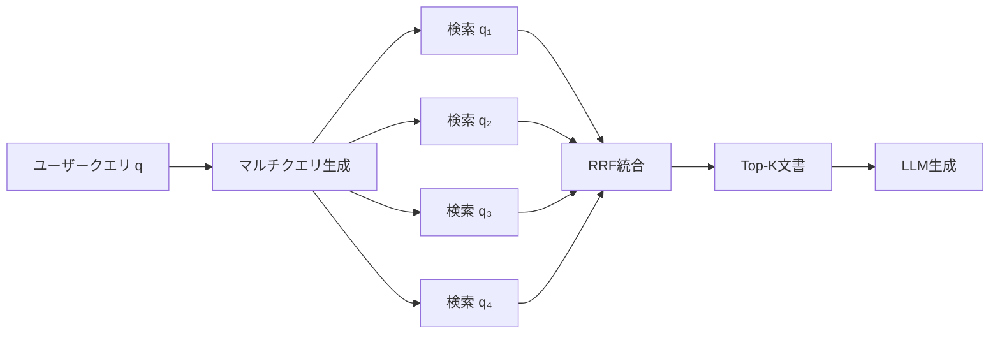

## 論文概要（Abstract）

RAG-Fusionは、従来のRAG（Retrieval-Augmented Generation）パイプラインの検索精度を向上させるため、**マルチクエリ生成**と**Reciprocal Rank Fusion（RRF）**を組み合わせた手法です。ユーザーの単一クエリからLLMで複数のクエリバリエーションを生成し、各クエリで並列に検索を実行した後、RRFで結果を統合します。

この手法により、クエリ表現の限界（語彙ミスマッチ、曖昧さ、多面的な情報ニーズ）を補い、より網羅的な文書検索を実現します。一方で、計算コストの増加やトピックドリフトのリスクという**トレードオフ**も存在します。

この記事は [Zenn記事: BM25×ベクトル検索のハイブリッド実装：RRFで検索精度を30%向上させる実践ガイド](https://zenn.dev/0h_n0/articles/f3d8b80351ae7b) の深掘りです。

## 情報源

- **arXiv ID**: 2402.03367
- **URL**: [arXiv:2402.03367](https://arxiv.org/abs/2402.03367)
- **著者**: Zackary Rackauckas
- **発表年**: 2024年
- **分野**: Information Retrieval (cs.IR), Machine Learning (cs.LG)
- **掲載誌**: International Journal on Natural Language Computing, Vol. 13, No. 1

## 背景と動機（Background & Motivation）

従来のRAGシステムは**単一クエリ**で検索を実行します。このアプローチには以下の本質的な限界があります：

1. **語彙ミスマッチ**: ユーザーの使う言葉と文書の言葉が一致しない（例: 「遅い」vs「レイテンシ」vs「パフォーマンス劣化」）
2. **クエリの曖昧さ**: 「AIの問題点」は安全性？バイアス？ハルシネーション？
3. **多面的な情報ニーズ**: 複雑なクエリは複数のサブクエスチョンを含む
4. **表現依存性**: 微妙な言い回しの違いで検索結果が大きく変わる

Zenn記事で解説されているBM25×ベクトル検索のハイブリッドは「検索手法の補完」でしたが、RAG-Fusionは**「クエリ表現の補完」**という別の軸からの改善です。この2つは直交する改善であり、**組み合わせることでさらなる精度向上**が見込めます。

## 主要な貢献（Key Contributions）

- **貢献1**: マルチクエリ生成 + RRFという**シンプルかつ効果的なパイプライン**を提案し、LangChainでの完全な実装例を提供
- **貢献2**: RRFの「コンセンサスブースト効果」（複数クエリで共通して上位にランクされる文書が自然に押し上げられる性質）を明確化
- **貢献3**: クエリ数n=2〜4が最適であること、n>5ではトピックドリフトリスクが増大することを示唆

## 技術的詳細（Technical Details）

### RAG-Fusionのアーキテクチャ

RAG-Fusionは4つのステージで構成されます：



**従来RAGとの比較**:

| ステージ | 従来RAG | RAG-Fusion |
|---------|---------|-----------|
| クエリ前処理 | なし | LLMでn個のクエリ変形を生成 |
| 検索 | 1回 | n回（並列実行可能） |
| ランキング | 検索スコアのまま | RRFで再ランキング |
| 生成 | Top-K文書 + 元クエリ | RRF統合後のTop-K + 元クエリ |

### ステージ1: マルチクエリ生成

ユーザークエリ$q$からLLMを使って$n$個のクエリバリエーションを生成します：

$$
Q = \{q_1, q_2, \ldots, q_n\} = \text{LLM}_{\text{generate}}(q, n)
$$

**プロンプトテンプレート**:

```
You are a helpful assistant that generates multiple search queries based on
a single input query. Generate {n} different search queries related to: {query}
Output ({n} queries):
```

**生成されるクエリの特性**:
- 元のクエリの言い換え（語彙の多様化）
- 異なる観点からの質問（多面性の捕捉）
- 異なる専門用語の使用（ドメイン知識の活用）
- サブクエスチョンの明示化（複合クエリの分解）

**具体例**:

元クエリ: 「Attention機構はどう動くか？」

生成されたバリエーション：
1. 「Transformerにおけるattentionの数式定義は？」
2. 「Query, Key, Value行列はself-attentionでどう機能するか？」
3. 「ニューラルネットワークのattention重みの直感的な意味は？」
4. 「multi-head attentionとsingle-head attentionの違いは？」

この4つのクエリは、元のクエリでは取りこぼす可能性のある**数式定義・直感的説明・実装上の違い**をカバーします。

### ステージ2: 並列検索

各クエリ$q_i$でそれぞれtop-k文書を検索します：

$$
D_i = \text{Retriever}(q_i, k) \quad \text{for each } q_i \in Q
$$

全検索結果を和集合で統合：

$$
D_{\text{all}} = D_1 \cup D_2 \cup \cdots \cup D_n
$$

### ステージ3: RRFによる再ランキング

複数の検索結果をRRFで統合します：

$$
\text{RRF}(d) = \sum_{i=1}^{n} \frac{1}{k + \text{rank}_i(d)}
$$

ここで、
- $n$: クエリ数
- $k$: 平滑化定数（通常k=60）
- $\text{rank}_i(d)$: クエリ$q_i$の結果における文書$d$の順位
- 文書がクエリ$q_i$で検索されなかった場合、そのクエリからのスコア寄与は0

### コンセンサスブースト効果

RAG-FusionにおけるRRFの核心的な性質は**コンセンサスブースト**です。

複数のクエリ結果に**共通して上位にランクされる文書**は、RRFスコアが高くなります。これは、その文書が元のクエリの意図に対して本質的に関連していることを示唆します。

**数値例**: n=4クエリ、k=60の場合

| 文書 | q₁での順位 | q₂での順位 | q₃での順位 | q₄での順位 | RRFスコア |
|------|-----------|-----------|-----------|-----------|----------|
| Doc A | 1位 | 2位 | 1位 | 3位 | 0.0638 |
| Doc B | 1位 | - | - | - | 0.0164 |
| Doc C | - | 1位 | - | - | 0.0164 |

Doc Aは4つ中3つのクエリで上位にランクされるため、RRFスコアが**Doc B/Cの約4倍**になります。これがコンセンサスブースト効果です。

### ステージ4: 生成

RRF統合後のtop-K文書を元のクエリとともにLLMに入力し、最終応答を生成します：

$$
\text{Response} = \text{LLM}(q, \text{top-K}_{\text{RRF}})
$$

## 実装のポイント（Implementation）

### LangChainによる完全実装

```python
from langchain.chat_models import ChatOpenAI
from langchain.embeddings import OpenAIEmbeddings
from langchain.vectorstores import Chroma
from langchain.prompts import ChatPromptTemplate
from langchain_core.output_parsers import StrOutputParser
from langchain.load import dumps, loads


def generate_queries(
    original_query: str,
    n: int = 4,
    llm: ChatOpenAI | None = None,
) -> list[str]:
    """LLMを使って元クエリからn個のバリエーションを生成する。

    Args:
        original_query: ユーザーの元クエリ
        n: 生成するクエリ数（推奨: 2-4）
        llm: 使用するLLM（デフォルト: ChatOpenAI）

    Returns:
        生成されたクエリのリスト
    """
    if llm is None:
        llm = ChatOpenAI(temperature=0)

    template = (
        "You are a helpful assistant that generates multiple "
        "search queries based on a single input query.\n"
        "Generate {n} different search queries related to: "
        "{original_query}\n"
        "Output ({n} queries):"
    )
    prompt = ChatPromptTemplate.from_template(template)
    chain = prompt | llm | StrOutputParser() | (lambda x: x.strip().split("\n"))
    return chain.invoke({"original_query": original_query, "n": n})


def reciprocal_rank_fusion(
    results: list[list],
    k: int = 60,
) -> list[tuple]:
    """複数の検索結果をRRFで統合する。

    Args:
        results: 各クエリの検索結果リスト
        k: RRF平滑化定数（デフォルト: 60）

    Returns:
        (Document, rrf_score)のリスト（スコア降順）
    """
    fused_scores: dict[str, float] = {}
    doc_map: dict[str, object] = {}

    for docs in results:
        for rank, doc in enumerate(docs):
            doc_str = dumps(doc)
            if doc_str not in fused_scores:
                fused_scores[doc_str] = 0.0
                doc_map[doc_str] = doc
            fused_scores[doc_str] += 1.0 / (rank + k)

    return [
        (doc_map[doc_str], score)
        for doc_str, score in sorted(
            fused_scores.items(), key=lambda x: x[1], reverse=True
        )
    ]


def rag_fusion_pipeline(
    query: str,
    retriever,
    n_queries: int = 4,
    top_k: int = 5,
) -> str:
    """RAG-Fusionパイプライン全体を実行する。

    Args:
        query: ユーザークエリ
        retriever: LangChainのRetrieverインスタンス
        n_queries: 生成するクエリ数
        top_k: 最終的に使用する文書数

    Returns:
        LLMの生成結果
    """
    # Step 1: マルチクエリ生成
    queries = generate_queries(query, n=n_queries)

    # Step 2: 並列検索
    all_results = [retriever.get_relevant_documents(q) for q in queries]

    # Step 3: RRF統合
    fused = reciprocal_rank_fusion(all_results, k=60)
    top_docs = [doc for doc, _ in fused[:top_k]]

    # Step 4: 生成
    context = "\n\n".join([doc.page_content for doc in top_docs])
    llm = ChatOpenAI(temperature=0)
    prompt = ChatPromptTemplate.from_template(
        "Answer based on this context:\n\n{context}\n\n"
        "Question: {question}\nAnswer:"
    )
    chain = prompt | llm | StrOutputParser()
    return chain.invoke({"context": context, "question": query})
```

### クエリ数nの最適化

| クエリ数 n | メリット | デメリット |
|-----------|---------|-----------|
| n=1 | 従来RAGと同等 | マルチクエリの効果なし |
| **n=2〜4** | **網羅性と効率のバランス** | **推奨** |
| n>5 | 過剰な網羅性 | トピックドリフト、コスト増大 |

**推奨**: n=4（4つのクエリバリエーション）が実用的な最適値です。

### BM25×ベクトル検索×RAG-Fusionの統合

Zenn記事のハイブリッド検索（BM25+ベクトル検索）とRAG-Fusionは**直交する最適化**であり、組み合わせ可能です：

```python
def hybrid_rag_fusion(
    query: str,
    bm25_retriever,
    vector_retriever,
    n_queries: int = 4,
    k_rrf: int = 60,
    top_k: int = 10,
) -> list[tuple]:
    """ハイブリッド検索×RAG-Fusionの統合パイプライン。

    Phase 1: RAG-Fusionのマルチクエリ生成
    Phase 2: 各クエリでBM25+ベクトルのハイブリッド検索
    Phase 3: 全結果をRRFで統合

    Args:
        query: ユーザークエリ
        bm25_retriever: BM25検索器
        vector_retriever: ベクトル検索器
        n_queries: 生成するクエリ数
        k_rrf: RRFのk値
        top_k: 最終的に返す文書数

    Returns:
        (Document, rrf_score)のリスト
    """
    # Phase 1: マルチクエリ生成
    queries = generate_queries(query, n=n_queries)

    # Phase 2: 各クエリでハイブリッド検索（2次元の融合）
    all_results = []
    for q in queries:
        bm25_docs = bm25_retriever.get_relevant_documents(q)
        vector_docs = vector_retriever.get_relevant_documents(q)
        # 各クエリのBM25+ベクトルをRRFで統合
        hybrid_results = reciprocal_rank_fusion(
            [bm25_docs, vector_docs], k=k_rrf
        )
        all_results.append([doc for doc, _ in hybrid_results[:top_k * 2]])

    # Phase 3: 全クエリ結果をRRFで統合（2段階RRF）
    final_results = reciprocal_rank_fusion(all_results, k=k_rrf)
    return final_results[:top_k]
```

この2段階RRFにより、**検索手法の補完**（BM25+ベクトル）と**クエリ表現の補完**（マルチクエリ）の両方の恩恵を受けられます。

## 関連手法との比較

### vs. クエリ拡張（Traditional Query Expansion）

| 観点 | 従来のクエリ拡張 | RAG-Fusion |
|------|----------------|-----------|
| 拡張方法 | シソーラス、共起語 | LLMによるクエリ変形 |
| 出力 | 拡張された単一クエリ | 完全に独立した複数クエリ |
| 融合方法 | なし（1クエリ） | RRF |
| 柔軟性 | 限定的 | LLMの能力に依存して高い |

### vs. HyDE（Hypothetical Document Embeddings）

HyDEは「仮想的な回答文書」を生成し、それを検索クエリとして使用します。一方RAG-Fusionは**クエリバリエーション**を生成します。

- HyDE: 回答の「形」を予測して検索 → 回答の質に依存
- RAG-Fusion: 質問の「別の聞き方」で検索 → クエリの多様性に依存

### vs. Self-RAG

Self-RAGは「検索すべきかどうか」を適応的に判断します。RAG-Fusionは「検索の質」を改善します。異なる問題への対処であり、理論的には併用可能です。

## 実験結果と限界

### 評価方法

本論文は定性的なケーススタディによる評価が中心であり、**大規模な定量ベンチマーク（MS MARCO, BEIR等）は含まれていません**。この点は採用判断における重要な留意点です。

**評価されたケース**:
- 技術的クエリ（Attention機構の仕組み）→ 数式・直感・実装をカバー ✅
- 曖昧なクエリ（AIの問題点）→ 安全性・バイアス・ハルシネーション等を網羅 ✅
- 製品情報検索（Infineonの製品データ）→ 正確で包括的な回答 ✅

### 限界とリスク

| 限界 | 影響 | 緩和策 |
|------|------|--------|
| **計算コストn倍** | LLM API呼び出し + 検索がn倍 | n=2-4に制限、並列実行 |
| **トピックドリフト** | 生成クエリが元の意図から逸脱 | temperatureを低く設定、nを制限 |
| **定量評価の欠如** | 実際の改善幅が不明 | 自前データセットでA/B評価を実施 |
| **ハルシネーション伝播** | LLMが的外れなクエリを生成 | クエリの品質フィルタリング |
| **コンテキスト長増加** | より多くの文書が最終LLM入力に | top-Kを5-10に制限 |

## 実運用への応用（Practical Applications）

### RAG-Fusionの導入判断基準

| 条件 | RAG-Fusion適用 |
|------|---------------|
| クエリが複雑・多面的 | ✅ 強く推奨 |
| クエリが単純・明確 | ❌ オーバーエンジニアリング |
| レイテンシ要件が厳しい（<100ms） | ⚠️ 並列化必須 |
| LLM APIコストに制約あり | ⚠️ n=2に制限 |
| 検索の網羅性が重要 | ✅ 最適 |

### Zenn記事のハイブリッド検索との組み合わせ

Zenn記事で紹介されているQdrantのQuery API（prefetch + RRF統合）と組み合わせる場合：

1. マルチクエリ生成はアプリケーション層で実行
2. 各クエリをQdrantのハイブリッド検索（sparse + dense + RRF）に投入
3. 全結果を2段階目のRRFで統合
4. 最終top-K文書をLLMに入力

この構成により、**語彙レベルの補完**（BM25）、**意味レベルの補完**（ベクトル検索）、**クエリレベルの補完**（マルチクエリ）の3重の改善が実現します。

## Production Deployment Guide

### AWS実装パターン（コスト最適化重視）

**トラフィック量別の推奨構成**:

| 規模 | 月間リクエスト | 推奨構成 | 月額コスト | 主要サービス |
|------|--------------|---------|-----------|------------|
| **Small** | ~3,000 (100/日) | Serverless | $100-200 | Lambda + Bedrock + OpenSearch Serverless |
| **Medium** | ~30,000 (1,000/日) | Hybrid | $500-1,200 | ECS + Bedrock + OpenSearch |
| **Large** | 300,000+ (10,000/日) | Container | $3,000-8,000 | EKS + Bedrock Batch + OpenSearch |

**Small構成の詳細** (月額$100-200):
- **Lambda**: クエリ生成 + RRF統合 ($20/月)
- **Bedrock (Claude 3.5 Haiku)**: マルチクエリ生成 ($30/月、n=4クエリ×100/日)
- **OpenSearch Serverless**: ハイブリッド検索 ($70/月)
- **Bedrock (Claude 3.5 Haiku)**: 最終回答生成 ($30/月)

**コスト削減テクニック**:
- マルチクエリ生成にはHaikuを使用（Sonnetの1/10のコスト）
- 生成されたクエリのキャッシュ（同一クエリの再生成防止）
- Bedrock Batch APIで非リアルタイム処理を50%削減
- Prompt Cachingでシステムプロンプト部分を30-90%削減

**コスト試算の注意事項**:
- 上記は2026年2月時点のAWS ap-northeast-1リージョン料金に基づく概算値です
- マルチクエリ生成のLLMコストはn値に比例して増加します
- 最新料金は [AWS料金計算ツール](https://calculator.aws/) で確認してください

### Terraformインフラコード

**Small構成 (Serverless): Lambda + Bedrock + OpenSearch Serverless**

```hcl
resource "aws_iam_role" "rag_fusion_lambda" {
  name = "rag-fusion-lambda-role"

  assume_role_policy = jsonencode({
    Version = "2012-10-17"
    Statement = [{
      Action = "sts:AssumeRole"
      Effect = "Allow"
      Principal = { Service = "lambda.amazonaws.com" }
    }]
  })
}

resource "aws_iam_role_policy" "bedrock_and_search" {
  role = aws_iam_role.rag_fusion_lambda.id

  policy = jsonencode({
    Version = "2012-10-17"
    Statement = [
      {
        Effect = "Allow"
        Action = ["bedrock:InvokeModel"]
        Resource = "arn:aws:bedrock:ap-northeast-1::foundation-model/anthropic.claude-3-5-haiku*"
      },
      {
        Effect = "Allow"
        Action = ["aoss:APIAccessAll"]
        Resource = "*"
      }
    ]
  })
}

resource "aws_lambda_function" "rag_fusion" {
  filename      = "rag_fusion.zip"
  function_name = "rag-fusion-pipeline"
  role          = aws_iam_role.rag_fusion_lambda.arn
  handler       = "index.handler"
  runtime       = "python3.12"
  timeout       = 60
  memory_size   = 1024

  environment {
    variables = {
      BEDROCK_MODEL_ID     = "anthropic.claude-3-5-haiku-20241022-v1:0"
      N_QUERIES            = "4"
      RRF_K                = "60"
      OPENSEARCH_ENDPOINT  = "https://..."
    }
  }
}
```

### セキュリティベストプラクティス

- **IAMロール**: Bedrock InvokeModelとOpenSearch APIのみ許可
- **シークレット管理**: OpenSearchエンドポイントはSecrets Manager経由
- **暗号化**: 全通信TLS 1.2以上、保管時KMS暗号化
- **ログ**: CloudTrailでBedrock呼び出しを監査

### 運用・監視設定

```sql
-- マルチクエリ生成のレイテンシ分布
fields @timestamp, query_generation_ms, n_queries, total_retrieval_ms
| stats avg(query_generation_ms) as avg_gen,
        pct(total_retrieval_ms, 95) as p95_retrieval
  by bin(5m)
```

### コスト最適化チェックリスト

**アーキテクチャ選択**:
- [ ] ~100 req/日 → Lambda + Bedrock Haiku - $100-200/月
- [ ] ~1000 req/日 → ECS + Bedrock Sonnet - $500-1,200/月
- [ ] 10000+ req/日 → EKS + Bedrock Batch - $3,000-8,000/月

**LLMコスト削減**:
- [ ] マルチクエリ生成: Haiku使用（$0.25/MTok）
- [ ] 最終回答生成: タスク複雑度に応じてHaiku/Sonnet切替
- [ ] クエリキャッシュ: 同一クエリの再生成防止（ElastiCache）
- [ ] Batch API: 非リアルタイム処理で50%削減

**検索コスト削減**:
- [ ] OpenSearch Serverless: アイドル時自動スケールダウン
- [ ] 並列検索: Lambda並列実行でレイテンシ最適化
- [ ] クエリ数制限: n=4が最適（n>5はコスト増の割に効果が薄い）

**監視・アラート**:
- [ ] Bedrock トークン使用量モニタリング
- [ ] クエリ生成品質の定期サンプリング
- [ ] End-to-end レイテンシ P95/P99 監視
- [ ] 月額コスト予算アラート

## 関連研究（Related Work）

- **Cormack et al. (2009)**: RRFの原論文。RAG-FusionはRRFをRAGパイプラインに応用した初の体系的な提案
- **HyDE (Gao et al., 2022)**: 仮想文書を生成して検索に使用する手法。RAG-Fusionとは「クエリ変形 vs 回答予測」というアプローチの違いがある
- **Multi-Query Retriever (LangChain)**: LangChainの組み込み機能。RAG-Fusionはマルチクエリ+RRFの組み合わせを明確化した点で差別化

## まとめと今後の展望

RAG-Fusionは**マルチクエリ生成×RRF**というシンプルな組み合わせで、RAG検索の網羅性を向上させる実用的な手法です。

**主要な成果**:
- マルチクエリ生成によるクエリ表現の限界克服
- RRFのコンセンサスブースト効果による高品質文書の自動選択
- LangChainでの完全実装コード提供

**実務への示唆**: Zenn記事のBM25×ベクトル検索のハイブリッドとRAG-Fusionは直交する最適化であり、**2段階RRF**で組み合わせることで3重の補完効果が得られます。ただし、大規模ベンチマークでの定量評価が不足しているため、**自前データセットでのA/B評価**を導入前に実施すべきです。

## 参考文献

- **arXiv**: [https://arxiv.org/abs/2402.03367](https://arxiv.org/abs/2402.03367)
- **LangChain MultiQueryRetriever**: [https://python.langchain.com/docs/modules/data_connection/retrievers/MultiQueryRetriever/](https://python.langchain.com/docs/modules/data_connection/retrievers/MultiQueryRetriever/)
- **Related Zenn article**: [https://zenn.dev/0h_n0/articles/f3d8b80351ae7b](https://zenn.dev/0h_n0/articles/f3d8b80351ae7b)
