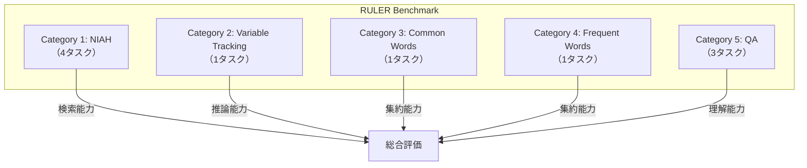

## 論文概要（Abstract）

「Needle-in-a-Haystack（NIAH）」テストはロングコンテキストLLMの評価として広く使われているが、単一の隠し情報の検索に限定されるため、LLMの真の長文脈能力を測れていない。本論文では**RULER**（Retrieval, Understanding, and Long-context Evaluation Revisited）を提案する。RULERは4カテゴリ・13タスクで構成される包括的ベンチマークであり、コンテキスト長・タスク難易度を精密に制御できる。GPT-4、Claude 2.1、Command-R、Yi-34B等10以上のモデルを4K〜128Kトークンで評価した結果、**公称コンテキスト長の25〜50%が実効的な限界**であり、従来のNIAHテストでは見えなかった大幅な性能劣化が明らかになった。

この記事は [Zenn記事: ロングコンテキストLLM活用の最適解：200Kトークンを使いこなす実装パターン](https://zenn.dev/0h_n0/articles/a1bb0a9d6cb7f0) の深掘りです。

## 情報源

- **arXiv ID**: 2402.10790
- **URL**: [https://arxiv.org/abs/2402.10790](https://arxiv.org/abs/2402.10790)
- **著者**: Cheng-Ping Hsieh, Simeng Sun, Samuel Kriman, Shantanu Acharya, Dima Rekesh, Fei Jia, Yang Zhang, Boris Ginsburg（NVIDIA Research）
- **発表年**: 2024年（NAACL 2024に採択）
- **分野**: cs.CL, cs.AI

## 背景と動機（Background & Motivation）

Greg Kamradtが考案した「Needle-in-a-Haystack」テストは、長いテキスト中に1つの事実（needle）を埋め込み、LLMがそれを検索できるかを評価する。しかしこのテストには重大な限界がある:

1. **単純すぎる**: 多くのモデルがNIAHで100%近いスコアを達成するため、モデル間の差異を測れない
2. **単一情報のみ**: 複数の情報を同時に検索・集約する能力を測れない
3. **推論を含まない**: 情報の検索のみで、推論・変数追跡・集約は評価対象外

Zenn記事で紹介されているように、GPT-4.1は「全位置で100%の検索精度」を達成しているが、これはNIAHテストの簡単さを反映しているに過ぎない。実際のアプリケーション（マルチドキュメントQA、コードリポジトリ解析、長文要約）ではNIAHよりはるかに複雑なタスクが求められる。

## 主要な貢献（Key Contributions）

- **貢献1**: 4カテゴリ・13タスクで構成されるRULERベンチマークを構築。コンテキスト長・タスク難易度をパラメトリックに制御可能で、NIAHの限界を克服した。
- **貢献2**: 10以上の主要LLMを4K〜128Kで評価し、公称コンテキスト長では実際の性能が大幅に劣化することを定量的に実証。「NIAHパス = ロングコンテキスト対応」という誤解を覆した。
- **貢献3**: タスク種別による性能差を明らかにし、モデル選定の実践的な指針を提供。単純検索は32Kまで機能するが、集約・推論は早期に劣化する。

## 技術的詳細（Technical Details）

### RULERの4カテゴリ・13タスク



#### カテゴリ1: Needle-In-A-Haystack拡張（4タスク）

従来のNIAHを3つの軸で拡張:

| タスク | Needle形式 | Needle数 | 難易度 |
|--------|----------|---------|--------|
| NIAH-Word | 単語/フレーズ | 1 | 低 |
| NIAH-Sentence | 文 | 1 | 中 |
| NIAH-Paragraph | 段落 | 1 | 中高 |
| NIAH-Multi | 任意 | K=2〜4 | **高** |

**NIAH-Multiが最重要**: 複数のneedleを同時に検索させることで、単一needleでは見えなかった能力差が現れる。

#### カテゴリ2: Variable Tracking（1タスク）

チェーン状の変数割り当てが長文中に分散配置されており、最終的な値を追跡する:

```
...（ノイズテキスト）...
X = Y
...（ノイズテキスト 5000トークン）...
Y = Z
...（ノイズテキスト 8000トークン）...
Z = 42
...（ノイズテキスト）...

質問: Xの値は？
正解: 42
```

チェーン長$K$（2〜8）で難易度を制御。$K=8$は8段階の変数チェーンを追跡する必要があり、128Kトークンでは全モデルが大幅に劣化する。

#### カテゴリ3: Common Words Extraction（1タスク）

長文中に複数の「単語リスト」が分散配置されており、**全リストに共通する単語**を抽出する:

$$
\text{Output} = \bigcap_{i=1}^{K} L_i
$$

ここで$L_i$は$i$番目の単語リスト。$K$（2〜10）で難易度を制御。集約タスクであり、情報の検索だけでなく交差演算が必要。

#### カテゴリ4: Frequent Words Extraction（1タスク）

長文中で最も頻出する単語Top-$K$を抽出する。頻度分布のZipf指数$\alpha$で難易度を制御。

#### カテゴリ5: Question Answering（3タスク）

既存QAデータセットをロングコンテキスト化:

| タスク | ベースデータセット | 特徴 |
|--------|----------------|------|
| QA-SQuAD | SQuAD | 単一文書QA（ノイズ文書追加） |
| QA-HotpotQA | HotpotQA | マルチホップ推論 |
| QA-2Wiki | 2WikiMultiHopQA | 複雑なマルチホップ |

### ノイズテキストの構成

ベンチマークの背景テキスト（haystack）にはPaul Grahamのエッセイを使用。合成的なランダムテキストではなく自然な英語を使用することで、現実的な条件での評価を実現している。

### 評価指標

- **NIAH系**: 正確なneedle文字列の完全一致
- **VT**: 最終変数値の完全一致
- **CWE**: 共通単語のF1スコア
- **FWE**: Top-K単語のF1スコア
- **QA**: 正解文字列のサブストリングマッチ

## 実装のポイント（Implementation）

### RULERの実行方法

RULERのデータ生成と評価は公開されたスクリプトで再現可能:

```python
from dataclasses import dataclass
from typing import Literal

@dataclass
class RULERTask:
    """RULERタスクの設定"""
    category: Literal["niah", "vt", "cwe", "fwe", "qa"]
    context_length: int  # 4096, 8192, ..., 131072
    difficulty: int  # タスク固有の難易度パラメータ
    num_samples: int = 100

def generate_niah_multi_task(
    context_length: int,
    num_needles: int = 4,
    noise_source: str = "paul_graham_essays",
) -> dict:
    """NIAH-Multi タスクインスタンスを生成

    Args:
        context_length: 目標コンテキスト長（トークン数）
        num_needles: 埋め込むneedleの数
        noise_source: ノイズテキストのソース

    Returns:
        タスクインスタンス（prompt + 正解）
    """
    import random

    # ノイズテキストを読み込み
    noise = load_noise_text(noise_source, context_length)

    # Needleを生成（UUIDベース）
    needles = []
    for i in range(num_needles):
        key = f"FACT_{i+1}"
        value = generate_random_fact()
        needles.append({"key": key, "value": value})

    # Needleをランダムな位置に挿入
    positions = sorted(random.sample(
        range(100, context_length - 100), num_needles
    ))
    for needle, pos in zip(needles, positions):
        noise = insert_at_position(noise, needle["value"], pos)

    # クエリ生成
    query = "以下の事実をすべて見つけて列挙してください: "
    query += ", ".join(n["key"] for n in needles)

    return {
        "prompt": f"{noise}\n\n{query}",
        "answer": [n["value"] for n in needles],
    }


def generate_variable_tracking_task(
    context_length: int,
    chain_length: int = 4,
) -> dict:
    """Variable Tracking タスクインスタンスを生成

    Args:
        context_length: 目標コンテキスト長
        chain_length: 変数チェーンの長さ

    Returns:
        タスクインスタンス
    """
    import string
    import random

    # 変数名と最終値を生成
    var_names = random.sample(string.ascii_uppercase, chain_length + 1)
    final_value = str(random.randint(1, 1000))

    # チェーン構築: X=Y, Y=Z, ..., Z=42
    assignments = []
    for i in range(chain_length):
        assignments.append(f"{var_names[i]} = {var_names[i+1]}")
    assignments.append(f"{var_names[-1]} = {final_value}")

    # ノイズテキスト中に分散配置
    noise = load_noise_text("paul_graham_essays", context_length)
    for assignment in assignments:
        pos = random.randint(100, len(noise) - 100)
        noise = insert_at_position(noise, assignment, pos)

    query = f"{var_names[0]}の値は何ですか？"
    return {"prompt": f"{noise}\n\n{query}", "answer": final_value}
```

### モデル評価の実践的ガイド

RULERを使ったモデル選定の手順:

1. **4Kでベースラインスコアを測定**: 全タスクで4Kでのスコアを記録（これが理論上限）
2. **実用コンテキスト長で測定**: 実際に使用するコンテキスト長（例: 32K, 64K）で再測定
3. **劣化率を計算**: `(4Kスコア - 目標長スコア) / 4Kスコア × 100`
4. **閾値判定**: 劣化率が20%を超えるタスクカテゴリがあれば、そのコンテキスト長は実用的でないと判断

## Production Deployment Guide

### AWS実装パターン（コスト最適化重視）

RULERベンチマーク実行環境:

| 規模 | 用途 | 推奨構成 | 月額コスト | 主要サービス |
|------|------|---------|-----------|------------|
| **Small** | 単一モデル評価 | Serverless | $50-200 | SageMaker Processing + S3 |
| **Medium** | 複数モデル比較 | GPU Instance | $300-1,000 | SageMaker g5 + Step Functions |
| **Large** | 定期ベンチマーク | GPU Cluster | $1,500-4,000 | EKS + Batch + Spot |

**Small構成の詳細** (月額$50-200):
- **SageMaker Processing**: ml.g5.xlarge スポット ($50/月)
- **S3**: ベンチマーク結果保存 ($5/月)
- **Lambda**: 結果集計・レポート ($5/月)

**Medium構成の詳細** (月額$300-1,000):
- **SageMaker**: g5.2xlarge × 2 台スポット ($300/月)
- **Step Functions**: モデル別パイプライン ($10/月)
- **DynamoDB**: 結果データベース ($10/月)
- **QuickSight**: ダッシュボード ($18/月)

**コスト削減テクニック**:
- Spot Instances使用で最大90%削減（ベンチマーク中断時はチェックポイントから再開）
- 128Kトークンの評価はAPIコストが高いため、まず4K・32Kで候補を絞り込んでから128Kで最終評価
- Bedrock APIを使用する場合はBatch API（50%割引）を活用

**コスト試算の注意事項**: 上記は2026年2月時点のAWS ap-northeast-1料金に基づく概算値です。最新料金は[AWS料金計算ツール](https://calculator.aws/)で確認してください。

### Terraformインフラコード

```hcl
# --- S3バケット（ベンチマーク結果保存） ---
resource "aws_s3_bucket" "benchmark_results" {
  bucket = "ruler-benchmark-results"
}

resource "aws_s3_bucket_lifecycle_configuration" "cleanup" {
  bucket = aws_s3_bucket.benchmark_results.id

  rule {
    id     = "archive-old-results"
    status = "Enabled"

    transition {
      days          = 30
      storage_class = "GLACIER"
    }
  }
}

# --- SageMaker Processing Job ---
resource "aws_sagemaker_processing_job" "ruler_benchmark" {
  processing_job_name = "ruler-benchmark-${var.model_name}"
  role_arn            = aws_iam_role.sagemaker.arn

  processing_resources {
    cluster_config {
      instance_count    = 1
      instance_type     = "ml.g5.xlarge"
      volume_size_in_gb = 50
    }
  }

  app_specification {
    image_uri = var.benchmark_image_uri
    container_arguments = [
      "--model", var.model_name,
      "--context-lengths", "4096,8192,16384,32768,65536,131072",
      "--tasks", "niah,vt,cwe,fwe,qa",
      "--num-samples", "100"
    ]
  }

  processing_output_config {
    outputs {
      output_name = "results"
      s3_output {
        s3_uri        = "s3://${aws_s3_bucket.benchmark_results.bucket}/results/"
        local_path    = "/opt/ml/processing/output"
        s3_upload_mode = "EndOfJob"
      }
    }
  }
}

# --- CloudWatch ダッシュボード ---
resource "aws_cloudwatch_dashboard" "ruler" {
  dashboard_name = "ruler-benchmark"
  dashboard_body = jsonencode({
    widgets = [
      {
        type   = "metric"
        properties = {
          title   = "RULER Score by Context Length"
          metrics = [
            ["RULER", "Score", "Model", var.model_name, "ContextLength", "4096"],
            ["RULER", "Score", "Model", var.model_name, "ContextLength", "32768"],
            ["RULER", "Score", "Model", var.model_name, "ContextLength", "131072"]
          ]
        }
      }
    ]
  })
}
```

### 運用・監視設定

```python
import boto3

cloudwatch = boto3.client('cloudwatch')

# ベンチマークジョブの実行時間監視
cloudwatch.put_metric_alarm(
    AlarmName='ruler-job-timeout',
    ComparisonOperator='GreaterThanThreshold',
    EvaluationPeriods=1,
    MetricName='ProcessingJobDuration',
    Namespace='AWS/SageMaker',
    Period=3600,
    Statistic='Maximum',
    Threshold=7200,  # 2時間超過でアラート
    AlarmDescription='RULERベンチマークジョブのタイムアウト'
)

# カスタムメトリクス: RULERスコアの定期記録
def publish_ruler_scores(
    model_name: str,
    scores: dict[str, float],
) -> None:
    """RULERスコアをCloudWatchカスタムメトリクスに記録"""
    for context_length, score in scores.items():
        cloudwatch.put_metric_data(
            Namespace='RULER',
            MetricData=[{
                'MetricName': 'Score',
                'Dimensions': [
                    {'Name': 'Model', 'Value': model_name},
                    {'Name': 'ContextLength', 'Value': str(context_length)},
                ],
                'Value': score,
                'Unit': 'Percent'
            }]
        )
```

### コスト最適化チェックリスト

**アーキテクチャ選択**:
- [ ] 単発評価 → SageMaker Processing (Spot) - $50-200/回
- [ ] 定期評価 → Step Functions + SageMaker - $300-1,000/月
- [ ] CI/CD統合 → EKS + Batch - $1,500-4,000/月

**リソース最適化**:
- [ ] Spot Instances使用（チェックポイント対応でコスト90%削減）
- [ ] 段階的評価: 4K→32K→128Kの順で候補を絞り込み
- [ ] Bedrock Batch API活用（50%割引）
- [ ] S3 Glacierへの自動アーカイブ（30日後）

**監視・アラート**:
- [ ] ジョブタイムアウト監視
- [ ] RULERスコアの定期トラッキング
- [ ] AWS Budgets設定
- [ ] コスト異常検知有効化

## 実験結果（Results）

### 総合スコア（4K→128Kでの劣化）

| モデル | 公称長 | 4K | 32K | 128K | 劣化率(4K→128K) |
|--------|-------|-----|------|------|---------------|
| **GPT-4** | 128K | 96.6 | 93.1 | 81.2 | **-16%** |
| Claude 2.1 | 200K | 97.0 | 84.5 | - | - |
| Command-R | 128K | 93.8 | 85.0 | 57.9 | **-38%** |
| Yi-34B | 200K | 93.3 | 76.2 | 54.5 | **-42%** |
| Mixtral-8x7B | 32K | 94.9 | 77.6 | - | - |
| Mistral-7B | 32K | 91.2 | 70.2 | - | - |

### タスクカテゴリ別の劣化パターン（GPT-4, 128K）

| タスクカテゴリ | 4K | 128K | 劣化幅 | 難易度 |
|-------------|-----|------|-------|--------|
| NIAH-Single | 99+ | 95-98 | **-3%** | 低 |
| NIAH-Multi (K=4) | 96 | 79 | **-17%** | 中 |
| Variable Tracking (K=8) | 91 | 62 | **-29%** | **高** |
| Common Words (K=10) | 88 | 55 | **-33%** | **高** |
| QA (Multi-hop) | 85 | 64 | **-21%** | 中高 |

**核心的発見**: 単純なNIAH-Singleでは3%しか劣化しないが、Variable Trackingでは29%、Common Words Extractionでは33%も劣化する。**NIAHテストだけでモデルを評価すると、実際の能力を大幅に過大評価する**。

### モデル選定の実践的指針

- **32Kまでの用途**: ほぼどのモデルも実用可能。コスト重視ならMistral-7B
- **64K用途**: GPT-4が最も堅牢。Command-Rはコスト効率良いが急劣化に注意
- **128K用途**: GPT-4のみが実用水準を維持。他モデルは40%以上劣化
- **集約・推論タスク**: 32K超ではRAGの併用が事実上必須

## 実運用への応用（Practical Applications）

### Zenn記事のNeedle-in-a-Haystack議論への補足

Zenn記事では「GPT-4.1のNeedle精度100%」が紹介されているが、RULERの結果はこの数値の解釈に重要な補足を加える:

1. **NIAH-Single ≠ 実用能力**: 単一情報の検索では100%でも、複数情報の同時検索や集約では大幅に劣化する
2. **実効コンテキスト長**: 公称128Kでも、VT・CWEタスクでの実効限界は32〜64K
3. **RAGとのハイブリッド戦略**: 32K超の集約タスクではRAGで事前フィルタリングし、コンテキスト長を制限することが精度維持の鍵

### モデル評価パイプラインへの統合

プロダクションでのモデル更新・切り替え時に、RULERをCI/CDパイプラインに統合することで、性能退行を自動検知できる:

```python
def evaluate_model_upgrade(
    current_model: str,
    new_model: str,
    target_context_length: int = 32768,
    regression_threshold: float = 0.05,
) -> bool:
    """モデル更新時のRULERベースの自動評価

    Args:
        current_model: 現行モデル名
        new_model: 新モデル名
        target_context_length: 評価するコンテキスト長
        regression_threshold: 許容する性能劣化率

    Returns:
        True if new model passes, False if regression detected
    """
    current_scores = run_ruler(current_model, target_context_length)
    new_scores = run_ruler(new_model, target_context_length)

    for task, current_score in current_scores.items():
        new_score = new_scores[task]
        regression = (current_score - new_score) / current_score
        if regression > regression_threshold:
            print(f"REGRESSION: {task}: {current_score:.1f}→{new_score:.1f} (-{regression:.1%})")
            return False

    return True
```

## 関連研究（Related Work）

- **Needle-in-a-Haystack** (Kamradt, 2023): RULERの出発点となった元テスト。単一情報検索に限定。
- **HELMET** (2025): RULERと同時期に提案された包括的長文脈評価ベンチマーク。RAG、要約、コード補完等の実タスクを含む。
- **BABILong** (2024): bAbI推論タスクを長文ノイズに埋め込み。推論能力の長文脈限界を測定。
- **Counting-Stars** (2024): 複数のエビデンスを数え上げる集約ベンチマーク。CWEタスクと類似の設計思想。

## まとめと今後の展望

RULERは「NIAHパス = ロングコンテキスト対応」という誤解を覆し、モデル選定の実践的な基盤を提供した。

- **公称長の25〜50%が実効限界**: 128K公称でも実用上は32〜64Kが上限のモデルが多い
- **タスク種別で劣化が異なる**: 単純検索は堅牢、集約・推論は早期に崩壊
- **モデル選定に必須**: NIAHだけでなく、VT・CWE・QAを含む多面的評価が不可欠

今後はGPT-4.1（1M）、Claude Opus 4.6（200K）、Gemini 2.5 Pro（1M+）等の最新モデルでの追試、および日本語での評価拡張が期待される。

## 参考文献

- **arXiv**: [https://arxiv.org/abs/2402.10790](https://arxiv.org/abs/2402.10790)
- **NAACL 2024**: 採択確認済み
- **Code**: GitHub（論文内リンク記載）
- **Related Zenn article**: [https://zenn.dev/0h_n0/articles/a1bb0a9d6cb7f0](https://zenn.dev/0h_n0/articles/a1bb0a9d6cb7f0)
