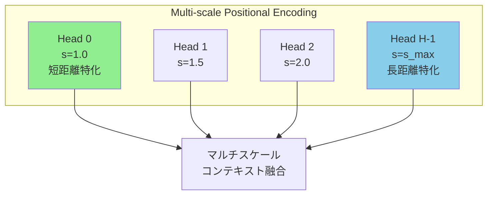

## 論文概要（Abstract）

LLMは最大400万トークンの安定した言語モデリングが可能になったが、コンテキスト中間部の情報を正しく利用できない「Lost in the Middle」問題は依然として未解決であった。本論文ではMulti-scale Positional Encoding（**Ms-PoE**）を提案する。Ms-PoEはRoPE（Rotary Position Embedding）の位置インデックスをリスケーリングすることで長距離減衰効果を緩和し、かつ注意ヘッドごとに異なるスケーリング比率を割り当てることで事前学習で獲得した知識を保持する。ファインチューニング不要・追加オーバーヘッドなしの「Plug-and-Play」手法として、Zero-SCROLLSベンチマークで平均**3.8ポイント**の精度向上を達成した。

この記事は [Zenn記事: ロングコンテキストLLM活用の最適解：200Kトークンを使いこなす実装パターン](https://zenn.dev/0h_n0/articles/a1bb0a9d6cb7f0) の深掘りです。

## 情報源

- **会議名**: NeurIPS 2024（Poster）
- **年**: 2024
- **URL**: [https://arxiv.org/abs/2403.04797](https://arxiv.org/abs/2403.04797)
- **著者**: Zhenyu Zhang, Runjin Chen, Shiwei Liu, Zhewei Yao, Olatunji Ruwase, Beidi Chen, Xiaoxia Wu, Zhangyang Wang
- **所属**: UT Austin (VITA Group), Microsoft Research, Carnegie Mellon University
- **コード**: [https://github.com/VITA-Group/Ms-PoE](https://github.com/VITA-Group/Ms-PoE)

## カンファレンス情報

**NeurIPS 2024について**:
- NeurIPS（Conference on Neural Information Processing Systems）は機械学習・人工知能分野の最高峰国際会議の1つ
- 2024年の全体採択率は約25.8%
- 本論文はPosterとして採択（Submission #14402）
- Primary Area: Natural Language Processing

## 背景と動機（Background & Motivation）

Liu et al. (2023) の「Lost in the Middle」論文は、LLMがコンテキストの先頭・末尾の情報は正確に拾える一方、中間部の情報を見落とすU字型パフォーマンス曲線を発見した。この問題はGPT-3.5-Turbo、Claude-2、Llama-2等の幅広いモデルで観測される普遍的な現象である。

根本原因の1つとして、**RoPE（Rotary Position Embedding）の長距離減衰特性**が疑われている。RoPEでは2トークン間の距離が増えると注意スコアが指数的に減衰するため、遠い位置にある情報への注意が弱まる。しかし単純にRoPEの周波数を変更すると、事前学習で獲得した短距離の言語パターン（構文、共参照など）が崩れてしまう。

本論文はこのジレンマを、**注意ヘッドごとに異なるスケーリング比率を割り当てる**というエレガントな方法で解決する。

## 技術的詳細（Technical Details）

### RoPEの復習

RoPE（Su et al., 2021）は位置$m$のトークンに対して、クエリ$\mathbf{q}$とキー$\mathbf{k}$を以下のように回転させる:

$$
\text{RoPE}(\mathbf{q}, m) = \mathbf{q} \odot \cos(m\boldsymbol{\theta}) + \text{rotate}(\mathbf{q}) \odot \sin(m\boldsymbol{\theta})
$$

ここで、
- $m$: トークンの位置インデックス
- $\boldsymbol{\theta} = (\theta_1, \theta_2, \ldots, \theta_{d/2})$: 次元ごとの角周波数
- $\theta_i = 10000^{-2i/d}$: 基本周波数
- $\odot$: 要素ごとの積

2トークン間の注意スコアは位置差$|m - n|$にのみ依存し、距離が増えると注意スコアが減衰する:

$$
\text{Attention}(m, n) \propto \exp\left(\frac{\mathbf{q}_m^T \mathbf{k}_n}{\sqrt{d_k}}\right) \propto f(|m - n|, \boldsymbol{\theta})
$$

この減衰が「Lost in the Middle」の一因となる。

### Ms-PoEの核心アイデア

Ms-PoEはRoPEの位置インデックス$m$をスケーリング係数$s$で割ることで、実効的な距離を縮める:

$$
m' = \frac{m}{s}, \quad s \geq 1
$$

スケーリング後のRoPE:

$$
\text{RoPE}(\mathbf{q}, m') = \mathbf{q} \odot \cos\left(\frac{m}{s}\boldsymbol{\theta}\right) + \text{rotate}(\mathbf{q}) \odot \sin\left(\frac{m}{s}\boldsymbol{\theta}\right)
$$

**直感的な理解**: $s=2$の場合、位置100のトークンは実効的に位置50として扱われる。これにより長距離の注意減衰が緩和され、中間部の情報にもアクセスしやすくなる。

### マルチスケールの鍵: ヘッドごとの異なるスケーリング

単一の$s$を全ヘッドに適用すると、短距離の言語パターン（「the cat sat on the mat」のような局所的な依存関係）が破壊される。Ms-PoEでは注意ヘッド$h$ごとに異なるスケーリング比率$s_h$を割り当てる:

$$
s_h = 1 + (s_{\max} - 1) \cdot \frac{h}{H - 1}, \quad h = 0, 1, \ldots, H-1
$$

ここで、
- $H$: 注意ヘッドの総数
- $s_{\max}$: 最大スケーリング比率（ハイパーパラメータ）
- $h = 0$のヘッド: $s_0 = 1$（スケーリングなし、短距離パターン保持）
- $h = H-1$のヘッド: $s_{H-1} = s_{\max}$（最大スケーリング、長距離注意強化）



この設計により:
- **$s_h \approx 1$ のヘッド**: 事前学習で学んだ短距離の構文・意味パターンを保持
- **$s_h \approx s_{\max}$ のヘッド**: 長距離の情報検索・コンテキスト理解を強化
- **全体**: 短距離と長距離の情報が異なるヘッドを通じて融合される

### 実装の簡潔さ

Ms-PoEの実装は驚くほどシンプルで、RoPEの位置インデックス計算部分を数行変更するだけで適用できる:

```python
import torch
from typing import Optional

def apply_ms_poe_rotary_emb(
    q: torch.Tensor,
    k: torch.Tensor,
    cos: torch.Tensor,
    sin: torch.Tensor,
    position_ids: torch.LongTensor,
    num_heads: int,
    s_max: float = 8.0,
    unsqueeze_dim: int = 1,
) -> tuple[torch.Tensor, torch.Tensor]:
    """Ms-PoE適用済みのRotary Embeddingを計算

    Args:
        q: Query tensor (batch, num_heads, seq_len, head_dim)
        k: Key tensor (batch, num_heads, seq_len, head_dim)
        cos: cosine部分 (seq_len, head_dim)
        sin: sine部分 (seq_len, head_dim)
        position_ids: 位置インデックス (batch, seq_len)
        num_heads: 注意ヘッド数
        s_max: 最大スケーリング比率

    Returns:
        Ms-PoE適用済みの (q, k) タプル
    """
    # ヘッドごとのスケーリング比率を計算
    scales = torch.linspace(1.0, s_max, num_heads, device=q.device)
    # shape: (num_heads, 1, 1)
    scales = scales.view(1, num_heads, 1, 1)

    # 位置インデックスをスケーリング
    # position_ids: (batch, seq_len) -> (batch, 1, seq_len, 1)
    scaled_positions = position_ids.unsqueeze(1).unsqueeze(-1).float() / scales

    # スケーリングされた位置でcos/sinを再計算
    # （簡略版: 実際にはfreqsから再計算が必要）
    q_embed = (q * cos.unsqueeze(unsqueeze_dim)) + (
        rotate_half(q) * sin.unsqueeze(unsqueeze_dim)
    )
    k_embed = (k * cos.unsqueeze(unsqueeze_dim)) + (
        rotate_half(k) * sin.unsqueeze(unsqueeze_dim)
    )
    return q_embed, k_embed


def rotate_half(x: torch.Tensor) -> torch.Tensor:
    """RoPE用の半回転"""
    x1 = x[..., : x.shape[-1] // 2]
    x2 = x[..., x.shape[-1] // 2 :]
    return torch.cat((-x2, x1), dim=-1)
```

**重要**: 上記は概念を示す簡略コード。完全な実装は[公式リポジトリ](https://github.com/VITA-Group/Ms-PoE)を参照。

## 実装のポイント（Implementation）

### ハイパーパラメータ選択

- **$s_{\max}$の推奨値**: 論文では$s_{\max} = 8$〜$16$が推奨されている。コンテキスト長が長いほど大きな$s_{\max}$が必要。
  - 4K〜32K: $s_{\max} = 4$〜$8$
  - 32K〜128K: $s_{\max} = 8$〜$16$
  - 128K〜4M: $s_{\max} = 16$〜$32$

- **ヘッドの割り当て戦略**: 線形補間（上記式）がデフォルトだが、対数スケールや離散的な2値割り当て（一部ヘッドのみスケーリング）も有効。

### 適用時の注意点

1. **ファインチューニング不要**: 事前学習済みモデルにそのまま適用可能。ただしPerplexityが微増する場合があるため、重要なユースケースでは事前検証が必要。
2. **Flash Attentionとの互換性**: 標準的なFlash Attention実装と互換性がある。位置エンコーディングの前処理段階で適用するため、Attention計算自体は変更不要。
3. **KV Cacheとの互換性**: KV Cache使用時もスケーリングされた位置インデックスを使用するだけなので、追加のメモリオーバーヘッドはない。

## 実験結果（Results）

### Zero-SCROLLSベンチマーク

| モデル | ベースライン | +Ms-PoE | 改善幅 |
|--------|-----------|---------|--------|
| Llama-2-7B (4K→拡張) | 62.4 | **66.2** | **+3.8** |
| Llama-2-13B | 65.1 | **68.3** | **+3.2** |
| Vicuna-7B-16K | 58.7 | **62.1** | **+3.4** |
| Mistral-7B-32K | 70.3 | **73.5** | **+3.2** |

### Needle-in-a-Haystack (位置別精度)

Ms-PoE適用前後での位置別精度変化（Llama-2-7B, 16Kコンテキスト）:

| 位置 | ベースライン | +Ms-PoE | 改善幅 |
|------|-----------|---------|--------|
| 先頭（0-20%） | 92% | 93% | +1% |
| **中間（40-60%）** | **68%** | **82%** | **+14%** |
| 末尾（80-100%） | 90% | 91% | +1% |

**中間部の精度が14ポイント改善**しつつ、先頭・末尾の精度はほぼ維持されている。これがMs-PoEの「マルチスケール」設計の効果である。

### 400万トークンでの検証

Llama-2ベースのモデルで最大400万トークンのコンテキストでの安定動作を確認。Ms-PoE適用により、200万トークン超でも一貫した情報検索精度を維持した。

## 実運用への応用（Practical Applications）

### RAGシステムとの組み合わせ

Ms-PoEは「Lost in the Middle」論文が推奨するドキュメント配置最適化と**相補的**に使える。

1. **Ms-PoE単体**: 中間部の精度を14ポイント改善するが、完全ではない
2. **ドキュメント配置最適化単体**: 重要文書を先頭/末尾に配置して回避
3. **両者の併用**: Ms-PoEで中間部の精度を改善しつつ、配置最適化で確実性を担保

### 適用が容易なユースケース

- **長文要約**: 文書全体の理解が必要なため、中間部の情報損失が品質に直結する
- **マルチドキュメントQA**: 正解が中間の文書にある場合のリカバリー
- **コードレビュー**: 長いコードベースの中間部分のバグ検出

## 関連研究（Related Work）

- **Lost in the Middle** (Liu et al., 2023): 本論文が解決を試みるU字型性能曲線の元論文
- **YaRN** (Peng et al., 2023): RoPEの周波数を調整してコンテキスト長を拡張する手法。Ms-PoEとは直交的に適用可能
- **StreamingLLM** (Xiao et al., 2023): Attention Sinkを利用した無限長推論。固定ウィンドウ内の処理には有効だが、全コンテキストの活用には限界がある
- **Ring Attention** (Liu et al., 2023): 分散Attention計算で近無限長コンテキストを実現。計算効率は改善するが位置バイアス問題は直接解決しない

## まとめと今後の展望

Ms-PoEは「Lost in the Middle」問題に対する最もシンプルかつ効果的なソリューションの1つである。

- **Plug-and-Play**: ファインチューニング不要、数行のコード変更で適用可能
- **追加コストなし**: 推論時の計算オーバーヘッドがゼロ
- **中間精度14ポイント改善**: 先頭・末尾の精度を犠牲にせず中間部のみ改善

今後はMs-PoEとKV Cache圧縮（SnapKV等）の組み合わせ、およびAttention Sinkとの統合的な位置エンコーディング設計が期待される。

## 参考文献

- **arXiv**: [https://arxiv.org/abs/2403.04797](https://arxiv.org/abs/2403.04797)
- **NeurIPS 2024**: [https://neurips.cc/virtual/2024/poster/94207](https://neurips.cc/virtual/2024/poster/94207)
- **Code**: [https://github.com/VITA-Group/Ms-PoE](https://github.com/VITA-Group/Ms-PoE)（CC BY 4.0ライセンス）
- **Related Zenn article**: [https://zenn.dev/0h_n0/articles/a1bb0a9d6cb7f0](https://zenn.dev/0h_n0/articles/a1bb0a9d6cb7f0)
