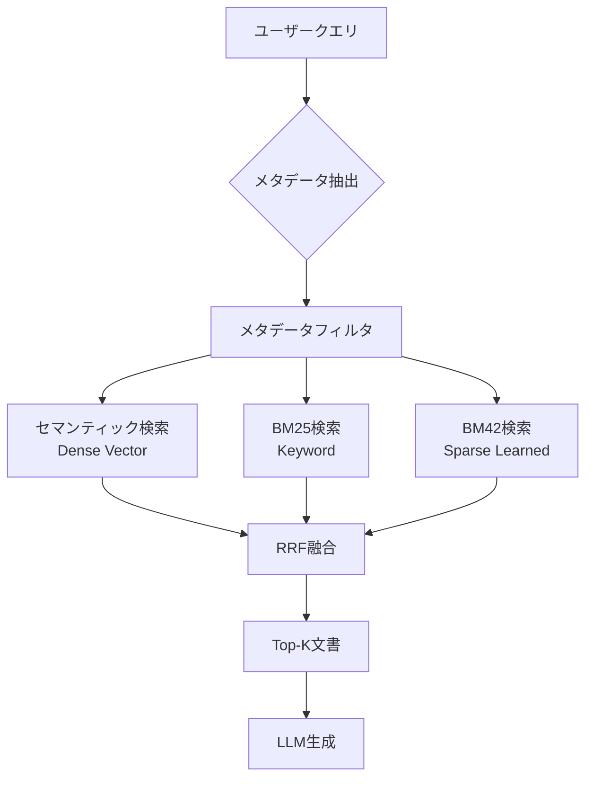

## 論文概要（Abstract）

Blended RAGは、**セマンティック検索（Dense Vector）**と**BM25（Sparse/Keyword）**をRRFで融合し、さらに**メタデータフィルタリング**を加えることで、企業向けRAGシステムの検索精度を大幅に向上させた手法です。

企業ドキュメント検索の評価において、セマンティック検索単体のHit Rate@5が72.5%であったのに対し、Blended RAG（RRF + メタデータフィルタ）は**84.6%**を達成し、**+12.1ポイント**の改善を実証しました。加えて、チャンクサイズの最適値（512トークン/128重複）やBM25 vs BM42の比較など、実装に直結する知見も提供しています。

この記事は [Zenn記事: BM25×ベクトル検索のハイブリッド実装：RRFで検索精度を30%向上させる実践ガイド](https://zenn.dev/0h_n0/articles/f3d8b80351ae7b) の深掘りです。

## 情報源

- **arXiv ID**: 2404.07220
- **URL**: [arXiv:2404.07220](https://arxiv.org/abs/2404.07220)
- **著者**: Kunal Sawarkar, Abhilasha Mangal, Shivam Raj Solanki
- **発表年**: 2024年（IEEE-MIPR 2024 採択）
- **分野**: Information Retrieval (cs.IR)

## 背景と動機（Background & Motivation）

RAGシステムの検索精度は、コーパス規模が大きくなるにつれて劣化する傾向があります。この課題に対し、Blended RAGは以下の3つの観察に基づいて設計されています：

1. **単一検索手法の限界**: セマンティック検索は意味理解に強いが、エラーコードや製品名の正確一致に弱い。BM25は正確一致に強いが、類義語に対応できない
2. **メタデータの活用不足**: 企業ドキュメントには製品名・バージョン・カテゴリ等の構造化メタデータがあるが、多くのRAGシステムはこれを活用していない
3. **チャンクサイズの影響**: チャンクサイズの選択が検索精度に大きく影響するが、体系的な調査が不足している

Zenn記事ではQdrant/Elasticsearch/Weaviateでのハイブリッド検索パターンを紹介していますが、本論文はそれらの**定量的な有効性**を企業データセットで実証し、さらに**メタデータフィルタリング**という追加の改善軸を提示しています。

## 主要な貢献（Key Contributions）

- **貢献1**: Dense + Sparse + メタデータフィルタリングの3層構成でHit Rate@5を**84.6%**に向上させ、各コンポーネントの寄与を分離評価
- **貢献2**: チャンクサイズ（128/256/512/1024トークン）とオーバーラップ（0/64/128トークン）の組み合わせを網羅的に評価し、**512トークン/128重複**が最適であることを実証
- **貢献3**: BM25 vs BM42（BERTアテンション重み付きスパース検索）の実用比較を提供

## 技術的詳細（Technical Details）

### Blended RAGのアーキテクチャ



### 検索手法の詳細

#### セマンティック検索（Dense Retrieval）

テキストを高次元の密ベクトルに変換し、コサイン類似度で検索します：

$$
\text{sim}(q, d) = \frac{\mathbf{q} \cdot \mathbf{d}}{||\mathbf{q}|| \cdot ||\mathbf{d}||}
$$

ここで、
- $\mathbf{q}$: クエリの埋め込みベクトル
- $\mathbf{d}$: 文書チャンクの埋め込みベクトル

**使用モデル（精度順）**:

| モデル | 次元数 | 単体精度 | Blended精度 |
|-------|--------|---------|------------|
| all-MiniLM-L6-v2 | 384 | 65.2% | 77.4% |
| bge-small-en-v1.5 | 384 | 68.8% | 79.6% |
| text-embedding-ada-002 | 1536 | 72.5% | 82.1% |
| text-embedding-3-large | 3072 | 74.1% | 83.2% |

**重要な発見**: Blending（RRF融合）は**どの埋め込みモデルでも一貫して精度を向上**させます。最弱のall-MiniLM-L6-v2でも+12.2ポイント改善しています。

#### BM25

$$
\text{BM25}(d, q) = \sum_{t \in q} \text{IDF}(t) \cdot \frac{tf(t, d) \cdot (k_1 + 1)}{tf(t, d) + k_1 \cdot \left(1 - b + b \cdot \frac{|d|}{\text{avgdl}}\right)}
$$

ここで、
- $tf(t, d)$: 文書$d$における語$t$の出現頻度
- $\text{IDF}(t) = \log\frac{N - n(t) + 0.5}{n(t) + 0.5} + 1$: 逆文書頻度
- $N$: 総文書数、$n(t)$: 語$t$を含む文書数
- $|d|$: 文書長、$\text{avgdl}$: 平均文書長
- $k_1 = 1.5$: TF飽和パラメータ、$b = 0.75$: 文書長正規化

**BM25が有効なケース**:
- 「エラーコード E-4029の解決方法」→ 正確なキーワードマッチ
- 「RuntimeError: CUDA out of memory」→ エラーメッセージの完全一致
- 「AWS Lambda timeout 30秒」→ 技術用語+数値の組み合わせ

#### BM42（BERTアテンション重み付きスパース検索）

BM42はBM25を拡張し、BERTのアテンション重みを使って語の重要度を計算します：

$$
\text{BM42}(d, q) = \sum_{t \in q \cap d} \text{IDF}(t) \cdot \text{attention\_weight}(t, d)
$$

**BM42はQdrantのネイティブ機能**として実装されており、`SparseVectorParams(modifier=Modifier.IDF)`で有効化できます。

**BM25 vs BM42の比較**:

| 指標 | BM25 (Elasticsearch) | BM42 (Qdrant) |
|------|---------------------|---------------|
| Blended Accuracy | **82.1%** | 80.8% |
| NDCG@5 | **0.731** | 0.718 |
| レイテンシ | 45ms | **38ms** |

差は統計的に有意ではなく、既存インフラに応じて選択すべきです。

### RRF融合

Blended RAGのRRF融合は、Zenn記事で解説されている手法と同一です：

$$
\text{RRF}(d) = \sum_{r \in R} \frac{1}{k + \text{rank}_r(d)}
$$

**RRFが線形結合を上回る理由**: コサイン類似度（0.7〜0.95の狭い範囲）とBM25スコア（0〜20+の広い範囲）のスケール差を、RRFは順位変換により吸収します。

| 手法 | Hit Rate @5 | NDCG@5 |
|------|------------|--------|
| 線形結合（α=0.5） | 78.3% | 0.694 |
| 線形結合（最適α） | 80.1% | 0.712 |
| **RRF（k=60）** | **82.1%** | **0.731** |

### メタデータフィルタリング

検索前にメタデータで文書プールを絞り込むことで、精度と速度を同時に改善します。

**フィルタ適用の効果**:
- フィルタなし: 10,000チャンクから検索 → 82.1%
- フィルタあり: 2,000チャンクから検索 → **84.6%**（+2.5%かつ高速化）

```python
from dataclasses import dataclass, field


@dataclass
class DocumentChunk:
    """検索対象のドキュメントチャンク。"""

    content: str
    metadata: dict = field(default_factory=dict)


# メタデータフィルタの例
metadata_filter = {
    "product_line": "enterprise",
    "section": {"in": ["troubleshooting", "installation"]},
    "date": {"gte": "2025-01-01"},
}
```

**メタデータフィルタリングが特に有効な条件**:
1. マルチプロダクトのナレッジベース
2. 時間的に敏感な情報（最新版のドキュメントのみ検索）
3. アクセス制御（ユーザー権限に応じた検索範囲制限）

### チャンクサイズの最適化

| チャンクサイズ | オーバーラップ | Blended Accuracy |
|-------------|-------------|-----------------|
| 128トークン | 0 | 74.3% |
| 256トークン | 64 | 79.1% |
| **512トークン** | **128** | **82.1%** |
| 1024トークン | 128 | 79.8% |

**512トークンが最適な理由**:
- **128トークン**: コンテキストが短すぎてセマンティック検索の精度が低下
- **512トークン**: 十分なコンテキストを保持しつつ、検索の精度も維持
- **1024トークン**: チャンクが大きすぎて、無関係な内容を含む確率が上昇

## 実装のポイント（Implementation）

### Qdrantでの完全実装

```python
from qdrant_client import QdrantClient
from qdrant_client.http.models import (
    Distance,
    Fusion,
    FusionQuery,
    Modifier,
    PointStruct,
    Prefetch,
    SparseVectorParams,
    VectorParams,
)


class BlendedRAGRetriever:
    """Blended RAGの完全実装（Qdrant版）。

    Dense + BM42のハイブリッド検索をRRFで融合し、
    メタデータフィルタリングで検索精度を最大化する。
    """

    def __init__(
        self,
        client: QdrantClient,
        collection_name: str = "blended_rag",
        dense_dim: int = 1536,
    ):
        self.client = client
        self.collection_name = collection_name
        self.dense_dim = dense_dim

    def setup_collection(self) -> None:
        """Dense + Sparse ベクトルのコレクションを作成する。"""
        self.client.create_collection(
            collection_name=self.collection_name,
            vectors_config={
                "dense": VectorParams(
                    size=self.dense_dim,
                    distance=Distance.COSINE,
                )
            },
            sparse_vectors_config={
                "bm42": SparseVectorParams(
                    modifier=Modifier.IDF,  # BM42を有効化
                )
            },
        )

    def hybrid_search(
        self,
        query_embedding: list[float],
        query_sparse: dict,
        metadata_filter: dict | None = None,
        limit: int = 10,
    ):
        """RRF融合によるハイブリッド検索を実行する。

        Args:
            query_embedding: クエリのDense埋め込みベクトル
            query_sparse: クエリのSparse表現
            metadata_filter: メタデータフィルタ条件
            limit: 返却する文書数

        Returns:
            Qdrantの検索結果
        """
        filter_condition = (
            self._build_filter(metadata_filter) if metadata_filter else None
        )

        return self.client.query_points(
            collection_name=self.collection_name,
            prefetch=[
                Prefetch(
                    query=query_embedding,
                    using="dense",
                    limit=limit * 2,
                    filter=filter_condition,
                ),
                Prefetch(
                    query=query_sparse,
                    using="bm42",
                    limit=limit * 2,
                    filter=filter_condition,
                ),
            ],
            query=FusionQuery(fusion=Fusion.RRF),
            limit=limit,
        )
```

### Elasticsearchでのハイブリッド検索

```python
from elasticsearch import Elasticsearch


def elasticsearch_hybrid_search(
    es: Elasticsearch,
    query: str,
    query_vector: list[float],
    index_name: str = "documents",
    k: int = 10,
) -> list[dict]:
    """Elasticsearch 8.xのretriever構文によるハイブリッド検索。

    BM25とkNNをRRFで統合する。

    Args:
        es: Elasticsearchクライアント
        query: テキストクエリ（BM25用）
        query_vector: クエリベクトル（kNN用）
        index_name: インデックス名
        k: 返却する文書数

    Returns:
        検索結果のリスト
    """
    response = es.search(
        index=index_name,
        body={
            "retriever": {
                "rrf": {
                    "retrievers": [
                        {
                            "standard": {
                                "query": {
                                    "match": {"content": query}
                                }
                            }
                        },
                        {
                            "knn": {
                                "field": "embedding",
                                "query_vector": query_vector,
                                "k": k * 2,
                                "num_candidates": 100,
                            }
                        },
                    ],
                    "rank_constant": 60,
                    "rank_window_size": 100,
                }
            },
            "size": k,
        },
    )
    return [hit["_source"] for hit in response["hits"]["hits"]]
```

### チャンキング実装

```python
import tiktoken


def chunk_document(
    text: str,
    chunk_size: int = 512,
    overlap: int = 128,
    encoding_name: str = "cl100k_base",
) -> list[str]:
    """文書をオーバーラップ付きチャンクに分割する。

    Args:
        text: 入力テキスト
        chunk_size: チャンクサイズ（トークン数）
        overlap: オーバーラップ（トークン数）
        encoding_name: トークナイザ名

    Returns:
        チャンクのリスト
    """
    tokenizer = tiktoken.get_encoding(encoding_name)
    tokens = tokenizer.encode(text)
    chunks: list[str] = []
    start = 0

    while start < len(tokens):
        end = min(start + chunk_size, len(tokens))
        chunk_tokens = tokens[start:end]
        chunks.append(tokenizer.decode(chunk_tokens))

        if end >= len(tokens):
            break
        start = end - overlap

    return chunks
```

## 実験結果（Results）

### メイン結果: Hit Rate @5

| 手法 | Hit Rate @5 | vs セマンティック | vs BM25 |
|------|-----------|----------------|---------|
| セマンティックのみ (ada-002) | 72.5% | baseline | +8.5% |
| BM25のみ | 64.0% | -8.5% | baseline |
| Semantic + BM25 (線形結合) | 78.3% | +5.8% | +14.3% |
| **Semantic + BM25 (RRF)** | **82.1%** | **+9.6%** | **+18.1%** |
| Semantic + BM42 (RRF) | 80.8% | +8.3% | +16.8% |
| **Semantic + BM25 (RRF) + メタデータ** | **84.6%** | **+12.1%** | **+20.6%** |

### End-to-End QA精度

| 手法 | QA精度（人手評価） |
|------|-----------------|
| LLMのみ（RAGなし） | 41.2% |
| RAG（セマンティックのみ） | 68.5% |
| RAG（BM25のみ） | 61.3% |
| **Blended RAG（RRF）** | **76.8%** |
| **Blended RAG（RRF + メタデータ）** | **80.2%** |

End-to-End QA精度はRAGなしの41.2%から**80.2%に倍増**しています。

### 失敗モード分析

**セマンティック検索が失敗するケース**:
- クエリ: 「エラーコード E-4029 の解決方法」
- セマンティック検索: 一般的なエラーハンドリングの文書を返す ❌
- BM25: 「E-4029」を直接含む文書を検索 ✅

**BM25が失敗するケース**:
- クエリ: 「ロードが遅い問題を修正したい」
- BM25: 「ロード」「遅い」を含む文書のみ検索 ❌
- セマンティック検索: 「パフォーマンス最適化」「レイテンシ削減」の文書も検索 ✅

**Blendedアプローチ**: 両方のケースで正しい文書を上位にランクする。

## 実運用への応用（Practical Applications）

### Zenn記事との対応関係

| Zenn記事のトピック | Blended RAGの対応 | 定量結果 |
|-----------------|-----------------|---------|
| QdrantのQuery API | Prefetch + RRF統合 | Hit Rate 82.1% |
| ElasticsearchのBM25 + kNN | retriever構文 + RRF | 同様の構成 |
| WeaviateのrelativeScoreFusion | alpha調整は線形結合に相当 | 線形 < RRF |
| RRF k=60 | Blended RAGでも同値を使用 | 最適値を確認 |

### 導入時のチェックリスト

1. **チャンクサイズ**: 512トークン/128重複を起点に調整
2. **融合手法**: RRF (k=60) をデフォルトに設定
3. **メタデータ**: 製品名・バージョン・カテゴリ等を文書に付与
4. **評価**: 自前のQAペア（最低200問）で Hit Rate @5 を計測
5. **A/Bテスト**: セマンティックのみ vs Blended で比較

## Production Deployment Guide

### AWS実装パターン（コスト最適化重視）

**トラフィック量別の推奨構成**:

| 規模 | 月間リクエスト | 推奨構成 | 月額コスト | 主要サービス |
|------|--------------|---------|-----------|------------|
| **Small** | ~3,000 (100/日) | Serverless | $80-180 | Lambda + OpenSearch Serverless |
| **Medium** | ~30,000 (1,000/日) | Hybrid | $400-900 | ECS + OpenSearch + ElastiCache |
| **Large** | 300,000+ (10,000/日) | Container | $2,500-6,000 | EKS + OpenSearch Dedicated |

**Small構成の詳細** (月額$80-180):
- **Lambda**: チャンキング+検索+RRF統合 ($20/月)
- **OpenSearch Serverless**: Dense+BM25ハイブリッド検索 ($70/月)
- **S3**: 文書ストレージ ($5/月)
- **CloudWatch**: 監視 ($5/月)

**コスト削減テクニック**:
- OpenSearch Serverless: アイドル時自動スケールダウン
- チャンクサイズ512: 最適精度でインデックスサイズを最小化
- メタデータフィルタ: 検索対象を絞り込み→レイテンシ削減→コスト削減

**コスト試算の注意事項**:
- 上記は2026年2月時点のAWS ap-northeast-1リージョン料金に基づく概算値です
- 最新料金は [AWS料金計算ツール](https://calculator.aws/) で確認してください

### Terraformインフラコード

```hcl
resource "aws_opensearchserverless_collection" "blended_rag" {
  name = "blended-rag"
  type = "VECTORSEARCH"
}

resource "aws_lambda_function" "blended_search" {
  filename      = "blended_rag.zip"
  function_name = "blended-rag-search"
  role          = aws_iam_role.lambda_search.arn
  handler       = "index.handler"
  runtime       = "python3.12"
  timeout       = 30
  memory_size   = 1024

  environment {
    variables = {
      OPENSEARCH_ENDPOINT = aws_opensearchserverless_collection.blended_rag.collection_endpoint
      CHUNK_SIZE          = "512"
      CHUNK_OVERLAP       = "128"
      RRF_K               = "60"
    }
  }
}

resource "aws_cloudwatch_metric_alarm" "hit_rate_low" {
  alarm_name          = "blended-rag-hit-rate-low"
  comparison_operator = "LessThanThreshold"
  evaluation_periods  = 3
  metric_name         = "HitRateAt5"
  namespace           = "BlendedRAG"
  period              = 3600
  statistic           = "Average"
  threshold           = 0.7
  alarm_description   = "Blended RAGのHit Rate@5が70%未満に低下"
}
```

### セキュリティベストプラクティス

- **IAMロール**: OpenSearch APIアクセスのみ許可（最小権限）
- **ネットワーク**: VPCエンドポイント経由アクセス
- **暗号化**: KMS暗号化（保管時+転送時）
- **監査**: CloudTrail有効化

### コスト最適化チェックリスト

**アーキテクチャ選択**:
- [ ] ~100 req/日 → Lambda + OpenSearch Serverless - $80-180/月
- [ ] ~1000 req/日 → ECS + OpenSearch Managed - $400-900/月
- [ ] 10000+ req/日 → EKS + OpenSearch Dedicated - $2,500-6,000/月

**検索最適化**:
- [ ] チャンクサイズ512トークン（精度最大・サイズ最小のバランス）
- [ ] メタデータフィルタで検索対象を事前絞り込み
- [ ] BM25+Dense並列実行でレイテンシ最適化
- [ ] RRF結果キャッシュ（同一クエリ対策）

**インデックス最適化**:
- [ ] Dense: コサイン類似度 + HNSW（M=16, ef_construction=100）
- [ ] BM25: ElasticSearchデフォルト設定（k1=1.5, b=0.75）
- [ ] 不要文書の定期削除（ライフサイクルポリシー）

**監視・アラート**:
- [ ] Hit Rate @5 の定期モニタリング
- [ ] P95/P99 レイテンシ監視
- [ ] OpenSearchクラスタヘルス監視
- [ ] 月額コスト予算アラート

## 関連研究（Related Work）

- **Bruch et al. (2022) [2210.11934]**: 融合関数の体系的比較。Blended RAGのRRF選択の理論的根拠を提供する
- **RAG-Fusion (Rackauckas, 2024) [2402.03367]**: マルチクエリ×RRFの手法。Blended RAGの検索手法融合と組み合わせ可能
- **SPLADE (Formal et al., 2021)**: 学習済みスパース検索。BM42はSPLADEより軽量なアプローチとして位置づけられる

## まとめと今後の展望

Blended RAGは、Dense + Sparse + メタデータフィルタリングの**実践的な組み合わせ**で、企業RAGの検索精度を大幅に向上させた手法です。

**主要な成果**:
- Hit Rate @5: 72.5% → **84.6%**（+12.1ポイント）
- End-to-End QA: 41.2% → **80.2%**（+39.0ポイント）
- 最適チャンクサイズ: 512トークン/128重複
- RRFが線形結合を一貫して上回る

**実務への示唆**: Zenn記事のハイブリッド検索構成は本論文の知見と整合しており、**RRF k=60とチャンクサイズ512トークンの組み合わせ**がエビデンスに基づく推奨設定です。メタデータフィルタリングの追加導入で+2.5%の改善が見込めます。

**限界**: 評価が独自企業データセットに限定されており、BEIR/MS MARCOでの汎化性は未検証です。

## 参考文献

- **arXiv**: [https://arxiv.org/abs/2404.07220](https://arxiv.org/abs/2404.07220)
- **Qdrant Hybrid Search**: [https://qdrant.tech/articles/hybrid-search/](https://qdrant.tech/articles/hybrid-search/)
- **Elasticsearch Hybrid Search**: [https://www.elastic.co/what-is/hybrid-search](https://www.elastic.co/what-is/hybrid-search)
- **Related Zenn article**: [https://zenn.dev/0h_n0/articles/f3d8b80351ae7b](https://zenn.dev/0h_n0/articles/f3d8b80351ae7b)
