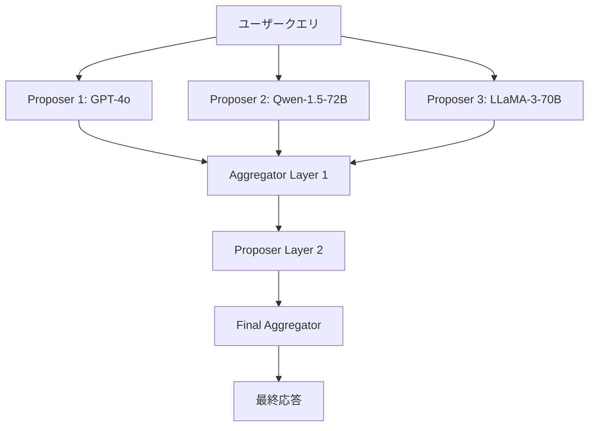

## 論文概要（Abstract）

Mixture-of-Agents（MoA）は、複数のLLMを**層状アーキテクチャ**で組み合わせ、各モデルが他モデルの出力をコンテキストとして参照しながら応答品質を反復的に改善する手法です。Together AIの研究チームにより提案され、**オープンソースモデルのみでGPT-4oを上回る品質**（AlpacaEval 2.0 LC: 65.1% vs 57.5%）を達成しました。マルチLLMルーティングの文脈において、「1つのモデルを選択する」のではなく「全モデルの協調で品質を最大化する」という対極的アプローチを提示しています。

この記事は [Zenn記事: GeminiとClaudeを使い分けるマルチLLMルーティング実装ガイド](https://zenn.dev/0h_n0/articles/ecc929fbeb5871) の深掘りです。

## 情報源

- **arXiv ID**: 2406.04692
- **URL**: [https://arxiv.org/abs/2406.04692](https://arxiv.org/abs/2406.04692)
- **著者**: Junlin Wang, Jue Wang, Ben Cybulski, Tim Liu（Together AI）
- **発表年**: 2024
- **分野**: cs.CL, cs.AI, cs.LG, cs.MA

## 背景と動機（Background & Motivation）

LLMの選択・ルーティング問題には2つのアプローチがあります。1つは**RouteLLM**のように「タスクに最適な1モデルを選択する」ルーティング型、もう1つは本論文のように「全モデルの出力を統合して品質を最大化する」アンサンブル型です。

従来のアンサンブル手法（多数決、ロジット平均等）はトークンレベルで統合するため、テキスト品質向上には限界がありました。MoAは**言語レベルでの統合**、つまり他モデルの回答テキストをそのままコンテキストとして渡すことで、LLMが持つ「他モデルの出力を参照すると品質が上がる」性質（**協調性: Collaborativeness**）を活用します。Zenn記事で解説したLiteLLMルーターが「コスト最適化のためにモデルを選ぶ」のに対し、MoAは「品質最大化のために全モデルを使う」上限を示す手法です。

## 主要な貢献（Key Contributions）

- **協調性の発見と実証**: LLMは弱いモデルの出力であっても、それをコンテキストとして受け取ることで品質が向上する。6モデルファミリーで網羅的に検証
- **MoAアーキテクチャの提案**: Proposer（提案者）とAggregator（集約者）の2役割を層構造で組み合わせ、反復精製する設計パターン
- **オープンソースのみでGPT-4o超え**: AlpacaEval 2.0 LCで65.1%（GPT-4o: 57.5%）、MT-Benchで9.25（GPT-4 Turbo: 8.99）を達成

## 技術的詳細（Technical Details）

### MoAアーキテクチャ

MoAは**2つの役割**と**多層構造**で構成されます。



**Proposer（提案者）**: クエリに対して独立に応答を生成するモデル群。モデルの多様性が品質に直結するため、異なるファミリー（GPT, Claude, Gemini, LLaMA, Qwen）の組み合わせが推奨されます。

**Aggregator（集約者）**: 全Proposerの出力をコンテキストとして受け取り、批判的に評価しつつ統合した応答を生成するモデル。GPT-4oが最も効果的と報告されています。

### 協調性の数学的定式化

Proposer集合を $\mathcal{M} = \{m_1, m_2, \ldots, m_n\}$ とし、クエリ $q$ に対する各Proposerの出力を $r_i = m_i(q)$ とします。Aggregator $a$ の出力は：

$$
r_{\text{final}} = a(q, \{r_1, r_2, \ldots, r_n\})
$$

協調性は以下の不等式で定義されます：

$$
\text{Quality}(a(q, \{r_1, \ldots, r_n\})) > \text{Quality}(a(q))
$$

ここで、
- $\text{Quality}(\cdot)$: 応答品質の評価関数（例: AlpacaEval LC win rate）
- $a(q)$: Aggregator単体の応答
- $a(q, \{r_1, \ldots, r_n\})$: 他モデルの出力を参照した応答

多層構成では、第 $l$ 層の出力が第 $l+1$ 層のProposerへのコンテキストとなります：

$$
r^{(l+1)}_{\text{final}} = a^{(l+1)}\left(q, \left\{m^{(l+1)}_i\left(q, r^{(l)}_{\text{final}}\right)\right\}_{i=1}^{n}\right)
$$

### Aggregatorプロンプトテンプレート

```
You have been provided with a set of responses from various open-source
models to the latest user query. Your task is to synthesize these responses
into a single, high-quality response. It is crucial to critically evaluate
the information provided in these responses, recognizing that some of it
may be biased or incorrect. Your response should not simply replicate the
given responses but should offer a refined, accurate and comprehensive
reply to the instruction.

Responses from models: {responses}
```

このプロンプトにより、Aggregatorは単純な結合ではなく**批判的評価**を経て統合します。

### アルゴリズム

```python
from typing import Protocol
import asyncio

class LLMModel(Protocol):
    async def generate(self, prompt: str, context: str = "") -> str: ...

async def moa_inference(
    query: str,
    proposers: list[LLMModel],
    aggregator: LLMModel,
    n_layers: int = 2,
) -> str:
    """Mixture-of-Agents推論パイプライン

    Args:
        query: ユーザークエリ
        proposers: Proposerモデルのリスト
        aggregator: Aggregatorモデル
        n_layers: 層数（デフォルト2）

    Returns:
        最終的な統合応答
    """
    context = ""
    for layer in range(n_layers):
        # 各Proposerを並列実行（レイテンシ削減）
        tasks = [p.generate(query, context) for p in proposers]
        responses = await asyncio.gather(*tasks)

        # Aggregatorが全応答を統合
        combined = "\n---\n".join(
            f"Model {i+1}: {r}" for i, r in enumerate(responses)
        )
        context = await aggregator.generate(
            f"{AGGREGATOR_PROMPT}\n\nQuery: {query}\n\n{combined}"
        )
    return context
```

## 実装のポイント（Implementation）

**モデル選択のガイドライン**:
1. Proposerは**異なるモデルファミリー**から選択する。同一モデルの複数コピーより、GPT + LLaMA + Qwen等の組み合わせが効果的
2. Aggregatorには**最も高品質なモデル**を配置する。GPT-4oが最も安定的に良い結果を出す
3. MoA-Lite構成（Proposer 3本、1層）から始め、品質が不足すれば層を追加する

**Proposer数と品質の関係**: 品質は対数的に向上し、6本以上で逓減。3本で十分な品質が得られるケースが多い。

**コンテキスト長の制約**: 全Proposerの出力を連結するため、Aggregatorには**長コンテキスト対応モデル**（128K+）が必要。Gemini 2.5 Pro（1Mトークン）やClaude（200K）が適している。

**レイテンシ最適化**: 各層内のProposerは**並列実行**可能。ただし層間は逐次処理のため、レイテンシは層数に比例して増加する。2層構成で実用的なレイテンシを維持できる。

## Production Deployment Guide

### AWS実装パターン（コスト最適化重視）

MoAは複数モデルを同時呼び出しするため、コスト管理が特に重要です。

| 規模 | 月間リクエスト | 推奨構成 | 月額コスト | 主要サービス |
|------|--------------|---------|-----------|------------|
| **Small** | ~3,000 (100/日) | Serverless | $200-500 | Lambda + Bedrock (Claude Haiku × 3 + Sonnet aggregator) |
| **Medium** | ~30,000 (1,000/日) | Hybrid | $1,500-3,000 | ECS Fargate + Bedrock + ElastiCache |
| **Large** | 300,000+ (10,000/日) | Container | $8,000-15,000 | EKS + vLLM + Karpenter + GPU Spot |

**Small構成の詳細** (月額$200-500):
- **Lambda**: 1GB RAM, 120秒タイムアウト（MoAは複数API呼び出しのため長め） ($30/月)
- **Bedrock**: Claude 3.5 Haiku × 3 Proposer + Claude 3.5 Sonnet Aggregator ($350/月)
- **DynamoDB**: キャッシュ用On-Demand ($15/月)
- **Step Functions**: Proposer並列実行のオーケストレーション ($10/月)

**コスト削減テクニック**:
- Prompt Caching有効化でシステムプロンプト部分のコストを30-90%削減
- MoA-Lite構成（Proposer 3本、1層）でフルMoA比60%コスト削減
- Bedrock Batch APIで非リアルタイム処理を50%割引
- 結果キャッシュ（DynamoDB TTL）で同一クエリの再処理を回避

**コスト試算の注意事項**: 上記は2026年2月時点のAWS ap-northeast-1（東京）リージョン料金に基づく概算値です。MoAはProposer数×層数のAPI呼び出しが発生するため、コストはリクエスト数に対してN倍（N=Proposer数×層数）で増加します。最新料金は [AWS料金計算ツール](https://calculator.aws/) で確認してください。

### Terraformインフラコード

**Small構成 (Serverless): Lambda + Step Functions + Bedrock**

```hcl
# --- IAMロール（Bedrock複数モデル呼び出し用） ---
resource "aws_iam_role" "moa_lambda" {
  name = "moa-lambda-role"

  assume_role_policy = jsonencode({
    Version = "2012-10-17"
    Statement = [{
      Action = "sts:AssumeRole"
      Effect = "Allow"
      Principal = { Service = "lambda.amazonaws.com" }
    }]
  })
}

resource "aws_iam_role_policy" "bedrock_multi_model" {
  role = aws_iam_role.moa_lambda.id
  policy = jsonencode({
    Version = "2012-10-17"
    Statement = [{
      Effect = "Allow"
      Action = [
        "bedrock:InvokeModel",
        "bedrock:InvokeModelWithResponseStream"
      ]
      Resource = [
        "arn:aws:bedrock:ap-northeast-1::foundation-model/anthropic.claude-3-5-haiku*",
        "arn:aws:bedrock:ap-northeast-1::foundation-model/anthropic.claude-3-5-sonnet*"
      ]
    }]
  })
}

# --- Lambda（MoA Proposer/Aggregator） ---
resource "aws_lambda_function" "moa_handler" {
  filename      = "moa_lambda.zip"
  function_name = "moa-proposer-aggregator"
  role          = aws_iam_role.moa_lambda.arn
  handler       = "index.handler"
  runtime       = "python3.12"
  timeout       = 120  # MoAは複数API呼び出しのため長タイムアウト
  memory_size   = 1024

  environment {
    variables = {
      PROPOSER_MODELS   = "anthropic.claude-3-5-haiku-20241022-v1:0"
      AGGREGATOR_MODEL  = "anthropic.claude-3-5-sonnet-20241022-v2:0"
      N_PROPOSERS       = "3"
      CACHE_TABLE       = aws_dynamodb_table.moa_cache.name
    }
  }
}

# --- DynamoDB（応答キャッシュ） ---
resource "aws_dynamodb_table" "moa_cache" {
  name         = "moa-response-cache"
  billing_mode = "PAY_PER_REQUEST"
  hash_key     = "query_hash"

  attribute {
    name = "query_hash"
    type = "S"
  }

  ttl {
    attribute_name = "expire_at"
    enabled        = true
  }
}
```

### 運用・監視設定

**CloudWatch Logs Insights クエリ**:
```sql
-- MoA各Proposerの応答時間分析
fields @timestamp, proposer_model, response_time_ms
| stats avg(response_time_ms) as avg_ms,
        pct(response_time_ms, 95) as p95_ms,
        pct(response_time_ms, 99) as p99_ms
  by proposer_model, bin(1h)

-- Aggregatorの品質スコア追跡
fields @timestamp, aggregator_quality_score, n_proposers
| stats avg(aggregator_quality_score) as avg_quality by bin(1d)
```

**コストアラーム（Bedrock使用量監視）**:
```python
import boto3

cloudwatch = boto3.client('cloudwatch')
cloudwatch.put_metric_alarm(
    AlarmName='moa-bedrock-token-spike',
    ComparisonOperator='GreaterThanThreshold',
    EvaluationPeriods=1,
    MetricName='TokenUsage',
    Namespace='Custom/MoA',
    Period=3600,
    Statistic='Sum',
    Threshold=1000000,  # MoAはN倍のトークン消費のため閾値を高めに設定
    AlarmActions=['arn:aws:sns:ap-northeast-1:123456789:cost-alerts'],
    AlarmDescription='MoA Bedrockトークン使用量異常'
)
```

### コスト最適化チェックリスト

**アーキテクチャ選択**:
- [ ] ~100 req/日 → Lambda + Step Functions + Bedrock (Serverless) - $200-500/月
- [ ] ~1000 req/日 → ECS Fargate + Bedrock (Hybrid) - $1,500-3,000/月
- [ ] 10000+ req/日 → EKS + vLLM自前推論 (Container) - $8,000-15,000/月

**MoA固有の最適化**:
- [ ] MoA-Lite構成（Proposer 3本、1層）から開始し品質を検証
- [ ] Proposerにはコスト効率の良いモデル（Haiku/Flash Lite）を使用
- [ ] Aggregatorのみ高品質モデル（Sonnet）を使用
- [ ] Step Functionsで並列実行し、レイテンシを最小化
- [ ] DynamoDB応答キャッシュで同一クエリの再処理を回避

**LLMコスト削減**:
- [ ] Bedrock Prompt Caching有効化（Aggregatorプロンプトは固定部分が大きい）
- [ ] Batch API活用（非リアルタイム処理で50%削減）
- [ ] モデル選択: Proposerに最安モデル、Aggregatorのみ高性能モデル
- [ ] max_tokens設定でProposer出力長を制限（500トークン以下を推奨）

**監視・アラート**:
- [ ] AWS Budgets: MoAはN倍コストのため予算設定を通常の3-5倍に
- [ ] CloudWatch: Proposer別の応答時間とトークン使用量を個別監視
- [ ] Cost Anomaly Detection: MoA特有のバースト使用パターンに対応
- [ ] 日次コストレポート: Proposerモデル別のコスト内訳を確認

## 実験結果（Results）

### AlpacaEval 2.0 LC Win Rate

| モデル | LC Win Rate (%) | 相対コスト |
|-------|-----------------|-----------|
| GPT-4o（単体） | 57.5 | 1.0x |
| Claude 3 Opus（単体） | 40.5 | 1.0x |
| Gemini 1.5 Pro（単体） | 45.4 | 1.0x |
| **MoA-Lite（3モデル、1層）** | **55.5** | **3.0x** |
| **MoA（7モデル、多層）** | **65.1** | **~20x** |

### MT-Bench

| モデル | スコア |
|-------|--------|
| GPT-4 Turbo | 8.99 |
| GPT-4o | 9.06 |
| Claude 3 Opus | 9.00 |
| **MoA** | **9.25** |

**分析**: MoAはオープンソースモデルの組み合わせのみで、当時の最強商用モデルGPT-4oを上回りました。特にMT-Benchの8カテゴリ（Writing, Reasoning, Math, Coding等）すべてで安定した改善を示しています。コスト増加は避けられませんが、**品質の上限を定義する手法**として、ルーティング最適化の目標値設定に活用できます。

## 実運用への応用（Practical Applications）

Zenn記事で解説したマルチLLMルーティングとMoAは**相互補完的**に使えます。

**ハイブリッド構成**: 通常リクエストはRouteLLM/LiteLLMでコスト最適化ルーティングを行い、**高品質が必要なリクエストのみMoAにエスカレート**するカスケード設計が効果的です。

```python
async def hybrid_routing(query: str, quality_threshold: float = 0.8) -> str:
    """RouteLLM + MoAのハイブリッド構成"""
    # Phase 1: RouteLLMで通常ルーティング
    response = await routellm_route(query)
    quality = await evaluate_quality(response)

    if quality >= quality_threshold:
        return response  # 通常品質で十分

    # Phase 2: 高品質が必要な場合のみMoAにエスカレート
    return await moa_inference(query, proposers, aggregator)
```

**実運用での課題**:
- レイテンシ: MoA-Lite（1層3モデル）でも単一モデルの3倍以上
- コスト: Proposer数×層数倍のAPI呼び出し
- コンテキスト長: Aggregatorに全出力を渡すため128K+が必要

## 関連研究（Related Work）

- **RouteLLM** (Ong et al., 2024): 強弱2モデルの選択を学習する手法。MoAとは「選択 vs 統合」で対照的
- **Self-Consistency** (Wang et al., 2022): 同一モデルの複数回答から多数決。MoAは異なるモデルを使う点が異なる
- **LLM-Blender** (Jiang et al., 2023): ペアワイズランキングで最良応答を選択+生成的融合。MoAは層構造による反復精製が特徴

## まとめと今後の展望

Mixture-of-Agentsは、複数LLMの協調性を活用して**単体モデルの品質上限を超える**手法です。コストは増大しますが、品質最大化の上限値を示すベースラインとして重要です。Zenn記事のLiteLLM/RouteLLMルーティングと組み合わせたハイブリッド構成により、**コスト効率と品質のバランスを柔軟に制御**できます。今後はAdaptive MoA（クエリ難易度に応じてProposer数を動的に変える）やMoA-Routerの統合が研究方向として期待されます。

## 参考文献

- **arXiv**: [https://arxiv.org/abs/2406.04692](https://arxiv.org/abs/2406.04692)
- **Code**: [https://github.com/togethercomputer/MoA](https://github.com/togethercomputer/MoA)
- **Related Zenn article**: [https://zenn.dev/0h_n0/articles/ecc929fbeb5871](https://zenn.dev/0h_n0/articles/ecc929fbeb5871)
