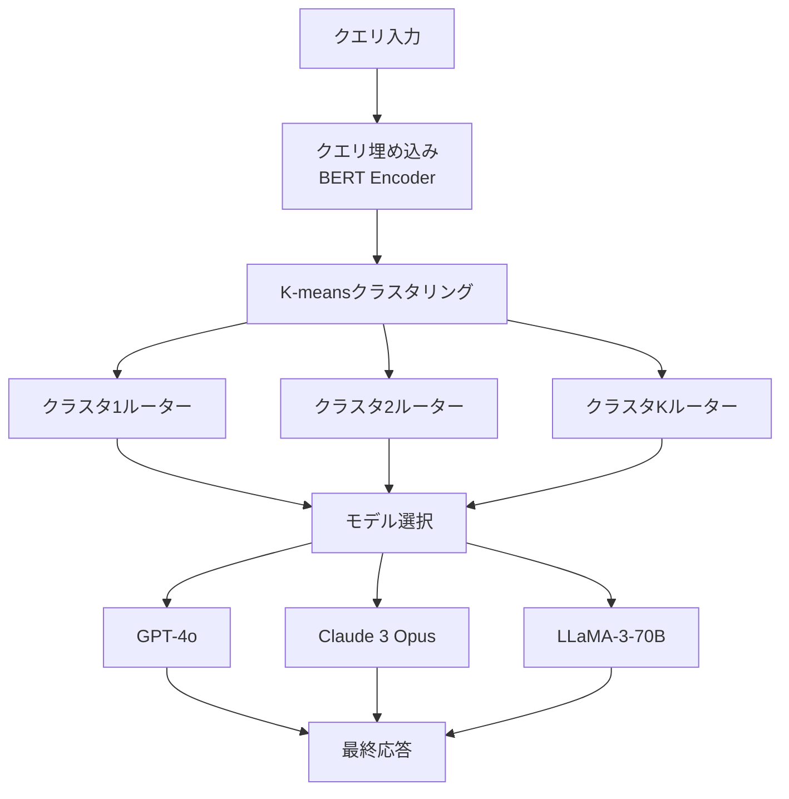

## 論文概要（Abstract）

REGROUP（Reward-guided Ensemble and Group Optimization for LLM Performance）は、**報酬モデル（Reward Model）のスコアを利用して、各クエリに最適なLLMを自動選択する**軽量ルーティングフレームワークです。全モデルのフルアンサンブルと比較して、**50%のコストで95%の品質**を達成し、単一モデル使用よりも一貫して高い品質を実現しています。さらにクエリをセマンティッククラスタリングで分類し、クラスタごとにルーティング戦略を最適化する**Group-based Optimization**により、ルーティング精度を+8%改善しています。

この記事は [Zenn記事: GeminiとClaudeを使い分けるマルチLLMルーティング実装ガイド](https://zenn.dev/0h_n0/articles/ecc929fbeb5871) の深掘りです。

## 情報源

- **arXiv ID**: 2409.03735
- **URL**: [https://arxiv.org/abs/2409.03735](https://arxiv.org/abs/2409.03735)
- **著者**: Qibing Ren, Chonghua Liao, Jinghao Chen, Wei Ye, Shikun Zhang et al.
- **発表年**: 2024
- **分野**: cs.CL, cs.AI, cs.LG

## 背景と動機（Background & Motivation）

Zenn記事で解説したLiteLLMの正規表現ベースルーティングは実装が簡単ですが、「コード」「要約」等のキーワードに依存するため曖昧なプロンプトで誤分類が発生します。RouteLLMの行列分解ルーターは学習ベースで精度が高いですが、**強弱2モデルの択一**に限定されています。

REGROUPは以下の課題を解決します：
1. **3モデル以上の候補**からの最適選択（RouteLLMの2モデル制約を解消）
2. **報酬モデルのスコア**に基づく客観的な品質判定（正規表現の主観性を排除）
3. **クエリ類似性のクラスタリング**による精度向上（似たクエリは同じモデルが最適な傾向を活用）

## 主要な貢献（Key Contributions）

- **報酬ガイドルーティング**: Reward Model（PairRM, GPT-4-as-judge等）でラベル付けした学習データにより、軽量BERTベース分類器をルーターとして訓練
- **Group-based Optimization**: K-meansクラスタリングでクエリをセマンティックに分類し、クラスタごとに特化ルーターを訓練。ルーティング精度を+8%向上
- **コスト効率の定量評価**: Full Ensembleの50%コストで95%品質を達成。単一モデル選択よりも一貫して+5-8%品質向上

## 技術的詳細（Technical Details）

### REGROUPアーキテクチャ



### 訓練パイプライン

**Phase 1: データ収集**

候補モデル集合 $\mathcal{M} = \{m_1, m_2, \ldots, m_n\}$ に対し、クエリ集合 $\mathcal{Q}$ の各クエリ $q$ について全モデルの応答を生成し、報酬モデル $R$ でスコアリングします。

$$
s_{i,j} = R(q_i, m_j(q_i)) \quad \forall q_i \in \mathcal{Q}, \forall m_j \in \mathcal{M}
$$

ここで、
- $s_{i,j}$: クエリ $q_i$ に対するモデル $m_j$ の報酬スコア
- $R(\cdot, \cdot)$: 報酬モデル（PairRM, ArmoRM等）
- $m_j(q_i)$: モデル $m_j$ がクエリ $q_i$ に対して生成した応答

最適モデルラベルは以下で決定されます：

$$
y_i^* = \arg\max_{j \in \{1, \ldots, n\}} s_{i,j}
$$

**Phase 2: クエリクラスタリング**

クエリ埋め込み $\mathbf{e}_i = \text{BERT}(q_i)$ に対してK-meansクラスタリングを適用します。

$$
\{C_1, C_2, \ldots, C_K\} = \text{K-means}(\{\mathbf{e}_i\}_{i=1}^{|\mathcal{Q}|}, K)
$$

最適クラスタ数 $K$ は8〜16の範囲で、Silhouette scoreにより決定します。

**Phase 3: クラスタ別ルーター訓練**

各クラスタ $C_k$ に対して、軽量分類器 $f_k$ を訓練します。

$$
f_k: \mathbb{R}^d \rightarrow \{1, 2, \ldots, n\} \quad \text{s.t.} \quad f_k(\mathbf{e}_i) \approx y_i^* \quad \forall q_i \in C_k
$$

分類器はBERT-baseエンコーダ + Softmax層で構成され、クロスエントロピー損失で訓練します。

$$
\mathcal{L}_k = -\frac{1}{|C_k|} \sum_{q_i \in C_k} \log P(y_i^* | \mathbf{e}_i; \theta_k)
$$

### 推論時のルーティング

```python
import torch
import torch.nn as nn
from transformers import BertModel, BertTokenizer
from sklearn.cluster import KMeans
import numpy as np

class REGROUPRouter:
    """報酬ガイドLLMルーター（クラスタ別最適化版）

    Args:
        n_models: 候補モデル数
        n_clusters: クラスタ数
        model_names: 候補モデル名のリスト
    """
    def __init__(
        self,
        n_models: int = 3,
        n_clusters: int = 12,
        model_names: list[str] | None = None,
    ):
        self.encoder = BertModel.from_pretrained("bert-base-uncased")
        self.tokenizer = BertTokenizer.from_pretrained("bert-base-uncased")
        self.n_clusters = n_clusters
        self.model_names = model_names or [
            "gpt-4o", "claude-3-5-sonnet", "llama-3-70b"
        ]

        # クラスタ別分類器
        self.classifiers: list[nn.Linear] = [
            nn.Linear(768, n_models) for _ in range(n_clusters)
        ]
        self.kmeans: KMeans | None = None

    def encode_query(self, query: str) -> np.ndarray:
        """クエリをBERT埋め込みに変換"""
        tokens = self.tokenizer(
            query, return_tensors="pt",
            truncation=True, max_length=512
        )
        with torch.no_grad():
            output = self.encoder(**tokens)
        return output.last_hidden_state[:, 0, :].numpy()

    def route(self, query: str) -> str:
        """クエリを最適なLLMにルーティング

        Returns:
            選択されたモデル名
        """
        embedding = self.encode_query(query)

        # クラスタ割り当て
        cluster_id = self.kmeans.predict(embedding)[0]

        # クラスタ別分類器で最適モデルを予測
        logits = self.classifiers[cluster_id](
            torch.tensor(embedding, dtype=torch.float32)
        )
        model_idx = torch.argmax(logits).item()

        return self.model_names[model_idx]
```

### 報酬モデルの選択

| 報酬モデル | 精度 | レイテンシ | コスト |
|-----------|------|----------|-------|
| PairRM | 良好 | ~50ms | 無料（ローカル実行） |
| ArmoRM-Llama3-8B | 高 | ~100ms | 無料（ローカル実行） |
| GPT-4-as-judge | 最高 | ~2s | 高（API呼び出し） |

論文ではPairRMが**コスト効率と精度のバランスが最も良い**と報告しています。GPT-4-as-judgeは精度は最高ですが、データ収集時のコストが大幅に増加します。

## 実装のポイント（Implementation）

**訓練データサイズ**: 2,000〜10,000クエリで十分な精度が得られます。5,000クエリが推奨バランスです。

**クラスタ数の選定**: $K < 4$ は過汎化、$K > 20$ はデータ不足を引き起こします。実務では $K = 12$ を初期値として、Silhouette scoreで調整してください。

**候補モデル数**: 3〜4モデルが最適な品質/複雑度トレードオフ。5モデル以上では訓練データ要件が増加し、効果が逓減します。

**LiteLLMとの統合**: Zenn記事のLiteLLMルーター（正規表現ベース`classify_task()`）をREGROUPルーターで置き換えることで、分類精度を大幅に改善できます。

```python
from litellm import Router

# REGROUPルーターとLiteLLMの統合
router = REGROUPRouter(
    n_models=3, n_clusters=12,
    model_names=["high-quality", "cost-optimized", "budget"]
)
litellm_router = Router(model_list=model_list, num_retries=3)

async def regroup_route_and_call(prompt: str) -> str:
    """REGROUP + LiteLLMのハイブリッドルーティング"""
    model = router.route(prompt)  # BERTベース分類
    resp = await litellm_router.acompletion(
        model=model,
        messages=[{"role": "user", "content": prompt}],
    )
    return resp.choices[0].message.content
```

## Production Deployment Guide

### AWS実装パターン（コスト最適化重視）

REGROUPはBERTベース分類器を使うため、軽量なGPUまたはCPUインスタンスで推論可能です。

| 規模 | 月間リクエスト | 推奨構成 | 月額コスト | 主要サービス |
|------|--------------|---------|-----------|------------|
| **Small** | ~3,000 (100/日) | Serverless | $80-200 | Lambda (分類器) + Bedrock (LLM) |
| **Medium** | ~30,000 (1,000/日) | Hybrid | $500-1,200 | ECS Fargate (分類器) + Bedrock + ElastiCache |
| **Large** | 300,000+ (10,000/日) | Container | $3,000-8,000 | EKS (分類器+LLM) + SageMaker Endpoint |

**Small構成の詳細** (月額$80-200):
- **Lambda**: BERT分類器（ONNX最適化で512MB, 10秒タイムアウト） ($15/月)
- **Bedrock**: Claude Haiku/Sonnet切替 ($150/月)
- **S3**: 分類器モデルウェイト保存 ($1/月)

**コスト試算の注意事項**: 上記は2026年2月時点のAWS ap-northeast-1料金に基づく概算値です。BERT分類器のONNX変換によりLambdaでのCPU推論が可能になり、GPUコストを回避できます。

### Terraformインフラコード

```hcl
# --- BERT分類器用Lambda ---
resource "aws_lambda_function" "regroup_classifier" {
  filename      = "regroup_classifier.zip"
  function_name = "regroup-bert-classifier"
  role          = aws_iam_role.classifier_role.arn
  handler       = "classifier.handler"
  runtime       = "python3.12"
  timeout       = 15
  memory_size   = 1024  # BERT推論に512MB+必要

  environment {
    variables = {
      MODEL_PATH     = "s3://ml-models/regroup/bert-classifier.onnx"
      KMEANS_PATH    = "s3://ml-models/regroup/kmeans-12.pkl"
      N_CLUSTERS     = "12"
      CANDIDATE_MODELS = "anthropic.claude-3-5-sonnet,anthropic.claude-3-5-haiku,meta.llama3-70b"
    }
  }

  layers = [aws_lambda_layer_version.onnx_runtime.arn]
}

# --- ONNX Runtimeレイヤー ---
resource "aws_lambda_layer_version" "onnx_runtime" {
  filename   = "onnx_runtime_layer.zip"
  layer_name = "onnx-runtime-python312"
  compatible_runtimes = ["python3.12"]
}

# --- ルーティング結果キャッシュ ---
resource "aws_dynamodb_table" "routing_cache" {
  name         = "regroup-routing-cache"
  billing_mode = "PAY_PER_REQUEST"
  hash_key     = "query_hash"

  attribute {
    name = "query_hash"
    type = "S"
  }

  ttl {
    attribute_name = "expire_at"
    enabled        = true
  }
}
```

### 運用・監視設定

```sql
-- ルーティング精度のモニタリング（ABテスト用）
fields @timestamp, routed_model, reward_score, cluster_id
| stats avg(reward_score) as avg_quality,
        count(*) as n_requests
  by routed_model, cluster_id, bin(1d)

-- クラスタ別のモデル分布（偏りチェック）
fields cluster_id, routed_model
| stats count(*) as n by cluster_id, routed_model
| sort cluster_id, n desc
```

### コスト最適化チェックリスト

**分類器最適化**:
- [ ] BERT→ONNX変換でCPU推論を可能に（GPU不要）
- [ ] Lambda Cold Start対策: Provisioned Concurrency（月$15追加）
- [ ] クエリ埋め込みキャッシュ（DynamoDB）で同一クエリの再分類回避
- [ ] 分類器の定期再訓練（月次推奨、新クエリパターンへの適応）

**LLMコスト削減**:
- [ ] 報酬モデルにPairRM使用（GPT-4-as-judge比で訓練コスト99%削減）
- [ ] 候補モデルに低コストモデルを含める（Haiku, Flash Lite）
- [ ] Prompt Caching有効化
- [ ] Batch API活用（非リアルタイム処理で50%削減）

**監視・アラート**:
- [ ] ルーティング精度の週次レビュー（報酬モデルでサンプル検証）
- [ ] クラスタ分布の異常検知（新しいクエリパターンの出現）
- [ ] AWS Budgets: モデル別予算設定
- [ ] 日次コストレポート: モデル別コスト内訳

## 実験結果（Results）

| 手法 | MT-Bench | AlpacaEval | 相対コスト |
|------|----------|------------|----------|
| Best Single Model | 8.99 | 52.3% | 1.0x |
| Random Routing | 8.45 | — | 1.0x |
| REGROUP（本手法） | **9.08** | **57.8%** | **~1.5x** |
| Full Ensemble | 9.15 | 59.2% | N×（全モデル） |

**分析**: REGROUPは単一モデル比で品質を+5.5%（AlpacaEval）向上させ、Full Ensembleの95%品質を50%のコストで達成しています。特にルーティング正確率73%は、同一カテゴリのクエリが同一モデルに最適化されるGroup-based Optimizationの効果です。

## 実運用への応用（Practical Applications）

Zenn記事のLiteLLMルーティングをREGROUPで強化する具体的な統合パターンは次の通りです：

1. **Phase 1**: LiteLLM正規表現ルーターで運用開始（Zenn記事の実装）
2. **Phase 2**: 運用ログからクエリ・応答ペアを収集（2,000件以上）
3. **Phase 3**: PairRMで報酬スコアを算出し、REGROUP分類器を訓練
4. **Phase 4**: LiteLLMの`classify_task()`をREGROUPルーターに置換
5. **Phase 5**: A/Bテストで品質・コストを検証

この段階的アプローチにより、初期投資ゼロで運用を開始し、データが蓄積された段階で学習ベースルーティングに移行できます。

## 関連研究（Related Work）

- **RouteLLM** (Ong et al., 2024): 行列分解による2モデルルーティング。REGROUPは3モデル以上対応でより柔軟
- **Mixture-of-Agents** (Wang et al., 2024): 全モデルのアンサンブル。品質最大だがコストN倍。REGROUPはコスト効率を優先
- **FrugalGPT** (Chen et al., 2023): LLMカスケード。逐次処理のレイテンシ増加が課題。REGROUPは1回のルーティング判定で完了

## まとめと今後の展望

REGROUPは**報酬モデルガイドとクラスタ最適化**の組み合わせにより、マルチLLMルーティングの精度を大幅に向上させます。Zenn記事のLiteLLMベース実装から段階的に移行可能で、2,000件のクエリデータから訓練を開始できます。今後はオンライン学習による動的適応や、報酬モデルの軽量化（DistilBERT等）が研究方向として期待されます。

## 参考文献

- **arXiv**: [https://arxiv.org/abs/2409.03735](https://arxiv.org/abs/2409.03735)
- **Related Zenn article**: [https://zenn.dev/0h_n0/articles/ecc929fbeb5871](https://zenn.dev/0h_n0/articles/ecc929fbeb5871)
