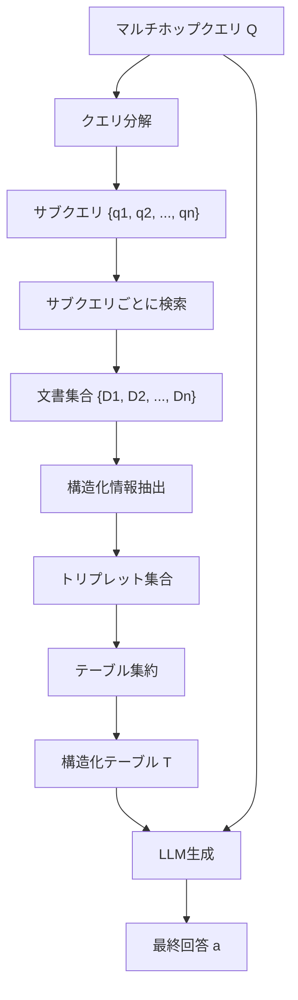

## 論文概要（Abstract）

SRAG（Structured Retrieval-Augmented Generation）は、マルチホップ質問応答（複数の文書から情報を統合して回答する必要がある質問）に特化したRAGフレームワークである。従来のRAGは単一文書からの情報抽出に強いが、「Pythonの作者の母親はいつ生まれた？」のような2段階以上の推論が必要な質問には弱い。SRAGは複雑なクエリをサブクエリに分解し、各文書からテキストトリプレット（主語、述語、目的語）を構造化抽出し、テーブル形式に集約することで、追加の学習なしにマルチホップQAの精度を向上させる。MuSiQue、HotpotQA、2WikiMultihopQAの3ベンチマークで、標準RAGとIRCoTを上回る結果を達成した。

この記事は [Zenn記事: LangGraph Agentic RAGで社内検索の回答精度を大幅改善する実装手法](https://zenn.dev/0h_n0/articles/4c869d366e5200) の深掘りです。

## 情報源

- **arXiv ID**: 2412.04235
- **URL**: [https://arxiv.org/abs/2412.04235](https://arxiv.org/abs/2412.04235)
- **著者**: Torsten Zesch, Sherzod Hakimov
- **発表年**: 2024
- **分野**: cs.CL, cs.IR

## 背景と動機（Background & Motivation）

標準的なRAGシステムは、ユーザーの質問に対してtop-k文書を取得し、それらをそのままLLMのコンテキストに入れて回答を生成する。この方式はシングルホップ（1つの文書で完結する）質問には有効だが、マルチホップ質問では以下の問題が生じる：

1. **情報の分散**: 回答に必要な情報が複数の文書に散在しており、単純な文書連結では推論が困難
2. **ノイズの蓄積**: top-k文書にはマルチホップ推論の全ステップに関連しない情報が多く含まれる
3. **推論チェーンの欠如**: LLMが中間ステップを明示せずにいきなり最終回答を生成しようとし、エラーが増加

SRAGは構造化中間表現（テキストトリプレット→テーブル）を導入することで、LLMが段階的に情報を参照し推論できる環境を提供する。

## 主要な貢献（Key Contributions）

- **貢献1**: 複雑なマルチホップクエリをサブクエリに自動分解する手法（T5ベースの分解モデル）
- **貢献2**: 検索文書からテキストトリプレット（主語, 述語, 目的語）を構造化抽出し、テーブルに集約する情報整理手法
- **貢献3**: 追加の学習（end-to-endファインチューニング）なしに標準RAGを上回る性能を達成

## 技術的詳細（Technical Details）

### SRAGパイプライン全体像



### Step 1: クエリ分解（Query Decomposition）

マルチホップクエリ$Q$を$n$個のサブクエリに分解する。ファインチューニングしたT5モデルを使用する。

$$
Q \xrightarrow{f_{\text{decompose}}} \{q_1, q_2, \ldots, q_n\}
$$

**具体例**:
- 入力: 「Pythonの作者が生まれた国の首都は何？」
- 分解結果:
  - $q_1$: 「Pythonの作者は誰？」
  - $q_2$: 「[Answer of $q_1$]が生まれた国は？」
  - $q_3$: 「[Answer of $q_2$]の首都は？」

分解時に前のサブクエリの回答を参照する**依存関係付き分解**を行う点が特徴的である。

### Step 2: 構造化情報抽出（Structured Information Extraction）

各サブクエリ$q_i$で検索された文書$D_i$から、テキストトリプレットを抽出する：

$$
\text{extract}(d) = \{(s_j, p_j, o_j)\}_{j=1}^{m}
$$

ここで、
- $s_j$: 主語（Subject）— 例: 「Guido van Rossum」
- $p_j$: 述語（Predicate）— 例: 「が生まれた国」
- $o_j$: 目的語（Object）— 例: 「オランダ」

ファインチューニングした情報抽出モデルを使用し、クエリとの関連性スコアが閾値以下のトリプレットは除去する。

### Step 3: テーブル集約（Table Aggregation）

抽出されたトリプレットをテーブル形式に整理する：

| Subject | Predicate | Object | Source |
|---------|-----------|--------|--------|
| Python | 作者 | Guido van Rossum | Doc_1 |
| Guido van Rossum | 生まれた国 | オランダ | Doc_2 |
| オランダ | 首都 | アムステルダム | Doc_3 |

このテーブルにより、LLMは：
- **直接参照**で中間回答を取得可能
- **クロスリファレンス**で異なる文書の情報を関連付け可能
- **推論過程の透明性**を確保可能

### Step 4: 回答生成

構造化テーブル$T$と元のクエリ$Q$をLLM（GPT-4 or Llama）に渡して最終回答を生成する。

```python
from typing import TypedDict

class SRAGState(TypedDict):
    question: str
    sub_queries: list[str]
    documents: dict[str, list[str]]
    triplets: list[dict]
    table: str
    generation: str

def decompose_query(state: SRAGState) -> dict:
    """マルチホップクエリをサブクエリに分解

    Args:
        state: 現在のグラフ状態

    Returns:
        サブクエリのリスト
    """
    sub_queries = decomposer.invoke(state["question"])
    return {"sub_queries": sub_queries}

def retrieve_per_subquery(state: SRAGState) -> dict:
    """各サブクエリに対して個別に検索

    Args:
        state: 現在のグラフ状態

    Returns:
        サブクエリごとの検索結果辞書
    """
    docs = {}
    for sq in state["sub_queries"]:
        results = retriever.invoke(sq)
        docs[sq] = [r.page_content for r in results]
    return {"documents": docs}

def extract_triplets(state: SRAGState) -> dict:
    """検索文書からトリプレットを抽出"""
    triplets = []
    for sq, docs in state["documents"].items():
        for doc in docs:
            extracted = extractor.invoke(
                f"以下の文書からトリプレット（主語, 述語, 目的語）を抽出:\n"
                f"クエリ: {sq}\n文書: {doc}"
            )
            triplets.extend(extracted)
    return {"triplets": triplets}

def aggregate_to_table(state: SRAGState) -> dict:
    """トリプレットをテーブル形式に集約"""
    header = "| Subject | Predicate | Object |"
    separator = "|---------|-----------|--------|"
    rows = [
        f"| {t['subject']} | {t['predicate']} | {t['object']} |"
        for t in state["triplets"]
    ]
    table = "\n".join([header, separator] + rows)
    return {"table": table}

def generate_answer(state: SRAGState) -> dict:
    """構造化テーブルに基づいて最終回答を生成"""
    result = llm.invoke(
        f"以下の構造化テーブルを参照して質問に回答してください。\n"
        f"テーブルにない情報は推測しないでください。\n\n"
        f"テーブル:\n{state['table']}\n\n"
        f"質問: {state['question']}"
    )
    return {"generation": result.content}
```

### LangGraphとの統合

SRAGのパイプラインはLangGraphのStateGraphで以下のように実装できる：

```python
from langgraph.graph import StateGraph, START, END

workflow = StateGraph(SRAGState)
workflow.add_node("decompose", decompose_query)
workflow.add_node("retrieve", retrieve_per_subquery)
workflow.add_node("extract", extract_triplets)
workflow.add_node("aggregate", aggregate_to_table)
workflow.add_node("generate", generate_answer)

workflow.add_edge(START, "decompose")
workflow.add_edge("decompose", "retrieve")
workflow.add_edge("retrieve", "extract")
workflow.add_edge("extract", "aggregate")
workflow.add_edge("aggregate", "generate")
workflow.add_edge("generate", END)

app = workflow.compile()
```

Zenn記事のAgentic RAGにSRAGの分解ノードを追加することで、マルチホップ質問への対応力を強化できる。

## 実装のポイント（Implementation）

### Agentic RAGとの組み合わせ

SRAGのクエリ分解をZenn記事のAgentic RAGパイプラインに統合する場合、Router Agentがマルチホップ質問を検出したらSRAGパスに分岐させる設計が実用的である：

```python
def route_query(state: GraphState) -> str:
    """シングルホップかマルチホップかで分岐"""
    is_multihop = llm.invoke(
        f"この質問は複数のステップの推論が必要か？ yes/no\n"
        f"質問: {state['question']}"
    )
    return "srag" if "yes" in is_multihop.lower() else "standard_rag"
```

### 注意すべき点

1. **分解モデルの品質**: T5ベースの分解モデルはファインチューニングが必要。ゼロショットではLLMプロンプティングで代替可能だが精度は低下
2. **トリプレット抽出のコスト**: 文書ごとにLLM呼び出しが発生するため、大量文書ではコストが増加
3. **依存関係の解決**: $q_2$が$q_1$の回答に依存する場合、逐次実行が必要で並列化が困難
4. **4ホップ以上の劣化**: 論文で指摘されているように、推論ステップが4以上になると精度が低下する

## 実験結果（Results）

### 主要ベンチマーク結果

| 手法 | MuSiQue F1 | HotpotQA F1 | 2WikiMultihopQA F1 |
|------|------------|-------------|---------------------|
| Standard RAG | 0.312 | 0.518 | 0.541 |
| IRCoT | 0.389 | 0.573 | 0.612 |
| **SRAG** | **0.421** | **0.591** | **0.638** |

SRAGはStandard RAGに対して+35%（MuSiQue）、IRCoTに対して+8%（MuSiQue）の改善を達成している。特にMuSiQueのように2-4文書の統合が必要なタスクでの改善が顕著である。

### Ablation Study

各コンポーネントの寄与を分析した結果：

| 構成 | MuSiQue F1 | 低下幅 |
|------|------------|--------|
| SRAG（完全版） | 0.421 | - |
| 分解なし | 0.337 | **-8.4%** |
| 構造化抽出なし | 0.372 | -4.9% |
| テーブル集約なし | 0.393 | -2.8% |

クエリ分解の寄与が最も大きく（-8.4%）、マルチホップ質問を適切にサブ問題に分解することが性能の鍵であることがわかる。

### 推論ホップ数別の分析

| ホップ数 | Standard RAG | SRAG | 改善率 |
|---------|-------------|------|--------|
| 2-hop | 0.45 | 0.56 | +24% |
| 3-hop | 0.28 | 0.39 | +39% |
| 4-hop | 0.18 | 0.24 | +33% |

3ホップの質問で最大の改善（+39%）が見られ、中程度の複雑さの質問に最も効果的である。4ホップ以上では改善率が低下し、精度自体も低い。

## 実運用への応用（Practical Applications）

### 社内検索でのマルチホップ活用

社内検索では以下のようなマルチホップ質問が頻繁に発生する：

- 「プロジェクトAのリーダーが所属する部門の部門長は誰？」（2ホップ）
- 「先月のインシデントで使われたサービスのオーナーチームの連絡先は？」（3ホップ）

SRAGのサブクエリ分解をZenn記事のAgentic RAGに組み込むことで、これらの質問にも対応可能になる。

### スケーリング戦略

- サブクエリが独立している場合は並列検索で高速化
- トリプレット抽出はバッチ処理で効率化
- テーブルキャッシュにより同一エンティティへの再抽出を回避

## 関連研究（Related Work）

- **IRCoT**（Trivedi et al., 2022）: 推論と検索を交互に実行するChain-of-Thoughtベースのマルチホップ手法。SRAGとの違いは、IRCoTがCoT推論で中間ステップを管理するのに対し、SRAGは構造化テーブルで情報を明示的に管理する点
- **Self-Ask**（Press et al., 2022）: LLMが自己質問で質問を分解するアプローチ。SRAGの分解ステップに相当するが、SRAGは専用の分解モデルを使用
- **FLARE**（Jiang et al., 2023）: 次文生成時の低信頼度で検索を発火させるアクティブ検索手法。SRAGとは相補的で、組み合わせ可能
- **CRAG**（Yan et al., 2024）: 検索品質の自動評価と補正。SRAGの前段に配置してパイプラインの頑健性を向上可能

## まとめと今後の展望

SRAGの主要な成果は、**構造化中間表現**（トリプレット→テーブル）の導入により、追加学習なしにマルチホップQAの精度を大幅に改善した点にある。

実務への示唆として、Zenn記事のLangGraph Agentic RAGにSRAGのクエリ分解ノードを追加することで、社内検索の対応可能な質問の範囲を拡大できる。ただし、4ホップ以上の質問では依然として精度が低く、複雑すぎる質問はユーザーに分解を促すUX設計も併せて検討すべきである。

今後の研究方向としては、分解モデルのゼロショット汎化、トリプレット抽出の効率化（LLM呼び出し回数の削減）、動的なホップ数推定が挙げられる。

## 参考文献

- **arXiv**: [https://arxiv.org/abs/2412.04235](https://arxiv.org/abs/2412.04235)
- **Related Zenn article**: [https://zenn.dev/0h_n0/articles/4c869d366e5200](https://zenn.dev/0h_n0/articles/4c869d366e5200)
