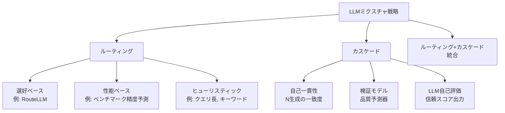

## 論文概要（Abstract）

LLMデプロイメントは単一モデルから複数モデルの混合利用へ移行しつつある。本サーベイは、その中でもルーティング（軽量モデルがクエリに最適なLLMを選択）とカスケード（信頼度の高い回答が得られるまでモデルを順次呼び出し）の2つの戦略を体系的にレビューする。各戦略の長所・短所、コスト効率分析、障害モード分析、そして可用性最適化 vs 品質最適化の観点からの使い分け基準を提示する。

この記事は [Zenn記事: LLMフォールバックチェーン設計：3層パターンで高可用性を実現する](https://zenn.dev/0h_n0/articles/f5ba83634a4a9f) の深掘りです。

## 情報源

- **arXiv ID**: 2503.04625
- **URL**: [https://arxiv.org/abs/2503.04625](https://arxiv.org/abs/2503.04625)
- **著者**: Maxime Larocque, Thiago Melo, Maria Puertas Calvo
- **発表年**: 2025
- **分野**: cs.LG, cs.AI, cs.CL

## 背景と動機（Background & Motivation）

LLMの本番デプロイメントには根本的なジレンマがある。最も高性能なモデルは最もコストが高く遅い一方、安価で高速なモデルは多くのクエリで十分な品質を提供できる。このジレンマに対し、複数モデルを戦略的に使い分ける「LLMミクスチャ」が注目されている。

Zenn記事では**フォールバックチェーン**として、障害発生時にプロバイダを順次切り替える設計を紹介した。本論文はこの問題をより一般的に扱い、障害対応（可用性最適化）だけでなく、コスト・品質のトレードオフ最適化（品質最適化）の観点からも分析する。

重要な区別: **ルーティング**はクエリごとに事前にモデルを選択するため、1回のルーター推論+1回のLLM推論で完了する。**カスケード**はモデルを順次呼び出し、信頼度が閾値を超えた時点で停止するため、最悪ケースでは全モデルを呼び出す。この違いがレイテンシ・コスト・可用性に直結する。

## 主要な貢献（Key Contributions）

- **ルーティング手法の分類体系**: 訓練信号（選好ベース/性能ベース/ヒューリスティック）× ルーティング対象（バイナリ/マルチモデル/動的アンサンブル）の2次元分類
- **カスケードのコスト効率分析**: エスカレーション率と期待コストの定量的関係式を導出
- **可用性ルーティング vs 品質ルーティングの明示的区別**: 学術研究の大半が品質最適化に偏る中、本番運用で支配的な可用性ルーティングの重要性を指摘
- **ルーティング+カスケード+サーキットブレーカー統合の推奨**: 3戦略の組み合わせが最良の実用構成であることを実例に基づき示す

## 技術的詳細（Technical Details）

### ルーティング手法の分類

**訓練信号による分類**:

| 手法 | 代表例 | 訓練データ | ルーティング精度 | 実装コスト |
|------|--------|-----------|----------------|-----------|
| 選好ベース | RouteLLM | Chatbot Arena人間選好 | 高 | 中（選好データ収集） |
| 性能ベース | ベンチマーク精度予測 | タスクベンチマークスコア | 中-高 | 高（ベンチマーク実行） |
| ヒューリスティック | ルールベース | 不要 | 中 | 低（ルール定義のみ） |

**本論文の推奨**: まずヒューリスティックルーティングから始める。クエリ長、キーワードフラグ、ユーザーティアなどの単純なルールで、訓練済みルーターの**70-80%の価値を5%のコスト**で得られる。

### カスケードのコスト効率分析

2モデルカスケード（弱モデル→強モデル）の期待コストは以下の式で表される。

$$
\mathbb{E}[\text{cost}] = c_w + P(\text{not confident}) \times c_s
$$

ここで、$c_w$は弱モデルのコスト、$c_s$は強モデルのコスト、$P(\text{not confident})$はエスカレーション確率である。

カスケードがコスト効率的になる条件は:

$$
P(\text{not confident}) \times c_s < c_s - c_w
$$

すなわち:

$$
P(\text{not confident}) < 1 - \frac{c_w}{c_s}
$$

**具体例**: Claude Haiku 4.5 ($c_w = \$0.25/\text{MTok}$) → Claude Sonnet 4.6 ($c_s = \$3/\text{MTok}$) のカスケードの場合:

$$
P(\text{not confident}) < 1 - \frac{0.25}{3} = 0.917
$$

エスカレーション率が91.7%未満であれば、常にSonnetを使うよりカスケードの方が安い。しかし実用上、エスカレーション率が**60-70%を超えると**弱モデルのサイジングを見直すべきと論文は推奨している。

### 信頼スコア推定の3手法

カスケードのエスカレーション判定に使う信頼スコアの推定方法を3つ比較する。

**1. 自己一貫性スコアリング**

$N$回の生成結果の一致度を信頼スコアとする。

$$
\text{confidence} = \frac{\max_a \sum_{i=1}^{N} \mathbb{1}[r_i = a]}{N}
$$

ここで$r_i$は$i$番目の生成結果、$a$は候補回答。最も正確だが、$N$倍のコストがかかる。

**2. 検証モデル**

軽量モデル（BERTスケール）を訓練して品質を予測。効率的だが、ラベル付き品質データの収集が必要。

**3. LLM自己評価**

LLMにプロンプトで信頼スコアを出力させる。最も安価だが、LLMは自己評価のキャリブレーションが悪く、信頼性が低い。

**本論文の推奨**: 本番環境では**検証モデル**が最もバランスが良い。自己一貫性はコストが高すぎ、LLM自己評価は不正確すぎる。

### 可用性ルーティング vs 品質ルーティング

本論文が明確にした重要な区別:

| 観点 | 品質ルーティング | 可用性ルーティング |
|------|----------------|------------------|
| **目的** | クエリに最適なモデルを選択 | 利用可能なモデルに切替 |
| **判断信号** | クエリ難易度、タスク種別 | サーキットブレーカー状態、レイテンシP95 |
| **学術研究** | 豊富（RouteLLM等） | 少ない（実務知識が中心） |
| **本番での重要度** | 高（コスト削減） | **最重要**（サービス継続） |

Zenn記事のフォールバックチェーンは**可用性ルーティング**に分類される。LiteLLMの`fallbacks`設定は、プロバイダ障害時に利用可能な代替モデルへ切り替える可用性ルーティングの宣言的実装である。

一方、Zenn記事で紹介した「品質優先/コスト優先/レイテンシ優先」の戦略切り替えは**品質ルーティング**に該当する。本番環境では、この2種類のルーティングを**階層的に**組み合わせることが推奨される:

1. まず**品質ルーティング**でユースケースに最適なモデルを選択
2. 選択されたモデルが障害の場合、**可用性ルーティング**でフォールバック

### ルーティング判断のレイテンシオーバーヘッド

ルーティング判断自体がレイテンシを追加する実務上の制約:

| ルーター種別 | パラメータ数 | レイテンシ追加 | 適用シーン |
|------------|------------|-------------|-----------|
| ルールベース | 0 | ~0ms | レイテンシ最優先 |
| 行列分解 (MF) | 数十K | ~50ms | コスト-品質最適化 |
| BERTクラシファイア | ~110M | 30-50ms | 高精度ルーティング |
| LLMベース | 数十B | ~500ms | 説明可能性が必要 |

レイテンシに厳しいアプリケーション（リアルタイムチャット等）では、ルーティング精度が低くてもルールベースヒューリスティックが適している。

## 実装のポイント（Implementation）

### ルーティング vs カスケードの選択基準

| 判断基準 | ルーティング推奨 | カスケード推奨 |
|---------|---------------|-------------|
| クエリ難易度が事前予測可能 | ✅ | — |
| レイテンシ予算が厳しい | ✅（単一モデル推論） | ❌（複数モデル順次） |
| 高可用性が必須 | ✅（即時フェイルオーバー） | ❌（エスカレーションレイテンシ） |
| 品質最大化が必須 | — | ✅（段階的品質向上） |

**実務上の推奨**: ほとんどのケースで**ルーティング+サーキットブレーカー**から始める。カスケードは、品質要件が高く、レイテンシ予算に余裕がある場合にのみ追加検討する。

### エスカレーション率の監視と閾値

カスケード構成における**エスカレーション率**は最重要の運用メトリクスである。

$$
\text{escalation\_rate} = \frac{\text{count}(\text{escalated\_requests})}{\text{count}(\text{total\_requests})}
$$

| エスカレーション率 | 状態 | アクション |
|------------------|------|-----------|
| < 20% | 健全 | 監視継続 |
| 20-40% | 注意 | 弱モデルの性能チェック |
| > 40% | **要対応** | 弱モデルのリサイジング、しきい値調整 |

エスカレーション率が40%を超える場合、弱モデルがワークロードに対して不十分であり、より高性能なモデルへの「弱モデル」アップグレードが必要である。

### 障害モード分析

**ルーティングの障害モード**:

1. **ルーターミスキャリブレーション**: ルーターが一貫してover/under-routeし、高コストモデルに過剰にルーティングするか、低品質モデルに過剰にルーティングする。対策: A/Bテストで定期的にしきい値を再キャリブレーション

2. **分布シフト**: クエリ分布の変化（新しいタスクタイプ、ユーザー母集団の変化）がアラートなしにルーター精度を低下させる。対策: ルーター入力特徴量の統計的モニタリング

3. **コールドスタート**: 全く新しいクエリタイプに対するルーティング信号がない。対策: デフォルト動作の明示的定義（安全側に倒す＝高性能モデルへルーティング）

**カスケードの障害モード**:

1. **エスカレーションカスケード**: 弱モデルの信頼度しきい値が高すぎるか、弱モデルが劣化して全クエリがエスカレーションされ、実質的に常に強モデルを使用する状態になる

2. **しきい値感度**: 信頼度しきい値の小さな変更がエスカレーション率とコストに大きな影響を与える。対策: A/Bテストでしきい値を段階的に調整

3. **レイテンシテール**: エスカレーションされたクエリのユーザーは平均の2-3倍のレイテンシを経験し、複雑なクエリほど遅いという逆説的なUXが生じる

## 実験結果（Results）

本論文はサーベイであり、独自のベンチマーク実験は含まない。代わりに、先行研究の結果を横断的に比較している。

**RouteLLM (Ong et al., 2024) の結果引用**:

| ルーター | GPT-4コール率 | MT-Bench品質維持率 |
|---------|-------------|------------------|
| MF Router | 56% | 99% |
| BERT Router | 52% | 99% |
| Similarity Router | 48% | 99% |
| ランダム（56%GPT-4） | 56% | 95% |

訓練済みルーターは、ランダムルーティング対比で同一コストで4%の品質向上、または同一品質で44-52%のコスト削減を実現している。

**カスケードの効率性条件**:
- 弱モデルがクエリの60-70%以上を自信を持って処理できること
- 強モデルが弱モデルの5倍以上高コストであること
- エスカレーションレイテンシが許容範囲内であること

これら3条件のうち1つでも満たされない場合、カスケードよりルーティングが推奨される。

## 実運用への応用（Practical Applications）

Zenn記事で紹介した3層パターンとの対応関係:

| Zenn記事の3層 | 本論文の分類 | 目的 |
|-------------|------------|------|
| 第1層: リトライ | （対象外） | 一時障害回復 |
| 第2層: フォールバック | **可用性ルーティング** | プロバイダ障害対応 |
| 第3層: サーキットブレーカー | **サーキットブレーカー** | 持続的障害の遮断 |
| （未対応） | **品質ルーティング** | コスト-品質最適化 |
| （未対応） | **カスケード** | 品質最大化 |

Zenn記事の設計に本論文の知見を追加するとすれば:

1. **品質ルーティングの導入**: `model_list`でタスク種別ごとに異なるモデルグループを定義し、品質/コスト/レイテンシの最適化を実現
2. **カスケードの条件付き導入**: 品質要件が特に高い機能（医療・法務等）にのみ、弱モデル→強モデルのカスケードを追加
3. **エスカレーション率メトリクスの追加**: フォールバック率に加え、カスケード構成ではエスカレーション率を監視

## 関連研究（Related Work）

- **RouteLLM (Ong et al., 2024)**: 人間選好データに基づくコスト最適化ルーター。本論文はRouteLLMを選好ベースルーティングの代表例として位置づけ、可用性ルーティングとは異なる目的であることを明示
- **FrugalGPT (Chen et al., 2023)**: LLM APIカスケードによるコスト削減フレームワーク。GPT-4コストの最大98%を削減しつつ品質を維持する、カスケードの初期研究
- **Mixture of Agents (Wang et al., 2024)**: 複数LLMの協調出力を統合する手法。本論文の「動的アンサンブル」ルーティングターゲットに該当
- **arXiv 2505.02097 (本シリーズ記事1)**: サーキットブレーカー+フォールバックの統合フレームワーク。本論文のルーティング/カスケード戦略と組み合わせて使用可能

## まとめと今後の展望

本論文は、LLMミクスチャ戦略をルーティングとカスケードの2軸で整理し、実装判断に必要な定量的基準を提供した。特に「可用性ルーティング vs 品質ルーティング」の明示的区別は、Zenn記事のフォールバックチェーン設計と学術的なコスト最適化ルーティング研究の橋渡しとなる重要な知見である。

今後の研究方向として、**多目的ルーティング**（コスト・品質・レイテンシ・可用性を同時最適化）、**マルチターン会話でのルーティング**（ターン単位ではなく会話全体のコンテキストを考慮）、**評価ベンチマークの標準化**（ルーティング手法の公平比較を可能にする）が挙げられている。

## 参考文献

- **arXiv**: [https://arxiv.org/abs/2503.04625](https://arxiv.org/abs/2503.04625)
- **RouteLLM**: [https://github.com/lm-sys/RouteLLM](https://github.com/lm-sys/RouteLLM)
- **FrugalGPT**: [https://arxiv.org/abs/2305.05176](https://arxiv.org/abs/2305.05176)
- **Related Zenn article**: [https://zenn.dev/0h_n0/articles/f5ba83634a4a9f](https://zenn.dev/0h_n0/articles/f5ba83634a4a9f)

---

:::message
この記事はAI（Claude Code）により自動生成されました。内容の正確性については複数の情報源で検証していますが、実際の利用時は公式ドキュメントもご確認ください。
:::
