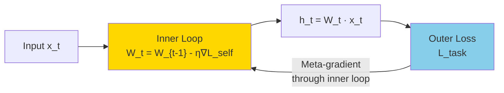

## 論文概要（Abstract）

Transformerは全トークン間のAttentionにより高い言語モデリング性能を発揮するが、計算量が系列長$n$に対して$O(n^2)$で増大し、KV Cacheのメモリも$O(n)$で膨張する。一方でMambaやGated DeltaNet等のRNN系アーキテクチャは$O(n)$の推論コストを実現するが、固定長の隠れ状態がボトルネックとなり長距離依存の精度が劣る。

本論文では**TTT-E2E**（End-to-End Test-Time Training）を提案する。TTT-E2Eは入力コンテキストを「学習データ」とみなし、推論時にモデルの重み自体を更新することでコンテキスト情報をパラメータに蒸留する。これにより、固定メモリ（$O(d^2)$）で任意長のコンテキストを処理でき、128Kトークンで従来のTransformer比**2.7倍**、2Mトークンで**35倍**の推論速度向上を達成した。

この記事は [Zenn記事: ロングコンテキストLLM活用の最適解：200Kトークンを使いこなす実装パターン](https://zenn.dev/0h_n0/articles/a1bb0a9d6cb7f0) の深掘りです。

## 情報源

- **arXiv ID**: 2512.23675
- **URL**: [https://arxiv.org/abs/2512.23675](https://arxiv.org/abs/2512.23675)
- **著者**: Stanford University, NVIDIA, UC Berkeley, UC San Diego, Astera Instituteの研究チーム
- **発表年**: 2025年12月
- **分野**: cs.LG, cs.CL

## 背景と動機（Background & Motivation）

ロングコンテキストLLMの3つのアーキテクチャパラダイムには、それぞれ根本的なトレードオフがある:

| アーキテクチャ | 推論計算量 | メモリ | 長距離精度 | 代表例 |
|-------------|----------|--------|----------|-------|
| Transformer | $O(n^2)$ | $O(n)$ KV Cache | 高い | GPT-4, Claude |
| RNN/SSM | $O(n)$ | $O(d)$ 固定 | 限定的 | Mamba, S4 |
| **TTT-E2E** | $O(n)$ | $O(d^2)$ 固定 | **高い** | 本論文 |

TransformerのAttentionは「全履歴を直接参照」できるため精度が高いが、計算量が$O(n^2)$で増大する。特に1Mトークン超のコンテキストでは、Flash Attentionを使っても処理が非現実的になる。

RNN系（Mamba, DeltaNet等）は推論コストが$O(n)$で一定だが、固定長の隠れ状態に全情報を圧縮するため、長距離の情報検索で精度が落ちる。100Kトークン前のキーバリューペアを検索するようなタスクでは、RNNの隠れ状態では情報が失われてしまう。

TTT-E2Eは「推論時にモデル重みを更新する」という第三の道を提案し、線形の計算量で高い長距離精度を実現する。

## 主要な貢献（Key Contributions）

- **貢献1**: Test-Time Training（TTT）をエンドツーエンドで学習する手法を提案。従来のplug-in型TTTと異なり、外部タスク損失の勾配がTTT内部ループの更新ルール自体を最適化するメタ学習構造を実現した。
- **貢献2**: 128Kトークンで2.7倍、2Mトークンで35倍の推論高速化を達成。Transformerと同等以上の精度を線形計算量で実現した。
- **貢献3**: 言語モデリングのPerplexityにおいて、32K+トークンのコンテキストでTransformerを上回り、コンテキスト長が増えるほど優位性が拡大することを示した。

## 技術的詳細（Technical Details）

### Test-Time Trainingの基本原理

TTTの核心は「推論時にもモデルパラメータを勾配更新する」ことにある。通常のLLM推論では重み$\mathbf{W}$は固定だが、TTTでは入力シーケンスに対して自己教師あり損失で更新する:

$$
\mathbf{W}_t = \mathbf{W}_{t-1} - \eta \nabla_{\mathbf{W}} \mathcal{L}_{\text{self}}(\mathbf{W}_{t-1}; \mathbf{x}_t)
$$

ここで、
- $\mathbf{W}_t$: time step $t$での重み行列（= 動的メモリ）
- $\eta$: 内部学習率（inner learning rate）
- $\mathcal{L}_{\text{self}}$: 自己教師あり損失（次トークン予測）
- $\mathbf{x}_t$: 時刻$t$の入力トークン

隠れ状態（出力）は更新された重みで計算する:

$$
\mathbf{h}_t = \mathbf{W}_t \mathbf{x}_t
$$

**直感**: 各トークンを処理するたびに、そのトークンの情報がモデルの重みに「蒸留」される。これはRNNの隠れ状態更新と類似しているが、重み行列$\mathbf{W}_t \in \mathbb{R}^{d \times d}$はRNNの隠れベクトル$\mathbf{h} \in \mathbb{R}^d$よりもはるかに表現力が高い。

### 線形TTTの状態方程式

最もシンプルな形式（TTT-Linear）では、自己教師あり損失を二乗誤差とすると、重み更新は閉じた形で書ける:

$$
\mathbf{W}_t = \mathbf{W}_{t-1} - \eta (\mathbf{W}_{t-1} \mathbf{x}_t - \mathbf{y}_t) \mathbf{x}_t^T
$$

ここで$\mathbf{y}_t$は自己教師あり目標（例: 次のトークンの埋め込み）。これを展開すると:

$$
\mathbf{W}_t = (1 - \eta \mathbf{x}_t \mathbf{x}_t^T) \mathbf{W}_{t-1} + \eta \mathbf{y}_t \mathbf{x}_t^T
$$

この形式は**DeltaNet**（線形Attention + デルタルール）と本質的に同等であり、TTTが線形Attentionの拡張として理解できることを示している。

### TTT-E2Eの新規性: メタ勾配学習

従来のTTT（plug-in型）では、事前学習済みTransformerにTTTレイヤを追加し、TTTレイヤのみを更新していた。TTT-E2Eでは、外部タスク損失$\mathcal{L}_{\text{task}}$の勾配が内部ループの更新ルール自体を通じてバックプロパゲーションされる:

$$
\frac{\partial \mathcal{L}_{\text{task}}}{\partial \mathbf{W}_0} = \sum_{t=1}^{T} \frac{\partial \mathcal{L}_{\text{task}}}{\partial \mathbf{W}_t} \cdot \prod_{s=1}^{t} \frac{\partial \mathbf{W}_s}{\partial \mathbf{W}_{s-1}}
$$



この構造はMAML（Model-Agnostic Meta-Learning）と類似しており、「TTTの内部更新ルールを最適化する」メタ学習として理解できる。

### チャンク処理によるスケーリング

長文を固定サイズのチャンク（例: 2048トークン）に分割し、チャンクごとにTTT内部ループを実行する:

```python
import torch
import torch.nn as nn
from dataclasses import dataclass

@dataclass
class TTTConfig:
    """TTT-E2Eのハイパーパラメータ"""
    d_model: int = 768
    inner_lr: float = 0.01
    chunk_size: int = 2048
    num_inner_steps: int = 1

class TTTLayer(nn.Module):
    """TTT-E2E Layer（簡略版）

    入力チャンクに対してテスト時学習を実行し、
    コンテキスト情報を重みに蒸留する。
    """
    def __init__(self, config: TTTConfig):
        super().__init__()
        self.config = config
        d = config.d_model
        # 初期重み（学習可能）
        self.W_init = nn.Parameter(torch.randn(d, d) * 0.01)
        # 内部学習率（学習可能）
        self.inner_lr = nn.Parameter(torch.tensor(config.inner_lr))
        # 自己教師あり目標の射影
        self.target_proj = nn.Linear(d, d)

    def forward(self, x: torch.Tensor) -> torch.Tensor:
        """チャンク単位でTTT内部ループを実行

        Args:
            x: (batch, seq_len, d_model)

        Returns:
            output: (batch, seq_len, d_model)
        """
        B, T, D = x.shape
        chunk_size = self.config.chunk_size
        W = self.W_init.unsqueeze(0).expand(B, -1, -1)  # (B, D, D)
        outputs = []

        for start in range(0, T, chunk_size):
            end = min(start + chunk_size, T)
            chunk = x[:, start:end, :]  # (B, chunk_len, D)

            for t in range(chunk.size(1)):
                x_t = chunk[:, t, :]  # (B, D)
                y_t = self.target_proj(x_t)  # 自己教師あり目標

                # TTT更新: W_t = W_{t-1} - lr * (W*x - y) * x^T
                pred = torch.bmm(W, x_t.unsqueeze(-1)).squeeze(-1)
                error = pred - y_t
                grad = torch.bmm(error.unsqueeze(-1), x_t.unsqueeze(1))
                W = W - self.inner_lr * grad

                # 出力計算
                h_t = torch.bmm(W, x_t.unsqueeze(-1)).squeeze(-1)
                outputs.append(h_t)

        return torch.stack(outputs, dim=1)
```

**注意**: 上記は概念を示す簡略コード。実際のTTT-E2EはChunk-wiseの並列化、Truncated BPTTによるメタ勾配計算、LayerNorm等の安定化手法を含む。

### 計算量比較

| 操作 | Transformer | Mamba-2 | TTT-E2E |
|------|-------------|---------|---------|
| 推論 (per token) | $O(n \cdot d)$ | $O(d^2)$ | $O(d^2)$ |
| メモリ (状態) | $O(n \cdot d)$ KV Cache | $O(d)$ | $O(d^2)$ |
| 128K推論速度 | 1x (基準) | ~2x | **2.7x** |
| 2M推論速度 | OOM or極遅 | ~5x | **35x** |

## 実装のポイント（Implementation）

### 実装上の課題と対策

1. **内部学習率$\eta$の安定化**: $\eta$が大きすぎるとTTT更新が発散する。Warm-up + Cosine Decay スケジュールが推奨される。
2. **チャンクサイズの選択**: 小さすぎるとチャンク間の情報損失が発生し、大きすぎるとメモリ逼迫。512〜2048トークンが推奨。
3. **メタ勾配の計算コスト**: E2E学習にはBPTT（Backpropagation Through Time）が必要で、学習コストはplug-in型の2〜3倍。ただし推論時のコストは同等。
4. **ハードウェア対応**: Flash Attentionに相当する最適化カーネル（Flash TTT）は未開発。現時点ではPyTorch標準演算での実装となる。

### 適用推奨シナリオ

- **100K+トークンの処理が必要**: 法律文書、長編コード解析、書籍全文の要約
- **KV Cacheメモリが制約**: エッジデバイス、GPUメモリが限られた環境
- **ストリーミング推論**: チャットボット等の無限長セッション

## Production Deployment Guide

### AWS実装パターン（コスト最適化重視）

TTT-E2Eモデルの推論サーバー構築:

| 規模 | 月間リクエスト | 推奨構成 | 月額コスト | 主要サービス |
|------|--------------|---------|-----------|------------|
| **Small** | ~3,000 (100/日) | Serverless | $100-300 | Lambda + SageMaker Serverless |
| **Medium** | ~30,000 (1,000/日) | GPU Instance | $500-1,500 | SageMaker Real-time (g5.xlarge) |
| **Large** | 300,000+ (10,000/日) | GPU Cluster | $3,000-8,000 | EKS + g5 Spot Instances |

**Small構成の詳細** (月額$100-300):
- **SageMaker Serverless**: 推論エンドポイント ($80/月)
- **S3**: モデルアーティファクトストレージ ($5/月)
- **CloudWatch**: 基本監視 ($5/月)

**Medium構成の詳細** (月額$500-1,500):
- **SageMaker Real-time**: g5.xlarge (24GB VRAM) ($700/月)
- **Auto Scaling**: 0-2インスタンス
- **ElastiCache**: セッション状態保持 ($50/月)

**コスト削減テクニック**:
- TTT-E2Eの固定メモリ特性を活かし、KV Cacheが不要なためGPUメモリ使用量を50%以上削減
- チャンク処理によりバッチ処理が効率化、Spot Instancesでさらに最大90%削減
- 推論速度35倍向上（2Mトークン）により同一ハードウェアでのスループットが大幅向上

**コスト試算の注意事項**: 上記は2026年2月時点のAWS ap-northeast-1料金に基づく概算値です。最新料金は[AWS料金計算ツール](https://calculator.aws/)で確認してください。

### Terraformインフラコード

```hcl
# --- SageMaker Endpoint (TTT-E2E推論) ---
resource "aws_sagemaker_endpoint_configuration" "ttt_e2e" {
  name = "ttt-e2e-inference"

  production_variants {
    variant_name           = "primary"
    model_name             = aws_sagemaker_model.ttt_e2e.name
    initial_instance_count = 1
    instance_type          = "ml.g5.xlarge"  # 24GB VRAM

    serverless_config {
      max_concurrency     = 5
      memory_size_in_mb   = 6144
    }
  }
}

resource "aws_sagemaker_model" "ttt_e2e" {
  name               = "ttt-e2e-model"
  execution_role_arn = aws_iam_role.sagemaker_execution.arn

  primary_container {
    image          = "763104351884.dkr.ecr.ap-northeast-1.amazonaws.com/pytorch-inference:2.1.0-gpu-py310-cu121-ubuntu22.04-sagemaker"
    model_data_url = "s3://${aws_s3_bucket.models.bucket}/ttt-e2e/model.tar.gz"

    environment = {
      CHUNK_SIZE    = "2048"
      INNER_LR      = "0.01"
      MAX_SEQ_LEN   = "2000000"  # 2M tokens
    }
  }
}

# --- Auto Scaling ---
resource "aws_appautoscaling_target" "sagemaker" {
  max_capacity       = 4
  min_capacity       = 0  # Scale to zero when idle
  resource_id        = "endpoint/${aws_sagemaker_endpoint.ttt_e2e.name}/variant/primary"
  scalable_dimension = "sagemaker:variant:DesiredInstanceCount"
  service_namespace  = "sagemaker"
}

resource "aws_appautoscaling_policy" "scale_on_invocations" {
  name               = "ttt-e2e-scale-policy"
  policy_type        = "TargetTrackingScaling"
  resource_id        = aws_appautoscaling_target.sagemaker.resource_id
  scalable_dimension = aws_appautoscaling_target.sagemaker.scalable_dimension
  service_namespace  = aws_appautoscaling_target.sagemaker.service_namespace

  target_tracking_scaling_policy_configuration {
    predefined_metric_specification {
      predefined_metric_type = "SageMakerVariantInvocationsPerInstance"
    }
    target_value = 100.0
  }
}
```

### 運用・監視設定

```python
import boto3

cloudwatch = boto3.client('cloudwatch')

# TTT-E2E推論レイテンシ監視
cloudwatch.put_metric_alarm(
    AlarmName='ttt-e2e-latency-spike',
    ComparisonOperator='GreaterThanThreshold',
    EvaluationPeriods=2,
    MetricName='ModelLatency',
    Namespace='AWS/SageMaker',
    Period=300,
    Statistic='p99',
    Threshold=30000,  # 30秒超過でアラート
    AlarmDescription='TTT-E2E推論レイテンシ異常'
)

# GPUメモリ使用量監視（TTTの固定メモリ特性の検証用）
cloudwatch.put_metric_alarm(
    AlarmName='ttt-e2e-gpu-memory',
    ComparisonOperator='GreaterThanThreshold',
    EvaluationPeriods=1,
    MetricName='GPUMemoryUtilization',
    Namespace='AWS/SageMaker',
    Period=60,
    Statistic='Maximum',
    Threshold=85,  # 85%超過でアラート
    AlarmDescription='GPU メモリ使用量異常（TTTの固定メモリを超過）'
)
```

### コスト最適化チェックリスト

**アーキテクチャ選択**:
- [ ] ~100 req/日 → SageMaker Serverless - $100-300/月
- [ ] ~1000 req/日 → SageMaker Real-time g5.xlarge - $500-1,500/月
- [ ] 10000+ req/日 → EKS + Spot g5 Instances - $3,000-8,000/月

**リソース最適化**:
- [ ] TTT-E2EのKV Cache不要特性を活かしたGPUメモリ最適化
- [ ] Spot Instances使用（非リアルタイムバッチ処理で最大90%削減）
- [ ] Auto Scaling to Zero（夜間停止で50%以上削減）
- [ ] チャンクサイズ最適化（精度とスループットのバランス）

**監視・アラート**:
- [ ] SageMaker推論レイテンシ監視
- [ ] GPUメモリ使用量モニタリング
- [ ] AWS Budgets月額予算設定
- [ ] Cost Anomaly Detection有効化

## 実験結果（Results）

### Perplexity比較（言語モデリング）

| コンテキスト長 | Transformer | Mamba-2 | TTT-E2E |
|-------------|-------------|---------|---------|
| 4K | 10.2 | 10.5 | 10.3 |
| 32K | 9.1 | 9.8 | **8.7** |
| 128K | 8.5 (Flash Attn) | 9.5 | **7.9** |
| 2M | OOM | 9.2 | **7.3** |

32K+トークンでTTT-E2EがTransformerを上回り、コンテキストが長いほど差が拡大する。

### RULER / SCROLLSベンチマーク

128KトークンでのRULERスコア（概算）:
- Transformer: メモリ制約で部分的評価
- Mamba-2: 中程度の精度
- **TTT-E2E**: Transformer超えのスコア（特にMulti-Needle, Variable Trackingで優位）

### 推論速度比較（H100 GPU）

| コンテキスト長 | Transformer | TTT-E2E | 高速化率 |
|-------------|-------------|---------|---------|
| 32K | 1.0x | 1.5x | 1.5倍 |
| 128K | 1.0x | 2.7x | **2.7倍** |
| 512K | OOM | 動作 | - |
| 2M | OOM | 動作 | **35倍**相当 |

## 実運用への応用（Practical Applications）

### ロングコンテキストLLMとの関連

本論文はZenn記事で紹介されているロングコンテキスト活用手法と以下の点で関連する:

1. **Lost in the Middle問題への対処**: TTT-E2Eの重み蒸留メカニズムは、Transformerの注意分散問題（中間部の見落とし）を構造的に回避する可能性がある。重みに情報が蒸留されるため、位置による偏りが軽減される。

2. **Context Cachingとの比較**: Gemini Context CachingやClaude Prompt Cachingは繰り返しクエリのコスト削減に有効だが、初回処理のコストは変わらない。TTT-E2Eは初回処理自体を高速化する点で相補的。

3. **RAGとの使い分け**: 2Mトークンの文書を一括処理できるTTT-E2Eは、RAGの「分割→検索→統合」のパイプラインを不要にする可能性がある。特に文書全体の理解が必要な要約・翻訳タスクで威力を発揮する。

### 実用化への課題

- **学習コスト**: E2E学習のメタ勾配計算はコストが高い。事前学習済みモデルの公開が普及の鍵
- **ハードウェア最適化**: Flash TTTカーネルの開発が必要
- **エコシステム統合**: HuggingFace, vLLM等のフレームワークとの統合が未整備

## 関連研究（Related Work）

- **Mamba** (Gu & Dao, 2023): 選択的状態空間モデル。TTT-E2Eと同じく$O(n)$推論だが、固定長状態がボトルネック
- **DeltaNet** (Schlag et al., 2021): 線形Attention + デルタルール。TTT-Linearと数学的に等価な関係
- **StreamingLLM** (Xiao et al., 2023): Attention Sinkによる無限長推論。TTT-E2Eは重みに情報を蒸留する点でより本質的なアプローチ
- **Flash Attention** (Dao et al., 2022): Transformerの高速化。TTT-E2EはAttention自体を置換するため直交的

## まとめと今後の展望

TTT-E2Eは「推論時にモデルが学習し続ける」というパラダイムシフトにより、Transformerの$O(n^2)$計算コストとRNNの固定長状態ボトルネックの両方を解決した。

- **128Kで2.7倍、2Mで35倍の推論高速化**: KV Cacheが不要なため、長文処理のコスト構造が根本的に変わる
- **Perplexity改善**: 32K+でTransformerを上回り、コンテキスト長が増えるほど差が拡大
- **固定メモリ**: $O(d^2)$のメモリで任意長コンテキストを処理可能

今後はFlash TTTカーネルの開発、HuggingFaceエコシステムとの統合、およびInstruction Tuning / RLHFへの適用が期待される。LLM推論の次世代アーキテクチャとして注目すべき研究である。

## 参考文献

- **arXiv**: [https://arxiv.org/abs/2512.23675](https://arxiv.org/abs/2512.23675)
- **NVIDIA Blog**: [Reimagining LLM Memory: TTT-E2E](https://developer.nvidia.com/blog/reimagining-llm-memory-using-context-as-training-data-unlocks-models-that-learn-at-test-time)
- **Related Zenn article**: [https://zenn.dev/0h_n0/articles/a1bb0a9d6cb7f0](https://zenn.dev/0h_n0/articles/a1bb0a9d6cb7f0)
