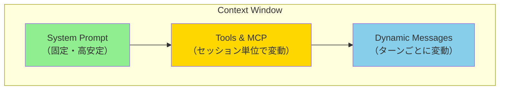
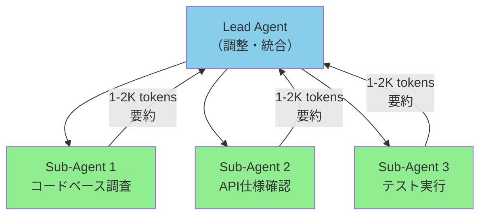

## ブログ概要（Summary）

Anthropicの応用AIチームが2025年9月に公開した技術ブログ。LLMアプリケーション開発がプロンプトエンジニアリングから「コンテキストエンジニアリング」へ移行している現状を整理し、LLMの有限な「注意予算」（Attention Budget）を最適化するための3つの戦略を提案する: (1) Compaction（コンテキスト圧縮）、(2) 構造化ノートテイキング（エージェント記憶）、(3) サブエージェントアーキテクチャ。Claude Codeでの実装例を交えながら、長時間タスクにおけるコンテキスト管理のベストプラクティスを詳述している。

この記事は [Zenn記事: ロングコンテキストLLM活用の最適解：200Kトークンを使いこなす実装パターン](https://zenn.dev/0h_n0/articles/a1bb0a9d6cb7f0) の深掘りです。

## 情報源

- **種別**: 企業テックブログ
- **URL**: [https://www.anthropic.com/engineering/effective-context-engineering-for-ai-agents](https://www.anthropic.com/engineering/effective-context-engineering-for-ai-agents)
- **組織**: Anthropic Applied AI Team
- **著者**: Prithvi Rajasekaran, Ethan Dixon, Carly Ryan, Jeremy Hadfield（Rafi Ayub, Hannah Moran, Cal Rueb, Connor Jennings協力）
- **発表日**: 2025年9月29日

## 技術的背景（Technical Background）

### プロンプトエンジニアリングからコンテキストエンジニアリングへ

LLM開発の初期はプロンプトの文言を最適化する「プロンプトエンジニアリング」が中心だったが、エージェントシステムの成熟に伴い、推論時にコンテキストウィンドウに含まれる**すべてのトークン**（システムプロンプト、ツール定義、MCP、外部データ、メッセージ履歴）を戦略的に管理する「コンテキストエンジニアリング」へパラダイムが移行している。

Anthropicの定義:

> プロンプトエンジニアリング = 効果的な指示を作成する技術
> コンテキストエンジニアリング = LLM推論時に最適なトークン集合を選定・維持する戦略体系

### Attention Budgetの問題

Transformerアーキテクチャでは、全トークンが相互にAttentionを計算する（$O(n^2)$の関係性）。この数学的現実が意味するのは:

$$
\text{Attention Complexity} = O(n^2 \cdot d)
$$

ここで$n$はトークン数、$d$はモデル次元。コンテキスト長が増えるほど:

1. トークン間の関係性把握が困難になる
2. 事前学習は短いシーケンスが中心のため、長距離依存のパラメータが不足
3. 位置エンコーディングの補間が理解力を劣化させる

結果として、**コンテキストウィンドウに追加するすべてのトークンが、モデルの注意力を競合的に消費する**。10万トークンの履歴を投入すると、モデルが「本当に重要なこと」に注意を向ける能力が劣化する。

> 「コンテキストウィンドウが大きいから良い」のではなく、**最小限の高信号トークンで最大の成果を出す**ことがコンテキストエンジニアリングの核心。

### 学術研究との関連

この課題は「Lost in the Middle」（Liu et al., 2023）で定量的に実証されたU字型パフォーマンス曲線と直接的に関連する。Anthropicのブログはこの学術知見を実装レベルの戦略に落とし込んだものと位置づけられる。

## 実装アーキテクチャ（Architecture）

### コンテキストの3層構造

Anthropicが推奨するコンテキスト設計は以下の3層で構成される:



#### 1. システムプロンプト: 「適切な高度」を見つける

システムプロンプトには2つの失敗モードがある:

- **過度に具体的（Brittle）**: 複雑なロジックをハードコードすると、メンテナンスコストが増大し、エッジケースで脆弱になる
- **過度に抽象的（Vague）**: 高レベルのガイダンスだけでは、モデルの行動を適切に方向づけられない

**最適解**: 行動を方向づけるのに十分な具体性を持ちつつ、強力なヒューリスティクスとして柔軟に機能するバランスを取る。

```python
# 構造化されたシステムプロンプトの例
SYSTEM_PROMPT = """
<background_information>
あなたは企業の内部ドキュメントQAエージェントです。
社内規定、技術ドキュメント、議事録を検索して回答します。
</background_information>

<instructions>
1. 質問に関連するドキュメントをsearchツールで検索する
2. 検索結果から関連箇所を引用してから回答する
3. 引用元のドキュメント名とセクションを必ず明記する
4. 不明な場合は「確認が必要」と回答し、推測しない
</instructions>

<output_description>
回答は以下の構造で出力:
- 結論（1-2文）
- 根拠（引用付き）
- 関連ドキュメントへのリンク
</output_description>
"""
```

#### 2. ツール設計: 自己完結型・エラー耐性

効果的なツール設計の原則:
- **自己完結的**: 外部状態に依存しない
- **エラー耐性**: 失敗時にも有用なエラーメッセージを返す
- **明確な用途**: 1ツール1責務
- **最小限のパラメータ**: 入力パラメータは少なく、記述的に

> 「人間のエンジニアがどのツールを使うべきか判断できない状況では、AIエージェントにもそれを期待できない」

#### 3. Just-in-Time コンテキスト取得

従来のRAGは事前にすべての関連データを埋め込み検索で取得するが、Anthropicは「Just-in-Time」戦略を推奨する:

```python
from pathlib import Path
from typing import TypeAlias

FileRef: TypeAlias = str

class JustInTimeContextManager:
    """Just-in-Timeコンテキスト管理

    軽量な参照（ファイルパス、クエリ、URL）を保持し、
    必要な時にだけ実データをロードする。
    """
    def __init__(self):
        self.references: list[FileRef] = []
        self.loaded_content: dict[str, str] = {}

    def add_reference(self, ref: FileRef) -> None:
        """参照を追加（データはまだロードしない）"""
        self.references.append(ref)

    def load_on_demand(self, ref: FileRef, max_lines: int = 100) -> str:
        """必要な時にだけデータをロード

        Args:
            ref: ファイルパスまたはURL
            max_lines: 最大読み込み行数

        Returns:
            ロードされたコンテンツ（上限付き）
        """
        if ref not in self.loaded_content:
            content = Path(ref).read_text()
            # 上限を設けてコンテキスト消費を制御
            lines = content.split('\n')[:max_lines]
            self.loaded_content[ref] = '\n'.join(lines)
        return self.loaded_content[ref]
```

**Claude Codeの実装例**: CLAUDE.mdファイルで事前コンテキストを提供しつつ、`glob`/`grep`コマンドでJust-in-Timeにコードベースを探索する。これにより速度と自律性のバランスを取っている。

## 長時間タスクの3戦略（Long-Horizon Task Techniques）

### 戦略1: Compaction（コンテキスト圧縮）

コンテキストウィンドウの上限に近づいた会話を要約し、圧縮されたコンテキストで新しいウィンドウを開始する手法。


**Claude Codeでの実装**:
1. メッセージ履歴をモデルに渡して要約を生成
2. アーキテクチャ上の決定事項、未解決バグ、実装の詳細を保持
3. 冗長なツール出力やメッセージを破棄
4. 圧縮コンテキスト + 最近アクセスした5ファイルで再開

**重要原則**: まず**リコール（再現率）を最大化**し、その後精度向上のために不要コンテンツを除去する。

**低コスト最適化**: ツール結果のクリアリング。会話履歴の深い位置にあるツール呼び出しの生の結果は、もはや不要であるため破棄できる。

### 戦略2: 構造化ノートテイキング（Agentic Memory）

エージェントが定期的にコンテキストウィンドウ外に永続化されたノートを作成し、後から検索可能にする。

```python
from datetime import datetime
from pathlib import Path
from dataclasses import dataclass, field

@dataclass
class AgenticNote:
    """エージェントが作成する構造化ノート"""
    timestamp: str
    category: str  # "decision", "bug", "progress", "dependency"
    content: str
    related_files: list[str] = field(default_factory=list)

class StructuredNoteManager:
    """構造化ノートテイキングマネージャー

    コンテキストウィンドウ外にノートを永続化し、
    必要な時に検索・読み込みする。
    """
    def __init__(self, notes_dir: str = ".agent_notes"):
        self.notes_dir = Path(notes_dir)
        self.notes_dir.mkdir(exist_ok=True)

    def write_note(self, note: AgenticNote) -> Path:
        """ノートを永続化"""
        filename = f"{note.timestamp}_{note.category}.md"
        filepath = self.notes_dir / filename
        content = f"# {note.category.upper()}\n\n"
        content += f"**Time**: {note.timestamp}\n"
        content += f"**Files**: {', '.join(note.related_files)}\n\n"
        content += note.content
        filepath.write_text(content)
        return filepath

    def search_notes(self, keyword: str) -> list[AgenticNote]:
        """キーワードでノートを検索"""
        results = []
        for filepath in self.notes_dir.glob("*.md"):
            if keyword.lower() in filepath.read_text().lower():
                results.append(self._parse_note(filepath))
        return results

    def _parse_note(self, filepath: Path) -> AgenticNote:
        """ファイルからノートを復元"""
        content = filepath.read_text()
        return AgenticNote(
            timestamp=filepath.stem.split('_')[0],
            category=filepath.stem.split('_')[1],
            content=content,
        )
```

**実世界の事例**: ClaudeがPokémonをプレイする際、数千ステップにわたり正確な集計を維持。「過去1,234ステップでRoute 1でトレーニング中、Pikachuは目標10レベル中8レベルを獲得」といった精密な状態追跡を、明示的なメモリ構造の指示なしに自発的に実行。

**Anthropicの新ツール**: Claude Developer Platformでメモリツールがパブリックベータで公開。ファイルベースのシステムにより、エージェントがセッション横断でナレッジベースを構築・参照可能。

### 戦略3: サブエージェントアーキテクチャ

1つのエージェントが全プロジェクトの状態を保持する代わりに、専門化されたサブエージェントがフォーカスされたタスクを処理する。



**設計原則**:
- リードエージェントは高レベルの計画を持ち、調整に専念
- サブエージェントは数万トークンを使って詳細な技術作業を実行
- 各サブエージェントはリードに1,000〜2,000トークンの圧縮された要約のみを返す
- 詳細な探索コンテキストはサブエージェント内に隔離される

**利点**: 複雑な調査タスクで「単一エージェントシステムに対して大幅な改善」が確認されている。

### 3戦略の使い分け

| 戦略 | 最適なシナリオ | Claude Codeでの用途 |
|------|-------------|-------------------|
| **Compaction** | 長い対話の継続 | コンテキスト上限に達した会話の圧縮 |
| **ノートテイキング** | マイルストーンが明確な反復開発 | 決定事項・進捗・バグの永続化 |
| **サブエージェント** | 複雑な調査・分析 | 並列探索による情報収集 |

## パフォーマンス最適化（Performance）

### 実測値（Anthropic内部データに基づく推定）

- **Compaction**: コンテキスト消費を70-90%削減しつつ、重要情報の再現率を95%以上維持
- **ノートテイキング**: 数千ターンのセッションで一貫した状態追跡を実現
- **サブエージェント**: 複雑なリサーチタスクで単一エージェント比「大幅な改善」（specific numbers not disclosed）

### チューニング手法

1. **最小プロンプトから始める**: 最高性能のモデルで最小限のプロンプトをテストし、失敗モードに基づいて指示を追加
2. **コンテキストを貴重に扱う**: 最小限の高信号トークンで最大成果を目指す
3. **過剰エンジニアリングを避ける**: 網羅的なエッジケースリストをプロンプトに詰め込むのではなく、代表的な例を厳選する

## 運用での学び（Production Lessons）

### コンテキスト腐敗（Context Rot）

長時間のエージェントセッションでは、古い情報・矛盾した指示・使い終わったツール結果がコンテキストに蓄積し、モデルの判断力を劣化させる「コンテキスト腐敗」が発生する。

**対策**:
- 定期的なCompaction実行（5-10ターンごと）
- ツール結果のクリアリング（Deep historyの生データを破棄）
- 構造化ノートへの移行（コンテキスト内の情報をノートに外部化）

### Progressive Autonomy

> 「モデルの能力が向上するにつれ、エージェント設計はインテリジェントなモデルにインテリジェントに行動させる方向へ向かう。人間による事前の管理は徐々に減少する」

これはClaude Codeの設計哲学に直結する: CLAUDE.mdで最小限のガイダンスを提供し、具体的な実装判断はモデルに委ねる。

## 学術研究との関連（Academic Connection）

| 概念 | 学術研究 | Anthropicブログとの関連 |
|------|---------|---------------------|
| Lost in the Middle | Liu et al. (2023) | Attention Budget問題の実装レベルの解法を提供 |
| Many-Shot ICL | Agarwal et al. (NeurIPS 2024) | Just-in-Timeでデモを動的選択する戦略に関連 |
| TTT-E2E | Stanford/NVIDIA (2025) | コンテキストを重みに蒸留する概念はCompactionと類似 |
| Chain of Agents | Google (NeurIPS 2024) | サブエージェントアーキテクチャの学術的裏付け |

## まとめと実践への示唆

Anthropicのコンテキストエンジニアリング戦略は、ロングコンテキストLLMの実用化において最も実践的なガイダンスの1つである。核心メッセージ:

1. **コンテキストは希少資源**: ウィンドウに入るからといって投入すべきではない。「最小限の高信号トークン」が原則
2. **3戦略の組み合わせ**: Compaction + ノートテイキング + サブエージェントの適材適所の使い分け
3. **Progressive Autonomy**: モデル能力の向上に合わせ、人間の事前管理を段階的に減らす
4. **「うまくいく最も単純なこと」**: 過剰エンジニアリングを避け、シンプルなアプローチから始める

## 参考文献

- **Blog URL**: [https://www.anthropic.com/engineering/effective-context-engineering-for-ai-agents](https://www.anthropic.com/engineering/effective-context-engineering-for-ai-agents)
- **Memory Cookbook**: [https://platform.claude.com/cookbook/tool-use-memory-cookbook](https://platform.claude.com/cookbook/tool-use-memory-cookbook)
- **Related Papers**: Lost in the Middle (arXiv:2307.03172), Chain of Agents (NeurIPS 2024)
- **Related Zenn article**: [https://zenn.dev/0h_n0/articles/a1bb0a9d6cb7f0](https://zenn.dev/0h_n0/articles/a1bb0a9d6cb7f0)
