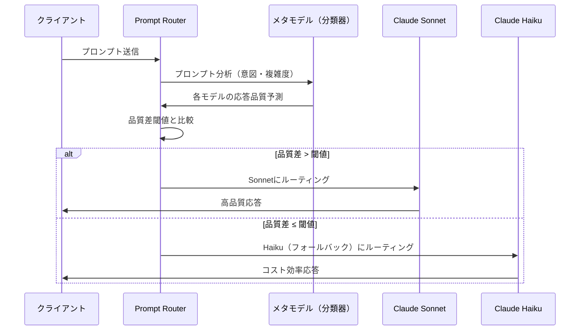

## ブログ概要（Summary）

Amazon Bedrock Intelligent Prompt Routingは、2025年4月にGA（一般提供）となった**AWSマネージドのLLMルーティングサービス**です。単一のサーバーレスエンドポイントを通じて、同一モデルファミリー内の複数LLM間でリクエストを動的にルーティングし、**コスト最大30%削減**を品質維持のまま実現します。メタモデル（ルーティング専用モデル）がプロンプトの意図と複雑度を分析し、各モデルの応答品質を予測した上で最適なモデルを選択する仕組みです。Anthropic Claude、Meta Llama、Amazon Novaの3ファミリーに対応しています。

この記事は [Zenn記事: GeminiとClaudeを使い分けるマルチLLMルーティング実装ガイド](https://zenn.dev/0h_n0/articles/ecc929fbeb5871) の深掘りです。

## 情報源

- **種別**: AWS公式ブログ・ドキュメント
- **URL**: [https://aws.amazon.com/blogs/machine-learning/use-amazon-bedrock-intelligent-prompt-routing-for-cost-and-latency-benefits/](https://aws.amazon.com/blogs/machine-learning/use-amazon-bedrock-intelligent-prompt-routing-for-cost-and-latency-benefits/)
- **公式ドキュメント**: [https://docs.aws.amazon.com/bedrock/latest/userguide/prompt-routing.html](https://docs.aws.amazon.com/bedrock/latest/userguide/prompt-routing.html)
- **組織**: Amazon Web Services
- **GA日**: 2025年4月22日

## 技術的背景（Technical Background）

Zenn記事で解説したLiteLLMベースのルーティングは、**自前でルーティングロジックを実装・運用**する必要があります。正規表現分類やRouteLLMの行列分解ルーターは有効ですが、モデル更新時のルーティングルール見直し、分類器の訓練データ管理、フォールバック設計など運用負担が大きいのが課題です。

Bedrock Intelligent Prompt Routingは、これらの運用負担を**AWSマネージドサービスとして吸収**します。ルーティングのメタモデルの訓練・更新はAWS側が行い、新モデルの追加も自動的に対応します。ユーザーは「品質-コストのトレードオフパラメータ」を設定するだけで、ルーティングロジックの実装・運用から解放されます。

学術研究との関連では、RouteLLMの「強弱2モデル選択」を**同一ファミリー内の2モデル選択**として実装し、品質差閾値（`responseQualityDifference`）でルーティング挙動を制御する設計になっています。

## 実装アーキテクチャ（Architecture）

### 5段階ルーティングプロセス



**Step 1: モデル選択とルーター設定** — 同一ファミリーから2モデルを選択（例: Claude Sonnet + Haiku）し、品質差閾値を設定

**Step 2: プロンプト分析** — メタモデルがプロンプトの意図、複雑度、必要な推論能力を分析

**Step 3: 品質予測** — 各モデルが返す応答品質を予測（AWSが訓練したメタモデルによる）

**Step 4: ルーティング判定** — 品質差が閾値を超える場合のみ高性能モデルを選択。それ以外はフォールバック（低コスト）モデル

**Step 5: 応答返却** — 選択されたモデルの応答と、どのモデルが使用されたかのメタデータを返却

### 対応モデルファミリー

| プロバイダ | 高性能モデル | 低コストモデル | 用途 |
|-----------|------------|-------------|------|
| Anthropic | Claude 3.5 Sonnet v2 | Claude 3.5 Haiku | 汎用テキスト生成・コード |
| Meta | Llama 3.2 90B | Llama 3.1 8B | オープンモデル |
| Amazon | Nova Pro | Nova Lite | AWS最適化モデル |

### ルーター設定パラメータ

**responseQualityDifference**（品質差閾値）:

$$
\text{Route to Strong Model if:} \quad Q_{\text{strong}}(p) - Q_{\text{weak}}(p) > \delta
$$

ここで、
- $Q_{\text{strong}}(p)$: 高性能モデルの予測品質スコア
- $Q_{\text{weak}}(p)$: 低コストモデルの予測品質スコア
- $\delta$: `responseQualityDifference`（0.0〜1.0）
- $p$: 入力プロンプト

$\delta$ の効果：
- $\delta = 0$: 品質がわずかでも高ければ高性能モデルを選択（コスト高）
- $\delta = 0.5$: 50%以上の品質差がある場合のみ高性能モデル（**推奨バランス**）
- $\delta = 1.0$: ほぼ常に低コストモデルを選択（コスト最小）

Zenn記事のRouteLLMにおける `threshold=0.116` と同様の役割を果たしますが、Bedrock版はAWSのメタモデルが品質予測を行うため、**ユーザー側での分類器訓練が不要**です。

### API設計

**ルーター作成（AWS CLI）**:

```bash
aws bedrock create-prompt-router \
  --prompt-router-name "claude-cost-optimizer" \
  --models '[{
    "modelArn": "arn:aws:bedrock:us-east-1::foundation-model/anthropic.claude-3-5-sonnet-20241022-v2:0"
  }]' \
  --fallback-model '{
    "modelArn": "arn:aws:bedrock:us-east-1::foundation-model/anthropic.claude-3-5-haiku-20241022-v1:0"
  }' \
  --routing-criteria '{"responseQualityDifference": 0.5}'
```

**Python SDK (boto3)**:

```python
import boto3

bedrock = boto3.client("bedrock", region_name="ap-northeast-1")

# ルーター作成
response = bedrock.create_prompt_router(
    promptRouterName="claude-cost-optimizer",
    models=[{
        "modelArn": (
            "arn:aws:bedrock:ap-northeast-1::foundation-model/"
            "anthropic.claude-3-5-sonnet-20241022-v2:0"
        )
    }],
    fallbackModel={
        "modelArn": (
            "arn:aws:bedrock:ap-northeast-1::foundation-model/"
            "anthropic.claude-3-5-haiku-20241022-v1:0"
        )
    },
    routingCriteria={"responseQualityDifference": 0.5},
)

router_arn = response["promptRouterArn"]
```

**ルーター経由の推論呼び出し**:

```python
bedrock_runtime = boto3.client(
    "bedrock-runtime", region_name="ap-northeast-1"
)

# ルーターARNをmodelIdとして指定するだけ
response = bedrock_runtime.invoke_model(
    modelId=router_arn,  # ルーターのARNを指定
    body=json.dumps({
        "anthropic_version": "bedrock-2023-05-31",
        "messages": [{"role": "user", "content": prompt}],
        "max_tokens": 1024,
    }),
)

result = json.loads(response["body"].read())
# result には選択されたモデルの情報も含まれる
```

呼び出し方は通常のBedrock `invoke_model` と同一で、**modelIdにルーターARNを指定するだけ**でルーティングが有効になります。既存コードからの移行コストが極めて低い設計です。

### スケーリング戦略

- **サーバーレス**: インフラ管理不要。リクエスト数に応じて自動スケーリング
- **リージョン対応**: us-east-1, us-west-2, eu-central-1, **ap-northeast-1**（東京）等で利用可能
- **クロスリージョン推論**: リージョン間でのフェイルオーバーにも対応

## パフォーマンス最適化（Performance）

**ルーティングオーバーヘッド**: P90で約85msの追加レイテンシ。Sonnetの応答時間（通常1-5秒）と比較すると1-8%程度で、実用上は問題ないレベルです。

**コスト削減効果**: 品質を維持したまま**最大30%のコスト削減**。メタモデルがプロンプトの複雑度を判定し、Haikuで十分な品質が得られるリクエストを自動的にHaikuにルーティングすることで実現します。

**品質維持メカニズム**: AWSが訓練したメタモデルは、ベンチマーク結果に基づいてモデル間の品質差を予測します。フォールバックモデル（Haiku）が基準品質を満たす場合のみHaikuを選択し、複雑なタスクでは自動的にSonnetにエスカレートします。

## 運用での学び（Production Lessons）

**Zenn記事のLiteLLMルーターとの比較**:

| 項目 | LiteLLM自前実装 | Bedrock Intelligent Routing |
|------|---------------|---------------------------|
| 実装コスト | 高（分類器開発・訓練） | 低（API呼び出しのみ） |
| 対応モデル | 100+プロバイダ | 同一ファミリー内2モデル |
| ルーティング精度 | 正規表現: 低 / RouteLLM: 高 | AWSメタモデル: 高 |
| 運用負担 | 分類器更新・監視が必要 | AWS管理（自動更新） |
| カスタマイズ性 | 完全制御可能 | 閾値パラメータのみ |
| クロスプロバイダ | Claude + Gemini等の異種混合可 | 同一ファミリー内のみ |

**推奨アプローチ**: **同一ファミリー内**のルーティング（例: Claude Sonnet ↔ Haiku）はBedrock Intelligent Routingを使い、**クロスプロバイダ**のルーティング（例: Claude ↔ Gemini）はLiteLLM/RouteLLMを使う**ハイブリッド構成**が最適です。

```python
# ハイブリッド構成: Bedrock Routing + LiteLLM
async def hybrid_route(prompt: str) -> str:
    """2段階ルーティング: プロバイダ選択→ファミリー内最適化"""
    # Stage 1: LiteLLMでプロバイダ選択（Claude vs Gemini）
    provider = litellm_classify(prompt)  # "claude" or "gemini"

    if provider == "claude":
        # Stage 2: Bedrock Routingでファミリー内最適化
        return await bedrock_routed_invoke(prompt, router_arn)
    else:
        # Geminiは直接呼び出し（Bedrock対象外）
        return await gemini_invoke(prompt)
```

**制限事項**:
- **英語プロンプトに最適化**: 日本語プロンプトではメタモデルの品質予測精度が低下する可能性
- **同一ファミリー制約**: Claude Sonnet + Gemini Pro のようなクロスファミリー構成は不可
- **2モデル制約**: 3モデル以上（Opus + Sonnet + Haiku）の同時ルーティングは非対応

## 学術研究との関連（Academic Connection）

Bedrock Intelligent Prompt Routingの設計は以下の学術研究を反映しています：

- **RouteLLM** (Ong et al., 2024): 強弱2モデルの閾値ベース選択 → Bedrockの `responseQualityDifference` パラメータとして実装
- **Hybrid LLM** (Ding et al., 2024): クエリ難易度予測によるコスト効率ルーティング → Bedrockのメタモデルによる品質予測として実装
- **FrugalGPT** (Chen et al., 2023): LLMカスケード → Bedrockでは逐次処理ではなく事前予測による直接ルーティングに変更

AWSのアプローチが学術研究と異なる点は、**メタモデルの訓練と更新をAWSが管理**し、ユーザーからは閾値パラメータのみを公開している点です。これにより運用の簡素化を実現していますが、カスタマイズ性は制限されます。

## Production Deployment Guide

### AWS実装パターン

Bedrock Intelligent Prompt Routing自体がAWSマネージドサービスのため、追加インフラは最小限です。

| 規模 | 月間リクエスト | 推奨構成 | 月額コスト | 主要サービス |
|------|--------------|---------|-----------|------------|
| **Small** | ~3,000 (100/日) | Bedrock直接 | $50-150 | Bedrock Router + CloudWatch |
| **Medium** | ~30,000 (1,000/日) | + キャッシュ | $300-700 | Bedrock Router + ElastiCache + CloudWatch |
| **Large** | 300,000+ (10,000/日) | + ALB | $2,000-4,000 | ALB + Lambda + Bedrock Router |

**コスト試算の注意事項**: Bedrock Intelligent Prompt Routingのルーティング判定自体は追加料金なし（使用されたモデルのトークン料金のみ）。上記は2026年2月時点の東京リージョン料金概算です。

### Terraformインフラコード

```hcl
# --- Bedrock Prompt Router ---
resource "aws_bedrock_prompt_router" "claude_optimizer" {
  prompt_router_name = "claude-cost-optimizer"

  models {
    model_arn = "arn:aws:bedrock:ap-northeast-1::foundation-model/anthropic.claude-3-5-sonnet-20241022-v2:0"
  }

  fallback_model {
    model_arn = "arn:aws:bedrock:ap-northeast-1::foundation-model/anthropic.claude-3-5-haiku-20241022-v1:0"
  }

  routing_criteria {
    response_quality_difference = 0.5
  }
}

# --- CloudWatchアラーム ---
resource "aws_cloudwatch_metric_alarm" "bedrock_cost" {
  alarm_name          = "bedrock-router-cost-spike"
  comparison_operator = "GreaterThanThreshold"
  evaluation_periods  = 1
  metric_name         = "InvocationCount"
  namespace           = "AWS/Bedrock"
  period              = 3600
  statistic           = "Sum"
  threshold           = 10000
  alarm_description   = "Bedrock Router呼び出し数異常"

  dimensions = {
    ModelId = aws_bedrock_prompt_router.claude_optimizer.prompt_router_arn
  }
}
```

### 運用・監視設定

```sql
-- ルーティング先モデルの分布
fields @timestamp, model_id, input_tokens, output_tokens
| stats count(*) as requests,
        sum(input_tokens + output_tokens) as total_tokens
  by model_id, bin(1h)

-- Haikuルーティング率（コスト削減効果の指標）
fields @timestamp, model_id
| stats count(*) as total,
        count_distinct(case when model_id like '%haiku%' then 1 end) as haiku_count
  by bin(1d)
| eval haiku_ratio = haiku_count / total * 100
```

### コスト最適化チェックリスト

**ルーター設定**:
- [ ] `responseQualityDifference` を0.5から開始し、品質モニタリングしながら調整
- [ ] 閾値を上げる（→Haiku使用率増加→コスト削減）際は品質レポートを確認
- [ ] 英語プロンプトの場合は最大効果、日本語は効果を検証

**Bedrock最適化**:
- [ ] Prompt Caching有効化（Bedrock Intelligent Routingと併用可能）
- [ ] Batch API活用（非リアルタイム処理で50%削減）
- [ ] max_tokens設定でトークン使用量を制限

**監視・アラート**:
- [ ] CloudWatch: モデル別ルーティング分布を日次確認
- [ ] AWS Budgets: Bedrock使用量の予算アラート
- [ ] Haiku/Sonnetのルーティング比率をダッシュボード化
- [ ] 品質メトリクス: 定期的にサンプルレスポンスの品質評価

**コスト比較**:
- [ ] Bedrock Routing有効化前後のコストを比較
- [ ] Sonnet固定 vs Routing vs Haiku固定の3パターンでコスト/品質を検証
- [ ] ルーティングなし時の想定コストとの差分をレポート

## まとめと実践への示唆

Amazon Bedrock Intelligent Prompt Routingは、**同一ファミリー内のLLMルーティングを完全マネージド化**したサービスです。Zenn記事のLiteLLMベースルーティングと比較して、運用負担を大幅に削減できる一方、クロスプロバイダルーティング（Claude + Gemini）には対応していません。最適なアプローチは、**プロバイダ選択はLiteLLM/RouteLLM**で、**ファミリー内最適化はBedrock Routing**で行うハイブリッド構成です。P90ルーティングオーバーヘッド85msで品質維持・コスト30%削減は、自前実装では得にくいコスト効率です。

## 参考文献

- **Blog URL**: [https://aws.amazon.com/blogs/machine-learning/use-amazon-bedrock-intelligent-prompt-routing-for-cost-and-latency-benefits/](https://aws.amazon.com/blogs/machine-learning/use-amazon-bedrock-intelligent-prompt-routing-for-cost-and-latency-benefits/)
- **AWS Docs**: [https://docs.aws.amazon.com/bedrock/latest/userguide/prompt-routing.html](https://docs.aws.amazon.com/bedrock/latest/userguide/prompt-routing.html)
- **Product Page**: [https://aws.amazon.com/bedrock/intelligent-prompt-routing/](https://aws.amazon.com/bedrock/intelligent-prompt-routing/)
- **Related Zenn article**: [https://zenn.dev/0h_n0/articles/ecc929fbeb5871](https://zenn.dev/0h_n0/articles/ecc929fbeb5871)
