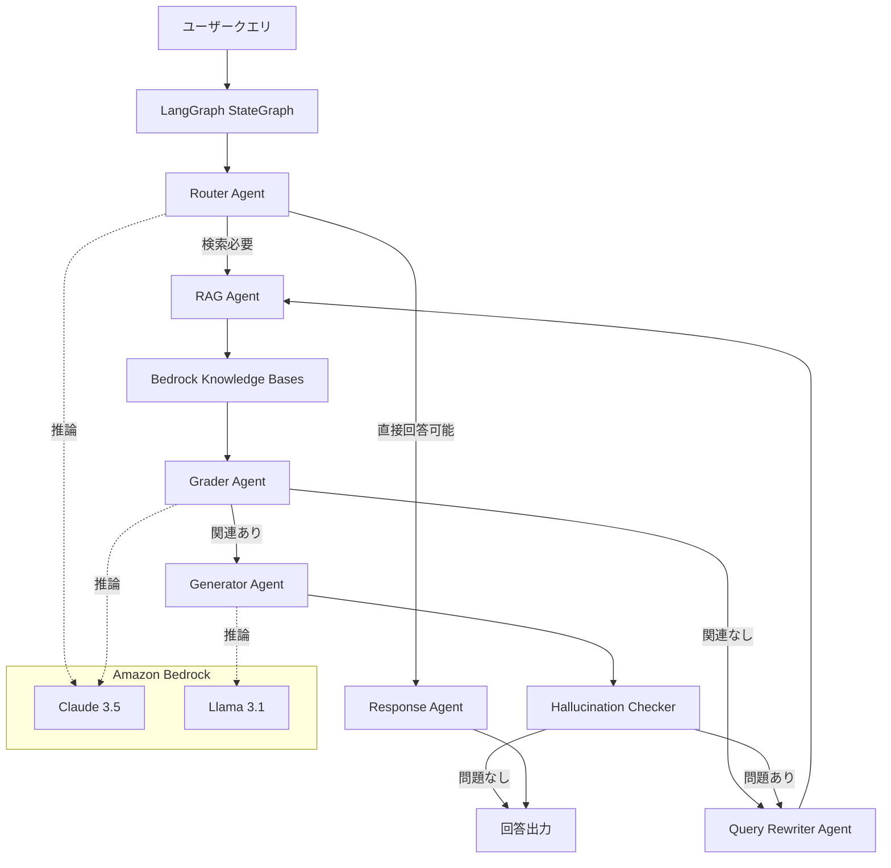

## ブログ概要（Summary）

AWS Machine Learning Blogが公開したこの記事は、LangGraphフレームワークとAmazon Bedrockを組み合わせてマルチエージェントシステムを構築する方法を解説している。LangGraphのStateGraphでエージェント間の協調ワークフローを定義し、Amazon BedrockのFoundation Models（Claude、Llama等）を推論エンジンとして使用する。RAGパイプラインにおけるAgentic RAGパターンの実装に直結するクラウドネイティブな設計指針を提供する点で、Zenn記事の実装をプロダクション環境に展開する際の参考になる。

この記事は [Zenn記事: LangGraph Agentic RAGで社内検索の回答精度を大幅改善する実装手法](https://zenn.dev/0h_n0/articles/4c869d366e5200) の深掘りです。

## 情報源

- **種別**: 企業テックブログ
- **URL**: [https://aws.amazon.com/blogs/machine-learning/build-multi-agent-systems-with-langgraph-and-amazon-bedrock/](https://aws.amazon.com/blogs/machine-learning/build-multi-agent-systems-with-langgraph-and-amazon-bedrock/)
- **組織**: AWS Machine Learning Blog
- **発表日**: 2024年

## 技術的背景（Technical Background）

LLMアプリケーションが単純なチャットボットから複雑なワークフローへと進化する中で、**マルチエージェントシステム**の需要が急速に高まっている。単一のLLM呼び出しでは対応できない複雑なタスクを、複数の専門エージェントに分解して協調処理させるアプローチである。

AWSはこのニーズに応えるため、以下の組み合わせを提案している：

1. **LangGraph**: エージェントワークフローの定義と実行エンジン
2. **Amazon Bedrock**: マネージドLLMサービス（Claude、Llama、Mistral等）
3. **Amazon Bedrock Knowledge Bases**: RAG用のベクトルストア統合

この組み合わせにより、Zenn記事のLangGraph Agentic RAGパターンをAWSのマネージドサービス上でスケーラブルに運用できる。

## 実装アーキテクチャ（Architecture）

### LangGraph + Bedrock統合の全体像



### StateGraphの構築パターン

AWSが推奨するLangGraph StateGraphの構築パターンは、Zenn記事のGrader→Rewriteパターンを拡張し、Router、Grader、Rewriter、Generatorの4つの専門エージェントで構成する。

```python
from typing import TypedDict, Literal
from langgraph.graph import StateGraph, START, END
import boto3
import json

bedrock_runtime = boto3.client("bedrock-runtime", region_name="ap-northeast-1")

class AgentState(TypedDict):
    question: str
    documents: list[str]
    generation: str
    retry_count: int
    route: str

def invoke_bedrock(prompt: str, model_id: str = "anthropic.claude-3-5-haiku-20241022-v1:0") -> str:
    """Amazon Bedrockでモデルを呼び出す

    Args:
        prompt: 入力プロンプト
        model_id: Bedrockモデル ID

    Returns:
        モデルの応答テキスト
    """
    body = json.dumps({
        "anthropic_version": "bedrock-2023-05-31",
        "max_tokens": 1024,
        "messages": [{"role": "user", "content": prompt}]
    })
    response = bedrock_runtime.invoke_model(
        modelId=model_id,
        body=body
    )
    result = json.loads(response["body"].read())
    return result["content"][0]["text"]

def router_agent(state: AgentState) -> dict:
    """クエリを検索必要/直接回答可能にルーティング

    Args:
        state: 現在のグラフ状態

    Returns:
        ルーティング結果
    """
    result = invoke_bedrock(
        f"以下の質問は社内ドキュメント検索が必要か判定してください。\n"
        f"'search'（検索必要）または 'direct'（直接回答可能）で答えてください。\n"
        f"質問: {state['question']}"
    )
    route = "search" if "search" in result.lower() else "direct"
    return {"route": route}

def rag_retrieve(state: AgentState) -> dict:
    """Bedrock Knowledge Basesから検索

    Args:
        state: 現在のグラフ状態

    Returns:
        検索結果文書のリスト
    """
    bedrock_agent = boto3.client("bedrock-agent-runtime")
    response = bedrock_agent.retrieve(
        knowledgeBaseId="YOUR_KB_ID",
        retrievalQuery={"text": state["question"]},
        retrievalConfiguration={
            "vectorSearchConfiguration": {"numberOfResults": 5}
        }
    )
    docs = [r["content"]["text"] for r in response["retrievalResults"]]
    return {"documents": docs}

def grader_agent(state: AgentState) -> dict:
    """検索結果の関連性を評価"""
    filtered = []
    for doc in state["documents"]:
        result = invoke_bedrock(
            f"文書が質問に関連するか判定。'yes'か'no'で回答。\n"
            f"質問: {state['question']}\n文書: {doc}"
        )
        if "yes" in result.lower():
            filtered.append(doc)
    return {"documents": filtered}

def rewrite_agent(state: AgentState) -> dict:
    """クエリを書き換えて再検索に備える"""
    rewritten = invoke_bedrock(
        f"以下の質問をベクトル検索向けに書き換えてください。\n"
        f"具体的用語を使い曖昧表現を排除。\n"
        f"元の質問: {state['question']}"
    )
    return {
        "question": rewritten,
        "retry_count": state.get("retry_count", 0) + 1
    }

def generator_agent(state: AgentState) -> dict:
    """検索結果に基づいて回答を生成"""
    context = "\n\n".join(state["documents"])
    result = invoke_bedrock(
        f"以下の社内文書に基づいて質問に回答してください。\n"
        f"文書にない情報は「見つかりませんでした」と回答。\n"
        f"文書:\n{context}\n\n質問: {state['question']}"
    )
    return {"generation": result}

def direct_response(state: AgentState) -> dict:
    """検索不要の質問に直接回答"""
    result = invoke_bedrock(state["question"])
    return {"generation": result}

def should_rewrite(state: AgentState) -> str:
    """関連文書の有無とリトライ回数で分岐"""
    if state.get("retry_count", 0) >= 3:
        return "generate"
    return "rewrite" if not state["documents"] else "generate"

def route_query(state: AgentState) -> str:
    """Routerの判定結果で分岐"""
    return state["route"]

# グラフ構築
workflow = StateGraph(AgentState)
workflow.add_node("router", router_agent)
workflow.add_node("retrieve", rag_retrieve)
workflow.add_node("grade", grader_agent)
workflow.add_node("rewrite", rewrite_agent)
workflow.add_node("generate", generator_agent)
workflow.add_node("direct", direct_response)

workflow.add_edge(START, "router")
workflow.add_conditional_edges("router", route_query, {
    "search": "retrieve",
    "direct": "direct",
})
workflow.add_edge("retrieve", "grade")
workflow.add_conditional_edges("grade", should_rewrite, {
    "rewrite": "rewrite",
    "generate": "generate",
})
workflow.add_edge("rewrite", "retrieve")
workflow.add_edge("generate", END)
workflow.add_edge("direct", END)

app = workflow.compile()
```

### Bedrock特有の最適化

**Prompt Caching**: Bedrockでは、システムプロンプト部分のキャッシュにより、同一プロンプトプレフィックスの再利用で30-90%のコスト削減が可能。

```python
def invoke_bedrock_with_cache(
    system_prompt: str,
    user_prompt: str,
    model_id: str = "anthropic.claude-3-5-haiku-20241022-v1:0"
) -> str:
    """Prompt Cachingを活用したBedrock呼び出し

    Args:
        system_prompt: システムプロンプト（キャッシュ対象）
        user_prompt: ユーザープロンプト

    Returns:
        モデルの応答テキスト
    """
    body = json.dumps({
        "anthropic_version": "bedrock-2023-05-31",
        "max_tokens": 1024,
        "system": [
            {
                "type": "text",
                "text": system_prompt,
                "cache_control": {"type": "ephemeral"}
            }
        ],
        "messages": [{"role": "user", "content": user_prompt}]
    })
    response = bedrock_runtime.invoke_model(modelId=model_id, body=body)
    result = json.loads(response["body"].read())
    return result["content"][0]["text"]
```

**Bedrock Knowledge Basesのメリット**:
- ベクトルストアの管理不要（OpenSearch Serverless、Pinecone、RDS対応）
- 自動チャンキング・埋め込み生成
- IAMベースのアクセス制御
- マルチモーダル検索対応（PDF、画像含む）

### Zenn記事との対応関係

| Zenn記事の構成 | AWSアーキテクチャ | 改善点 |
|---------------|-----------------|--------|
| Chroma (ローカル) | Bedrock Knowledge Bases | マネージド化・スケーラブル |
| ChatOpenAI | Bedrock Claude 3.5 | API管理不要・IAM認証 |
| 手動retry_count | 同一パターン | 変更なし |
| なし | Router Agent | 不要な検索をスキップ |

## Production Deployment Guide

### AWS実装パターン（コスト最適化重視）

| 規模 | 月間リクエスト | 推奨構成 | 月額コスト | 主要サービス |
|------|--------------|---------|-----------|------------|
| **Small** | ~3,000 (100/日) | Serverless | $80-200 | Lambda + Bedrock + Knowledge Bases |
| **Medium** | ~30,000 (1,000/日) | Hybrid | $400-1,000 | Lambda + Bedrock + OpenSearch + ElastiCache |
| **Large** | 300,000+ (10,000/日) | Container | $2,500-6,000 | ECS + Bedrock + OpenSearch + ElastiCache |

**Small構成の詳細**（月額$80-200）:
- **Lambda**: LangGraphワークフロー実行（$15/月）
- **Bedrock**: Claude 3.5 Haiku（全エージェント）、Prompt Caching有効（$100/月）
- **Bedrock Knowledge Bases**: ベクトルストア+自動埋め込み（$30/月）
- **CloudWatch**: 基本監視（$5/月）

**コスト削減テクニック**:
- Router Agentで直接回答可能なクエリを検索スキップ（Bedrock呼び出し40-60%削減）
- Prompt Caching有効化でシステムプロンプト部分を30-90%削減
- Bedrock Batch APIで非リアルタイム処理を50%削減
- Knowledge BasesのOpenSearch Serverless自動スケーリング

**コスト試算の注意事項**: 上記は2026年2月時点のAWS ap-northeast-1リージョン料金に基づく概算値です。最新料金は[AWS料金計算ツール](https://calculator.aws/)で確認してください。

### Terraformインフラコード

```hcl
resource "aws_bedrockagent_knowledge_base" "rag_kb" {
  name     = "agentic-rag-kb"
  role_arn = aws_iam_role.kb_role.arn

  knowledge_base_configuration {
    type = "VECTOR"
    vector_knowledge_base_configuration {
      embedding_model_arn = "arn:aws:bedrock:ap-northeast-1::foundation-model/amazon.titan-embed-text-v2:0"
    }
  }

  storage_configuration {
    type = "OPENSEARCH_SERVERLESS"
    opensearch_serverless_configuration {
      collection_arn    = aws_opensearchserverless_collection.rag.arn
      vector_index_name = "rag-index"
      field_mapping {
        vector_field   = "embedding"
        text_field     = "text"
        metadata_field = "metadata"
      }
    }
  }
}

resource "aws_lambda_function" "langgraph_executor" {
  filename      = "langgraph_executor.zip"
  function_name = "agentic-rag-langgraph"
  role          = aws_iam_role.lambda_role.arn
  handler       = "index.handler"
  runtime       = "python3.12"
  timeout       = 120
  memory_size   = 1024
  environment {
    variables = {
      KNOWLEDGE_BASE_ID = aws_bedrockagent_knowledge_base.rag_kb.id
      BEDROCK_MODEL_ID  = "anthropic.claude-3-5-haiku-20241022-v1:0"
      MAX_RETRIES       = "3"
    }
  }
}

resource "aws_cloudwatch_metric_alarm" "bedrock_cost" {
  alarm_name          = "bedrock-token-spike"
  comparison_operator = "GreaterThanThreshold"
  evaluation_periods  = 1
  metric_name         = "InvocationCount"
  namespace           = "AWS/Bedrock"
  period              = 3600
  statistic           = "Sum"
  threshold           = 1000
  alarm_description   = "Bedrock呼び出し回数が1時間あたり1000回を超過"
}
```

### 運用・監視設定

```python
import boto3

cloudwatch = boto3.client('cloudwatch')

cloudwatch.put_metric_alarm(
    AlarmName='langgraph-latency-p95',
    ComparisonOperator='GreaterThanThreshold',
    EvaluationPeriods=2,
    MetricName='Duration',
    Namespace='AWS/Lambda',
    Period=300,
    ExtendedStatistic='p95',
    Threshold=60000,
    AlarmDescription='LangGraphワークフローP95レイテンシが60秒超過'
)
```

### コスト最適化チェックリスト

- [ ] Router Agentで検索スキップ（直接回答可能クエリ40-60%削減）
- [ ] Bedrock Prompt Caching有効化（30-90%削減）
- [ ] Bedrock Batch APIで非同期処理（50%削減）
- [ ] Knowledge BasesのOpenSearch Serverless自動スケーリング
- [ ] CloudWatchでBedrock InvocationCount監視
- [ ] AWS Budgets月額予算設定（80%で警告）
- [ ] Lambda Concurrency設定で過剰スケーリング防止

## パフォーマンス最適化（Performance）

### レイテンシ分析

LangGraphワークフローの各ノードの典型的なレイテンシ：

| ノード | レイテンシ | ボトルネック |
|--------|----------|------------|
| Router Agent | 200-500ms | Bedrock推論 |
| RAG Retrieve | 100-300ms | Knowledge Bases検索 |
| Grader Agent | 500-1500ms | 文書ごとのBedrock推論 |
| Rewriter Agent | 200-500ms | Bedrock推論 |
| Generator Agent | 1000-3000ms | 長文生成 |

**合計**: 初回パス 2-5秒、Self-Correctionループ発生時 +2-4秒/回

**最適化アプローチ**:
- Graderの並列実行（`asyncio.gather`）で文書評価レイテンシを1/k
- Bedrock Provisioned Throughputで安定したレイテンシ確保
- ElastiCacheによるGrader結果のキャッシュ

## 運用での学び（Production Lessons）

### AWSマネージドサービスのメリット

1. **インフラ管理不要**: Bedrockはサーバーレスでスケーリング自動
2. **IAMベース認証**: APIキー管理不要、最小権限原則を自然に適用
3. **CloudWatch統合**: LangGraphの各ノードのメトリクスを自動収集
4. **コスト可視化**: Cost Explorerでサービス別コストを把握

### 注意事項

- Bedrockのスロットリング制限に注意（デフォルトTPM制限あり）
- Knowledge Basesのベクトルインデックス再構築は時間がかかる（数分～数十分）
- Lambda Cold Startの影響でLangGraphの初回実行が遅い場合がある

## 学術研究との関連（Academic Connection）

- **CRAG**（Yan et al., 2024）: GraderとRewriterの2段階パターンはCRAGのCorrect/Incorrect判定に相当
- **Rewrite-Retrieve-Read**（Ma et al., 2023）: RewriterノードはRRRフレームワークの実装
- **Self-RAG**（Asai et al., 2023）: Hallucination Checkerノードは自己反省トークンの簡略版

## まとめと実践への示唆

AWSの公式ブログが示すLangGraph + Bedrockの組み合わせは、Zenn記事のAgentic RAGパターンをプロダクション環境にデプロイする最も実用的な選択肢の1つである。

特に重要な設計判断は以下の3点：
1. **Router Agentの追加**: 不要な検索をスキップし、コストとレイテンシを40-60%削減
2. **Bedrock Knowledge Basesの活用**: ベクトルストア管理不要で、チャンキング・埋め込み・検索を一元管理
3. **Prompt Cachingの活用**: システムプロンプト（Grader指示文、Generator指示文）のキャッシュで大幅コスト削減

Zenn記事のChroma + ChatOpenAI構成からBedrock + Knowledge Bases構成への移行は、コードの変更量が少なく（主にLLM呼び出し部分の差し替え）、マネージドサービスのスケーラビリティと運用容易性を得られる。

## 参考文献

- **Blog URL**: [https://aws.amazon.com/blogs/machine-learning/build-multi-agent-systems-with-langgraph-and-amazon-bedrock/](https://aws.amazon.com/blogs/machine-learning/build-multi-agent-systems-with-langgraph-and-amazon-bedrock/)
- **Related Zenn article**: [https://zenn.dev/0h_n0/articles/4c869d366e5200](https://zenn.dev/0h_n0/articles/4c869d366e5200)
