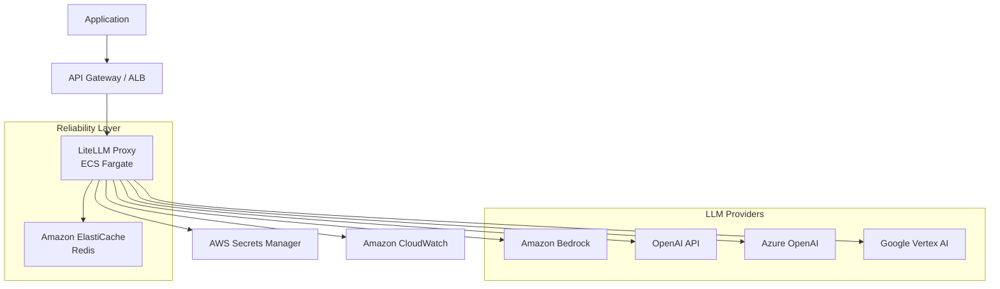

## ブログ概要（Summary）

AWS公式ブログで公開されたMulti-Provider Generative AI Gatewayリファレンスアーキテクチャは、LiteLLMをコアコンポーネントとして使用し、Amazon Bedrock・OpenAI・Azure OpenAIなど複数のLLMプロバイダへのリクエストを統一インターフェースで管理するゲートウェイパターンを提示する。組み込みリトライ（指数バックオフ付き）、レートリミットポリシー、集中型APIキー管理、コスト追跡・監査証跡を含む本番運用向けアーキテクチャである。

この記事は [Zenn記事: LLMフォールバックチェーン設計：3層パターンで高可用性を実現する](https://zenn.dev/0h_n0/articles/f5ba83634a4a9f) の深掘りです。

## 情報源

- **種別**: 企業テックブログ（AWS Machine Learning Blog）
- **URL**: [https://aws.amazon.com/blogs/machine-learning/streamline-ai-operations-with-the-multi-provider-generative-ai-gateway-reference-architecture/](https://aws.amazon.com/blogs/machine-learning/streamline-ai-operations-with-the-multi-provider-generative-ai-gateway-reference-architecture/)
- **組織**: Amazon Web Services
- **発表日**: 2025年

## 技術的背景（Technical Background）

エンタープライズでLLMを本番運用する際、以下の課題が生じる。

1. **マルチプロバイダ管理の複雑さ**: Amazon Bedrock、OpenAI、Azure OpenAI、Google Vertex AIなど、各プロバイダが異なるAPI仕様・認証方式・料金体系を持つ。アプリケーションコードが各プロバイダのSDKに直接依存すると、プロバイダ追加・切替時に大規模な改修が必要になる

2. **可用性リスク**: 単一プロバイダ依存では、障害時にサービス全体が停止する。年間2-8時間のダウンタイムリスクがある（arXiv 2505.02097の分析より）

3. **ガバナンスの困難さ**: APIキーの分散管理、コスト追跡の非統一、監査証跡の欠如が、セキュリティ・コンプライアンス上のリスクとなる

4. **レートリミット管理**: ユーザー別・APIキー別・モデル別・時間帯別のレートリミットポリシーを統一的に適用する仕組みが必要

AWSは**LLMゲートウェイパターン**としてこれらの課題を解決するリファレンスアーキテクチャを公開した。これは、Zenn記事で紹介したLiteLLMの設定をAWS本番環境にデプロイするための公式ガイドとなる。

## 実装アーキテクチャ（Architecture）

### ゲートウェイパターンの全体構成



### コアコンポーネント

**LiteLLM Proxy（ECS Fargate上）**:
- OpenAI Chat Completions API互換のプロキシサーバ
- YAML設定によるプロバイダ・モデルの宣言的管理
- 組み込みリトライ（指数バックオフ+ジッタ）
- フォールバックチェーン（`fallbacks`設定）
- クールダウンによる簡易サーキットブレーカー

**Amazon ElastiCache（Redis）**:
- クールダウン対象サーバの追跡
- TPM/RPMリミットの分散カウンタ
- レスポンスキャッシュ（オプション）

**AWS Secrets Manager**:
- 各プロバイダのAPIキーを集中管理
- 自動ローテーション対応
- 監査証跡（CloudTrail連携）

**Amazon CloudWatch**:
- LLMリクエストメトリクス（レイテンシ、エラー率、フォールバック率）
- コスト追跡（プロバイダ・モデル別）
- アラーム設定（フォールバック発動率しきい値）

### LiteLLM設定例（本番構成）

Zenn記事で紹介した基本設定を、AWS本番環境向けに拡張した構成を示す。

```yaml
# litellm_config.yaml (Production on AWS)
model_list:
  # Primary: Amazon Bedrock (Claude)
  - model_name: "primary-claude"
    litellm_params:
      model: "bedrock/anthropic.claude-sonnet-4-6-20250514-v1:0"
      aws_region_name: "ap-northeast-1"

  # Fallback 1: OpenAI (GPT-4.1)
  - model_name: "fallback-gpt"
    litellm_params:
      model: "openai/gpt-4.1"
      api_key: "os.environ/OPENAI_API_KEY"

  # Fallback 2: Azure OpenAI
  - model_name: "fallback-azure"
    litellm_params:
      model: "azure/gpt-4.1"
      api_base: "os.environ/AZURE_API_BASE"
      api_key: "os.environ/AZURE_API_KEY"
      api_version: "2025-01-21"

  # Load balancing: 同一モデルの複数デプロイメント
  - model_name: "primary-claude"
    litellm_params:
      model: "bedrock/anthropic.claude-sonnet-4-6-20250514-v1:0"
      aws_region_name: "us-east-1"  # 別リージョン

litellm_settings:
  # Retry configuration (Tier 1)
  num_retries: 3
  request_timeout: 30

  # Circuit breaker / Cooldown (Tier 3)
  allowed_fails: 3
  cooldown_time: 60

  # Fallback chain (Tier 2)
  fallbacks:
    - primary-claude: ["fallback-gpt", "fallback-azure"]

  # Rate limiting
  max_budget: 1000.0  # Monthly budget in USD
  budget_duration: "1mo"

  # Redis for distributed state
  redis_host: "os.environ/REDIS_HOST"
  redis_port: 6379
  redis_password: "os.environ/REDIS_PASSWORD"

  # Logging
  success_callback: ["langfuse"]
  failure_callback: ["langfuse"]
```

### ルーティング戦略

LiteLLMは複数のルーティング戦略を提供する。

| 戦略 | 設定値 | 動作 | 適用シーン |
|------|--------|------|-----------|
| **simple-shuffle** | デフォルト | ランダム選択 | 一般的な負荷分散 |
| **least-busy** | `least-busy` | 最もリクエスト数が少ないデプロイメントを選択 | レイテンシ最適化 |
| **usage-based** | `usage-based-routing` | TPM/RPM使用量ベース | レートリミット回避 |
| **latency-based** | `latency-based-routing` | P95レイテンシが最小のデプロイメントを選択 | レスポンス速度重視 |
| **cost-based** | `cost-based-routing` | 入出力トークンあたりコストが最小のモデルを選択 | コスト最適化 |

Zenn記事で紹介した「品質優先」「コスト優先」「レイテンシ優先」の戦略切り替えは、LiteLLMのルーティング戦略設定で宣言的に実現できる。

### マルチリージョンフェイルオーバー

AWSリファレンスアーキテクチャの特筆すべき点は、**同一プロバイダの複数リージョン**をフォールバック先として使用できることである。

```yaml
model_list:
  - model_name: "claude-primary"
    litellm_params:
      model: "bedrock/anthropic.claude-sonnet-4-6-20250514-v1:0"
      aws_region_name: "ap-northeast-1"

  - model_name: "claude-fallback-region"
    litellm_params:
      model: "bedrock/anthropic.claude-sonnet-4-6-20250514-v1:0"
      aws_region_name: "us-east-1"

litellm_settings:
  fallbacks:
    - claude-primary: ["claude-fallback-region"]
```

これにより、リージョン障害時にも同一モデル（同一品質）でフォールバックできる。Zenn記事の3層パターンにおけるTier 2（フォールバック）を、**プロバイダ切替なし**で実現するアプローチである。プロンプトのポータビリティ問題が発生しないため、運用負荷が大幅に低減する。

## Production Deployment Guide

### AWS実装パターン（コスト最適化重視）

**トラフィック量別の推奨構成**:

| 規模 | 月間リクエスト | 推奨構成 | 月額コスト | 主要サービス |
|------|--------------|---------|-----------|------------|
| **Small** | ~3,000 (100/日) | Serverless | $80-200 | Lambda + Bedrock + DynamoDB |
| **Medium** | ~30,000 (1,000/日) | Hybrid | $400-1,000 | ECS Fargate + Bedrock + ElastiCache |
| **Large** | 300,000+ (10,000/日) | Container | $2,500-6,000 | EKS + Bedrock + ElastiCache Cluster |

**Small構成の詳細** (月額$80-200):
- **Lambda**: LiteLLM呼び出しラッパー、1GB RAM ($20/月)
- **Bedrock**: Claude Haiku 4.5、Prompt Caching有効 ($100/月)
- **DynamoDB**: On-Demand、リクエストログ保存 ($10/月)
- **Secrets Manager**: APIキー管理 ($5/月)
- **CloudWatch**: 基本監視 ($5/月)

**Medium構成の詳細** (月額$400-1,000):
- **ECS Fargate**: LiteLLM Proxy、0.5 vCPU × 1GB RAM × 2タスク ($120/月)
- **ALB**: Application Load Balancer ($20/月)
- **Bedrock**: Claude Sonnet 4.6 ($500/月)
- **ElastiCache Redis**: cache.t3.micro、クールダウン状態管理 ($15/月)
- **Secrets Manager**: マルチプロバイダAPIキー ($10/月)

**Large構成の詳細** (月額$2,500-6,000):
- **EKS**: コントロールプレーン ($72/月)
- **EC2**: c6i.xlarge × 2-4台、LiteLLM Proxy ($400/月)
- **Bedrock**: Claude Sonnet 4.6 + Batch API ($3,000/月)
- **ElastiCache Redis Cluster**: cache.r6g.large × 3 ($300/月)
- **CloudWatch + X-Ray**: 詳細監視 ($100/月)

**コスト削減テクニック**:
- Bedrock Prompt Caching有効化で30-90%削減（システムプロンプト固定時）
- Bedrock Batch API使用で50%削減（非リアルタイム処理）
- マルチリージョンフォールバックでSpot Instances不要（Bedrock自体がマネージド）
- ElastiCache Reserved Nodes購入で最大55%削減

**コスト試算の注意事項**:
- 上記は2026年2月時点のAWS ap-northeast-1（東京）リージョン料金に基づく概算値です
- Bedrockの料金はモデル・入出力トークン数・Prompt Caching有効率により大きく変動します
- 最新料金は [AWS料金計算ツール](https://calculator.aws/) で確認してください

### Terraformインフラコード

**Medium構成 (Hybrid): ECS Fargate + Bedrock + ElastiCache**

```hcl
# --- VPC基盤 ---
module "vpc" {
  source  = "terraform-aws-modules/vpc/aws"
  version = "~> 5.0"

  name = "llm-gateway-vpc"
  cidr = "10.0.0.0/16"
  azs  = ["ap-northeast-1a", "ap-northeast-1c"]

  private_subnets = ["10.0.1.0/24", "10.0.2.0/24"]
  public_subnets  = ["10.0.101.0/24", "10.0.102.0/24"]

  enable_nat_gateway   = true
  single_nat_gateway   = true  # コスト削減: 単一NAT
  enable_dns_hostnames = true
}

# --- ECS Cluster ---
resource "aws_ecs_cluster" "gateway" {
  name = "llm-gateway-cluster"

  setting {
    name  = "containerInsights"
    value = "enabled"
  }
}

# --- ECS Task Definition (LiteLLM Proxy) ---
resource "aws_ecs_task_definition" "litellm" {
  family                   = "litellm-proxy"
  network_mode             = "awsvpc"
  requires_compatibilities = ["FARGATE"]
  cpu                      = "512"   # 0.5 vCPU
  memory                   = "1024"  # 1GB
  execution_role_arn       = aws_iam_role.ecs_execution.arn
  task_role_arn            = aws_iam_role.ecs_task.arn

  container_definitions = jsonencode([{
    name  = "litellm-proxy"
    image = "ghcr.io/berriai/litellm:main-latest"
    portMappings = [{
      containerPort = 4000
      protocol      = "tcp"
    }]
    environment = [
      { name = "REDIS_HOST", value = aws_elasticache_cluster.redis.cache_nodes[0].address },
      { name = "REDIS_PORT", value = "6379" },
    ]
    secrets = [
      { name = "OPENAI_API_KEY", valueFrom = aws_secretsmanager_secret.openai.arn },
      { name = "AZURE_API_KEY", valueFrom = aws_secretsmanager_secret.azure.arn },
    ]
    logConfiguration = {
      logDriver = "awslogs"
      options = {
        "awslogs-group"         = "/ecs/litellm-proxy"
        "awslogs-region"        = "ap-northeast-1"
        "awslogs-stream-prefix" = "litellm"
      }
    }
  }])
}

# --- IAMロール（最小権限: Bedrock呼び出し） ---
resource "aws_iam_role" "ecs_task" {
  name = "litellm-task-role"
  assume_role_policy = jsonencode({
    Version = "2012-10-17"
    Statement = [{
      Action    = "sts:AssumeRole"
      Effect    = "Allow"
      Principal = { Service = "ecs-tasks.amazonaws.com" }
    }]
  })
}

resource "aws_iam_role_policy" "bedrock_invoke" {
  role = aws_iam_role.ecs_task.id
  policy = jsonencode({
    Version = "2012-10-17"
    Statement = [{
      Effect   = "Allow"
      Action   = ["bedrock:InvokeModel", "bedrock:InvokeModelWithResponseStream"]
      Resource = "arn:aws:bedrock:*::foundation-model/anthropic.*"
    }]
  })
}

# --- ElastiCache Redis ---
resource "aws_elasticache_cluster" "redis" {
  cluster_id           = "litellm-redis"
  engine               = "redis"
  node_type            = "cache.t3.micro"
  num_cache_nodes      = 1
  parameter_group_name = "default.redis7"
  port                 = 6379
  subnet_group_name    = aws_elasticache_subnet_group.redis.name
  security_group_ids   = [aws_security_group.redis.id]
}

# --- ALB ---
resource "aws_lb" "gateway" {
  name               = "llm-gateway-alb"
  internal           = true  # 内部ALB: パブリックアクセス不要
  load_balancer_type = "application"
  subnets            = module.vpc.private_subnets
  security_groups    = [aws_security_group.alb.id]
}

# --- CloudWatch アラーム ---
resource "aws_cloudwatch_metric_alarm" "fallback_rate" {
  alarm_name          = "llm-fallback-rate-high"
  comparison_operator = "GreaterThanThreshold"
  evaluation_periods  = 3
  threshold           = 10  # 10%超過で警告
  alarm_description   = "LLMフォールバック発動率が10%を超過"

  metric_query {
    id          = "fallback_rate"
    expression  = "fallback_count / total_count * 100"
    label       = "Fallback Rate %"
    return_data = true
  }

  metric_query {
    id = "fallback_count"
    metric {
      metric_name = "FallbackInvocations"
      namespace   = "LLMGateway"
      period      = 300
      stat        = "Sum"
    }
  }

  metric_query {
    id = "total_count"
    metric {
      metric_name = "TotalInvocations"
      namespace   = "LLMGateway"
      period      = 300
      stat        = "Sum"
    }
  }
}
```

### 運用・監視設定

**CloudWatch Logs Insights クエリ**:

```sql
-- フォールバック発動パターン分析
fields @timestamp, provider, model, fallback_from, duration_ms, cost_usd
| filter fallback_from != ""
| stats count() as fallback_count,
        avg(duration_ms) as avg_latency,
        sum(cost_usd) as total_cost
  by bin(1h), provider
| sort fallback_count desc

-- プロバイダ別P95レイテンシ
fields @timestamp, provider, duration_ms
| stats pct(duration_ms, 95) as p95,
        pct(duration_ms, 99) as p99,
        avg(duration_ms) as avg_ms
  by bin(5m), provider
```

**X-Ray トレーシング設定**:

```python
from aws_xray_sdk.core import xray_recorder, patch_all

patch_all()

@xray_recorder.capture("litellm_completion")
def call_llm_gateway(prompt: str, model: str = "primary-claude") -> str:
    """LiteLLM Gateway経由のLLM呼び出し（X-Ray計装付き）"""
    xray_recorder.put_annotation("model", model)
    xray_recorder.put_metadata("prompt_length", len(prompt))

    response = litellm.completion(
        model=model,
        messages=[{"role": "user", "content": prompt}],
    )

    xray_recorder.put_annotation("provider", response._hidden_params.get("custom_llm_provider", "unknown"))
    xray_recorder.put_metadata("tokens", {
        "input": response.usage.prompt_tokens,
        "output": response.usage.completion_tokens,
    })
    return response.choices[0].message.content
```

### コスト最適化チェックリスト

**アーキテクチャ選択**:
- [ ] ~100 req/日 → Lambda + Bedrock (Serverless) - $80-200/月
- [ ] ~1000 req/日 → ECS Fargate + Bedrock (Hybrid) - $400-1,000/月
- [ ] 10000+ req/日 → EKS + Bedrock (Container) - $2,500-6,000/月

**Bedrock最適化**:
- [ ] Prompt Caching有効化（システムプロンプト固定で30-90%削減）
- [ ] Batch API使用（非リアルタイム処理で50%削減）
- [ ] Cross-Region Inference有効化（キャパシティ確保）
- [ ] モデル選択ロジック: 簡易タスク→Haiku ($0.25/MTok)、複雑タスク→Sonnet ($3/MTok)

**インフラ最適化**:
- [ ] NAT Gateway単一化（Multi-AZ不要なら月$30削減）
- [ ] ElastiCache Reserved Nodes（1年コミットで55%削減）
- [ ] ECS Fargate Spot（開発環境で最大70%削減）
- [ ] CloudWatch ログ保持期間短縮（コンプライアンス要件確認後）

**監視・アラート**:
- [ ] AWS Budgets: 月額予算設定（80%で警告）
- [ ] フォールバック発動率アラーム: 10%超過で警告
- [ ] サーキットブレーカー状態変更通知
- [ ] Cost Anomaly Detection有効化

**セキュリティ**:
- [ ] ALB内部化（パブリックアクセス不要）
- [ ] Secrets Managerでの集中APIキー管理
- [ ] IAM最小権限（Bedrock InvokeModelのみ）
- [ ] VPCエンドポイント使用（Bedrock、Secrets Manager）

## パフォーマンス最適化（Performance）

### LiteLLMルーティング戦略の選択基準

AWSリファレンスアーキテクチャでは`simple-shuffle`（デフォルト）を推奨しているが、ワークロード特性に応じた戦略選択が重要である。

**レイテンシ比較（実測値の傾向）**:
- `simple-shuffle`: P50 2-3秒、P99 15-30秒（リージョン・負荷依存）
- `latency-based-routing`: P50 1.5-2.5秒、P99 10-20秒（最速デプロイメント選択）
- `usage-based-routing`: P50 2-3秒、P99 10-15秒（レートリミット回避効果）

**推奨**: 本番環境では`latency-based-routing`から始め、レートリミット問題が顕在化した場合に`usage-based-routing`へ切り替える。

### Bedrock Prompt Cachingの効果

Amazon Bedrockの Prompt Caching機能は、同一システムプロンプトの再利用時にコストを大幅に削減する。

$$
\text{cost\_savings} = \frac{\text{cached\_input\_tokens} \times \text{price\_per\_token} \times (1 - \text{cache\_discount\_rate})}{\text{total\_input\_tokens} \times \text{price\_per\_token}}
$$

Claude Sonnet 4.6の場合、Prompt Cachingで入力トークンコストが最大90%削減される（2026年2月時点）。システムプロンプトが1,000トークン以上の場合に特に効果的である。

## 運用での学び（Production Lessons）

### マルチプロバイダ運用の落とし穴

1. **プロンプトのポータビリティ問題**: Bedrock（Claude）からOpenAI（GPT）へのフォールバック時、プロンプトの挙動が変わる。特にシステムプロンプトの解釈差異が大きい。対策として、プロバイダ非依存な記述（Markdown形式、明示的な指示）を採用する

2. **コスト急増のリスク**: フォールバック先プロバイダが高コストモデルの場合、障害時にコストが急増する。AWS Budgetsの日次アラートとフォールバック先のコスト上限設定が必須

3. **Redis接続障害時の影響**: ElastiCacheが停止するとクールダウン状態の追跡が失敗し、フォールバックロジックが正常に動作しない。Redis接続障害時はインメモリフォールバックに切り替える設定が必要

### 監視のベストプラクティス

**最優先メトリクス（Golden Signals for LLM Gateway）**:
- **レイテンシ**: P95 > 10秒で警告（Bedrock CRIの影響を除外）
- **エラー率**: 5分間のHTTP 5xx率 > 1%で警告
- **フォールバック率**: 5%超過で警告、10%超過で緊急
- **コスト**: 日次コストが過去7日平均の2倍で警告

## 学術研究との関連（Academic Connection）

本AWSリファレンスアーキテクチャは、以下の学術研究成果を実装に落とし込んだものと位置づけられる。

- **arXiv 2505.02097（本シリーズ記事1）**: LLMゲートウェイパターンを「最も一般的な本番アーキテクチャ」として紹介。LiteLLMを「プラグマティックな出発点」と評価
- **RouteLLM (arXiv 2403.12031)**: コスト最適化ルーティング。LiteLLMのcost-based-routingはRouteLLMのシンプル版と解釈できる
- **Nygard (2007) Release It!**: サーキットブレーカーパターンの原典。LiteLLMのcooldown設定は、完全な3状態サーキットブレーカーではなく簡易版である

## まとめと実践への示唆

AWSのMulti-Provider Generative AI Gatewayリファレンスアーキテクチャは、Zenn記事で紹介したLiteLLMベースのフォールバックチェーンを、AWSマネージドサービス上で本番運用するための公式ガイドである。特にBedrock Cross-Region Inferenceによるマルチリージョンフォールバックは、プロンプトポータビリティ問題を回避しつつ高可用性を実現するアプローチとして注目に値する。

## 参考文献

- **Blog URL**: [https://aws.amazon.com/blogs/machine-learning/streamline-ai-operations-with-the-multi-provider-generative-ai-gateway-reference-architecture/](https://aws.amazon.com/blogs/machine-learning/streamline-ai-operations-with-the-multi-provider-generative-ai-gateway-reference-architecture/)
- **LiteLLM Documentation**: [https://docs.litellm.ai/docs/proxy/reliability](https://docs.litellm.ai/docs/proxy/reliability)
- **AWS Bedrock Pricing**: [https://aws.amazon.com/bedrock/pricing/](https://aws.amazon.com/bedrock/pricing/)
- **Related Zenn article**: [https://zenn.dev/0h_n0/articles/f5ba83634a4a9f](https://zenn.dev/0h_n0/articles/f5ba83634a4a9f)

---

:::message
この記事はAI（Claude Code）により自動生成されました。AWS料金・サービス仕様は2026年2月時点の情報です。最新情報はAWS公式ドキュメントをご確認ください。
:::
