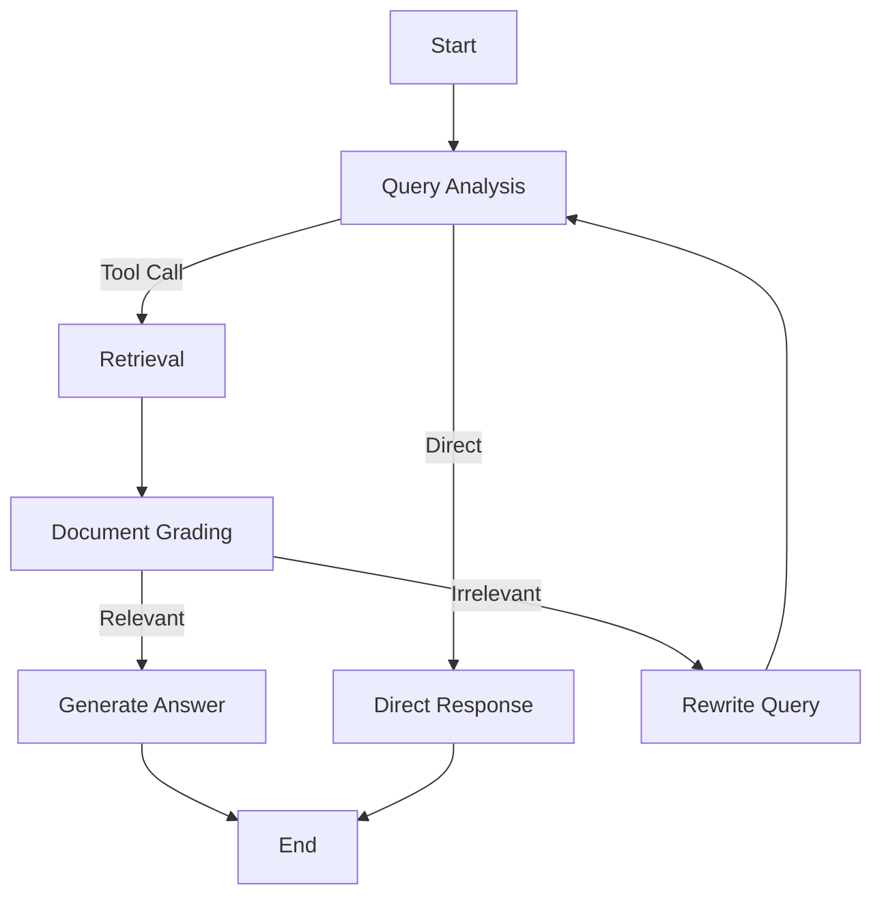

## ブログ概要（Summary）

LangChain公式のLangGraph Adaptive RAGチュートリアルは、LLMが検索の要否を自律的に判断し、検索結果の品質を評価し、必要に応じてクエリを書き換えるエージェント型RAGシステムの構築方法を解説しています。文書の前処理、セマンティック検索インデックスの構築、エージェント的な意思決定の3つの能力を統合したシステムで、条件分岐とフィードバックループを持つグラフ構造を実装します。

この記事は [Zenn記事: LangGraph動的検索ルーティング実装：クエリ分類×マルチリトリーバーでQA精度を向上させる](https://zenn.dev/0h_n0/articles/3b9f2fd87ffb09) の深掘りです。

## 情報源

- **種別**: 企業テックブログ（公式チュートリアル）
- **URL**: [https://langchain-ai.github.io/langgraph/tutorials/rag/langgraph_adaptive_rag/](https://langchain-ai.github.io/langgraph/tutorials/rag/langgraph_adaptive_rag/)
- **組織**: LangChain / LangGraph
- **発表日**: 2024-2025（随時更新）

## 技術的背景（Technical Background）

従来のRAGシステムは「検索→生成」の固定パイプラインでしたが、以下の問題がありました：

1. **不要な検索**: LLMの内部知識で回答可能な質問にも検索を実行
2. **検索結果の品質未検証**: 関連性の低い文書をそのまま生成に使用
3. **リカバリー手段の欠如**: 検索失敗時のフォールバックがない

LangGraph Adaptive RAGは、これらの問題をグラフベースのワークフローで解決します。LangGraphのステートマシンとCondtional Edgeにより、検索の要否判断 → 文書品質評価 → クエリ書き換え のフィードバックループを構成します。

## 実装アーキテクチャ（Architecture）

### 全体フロー

Adaptive RAGは以下の5つのノードで構成されるグラフです：



### ノード1: クエリ分析（Query Analysis）

LLMがユーザー入力を分析し、検索が必要かどうかを判断します。Tool Callingの仕組みを活用し、検索ツールを呼び出すか直接回答するかを自律的に決定します：

```python
from langgraph.graph import StateGraph, MessagesState, START, END
from langchain_openai import ChatOpenAI

llm = ChatOpenAI(model="gpt-4o-mini", temperature=0)

# 検索ツールの定義
retriever_tool = create_retriever_tool(
    retriever,
    name="retrieve_documents",
    description="社内文書から関連情報を検索する。"
    "技術的な質問やドメイン固有の質問に使用。"
    "一般知識の質問には使用しない。",
)

# ツール付きLLM
llm_with_tools = llm.bind_tools([retriever_tool])
```

**設計のポイント**: ツールのdescriptionが検索の要否判断に直接影響します。「一般知識の質問には使用しない」という否定条件を明記することで、不要な検索を抑制しています。これはZenn記事の「汎用知識→LLM直接回答」パターンと同等です。

### ノード2: 検索実行（Retrieval）

Tool Callが検出された場合、`ToolNode`で検索を実行します。LangGraphのToolNodeは、LLMのTool Calling出力を受け取り、対応するツールを実行して結果をメッセージに追加します：

```python
from langgraph.prebuilt import ToolNode

# ToolNodeが自動でツール呼び出しを処理
retrieve_node = ToolNode([retriever_tool])
```

### ノード3: 文書グレーディング（Document Grading）

検索された各文書の関連性を評価する品質管理ステップです。Structured Outputを使用してバイナリ判定を行います：

```python
from pydantic import BaseModel, Field

class GradeDocument(BaseModel):
    """文書の関連性グレーディング"""
    binary_score: str = Field(
        description="'yes' if relevant, 'no' if not"
    )

grader_llm = llm.with_structured_output(GradeDocument)

def grade_documents(state: MessagesState) -> dict:
    """検索された文書の関連性を判定

    各文書をLLMで評価し、関連性ありの文書のみ保持。
    全て非関連の場合はクエリ書き換えにルーティング。
    """
    question = state["messages"][0].content
    documents = get_retrieved_docs(state["messages"])

    relevant_docs = []
    for doc in documents:
        result = grader_llm.invoke(
            f"ユーザー質問: {question}\n"
            f"文書内容: {doc}\n"
            f"この文書は質問に関連していますか？"
        )
        if result.binary_score == "yes":
            relevant_docs.append(doc)

    if relevant_docs:
        return {"messages": [create_context_message(relevant_docs)]}
    else:
        return {"messages": [SystemMessage(content="REWRITE_NEEDED")]}
```

このGraderは、Zenn記事の`GradeDocuments`モデルおよび`grade_documents`ノードと同一の設計パターンです。Zenn記事ではさらに`retry_count`による最大リトライ回数の制限とfallbackノードへの分岐を実装しています。

### ノード4: クエリ書き換え（Query Rewrite）

文書グレーディングで関連文書がゼロだった場合、クエリを書き換えて再検索します：

```python
def rewrite_query(state: MessagesState) -> dict:
    """クエリを書き換えて検索精度を改善

    元のクエリの意味的意図を推論し、
    より具体的な検索クエリに変換する。
    """
    original_query = state["messages"][0].content

    rewritten = llm.invoke(
        f"以下の質問を分析し、underlying semantic intentを推論して、"
        f"検索に適した形に書き換えてください:\n"
        f"元の質問: {original_query}"
    )

    return {"messages": [HumanMessage(content=rewritten.content)]}
```

**公式チュートリアルの表現**: "Look at the input and try to reason about the underlying semantic intent" — 単なるパラフレーズではなく、意味的意図を推論した上で検索最適化されたクエリを生成する点が重要です。

### ノード5: 回答生成（Generate Answer）

関連性が確認された文書を使用して最終回答を生成します：

```python
def generate_answer(state: MessagesState) -> dict:
    """検索された文書を基に回答を生成

    検索結果をコンテキストとして、簡潔な回答を生成。
    """
    question = state["messages"][0].content
    context = get_relevant_context(state["messages"])

    answer = llm.invoke(
        f"以下の文書を基に質問に回答してください。"
        f"3文以内で簡潔に回答すること。\n\n"
        f"文書: {context}\n"
        f"質問: {question}"
    )

    return {"messages": [AIMessage(content=answer.content)]}
```

### グラフ組み立てとConditional Edge

```python
from langgraph.graph import StateGraph, MessagesState, START, END

workflow = StateGraph(MessagesState)

# ノード追加
workflow.add_node("query_analysis", query_analysis)
workflow.add_node("retrieve", retrieve_node)
workflow.add_node("grade_documents", grade_documents)
workflow.add_node("rewrite_query", rewrite_query)
workflow.add_node("generate", generate_answer)

# エッジ定義
workflow.add_edge(START, "query_analysis")

# Conditional Edge: Tool Callの有無で分岐
workflow.add_conditional_edges(
    "query_analysis",
    route_query,
    {
        "retrieve": "retrieve",
        "direct": "generate",
    }
)

workflow.add_edge("retrieve", "grade_documents")

# Conditional Edge: 文書品質で分岐
workflow.add_conditional_edges(
    "grade_documents",
    route_after_grading,
    {
        "relevant": "generate",
        "rewrite": "rewrite_query",
    }
)

# 書き換え後は再度クエリ分析へ（フィードバックループ）
workflow.add_edge("rewrite_query", "query_analysis")
workflow.add_edge("generate", END)

app = workflow.compile()
```

### Zenn記事との対応

| 公式チュートリアル | Zenn記事 | 違い |
|---------------|---------|------|
| query_analysis | classify_and_route | Zenn記事は4分類で検索手法も選択 |
| retrieve | retrieve_bm25/vector/hybrid | Zenn記事はマルチリトリーバー |
| grade_documents | grade_documents | 同一パターン |
| rewrite_query | rewrite_question | 同一パターン |
| generate | generate | 同一パターン |
| (なし) | generate_direct | Zenn記事は汎用知識に直接回答 |
| (なし) | fallback | Zenn記事はリトライ上限後のfallback |

Zenn記事は公式チュートリアルをベースに、**マルチリトリーバー対応**と**リトライ制限+fallback**を追加した発展型です。

## Production Deployment Guide

### AWS実装パターン（コスト最適化重視）

| 規模 | 月間リクエスト | 推奨構成 | 月額コスト | 主要サービス |
|------|--------------|---------|-----------|------------|
| **Small** | ~3,000 (100/日) | Serverless | $50-150 | Lambda + Bedrock + OpenSearch Serverless |
| **Medium** | ~30,000 (1,000/日) | Hybrid | $300-800 | ECS Fargate + Bedrock + ElastiCache |
| **Large** | 300,000+ (10,000/日) | Container | $2,000-5,000 | EKS + Karpenter + EC2 Spot |

**Small構成の詳細** (月額$50-150):
- **Lambda**: 1GB RAM, 60秒タイムアウト ($20/月) — LangGraphワークフロー実行
- **Bedrock**: Claude 3.5 Haiku ($80/月) — クエリ分析+グレーディング+生成
- **OpenSearch Serverless**: ($40/月) — ベクトル検索インデックス
- **CloudWatch**: 基本監視 ($5/月)

**コスト削減テクニック**:
- クエリ分析で検索不要と判断した場合、OpenSearch呼び出しをスキップ（30-40%のコスト削減）
- Bedrock Prompt Caching: グレーディング用システムプロンプトを固定
- Lambda Provisioned Concurrency: コールドスタート回避（対話型システムの場合）

**コスト試算の注意事項**:
- 上記は2026年2月時点のAWS ap-northeast-1（東京）リージョン料金に基づく概算値です
- 最新料金は [AWS料金計算ツール](https://calculator.aws/) で確認してください

### Terraformインフラコード

```hcl
# --- Lambda（LangGraphワークフロー実行） ---
resource "aws_lambda_function" "langgraph_adaptive_rag" {
  filename      = "langgraph_rag.zip"
  function_name = "langgraph-adaptive-rag"
  role          = aws_iam_role.langgraph_lambda.arn
  handler       = "app.handler"
  runtime       = "python3.12"
  timeout       = 60
  memory_size   = 1024

  environment {
    variables = {
      BEDROCK_MODEL_ID     = "anthropic.claude-3-5-haiku-20241022-v1:0"
      OPENSEARCH_ENDPOINT  = aws_opensearchserverless_collection.docs.collection_endpoint
      MAX_RETRY_COUNT      = "2"
      ENABLE_GRADING       = "true"
    }
  }
}

# --- OpenSearch Serverless ---
resource "aws_opensearchserverless_collection" "docs" {
  name = "adaptive-rag-docs"
  type = "VECTORSEARCH"
}

# --- CloudWatch アラーム ---
resource "aws_cloudwatch_metric_alarm" "rewrite_rate" {
  alarm_name          = "high-rewrite-rate"
  comparison_operator = "GreaterThanThreshold"
  evaluation_periods  = 3
  metric_name         = "RewriteCount"
  namespace           = "AdaptiveRAG"
  period              = 300
  statistic           = "Average"
  threshold           = 0.5
  alarm_description   = "クエリ書き換え率が50%超過（検索品質低下の兆候）"
}
```

### 運用・監視設定

**CloudWatch カスタムメトリクス**:

```python
import boto3

cloudwatch = boto3.client('cloudwatch')

def publish_rag_metrics(
    query_type: str,
    retrieval_skipped: bool,
    grading_result: str,
    rewrite_count: int,
    latency_ms: float,
) -> None:
    """Adaptive RAGのカスタムメトリクスをCloudWatchに送信"""
    cloudwatch.put_metric_data(
        Namespace='AdaptiveRAG',
        MetricData=[
            {
                'MetricName': 'RetrievalSkipped',
                'Value': 1.0 if retrieval_skipped else 0.0,
                'Unit': 'Count',
            },
            {
                'MetricName': 'RewriteCount',
                'Value': float(rewrite_count),
                'Unit': 'Count',
            },
            {
                'MetricName': 'Latency',
                'Value': latency_ms,
                'Unit': 'Milliseconds',
            },
        ]
    )
```

### コスト最適化チェックリスト

- [ ] クエリ分析による検索スキップ率の監視（目標: 30-40%）
- [ ] クエリ書き換え率の監視（50%超過は検索インデックスの品質問題）
- [ ] Bedrock Prompt Caching有効化
- [ ] OpenSearch Serverlessのキャパシティ自動調整
- [ ] Lambda メモリサイズの最適化（1024MB推奨）
- [ ] AWS Budgets: 月額予算アラート設定

## パフォーマンス最適化（Performance）

### レイテンシ分析

| パス | LLM呼び出し回数 | 推定レイテンシ |
|------|----------------|-------------|
| 直接回答（検索スキップ） | 1回 | 200ms |
| 検索→生成（グレーディングOK） | 3回 | 800ms |
| 検索→書き換え→再検索→生成 | 5回 | 1500ms |

クエリ書き換えループの最大回数を制限することで、最悪ケースのレイテンシを制御できます。Zenn記事の`retry_count >= 2`による制限は、レイテンシ管理の観点でも合理的です。

### ボトルネック特定

1. **文書グレーディング**: 文書ごとにLLM呼び出しが発生。5文書なら5回。バッチ処理で最適化可能
2. **Embedding計算**: OpenSearchへのベクトル検索は通常50ms以下。ボトルネックにならない
3. **クエリ書き換え**: LLM呼び出し1回。レイテンシの主要因ではない

## 運用での学び（Production Lessons）

1. **ツールDescription の重要性**: 検索ツールのdescriptionが曖昧だと、不要な検索が増加しコストが膨張する。否定条件（「〇〇には使用しない」）を明記することで検索スキップ率が向上
2. **グレーディングの閾値調整**: binary判定（yes/no）では中間的な関連性の文書を一律に排除してしまう。スコアベースのグレーディング（0-10点）への移行でRecall改善
3. **フィードバックループの制限**: クエリ書き換え→再検索のループは最大2回に制限。3回以上は精度改善が飽和し、コストだけが増加

## 学術研究との関連（Academic Connection）

公式チュートリアルのAdaptive RAGは、以下の研究を実装ベースに落とし込んだものです：

- **Self-RAG** (Asai et al., 2023): 検索の必要性を自己判断する仕組み → ツール呼び出し判断に対応
- **CRAG** (Yan et al., 2024): 検索結果の品質を評価し修正 → 文書グレーディング+クエリ書き換えに対応
- **Adaptive-RAG** (Jeong et al., 2024): クエリ複雑度に応じた検索深度の動的制御 → クエリ分析ノードに対応

## まとめと実践への示唆

LangChain公式のAdaptive RAGチュートリアルは、検索の要否判断・文書品質評価・クエリ書き換えの3段階フィードバックループを実装する基盤パターンを提供しています。Zenn記事はこのパターンをマルチリトリーバー（BM25/ベクトル/ハイブリッド）対応に拡張し、Command APIによる動的ルーティングを追加しています。本チュートリアルを出発点として、Zenn記事の拡張パターンに進むことを推奨します。

## 参考文献

- **Tutorial URL**: [https://langchain-ai.github.io/langgraph/tutorials/rag/langgraph_adaptive_rag/](https://langchain-ai.github.io/langgraph/tutorials/rag/langgraph_adaptive_rag/)
- **LangGraph Documentation**: [https://docs.langchain.com/oss/python/langgraph](https://docs.langchain.com/oss/python/langgraph)
- **Related Zenn article**: [https://zenn.dev/0h_n0/articles/3b9f2fd87ffb09](https://zenn.dev/0h_n0/articles/3b9f2fd87ffb09)
- **Self-RAG**: [https://arxiv.org/abs/2310.11511](https://arxiv.org/abs/2310.11511)
- **CRAG**: [https://arxiv.org/abs/2401.15884](https://arxiv.org/abs/2401.15884)
