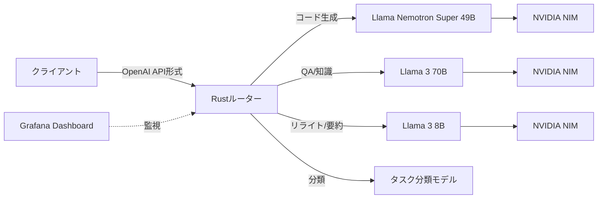

## ブログ概要（Summary）

NVIDIAが公開した**AI Blueprint for Cost-Efficient LLM Routing**は、複数のLLMに対してタスク複雑度ベースでプロンプトを動的ルーティングする本番向けフレームワークです。**Rustベースの高性能ルーター**をTriton Inference Server上に構築し、NVIDIA NIMおよびサードパーティLLM（OpenAI API互換）との統合を実現しています。コード生成は高性能モデル（Llama Nemotron Super 49B）、QAは中規模モデル（Llama 3 70B）、リライトは小規模モデル（Llama 3 8B）に自動振り分けし、品質を維持しつつAPIコストを大幅に削減します。

この記事は [Zenn記事: GeminiとClaudeを使い分けるマルチLLMルーティング実装ガイド](https://zenn.dev/0h_n0/articles/ecc929fbeb5871) の深掘りです。

## 情報源

- **種別**: 企業テックブログ
- **URL**: [https://developer.nvidia.com/blog/deploying-the-nvidia-ai-blueprint-for-cost-efficient-llm-routing/](https://developer.nvidia.com/blog/deploying-the-nvidia-ai-blueprint-for-cost-efficient-llm-routing/)
- **組織**: NVIDIA
- **発表日**: 2025年

## 技術的背景（Technical Background）

LLMの本番運用において、全リクエストを最高性能モデルに送る「一律投入」方式はコスト面で非効率です。Zenn記事で解説したLiteLLMの正規表現ベース分類やRouteLLMの学習ベースルーティングは有効ですが、**推論基盤レベルでの最適化**まで踏み込んだ統合フレームワークは少ない状況でした。NVIDIAのBlueprintは、推論サーバー（Triton）・コンテナ化（NIM）・ルーティングロジックを**単一のデプロイ可能なパッケージ**として提供し、インフラ層からアプリケーション層までを一気通貫で最適化します。

学術研究との関連では、RouteLLM（Ong et al., 2024）の「強弱2モデル選択」を拡張し、**3段階以上のモデルプール**に対するルーティングを実装しています。また、タスク分類モデル自体も軽量に保つことで、ルーティングのオーバーヘッドを最小化しています。

## 実装アーキテクチャ（Architecture）

### システム構成



**コアコンポーネント**:

1. **Rustベースルーター**: Triton Inference Server上で動作し、P95レイテンシを最小化。OpenAI API互換のエンドポイントを提供するため、既存アプリケーションからのドロップイン置換が可能
2. **タスク分類モデル**: 入力プロンプトのカテゴリ（コード生成、QA、リライト等）を高速判定する軽量モデル
3. **NVIDIA NIM**: 各LLMをコンテナ化し、独立してスケーリング可能なマイクロサービスとして提供
4. **Grafana監視**: ルーティング分布、レイテンシ、スループットをリアルタイム可視化

### ルーティング戦略

**タスクベースルーティング（Task-Based Routing）**:

プロンプトの意図を分類し、タスクカテゴリに応じたモデルにルーティングします。

| タスクカテゴリ | 推奨モデル | 根拠 |
|-------------|----------|------|
| コード生成 | Llama Nemotron Super 49B | 高精度な推論・コード能力 |
| Open QA | Llama 3 70B | 知識量と推論のバランス |
| リライト/要約 | Llama 3 8B | 十分な品質で低コスト |
| 数学的推論 | Llama Nemotron Super 49B | 複雑な推論チェーン対応 |
| 創作/文章作成 | Llama 3 70B | 表現力と一貫性 |

Zenn記事のLiteLLMルーター実装における`classify_task()`関数を、NVIDIAは**専用分類モデル**で実現しています。正規表現ベースよりロバストで、RouteLLMの行列分解ルーターに近い学習ベースの判定を行います。

**複雑度ベースルーティング（Complexity-Based Routing）**:

タスクカテゴリに加え、プロンプトの**複雑度**（推論ステップ数、必要な知識の深さ）も考慮します。同じ「コード生成」でも、FizzBuzzは8Bモデル、分散システム設計は49Bモデルに振り分けるといった粒度の制御が可能です。

### マルチターン対話のハンドリング

Blueprintは会話コンテキストを保持しながら、各ターンで最適なモデルを選択します。

```python
# マルチターン対話でのルーティング例
conversation = [
    {"role": "user", "content": "Pythonでソートアルゴリズムを実装して"},
    # → タスク: コード生成 → Nemotron 49B
    {"role": "assistant", "content": "...QuickSort実装..."},
    {"role": "user", "content": "このアルゴリズムの計算量を説明して"},
    # → タスク: 知識QA → Llama 3 70B
    {"role": "assistant", "content": "...O(n log n)の解説..."},
    {"role": "user", "content": "もっと簡潔にまとめて"},
    # → タスク: リライト → Llama 3 8B
]
```

各ターンのコンテキストを維持しつつ、**そのターンのタスク特性に応じてモデルを切り替え**ることで、品質とコストの両立を図ります。

### スケーリング戦略

- **水平スケーリング**: 各NIMインスタンスを独立にスケールアウト。コード生成需要が多い時間帯はNemotron 49Bのインスタンス数を増加
- **GPU最適化**: V100（4GB最小）で動作可能だが、A100/H100でスループット最大化
- **ロードバランシング**: ルーター自体がリクエスト分配を行うため、外部LBは不要

## Production Deployment Guide

### AWS実装パターン（コスト最適化重視）

NVIDIAのBlueprintアーキテクチャをAWS上で構築する場合の推奨構成です。

| 規模 | 月間リクエスト | 推奨構成 | 月額コスト | 主要サービス |
|------|--------------|---------|-----------|------------|
| **Small** | ~3,000 (100/日) | Serverless | $100-300 | Lambda + Bedrock（3モデルtier） |
| **Medium** | ~30,000 (1,000/日) | Hybrid | $800-2,000 | ECS Fargate + Bedrock + ElastiCache |
| **Large** | 300,000+ (10,000/日) | Container | $5,000-12,000 | EKS + NVIDIA NIM on GPU Spot |

**Small構成の詳細** (月額$100-300):
- **Lambda**: ルーティングロジック + 分類器 ($20/月)
- **Bedrock**: Claude 3.5 Haiku（リライト）+ Sonnet（QA）+ Opus（コード） ($200/月)
- **DynamoDB**: ルーティングルールキャッシュ ($10/月)

**Large構成（GPU）の詳細** (月額$5,000-12,000):
- **EKS**: コントロールプレーン ($72/月)
- **EC2 GPU Spot**: g5.xlarge × 2-6台でNIMホスティング ($2,000-6,000/月)
- **Karpenter**: GPU需要に応じた自動スケーリング
- **ALB**: ルーターへのリクエスト分配 ($30/月)

**コスト試算の注意事項**: 上記は2026年2月時点のAWS ap-northeast-1（東京）リージョン料金に基づく概算値です。GPU Spot Instancesの料金はアベイラビリティにより大きく変動します。最新料金は [AWS料金計算ツール](https://calculator.aws/) で確認してください。

### Terraformインフラコード

**Small構成 (Serverless): Lambda + Bedrock マルチモデルルーティング**

```hcl
# --- ルーティング用Lambda ---
resource "aws_lambda_function" "llm_router" {
  filename      = "router.zip"
  function_name = "llm-task-router"
  role          = aws_iam_role.router_role.arn
  handler       = "router.handler"
  runtime       = "python3.12"
  timeout       = 60
  memory_size   = 512

  environment {
    variables = {
      CODE_MODEL    = "anthropic.claude-3-5-sonnet-20241022-v2:0"
      QA_MODEL      = "anthropic.claude-3-5-sonnet-20241022-v2:0"
      REWRITE_MODEL = "anthropic.claude-3-5-haiku-20241022-v1:0"
      CLASSIFIER_TYPE = "keyword"  # or "bert" for learned classifier
    }
  }
}

# --- IAM（3モデルアクセス） ---
resource "aws_iam_role_policy" "bedrock_multi" {
  role = aws_iam_role.router_role.id
  policy = jsonencode({
    Version = "2012-10-17"
    Statement = [{
      Effect   = "Allow"
      Action   = ["bedrock:InvokeModel"]
      Resource = [
        "arn:aws:bedrock:ap-northeast-1::foundation-model/anthropic.claude-3-5-sonnet*",
        "arn:aws:bedrock:ap-northeast-1::foundation-model/anthropic.claude-3-5-haiku*"
      ]
    }]
  })
}
```

**Large構成 (Container): EKS + NVIDIA NIM on GPU Spot**

```hcl
module "eks" {
  source  = "terraform-aws-modules/eks/aws"
  version = "~> 20.0"

  cluster_name    = "llm-routing-cluster"
  cluster_version = "1.29"
  vpc_id          = module.vpc.vpc_id
  subnet_ids      = module.vpc.private_subnets

  cluster_endpoint_public_access = true
  enable_cluster_creator_admin_permissions = true
}

# --- Karpenter（GPU Spot自動スケーリング） ---
resource "kubectl_manifest" "gpu_provisioner" {
  yaml_body = <<-YAML
    apiVersion: karpenter.sh/v1alpha5
    kind: Provisioner
    metadata:
      name: gpu-spot-provisioner
    spec:
      requirements:
        - key: karpenter.sh/capacity-type
          operator: In
          values: ["spot"]
        - key: node.kubernetes.io/instance-type
          operator: In
          values: ["g5.xlarge", "g5.2xlarge"]
      limits:
        resources:
          cpu: "64"
          memory: "256Gi"
          nvidia.com/gpu: "8"
      ttlSecondsAfterEmpty: 60
  YAML
}
```

### 運用・監視設定

**CloudWatch + Grafana連携**:
```sql
-- モデル別ルーティング分布（1時間ごと）
fields @timestamp, routed_model, task_category
| stats count(*) as request_count by routed_model, bin(1h)

-- ルーティング決定のレイテンシ（分類器のオーバーヘッド）
fields @timestamp, routing_decision_ms
| stats avg(routing_decision_ms) as avg_ms,
        pct(routing_decision_ms, 99) as p99_ms
  by bin(5m)
| filter avg_ms > 50  -- 50ms以上で警告
```

**モデル別コスト監視**:
```python
import boto3

cloudwatch = boto3.client('cloudwatch')
for model_tier in ['code_model', 'qa_model', 'rewrite_model']:
    cloudwatch.put_metric_alarm(
        AlarmName=f'llm-router-{model_tier}-cost',
        ComparisonOperator='GreaterThanThreshold',
        EvaluationPeriods=1,
        MetricName=f'{model_tier}_token_usage',
        Namespace='Custom/LLMRouter',
        Period=3600,
        Statistic='Sum',
        Threshold=500000,
        AlarmDescription=f'{model_tier}のトークン使用量異常'
    )
```

### コスト最適化チェックリスト

**ルーティング最適化**:
- [ ] タスク分類の精度を定期検証（誤分類が高コストモデルへの不要ルーティングを引き起こす）
- [ ] 分類器の閾値をA/Bテストで調整
- [ ] デフォルトルート（分類不能時）を最安モデルに設定
- [ ] ルーティングルールのキャッシュ（同一パターンの再分類を回避）

**モデル最適化**:
- [ ] 各tierのモデルサイズを定期見直し（新モデルリリースで最適解が変わる）
- [ ] Prompt Caching有効化（特にシステムプロンプト部分）
- [ ] max_tokens設定でタスク別に出力長を制限
- [ ] Batch API活用（非リアルタイム処理で50%削減）

**インフラ最適化**:
- [ ] GPU Spot Instances優先（最大90%削減）
- [ ] Karpenter: アイドル時スケールダウン（ttlSecondsAfterEmpty: 60）
- [ ] 開発環境は夜間停止
- [ ] Reserved Instances: 安定負荷分は1年コミットで72%削減

**監視・アラート**:
- [ ] AWS Budgets: モデルtier別の予算設定
- [ ] CloudWatch: ルーティング分布の異常検知
- [ ] Cost Anomaly Detection有効化
- [ ] Grafanaダッシュボード: モデル別レイテンシ・コスト・スループット

## パフォーマンス最適化（Performance）

**Rustルーターの性能特性**:
- ルーティング決定: ~1ms（分類器呼び出し除く）
- 分類器オーバーヘッド: ~5-10ms（キーワードベース）、~20-50ms（BERTベース）
- OpenAI API互換: 既存クライアントコードの変更不要

**NIMによるスループット最適化**:
- TensorRT-LLM最適化による推論高速化
- 動的バッチングで同時リクエストを効率処理
- KVキャッシュ最適化で長コンテキスト処理を効率化

## 運用での学び（Production Lessons）

**ルーティング精度とコストのトレードオフ**: 分類器の精度が低いと、簡単なタスクが高性能モデルにルーティングされてコスト増大します。本番では分類器の**混同行列**を定期的にモニタリングし、特にFalse Positive（高性能モデルへの不要ルーティング）の削減が重要です。

**モデル更新時の対応**: 新モデルリリース時にルーティングルールの見直しが必要です。Zenn記事でも触れた「四半期ごとの見直し」が、ルーティング設定にも適用されるべきです。NVIDIAのBlueprintは設定ファイルベースでモデル変更が可能な設計のため、新モデル追加のダウンタイムを最小化できます。

**マルチターンの状態管理**: 対話の途中でモデルを切り替えるため、応答スタイルの一貫性に注意が必要です。ユーザーが気づかない程度のモデル切替に留めるか、明示的にモデル変更を通知するかは、UX設計として検討が必要です。

## 学術研究との関連（Academic Connection）

NVIDIAのBlueprintは以下の学術研究を実用化したものです：
- **RouteLLM** (Ong et al., 2024): 強弱2モデルの学習ベースルーティング → 3段階以上のモデルプールに拡張
- **FrugalGPT** (Chen et al., 2023): LLMカスケードによるコスト削減 → タスク分類による直接ルーティングに変更（カスケードの逐次処理オーバーヘッドを回避）
- **Capability-Based Routing** (Zeng et al., 2024): タスク能力ベースのリソース割当 → NIMコンテナ化による動的スケーリングを追加

Zenn記事のLiteLLM正規表現分類と比較すると、NVIDIAのアプローチは**分類器モデルによるロバストな判定**と**推論基盤レベルの最適化**（Triton, TensorRT-LLM）を追加している点が差別化要因です。

## まとめと実践への示唆

NVIDIA AI Blueprintは、マルチLLMルーティングの**本番グレード実装**を示すリファレンスです。Zenn記事のLiteLLMベースルーターを本番運用に移行する際、タスク分類の精度向上（正規表現→学習ベース分類器）、推論最適化（Triton/TensorRT-LLM）、監視（Grafana統合）の3点で参考になります。特にOpenAI API互換を維持するドロップイン設計は、既存システムへの段階的導入を容易にします。

## 参考文献

- **Blog URL**: [https://developer.nvidia.com/blog/deploying-the-nvidia-ai-blueprint-for-cost-efficient-llm-routing/](https://developer.nvidia.com/blog/deploying-the-nvidia-ai-blueprint-for-cost-efficient-llm-routing/)
- **Related Papers**: [RouteLLM (arXiv:2406.02658)](https://arxiv.org/abs/2406.02658), [FrugalGPT (arXiv:2305.05176)](https://arxiv.org/abs/2305.05176)
- **Related Zenn article**: [https://zenn.dev/0h_n0/articles/ecc929fbeb5871](https://zenn.dev/0h_n0/articles/ecc929fbeb5871)
