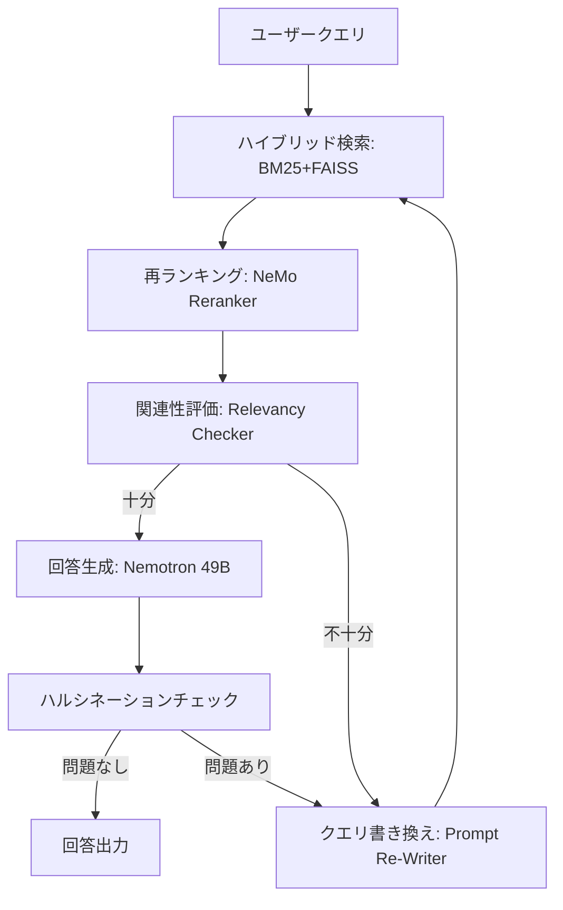

## ブログ概要（Summary）

NVIDIA Developer Blogが公開したこの記事は、ログ分析ドメインに特化したSelf-Corrective RAGシステムの構築方法を解説している。LangGraphのStateGraphでエージェントワークフローを定義し、BM25（字句マッチ）とFAISS（セマンティック検索）のハイブリッド検索、NVIDIA NeMo Retrieverによる埋め込み・再ランキング、Nemotron 3.3（49B）による生成を組み合わせる。検索結果の品質が不十分な場合、自動でクエリを書き換えて再検索するSelf-Correctionループを実装する点が特徴的である。

この記事は [Zenn記事: LangGraph Agentic RAGで社内検索の回答精度を大幅改善する実装手法](https://zenn.dev/0h_n0/articles/4c869d366e5200) の深掘りです。

## 情報源

- **種別**: 企業テックブログ
- **URL**: [https://developer.nvidia.com/blog/build-a-log-analysis-multi-agent-self-corrective-rag-system-with-nvidia-nemotron/](https://developer.nvidia.com/blog/build-a-log-analysis-multi-agent-self-corrective-rag-system-with-nvidia-nemotron/)
- **組織**: NVIDIA Developer
- **発表日**: 2024年

## 技術的背景（Technical Background）

従来のRAGシステムでは、ベクトル検索で取得した文書をそのままLLMに渡して回答を生成する。しかしログ分析のようなドメインでは、以下の固有の課題がある：

1. **ログの多様性**: エラーログ、アクセスログ、アプリケーションログなど形式が異なる
2. **キーワードの重要性**: タイムスタンプ、エラーコード、IPアドレスなど正確な字句マッチが必要
3. **文脈依存性**: 同じエラーコードでも前後のログによって意味が変わる
4. **大量データ**: 1日あたり数GB～数TBのログが生成される

これらの課題に対して、NVIDIAはCorrective RAGとSelf-RAGの設計パターンをLangGraphで実装し、検索品質の自動評価と反復的な改善を行うアーキテクチャを提案している。この設計はZenn記事で紹介したGrader→Rewriteの自己修正ループと本質的に同じパターンである。

## 実装アーキテクチャ（Architecture）

### システム構成

NVIDIAが提案するアーキテクチャは、以下の主要コンポーネントで構成される。

**LangGraphワークフローの構成要素**:

| コンポーネント | ファイル | 役割 |
|--------------|--------|------|
| ワークフローグラフ | `bat_ai.py` | LangGraph StateGraphの定義 |
| エージェントノード | `graphnodes.py` | 検索、再ランキング、評価、生成 |
| 決定ロジック | `graphedges.py` | 条件分岐の定義 |
| ハイブリッド検索 | `multiagent.py` | BM25+FAISSの統合 |

**使用モデル**:

| 用途 | モデル | パラメータ数 |
|------|--------|------------|
| 埋め込み | `llama-3.2-nv-embedqa-1b-v2` | 1B |
| 再ランキング | `llama-3.2-nv-rerankqa-1b-v2` | 1B |
| 生成 | `nvidia/llama-3.3-nemotron-super-49b-v1.5` | 49B |

### ハイブリッド検索戦略

NVIDIAのアーキテクチャでは、BM25とFAISSを組み合わせたハイブリッド検索を採用している。これはZenn記事のベクトル検索単独のアプローチを強化するものである。

**BM25コンポーネント**: 字句の完全一致に強い。ログ分析では、エラーコード（`ERROR 500`）やタイムスタンプ（`2026-02-20T09:00:00`）の正確なマッチが必要であり、ベクトル検索では拾いにくいパターンを補完する。

$$
\text{score}_{\text{BM25}}(q, d) = \sum_{t \in q} \text{IDF}(t) \cdot \frac{f(t, d) \cdot (k_1 + 1)}{f(t, d) + k_1 \cdot (1 - b + b \cdot \frac{|d|}{\text{avgdl}})}
$$

ここで、
- $t$: クエリ$q$中の各トークン
- $f(t, d)$: 文書$d$中でのトークン$t$の出現頻度
- $|d|$: 文書長
- $\text{avgdl}$: 平均文書長
- $k_1 = 1.2$, $b = 0.75$: チューニングパラメータ

**FAISSベクトルストア**: NeMo Retrieverの埋め込みモデル（`llama-3.2-nv-embedqa-1b-v2`）で生成したベクトルをFAISSに格納し、コサイン類似度で意味的に関連するログスニペットを検索する。

$$
\text{sim}(\mathbf{q}, \mathbf{d}) = \frac{\mathbf{q} \cdot \mathbf{d}}{|\mathbf{q}| \cdot |\mathbf{d}|}
$$

両者の結果をマージし、Reciprocal Rank Fusion（RRF）やスコア正規化で統合する。

### Self-Correctionループの実装

LangGraphの条件分岐（conditional edges）を使って、以下の自己修正ループを実装する。



このワークフローのPython実装は以下のようになる：

```python
from typing import TypedDict
from langgraph.graph import StateGraph, START, END

class LogAnalysisState(TypedDict):
    question: str
    documents: list[str]
    generation: str
    retry_count: int
    relevancy_score: float

def hybrid_retrieve(state: LogAnalysisState) -> dict:
    """BM25+FAISSハイブリッド検索を実行

    Args:
        state: 現在のグラフ状態

    Returns:
        検索結果文書のリスト
    """
    bm25_results = bm25_retriever.invoke(state["question"])
    faiss_results = faiss_retriever.invoke(state["question"])
    merged = reciprocal_rank_fusion(bm25_results, faiss_results)
    return {"documents": merged}

def rerank_documents(state: LogAnalysisState) -> dict:
    """NeMo Rerankerで検索結果を再ランキング

    Args:
        state: 現在のグラフ状態

    Returns:
        再ランキング済み文書のリスト
    """
    reranked = nemo_reranker.rerank(
        query=state["question"],
        documents=state["documents"],
        top_k=5
    )
    return {"documents": reranked}

def grade_relevancy(state: LogAnalysisState) -> dict:
    """検索結果の関連性をLLMで評価"""
    scores = []
    for doc in state["documents"]:
        result = grader_llm.invoke(
            f"このログスニペットは質問に関連するか？\n"
            f"質問: {state['question']}\nログ: {doc}"
        )
        scores.append(result.score)
    avg_score = sum(scores) / len(scores)
    return {"relevancy_score": avg_score}

def transform_query(state: LogAnalysisState) -> dict:
    """検索クエリを書き換えて再検索に備える"""
    rewritten = llm.invoke(
        f"以下の質問をログ検索向けに最適化してください。\n"
        f"具体的なエラーコード、タイムスタンプ、サービス名を含めてください。\n"
        f"元の質問: {state['question']}"
    )
    return {
        "question": rewritten.content,
        "retry_count": state.get("retry_count", 0) + 1
    }

def decide_to_generate(state: LogAnalysisState) -> str:
    """関連性スコアに基づいて生成 or 再検索を決定"""
    if state.get("retry_count", 0) >= 3:
        return "generate"
    if state["relevancy_score"] > 0.6:
        return "generate"
    return "transform"

# グラフ構築
workflow = StateGraph(LogAnalysisState)
workflow.add_node("retrieve", hybrid_retrieve)
workflow.add_node("rerank", rerank_documents)
workflow.add_node("grade", grade_relevancy)
workflow.add_node("transform", transform_query)
workflow.add_node("generate", generate_response)

workflow.add_edge(START, "retrieve")
workflow.add_edge("retrieve", "rerank")
workflow.add_edge("rerank", "grade")
workflow.add_conditional_edges("grade", decide_to_generate, {
    "generate": "generate",
    "transform": "transform",
})
workflow.add_edge("transform", "retrieve")
workflow.add_edge("generate", END)

app = workflow.compile()
```

### Zenn記事のパターンとの対応

| Zenn記事の構成 | NVIDIAアーキテクチャ | 改善点 |
|---------------|---------------------|--------|
| ベクトル検索のみ | BM25+FAISSハイブリッド | 字句マッチ追加 |
| Grader（バイナリ判定） | Relevancy Checker（スコア） | 段階的評価 |
| Query Rewrite（単純） | Prompt Re-Writer | ドメイン特化 |
| なし | NeMo Reranker | 検索品質向上 |

## Production Deployment Guide

### AWS実装パターン（コスト最適化重視）

NVIDIAのNeMo Retrieverモデルを活用したSelf-Corrective RAGをAWSにデプロイする際の構成を示す。

| 規模 | 月間リクエスト | 推奨構成 | 月額コスト | 主要サービス |
|------|--------------|---------|-----------|------------|
| **Small** | ~3,000 (100/日) | Serverless | $100-250 | Lambda + Bedrock + OpenSearch Serverless |
| **Medium** | ~30,000 (1,000/日) | Hybrid | $500-1,200 | ECS Fargate + Bedrock + ElastiCache |
| **Large** | 300,000+ (10,000/日) | Container | $3,000-8,000 | EKS + GPU Instances + OpenSearch |

**Small構成の詳細**（月額$100-250）:
- **Lambda**: ワークフロー制御、BM25検索（$30/月）
- **Bedrock**: Claude 3.5 Haiku（評価・生成）、Prompt Caching有効（$100/月）
- **OpenSearch Serverless**: ベクトル検索+BM25検索の統合（$80/月）
- **S3**: ログファイル格納（$5/月）

**コスト削減テクニック**:
- OpenSearch Serverlessのauto-scalingで低トラフィック時のコスト最小化
- Bedrock Batch APIで非リアルタイムのログ分析を50%削減
- NeMo Retriever埋め込みモデル（1B）はCPU推論可能、GPU不要

**コスト試算の注意事項**: 上記は2026年2月時点のAWS ap-northeast-1リージョン料金に基づく概算値です。最新料金は[AWS料金計算ツール](https://calculator.aws/)で確認してください。

### Terraformインフラコード

```hcl
module "vpc" {
  source  = "terraform-aws-modules/vpc/aws"
  version = "~> 5.0"

  name = "self-corrective-rag-vpc"
  cidr = "10.0.0.0/16"
  azs  = ["ap-northeast-1a", "ap-northeast-1c"]
  private_subnets = ["10.0.1.0/24", "10.0.2.0/24"]
  enable_nat_gateway   = false
  enable_dns_hostnames = true
}

resource "aws_opensearchserverless_collection" "log_search" {
  name = "log-analysis-rag"
  type = "VECTORSEARCH"
}

resource "aws_lambda_function" "rag_orchestrator" {
  filename      = "orchestrator.zip"
  function_name = "self-corrective-rag-orchestrator"
  role          = aws_iam_role.lambda_rag.arn
  handler       = "index.handler"
  runtime       = "python3.12"
  timeout       = 120
  memory_size   = 2048
  environment {
    variables = {
      OPENSEARCH_ENDPOINT = aws_opensearchserverless_collection.log_search.collection_endpoint
      BEDROCK_MODEL_ID    = "anthropic.claude-3-5-haiku-20241022-v1:0"
      MAX_RETRIES         = "3"
    }
  }
}
```

### 運用・監視設定

```python
import boto3

cloudwatch = boto3.client('cloudwatch')
cloudwatch.put_metric_alarm(
    AlarmName='rag-retry-rate-high',
    ComparisonOperator='GreaterThanThreshold',
    EvaluationPeriods=1,
    MetricName='RetryCount',
    Namespace='Custom/RAG',
    Period=3600,
    Statistic='Average',
    Threshold=2.0,
    AlarmDescription='Self-Correctionリトライ率が高い（検索品質低下の兆候）'
)
```

### コスト最適化チェックリスト

- [ ] ~100 req/日 → Lambda + Bedrock + OpenSearch Serverless
- [ ] NeMo埋め込みモデル（1B）はCPU推論でGPU不使用
- [ ] OpenSearch ServerlessのOCU最小値を設定
- [ ] Bedrock Batch APIで非同期ログ分析50%削減
- [ ] CloudWatch Custom Metricsでリトライ率監視
- [ ] S3 Lifecycle Policyで古いログ自動削除（90日）

## パフォーマンス最適化（Performance）

NVIDIAの記事では具体的なベンチマーク数値は公開されていないが、アーキテクチャ設計から以下のパフォーマンス特性が推測される：

- **レイテンシ**: 初回検索+再ランキング+評価で約2-5秒。Self-Correctionループ発生時は追加で2-3秒/回
- **スループット**: GPU推論（Nemotron 49B）がボトルネック。バッチ処理で改善可能
- **精度**: ハイブリッド検索により、キーワードベース（エラーコード等）と意味ベース（「タイムアウトの原因」等）の両方の検索精度が向上

**ボトルネック解消のアプローチ**:
- NeMo Rerankerの呼び出しを非同期化
- FAISSインデックスのGPU化（`faiss-gpu`）
- ログの前処理（パース済み構造化データ）でチャンク品質を向上

## 運用での学び（Production Lessons）

### 適用ドメイン

NVIDIAが想定するユースケースは以下のチームである：

- **QA/テスト自動化**: ログの要約、根本原因の検出
- **DevOps/SRE**: 異種ログソースの統合分析
- **CloudOps/ITOps**: クロスサービス分析、異常検知
- **セキュリティ**: 侵入検知ログの分析

### Self-Correctionの運用上の注意

1. **無限ループ防止**: `retry_count`による上限設定は必須（NVIDIAの例では暗黙的だが、Zenn記事のMAX_RETRIES=3パターンが推奨）
2. **リトライ率のモニタリング**: リトライ率が高い場合はインデックス品質やチャンク戦略の見直しが必要
3. **フォールバック応答**: すべてのリトライが失敗した場合の応答テンプレートを用意する

## 学術研究との関連（Academic Connection）

- **CRAG**（Yan et al., 2024）: NVIDIAのRelevancy Checkerは、CRAGのRetrieval Evaluatorのインスピレーションに基づいている。CRAGが3段階分類（Correct/Ambiguous/Incorrect）を使うのに対し、NVIDIAはスコアベースの閾値判定を採用
- **Self-RAG**（Asai et al., 2023）: 生成時の自己反省トークンによる品質制御。NVIDIAのハルシネーションチェックノードがこれに対応
- **Rewrite-Retrieve-Read**（Ma et al., 2023）: クエリ書き換えの基盤研究。NVIDIAのPrompt Re-Writerが実用化

## まとめと実践への示唆

NVIDIAのSelf-Corrective RAGアーキテクチャは、Zenn記事のAgentic RAGパターンを、ハイブリッド検索・再ランキング・ドメイン特化で拡張した実用的な実装例である。

特に重要な学びは以下の3点：
1. **BM25+FAISSハイブリッド検索**により、キーワードマッチとセマンティック検索の両立が可能
2. **NeMo Reranker**（1Bパラメータ）を追加することで、検索精度を向上させつつレイテンシ増加を最小限に抑えられる
3. **LangGraphのconditional_edges**で、Self-Correctionループを宣言的に定義でき、保守性が高い

ソースコードは[NVIDIA GenerativeAIExamples](https://github.com/NVIDIA/GenerativeAIExamples)リポジトリで公開されている。

## 参考文献

- **Blog URL**: [https://developer.nvidia.com/blog/build-a-log-analysis-multi-agent-self-corrective-rag-system-with-nvidia-nemotron/](https://developer.nvidia.com/blog/build-a-log-analysis-multi-agent-self-corrective-rag-system-with-nvidia-nemotron/)
- **Code**: [https://github.com/NVIDIA/GenerativeAIExamples](https://github.com/NVIDIA/GenerativeAIExamples)
- **Related Zenn article**: [https://zenn.dev/0h_n0/articles/4c869d366e5200](https://zenn.dev/0h_n0/articles/4c869d366e5200)
