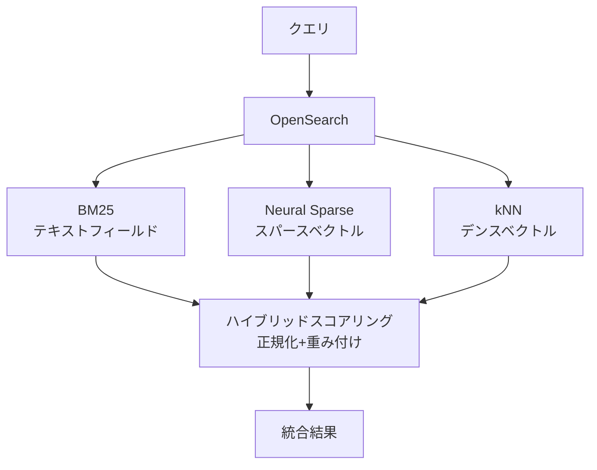

## ブログ概要（Summary）

AWS公式ブログ「Integrate sparse and dense vectors to enhance knowledge retrieval in RAG using Amazon OpenSearch Service」は、Amazon OpenSearch Serviceでの**スパースベクトル（BM25的手法）**と**デンスベクトル（セマンティック検索）**を統合したハイブリッド検索の実装パターンを解説しています。

OpenSearch 2.11以降で導入された**Neural Sparse Search機能**と従来のkNN検索を組み合わせることで、RAG（Retrieval-Augmented Generation）の検索精度を大幅に向上させる手法を、AWS環境での完全な実装手順とともに提供しています。

この記事は [Zenn記事: BM25×ベクトル検索のハイブリッド実装：RRFで検索精度を30%向上させる実践ガイド](https://zenn.dev/0h_n0/articles/f3d8b80351ae7b) の深掘りです。

## 情報源

- **種別**: 企業テックブログ
- **URL**: [AWS Big Data Blog](https://aws.amazon.com/blogs/big-data/integrate-sparse-and-dense-vectors-to-enhance-knowledge-retrieval-in-rag-using-amazon-opensearch-service/)
- **組織**: Amazon Web Services (AWS)
- **発表日**: 2024年

## 技術的背景（Technical Background）

### なぜハイブリッド検索がRAGに必要か

Amazon Bedrock Knowledge Basesなどの標準的なRAG実装は、デンスベクトル検索を中心に構築されています。しかし、実運用では以下の課題が発生します：

1. **専門用語の取りこぼし**: 医療用語、法律用語、製品型番などは埋め込みモデルの学習データに含まれていない場合がある
2. **固有名詞の不一致**: 人名・企業名・プロジェクト名でのベクトル類似度は信頼性が低い
3. **略語・略称**: 「K8s」「ML」「LLM」等の略称はベクトル空間での表現が不安定

Zenn記事で指摘されている「`RuntimeError: CUDA`のようなエラーメッセージ検索でヒット率が低下する」問題は、まさにこの課題の典型例です。

### OpenSearch のハイブリッド検索アーキテクチャ

OpenSearch Serviceは2つのベクトル検索をネイティブサポートしています：



### スパースベクトルの仕組み

OpenSearch 2.11で導入された**Neural Sparse Search**は、BM25のキーワードマッチングとニューラルネットワークの意味理解を組み合わせたスパース検索手法です。

**処理フロー**:
1. WordPieceトークナイザでテキストをトークン化（約32,000語彙）
2. Transformerモデルが各トークンに重要度スコアを付与
3. 大部分のスコアは0または0に近く、「スパース」な表現になる
4. クエリとドキュメントのスパースベクトル間でドット積を計算

$$
\text{score}(q, d) = \sum_{t \in q \cap d} w_q(t) \cdot w_d(t)
$$

ここで、
- $w_q(t)$: クエリにおけるトークン$t$の重要度（Transformerが付与）
- $w_d(t)$: ドキュメントにおけるトークン$t$の重要度
- $q \cap d$: クエリとドキュメントに共通するトークン集合

**BM25との違い**: BM25がTF-IDFの統計的手法で語の重要度を計算するのに対し、Neural Sparseは**Transformerが文脈を考慮して重要度を学習**します。これにより、同じスパースな表現でありながら、意味的な汎化能力を持ちます。

### デンスベクトル（kNN検索）

OpenSearch ServiceのkNN機能は、HNSW（Hierarchical Navigable Small World）やIVF（Inverted File Index）アルゴリズムに基づく近似最近傍探索を提供します。

**対応モデル**:
- Amazon Titan Embeddings V2 (1024次元)
- OpenAI text-embedding-3-large (3072次元)
- Cohere Embed (1024次元)
- SentenceTransformers系（任意次元）

## 実装アーキテクチャ（Architecture）

### OpenSearch インデックス設計

ハイブリッド検索用のインデックスは、テキストフィールド + スパースベクトル + デンスベクトルの3層構造で設計します。

```python
import boto3
from opensearchpy import OpenSearch, RequestsHttpConnection
from requests_aws4auth import AWS4Auth


def create_hybrid_index(
    client: OpenSearch,
    index_name: str = "hybrid-rag",
    dense_dim: int = 1024,
) -> None:
    """ハイブリッド検索用のOpenSearchインデックスを作成する。

    Args:
        client: OpenSearchクライアント
        index_name: インデックス名
        dense_dim: デンスベクトルの次元数
    """
    index_body = {
        "settings": {
            "index": {
                "knn": True,
                "knn.algo_param.ef_search": 512,
            },
            "default_pipeline": "hybrid-ingest-pipeline",
        },
        "mappings": {
            "properties": {
                # テキストフィールド（BM25用）
                "content": {
                    "type": "text",
                    "analyzer": "standard",
                },
                # スパースベクトルフィールド
                "content_sparse": {
                    "type": "rank_features",
                },
                # デンスベクトルフィールド
                "content_embedding": {
                    "type": "knn_vector",
                    "dimension": dense_dim,
                    "method": {
                        "engine": "nmslib",
                        "space_type": "cosinesimil",
                        "name": "hnsw",
                        "parameters": {
                            "ef_construction": 512,
                            "m": 16,
                        },
                    },
                },
                # メタデータ
                "metadata": {
                    "type": "object",
                    "properties": {
                        "source": {"type": "keyword"},
                        "category": {"type": "keyword"},
                        "date": {"type": "date"},
                    },
                },
            },
        },
    }
    client.indices.create(index=index_name, body=index_body)
```

### ハイブリッド検索クエリ

OpenSearch 2.11以降では、**search pipeline**機能を使ってハイブリッド検索のスコア統合を宣言的に設定できます。

```python
def hybrid_search(
    client: OpenSearch,
    query_text: str,
    query_embedding: list[float],
    index_name: str = "hybrid-rag",
    k: int = 10,
    bm25_weight: float = 0.3,
    sparse_weight: float = 0.3,
    dense_weight: float = 0.4,
) -> list[dict]:
    """3方向ハイブリッド検索を実行する。

    BM25 + Neural Sparse + kNNの結果を正規化して重み付き統合する。

    Args:
        client: OpenSearchクライアント
        query_text: テキストクエリ
        query_embedding: クエリのデンスベクトル
        index_name: インデックス名
        k: 返却する文書数
        bm25_weight: BM25の重み（0-1）
        sparse_weight: スパース検索の重み（0-1）
        dense_weight: デンス検索の重み（0-1）

    Returns:
        検索結果のリスト
    """
    search_body = {
        "size": k,
        "query": {
            "hybrid": {
                "queries": [
                    # BM25 (テキストマッチ)
                    {
                        "match": {
                            "content": {
                                "query": query_text,
                            }
                        }
                    },
                    # Neural Sparse (スパースベクトル)
                    {
                        "neural_sparse": {
                            "content_sparse": {
                                "query_text": query_text,
                                "model_id": "sparse-model-id",
                            }
                        }
                    },
                    # kNN (デンスベクトル)
                    {
                        "knn": {
                            "content_embedding": {
                                "vector": query_embedding,
                                "k": k * 2,
                            }
                        }
                    },
                ],
            }
        },
        "search_pipeline": {
            "phase_results_processors": [
                {
                    "normalization-processor": {
                        "normalization": {
                            "technique": "min_max",
                        },
                        "combination": {
                            "technique": "arithmetic_mean",
                            "parameters": {
                                "weights": [
                                    bm25_weight,
                                    sparse_weight,
                                    dense_weight,
                                ]
                            },
                        },
                    }
                }
            ],
        },
    }

    response = client.search(index=index_name, body=search_body)
    return [
        {
            "content": hit["_source"]["content"],
            "score": hit["_score"],
            "metadata": hit["_source"].get("metadata", {}),
        }
        for hit in response["hits"]["hits"]
    ]
```

### Search Pipeline設定

OpenSearchのSearch Pipelineは、検索クエリの前処理と後処理を宣言的に定義できるメカニズムです。

```python
def create_search_pipeline(
    client: OpenSearch,
    pipeline_name: str = "hybrid-search-pipeline",
) -> None:
    """ハイブリッド検索用のSearch Pipelineを作成する。

    BM25・Neural Sparse・kNNの3つのサブクエリ結果を
    min-max正規化後に重み付き平均で統合する。
    """
    pipeline_body = {
        "description": "Hybrid search pipeline for RAG",
        "phase_results_processors": [
            {
                "normalization-processor": {
                    "normalization": {
                        "technique": "min_max",
                    },
                    "combination": {
                        "technique": "arithmetic_mean",
                        "parameters": {
                            "weights": [0.3, 0.3, 0.4],
                        },
                    },
                }
            }
        ],
    }
    client.transport.perform_request(
        "PUT",
        f"/_search/pipeline/{pipeline_name}",
        body=pipeline_body,
    )
```

## パフォーマンス最適化（Performance）

### レイテンシの内訳

| コンポーネント | レイテンシ | 備考 |
|-------------|----------|------|
| BM25検索 | 1-5ms | テキストインデックスのみ |
| Neural Sparse検索 | 10-20ms | スパースモデル推論含む |
| kNN検索 | 10-30ms | HNSW探索 |
| スコア統合 | <1ms | 正規化+重み付き平均 |
| **合計** | **22-56ms** | 並列実行で最適化可能 |

### 2024年のパフォーマンス改善

OpenSearch 2.x系列でハイブリッド検索のパフォーマンスが大幅に改善されました：

- **条件付きスコアリングロジック**: 不要な計算のスキップ
- **データ構造の最適化**: 重複計算の排除
- **ハイブリッド検索の並列化**: 最大**25%のレイテンシ改善**
- **結果**: 全体で最大**4倍のレイテンシ改善**

### チューニングポイント

| パラメータ | 推奨値 | 影響 |
|----------|--------|------|
| `ef_search` | 512 | 検索精度 vs レイテンシ |
| `m` (HNSW) | 16 | インデックスサイズ vs 検索精度 |
| `ef_construction` | 512 | インデックス構築時間 vs 検索精度 |
| 重み配分 | BM25:0.3, Sparse:0.3, Dense:0.4 | ドメイン依存 |

## 運用での学び（Production Lessons）

### OpenSearch Serverless vs Managed

| 観点 | Serverless | Managed |
|------|-----------|---------|
| コスト | OCU単位（最低2 OCU） | インスタンス単位 |
| スケーリング | 自動 | 手動/Auto Scaling |
| ハイブリッド検索 | ✅ 対応 | ✅ 対応 |
| Neural Sparse | ⚠️ 一部制限 | ✅ 完全対応 |
| 推奨ユースケース | 小〜中規模 | 大規模・カスタマイズ必要 |

### 障害パターンと対策

| 障害 | 原因 | 対策 |
|------|------|------|
| kNNタイムアウト | ef_searchが高すぎる | ef_search=256に下げる |
| スパースモデル遅延 | モデルサイズが大きい | 軽量モデルに切替 |
| メモリ不足 | インデックスサイズ超過 | ノード追加/UltraWarm活用 |
| スコア不均衡 | 重み設定が不適切 | 評価データでチューニング |

### モニタリング戦略

```python
import boto3

cloudwatch = boto3.client("cloudwatch")


def setup_opensearch_alarms(domain_name: str) -> None:
    """OpenSearch Serviceの監視アラームを設定する。

    Args:
        domain_name: OpenSearchドメイン名
    """
    alarms = [
        {
            "AlarmName": f"{domain_name}-search-latency",
            "MetricName": "SearchLatency",
            "Namespace": "AWS/ES",
            "Statistic": "p99",
            "Period": 300,
            "Threshold": 100,  # 100ms P99
            "ComparisonOperator": "GreaterThanThreshold",
            "Dimensions": [
                {"Name": "DomainName", "Value": domain_name},
                {"Name": "ClientId", "Value": boto3.client("sts").get_caller_identity()["Account"]},
            ],
        },
        {
            "AlarmName": f"{domain_name}-jvm-pressure",
            "MetricName": "JVMMemoryPressure",
            "Namespace": "AWS/ES",
            "Statistic": "Maximum",
            "Period": 300,
            "Threshold": 85,  # 85%
            "ComparisonOperator": "GreaterThanThreshold",
        },
    ]

    for alarm in alarms:
        cloudwatch.put_metric_alarm(**alarm, EvaluationPeriods=2)
```

## 学術研究との関連（Academic Connection）

### Bruch et al. (2022) との関連

OpenSearchのハイブリッド検索は、融合関数として**min-max正規化 + 重み付き平均（線形結合）**を採用しています。Bruch et al. (2022)の研究では、RRFが線形結合を上回ることが示されていますが、OpenSearchは2024年にRRF融合も追加サポートしています。

### Blended RAG (2024) との関連

OpenSearchの3方向ハイブリッド検索（BM25 + Sparse + Dense）は、Blended RAGの提案する構成と整合しています。メタデータフィルタリングもOpenSearchのfilter句で実現可能です。

### SPLADEとの関係

OpenSearchのNeural Sparse Searchは、SPLADE等の学習済みスパース検索モデルと類似のアプローチです。WordPieceベースの32,000語彙空間でスパース表現を生成する点は共通ですが、OpenSearchはAWSの管理サービスとして提供されるため、モデルのデプロイ・運用が簡素化されています。

## Production Deployment Guide

### AWS実装パターン（コスト最適化重視）

**トラフィック量別の推奨構成**:

| 規模 | 月間リクエスト | 推奨構成 | 月額コスト | 主要サービス |
|------|--------------|---------|-----------|------------|
| **Small** | ~3,000 (100/日) | Serverless | $150-250 | OpenSearch Serverless + Lambda + Bedrock |
| **Medium** | ~30,000 (1,000/日) | Managed | $500-1,200 | OpenSearch t3.medium × 2 + Lambda |
| **Large** | 300,000+ (10,000/日) | Dedicated | $2,000-5,000 | OpenSearch r6g.large × 3 + ECS |

**Small構成の詳細** (月額$150-250):
- **OpenSearch Serverless**: 2 OCU ($140/月)
- **Lambda**: クエリ処理 ($10/月)
- **Bedrock (Titan Embeddings)**: ベクトル化 ($20/月)
- **S3**: ドキュメント保管 ($5/月)

**Medium構成の詳細** (月額$500-1,200):
- **OpenSearch Managed**: t3.medium.search × 2 ($200/月)
- **Lambda/ECS**: クエリ処理 ($50/月)
- **Bedrock**: 埋め込み+生成 ($300/月)
- **ElastiCache**: 検索結果キャッシュ ($50/月)

**コスト試算の注意事項**:
- 上記は2026年2月時点のAWS ap-northeast-1リージョン料金に基づく概算値です
- OpenSearch Serverless OCU料金はアイドル時も発生します
- 最新料金は [AWS料金計算ツール](https://calculator.aws/) で確認してください

### Terraformインフラコード

```hcl
resource "aws_opensearch_domain" "hybrid_rag" {
  domain_name    = "hybrid-rag"
  engine_version = "OpenSearch_2.13"

  cluster_config {
    instance_type          = "t3.medium.search"
    instance_count         = 2
    zone_awareness_enabled = true

    zone_awareness_config {
      availability_zone_count = 2
    }
  }

  ebs_options {
    ebs_enabled = true
    volume_size = 100
    volume_type = "gp3"
  }

  encrypt_at_rest {
    enabled = true
  }

  node_to_node_encryption {
    enabled = true
  }

  domain_endpoint_options {
    enforce_https       = true
    tls_security_policy = "Policy-Min-TLS-1-2-PFS-2023-10"
  }
}

resource "aws_cloudwatch_metric_alarm" "search_latency" {
  alarm_name          = "opensearch-search-latency-high"
  comparison_operator = "GreaterThanThreshold"
  evaluation_periods  = 2
  metric_name         = "SearchLatency"
  namespace           = "AWS/ES"
  period              = 300
  statistic           = "p99"
  threshold           = 100
  alarm_description   = "OpenSearch検索P99レイテンシ100ms超"

  dimensions = {
    DomainName = aws_opensearch_domain.hybrid_rag.domain_name
    ClientId   = data.aws_caller_identity.current.account_id
  }
}
```

### セキュリティベストプラクティス

- **暗号化**: 保管時+転送時+ノード間通信すべてKMS暗号化
- **TLSポリシー**: TLS 1.2以上必須（Policy-Min-TLS-1-2-PFS-2023-10）
- **アクセス制御**: IAMベースのドメインアクセスポリシー
- **VPC配置**: パブリックアクセス無効化、VPCエンドポイント経由
- **監査**: CloudTrailでAPI呼び出しをログ記録

### コスト最適化チェックリスト

**アーキテクチャ選択**:
- [ ] ~100 req/日 → OpenSearch Serverless (2 OCU) - $150-250/月
- [ ] ~1000 req/日 → OpenSearch Managed (t3.medium × 2) - $500-1,200/月
- [ ] 10000+ req/日 → OpenSearch Dedicated (r6g.large × 3) - $2,000-5,000/月

**OpenSearch最適化**:
- [ ] UltraWarm: アクセス頻度の低いインデックスを自動階層化
- [ ] gp3 EBSボリューム: gp2比で20%コスト削減
- [ ] Reserved Instances: 1年コミットで最大35%削減
- [ ] スパースモデル: 軽量版を選択してスループット向上

**検索パイプライン最適化**:
- [ ] BM25+Sparse+Dense並列実行
- [ ] 検索結果キャッシュ（ElastiCache、TTL 5分）
- [ ] search pipeline正規化設定の最適化
- [ ] ef_search値の調整（精度vs速度トレードオフ）

**監視・アラート**:
- [ ] SearchLatency P99 監視
- [ ] JVMMemoryPressure 監視（85%閾値）
- [ ] ClusterStatus 監視
- [ ] 月額コスト予算アラート（AWS Budgets）

## まとめと実践への示唆

AWS OpenSearch Serviceでのハイブリッド検索は、Zenn記事で紹介されているElasticsearchのretriever構文と**概念的に同一**であり、AWSマネージドサービスとして運用負荷を大幅に削減できます。

**主要なポイント**:
- OpenSearch 2.11以降のNeural Sparse Searchは、BM25を超えるスパース検索を提供
- BM25 + Sparse + Denseの3方向ハイブリッドが最高精度
- Search Pipeline機能で融合ロジックを宣言的に管理
- 2024年のパフォーマンス改善で最大4倍のレイテンシ改善

**実務への示唆**: AWSを使用している場合、OpenSearch Serviceのハイブリッド検索機能はZenn記事のElasticsearch実装と互換性があり、マネージドサービスの恩恵（自動スケーリング、暗号化、監視）を追加で享受できます。

## 参考文献

- **AWS Blog**: [Integrate sparse and dense vectors in RAG using Amazon OpenSearch Service](https://aws.amazon.com/blogs/big-data/integrate-sparse-and-dense-vectors-to-enhance-knowledge-retrieval-in-rag-using-amazon-opensearch-service/)
- **OpenSearch Neural Sparse Search**: [OpenSearch Documentation](https://opensearch.org/docs/latest/search-plugins/neural-sparse-search/)
- **OpenSearch Hybrid Search**: [Hybrid Search Guide](https://opensearch.org/docs/latest/search-plugins/hybrid-search/)
- **Related Zenn article**: [https://zenn.dev/0h_n0/articles/f3d8b80351ae7b](https://zenn.dev/0h_n0/articles/f3d8b80351ae7b)
