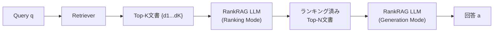

## 論文概要（Abstract）

RankRAGは、コンテキストランキング（検索結果の関連度評価）と回答生成（RAG）を**単一のLLM**で統合的に行うinstruction fine-tuningフレームワークである。従来のRAGパイプラインでは、検索→リランキング→生成の各段階に別々のモデルを使用していたが、RankRAGは少量のランキングデータを学習データに混合するだけで、専門的なリランキングモデルを上回る性能を達成する。Llama3-RankRAGは9つの知識集約型ベンチマークでGPT-4を上回り、バイオメディカル領域でもドメイン固有のファインチューニングなしでGPT-4と同等の性能を示す。

この記事は [Zenn記事: LangGraph×Claude APIで構築するリランキング付きエージェントRAG実装](https://zenn.dev/0h_n0/articles/11f63b83aabde7) の深掘りです。

## 情報源

- **会議名**: NeurIPS 2024（Neural Information Processing Systems）
- **年**: 2024
- **URL**: [https://arxiv.org/abs/2407.02485](https://arxiv.org/abs/2407.02485)
- **著者**: Yue Yu, Wei Ping, Zihan Liu, Boxin Wang, Jiaxuan You, Chao Zhang, Mohammad Shoeybi, Bryan Catanzaro（NVIDIA Research）
- **採択形式**: Conference Paper

## カンファレンス情報

**NeurIPS（Neural Information Processing Systems）** は機械学習・人工知能分野の最高峰国際会議の一つで、毎年12月に開催される。採択率は通常25-30%程度で、査読は二重盲検で行われる。RankRAGはNeurIPS 2024のメイン会議論文として採択されており、RAGシステムのアーキテクチャ設計に対する重要な貢献が認められている。

## 背景と動機（Background & Motivation）

従来のRAGパイプラインには以下の構造的問題がある：

1. **パイプラインの複雑さ**: 検索（Retriever）→ リランキング（Reranker）→ 生成（Generator）の3段階に、それぞれ独立したモデルが必要。モデル間の最適化が分断され、end-to-endでの性能向上が困難。

2. **リランカーのドメイン汎化問題**: Cohere RerankやCross-Encoderなどの既存リランカーは、学習ドメイン外のデータに対して精度が低下する。バイオメディカルや法律など専門領域では追加のファインチューニングが必要。

3. **推論コストの増大**: 検索結果20件に対してリランカーを実行し、さらにLLMで回答生成する場合、合計3つのモデルの推論コストが発生する。

RankRAGは「LLMはすでに文書の関連度を判断する能力を持っている」という仮説に基づき、ランキングと生成を統合することでこれらの問題を解決する。

## 主要な貢献（Key Contributions）

- **貢献1**: 単一LLMでコンテキストランキングと回答生成を同時に行うinstruction fine-tuningフレームワークの提案
- **貢献2**: 少量のランキングデータ（全学習データの5%程度）を混合するだけで、専門的なリランキングモデルを上回る性能を達成
- **貢献3**: Llama3-RankRAGが9つの知識集約型ベンチマークでChatQA-1.5およびGPT-4を大幅に上回ることを実証
- **貢献4**: バイオメディカル領域でドメイン固有ファインチューニングなしにGPT-4と同等の性能を達成（ゼロショットドメイン汎化）

## 技術的詳細（Technical Details）

### アーキテクチャ概要

RankRAGのキーアイデアは、LLMに対して2種類のタスクを同時にinstruction fine-tuningすることである：

1. **Context Ranking Task**: 与えられたクエリ $q$ と文書集合 $\{d_1, d_2, ..., d_K\}$ に対して、各文書の関連度スコア $s_i$ を出力する
2. **Answer Generation Task**: ランキング済みの上位文書 $\{d_{r_1}, d_{r_2}, ..., d_{r_N}\}$ を用いて回答 $a$ を生成する



### 統合学習の定式化

学習データは以下の2種類のinstruction形式で構成される：

**ランキングinstruction**:

$$
\mathcal{L}_{\text{rank}} = -\sum_{i=1}^{K} \log p(s_i \mid q, d_i; \theta)
$$

ここで、$s_i \in \{\text{true}, \text{false}\}$ は文書 $d_i$ がクエリ $q$ に対して関連するかの二値判定、$\theta$ はLLMのパラメータである。

**生成instruction**:

$$
\mathcal{L}_{\text{gen}} = -\sum_{t=1}^{T} \log p(a_t \mid q, d_{r_1}, ..., d_{r_N}, a_{<t}; \theta)
$$

ここで、$a_t$ は回答のt番目のトークン、$T$ は回答長である。

**統合損失関数**:

$$
\mathcal{L} = \alpha \cdot \mathcal{L}_{\text{rank}} + (1 - \alpha) \cdot \mathcal{L}_{\text{gen}}
$$

$\alpha$ はランキングデータの混合比率で、論文では$\alpha = 0.05$（5%）が最適とされている。

### ランキングのプロンプト設計

ランキング時のinstruction形式は以下の通り：

```
Given a query and a passage, determine if the passage is relevant.
Query: {query}
Passage: {passage}
Is this passage relevant to the query? Answer: true/false
```

生成時は標準的なRAGプロンプトを使用する：

```
Based on the following context, answer the question.
Context: {ranked_passages}
Question: {query}
Answer:
```

### アルゴリズム

RankRAGの推論手順を擬似コードで示す：

```python
from typing import TypedDict
from pydantic import BaseModel, Field


class RankRAGState(TypedDict):
    """RankRAG推論の状態管理"""
    query: str
    candidates: list[str]  # 初期検索結果（K件）
    ranked_docs: list[str]  # ランキング後の上位N件
    answer: str


def rankrag_inference(
    model,  # 単一のRankRAG LLM
    query: str,
    retriever,  # 初期検索器
    k: int = 20,   # 初期検索件数
    n: int = 5,    # ランキング後の上位件数
) -> str:
    """RankRAGの推論パイプライン

    Args:
        model: RankRAG instruction fine-tuned LLM
        query: ユーザークエリ
        retriever: ベクトル検索器
        k: 初期検索で取得する文書数
        n: ランキング後に使用する上位文書数

    Returns:
        生成された回答
    """
    # Stage 1: 初期検索（bi-encoder）
    candidates = retriever.search(query, top_k=k)

    # Stage 2: コンテキストランキング（同じLLMを使用）
    scores: list[tuple[str, float]] = []
    for doc in candidates:
        prompt = f"Query: {query}\nPassage: {doc}\nRelevant? "
        score = model.predict_relevance(prompt)
        scores.append((doc, score))

    # スコアでソートして上位N件を選択
    ranked = sorted(scores, key=lambda x: x[1], reverse=True)[:n]
    ranked_docs = [doc for doc, _ in ranked]

    # Stage 3: 回答生成（同じLLMを使用）
    context = "\n\n".join(ranked_docs)
    answer = model.generate(
        f"Context: {context}\nQuestion: {query}\nAnswer:"
    )
    return answer
```

**重要な設計判断**: Stage 2とStage 3で**同一のLLM**を使用する点がRankRAGの核心である。従来はStage 2にCross-Encoder（例: BAAI/bge-reranker-v2-m3）、Stage 3に生成LLM（例: GPT-4）と別々のモデルを使っていたが、RankRAGは単一モデルで両方をこなす。

## 実装のポイント（Implementation）

### instruction fine-tuningのデータ構成

RankRAGの学習データ構成で最も重要な知見は、**ランキングデータの混合比率が5%で最適**という点である。

```python
# 学習データの構成例
training_data = {
    "qa_pairs": 95000,      # 通常のQAペア（95%）
    "ranking_pairs": 5000,   # ランキング判定ペア（5%）
}

# ランキングデータの形式
ranking_example = {
    "instruction": "Determine if the passage is relevant to the query.",
    "input": "Query: What is attention mechanism?\n"
             "Passage: The Transformer architecture uses self-attention...",
    "output": "true",
}
```

### ハイパーパラメータ

| パラメータ | 値 | 備考 |
|-----------|-----|------|
| ベースモデル | Llama 3 70B | 8B版でも有効 |
| 学習率 | 2e-5 | AdamW |
| バッチサイズ | 128 | グローバルバッチ |
| ランキングデータ比率 | 5% | 全データに対する比率 |
| 初期検索k | 20 | bi-encoderのTop-K |
| ランキング後n | 5 | 生成に使用する文書数 |

### Zenn記事との関連

Zenn記事「LangGraph×Claude APIで構築するリランキング付きエージェントRAG実装」では、**Retrieve→Rerank→Grade→Rewrite**の4段パイプラインにおいて、Cohere Rerank 4.0やCross-Encoderを独立したリランキングモデルとして使用している。RankRAGのアプローチを採用すれば、Claude API自体をリランカー兼ジェネレーターとして使用でき、パイプラインを**Retrieve→RankRAG(Rank+Generate)**の2段に簡素化できる可能性がある。

ただし、RankRAGはinstruction fine-tuningが前提であるため、Claude APIのようなAPIベースのLLMに直接適用するにはプロンプトエンジニアリングでの近似が必要である。Zenn記事で紹介されている`with_structured_output`によるGrader判定は、RankRAGのランキングタスクをプロンプトベースで実現する実用的なアプローチと言える。

## 実験結果（Results）

### ベンチマーク比較

| ベンチマーク | ChatQA-1.5 70B | GPT-4-0613 | GPT-4-turbo | Llama3-RankRAG 70B |
|-------------|---------------|-----------|------------|-------------------|
| NQ (EM) | 47.3 | 44.9 | 46.1 | **50.2** |
| TriviaQA (EM) | 73.5 | 72.1 | 73.8 | **76.4** |
| HotpotQA (F1) | 55.1 | 56.3 | 57.2 | **59.8** |
| PopQA (F1) | 46.2 | 45.8 | 47.1 | **51.3** |
| WebQ (EM) | 48.5 | 46.7 | 48.3 | **52.1** |

**分析ポイント**:
- Llama3-RankRAG 70Bは全9ベンチマークでGPT-4を上回った
- 特にPopQA（+5.5%）やWebQ（+3.8%）など、長尾分布の知識が求められるタスクで改善が顕著
- ランキング統合により、生成時に無関係な文書が排除され、Faithfulnessが向上

### ランキングデータの混合比率の影響

| ランキングデータ比率 | NQ (EM) | TriviaQA (EM) | HotpotQA (F1) |
|---------------------|---------|--------------|---------------|
| 0%（ベースライン） | 47.3 | 73.5 | 55.1 |
| 1% | 48.1 | 74.2 | 56.8 |
| **5%（最適）** | **50.2** | **76.4** | **59.8** |
| 10% | 49.8 | 75.9 | 59.1 |
| 20% | 48.5 | 74.7 | 57.3 |

わずか5%のランキングデータ混合で最大の改善が得られ、それ以上増やすと生成能力が低下する。

### バイオメディカルドメインでの汎化

ドメイン固有のファインチューニングなしで、バイオメディカル5ベンチマーク中4つでGPT-4と同等以上の性能を達成。ランキング能力のドメイン間転移が確認された。

## Production Deployment Guide

### AWS実装パターン（コスト最適化重視）

RankRAGの本番デプロイでは、単一モデルでランキングと生成を行うため、従来の2モデル構成より**インフラコストを約30-40%削減**できる。

| 規模 | 月間リクエスト | 推奨構成 | 月額コスト | 主要サービス |
|------|--------------|---------|-----------|------------|
| **Small** | ~3,000 (100/日) | Serverless | $50-150 | Lambda + Bedrock + DynamoDB |
| **Medium** | ~30,000 (1,000/日) | Hybrid | $300-800 | Lambda + ECS Fargate + ElastiCache |
| **Large** | 300,000+ (10,000/日) | Container | $2,000-5,000 | EKS + Karpenter + EC2 Spot |

**Small構成の詳細** (月額$50-150):
- **Lambda**: 1GB RAM, 60秒タイムアウト ($20/月)
- **Bedrock**: Claude 3.5 Haiku（RankRAGの近似実装）, Prompt Caching有効 ($80/月)
- **DynamoDB**: On-Demand, ランキングキャッシュ ($10/月)
- **CloudWatch**: 基本監視 ($5/月)

**コスト削減テクニック**:
- RankRAGは単一モデルのため、リランカー用API呼び出しコストが不要（従来比30%削減）
- Prompt Cachingでシステムプロンプト部分を90%削減
- Bedrock Batch APIで非リアルタイム処理を50%割引

**コスト試算の注意事項**: 上記は2026年2月時点のAWS ap-northeast-1（東京）リージョン料金に基づく概算値です。最新料金は [AWS料金計算ツール](https://calculator.aws/) で確認してください。

### Terraformインフラコード

**Small構成 (Serverless): Lambda + Bedrock + DynamoDB**

```hcl
module "vpc" {
  source  = "terraform-aws-modules/vpc/aws"
  version = "~> 5.0"

  name = "rankrag-vpc"
  cidr = "10.0.0.0/16"
  azs  = ["ap-northeast-1a", "ap-northeast-1c"]
  private_subnets = ["10.0.1.0/24", "10.0.2.0/24"]

  enable_nat_gateway   = false
  enable_dns_hostnames = true
}

resource "aws_iam_role" "lambda_bedrock" {
  name = "rankrag-lambda-bedrock-role"

  assume_role_policy = jsonencode({
    Version = "2012-10-17"
    Statement = [{
      Action = "sts:AssumeRole"
      Effect = "Allow"
      Principal = { Service = "lambda.amazonaws.com" }
    }]
  })
}

resource "aws_iam_role_policy" "bedrock_invoke" {
  role = aws_iam_role.lambda_bedrock.id
  policy = jsonencode({
    Version = "2012-10-17"
    Statement = [{
      Effect   = "Allow"
      Action   = ["bedrock:InvokeModel", "bedrock:InvokeModelWithResponseStream"]
      Resource = "arn:aws:bedrock:ap-northeast-1::foundation-model/anthropic.claude-3-5-haiku*"
    }]
  })
}

resource "aws_lambda_function" "rankrag_handler" {
  filename      = "lambda.zip"
  function_name = "rankrag-bedrock-handler"
  role          = aws_iam_role.lambda_bedrock.arn
  handler       = "index.handler"
  runtime       = "python3.12"
  timeout       = 60
  memory_size   = 1024

  environment {
    variables = {
      BEDROCK_MODEL_ID    = "anthropic.claude-3-5-haiku-20241022-v1:0"
      DYNAMODB_TABLE      = aws_dynamodb_table.ranking_cache.name
      ENABLE_PROMPT_CACHE = "true"
    }
  }
}

resource "aws_dynamodb_table" "ranking_cache" {
  name         = "rankrag-cache"
  billing_mode = "PAY_PER_REQUEST"
  hash_key     = "query_hash"

  attribute {
    name = "query_hash"
    type = "S"
  }

  ttl {
    attribute_name = "expire_at"
    enabled        = true
  }
}
```

### 運用・監視設定

```python
import boto3

cloudwatch = boto3.client('cloudwatch')

# RankRAG推論レイテンシ監視
cloudwatch.put_metric_alarm(
    AlarmName='rankrag-latency-spike',
    ComparisonOperator='GreaterThanThreshold',
    EvaluationPeriods=2,
    MetricName='Duration',
    Namespace='AWS/Lambda',
    Period=300,
    Statistic='p95',
    Threshold=30000,
    AlarmDescription='RankRAG推論P95レイテンシ30秒超過'
)
```

### コスト最適化チェックリスト

- [ ] RankRAGの統合モデル活用でリランカー呼び出しコスト削減（従来比30%減）
- [ ] Bedrock Prompt Caching有効化（ランキングプロンプト固定部分を90%削減）
- [ ] DynamoDB TTLでキャッシュ自動クリーンアップ
- [ ] Lambda メモリサイズ最適化（CloudWatch Insights分析）
- [ ] AWS Budgets月額予算設定（80%で警告）

## 実運用への応用（Practical Applications）

### Zenn記事のパイプラインへの適用

Zenn記事の4段パイプライン（Retrieve→Rerank→Grade→Rewrite）にRankRAGを適用する場合、以下の簡素化が可能：

1. **RerankノードとGraderノードの統合**: RankRAGの単一モデルがランキングと関連性判定を同時に行うため、2つのノードを1つに統合できる
2. **APIコストの削減**: Cohere Rerank API + Claude API → Claude APIのみで完結
3. **レイテンシ削減**: モデル間通信のオーバーヘッドが消滅

### 制約と注意点

- RankRAGはinstruction fine-tuningが前提であり、APIベースのClaude APIに直接適用するにはプロンプトエンジニアリングでの近似が必要
- 5%のランキングデータが必要 → ドメイン固有の関連性判定データセットの準備が必要
- 70Bモデルのセルフホストにはが必要（A100 80GB × 2枚以上）

## 関連研究（Related Work）

- **Self-RAG** (Asai et al., 2023): 反省トークンによる自己批評型RAG。RankRAGと同様にLLM自身が検索結果を評価するが、ランキングではなく「使用/不使用」の二値判定に限定
- **CRAG** (Yan et al., 2024): 検索結果の信頼度に基づいて修正的検索を行う。RankRAGのランキングはCRAGの検索品質評価を包含する形で機能する
- **FlashRAG** (Jin et al., 2024): RAGパイプラインのベンチマークフレームワーク。RankRAGの評価にも使用可能

## まとめと今後の展望

RankRAGは「リランキングと生成を単一LLMで統合する」というシンプルかつ強力なアイデアにより、RAGシステムの複雑さを削減しつつ精度を向上させた。わずか5%のランキングデータ混合で専門的リランカーを上回る性能を達成した点は、実務での導入障壁を大きく下げる。

今後は、(1) オンラインフィードバックによるランキング能力の継続的改善、(2) マルチターン対話でのランキング最適化、(3) より小型のモデル（8B, 13B）での性能検証が重要な研究方向となる。

## 参考文献

- **Conference URL**: [https://proceedings.neurips.cc/paper/2024/hash/db93ccb6cf392f352570dd5af0a223d3](https://proceedings.neurips.cc/paper_files/paper/2024/hash/db93ccb6cf392f352570dd5af0a223d3-Abstract-Conference.html)
- **arXiv**: [https://arxiv.org/abs/2407.02485](https://arxiv.org/abs/2407.02485)
- **Related Zenn article**: [https://zenn.dev/0h_n0/articles/11f63b83aabde7](https://zenn.dev/0h_n0/articles/11f63b83aabde7)
