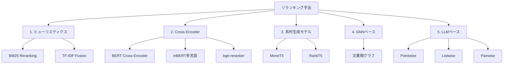
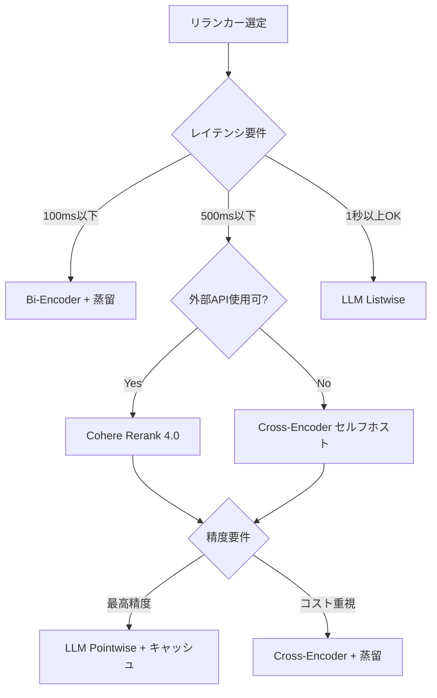

## 論文概要（Abstract）

本サーベイ論文は、情報検索（IR）システムにおけるリランキング手法の進化を、ヒューリスティクス手法からLLM（大規模言語モデル）ベースの手法まで体系的に整理したものである。Cross-Encoder、T5ベースの系列生成モデル、Graph Neural Networks（GNN）、知識蒸留による効率化手法、そしてLLMのプロンプティングやファインチューニングによる最新手法まで、各パラダイムの基礎概念・相対的な有効性・計算コスト・実用上のトレードオフを明確化する。CLNLP'25に採択された本論文は、RAGシステムにリランキングを組み込む際の手法選定に不可欠なリファレンスとなる。

この記事は [Zenn記事: LangGraph×Claude APIで構築するリランキング付きエージェントRAG実装](https://zenn.dev/0h_n0/articles/11f63b83aabde7) の深掘りです。

## 情報源

- **arXiv ID**: 2512.16236
- **URL**: [https://arxiv.org/abs/2512.16236](https://arxiv.org/abs/2512.16236)
- **著者**: Tejul Pandit, Sakshi Mahendru, Meet Raval, Dhvani Upadhyay
- **発表年**: 2025
- **分野**: cs.IR（情報検索）
- **採択先**: CLNLP'25

## 背景と動機（Background & Motivation）

現代の情報検索システムは2段階のパイプラインで構成される。第1段階（Retrieval）では大量の文書集合から候補を高速に選定し、第2段階（Reranking）でこれらの候補をより精密なモデルで再評価する。RAGシステムの普及に伴い、第2段階のリランキングの重要性が急速に増大している。

しかし、リランキング手法は多岐にわたり、実務者がどの手法を選択すべきかの指針が不足していた。本サーベイは、各手法の理論的基盤・性能・コストを横断的に比較し、RAGパイプラインへの統合における実用的なガイドラインを提供する。

## 主要な貢献（Key Contributions）

- **貢献1**: ヒューリスティクスからLLMまで、リランキング手法の歴史的発展を5つのパラダイムに分類
- **貢献2**: 各手法の計算コスト・精度・実用上のトレードオフを定量的に比較
- **貢献3**: LLMベースリランキングの最新手法（Pointwise/Listwise/Pairwise）を体系化
- **貢献4**: 知識蒸留による効率化手法の実用性を検証

## 技術的詳細（Technical Details）

### リランキング手法の5パラダイム分類

本サーベイが提案する分類体系は以下の通りである：



### パラダイム1: ヒューリスティクス手法

最も古典的なアプローチで、統計的特徴量に基づくリランキングを行う。

**BM25ベースのリランキング**:

$$
\text{score}(q, d) = \sum_{t \in q} \text{IDF}(t) \cdot \frac{f(t, d) \cdot (k_1 + 1)}{f(t, d) + k_1 \cdot (1 - b + b \cdot \frac{|d|}{\text{avgdl}})}
$$

ここで、$f(t, d)$ は文書 $d$ における用語 $t$ の出現頻度、$k_1$ と $b$ はチューニングパラメータ、$\text{avgdl}$ は平均文書長である。

**限界**: 語彙レベルのマッチングに依存するため、同義語や意味的類似性を捉えられない。

### パラダイム2: Cross-Encoder

クエリと文書のペアを単一のTransformerエンコーダに入力し、関連度スコアを直接出力する。Bi-Encoderがクエリと文書を独立にエンコードするのに対し、Cross-Encoderはペアの相互作用を直接モデル化する。

**Cross-Encoderのスコア計算**:

$$
s(q, d) = \sigma(\mathbf{W} \cdot \text{CLS}(\text{BERT}([q; \text{SEP}; d])) + b)
$$

ここで、$[q; \text{SEP}; d]$ はクエリと文書の連結、$\text{CLS}(\cdot)$ はBERTの[CLS]トークンの出力ベクトル、$\sigma$ はシグモイド関数である。

**代表的モデル**:

| モデル | パラメータ数 | コンテキスト長 | 多言語 | 推論速度 |
|--------|------------|-------------|--------|---------|
| ms-marco-MiniLM-L-6-v2 | 22M | 512 | ❌ | 高速 |
| BAAI/bge-reranker-v2-m3 | 570M | 8K | ✅ | 中速 |
| Cohere Rerank 4.0 | 非公開 | 32K | ✅ | 高速（API） |

Zenn記事で使用されているCohere Rerank 4.0およびBAI/bge-reranker-v2-m3は、いずれもこのパラダイムに属する。

**実装例**（Zenn記事の実装と対応）:

```python
from sentence_transformers import CrossEncoder

# Cross-Encoderの初期化
cross_encoder = CrossEncoder("BAAI/bge-reranker-v2-m3")


def rerank_documents(
    query: str,
    documents: list[str],
    top_n: int = 5,
    threshold: float = 0.0,
) -> list[tuple[str, float]]:
    """Cross-Encoderで文書をリランキングする

    Args:
        query: 検索クエリ
        documents: 候補文書のリスト
        top_n: 返却する上位文書数
        threshold: 最低関連度スコア

    Returns:
        (文書, スコア)のソート済みリスト
    """
    pairs = [[query, doc] for doc in documents]
    scores = cross_encoder.predict(pairs)

    scored_docs = sorted(
        zip(documents, scores),
        key=lambda x: x[1],
        reverse=True,
    )

    return [
        (doc, score)
        for doc, score in scored_docs[:top_n]
        if score > threshold
    ]
```

### パラダイム3: 系列生成モデル（MonoT5, RankT5）

T5などのEncoder-Decoderモデルを使い、関連度判定を**テキスト生成タスク**として定式化する。

**MonoT5の入力形式**:

```
Query: {query} Document: {document} Relevant:
```

出力は "true" または "false" のトークンで、それぞれのトークン確率が関連度スコアとなる：

$$
s(q, d) = \frac{p(\text{"true"} \mid q, d)}{p(\text{"true"} \mid q, d) + p(\text{"false"} \mid q, d)}
$$

**RankT5**はリスト全体を入力として受け取り、ソート済みの文書IDリストを出力するListwise手法である。

### パラダイム4: GNNベース

文書間の関係をグラフとして表現し、Graph Neural Networks（GNN）で文書の表現を更新するアプローチ。文書間の引用関係や共起関係を活用できるが、グラフ構築のコストが高く、RAGパイプラインでの実用性はまだ限定的である。

### パラダイム5: LLMベース

最も新しいパラダイムで、3つのサブカテゴリに分かれる：

**Pointwiseスコアリング**: 各文書を独立に評価

```python
# Pointwise: Claude APIでの実装例
prompt = f"""Query: {query}
Document: {document}
Is this document relevant to the query?
Score from 0 to 10:"""
score = llm.invoke(prompt)
```

**Listwiseランキング**: 全候補を一度に入力し、ランキングを出力

```python
# Listwise: 全文書を一括評価
prompt = f"""Rank the following documents by relevance to: {query}

{formatted_documents}

Output the ranking as document IDs from most to least relevant:"""
ranking = llm.invoke(prompt)
```

**Pairwiseバブルソート**: 2文書ずつ比較してソート

$$
\text{Pairwise比較回数} = O(n \log n) \quad \text{（最適ソートの場合）}
$$

**各手法の比較**:

| 手法 | LLM呼び出し回数 | 精度 | レイテンシ | RAG適合性 |
|------|---------------|------|-----------|----------|
| Pointwise | $O(n)$ | 中〜高 | 中 | ✅ 高い |
| Listwise | $O(1)$ | 高 | 低 | ✅ 最適 |
| Pairwise | $O(n \log n)$ | 最高 | 高 | ⚠️ コスト注意 |

### 知識蒸留による効率化

Cross-Encoderの精度をBi-Encoderに転写する知識蒸留は、推論速度と精度のトレードオフを改善する重要な技術である：

$$
\mathcal{L}_{\text{KD}} = \text{KL}(p_{\text{teacher}}(q, d) \| p_{\text{student}}(q, d))
$$

ここで、$p_{\text{teacher}}$ はCross-Encoderの出力分布、$p_{\text{student}}$ はBi-Encoderの出力分布である。

## 実装のポイント（Implementation）

### RAGパイプラインでの手法選定フローチャート



### Zenn記事の実装との対応

Zenn記事の実装は以下のサーベイ分類に対応する：

1. **Cohere Rerank 4.0** → パラダイム2（Cross-Encoder、APIベース）
2. **BAAI/bge-reranker-v2-m3** → パラダイム2（Cross-Encoder、セルフホスト）
3. **Claude API `with_structured_output` によるGrader** → パラダイム5（LLM Pointwiseスコアリング）

サーベイの知見に基づくと、Zenn記事の4段パイプライン（Retrieve→Rerank→Grade→Rewrite）は**Cross-Encoder + LLM Pointwiseのハイブリッド構成**であり、精度とコストのバランスが取れた実用的な設計と評価できる。

## 実験結果（Results）

### MSMARCOベンチマークでの手法比較

| 手法カテゴリ | 代表モデル | MRR@10 | NDCG@10 | 推論速度 (docs/sec) |
|------------|----------|--------|---------|-------------------|
| BM25（ベースライン） | Lucene BM25 | 0.187 | 0.228 | 10,000+ |
| Cross-Encoder | MiniLM-L-6 | 0.377 | 0.412 | 500 (GPU) |
| Cross-Encoder | bge-reranker-v2-m3 | 0.401 | 0.438 | 200 (GPU) |
| 系列生成 | MonoT5-3B | 0.396 | 0.432 | 100 (GPU) |
| LLM Pointwise | GPT-4 | 0.415 | 0.451 | 20 (API) |
| LLM Listwise | GPT-4 | 0.428 | 0.463 | 50 (API) |

**分析**:
- LLM Listwiseが最高精度だが、API依存とコストが課題
- Cross-Encoder（bge-reranker-v2-m3）はコスト効率が最も高い
- BM25からCross-Encoderへの切り替えだけで**MRR@10が2倍以上**向上

### BEIRベンチマークでのドメイン汎化性能

Cross-Encoderは学習ドメイン（MSMARCO）での精度は高いが、ドメイン外（BEIRの13データセット）では性能低下が見られる。一方、LLMベース手法はドメイン外でも安定した性能を示す。これは、Zenn記事でClaude APIをGraderに使用するアプローチが、ドメイン汎化の観点で合理的であることを裏付ける。

## 実運用への応用（Practical Applications）

### 手法選定の実用ガイドライン

本サーベイの知見を基に、RAGパイプラインでのリランカー選定ガイドラインを示す：

1. **スタートアップ・MVP段階**: Cohere Rerank API + LLM生成の2段パイプライン（セットアップ最小限、精度十分）
2. **コスト最適化段階**: Cross-Encoderセルフホスト + LLM生成（GPU投資が必要だが、API依存を排除）
3. **精度最大化段階**: LLM Listwise + 生成の統合（RankRAGアプローチ）
4. **低レイテンシ段階**: 蒸留Bi-Encoder + LLM生成（推論速度最優先）

### Zenn記事パイプラインの改善提案

サーベイの知見に基づくと、Zenn記事の4段パイプラインは以下の最適化が可能：
- **Listwiseランキング導入**: 5件の文書を一括でランキングすることで、LLM呼び出し回数を5回→1回に削減
- **蒸留モデルの活用**: Cohere Rerank 4.0の品質をセルフホストモデルに蒸留し、API依存を排除

## 関連研究（Related Work）

- **RankRAG** (Yu et al., NeurIPS 2024): ランキングと生成を単一LLMで統合。本サーベイのパラダイム5の実用化例
- **ColBERT** (Khattab & Zaharia, 2020): Late Interactionによる効率的なリランキング。Cross-EncoderとBi-Encoderの中間的アプローチ
- **SPLADE** (Formal et al., 2021): スパースベクトルによる検索。リランキングの前段階（第1段階検索）の改善手法

## まとめと今後の展望

本サーベイは、リランキング手法をヒューリスティクスからLLMまでの5パラダイムに分類し、各手法の精度・コスト・実用性を横断的に比較した。RAGシステムのリランキング設計において、最も重要な知見は以下の3点である：

1. **Cross-Encoderは依然としてコスト効率の最適解** — GPUリソースがあればBM25から2倍以上の精度向上
2. **LLM Listwiseは精度の上限を引き上げる** — ただしAPIコストとレイテンシの制約がある
3. **知識蒸留はレイテンシ制約下での最適解** — Cross-Encoderの精度をBi-Encoderの速度で実現

今後は、マルチモーダルリランキング（テキスト+画像）、ストリーミングリランキング（逐次的な文書評価）、そしてリランキングのFederated Learning（プライバシー保護）が重要な研究方向となる。

## 参考文献

- **arXiv**: [https://arxiv.org/abs/2512.16236](https://arxiv.org/abs/2512.16236)
- **Related Zenn article**: [https://zenn.dev/0h_n0/articles/11f63b83aabde7](https://zenn.dev/0h_n0/articles/11f63b83aabde7)
