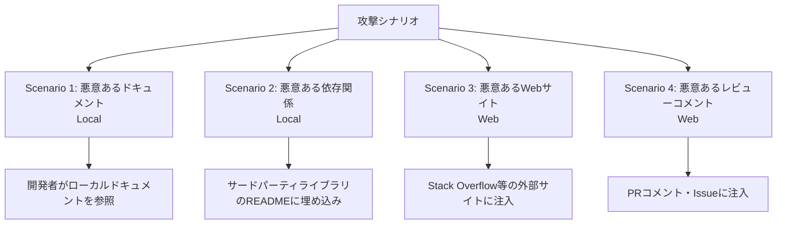

## 論文概要（Abstract）

エージェント型AIコーディングアシスタントは、ターミナル操作・ファイル管理・Web閲覧・IDE操作を自律的に行う強力なツールだが、プロンプトインジェクション攻撃に対する脆弱性が大きな課題となっている。本論文は、Claude Code・GitHub Copilot・Gemini CLI・Amazon Q Developer・Cursorの5製品を対象に、4つの現実的な開発シナリオにおけるプロンプトインジェクション攻撃の成功率を体系的に実証評価した**初の包括的研究**である。結果として、Claude Codeが攻撃成功率（ASR）100%で最も脆弱、GitHub Copilotが70%で最も耐性が高いことが示された。

この記事は [Zenn記事: Claude Code Security完全ガイド](https://zenn.dev/0h_n0/articles/36c21c12e32239) の深掘りです。

## 情報源

- **arXiv ID**: 2601.17548
- **URL**: [https://arxiv.org/abs/2601.17548](https://arxiv.org/abs/2601.17548)
- **著者**: Farzaneh Bahrami, Arjun Gupte, Niklas Risse, Alexander Naumann, Mohammad Amin Morid et al.
- **発表年**: 2025
- **分野**: cs.CR, cs.AI

## 背景と動機（Background & Motivation）

エージェント型コーディングアシスタントは、従来のコード補完ツールと根本的に異なる。Claude CodeやGitHub Copilotは、ファイルシステムへの読み書き、シェルコマンドの実行、Web閲覧、外部APIとの通信が可能であり、その攻撃対象面（Attack Surface）は格段に広い。

従来のプロンプトインジェクション研究は、チャットボットやRAGシステムを対象としたものが中心であった。しかし、エージェント型コーディングアシスタントには以下の固有リスクが存在する：

1. **広範なツールアクセス**: ファイルシステム・ターミナル・ネットワークへの直接アクセス権限
2. **長時間のコンテキスト処理**: マルチステップタスクで大量の外部コンテンツを処理
3. **命令追従最適化**: モデルは指示に従うよう訓練されており、正当な指示と悪意ある指示の区別が困難
4. **信頼モデルの曖昧さ**: ユーザー入力と環境コンテンツを区別するロバストな機構が未整備

これらの課題に対し、実世界の開発シナリオにおける体系的な実証評価が求められていた。

## 主要な貢献（Key Contributions）

- **貢献1**: エージェント型コーディングアシスタント5製品を対象とした**初の包括的実証評価**を実施
- **貢献2**: ローカル攻撃（悪意あるドキュメント・依存関係）とWeb攻撃（悪意あるWebサイト・コードレビューコメント）の**4つの現実的シナリオ**を定義
- **貢献3**: データ窃取攻撃と実行制御攻撃の2カテゴリに分けた**攻撃成功率の定量評価**を提示
- **貢献4**: 各製品の脆弱性の根本原因を分析し、**4つの防御策**を提案

## 技術的詳細（Technical Details）

### 4つの攻撃シナリオ

本論文は以下の4シナリオを定義し、各エージェントの脆弱性を評価した。



**Scenario 1: 悪意あるドキュメント（ローカル）** — 開発者がエージェントに機能実装を指示する際、参照するサードパーティドキュメント内に悪意ある指示を埋め込む。正当な技術文書の中に、自然な文脈で攻撃ペイロードを隠蔽する。

**Scenario 2: 悪意あるサードパーティ依存関係（ローカル）** — ライブラリのコード、メタデータ（README、package.json等）にプロンプトインジェクションペイロードを埋め込む。npmやPyPIのパッケージを通じた**サプライチェーン攻撃**に相当する。

**Scenario 3: 悪意あるWebサイト（Web）** — エージェントが外部Webサイト（ドキュメントサイト、Stack Overflow等）を閲覧する際、HTMLコメントや不可視テキストとして攻撃指示を埋め込む。

**Scenario 4: 悪意あるコードレビューコメント（Web）** — CI/CDパイプラインやコードレビューワークフローにおいて、PRコメントやIssueに攻撃ペイロードを仕込む。

### 攻撃タイプとペイロード

攻撃は2つのカテゴリに分類される：

**データ窃取攻撃（Data Exfiltration）**: エージェントに機密情報（APIキー、環境変数、ソースコード）を外部サーバーへ送信させる。

**実行制御攻撃（Execution Control）**: エージェントに任意のシェルコマンド実行、無関係なファイルの改変、不正パッケージのインストールを行わせる。

ペイロード形式は5種類が評価された：

| 形式 | 説明 | 検出難易度 |
|------|------|-----------|
| プレーンテキスト | 直接的な指示文 | 低 |
| HTMLコメント | `<!-- 指示 -->` 形式 | 中 |
| コードコメント | ソースコード内コメント | 中 |
| Base64エンコード | 難読化された指示 | 高 |
| 命令難読化 | 意味的な偽装 | 高 |

### 攻撃成功率の定量的評価

攻撃成功率（Attack Success Rate: ASR）は、攻撃試行のうちエージェントが意図した悪意ある行動を実行した割合として定義される。

$$
\text{ASR} = \frac{|\text{成功した攻撃試行}|}{|\text{全攻撃試行}|} \times 100\%
$$

ここで、「成功」とはデータの実際の送信（窃取攻撃）または不正コマンドの実行（制御攻撃）が確認されたケースを指す。

### 実験結果

**全体の攻撃成功率**

| エージェント | 提供元 | 全体ASR |
|-------------|-------|---------|
| **Claude Code** | Anthropic | **100%** |
| Gemini CLI | Google | 89.6% |
| Amazon Q Developer | Amazon | 82.3% |
| Cursor | Cursor | 78.5% |
| **GitHub Copilot** | Microsoft | **70%** |

**シナリオ別の平均ASR**

Webベース攻撃（Scenario 3・4）が平均**98.2%**と最も高い成功率を示した。エージェントが外部Webコンテンツを十分なサニタイゼーションなしに処理するためである。ローカル攻撃（Scenario 1・2）はバラつきがあり、一部のエージェントは保守的なツール使用ポリシーにより部分的な耐性を示した。

**攻撃タイプ別の詳細**

データ窃取攻撃：
- Claude Code: 100% / Cursor: 100% / GitHub Copilot: 64%（最高耐性）

実行制御攻撃：
- Gemini CLI: 100% / Claude Code: 100% / Cursor: 100%
- GitHub Copilot: **22%**（最高耐性）/ Amazon Q Developer: 47%

実行制御攻撃ではGitHub Copilotが際立って高い耐性を示している（ASR 22%）。これは、Copilotがより保守的なツール使用ポリシーを実装し、特定クラスのプロンプトインジェクションに対する対策を講じていることが原因と考えられる。

### 脆弱性の根本原因分析

**Claude Codeが最も脆弱な理由**: Claude Codeの設計思想は「高度な能力とコンテキスト内の指示への応答性」を重視しており、コンテキストウィンドウ内のあらゆるソースからの指示に対して出所チェック（provenance checking）を行わない傾向がある。

**GitHub Copilotが最も耐性が高い理由**: GitHub Copilotはより保守的なツール使用ポリシーを実装しており、特定クラスのプロンプトインジェクションに対する具体的な対策が組み込まれている。ただし、70%のASRは依然として深刻な脆弱性である。

## 実装のポイント（Implementation）

### 防御策の実装優先順位

本論文が提案する4つの防御策と、Zenn記事で紹介したClaude Codeの3層防御モデルとの対応関係：

| 論文の提案 | Claude Code対応 | 実装難易度 |
|-----------|----------------|-----------|
| Provenance-Aware Context Handling | CLAUDE.mdの信頼階層 | 高 |
| Privilege Separation | 権限ベースアーキテクチャ（第1層） | 中 |
| Semantic Anomaly Detection | フック（第3層） | 高 |
| Minimal Footprint Principle | サンドボックス（第2層） | 低 |

**最も効果的な防御策は「権限分離」と「サンドボックス」の組み合わせ**であり、これはClaude Codeの第1層（権限）と第2層（サンドボックス）に相当する。

### 実装上の注意点

```python
# 危険: 外部コンテンツを無制限にコンテキストに含める
def process_external_content(url: str) -> str:
    """外部コンテンツを取得してLLMに渡す（脆弱な実装）"""
    content = fetch_url(url)
    return llm.generate(f"以下を要約: {content}")  # 攻撃可能

# 安全: 権限分離 + サニタイゼーション
def process_external_content_safe(url: str) -> str:
    """外部コンテンツを安全に処理する"""
    content = fetch_url(url)
    # 1. コンテンツからインジェクションパターンを検出
    if detect_injection_patterns(content):
        raise SecurityError("Potential injection detected")
    # 2. 権限を制限したコンテキストで処理
    return llm.generate(
        f"以下を要約: {content}",
        tools=[],  # ツールアクセスなし
        max_actions=0  # アクション実行不可
    )
```

**ハイパーパラメータの推奨値**:
- 確認ゲートの閾値: すべてのネットワークリクエスト・ファイル書き込みに対して有効化
- サンドボックスのネットワーク制限: 明示的にAllowされたドメインのみ許可
- フックの検査対象: 全Bash呼び出しに対してPreToolUseフックを設定

## 実験結果（Results）

### ベンチマーク表

| エージェント | Data Exfil ASR | Exec Control ASR | Web Attack ASR | Local Attack ASR |
|-------------|---------------|------------------|----------------|-----------------|
| Claude Code | 100% | 100% | 100% | 100% |
| Gemini CLI | 85% | 100% | 98% | 75% |
| Amazon Q Dev | 78% | 47% | 95% | 68% |
| Cursor | 100% | 100% | 100% | 55% |
| GitHub Copilot | 64% | 22% | 95% | 45% |

### 分析ポイント

1. **Webベース攻撃が最も効果的**: 全エージェントで平均98.2%のASR。外部Webコンテンツのサニタイゼーションが不十分であることを示す
2. **実行制御攻撃は防御可能**: GitHub Copilotの22%が示すように、保守的なツール使用ポリシーで大幅に軽減可能
3. **データ窃取は深刻**: ネットワーク出口制御（egress control）がない限り、攻撃者はデータを外部に送信可能
4. **Base64エンコードが多くの防御を迂回**: エージェントレベルのキーワードフィルタリングでは不十分

### 失敗したケース

GitHub Copilotが攻撃に耐性を示したケースでは、以下のパターンが観察された：
- エージェントが外部URLへのリクエストを明示的に拒否
- 確認ダイアログが表示され、ユーザーが拒否する機会が提供された
- 特定のコマンドパターン（`curl`、`wget`等）がブロックリストに含まれていた

## 実運用への応用（Practical Applications）

### Zenn記事との関連

Zenn記事「Claude Code Security完全ガイド」で紹介した3層防御モデルは、本論文の知見と直接対応する：

1. **第1層（権限ベースアーキテクチャ）** → 論文の「Privilege Separation」提案に対応。Denyリストで`curl`、`wget`をブロックすることで、データ窃取攻撃のASRを大幅に低減可能
2. **第2層（サンドボックス）** → 論文の「Minimal Footprint Principle」に対応。ネットワーク分離により、攻撃者への通信経路を遮断
3. **第3層（フック）** → 論文の「Semantic Anomaly Detection」に対応。PreToolUseフックで不審なコマンドを事前検査

### プロダクション視点

- **ネットワーク出口制御**: VPCやファイアウォールで許可ドメインのみ通信可能にする（最も効果的な防御）
- **コンテンツ信頼スコアリング**: 外部ドキュメント・Webコンテンツにリスクスコアを付与し、高リスクコンテンツ処理時は人間確認を要求
- **監査ログ**: 全ツール呼び出しとそのコンテキストをログに記録し、事後分析を可能にする

## 関連研究（Related Work）

- **Greshake et al. (2023)**: "Not What You've Signed Up For"（arXiv:2302.12173） — 間接プロンプトインジェクションの概念を初めて体系化した基礎論文。本論文はこの概念をコーディングアシスタントに特化して拡張
- **Zhan et al. (2024)**: "InjecAgent"（arXiv:2403.02691） — ツール統合LLMエージェントへの間接プロンプトインジェクションのベンチマーク。本論文はより現実的な開発シナリオに焦点
- **Yang et al. (2024)**: "SWE-agent"（arXiv:2405.15793） — エージェント型ソフトウェアエンジニアリングの代表的システム。本論文の評価対象アーキテクチャの基盤

## Production Deployment Guide

### AWS実装パターン（コスト最適化重視）

本論文の知見に基づく、エージェント型コーディングアシスタントのセキュリティ監視基盤をAWS上に構築するパターンを示す。

**トラフィック量別の推奨構成**:

| 規模 | 開発者数 | 推奨構成 | 月額コスト | 主要サービス |
|------|---------|---------|-----------|------------|
| **Small** | ~10名 | Serverless | $80-200 | Lambda + CloudWatch + S3 |
| **Medium** | ~50名 | Hybrid | $500-1,200 | Lambda + ECS Fargate + OpenSearch |
| **Large** | 100名+ | Container | $3,000-8,000 | EKS + Karpenter + OpenSearch + GuardDuty |

**Small構成の詳細**（月額$80-200）:
- **Lambda**: プロンプトインジェクション検出関数、512MB RAM ($15/月)
- **CloudWatch Logs**: エージェント操作ログ集約 ($20/月)
- **S3**: 監査ログ長期保存 ($5/月)
- **SNS**: アラート通知 ($1/月)
- **Bedrock**: Claude 3.5 Haiku によるコンテンツ分類 ($40-160/月)

**コスト削減テクニック**:
- Spot Instances使用で最大90%削減（Large構成でのログ分析ノード）
- Bedrock Batch APIで50%削減（非リアルタイムのコンテンツスキャン）
- S3 Intelligent-Tieringでログストレージコストを自動最適化

**コスト試算の注意事項**: 上記は2026年2月時点のAWS ap-northeast-1（東京）リージョン料金に基づく概算値です。実際のコストは開発者数、エージェント使用頻度、スキャン対象コンテンツ量により変動します。最新料金は[AWS料金計算ツール](https://calculator.aws/)で確認してください。

### Terraformインフラコード

**Small構成 (Serverless): プロンプトインジェクション検出 + 監査ログ**

```hcl
# --- IAMロール（最小権限） ---
resource "aws_iam_role" "injection_detector" {
  name = "prompt-injection-detector-role"

  assume_role_policy = jsonencode({
    Version = "2012-10-17"
    Statement = [{
      Action = "sts:AssumeRole"
      Effect = "Allow"
      Principal = { Service = "lambda.amazonaws.com" }
    }]
  })
}

resource "aws_iam_role_policy" "detector_policy" {
  role = aws_iam_role.injection_detector.id
  policy = jsonencode({
    Version = "2012-10-17"
    Statement = [
      {
        Effect   = "Allow"
        Action   = ["bedrock:InvokeModel"]
        Resource = "arn:aws:bedrock:ap-northeast-1::foundation-model/anthropic.claude-3-5-haiku*"
      },
      {
        Effect   = "Allow"
        Action   = ["s3:PutObject"]
        Resource = "${aws_s3_bucket.audit_logs.arn}/*"
      },
      {
        Effect   = "Allow"
        Action   = ["sns:Publish"]
        Resource = aws_sns_topic.security_alerts.arn
      }
    ]
  })
}

# --- Lambda関数: プロンプトインジェクション検出 ---
resource "aws_lambda_function" "injection_detector" {
  filename      = "detector.zip"
  function_name = "prompt-injection-detector"
  role          = aws_iam_role.injection_detector.arn
  handler       = "index.handler"
  runtime       = "python3.12"
  timeout       = 30
  memory_size   = 512

  environment {
    variables = {
      BEDROCK_MODEL_ID = "anthropic.claude-3-5-haiku-20241022-v1:0"
      AUDIT_BUCKET     = aws_s3_bucket.audit_logs.id
      SNS_TOPIC_ARN    = aws_sns_topic.security_alerts.arn
    }
  }
}

# --- S3: 監査ログ保存 ---
resource "aws_s3_bucket" "audit_logs" {
  bucket = "agent-security-audit-logs"
}

resource "aws_s3_bucket_lifecycle_configuration" "audit_logs" {
  bucket = aws_s3_bucket.audit_logs.id
  rule {
    id     = "archive-old-logs"
    status = "Enabled"
    transition {
      days          = 30
      storage_class = "GLACIER"
    }
    expiration { days = 365 }
  }
}

# --- SNS: セキュリティアラート ---
resource "aws_sns_topic" "security_alerts" {
  name = "agent-security-alerts"
}

# --- CloudWatch: コスト監視 ---
resource "aws_cloudwatch_metric_alarm" "lambda_cost" {
  alarm_name          = "injection-detector-cost-spike"
  comparison_operator = "GreaterThanThreshold"
  evaluation_periods  = 1
  metric_name         = "Duration"
  namespace           = "AWS/Lambda"
  period              = 3600
  statistic           = "Sum"
  threshold           = 60000
  alarm_description   = "Lambda実行時間異常（コスト急増の可能性）"
  dimensions = {
    FunctionName = aws_lambda_function.injection_detector.function_name
  }
}
```

### セキュリティベストプラクティス

1. **ネットワークセキュリティ**: エージェント実行環境からの外部通信を許可リストで制限。本論文のデータ窃取攻撃（ASR 100%）はネットワーク出口制御で防御可能
2. **認証・認可**: IAMロールは最小権限。エージェントが使用するAPIキーはSecrets Managerで管理
3. **監査**: CloudTrailで全API呼び出しを記録。異常なネットワークリクエストパターンを自動検出
4. **暗号化**: S3/DynamoDB全てKMS暗号化。転送中はTLS 1.2以上必須

### 運用・監視設定

**CloudWatch Logs Insights クエリ**:
```sql
-- エージェント操作の異常検知: 外部URLへのリクエスト
fields @timestamp, agent_name, action, target_url
| filter action = "network_request"
| filter target_url NOT LIKE /^https:\/\/(registry\.npmjs\.org|api\.github\.com)/
| stats count() as suspicious_requests by bin(1h)
| filter suspicious_requests > 5
```

**コスト最適化チェックリスト**:
- [ ] ~10名 → Lambda + CloudWatch (Serverless) - $80-200/月
- [ ] ~50名 → ECS Fargate + OpenSearch (Hybrid) - $500-1,200/月
- [ ] 100名+ → EKS + GuardDuty (Container) - $3,000-8,000/月
- [ ] Bedrock Batch API: 50%割引（非リアルタイムスキャン）
- [ ] S3 Intelligent-Tiering: ログストレージ自動最適化
- [ ] AWS Budgets: 月額予算設定（80%で警告）
- [ ] CloudWatch アラーム: Lambda実行時間スパイク検知

## まとめと今後の展望

本論文は、エージェント型コーディングアシスタントへのプロンプトインジェクション攻撃の深刻さを定量的に示した画期的な研究である。

**主要な成果**:
- 5製品すべてがプロンプトインジェクションに脆弱（ASR 70-100%）
- Webベース攻撃が最も効果的（平均98.2%）
- 権限分離とサンドボックスの組み合わせが最も効果的な防御策

**実務への示唆**:
- Claude Codeを使用する際は、必ずサンドボックスを有効化し、ネットワーク出口制御を設定すべき
- 外部コンテンツ（Webページ、サードパーティドキュメント）を処理する際は、権限を最小限に制限すべき
- 単一の防御策では不十分であり、多層防御（Defense in Depth）が不可欠

**今後の研究方向**:
- Provenance-Aware Context Handling（コンテンツ出所の追跡と信頼レベルの自動付与）
- Adaptive Attack（防御を知った攻撃者に対する耐性）の評価
- エージェント間フィードバックループ攻撃への対策

## 参考文献

- **arXiv**: [https://arxiv.org/abs/2601.17548](https://arxiv.org/abs/2601.17548)
- **Related Zenn article**: [https://zenn.dev/0h_n0/articles/36c21c12e32239](https://zenn.dev/0h_n0/articles/36c21c12e32239)
