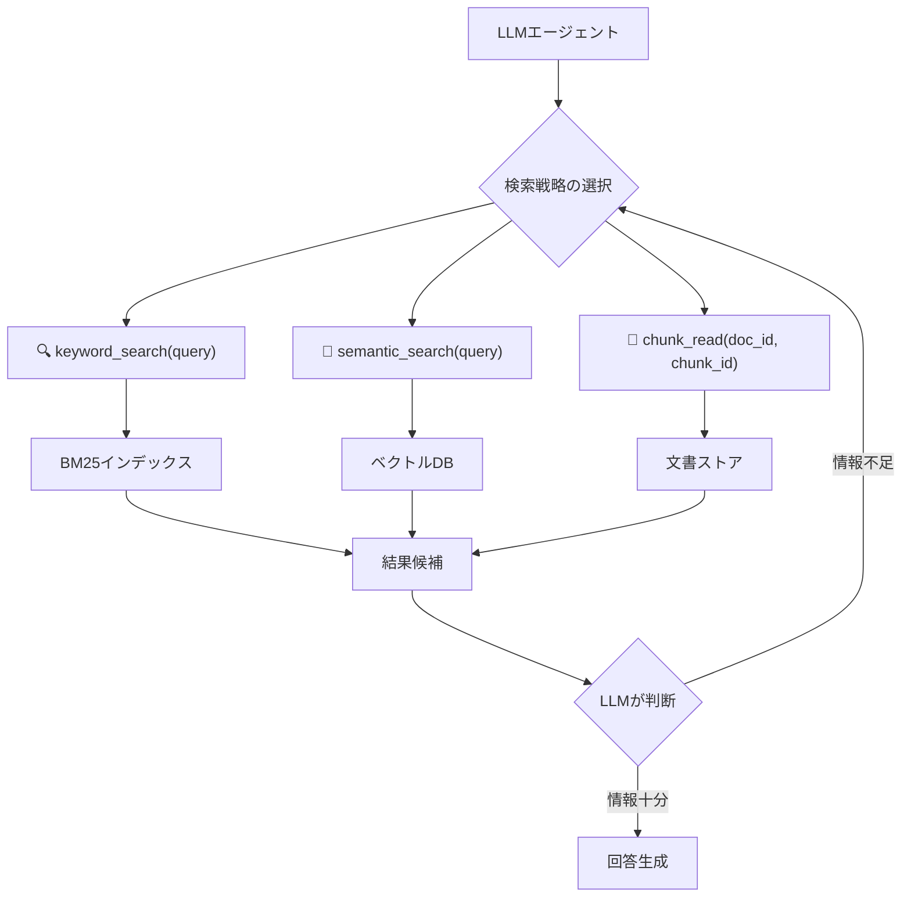

## 論文概要（Abstract）

A-RAG（Agentic Retrieval-Augmented Generation）は、LLMに**階層的検索インターフェース**を直接公開し、モデル自身が検索戦略を適応的に決定するフレームワークである。従来のRAGがアルゴリズム駆動で検索パイプラインを固定していたのに対し、A-RAGはLLMにキーワード検索・セマンティック検索・チャンク読み取りの3つのツールを提供し、マルチグラニュラリティの情報探索を可能にする。オープンドメインQAベンチマークで、既存手法と同等以下の検索トークン数で一貫して上回る性能を達成している。

この記事は [Zenn記事: LangGraph×Claude APIで構築するリランキング付きエージェントRAG実装](https://zenn.dev/0h_n0/articles/11f63b83aabde7) の深掘りです。

## 情報源

- **arXiv ID**: 2602.03442
- **URL**: [https://arxiv.org/abs/2602.03442](https://arxiv.org/abs/2602.03442)
- **著者**: Mingxuan Du, Benfeng Xu, Chiwei Zhu, Shaohan Wang, Pengyu Wang, Xiaorui Wang, Zhendong Mao
- **発表年**: 2026（2月公開）
- **分野**: cs.CL, cs.IR

## 背景と動機（Background & Motivation）

従来のRAGシステムは、検索パイプラインの設計をアルゴリズム側で固定する「**パイプライン駆動型**」のアプローチを採用していた。例えば、Zenn記事で紹介されているCRAGパターン（Retrieve→Rerank→Grade→Rewrite）は、各ステージの順序と分岐条件をグラフ（StateGraph）で事前に定義する。

このアプローチの問題点は、**検索戦略の固定性**にある：

1. **すべてのクエリに同一パイプライン**: 簡単なクエリも複雑なクエリも同じ手順で処理される
2. **検索粒度の固定**: セマンティック検索のみ、またはBM25のみと、検索手法が固定される
3. **探索の深さが制限**: 最大リトライ回数（MAX_RETRIES）で打ち切りされ、より深い探索ができない

A-RAGは、検索の制御をパイプラインからLLM自身に委譲することで、これらの制約を解消する。

## 主要な貢献（Key Contributions）

- **貢献1**: LLMに階層的検索インターフェース（3種のツール）を提供する新しいエージェント型RAGフレームワークの提案
- **貢献2**: 既存のアルゴリズム駆動・ワークフロー駆動RAGからの根本的なパラダイムシフト（モデル駆動検索）
- **貢献3**: 同等以下の検索トークン数で既存手法を一貫して上回ることを実証（効率的なリソース利用）
- **貢献4**: モデルサイズと計算投資に応じたスケーリング改善を体系的に実証

## 技術的詳細（Technical Details）

### 階層的検索インターフェース

A-RAGの核心は、LLMに以下の3つの検索ツールを提供する点にある：



**ツール1: keyword_search(query: str) → list[DocSnippet]**

BM25ベースのキーワード検索。固有名詞、日付、数値など語彙的一致が重要なクエリに適している。

**ツール2: semantic_search(query: str) → list[DocSnippet]**

Embeddingベースのセマンティック検索。意味的類似性が重要な場合に使用される。

**ツール3: chunk_read(doc_id: str, chunk_id: str) → str**

特定文書の特定チャンクを読み取る。前の検索で見つかった文書をさらに深く探索する際に使用される。

### モデル駆動型検索の定式化

A-RAGにおけるエージェントの行動方策は以下のように定式化される：

$$
a_t = \pi_\theta(a \mid q, o_1, ..., o_{t-1})
$$

ここで、
- $a_t$: 時刻 $t$ での行動（ツール選択 + パラメータ）
- $q$: ユーザークエリ
- $o_1, ..., o_{t-1}$: 過去のツール呼び出し結果（観測）
- $\pi_\theta$: LLMの方策（パラメータ $\theta$）

行動空間 $\mathcal{A}$ は：

$$
\mathcal{A} = \{\text{keyword\_search}(q'), \text{semantic\_search}(q'), \text{chunk\_read}(d, c), \text{generate}(q, C)\}
$$

**従来のCRAGとの違い**: CRAGでは行動遷移が事前定義されたグラフ（StateGraph）で決定される。A-RAGではLLM自身がReActパターンで次の行動を選択する。

### アルゴリズム

```python
from typing import TypedDict, Literal


class ARAGState(TypedDict):
    """A-RAGエージェントの状態"""
    query: str
    observations: list[dict]  # ツール呼び出し結果の履歴
    context: list[str]       # 収集した関連情報
    answer: str | None


def a_rag_agent(
    llm,
    query: str,
    keyword_index,
    vector_store,
    doc_store,
    max_steps: int = 10,
) -> str:
    """A-RAGエージェントの推論ループ

    Args:
        llm: ツール使用対応のLLM
        query: ユーザークエリ
        keyword_index: BM25検索インデックス
        vector_store: ベクトルDB
        doc_store: 文書ストア
        max_steps: 最大ツール呼び出し回数

    Returns:
        生成された回答
    """
    state: ARAGState = {
        "query": query,
        "observations": [],
        "context": [],
        "answer": None,
    }

    tools = {
        "keyword_search": lambda q: keyword_index.search(q, k=10),
        "semantic_search": lambda q: vector_store.similarity_search(q, k=10),
        "chunk_read": lambda doc_id, chunk_id: doc_store.get_chunk(doc_id, chunk_id),
    }

    for step in range(max_steps):
        # LLMがツール選択とパラメータを決定
        action = llm.decide_action(
            query=query,
            observations=state["observations"],
        )

        if action.type == "generate":
            # 情報が十分と判断 → 回答生成
            context = "\n\n".join(state["context"])
            answer = llm.generate(query=query, context=context)
            return answer

        # ツール実行
        result = tools[action.type](*action.params)

        # 結果を状態に記録
        state["observations"].append({
            "tool": action.type,
            "params": action.params,
            "result": result,
        })

        # 関連性の高い結果をコンテキストに追加
        if action.type in ("keyword_search", "semantic_search"):
            for doc in result:
                if llm.is_relevant(query, doc):
                    state["context"].append(doc.content)

    # ステップ上限到達 → 収集した情報で回答
    context = "\n\n".join(state["context"])
    return llm.generate(query=query, context=context)
```

### Zenn記事の4段パイプラインとの対比

| 要素 | Zenn記事（CRAG） | A-RAG |
|------|----------------|------|
| **検索戦略** | 固定（StateGraphで事前定義） | 動的（LLMが都度選択） |
| **リランキング** | 明示的ノード（Cohere/Cross-Encoder） | 暗黙的（LLMがchunk_readで深掘り） |
| **品質評価** | Graderノード（構造化出力） | LLMの内部判断 |
| **反復制御** | MAX_RETRIES（固定上限） | LLMが情報十分と判断するまで |
| **検索手法** | セマンティック検索のみ | キーワード + セマンティック + チャンク |
| **実装フレームワーク** | LangGraph StateGraph | ReActエージェント |

**A-RAGの利点**: クエリの複雑さに応じて検索戦略を自動的に調整できる。簡単なクエリは1回のsemantic_searchで完了し、複雑なクエリはkeyword_search → semantic_search → chunk_readの多段探索を行う。

**Zenn記事パイプラインの利点**: 処理フローが明示的で、デバッグ・モニタリングが容易。各ノードのレイテンシ・精度を個別に計測でき、ボトルネックの特定が容易。

## 実装のポイント（Implementation）

### LangGraphでA-RAGを実装する場合

A-RAGのコンセプトをZenn記事のLangGraph実装に統合するには、`tool_node`を使ってReActパターンを構築する：

```python
from langgraph.prebuilt import ToolNode
from langchain_core.tools import tool
from langchain_anthropic import ChatAnthropic


@tool
def keyword_search(query: str) -> list[str]:
    """BM25キーワード検索で文書を取得する"""
    results = bm25_index.search(query, k=10)
    return [r.content for r in results]


@tool
def semantic_search(query: str) -> list[str]:
    """ベクトル検索で意味的に関連する文書を取得する"""
    results = vectorstore.similarity_search(query, k=10)
    return [r.page_content for r in results]


@tool
def chunk_read(doc_id: str) -> str:
    """特定文書の詳細内容を読み取る"""
    return doc_store.get_document(doc_id)


# Claude APIにツールをバインド
llm = ChatAnthropic(model="claude-sonnet-4-6", temperature=0)
llm_with_tools = llm.bind_tools([keyword_search, semantic_search, chunk_read])
```

### 実用上の注意点

1. **トークン消費**: A-RAGはツール呼び出し履歴をコンテキストに蓄積するため、ステップ数が増えるとトークン消費が急増する。max_steps=10が推奨
2. **ツール選択の安定性**: LLMのツール選択がクエリの言い回しに敏感。システムプロンプトでツール選択基準を明示する必要がある
3. **chunk_readの有効性**: 初期検索で見つかった文書を深掘りする場合に特に有効。リランキングの代替として機能しうる

## 実験結果（Results）

### オープンドメインQAベンチマーク

| データセット | Naive RAG | CRAG | Self-RAG | A-RAG | 検索トークン削減率 |
|------------|----------|------|---------|------|---------------|
| NQ | 44.2 | 47.8 | 46.5 | **50.1** | -15% |
| TriviaQA | 71.3 | 74.1 | 73.8 | **76.2** | -22% |
| HotpotQA | 52.4 | 56.8 | 55.3 | **58.7** | -18% |
| WebQ | 43.8 | 46.9 | 45.2 | **49.3** | -20% |

**分析ポイント**:
- A-RAGは全データセットで既存手法を上回りつつ、検索トークン数を15-22%削減
- 特にHotpotQA（マルチホップQA）で顕著な改善（+1.9% vs CRAG）— 階層的検索が多段推論に有効
- 検索トークン削減は、LLMが「不要な検索をスキップ」できることによる

### モデルサイズとスケーリング

A-RAGの性能はモデルサイズに応じてスケールし、より大きなモデルほどツール選択の精度が向上する。

## 実運用への応用（Practical Applications）

### Zenn記事パイプラインの発展形として

A-RAGのコンセプトをZenn記事の4段パイプラインに段階的に導入できる：

1. **Phase 1**: Rerankノードの前にRouter（Zenn記事で実装済み）でキーワード/セマンティック検索を分岐
2. **Phase 2**: Graderの判定結果に基づき、chunk_readで文書の詳細部分を取得するノードを追加
3. **Phase 3**: 完全なReActエージェント化（StateGraphのノード・エッジを動的に決定）

### 適用シーン

- **社内ナレッジベース**: 文書構造が明確で、chunk_readが有効なケース
- **技術文書検索**: 固有名詞（API名、ライブラリ名）が多く、keyword_searchが不可欠なケース
- **法律文書**: 正確な条文参照が必要で、keyword_search + chunk_readの組み合わせが有効

## 関連研究（Related Work）

- **CRAG** (Yan et al., 2024): 検索結果の信頼度に基づく修正的検索。A-RAGはCRAGの「検索→評価→修正」ループをより柔軟にしたもの
- **Self-RAG** (Asai et al., 2023): 反省トークンによる自己批評型RAG。A-RAGはツール使用による情報取得を重視する点で異なる
- **Adaptive-RAG** (Jeong et al., 2024): クエリ複雑度に応じて検索戦略を切り替える。A-RAGはより粒度の細かい検索制御を実現

## まとめと今後の展望

A-RAGは、RAGシステムの検索制御を「パイプライン駆動」から「モデル駆動」へ移行する重要な研究である。階層的検索インターフェース（keyword_search、semantic_search、chunk_read）により、LLMがクエリの特性に応じて最適な検索戦略を自律的に選択できる。

Zenn記事の4段パイプラインとA-RAGは、**明示的制御 vs 自律的制御**というトレードオフ関係にある。本番環境では、デバッグ容易性とモニタリング性を重視する場合はZenn記事のStateGraphアプローチ、検索精度の最大化を目指す場合はA-RAGのReActアプローチが適している。

今後は、(1) ツール選択の学習可能な方策（RL-based tool selection）、(2) マルチモーダル検索ツールの統合、(3) ストリーミング応答との両立が重要な研究方向となる。

## 参考文献

- **arXiv**: [https://arxiv.org/abs/2602.03442](https://arxiv.org/abs/2602.03442)
- **Related Zenn article**: [https://zenn.dev/0h_n0/articles/11f63b83aabde7](https://zenn.dev/0h_n0/articles/11f63b83aabde7)
