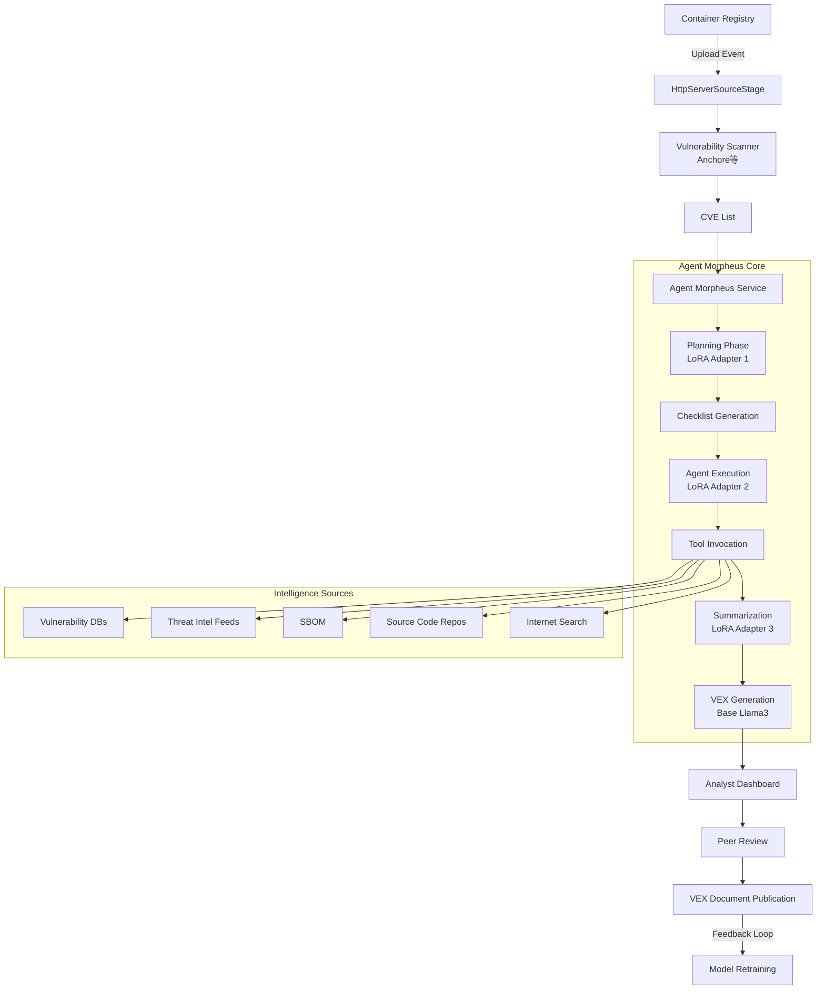

## ブログ概要（Summary）

NVIDIAが公開したAgent Morpheusは、生成AIを活用してコンテナイメージのCVE（Common Vulnerabilities and Exposures）トリアージを自動化するシステムです。4つのLoRAアダプタを動的に切り替える単一NIMコンテナ、イベント駆動型RAGパイプライン、Morpheusフレームワークによる非同期並列処理を組み合わせ、20件のCVE処理を逐次実行の2,842秒から並列処理の305秒へと**9.3倍高速化**しました。CVEあたり平均41回のLLMクエリを実行し、脆弱性の「存在」と「悪用可能性」を区別した上で、機械可読なVEXドキュメントを自動生成します。

この記事は [Zenn記事: Claude Code Security完全ガイド：3層防御モデルとゼロデイ検出で開発を守る](https://zenn.dev/0h_n0/articles/36c21c12e32239) の深掘りです。

## 情報源

- **種別**: 企業テックブログ
- **URL**: [Applying Generative AI for CVE Analysis at an Enterprise Scale](https://developer.nvidia.com/blog/applying-generative-ai-for-cve-analysis-at-an-enterprise-scale/)
- **組織**: NVIDIA（Cybersecurity / NIM Agent Blueprint）
- **発表日**: 2024年

## 技術的背景（Technical Background）

企業のソフトウェアサプライチェーンにおけるCVEトリアージは、セキュリティチームにとって深刻なボトルネックです。コンテナイメージの脆弱性スキャンは数十件のCVEを検出しますが、その大半は**false positive**や**悪用不可能**なものです。具体的には以下の理由で「CVEシグネチャがあっても悪用できない」ケースが頻出します：

- **実行環境の欠如**: `.jar`ファイルが存在するがJREがインストールされていない
- **脆弱関数の未使用**: ライブラリに脆弱性があるが、該当関数がアプリケーションコードから呼び出されていない
- **緩和条件の存在**: ネットワーク分離やサンドボックスにより攻撃経路が遮断されている

従来、この判定にはセキュリティアナリストが手動で各CVEを調査する必要があり、1件あたり数時間から数日を要していました。Agent Morpheusは、Zenn記事で解説したClaude Codeの`/security-review`のようなAI支援セキュリティ分析を、CVEトリアージに特化した形でエンタープライズスケールに拡張するアプローチです。

## 実装アーキテクチャ（Architecture）

### 全体構成

Agent Morpheusのアーキテクチャは、イベント駆動型パイプラインとLLMエージェントの組み合わせで構成されます。



### NIMマイクロサービス構成

Agent Morpheusの中核は、**単一のNIMコンテナ**で4つのLlama3モデルをLoRAアダプタの動的切り替えによって提供する設計です：

| モデル用途 | アダプタ | 役割 |
|-----------|---------|------|
| Planning | LoRA #1 | CVE固有の調査チェックリスト生成 |
| Agent Execution | LoRA #2 | チェックリスト項目の自律実行 |
| Summarization | LoRA #3 | 調査結果の統合・要約 |
| General | Base Llama3 | VEXドキュメント生成・汎用タスク |

この設計により、4つの専用モデルを個別デプロイする場合と比較してGPUメモリ使用量を大幅に削減しています。LoRAアダプタは低ランク行列の差分のみを保持するため、ベースモデルのパラメータを共有しつつタスク固有の特化を実現します。

$$
W' = W_0 + \Delta W = W_0 + BA
$$

ここで、
- $W_0 \in \mathbb{R}^{d \times k}$: ベースモデルの重み行列（固定）
- $B \in \mathbb{R}^{d \times r}$: LoRA低ランク行列
- $A \in \mathbb{R}^{r \times k}$: LoRA低ランク行列
- $r \ll \min(d, k)$: LoRAランク（通常 $r = 8 \sim 64$）

### エージェントワークフロー

各CVEに対して、Agent Morpheusは以下の3段階パイプラインを実行します：

**Phase 1: Planning（チェックリスト生成）**

CVE情報を入力として、調査に必要なタスクのチェックリストを動的に生成します。これは静的ルールベースではなく、CVEの種類に応じてLLMが適応的に調査計画を策定する点が重要です。

```python
from typing import TypedDict

class CVEChecklistItem(TypedDict):
    """CVE調査チェックリストの各項目"""
    task_id: str
    description: str
    tool_required: str  # "version_compare" | "code_inspect" | "search" | ...
    priority: int

def generate_checklist(cve_info: dict) -> list[CVEChecklistItem]:
    """Planning LoRAアダプタを使用してCVE固有のチェックリストを生成

    Args:
        cve_info: CVE ID、CVSS、affected packages等を含む辞書

    Returns:
        調査タスクのリスト（優先度順）
    """
    prompt = f"""
    CVE: {cve_info['cve_id']}
    CVSS: {cve_info['cvss_score']}
    Affected: {cve_info['affected_package']}

    Generate an investigation checklist for this CVE.
    """
    # NIM API call with Planning LoRA adapter
    response = nim_client.chat(
        model="llama3-planning-lora",
        messages=[{"role": "user", "content": prompt}]
    )
    return parse_checklist(response)
```

**Phase 2: Agent Execution（自律実行）**

生成されたチェックリストの各項目を、専用ツールを使って自律的に実行します：

- **Version Comparison Tool**: セマンティックバージョニングの比較（LLMが苦手とする処理）
- **Code Introspection**: 脆弱関数がアプリケーションコードから呼び出されているかの確認
- **Dependency Analysis**: 依存関係チェーンの解析
- **Calculator**: EPSS（Exploit Prediction Scoring System）スコアの計算
- **Internet Search**: 最新の脅威インテリジェンス検索

**Phase 3: Summarization（統合・判定）**

全ツール実行結果を統合し、CVEの悪用可能性を判定します。判定結果は以下のカテゴリに分類されます：

- **Exploitable**: 脆弱性が実行可能かつ悪用可能
- **Not Exploitable**: 脆弱性シグネチャは存在するが悪用不可能（理由付き）
  - False Positive
  - Missing Runtime Dependencies
  - Vulnerable Functions Not Called
  - Mitigating Conditions Present

## Production Deployment Guide

### AWS実装パターン（コスト最適化重視）

Agent Morpheusのようなエンタープライズ規模のCVEトリアージパイプラインをAWSに展開する場合、GPU推論とイベント駆動パイプラインの組み合わせが必要です。

**トラフィック量別の推奨構成**:

| 構成 | 想定規模 | 主要サービス | 月額概算 |
|------|---------|-------------|---------|
| Small | ~10コンテナ/日 | Lambda + Bedrock | $200-500 |
| Medium | ~50コンテナ/日 | ECS Fargate + Bedrock Batch | $800-2,000 |
| Large | 200+コンテナ/日 | EKS + Spot GPU + SageMaker | $5,000-15,000 |

**Small構成（~10コンテナ/日）**: Lambda + Bedrock

CVEあたり41 LLMクエリ × 平均20 CVE/コンテナ = 820クエリ/コンテナ。10コンテナ/日で8,200クエリ/日。Bedrock Claude Sonnetで処理。月額: Bedrock $150-300 + Lambda $10-30 + ECR/S3 $20-50 + CloudWatch $10-20 = **$200-500/月**

**Medium構成（~50コンテナ/日）**: ECS Fargate + Bedrock Batch API

41,000クエリ/日。Batch APIで50%削減。ECS Fargateでスキャナ常駐。月額: Bedrock Batch $400-800 + ECS Fargate $200-400 + ElastiCache $100-200 + その他 $100-200 = **$800-2,000/月**

**Large構成（200+コンテナ/日）**: EKS + GPU Spot Instances

164,000+クエリ/日。自社LoRAモデルをSageMaker/EKS GPUでホスト。Spot g5.xlargeで最大70%削減。月額: EKS + GPU Spot $2,000-5,000 + SageMaker $1,500-4,000 + その他 $1,500-3,000 = **$5,000-15,000/月**

**コスト削減テクニック**:
- Bedrock Batch API使用で50%削減（リアルタイム性不要なCVE分析に最適）
- Prompt Caching有効化: 同一パッケージの複数CVEで共通コンテキストをキャッシュし30-90%削減
- Spot Instances（g5.xlarge）活用で最大70%削減
- 夜間・週末のスキャンバッチ処理でオンデマンドコスト削減

> **注意**: 上記は2026年2月時点のAWS東京リージョン（ap-northeast-1）概算です。実際のコストはCVE数、LLMクエリ複雑度、トラフィックパターンにより変動します。

### Terraformインフラコード

**Small構成（Serverless）**:

```hcl
# CVE Analysis Pipeline - Small構成
# Lambda + Bedrock + DynamoDB

resource "aws_iam_role" "cve_analyzer" {
  name = "cve-analyzer-role"
  assume_role_policy = jsonencode({
    Version = "2012-10-17"
    Statement = [{
      Action = "sts:AssumeRole"
      Effect = "Allow"
      Principal = { Service = "lambda.amazonaws.com" }
    }]
  })
}

resource "aws_iam_role_policy" "cve_analyzer" {
  name = "cve-analyzer-policy"
  role = aws_iam_role.cve_analyzer.id
  policy = jsonencode({
    Version = "2012-10-17"
    Statement = [
      {
        Effect = "Allow"
        Action = [
          "bedrock:InvokeModel",
          "bedrock:InvokeModelWithResponseStream"
        ]
        Resource = "arn:aws:bedrock:ap-northeast-1::foundation-model/anthropic.claude-*"
      },
      {
        Effect = "Allow"
        Action = ["dynamodb:PutItem", "dynamodb:GetItem", "dynamodb:Query"]
        Resource = aws_dynamodb_table.cve_results.arn
      },
      {
        Effect = "Allow"
        Action = ["logs:CreateLogGroup", "logs:CreateLogStream", "logs:PutLogEvents"]
        Resource = "arn:aws:logs:*:*:*"
      }
    ]
  })
}

resource "aws_lambda_function" "cve_triage" {
  function_name = "cve-triage-agent"
  runtime       = "python3.12"
  handler       = "handler.lambda_handler"
  memory_size   = 1024  # LLMレスポンス解析に十分なメモリ
  timeout       = 900   # 15分（CVEあたり41クエリ対応）
  role          = aws_iam_role.cve_analyzer.arn

  environment {
    variables = {
      BEDROCK_MODEL_ID   = "anthropic.claude-sonnet-4-6-20250514"
      DYNAMODB_TABLE     = aws_dynamodb_table.cve_results.name
      MAX_QUERIES_PER_CVE = "41"
    }
  }
}

resource "aws_dynamodb_table" "cve_results" {
  name         = "cve-triage-results"
  billing_mode = "PAY_PER_REQUEST"  # On-Demandでコスト最適化
  hash_key     = "cve_id"
  range_key    = "container_image"

  attribute {
    name = "cve_id"
    type = "S"
  }
  attribute {
    name = "container_image"
    type = "S"
  }

  # KMS暗号化
  server_side_encryption { enabled = true }
  point_in_time_recovery { enabled = true }
}

# ECRイベントトリガー（コンテナpush検知）
resource "aws_cloudwatch_event_rule" "ecr_push" {
  name = "ecr-push-cve-scan"
  event_pattern = jsonencode({
    source      = ["aws.ecr"]
    detail-type = ["ECR Image Action"]
    detail      = { action-type = ["PUSH"] }
  })
}

resource "aws_cloudwatch_event_target" "lambda" {
  rule = aws_cloudwatch_event_rule.ecr_push.name
  arn  = aws_lambda_function.cve_triage.arn
}
```

**Large構成（EKS + GPU）**:

```hcl
# CVE Analysis Pipeline - Large構成
# EKS + Karpenter + Spot GPU Instances

module "eks" {
  source  = "terraform-aws-modules/eks/aws"
  version = "~> 20.0"

  cluster_name    = "cve-analysis-cluster"
  cluster_version = "1.31"

  vpc_id     = module.vpc.vpc_id
  subnet_ids = module.vpc.private_subnets

  # Karpenter用IAM
  enable_cluster_creator_admin_permissions = true
}

# Karpenter NodePool - Spot GPU優先
resource "kubectl_manifest" "karpenter_nodepool" {
  yaml_body = yamlencode({
    apiVersion = "karpenter.sh/v1"
    kind       = "NodePool"
    metadata   = { name = "gpu-spot" }
    spec = {
      template = {
        spec = {
          requirements = [
            { key = "karpenter.sh/capacity-type", operator = "In", values = ["spot", "on-demand"] }
            { key = "node.kubernetes.io/instance-type", operator = "In", values = ["g5.xlarge", "g5.2xlarge"] }
          ]
          nodeClassRef = { name = "default" }
        }
      }
      limits   = { cpu = "64", memory = "256Gi", "nvidia.com/gpu" = "8" }
      disruption = {
        consolidationPolicy = "WhenEmptyOrUnderutilized"
        consolidateAfter    = "30s"
      }
    }
  })
}

# AWS Budgets - コストアラート
resource "aws_budgets_budget" "cve_monthly" {
  name         = "cve-analysis-monthly"
  budget_type  = "COST"
  limit_amount = "15000"
  limit_unit   = "USD"
  time_unit    = "MONTHLY"

  notification {
    comparison_operator       = "GREATER_THAN"
    threshold                 = 80
    threshold_type            = "PERCENTAGE"
    notification_type         = "ACTUAL"
    subscriber_email_addresses = ["security-team@example.com"]
  }
}
```

### 運用・監視設定

**CloudWatch Logs Insights クエリ**:

```
# CVEトリアージのレイテンシ分析
fields @timestamp, cve_id, duration_ms, llm_queries_count
| filter event = "cve_triage_complete"
| stats avg(duration_ms) as avg_latency,
        p95(duration_ms) as p95_latency,
        avg(llm_queries_count) as avg_queries
  by bin(1h)
| sort @timestamp desc
```

**CloudWatch アラーム設定**:

```python
import boto3

cloudwatch = boto3.client("cloudwatch")

# Bedrockトークン使用量スパイク検知
cloudwatch.put_metric_alarm(
    AlarmName="CVE-Bedrock-Token-Spike",
    MetricName="InputTokenCount",
    Namespace="AWS/Bedrock",
    Statistic="Sum",
    Period=3600,
    EvaluationPeriods=1,
    Threshold=500000,  # 1時間50万トークン超過
    ComparisonOperator="GreaterThanThreshold",
    AlarmActions=["arn:aws:sns:ap-northeast-1:ACCOUNT:security-alerts"],
)
```

**X-Ray トレーシング**:

```python
from aws_xray_sdk.core import xray_recorder, patch_all

patch_all()  # boto3自動計装

@xray_recorder.capture("cve_triage")
def triage_cve(cve_id: str, container_image: str) -> dict:
    """CVEトリアージの実行とトレーシング"""
    subsegment = xray_recorder.current_subsegment()
    subsegment.put_annotation("cve_id", cve_id)
    subsegment.put_metadata("container", container_image)
    # ... triage logic
```

**Cost Explorer日次レポート**:

```python
import boto3
from datetime import date, timedelta

def daily_cost_report() -> dict:
    """日次コストレポート取得"""
    ce = boto3.client("ce")
    today = date.today()
    response = ce.get_cost_and_usage(
        TimePeriod={"Start": str(today - timedelta(1)), "End": str(today)},
        Granularity="DAILY",
        Metrics=["UnblendedCost"],
        GroupBy=[{"Type": "DIMENSION", "Key": "SERVICE"}],
    )
    total = sum(
        float(g["Metrics"]["UnblendedCost"]["Amount"])
        for r in response["ResultsByTime"]
        for g in r["Groups"]
    )
    if total > 500:  # $500/日超過でアラート
        sns = boto3.client("sns")
        sns.publish(
            TopicArn="arn:aws:sns:ap-northeast-1:ACCOUNT:cost-alert",
            Message=f"CVE Analysis daily cost: ${total:.2f}",
        )
    return response
```

### コスト最適化チェックリスト

**アーキテクチャ選択**:
- [ ] トラフィック量で構成決定（~10: Serverless / ~50: Hybrid / 200+: Container+GPU）
- [ ] CVEバッチ処理はBedrock Batch APIで50%削減
- [ ] 非リアルタイム処理は夜間バッチに集約

**リソース最適化**:
- [ ] GPU: Spot g5.xlarge優先（最大70%削減）
- [ ] Reserved Instances: 1年コミット（ベースライン分）
- [ ] Savings Plans: Compute Savings Plans検討
- [ ] Lambda: メモリ1024MBで実行時間最適化（Power Tuning）
- [ ] EKS: Karpenter consolidation有効化（アイドルノード自動削除）

**LLMコスト削減**:
- [ ] Bedrock Batch API: 50%削減（非同期CVE分析に最適）
- [ ] Prompt Caching: 同一パッケージの複数CVEで共通コンテキストをキャッシュ（30-90%削減）
- [ ] モデル選択: 簡易CVEはHaiku、複雑CVEはSonnetで切り替え
- [ ] トークン制限: max_tokens設定でコスト上限管理
- [ ] LoRAモデル自社ホスト: Large構成ではSageMaker/EKSで推論コスト固定化

**監視・アラート**:
- [ ] AWS Budgets: 月額上限設定（80%到達でアラート）
- [ ] CloudWatch: トークン使用量・レイテンシアラーム
- [ ] Cost Anomaly Detection: 異常コスト自動検知
- [ ] 日次コストレポート: SNS通知

**リソース管理**:
- [ ] 未使用ECRイメージ: ライフサイクルポリシー設定
- [ ] タグ戦略: `Project: cve-analysis` で全リソース管理
- [ ] DynamoDB TTL: 90日以上前のトリアージ結果自動削除
- [ ] CloudWatch Logs: 保持期間30日設定
- [ ] 開発環境: 夜間・週末自動停止（EventBridge + Lambda）

## パフォーマンス最適化（Performance）

Agent Morpheusの性能面での最大の特徴は、Morpheusフレームワークによる非同期並列処理です。

**実測値**:

| 処理方式 | 20 CVE処理時間 | CVEあたり | スループット |
|---------|-------------|----------|------------|
| 逐次実行 | 2,842.35秒 | 142.1秒 | 0.42 CVE/分 |
| 並列実行（Morpheus） | 304.72秒 | 15.2秒 | 3.94 CVE/分 |
| **改善** | **9.3倍高速** | | |

CVEあたり平均41回のLLMクエリを実行するため、コンテナ1つ（~20 CVE）で約820回、10コンテナで8,200回のLLMリクエストが発生します。Morpheusフレームワークは、CVE単位だけでなくチェックリスト項目単位でも並列実行することで、この大量リクエストを効率的に処理します。

**並列化の粒度**:
1. **CVE間並列**: 独立した複数CVEを同時処理
2. **チェックリスト項目間並列**: 同一CVE内の独立タスクを同時実行
3. **LoRAアダプタ切替**: 単一NIMコンテナ内でリクエストごとにアダプタを動的ロード

## 運用での学び（Production Lessons）

Agent Morpheusの運用で示された重要な知見は、**「脆弱性の存在」と「悪用可能性」の区別**です。

コンテナスキャナ（Anchore等）はCVEシグネチャの存在を検出しますが、それが実際に悪用可能かどうかは判定しません。Agent Morpheusは以下の非悪用可能理由を自動判定します：

1. **False Positive**: スキャナの誤検知
2. **Missing Runtime Dependencies**: 実行環境が揃っていない（JREなし等）
3. **Vulnerable Functions Not Called**: 脆弱関数が未使用
4. **Mitigating Conditions**: 緩和策が存在

これらの判定結果はVEX（Vulnerability Exploitability eXchange）形式で出力され、コンテナイメージとともに配布されます。VEXドキュメントにより、下流のユーザーは同じCVEを再トリアージする必要がなくなり、セキュリティチーム全体の効率が向上します。

また、人間のアナリストが承認したVEX判定はフィードバックループでLoRAモデルのファインチューニングデータセットに追加され、継続的にモデル精度が改善される設計です。

## 学術研究との関連（Academic Connection）

Agent Morpheusのアーキテクチャは、複数の学術研究の成果を実運用に適用しています：

- **LoRAファインチューニング**: Hu et al. (2021) "LoRA: Low-Rank Adaptation of Large Language Models" を基盤に、4つのタスク特化アダプタを単一ベースモデル上で切り替え。これは論文の想定を超えた大規模運用での実証例です。
- **RAG（Retrieval-Augmented Generation）**: Lewis et al. (2020) のRAGパターンを脆弱性データベースとの統合に適用。脅威インテリジェンスフィード、SBOM、ソースコードリポジトリを外部知識源として活用しています。
- **AIエージェントのツール使用**: Schick et al. (2023) "Toolformer" の概念を拡張し、Version Comparison Tool、Code Introspection、Calculatorなどの専用ツールをエージェントが自律的に選択・使用するアーキテクチャを実装しています。

Zenn記事で解説したClaude Codeの3層防御モデル（入力フィルタ → 実行サンドボックス → 出力検証）は、Agent MorpheusのCVEトリアージパイプラインにも通じる考え方です。入力（CVE情報）の検証、エージェント実行の制御（チェックリスト駆動）、出力（VEX判定）の人間レビューという構造が共通しています。

## まとめと実践への示唆

Agent Morpheusは、エンタープライズセキュリティにおけるLLMエージェントの実用化事例として重要な参照点です。主な成果は以下の通りです：

1. **9.3倍高速化**: Morpheusの非同期並列処理により、CVEトリアージを数時間から数分に短縮
2. **LoRA動的切替**: 4つのタスク特化モデルを単一NIMコンテナで効率的に運用
3. **悪用可能性判定**: false positiveを排除し、実際に対処が必要なCVEに集中
4. **継続的改善**: 人間フィードバックによるLoRAモデルの自動改善

セキュリティ分野でのLLM活用は、Zenn記事のClaude Codeの`/security-review`からAgent Morpheusのエンタープライズパイプラインまで、個人開発者ツールとエンタープライズシステムの両方で急速に進展しています。

## 参考文献

- **Blog URL**: [Applying Generative AI for CVE Analysis at an Enterprise Scale](https://developer.nvidia.com/blog/applying-generative-ai-for-cve-analysis-at-an-enterprise-scale/)
- **NIM Agent Blueprint**: [Rapidly Triage Container Security](https://developer.nvidia.com/blog/rapidly-triage-container-security-with-the-vulnerability-analysis-nvidia-nim-agent-blueprint/)
- **GitHub**: [NVIDIA-AI-Blueprints/vulnerability-analysis](https://github.com/NVIDIA-AI-Blueprints/vulnerability-analysis)
- **Related Paper**: Hu et al., "LoRA: Low-Rank Adaptation of Large Language Models" ([arXiv:2106.09685](https://arxiv.org/abs/2106.09685))
- **Related Zenn article**: [Claude Code Security完全ガイド](https://zenn.dev/0h_n0/articles/36c21c12e32239)
