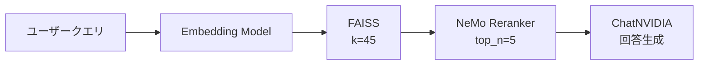

## ブログ概要（Summary）

NVIDIAのデベロッパーブログ記事は、RAGパイプラインにリランキング（Re-Ranking）を組み込むことで検索精度を向上させる手法を解説する。NVIDIA NeMo Retriever Rerankingモデル（Mistral-7BベースのLoRAファインチューニング版）をNIM（NVIDIA Inference Microservice）として提供し、FAISS + LangChainと統合した実装パターンを紹介する。初期検索でk=45と多めに取得し、リランカーでtop_n=5に絞り込む2段階パイプラインにより、LLMに渡すコンテキストの品質を大幅に改善する。

この記事は [Zenn記事: LangGraph×Claude APIで構築するリランキング付きエージェントRAG実装](https://zenn.dev/0h_n0/articles/11f63b83aabde7) の深掘りです。

## 情報源

- **種別**: 企業テックブログ
- **URL**: [https://developer.nvidia.com/blog/enhancing-rag-pipelines-with-re-ranking/](https://developer.nvidia.com/blog/enhancing-rag-pipelines-with-re-ranking/)
- **組織**: NVIDIA Developer
- **発表日**: 2024年

## 技術的背景（Technical Background）

### リランキングの基本原理

情報検索の2段階パイプラインにおいて、第1段階のBi-Encoder検索は高速だが精度に限界がある。Bi-Encoderはクエリと文書を**独立にエンコード**し、コサイン類似度で関連度を推定する：

$$
s_{\text{bi}}(q, d) = \cos(\mathbf{E}_q(q), \mathbf{E}_d(d)) = \frac{\mathbf{E}_q(q) \cdot \mathbf{E}_d(d)}{|\mathbf{E}_q(q)| \cdot |\mathbf{E}_d(d)|}
$$

一方、Cross-Encoder（リランカー）はクエリと文書のペアを**同時に入力**し、直接的な関連度スコアを出力する：

$$
s_{\text{cross}}(q, d) = f_{\theta}([q; \text{SEP}; d])
$$

NVIDIAブログが指摘する核心的な違いは、**Bi-Encoderがヒューリスティクスな類似度メトリクスに依存するのに対し、Cross-Encoderはクエリと文書のペアを直接モデル内で比較する**点である。

### NeMo Retriever Reranking NIMの特徴

NVIDIA NeMo Retriever Rerankingモデルは、**Mistral-7Bの最初の16層のみ**を使用したLoRAファインチューニング版で、バイナリ分類ヘッドを追加してランキングタスクに特化させている。

**アーキテクチャの特徴**:
- **ベースモデル**: Mistral-7B（16層のみ使用 → 高スループット）
- **ファインチューニング**: LoRA（Low-Rank Adaptation）
- **分類ヘッド**: バイナリ関連度判定（relevant/not relevant）
- **デプロイ**: NIM（NVIDIA Inference Microservice）としてコンテナ化



## 実装アーキテクチャ（Architecture）

### LangChain統合の実装

NVIDIAブログで紹介されている実装は、LangChainの`ContextualCompressionRetriever`を使用してリランキングをパイプラインに組み込む。

```python
from langchain_nvidia_ai_endpoints import NVIDIAEmbeddings, NVIDIARerank, ChatNVIDIA
from langchain_community.vectorstores import FAISS
from langchain.retrievers import ContextualCompressionRetriever
from langchain.chains import RetrievalQA


# Step 1: ベクトルストア構築
embeddings = NVIDIAEmbeddings(
    model="NV-EmbedQA-E5-v5",  # NVIDIA最適化Embedding
)
db = FAISS.from_documents(texts, embeddings)

# Step 2: 初期検索器（k=45と多めに取得）
retriever = db.as_retriever(search_kwargs={"k": 45})

# Step 3: リランカーで圧縮（top_n=5に絞り込み）
reranker = NVIDIARerank(
    model="nvidia/nv-rerankqa-mistral-4b-v3",
    top_n=5,
)
compression_retriever = ContextualCompressionRetriever(
    base_compressor=reranker,
    base_retriever=retriever,
)

# Step 4: RAGチェーン構築
chain = RetrievalQA.from_chain_type(
    llm=ChatNVIDIA(temperature=0),
    retriever=compression_retriever,
)

# 実行
result = chain.invoke("LangGraphでリランキング付きRAGを構築する方法は？")
```

### Zenn記事との実装比較

| 要素 | Zenn記事の実装 | NVIDIAブログの実装 |
|------|--------------|-------------------|
| 初期検索k | 20 | 45 |
| リランカー | Cohere Rerank 4.0 | NeMo Reranker |
| リランク後n | 5 | 5 |
| 品質評価 | Claude API Grader | なし（リランカーで完結） |
| クエリ書き換え | Claude API Rewriter | なし |
| フレームワーク | LangGraph StateGraph | LangChain RetrievalQA |

**重要な違い**: NVIDIAブログの実装はリランキングのみで品質向上を図るのに対し、Zenn記事はリランキング+Grader+Rewriteの反復ループで段階的に品質を向上させる。Zenn記事のアプローチはより高い精度が期待できるが、レイテンシとコストが増大する。

### チャンクサイズの最適化

NVIDIAブログは、リランキングの効果を最大化するためのチャンクサイズ設計に言及している：

```python
# 推奨チャンクサイズ: 100-600トークン
from langchain.text_splitter import RecursiveCharacterTextSplitter

text_splitter = RecursiveCharacterTextSplitter(
    chunk_size=400,       # トークン数（推奨: 100-600）
    chunk_overlap=50,     # オーバーラップ
    length_function=len,
    separators=["\n\n", "\n", "。", ".", " ", ""],
)

chunks = text_splitter.split_documents(documents)
```

**設計原則**: チャンクが小さすぎるとコンテキストが失われ、大きすぎるとリランカーの判定精度が低下する。NVIDIAの推奨値は**100-600トークン**で、LLMのコンテキストウィンドウ制約とリランカーの入力長制限の両方を考慮している。

### マルチソースFusion

NVIDIAブログでは、セマンティック検索とBM25検索の結果を統合するマルチソースFusionパターンも紹介している：

```python
from langchain.retrievers import BM25Retriever, EnsembleRetriever

# BM25検索器
bm25_retriever = BM25Retriever.from_documents(documents, k=20)

# ベクトル検索器
vector_retriever = db.as_retriever(search_kwargs={"k": 20})

# アンサンブル（重み付き統合）
ensemble_retriever = EnsembleRetriever(
    retrievers=[bm25_retriever, vector_retriever],
    weights=[0.4, 0.6],  # BM25: 40%, Vector: 60%
)

# リランカーで最終絞り込み
compression_retriever = ContextualCompressionRetriever(
    base_compressor=reranker,
    base_retriever=ensemble_retriever,
)
```

この手法は、Zenn記事の「次のステップ」で言及されている**ハイブリッド検索（BM25 + ベクトル検索）**をRetrieveノードに組み込むアプローチと直接対応する。

## Production Deployment Guide

### AWS実装パターン（コスト最適化重視）

NeMo Retriever RerankerをAWSにデプロイする場合、GPUインスタンスが必要となるため、コスト最適化が特に重要である。

| 規模 | 月間リクエスト | 推奨構成 | 月額コスト | 主要サービス |
|------|--------------|---------|-----------|------------|
| **Small** | ~3,000 (100/日) | Serverless | $80-200 | Lambda + Bedrock Rerank API + DynamoDB |
| **Medium** | ~30,000 (1,000/日) | Hybrid | $500-1,200 | ECS Fargate (GPU) + Bedrock + ElastiCache |
| **Large** | 300,000+ (10,000/日) | Container | $3,000-8,000 | EKS + g5.xlarge Spot + Karpenter |

**Small構成の詳細** (月額$80-200):
- **Lambda**: 1GB RAM, 60秒タイムアウト ($25/月)
- **Bedrock Rerank API**: Cohere Rerank 3.5（NeMo相当）($100/月)
- **DynamoDB**: On-Demand, リランキングキャッシュ ($10/月)
- **CloudWatch**: 基本監視 ($5/月)

**Large構成の詳細** (月額$3,000-8,000):
- **EKS**: コントロールプレーン ($72/月)
- **EC2 g5.xlarge Spot**: NeMo Rerankerホスト × 2台 ($600/月、Spot価格)
- **Bedrock**: Claude 3.5 Sonnet、生成用 ($2,000/月)
- **Karpenter**: GPU自動スケーリング（追加コストなし）

**コスト試算の注意事項**: 上記は2026年2月時点のAWS ap-northeast-1（東京）リージョン料金に基づく概算値です。最新料金は [AWS料金計算ツール](https://calculator.aws/) で確認してください。

### Terraformインフラコード

**Small構成 (Serverless): Lambda + Bedrock Rerank API**

```hcl
resource "aws_lambda_function" "rag_reranking" {
  filename      = "lambda.zip"
  function_name = "rag-reranking-handler"
  role          = aws_iam_role.lambda_bedrock.arn
  handler       = "index.handler"
  runtime       = "python3.12"
  timeout       = 60
  memory_size   = 1024

  environment {
    variables = {
      BEDROCK_RERANK_MODEL = "cohere.rerank-v3-5:0"
      BEDROCK_GEN_MODEL    = "anthropic.claude-3-5-haiku-20241022-v1:0"
      DYNAMODB_TABLE       = aws_dynamodb_table.rerank_cache.name
      INITIAL_K            = "45"
      RERANK_TOP_N         = "5"
    }
  }
}

resource "aws_dynamodb_table" "rerank_cache" {
  name         = "rag-rerank-cache"
  billing_mode = "PAY_PER_REQUEST"
  hash_key     = "query_doc_hash"

  attribute {
    name = "query_doc_hash"
    type = "S"
  }

  ttl {
    attribute_name = "expire_at"
    enabled        = true
  }
}
```

### 運用・監視設定

```python
import boto3

cloudwatch = boto3.client('cloudwatch')

# リランキングレイテンシ監視
cloudwatch.put_metric_alarm(
    AlarmName='reranking-latency-p95',
    ComparisonOperator='GreaterThanThreshold',
    EvaluationPeriods=2,
    MetricName='Duration',
    Namespace='Custom/RAG',
    Period=300,
    Statistic='p95',
    Threshold=500,  # リランキング500ms以上でアラート
    AlarmDescription='リランキングP95レイテンシ異常'
)

# GPU使用率監視（Large構成時）
cloudwatch.put_metric_alarm(
    AlarmName='gpu-utilization-low',
    ComparisonOperator='LessThanThreshold',
    EvaluationPeriods=6,  # 30分間
    MetricName='GPUUtilization',
    Namespace='Custom/NeMo',
    Period=300,
    Statistic='Average',
    Threshold=20,  # 20%未満でスケールダウン検討
    AlarmDescription='GPU使用率低下 — コスト削減の余地あり'
)
```

### コスト最適化チェックリスト

- [ ] 初期検索k値の最適化（k=45は必要か？k=30で十分か検証）
- [ ] リランキング結果のキャッシュ（DynamoDB TTL=1時間）
- [ ] Bedrock Rerank APIのBatch処理活用（非リアルタイム処理50%割引）
- [ ] GPU Spot Instances活用（最大90%削減）
- [ ] アイドル時間のEKSスケールダウン（夜間0台）
- [ ] チャンクサイズ最適化（過大チャンク→トークン浪費）
- [ ] AWS Budgets月額予算設定（80%で警告、100%でアラート）

## パフォーマンス最適化（Performance）

### NeMo Rerankerの推論特性

NeMo Retriever Rerankerは、Mistral-7Bの最初の16層のみを使用することで、フルモデルと比較して**推論速度を約2倍**に向上させている。

| 構成 | 推論速度 (docs/sec) | GPU要件 | メモリ使用量 |
|------|-------------------|---------|------------|
| NeMo Reranker (16層) | ~500 | A10G以上 | ~8GB |
| Full Mistral-7B | ~250 | A10G以上 | ~16GB |
| bge-reranker-v2-m3 | ~200 | T4以上 | ~4GB |
| Cohere Rerank API | ~800+ | なし(API) | なし |

### レイテンシのブレークダウン

45文書のリランキング + 5文書の生成パイプラインの典型的なレイテンシ：

| 処理 | レイテンシ | 備考 |
|------|----------|------|
| 初期検索 (k=45) | ~50ms | FAISS（CPU） |
| リランキング (45→5) | ~90ms | NeMo NIM (GPU) |
| LLM生成 | ~1,500ms | ChatNVIDIA |
| **合計** | **~1,640ms** | |

### チューニングのポイント

1. **kとtop_nの比率**: k/top_n = 9:1（45:5）が推奨。比率が大きいほどリランキングの効果が高いが、推論コストも増大
2. **チャンクサイズ**: 100-600トークンが最適。400トークンをデフォルトとして、ドメインに応じて調整
3. **バッチ処理**: 複数クエリを同時にリランキングすることで、GPU使用効率を向上

## 運用での学び（Production Lessons）

### 障害パターンとその対策

1. **リランカーのタイムアウト**: NIM起動直後のコールドスタート時に発生。ヘルスチェック間隔を短く設定（10秒→5秒）し、ウォームアップリクエストを送信
2. **メモリ不足（OOM）**: 長文ドキュメントのバッチ処理で発生。max_length=512トークンでの切り捨てを実装
3. **GPU使用率の偏り**: マルチGPU環境でのロードバランシングが不十分。NIMのレプリカ数を調整

### モニタリング戦略

- **リランキング品質**: リランク前後のNDCG@5を定期的に計測し、品質劣化を検知
- **レイテンシ**: P95/P99を監視し、500ms超過でアラート
- **コスト**: Bedrock API使用量とGPUコストの日次レポートを自動送信

## 学術研究との関連（Academic Connection）

NVIDIAのNeMo Retriever Rerankerは、以下の学術研究に基づいている：

- **Mistral-7B** (Jiang et al., 2023): ベースモデル。Sliding Window Attentionにより効率的な長文処理
- **LoRA** (Hu et al., 2022): パラメータ効率的ファインチューニング。フル ファインチューニングと同等の精度を低コストで実現
- **Layer Pruning**: 7Bモデルの16/32層のみ使用。リランキングタスクでは深い層が不要であるという知見を活用

## まとめと実践への示唆

NVIDIAのアプローチは、**リランキングをマイクロサービスとして独立させる**ことで、既存のRAGパイプラインへの統合を容易にしている。Zenn記事のLangGraph実装にNeMo Rerankerを組み込む場合、Rerankノードの実装を`NVIDIARerank`に置き換えるだけで済む。

実務での最重要ポイントは、**初期検索のk値を十分に大きく設定**（推奨: k=45）し、リランカーに十分な候補を渡すことである。リランキングは「並び替え」であり、初期検索で取得できなかった文書は回復できない。

## 参考文献

- **Blog URL**: [https://developer.nvidia.com/blog/enhancing-rag-pipelines-with-re-ranking/](https://developer.nvidia.com/blog/enhancing-rag-pipelines-with-re-ranking/)
- **NeMo Retriever**: [https://developer.nvidia.com/nemo-retriever](https://developer.nvidia.com/nemo-retriever)
- **Related Zenn article**: [https://zenn.dev/0h_n0/articles/11f63b83aabde7](https://zenn.dev/0h_n0/articles/11f63b83aabde7)
