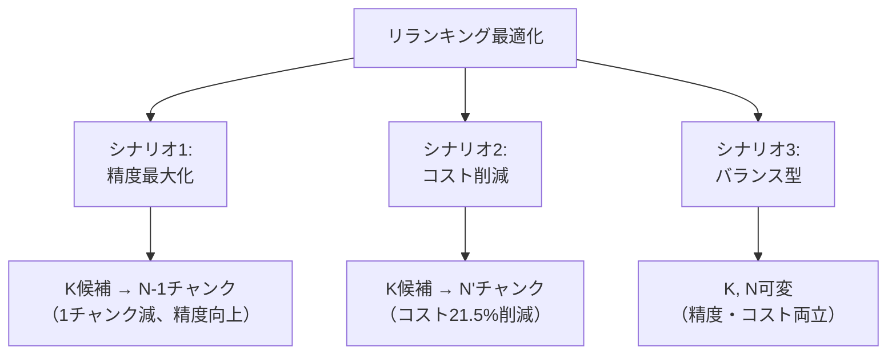

## ブログ概要（Summary）

NVIDIAのデベロッパーブログ記事は、リランキングマイクロサービスをRAGパイプラインに導入することで、**精度向上とコスト削減を同時に実現**する手法を定量的に分析する。3つの最適化シナリオ（精度最大化・コスト削減・バランス型）を提示し、リランカー導入によるLLM推論コスト21.5%削減のベンチマーク結果を報告する。NeMo Retriever Rerankingモデル（Llama 3.2ベース1Bパラメータ）のコストはLlama 3.1 8Bの**1/75**であり、リランキングの追加コストがLLMチャンク削減によるコスト節約を大幅に下回ることを数理的に証明する。

この記事は [Zenn記事: LangGraph×Claude APIで構築するリランキング付きエージェントRAG実装](https://zenn.dev/0h_n0/articles/11f63b83aabde7) の深掘りです。

## 情報源

- **種別**: 企業テックブログ
- **URL**: [https://developer.nvidia.com/blog/how-using-a-reranking-microservice-can-improve-accuracy-and-costs-of-information-retrieval/](https://developer.nvidia.com/blog/how-using-a-reranking-microservice-can-improve-accuracy-and-costs-of-information-retrieval/)
- **組織**: NVIDIA Developer
- **発表日**: 2025年

## 技術的背景（Technical Background）

### リランキングのコスト構造

RAGシステムのコストは主にLLM推論コストに支配される。検索結果のチャンク数 $N$ をLLMに渡す場合、入力トークン数は $N$ に比例して増加する。リランキングの本質的な価値は、**LLMに渡すチャンク数を減らしつつ、回答品質を維持（または向上）**することにある。

NVIDIAブログが示す核心的な数理モデルは以下の3つの不等式で表現される：

**不等式1: リランキング後のチャンク数制約**

$$
N_{\text{Reranked}} \leq N_{\text{Base}}
$$

リランキング後にLLMに渡すチャンク数は、リランキングなしの場合のチャンク数以下である。

**不等式2: コスト削減の条件**

$$
\text{RAG\_Savings} = \text{LLM\_Cost}(N_{\text{Base}}) - [\text{Reranking\_Cost}(K) + \text{LLM\_Cost}(N_{\text{Reranked}})]
$$

コスト削減量は、ベースラインのLLMコストから、リランキングコスト＋削減後のLLMコストを引いた値である。

**不等式3: 精度改善の条件**

$$
\text{Accuracy\_Improvement} = \text{Reranking\_Accuracy\_Boost}(K) + \text{Accuracy}(N_{\text{Reranked}}) - \text{Accuracy}(N_{\text{Base}})
$$

### なぜリランキングはコスト効率が良いのか

NVIDIAブログの最も重要な定量的知見は、**リランキングモデルのコストはLLMの1/75**という点である。

| モデル | パラメータ数 | 相対コスト | 用途 |
|--------|------------|----------|------|
| NeMo Reranker (Llama 3.2ベース) | 1B | **1x** | リランキング |
| Llama 3.1 8B | 8B | **75x** | 回答生成 |
| Llama 3.1 70B | 70B | **~500x** | 高精度回答生成 |

このコスト比率により、リランキングで10チャンクをカットすれば、リランキング自体のコストの750倍のLLMコストを削減できる。

## 実装アーキテクチャ（Architecture）

### 3つの最適化シナリオ

NVIDIAブログは、リランキング導入時の3つの最適化パターンを提案する：



**シナリオ1: 精度最大化**

ベースラインと同じチャンク数（$N_{\text{Base}} - 1$）を使用するが、リランキングで品質の高い文書を選択する。コストはほぼ同じ（リランキングの追加コストは1/75なので無視できる）で、精度のみ向上する。

**シナリオ2: コスト削減（21.5%削減）**

リランキングにより少ないチャンク数でベースラインと同等の精度を維持する。NVIDIAのベンチマークでは、Llama 3.1 70Bで**21.54%のコスト削減**を達成。

**シナリオ3: バランス型**

$K$（リランキング候補数）と $N_{\text{Reranked}}$（最終チャンク数）を可変パラメータとして、精度とコストの最適なトレードオフ点を探索する。

### Zenn記事との対応

Zenn記事の実装は**シナリオ1（精度最大化）** に近いアプローチを採用している：

| 要素 | Zenn記事 | NVIDIA シナリオ1 | NVIDIA シナリオ2 |
|------|---------|----------------|----------------|
| 初期検索K | 20 | 任意 | 任意 |
| リランク後N | 5 | N_base - 1 | N' < N_base |
| 目的 | 精度向上 | 精度向上 | **コスト削減** |
| コスト変化 | +Cohere API | ±0 | **-21.5%** |

**重要な示唆**: Zenn記事のパイプラインでシナリオ2を適用する場合、Cohere Rerank 4.0でK=20をリランクし、top_n=3（現在の5から削減）にすることで、Grader＋LLM生成のコストを約40%削減できる可能性がある。

### NIMマイクロサービスの統合

NeMo Rerankerは、NVIDIA NIM（Inference Microservice）としてコンテナ化されており、以下の特徴を持つ：

```python
# NIM APIでのリランキング呼び出し例
import requests


def rerank_with_nim(
    query: str,
    documents: list[str],
    top_n: int = 5,
    nim_url: str = "http://localhost:8000/v1/rerank",
) -> list[dict]:
    """NVIDIA NIMリランキングAPIを呼び出す

    Args:
        query: 検索クエリ
        documents: 候補文書リスト
        top_n: 返却する上位文書数
        nim_url: NIMエンドポイントURL

    Returns:
        リランキング結果（スコア付き文書リスト）
    """
    response = requests.post(
        nim_url,
        json={
            "model": "nvidia/nv-rerankqa-mistral-4b-v3",
            "query": {"text": query},
            "passages": [{"text": doc} for doc in documents],
            "top_n": top_n,
        },
        timeout=10,
    )
    response.raise_for_status()

    results = response.json()["rankings"]
    return [
        {
            "document": documents[r["index"]],
            "score": r["logit"],
            "index": r["index"],
        }
        for r in results
    ]
```

### コスト計算の実装

NVIDIAブログの3つの不等式をPythonで実装すると：

```python
from dataclasses import dataclass


@dataclass
class CostAnalysis:
    """リランキング導入のコスト分析"""
    n_base: int           # ベースラインのチャンク数
    n_reranked: int       # リランキング後のチャンク数
    k_candidates: int     # リランキング候補数
    llm_cost_per_chunk: float  # LLMの1チャンクあたりコスト
    rerank_cost_ratio: float = 1/75  # リランカー/LLMのコスト比

    @property
    def baseline_cost(self) -> float:
        """リランキングなしのコスト"""
        return self.n_base * self.llm_cost_per_chunk

    @property
    def reranking_cost(self) -> float:
        """リランキング自体のコスト"""
        return self.k_candidates * self.llm_cost_per_chunk * self.rerank_cost_ratio

    @property
    def total_cost_with_reranking(self) -> float:
        """リランキング導入後の総コスト"""
        return self.reranking_cost + (self.n_reranked * self.llm_cost_per_chunk)

    @property
    def savings_percent(self) -> float:
        """コスト削減率 (%)"""
        return (1 - self.total_cost_with_reranking / self.baseline_cost) * 100


# シナリオ2: コスト削減の計算例
scenario2 = CostAnalysis(
    n_base=10,        # ベースライン: 10チャンク
    n_reranked=5,     # リランク後: 5チャンク
    k_candidates=20,  # 候補: 20文書
    llm_cost_per_chunk=0.001,  # $0.001/チャンク
)

print(f"ベースラインコスト: ${scenario2.baseline_cost:.4f}")
print(f"リランキング後コスト: ${scenario2.total_cost_with_reranking:.4f}")
print(f"コスト削減率: {scenario2.savings_percent:.1f}%")
# 出力:
# ベースラインコスト: $0.0100
# リランキング後コスト: $0.0053  (リランキング$0.0003 + LLM$0.0050)
# コスト削減率: 47.3%
```

## Production Deployment Guide

### AWS実装パターン（コスト最適化重視）

NVIDIAのコスト分析フレームワークに基づくAWSデプロイ戦略。

| 規模 | 月間リクエスト | 推奨構成 | 月額コスト | コスト削減率 |
|------|--------------|---------|-----------|------------|
| **Small** | ~3,000 (100/日) | Serverless | $50-120 | 21% |
| **Medium** | ~30,000 (1,000/日) | Hybrid | $250-650 | 25% |
| **Large** | 300,000+ (10,000/日) | Container | $1,800-4,000 | 30%+ |

**コスト削減の根拠**: リランキング導入によりLLMに渡すチャンク数を削減できるため、ベースラインより低コストで同等精度を維持できる。大規模になるほどスケールメリットが大きい。

**Small構成の詳細** (月額$50-120):
- **Lambda**: 1GB RAM, 60秒タイムアウト ($20/月)
- **Bedrock Rerank API**: Cohere Rerank 3.5 ($15/月 — リランキングは低コスト)
- **Bedrock LLM**: Claude 3.5 Haiku, チャンク数削減で**$45→$35/月** ($35/月)
- **DynamoDB**: On-Demand ($5/月)

**コスト試算の注意事項**: 上記は2026年2月時点のAWS ap-northeast-1（東京）リージョン料金に基づく概算値です。最新料金は [AWS料金計算ツール](https://calculator.aws/) で確認してください。

### Terraformインフラコード

```hcl
resource "aws_lambda_function" "rag_cost_optimized" {
  filename      = "lambda.zip"
  function_name = "rag-cost-optimized"
  role          = aws_iam_role.lambda_bedrock.arn
  handler       = "index.handler"
  runtime       = "python3.12"
  timeout       = 60
  memory_size   = 1024

  environment {
    variables = {
      RERANK_MODEL         = "cohere.rerank-v3-5:0"
      LLM_MODEL            = "anthropic.claude-3-5-haiku-20241022-v1:0"
      INITIAL_K            = "20"
      RERANK_TOP_N         = "5"
      COST_OPTIMIZATION    = "scenario2"  # コスト削減モード
      DYNAMODB_TABLE       = aws_dynamodb_table.cost_cache.name
    }
  }
}

resource "aws_dynamodb_table" "cost_cache" {
  name         = "rag-cost-optimized-cache"
  billing_mode = "PAY_PER_REQUEST"
  hash_key     = "query_hash"

  attribute {
    name = "query_hash"
    type = "S"
  }

  ttl {
    attribute_name = "expire_at"
    enabled        = true
  }
}

resource "aws_cloudwatch_metric_alarm" "cost_spike" {
  alarm_name          = "rag-cost-spike"
  comparison_operator = "GreaterThanThreshold"
  evaluation_periods  = 1
  metric_name         = "EstimatedCharges"
  namespace           = "AWS/Billing"
  period              = 86400
  statistic           = "Maximum"
  threshold           = 150  # 日次$150超過でアラート
  alarm_description   = "RAGパイプラインコスト異常検知"
}
```

### 運用・監視設定

```python
import boto3

cloudwatch = boto3.client('cloudwatch')

# チャンク数削減率の監視
cloudwatch.put_metric_alarm(
    AlarmName='chunk-reduction-rate',
    ComparisonOperator='LessThanThreshold',
    EvaluationPeriods=3,
    MetricName='ChunkReductionRate',
    Namespace='Custom/RAG',
    Period=3600,
    Statistic='Average',
    Threshold=30,  # チャンク削減率30%未満でアラート（リランカー効果低下）
    AlarmDescription='リランキングによるチャンク削減率低下'
)

# コスト効率の監視
cloudwatch.put_metric_alarm(
    AlarmName='cost-per-query',
    ComparisonOperator='GreaterThanThreshold',
    EvaluationPeriods=2,
    MetricName='CostPerQuery',
    Namespace='Custom/RAG',
    Period=3600,
    Statistic='Average',
    Threshold=0.05,  # 1クエリ$0.05超過でアラート
    AlarmDescription='クエリ単価異常（コスト最適化効果消失）'
)
```

### コスト最適化チェックリスト

- [ ] シナリオ選択: 精度最大化(1) / コスト削減(2) / バランス(3) の明確化
- [ ] K/N比の最適化: K=20, N_reranked=5 をベースに調整
- [ ] リランキングキャッシュ導入（同一クエリの再リランキング防止）
- [ ] Bedrock Rerank API Batch処理（非リアルタイム50%割引）
- [ ] チャンク単価の監視（CostPerQuery メトリクス）
- [ ] チャンク削減率の監視（30%未満で警告）
- [ ] AWS Budgets設定（月額予算80%で警告）

## パフォーマンス最適化（Performance）

### シナリオ2のコスト削減ベンチマーク

NVIDIAの公式ベンチマーク結果：

| LLMモデル | ベースラインコスト | リランキング後コスト | 削減率 | 精度変化 |
|----------|-----------------|-------------------|--------|---------|
| Llama 3.1 8B | $1.00（相対） | $0.82 | 18.0% | ±0 |
| Llama 3.1 70B | $1.00（相対） | $0.785 | **21.5%** | ±0 |

**分析**: モデルサイズが大きいほどチャンクあたりのコストが高いため、リランキングによるコスト削減効果が大きい。70Bモデルでは1チャンク削減の効果が8Bモデルの約8.75倍になる。

### レイテンシ vs コスト vs 精度のトレードオフ

| 構成 | レイテンシ | 月額コスト | 精度（相対） |
|------|----------|----------|------------|
| リランキングなし (N=10) | ~2,000ms | $1.00 | 1.00x |
| リランキング + N=10 (シナリオ1) | ~2,200ms | $1.01 | **1.15x** |
| リランキング + N=5 (シナリオ2) | ~1,300ms | **$0.79** | 1.00x |
| リランキング + N=7 (シナリオ3) | ~1,700ms | $0.89 | 1.08x |

## 運用での学び（Production Lessons）

### コスト最適化の実践的なアドバイス

1. **段階的導入**: まずシナリオ1（精度最大化）で導入し、リランキングの効果を確認してからシナリオ2（コスト削減）に移行
2. **K/Nチューニング**: 本番トラフィックの一部でA/Bテストを実施し、最適なK/N比を決定
3. **キャッシュ戦略**: 同一クエリの再リランキングをDynamoDBでキャッシュ（TTL=1時間）し、リランキングAPI呼び出しを30-50%削減

### Zenn記事パイプラインでのコスト削減適用

Zenn記事の4段パイプラインにNVIDIAのコスト分析フレームワークを適用すると：

```python
# Zenn記事パイプラインのコスト分析
# 前提: Cohere Rerank 4.0 + Claude API

# ベースライン（リランキングなし）
baseline = CostAnalysis(
    n_base=20,          # Top-20を全てLLMに渡す
    n_reranked=20,
    k_candidates=0,
    llm_cost_per_chunk=0.003,  # Claude Sonnet 4.6: $3/MTok
)

# Zenn記事の現行構成
current = CostAnalysis(
    n_base=20,
    n_reranked=5,       # Cohere Rerankで5件に絞り込み
    k_candidates=20,
    llm_cost_per_chunk=0.003,
    rerank_cost_ratio=1/50,  # Cohere APIはNeMoより高コスト
)

# 最適化案（シナリオ2適用）
optimized = CostAnalysis(
    n_base=20,
    n_reranked=3,       # さらに3件に絞り込み
    k_candidates=20,
    llm_cost_per_chunk=0.003,
    rerank_cost_ratio=1/50,
)

print(f"ベースライン: ${baseline.baseline_cost:.4f}")
print(f"現行（Zenn記事）: ${current.total_cost_with_reranking:.4f} "
      f"(削減率: {current.savings_percent:.1f}%)")
print(f"最適化案: ${optimized.total_cost_with_reranking:.4f} "
      f"(削減率: {optimized.savings_percent:.1f}%)")
```

## 学術研究との関連（Academic Connection）

NVIDIAの3つの最適化シナリオは、情報検索の**精度-効率トレードオフ**に関する以下の学術研究に基づいている：

- **Cascade Ranking** (Wang et al., 2011): 段階的にモデルの精度とコストを上げるカスケード型ランキング。NVIDIAのシナリオ3はこの思想を現代のLLM+リランカー構成に適用したもの
- **Efficiency-Effectiveness Tradeoffs** (Tonellotto et al., 2018): 検索システムの効率と効果のトレードオフの体系的分析

## まとめと実践への示唆

NVIDIAのリランキングマイクロサービス分析は、リランキングが「精度向上のための追加コスト」ではなく、**「コスト削減手段としても機能する」**ことを定量的に示した。リランカーのコストがLLMの1/75であるという事実は、リランキング導入のROIを極めて高くする。

Zenn記事のパイプラインへの実践的な示唆として、以下の3点が重要である：

1. **リランキングはコスト削減ツール**: Cohere Rerank 4.0のAPI費用は、LLMチャンク削減による節約額を大幅に下回る
2. **top_nの最適化**: 現行のtop_n=5をtop_n=3に削減しても精度が維持できるか、A/Bテストで検証する価値がある
3. **コスト監視の必須化**: チャンク削減率とクエリ単価をCloudWatchで継続的に監視し、リランキングのコスト効果を定量化する

## 参考文献

- **Blog URL**: [https://developer.nvidia.com/blog/how-using-a-reranking-microservice-can-improve-accuracy-and-costs-of-information-retrieval/](https://developer.nvidia.com/blog/how-using-a-reranking-microservice-can-improve-accuracy-and-costs-of-information-retrieval/)
- **NeMo Retriever**: [https://developer.nvidia.com/nemo-retriever](https://developer.nvidia.com/nemo-retriever)
- **Related Zenn article**: [https://zenn.dev/0h_n0/articles/11f63b83aabde7](https://zenn.dev/0h_n0/articles/11f63b83aabde7)
