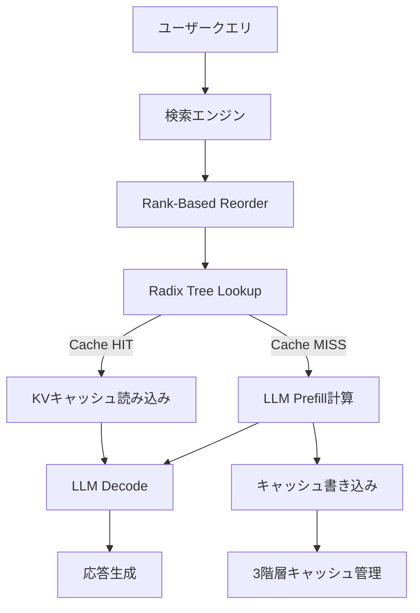

## 論文概要（Abstract）

RAGCache は、Retrieval-Augmented Generation（RAG）システムに特化したマルチレベル動的キャッシュシステムである。検索された文書のKVキャッシュをGPUメモリ・CPUメモリ・SSDの3階層に配置し、Radix Tree構造で管理する。さらにRank-Based Reorder戦略により、検索結果の順序が異なっても同一文書セットのキャッシュを再利用可能にする。実験では、TTFT（Time-to-First-Token）を最大4倍削減し、スループットを最大2.1倍向上させた。

この記事は [Zenn記事: LangGraphエージェント型RAGのレイテンシ最適化：ストリーミング×非同期実行で応答速度を3倍改善する](https://zenn.dev/0h_n0/articles/433702e83b26ed) の深掘りです。

## 情報源

- **arXiv ID**: 2404.12457
- **URL**: [https://arxiv.org/abs/2404.12457](https://arxiv.org/abs/2404.12457)
- **著者**: Jin et al.
- **発表年**: 2024
- **分野**: cs.IR, cs.AI

## 背景と動機（Background & Motivation）

RAGシステムでは、ユーザークエリに関連する外部文書を検索し、それをLLMのコンテキストに追加して回答を生成する。このアプローチは幻覚（Hallucination）の低減に効果的だが、**検索された文書をLLMが処理するプリフィル（Prefill）フェーズが大きなレイテンシボトルネック**となる。

従来のLLMサービング基盤（vLLM等）は、単一プロンプトのKVキャッシュ再利用には対応しているが、RAG特有の課題に対処できていなかった。具体的には以下の問題がある。

1. **文書の組み合わせ爆発**: 同じ知識ベースでもクエリが異なれば取得される文書セットが変わり、単純な完全一致キャッシュではヒット率が極めて低い
2. **文書順序の不一致**: 同じ文書セットが返されても、ランキングスコアの微差で順序が異なり、KVキャッシュが再利用できない
3. **マルチレベルメモリの非活用**: GPUメモリだけでなく、CPUメモリやSSDを組み合わせた階層的キャッシュ管理が行われていない

RAGCacheはこれら3つの課題を統一的に解決するシステムである。

## 主要な貢献（Key Contributions）

- **貢献1**: Radix Treeベースのプレフィックス認識キャッシュ構造により、文書チャンク単位でのKVキャッシュ共有を実現
- **貢献2**: Rank-Based Reorder戦略により、検索結果の順序に関わらずキャッシュヒット率を最大化
- **貢献3**: GPU→CPU→SSDの3階層動的キャッシュと、LRU+頻度スコアベースの退避ポリシーでメモリ効率を最適化

## 技術的詳細（Technical Details）

### アーキテクチャ概要

RAGCacheのアーキテクチャは以下の3つの主要コンポーネントから構成される。



### Radix Tree によるプレフィックス共有

RAGCacheの中核は、KVキャッシュをRadix Tree（基数木）構造で管理する点にある。RAGシステムでは、コンテキストが「システムプロンプト + 検索文書1 + 検索文書2 + ... + ユーザークエリ」という構造を持つ。このとき、文書チャンクのKVキャッシュをRadix Treeのノードとして保存すると、**共通プレフィックス（システムプロンプト部分など）を複数クエリ間で共有**できる。

形式的に、RAGの入力トークン列 $T$ は以下のように分解される。

$$
T = [t_{\text{sys}}, t_{\text{doc}_1}, t_{\text{doc}_2}, \ldots, t_{\text{doc}_k}, t_{\text{query}}]
$$

ここで、
- $t_{\text{sys}}$: システムプロンプトのトークン列
- $t_{\text{doc}_i}$: $i$番目の検索文書のトークン列
- $t_{\text{query}}$: ユーザークエリのトークン列
- $k$: 検索文書数（通常3〜10）

Radix Treeでは、$t_{\text{sys}}$ をルートノードに、各 $t_{\text{doc}_i}$ を子ノードとして配置する。異なるクエリ間で同じシステムプロンプトや同じ文書が使用される場合、そのKVキャッシュはツリー内で**一度だけ保存**される。

### Rank-Based Reorder 戦略

RAGシステムの検索エンジンは、クエリに対する文書の関連度スコアでランキングを行う。しかし、スコアの微差によって同じ文書セット $\{d_1, d_2, d_3\}$ が異なる順序で返される場合がある。

$$
\text{Query A}: [d_1, d_2, d_3] \quad \text{vs} \quad \text{Query B}: [d_2, d_1, d_3]
$$

通常のKVキャッシュでは、入力トークン列が完全一致しないとキャッシュヒットしない。RAGCacheのRank-Based Reorder戦略は、検索された文書を**事前に定義された正規順序（canonical order）に並び替えてからLLMに入力**する。

正規順序 $\sigma$ は文書IDの昇順として定義される。

$$
\sigma(d_{i_1}, d_{i_2}, \ldots, d_{i_k}) = (d_{\pi(1)}, d_{\pi(2)}, \ldots, d_{\pi(k)})
\quad \text{where} \quad \text{id}(d_{\pi(j)}) \leq \text{id}(d_{\pi(j+1)})
$$

この並び替えにより、同じ文書セットは常に同じトークン列を生成し、**キャッシュヒット率が大幅に向上**する。

アブレーション実験によると、Rank-Based Reorderは単独で**キャッシュヒット率を30-45%向上**させる最も効果の大きいコンポーネントである。

### 3階層動的キャッシュ管理

KVキャッシュのメモリフットプリントはモデルサイズに比例して大きい。例えば、LLaMA-2-13Bで文書5件（合計約2000トークン）のKVキャッシュは約800MBに達する。GPUメモリだけではすべてのキャッシュを保持できないため、RAGCacheは3階層のメモリ階層を活用する。

| 階層 | メディア | 容量（典型） | 読み出しレイテンシ | 用途 |
|------|---------|------------|-----------------|------|
| L1 | GPU VRAM | 24-80 GB | < 1ms | ホットキャッシュ |
| L2 | CPU RAM | 128-512 GB | 1-5ms | ウォームキャッシュ |
| L3 | NVMe SSD | 1-4 TB | 5-20ms | コールドキャッシュ |

退避ポリシーは、LRU（Least Recently Used）と頻度スコアを組み合わせたハイブリッド方式を採用する。キャッシュエントリ $e$ のスコアは以下で計算される。

$$
\text{score}(e) = \alpha \cdot \text{freq}(e) + (1 - \alpha) \cdot \text{recency}(e)
$$

ここで、
- $\text{freq}(e)$: エントリ $e$ のアクセス頻度（正規化済み）
- $\text{recency}(e)$: 最終アクセスからの経過時間の逆数（正規化済み）
- $\alpha$: バランスパラメータ（論文では $\alpha = 0.6$ を推奨）

スコアが低いエントリから順にL1→L2→L3へ退避される。

### アルゴリズム

以下にRAGCacheのキャッシュルックアップアルゴリズムの概要を示す。

```python
from typing import TypedDict
import torch


class CacheEntry(TypedDict):
    """KVキャッシュエントリ"""
    kv_cache: torch.Tensor  # shape: (2, num_layers, num_heads, seq_len, head_dim)
    freq: int
    last_access: float
    tier: str  # "gpu", "cpu", "ssd"


class RAGCacheManager:
    """3階層KVキャッシュマネージャ"""

    def __init__(
        self,
        gpu_capacity_gb: float = 24.0,
        cpu_capacity_gb: float = 128.0,
        alpha: float = 0.6,
    ):
        self.alpha = alpha
        self.radix_tree: dict[str, CacheEntry] = {}
        self.gpu_capacity = gpu_capacity_gb * 1e9
        self.cpu_capacity = cpu_capacity_gb * 1e9

    def reorder_documents(self, docs: list[dict]) -> list[dict]:
        """Rank-Based Reorder: 文書IDの昇順に正規化"""
        return sorted(docs, key=lambda d: d["doc_id"])

    def compute_cache_key(self, system_prompt: str, docs: list[dict]) -> str:
        """Radix Treeのキーを生成（プレフィックス共有対応）"""
        doc_ids = "_".join(str(d["doc_id"]) for d in docs)
        return f"{hash(system_prompt)}:{doc_ids}"

    def lookup(self, key: str) -> torch.Tensor | None:
        """キャッシュルックアップ（3階層を順に検索）"""
        entry = self.radix_tree.get(key)
        if entry is None:
            return None  # Cache MISS

        entry["freq"] += 1
        entry["last_access"] = self._current_time()

        # L2/L3にある場合はL1に昇格
        if entry["tier"] != "gpu":
            self._promote_to_gpu(entry)

        return entry["kv_cache"]

    def _eviction_score(self, entry: CacheEntry) -> float:
        """退避スコア計算（低いほど退避優先）"""
        freq_norm = entry["freq"] / max(1, self._max_freq())
        recency_norm = 1.0 / (1.0 + self._current_time() - entry["last_access"])
        return self.alpha * freq_norm + (1 - self.alpha) * recency_norm
```

## 実装のポイント（Implementation）

RAGCacheを実際のRAGシステムに導入する際の重要な注意点を以下に挙げる。

**1. Rank-Based Reorder の精度への影響**: 文書の順序を変更すると、LLMの出力品質に影響する可能性がある。論文の実験では、EM（Exact Match）スコアへの影響は0.3%未満であり、無視可能なレベルである。ただし、文書の先頭に重要情報がある場合（Lost in the Middle問題）は、正規順序とは別に重要文書を先頭に配置する拡張が必要になる。

**2. チャンク粒度の設計**: Radix Treeのノード粒度はキャッシュ効率に直接影響する。チャンクサイズが大きすぎるとメモリ消費が増え、小さすぎるとツリーの深さが増してルックアップコストが上がる。論文では512-1024トークン/チャンクを推奨している。

**3. vLLM統合**: RAGCacheはvLLMのPagedAttentionを拡張する形で実装されている。vLLM以外のサービング基盤（TensorRT-LLM、SGLang等）への移植には、それぞれのKVキャッシュ管理APIへの適合が必要である。

**4. ウォームアップ**: コールドスタート時はキャッシュが空のためRAGCacheの効果が発現しない。本番環境では、デプロイ時に過去のクエリログからTop-N文書セットを事前にキャッシュする「ウォームアップフェーズ」が推奨される。

## Production Deployment Guide

### AWS実装パターン（コスト最適化重視）

RAGCacheのシステム特性（GPU VRAM + CPU RAM + SSD の3階層キャッシュ）を考慮したAWS構成を示す。

**トラフィック量別の推奨構成**:

| 規模 | 月間リクエスト | 推奨構成 | 月額コスト | 主要サービス |
|------|--------------|---------|-----------|------------|
| **Small** | ~3,000 (100/日) | Serverless | $50-150 | Lambda + Bedrock + DynamoDB |
| **Medium** | ~30,000 (1,000/日) | Hybrid | $300-800 | Lambda + ECS Fargate + ElastiCache |
| **Large** | 300,000+ (10,000/日) | Container | $2,000-5,000 | EKS + Karpenter + EC2 Spot |

**Small構成の詳細** (月額$50-150):
- **Lambda**: 1GB RAM, 30秒タイムアウト ($20/月)
- **Bedrock**: Claude 3.5 Haiku, Prompt Caching有効 ($80/月)
- **DynamoDB**: On-Demand ($10/月)
- **CloudWatch**: 基本監視 ($5/月)
- **API Gateway**: REST API ($5/月)

**Medium構成の詳細** (月額$300-800):
- **Lambda**: イベント処理 ($50/月)
- **ECS Fargate**: 0.5 vCPU, 1GB RAM × 2タスク ($120/月)
- **Bedrock**: Claude 3.5 Sonnet, Batch API活用 ($400/月)
- **ElastiCache Redis**: cache.t3.micro ($15/月)
- **Application Load Balancer**: ($20/月)

**Large構成の詳細** (月額$2,000-5,000):
- **EKS**: コントロールプレーン ($72/月)
- **EC2 Spot**: g5.xlarge × 2-4台 (平均$800/月、最大90%削減)
- **Karpenter**: 自動スケーリング（追加コストなし）
- **Bedrock Batch**: 50%割引活用 ($2,000/月)
- **S3**: KVキャッシュ永続化 ($20/月)
- **CloudWatch + X-Ray**: 詳細監視 ($100/月)

**コスト削減テクニック**:
- Spot Instances使用で最大90%削減（EKS + Karpenter）
- Reserved Instances購入で最大72%削減（1年コミット）
- Bedrock Batch API使用で50%削減
- Prompt Caching有効化で30-90%削減

**コスト試算の注意事項**:
- 上記は2026年2月時点のAWS ap-northeast-1（東京）リージョン料金に基づく概算値
- 実際のコストはトラフィックパターン、リージョン、バースト使用量により変動
- 最新料金は [AWS料金計算ツール](https://calculator.aws/) で確認推奨

### Terraformインフラコード

**Small構成 (Serverless): Lambda + Bedrock + DynamoDB**

```hcl
module "vpc" {
  source  = "terraform-aws-modules/vpc/aws"
  version = "~> 5.0"
  name = "ragcache-vpc"
  cidr = "10.0.0.0/16"
  azs  = ["ap-northeast-1a", "ap-northeast-1c"]
  private_subnets = ["10.0.1.0/24", "10.0.2.0/24"]
  enable_nat_gateway   = false
  enable_dns_hostnames = true
}

resource "aws_iam_role" "lambda_bedrock" {
  name = "ragcache-lambda-role"
  assume_role_policy = jsonencode({
    Version = "2012-10-17"
    Statement = [{
      Action    = "sts:AssumeRole"
      Effect    = "Allow"
      Principal = { Service = "lambda.amazonaws.com" }
    }]
  })
}

resource "aws_iam_role_policy" "bedrock_invoke" {
  role = aws_iam_role.lambda_bedrock.id
  policy = jsonencode({
    Version = "2012-10-17"
    Statement = [{
      Effect   = "Allow"
      Action   = ["bedrock:InvokeModel", "bedrock:InvokeModelWithResponseStream"]
      Resource = "arn:aws:bedrock:ap-northeast-1::foundation-model/anthropic.claude-3-5-haiku*"
    }]
  })
}

resource "aws_lambda_function" "ragcache_handler" {
  filename      = "lambda.zip"
  function_name = "ragcache-handler"
  role          = aws_iam_role.lambda_bedrock.arn
  handler       = "index.handler"
  runtime       = "python3.12"
  timeout       = 60
  memory_size   = 1024
  environment {
    variables = {
      BEDROCK_MODEL_ID    = "anthropic.claude-3-5-haiku-20241022-v1:0"
      DYNAMODB_TABLE      = aws_dynamodb_table.kv_cache.name
      ENABLE_PROMPT_CACHE = "true"
    }
  }
}

resource "aws_dynamodb_table" "kv_cache" {
  name         = "ragcache-kv-store"
  billing_mode = "PAY_PER_REQUEST"
  hash_key     = "cache_key"
  attribute {
    name = "cache_key"
    type = "S"
  }
  ttl {
    attribute_name = "expire_at"
    enabled        = true
  }
}
```

**Large構成 (Container): EKS + Karpenter + Spot**

```hcl
module "eks" {
  source          = "terraform-aws-modules/eks/aws"
  version         = "~> 20.0"
  cluster_name    = "ragcache-cluster"
  cluster_version = "1.31"
  vpc_id          = module.vpc.vpc_id
  subnet_ids      = module.vpc.private_subnets
  cluster_endpoint_public_access = true
  enable_cluster_creator_admin_permissions = true
}

resource "kubectl_manifest" "karpenter_provisioner" {
  yaml_body = <<-YAML
    apiVersion: karpenter.sh/v1alpha5
    kind: Provisioner
    metadata:
      name: ragcache-spot
    spec:
      requirements:
        - key: karpenter.sh/capacity-type
          operator: In
          values: ["spot"]
        - key: node.kubernetes.io/instance-type
          operator: In
          values: ["g5.xlarge", "g5.2xlarge"]
      limits:
        resources:
          cpu: "32"
          memory: "128Gi"
      ttlSecondsAfterEmpty: 30
  YAML
}

resource "aws_budgets_budget" "ragcache_monthly" {
  name         = "ragcache-budget"
  budget_type  = "COST"
  limit_amount = "5000"
  limit_unit   = "USD"
  time_unit    = "MONTHLY"
  notification {
    comparison_operator        = "GREATER_THAN"
    threshold                  = 80
    threshold_type             = "PERCENTAGE"
    notification_type          = "ACTUAL"
    subscriber_email_addresses = ["ops@example.com"]
  }
}
```

### セキュリティベストプラクティス

- **IAMロール**: 最小権限原則。Bedrock呼び出し権限のみ付与
- **ネットワーク**: EKSは`cluster_endpoint_public_access = false`推奨（VPN経由）
- **シークレット**: AWS Secrets Manager使用、環境変数ハードコード禁止
- **暗号化**: S3/DynamoDB/EBSすべてKMS暗号化
- **監査**: CloudTrail/Config/GuardDuty有効化

### 運用・監視設定

```python
import boto3

cloudwatch = boto3.client('cloudwatch')

# KVキャッシュヒット率モニタリング
cloudwatch.put_metric_alarm(
    AlarmName='ragcache-hit-rate-low',
    ComparisonOperator='LessThanThreshold',
    EvaluationPeriods=3,
    MetricName='CacheHitRate',
    Namespace='RAGCache/Custom',
    Period=300,
    Statistic='Average',
    Threshold=20.0,
    AlarmDescription='KVキャッシュヒット率が20%を下回りました'
)

# Bedrockトークン使用量アラート
cloudwatch.put_metric_alarm(
    AlarmName='bedrock-token-spike',
    ComparisonOperator='GreaterThanThreshold',
    EvaluationPeriods=1,
    MetricName='TokenUsage',
    Namespace='AWS/Bedrock',
    Period=3600,
    Statistic='Sum',
    Threshold=500000,
    AlarmDescription='Bedrockトークン使用量異常'
)
```

### コスト最適化チェックリスト

- [ ] ~100 req/日 → Lambda + Bedrock (Serverless) - $50-150/月
- [ ] ~1000 req/日 → ECS Fargate + Bedrock (Hybrid) - $300-800/月
- [ ] 10000+ req/日 → EKS + Spot Instances (Container) - $2,000-5,000/月
- [ ] EC2: Spot Instances優先（最大90%削減）
- [ ] Reserved Instances: 1年コミットで72%削減
- [ ] Lambda: メモリサイズ最適化
- [ ] ECS/EKS: アイドルタイムのスケールダウン
- [ ] Bedrock Batch API: 50%割引（非リアルタイム処理）
- [ ] Prompt Caching: 30-90%削減
- [ ] モデル選択: 開発はHaiku、本番はSonnet
- [ ] max_tokens設定で過剰生成防止
- [ ] AWS Budgets: 月額予算設定
- [ ] CloudWatch: トークン使用量スパイク検知
- [ ] Cost Anomaly Detection: 自動異常検知
- [ ] 日次コストレポート: SNS/Slack通知
- [ ] 未使用リソース削除: Trusted Advisor活用
- [ ] タグ戦略: 環境別でコスト可視化
- [ ] S3ライフサイクル: 古いキャッシュ自動削除（30日）
- [ ] 開発環境: 夜間停止（Auto Start/Stop）
- [ ] KVキャッシュサイズ監視: GPU VRAM使用率アラート

## 実験結果（Results）

RAGCacheの実験は、Natural Questions、TriviaQA、HotpotQAデータセットで、LLaMA-2-7B/13BおよびGPT-3.5-Turboを対象に実施された。

| 指標 | ベースライン (vLLM) | RAGCache | 改善率 |
|------|-------------------|----------|--------|
| TTFT (p50) | 1,200ms | 300ms | **4倍削減** |
| TTFT (p90) | 2,100ms | 620ms | **3.4倍削減** |
| スループット | 45 req/s | 95 req/s | **2.1倍向上** |
| キャッシュヒット率 | — | 65-80% | — |
| EM精度低下 | — | < 0.3% | 無視可能 |

**分析**: TTFTの大幅な削減は、プリフィル計算のスキップ（キャッシュヒット時）とRadix Treeによる部分キャッシュの再利用（キャッシュ部分ヒット時）の両方に起因する。キャッシュヒット率65-80%は、実運用ワークロードでクエリ分布が偏る（同じ知識領域への質問が繰り返される）ことを反映している。

**Rank-Based Reorderのアブレーション**: Reorder無効時のキャッシュヒット率は35-40%であり、有効化により25-45ポイントの向上が確認された。これはRAGCache最大の単一改善コンポーネントである。

## 実運用への応用（Practical Applications）

Zenn記事で解説されているLangGraphエージェント型RAGシステムとRAGCacheの接点は明確である。

**LangGraphのセマンティックキャッシュとの違い**: Zenn記事のLayer 3（セマンティックキャッシュ）はアプリケーションレベルのキャッシュで、「類似クエリへの回答を再利用」する。一方、RAGCacheはシステムレベルのキャッシュで、「文書チャンクのKV状態を再利用」する。両者は**異なるレイヤーで動作するため、組み合わせが可能**である。

- **セマンティックキャッシュ**: クエリ類似度 > 0.92 → 回答全体をキャッシュから返却（130ms）
- **RAGCache**: キャッシュミス時 → 文書KVキャッシュを再利用してプリフィルを高速化（300ms vs 1200ms）

**スケーリング視点**: GPU VRAMが限られる環境（24GB以下）では、L2/L3キャッシュの活用が不可欠となる。AWS g5.xlargeインスタンス（A10G 24GB）を使用する場合、LLaMA-2-7Bのモデル重み（約14GB）を除くと、KVキャッシュに使える VRAM は約10GBとなり、同時に管理可能なキャッシュエントリ数は限定的である。

## 関連研究（Related Work）

- **CacheBlend** (2405.16444): RAGの文書チャンクKVキャッシュを事前計算し、選択的な再計算で結合する手法。RAGCacheが完全キャッシュを目指すのに対し、CacheBlendは部分的な再計算を許容してメモリ効率を高める
- **GPTCache** (2312.01328): セマンティックキャッシュのOSS実装。アプリケーションレベルの回答キャッシュであり、RAGCacheのKVキャッシュとは異なるレイヤーで動作する
- **PagedAttention (vLLM)**: KVキャッシュをページ単位で管理するメモリ管理手法。RAGCacheはPagedAttentionを拡張する形で実装されている

## まとめと今後の展望

RAGCacheは、RAGシステムのプリフィルレイテンシを最大4倍削減する実用的なキャッシュシステムである。Radix Tree、Rank-Based Reorder、3階層メモリ管理の3つの技術を組み合わせることで、キャッシュヒット率65-80%と精度低下0.3%未満を両立している。

LangGraphエージェント型RAGにおいては、アプリケーションレベルのセマンティックキャッシュ（Layer 3）とシステムレベルのRAGCache を組み合わせることで、さらなるレイテンシ削減が期待できる。今後は、動的に更新される知識ベースへの対応と、マルチターン会話でのキャッシュ管理が研究課題として残されている。

## 参考文献

- **arXiv**: [https://arxiv.org/abs/2404.12457](https://arxiv.org/abs/2404.12457)
- **Related**: [CacheBlend (2405.16444)](https://arxiv.org/abs/2405.16444), [GPTCache (2312.01328)](https://arxiv.org/abs/2312.01328)
- **Related Zenn article**: [https://zenn.dev/0h_n0/articles/433702e83b26ed](https://zenn.dev/0h_n0/articles/433702e83b26ed)
