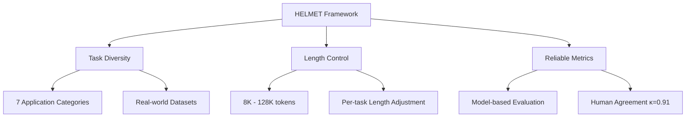

本記事は [https://arxiv.org/abs/2410.02694](https://arxiv.org/abs/2410.02694) の解説記事です。

## 論文概要（Abstract）

HELMET（How to Evaluate Long-Context Language Models Effectively and Thoroughly）は、長コンテキスト言語モデル（LCLM）を包括的に評価するためのベンチマークフレームワークである。著者らは、既存のベンチマークがNeedle-in-a-Haystack（NIAH）のような合成タスクに偏っていること、コンテキスト長の制御が不十分であること、ROUGEなどのn-gramメトリクスが人間の判断と相関しないことを問題として指摘している。HELMETは7つのアプリケーション指向カテゴリにわたる評価を提供し、8Kから128Kトークンまでの制御可能な長さで59のLCLMを体系的に評価した結果、NIAHのような合成タスクが実際のダウンストリーム性能を予測できないことを実証した。

この記事は [Zenn記事: Claude Sonnet 4.6の1Mコンテキストで大規模コードレビューエージェントを構築する](https://zenn.dev/0h_n0/articles/a41a3cb117cc46) の深掘りです。Zenn記事で言及されているロングコンテキストにおける精度低下の傾向を、HELMETのベンチマーク設計と実験結果の観点から詳細に検証する。

## 情報源

- **arXiv ID**: 2410.02694
- **URL**: [https://arxiv.org/abs/2410.02694](https://arxiv.org/abs/2410.02694)
- **著者**: Howard Yen, Tianyu Gao, Danqi Chen, et al.（Princeton NLP Group）
- **発表年**: 2024（ICLR 2025採択）
- **分野**: cs.CL, cs.AI
- **コード**: [https://github.com/princeton-nlp/HELMET](https://github.com/princeton-nlp/HELMET)

## 背景と動機（Background & Motivation）

長コンテキスト言語モデル（LCLM）の進化により、128Kトークン以上のコンテキストウィンドウを持つモデルが急増している。GPT-4oやGemini-1.5-Proは128K以上、Claude Sonnet 4.6は最大1Mトークンまで対応しており、リポジトリ全体のコードレビューや長文書の要約といった実用的なタスクが現実味を帯びてきた。

しかし、著者らはこれらのモデルの評価体制に3つの構造的問題があると指摘している。第一に、Needle-in-a-Haystack（NIAH）のような合成タスクへの過度な依存がある。NIAHでは多くのモデルがほぼ完璧なスコアを達成するが、それが実際のRAGや要約タスクでの性能を予測しないことが判明している。第二に、LongBenchやSCROLLSなどの既存ベンチマークではコンテキスト長の制御が不十分であり、同一タスクを異なる長さで比較することが困難である。第三に、要約タスクにおけるROUGEスコアがモデル間の差異やコンテキスト長の影響を適切に反映しないという計測の問題がある。

これらの課題に対し、HELMETはタスクの多様性、長さの制御可能性、評価の信頼性という3つの設計原則に基づいた新たなベンチマークを提案している。

## 主要な貢献（Key Contributions）

- **貢献1: 7カテゴリの包括的評価フレームワーク**: RAG、マルチホップQA（Recall）、要約、Few-shot ICL、パッセージ再ランキング、引用生成、長文書QAの7つの実アプリケーション指向カテゴリを統合したベンチマークを構築した
- **貢献2: 制御可能なコンテキスト長設計**: 8K、16K、32K、64K、128Kの5段階で同一タスクを評価可能な仕組みを導入し、各タスクカテゴリごとにパッセージ数、デモンストレーション数、文書切り詰めなどの手法で長さを制御している
- **貢献3: モデルベース評価メトリクスの導入**: ROUGEの代わりにGPT-4oを用いた評価を導入し、人間の判断との高い一致度（Cohen's $\kappa = 0.91$（precision）、$\kappa = 0.76$（recall））を達成した
- **貢献4: 59モデルの体系的評価**: クローズドソース（GPT-4o、Gemini-1.5-Pro、Claude-3.5）とオープンソース（Llama-3.1、Qwen-2、Mistral等）を含む59モデルの最も包括的な比較を実施した

## 技術的詳細（Technical Details）

### 評価フレームワークの設計

HELMETの設計の核心は、3つの要件を同時に満たすことにある。



### 7つのタスクカテゴリと長さ制御の手法

各カテゴリにおいて、コンテキスト長 $L$ を制御する方法が異なる。

| カテゴリ | データセット | 長さ制御方法 | 評価メトリクス |
|---------|------------|------------|--------------|
| Recall (RAG) | NQ, TriviaQA, PopQA, HotpotQA | 検索パッセージ数 $k$ を調整。Gold passageを $k-1$ 個のdistractorの中に均等分散配置 | Substring EM |
| 引用生成 (Cite) | ALCE ASQA, QAMPARI | Wikipediaからの検索パッセージ数 $k$ で調整 | Recall, Citation F1 |
| パッセージ再ランキング (Re-rank) | MS MARCO | ランダムサンプルされたパッセージ数 $k$（関連度ラベルは均衡化） | NDCG@10 |
| 長文書QA (LongQA) | NarrativeQA, $\infty$Bench QA/MC | 文書の末尾を切り詰めて長さ $L$ に調整 | Model-based (GPT-4o) |
| 要約 (Summ) | Multi-LexSum, $\infty$Bench Sum | 文書の切り詰め | Model-based (GPT-4o) |
| Few-shot ICL | TREC, BANKING77, CLINC150, NLU | ショット数を調整して入力長 $L$ を制御 | Accuracy |
| 合成Recall | JSON KV, RULER variants | キーバリューペア数、ニードル配置で制御 | Substring EM |

### モデルベース評価の定式化

著者らは、ROUGE系メトリクスの限界を克服するためにGPT-4oベースの評価を導入している。

**QA評価（NarrativeQA等）**: GPT-4oが流暢さ（fluency: 0 or 1）と正確さ（correctness: 0-3）を評価する。最終スコアは以下の式で計算される。

$$
\text{Score} = \text{fluency} \times \text{correctness} \times \frac{100}{3}
$$

ここで、
- fluency $\in \{0, 1\}$: 出力が自然な文として成立しているか
- correctness $\in \{0, 1, 2, 3\}$: 参照回答に対する正確さの度合い

**要約評価**: gold summaryをatomic claimsに分解し、GPT-4oで各claimが生成文に含まれるか（recall）、および生成文の各claimが参照要約に含まれるか（precision）を判定する。

$$
\text{SummScore} = \text{fluency} \times F_1(\text{precision}, \text{recall})
$$

### ロバストプロンプティング

全タスク（ICLとRULERを除く）に2-shotのデモンストレーションを追加している。長文生成タスクでは、デモンストレーション中の原文をプレースホルダーに置換することで入力トークン数を削減している。著者らによると、この手法によりベースモデルとinstruction-tunedモデルの両方で性能が大幅に改善した（論文Table 8）。

### アルゴリズム: HELMETの評価パイプライン

```python
from dataclasses import dataclass
from typing import Literal

@dataclass
class EvalConfig:
    """HELMET評価設定"""
    task: Literal["rag", "cite", "rerank", "longqa", "summ", "icl", "recall"]
    target_length: int  # 8192, 16384, 32768, 65536, 131072
    model_name: str
    use_chat_template: bool = True
    num_shots: int = 2  # ロバストプロンプティング用

def run_helmet_eval(config: EvalConfig) -> dict:
    """HELMETベンチマーク評価の擬似コード

    Args:
        config: 評価設定

    Returns:
        タスクごとのスコアとメタデータ
    """
    # Step 1: データ読み込みと長さ制御
    dataset = load_dataset(config.task)
    samples = adjust_context_length(
        dataset,
        target_tokens=config.target_length,
        method=LENGTH_CONTROL_METHODS[config.task],
    )

    # Step 2: プロンプト構成
    prompts = []
    for sample in samples:
        prompt = build_prompt(
            context=sample["context"],
            question=sample["question"],
            demonstrations=get_demonstrations(config.num_shots),
            use_chat_template=config.use_chat_template,
        )
        prompts.append(prompt)

    # Step 3: モデル推論
    predictions = model_generate(config.model_name, prompts)

    # Step 4: 評価メトリクス計算
    if config.task in ("longqa", "summ"):
        # モデルベース評価（GPT-4o使用）
        scores = model_based_eval(predictions, samples)
    elif config.task == "rerank":
        scores = compute_ndcg(predictions, samples, k=10)
    else:
        # Exact Match / F1
        scores = compute_em_f1(predictions, samples)

    return {
        "task": config.task,
        "length": config.target_length,
        "model": config.model_name,
        "score": aggregate(scores),
        "per_sample": scores,
    }
```

## 実装のポイント（Implementation）

HELMETの実装はPython 3.11+を前提としており、[princeton-nlp/HELMET](https://github.com/princeton-nlp/HELMET) で公開されている。

**モデル統合の拡張性**: `model_utils.py` に `prepare_inputs()` と `generate()` メソッドを実装するだけで新規モデルを追加できる。HuggingFace Transformers、各社API（OpenAI、Anthropic、Google、Together）、vLLMアクセラレーションに対応している。

**データ規模**: 全データセットで約34GBのストレージを要する。RAG、Re-ranking、Cite（ALCE）タスクはJSONL形式で保存されており、LongQA、Summ、ICLはHuggingFace Hubから動的にロードされる。

**実行コマンド例**:

```bash
# RAGタスクを128Kコンテキストで評価
python eval.py \
    --config configs/rag.yaml \
    --model_name_or_path meta-llama/Llama-3.1-8B-Instruct \
    --input_max_length 131072 \
    --output_dir results/rag_128k/ \
    --use_chat_template True

# vLLM使用時
python eval.py \
    --config configs/rag.yaml \
    --model_name_or_path meta-llama/Llama-3.1-8B-Instruct \
    --use_vllm \
    --output_dir results/rag_128k_vllm/
```

**注意点**: vLLM使用時はネイティブHuggingFace生成と結果がわずかに異なる場合がある。ベンチマーク結果の再現性を重視する場合はHuggingFace Transformersを使用することが推奨される。

## Production Deployment Guide

HELMETのベンチマーク手法は、プロダクション環境でのLLM評価パイプラインに直接応用できる。ここでは、HELMETの7カテゴリ評価をAWS上で自動化するシステムの構築方法を示す。

### AWS実装パターン（コスト最適化重視）

**トラフィック量別の推奨構成**:

| 構成 | ユースケース | 主要サービス | 月額概算 |
|------|------------|------------|---------|
| Small (~100 eval/日) | チーム内評価、CI/CD統合 | Lambda + Bedrock + DynamoDB | $80-200 |
| Medium (~1,000 eval/日) | 組織横断モデル選定 | ECS Fargate + Bedrock + S3 | $400-1,000 |
| Large (10,000+ eval/日) | マルチモデルベンチマーク基盤 | EKS + Spot + Bedrock Batch | $2,500-6,000 |

**Small構成の内訳（2026年2月時点、ap-northeast-1概算）**:
- Lambda: 月100回 x 平均120秒 x 1024MB = 約$2
- Bedrock (Claude Sonnet 4): 評価用入力50K tokens/回 x 100回 = 約$15（入力$3/MT）
- Bedrock (GPT-4o互換 model-based eval): 判定用10K tokens/回 x 100回 = 約$3
- DynamoDB (On-Demand): 約$1
- S3 (データセット保存34GB): 約$1
- CloudWatch: 約$3
- 合計: 約$25/月（評価対象モデルのAPI料金は別途）

**コスト削減テクニック**:
- Bedrock Batch APIを使用すると評価実行の入力コストを50%削減できる
- Prompt Cachingを有効化すると同一データセットでの繰り返し評価で入力コストを最大90%削減可能（5分TTL内のバッチ実行が前提）
- Spot Instancesを活用するとEKS構成でコンピュート費用を最大90%削減可能
- Reserved Instancesの1年コミットでECS/EKSのベースライン分を最大72%削減

注: 上記コスト試算は2026年2月時点のAWS ap-northeast-1（東京）リージョン料金に基づく概算値。実際のコストはトラフィックパターン、バースト使用量、評価対象モデルの料金により変動する。最新料金は[AWS料金計算ツール](https://calculator.aws/)で確認を推奨。

### Terraformインフラコード

**Small構成（Serverless: Lambda + Bedrock + DynamoDB）**:

```hcl
# main.tf - HELMET Evaluation Pipeline (Small)
terraform {
  required_version = ">= 1.9"
  required_providers {
    aws = { source = "hashicorp/aws", version = "~> 5.80" }
  }
}

provider "aws" { region = "ap-northeast-1" }

# --- IAM Role (最小権限) ---
resource "aws_iam_role" "helmet_eval" {
  name               = "helmet-eval-lambda"
  assume_role_policy = jsonencode({
    Version = "2012-10-17"
    Statement = [{
      Action = "sts:AssumeRole"
      Effect = "Allow"
      Principal = { Service = "lambda.amazonaws.com" }
    }]
  })
}

resource "aws_iam_role_policy" "helmet_eval" {
  name = "helmet-eval-policy"
  role = aws_iam_role.helmet_eval.id
  policy = jsonencode({
    Version = "2012-10-17"
    Statement = [
      {
        Effect   = "Allow"
        Action   = ["bedrock:InvokeModel", "bedrock:InvokeModelWithResponseStream"]
        Resource = "arn:aws:bedrock:ap-northeast-1::foundation-model/*"
      },
      {
        Effect   = "Allow"
        Action   = ["dynamodb:PutItem", "dynamodb:GetItem", "dynamodb:Query"]
        Resource = aws_dynamodb_table.eval_results.arn
      },
      {
        Effect   = "Allow"
        Action   = ["s3:GetObject"]
        Resource = "${aws_s3_bucket.datasets.arn}/*"
      },
      {
        Effect   = "Allow"
        Action   = ["logs:CreateLogGroup", "logs:CreateLogStream", "logs:PutLogEvents"]
        Resource = "arn:aws:logs:*:*:*"
      }
    ]
  })
}

# --- Lambda Function ---
resource "aws_lambda_function" "helmet_eval" {
  function_name = "helmet-eval-runner"
  role          = aws_iam_role.helmet_eval.arn
  handler       = "handler.lambda_handler"
  runtime       = "python3.12"
  timeout       = 900  # 15分（長コンテキスト評価に必要）
  memory_size   = 1024
  filename      = "lambda_package.zip"

  environment {
    variables = {
      EVAL_TABLE    = aws_dynamodb_table.eval_results.name
      DATASET_BUCKET = aws_s3_bucket.datasets.id
    }
  }
}

# --- DynamoDB (On-Demand, コスト最適化) ---
resource "aws_dynamodb_table" "eval_results" {
  name         = "helmet-eval-results"
  billing_mode = "PAY_PER_REQUEST"
  hash_key     = "model_task"
  range_key    = "context_length"

  attribute {
    name = "model_task"
    type = "S"
  }
  attribute {
    name = "context_length"
    type = "N"
  }

  server_side_encryption { enabled = true }  # KMS暗号化
}

# --- S3 (データセット保存) ---
resource "aws_s3_bucket" "datasets" {
  bucket = "helmet-eval-datasets-${data.aws_caller_identity.current.account_id}"
}

resource "aws_s3_bucket_server_side_encryption_configuration" "datasets" {
  bucket = aws_s3_bucket.datasets.id
  rule {
    apply_server_side_encryption_by_default { sse_algorithm = "aws:kms" }
  }
}

# --- CloudWatch アラーム (コスト監視) ---
resource "aws_cloudwatch_metric_alarm" "lambda_duration" {
  alarm_name          = "helmet-eval-duration-high"
  comparison_operator = "GreaterThanThreshold"
  evaluation_periods  = 2
  metric_name         = "Duration"
  namespace           = "AWS/Lambda"
  period              = 300
  statistic           = "Average"
  threshold           = 600000  # 10分超で警告
  dimensions          = { FunctionName = aws_lambda_function.helmet_eval.function_name }
  alarm_actions       = [aws_sns_topic.alerts.arn]
}

resource "aws_sns_topic" "alerts" { name = "helmet-eval-alerts" }
data "aws_caller_identity" "current" {}
```

**Large構成（Container: EKS + Karpenter + Spot）**:

```hcl
# eks.tf - HELMET Evaluation Pipeline (Large)
module "eks" {
  source          = "terraform-aws-modules/eks/aws"
  version         = "~> 20.31"
  cluster_name    = "helmet-eval-cluster"
  cluster_version = "1.31"

  vpc_id     = module.vpc.vpc_id
  subnet_ids = module.vpc.private_subnets

  cluster_endpoint_public_access = false  # セキュリティ: プライベートのみ
}

# Karpenter Provisioner (Spot優先で最大90%コスト削減)
resource "kubectl_manifest" "karpenter_nodepool" {
  yaml_body = yamlencode({
    apiVersion = "karpenter.sh/v1"
    kind       = "NodePool"
    metadata   = { name = "helmet-eval-pool" }
    spec = {
      template = {
        spec = {
          requirements = [
            { key = "karpenter.sh/capacity-type", operator = "In", values = ["spot", "on-demand"] },
            { key = "node.kubernetes.io/instance-type", operator = "In",
              values = ["m6i.xlarge", "m6i.2xlarge", "m7i.xlarge", "m7i.2xlarge"] }
          ]
        }
      }
      limits   = { cpu = "64", memory = "256Gi" }
      disruption = {
        consolidationPolicy = "WhenEmptyOrUnderutilized"
        consolidateAfter    = "30s"
      }
    }
  })
}

# AWS Budgets (予算アラート)
resource "aws_budgets_budget" "helmet_monthly" {
  name         = "helmet-eval-monthly"
  budget_type  = "COST"
  limit_amount = "5000"
  limit_unit   = "USD"
  time_unit    = "MONTHLY"

  notification {
    comparison_operator       = "GREATER_THAN"
    threshold                 = 80
    threshold_type            = "PERCENTAGE"
    notification_type         = "ACTUAL"
    subscriber_email_addresses = ["admin@example.com"]
  }
}
```

### 運用・監視設定

**CloudWatch Logs Insights クエリ（コスト異常検知）**:

```
# 1時間あたりのBedrock API呼び出しとトークン使用量を可視化
fields @timestamp, @message
| filter @message like /bedrock/
| stats count() as api_calls,
        sum(input_tokens) as total_input_tokens,
        sum(output_tokens) as total_output_tokens
  by bin(1h) as hour
| sort hour desc
```

**CloudWatch Logs Insights クエリ（レイテンシ分析）**:

```
# P95/P99レイテンシの計算
fields @timestamp, duration_ms
| filter task_type = "helmet_eval"
| stats percentile(duration_ms, 95) as p95,
        percentile(duration_ms, 99) as p99,
        avg(duration_ms) as avg_ms
  by context_length
| sort context_length asc
```

**CloudWatchアラーム設定（Python boto3）**:

```python
import boto3

cloudwatch = boto3.client("cloudwatch", region_name="ap-northeast-1")

def create_token_usage_alarm(threshold_tokens: int = 5_000_000) -> None:
    """Bedrockトークン使用量スパイク検知アラームを作成する"""
    cloudwatch.put_metric_alarm(
        AlarmName="helmet-bedrock-token-spike",
        MetricName="InputTokenCount",
        Namespace="AWS/Bedrock",
        Statistic="Sum",
        Period=3600,
        EvaluationPeriods=1,
        Threshold=threshold_tokens,
        ComparisonOperator="GreaterThanThreshold",
        AlarmActions=["arn:aws:sns:ap-northeast-1:ACCOUNT:helmet-eval-alerts"],
    )
```

**X-Rayトレーシング設定（Python）**:

```python
from aws_xray_sdk.core import xray_recorder, patch_all

xray_recorder.configure(service="helmet-eval-pipeline")
patch_all()  # boto3自動計装

@xray_recorder.capture("run_evaluation")
def run_evaluation(model: str, task: str, length: int) -> dict:
    """X-Rayトレース付き評価実行"""
    subsegment = xray_recorder.current_subsegment()
    subsegment.put_annotation("model", model)
    subsegment.put_annotation("task", task)
    subsegment.put_annotation("context_length", length)

    result = execute_helmet_eval(model, task, length)

    subsegment.put_metadata("score", result["score"])
    subsegment.put_metadata("input_tokens", result["input_tokens"])
    return result
```

**Cost Explorer自動レポート（Python）**:

```python
import boto3
from datetime import date, timedelta

ce = boto3.client("ce", region_name="us-east-1")
sns = boto3.client("sns", region_name="ap-northeast-1")

def daily_cost_report() -> None:
    """日次コストレポートを取得しSNS通知する"""
    today = date.today()
    yesterday = today - timedelta(days=1)

    response = ce.get_cost_and_usage(
        TimePeriod={"Start": str(yesterday), "End": str(today)},
        Granularity="DAILY",
        Metrics=["BlendedCost"],
        GroupBy=[{"Type": "DIMENSION", "Key": "SERVICE"}],
    )

    total = sum(
        float(g["Metrics"]["BlendedCost"]["Amount"])
        for g in response["ResultsByTime"][0]["Groups"]
    )

    if total > 100:
        sns.publish(
            TopicArn="arn:aws:sns:ap-northeast-1:ACCOUNT:helmet-eval-alerts",
            Subject=f"HELMET Cost Alert: ${total:.2f}/day",
            Message=f"Daily cost exceeded $100 threshold: ${total:.2f}",
        )
```

### コスト最適化チェックリスト

**アーキテクチャ選択**:
- [ ] トラフィック量に応じた構成選定（~100 eval/日: Serverless、~1,000: Hybrid、10,000+: Container）
- [ ] 評価頻度に応じたバッチ vs リアルタイム判定

**リソース最適化**:
- [ ] EC2/EKS: Spot Instances優先（m6i/m7i、最大90%削減）
- [ ] Reserved Instances: ベースライン負荷分を1年コミット（最大72%削減）
- [ ] Savings Plans: コンピューティング全般の割引検討
- [ ] Lambda: メモリサイズ最適化（1024MB推奨、128K評価では2048MBも検討）
- [ ] ECS/EKS: Karpenterで未使用ノード30秒後に自動統合

**LLMコスト削減**:
- [ ] Bedrock Batch APIで非同期評価実行（50%削減）
- [ ] Prompt Caching有効化（同一データセット反復評価で最大90%削減）
- [ ] モデル選択ロジック（簡易タスクは軽量モデル、複雑タスクはfrontierモデル）
- [ ] トークン数制限（max_tokens適切設定、不要な長文出力を防止）
- [ ] model-based eval用のモデルはコスト効率の高いものを選択

**監視・アラート**:
- [ ] AWS Budgets設定（月額上限の80%で警告）
- [ ] CloudWatchアラーム（トークン使用量スパイク、Lambda実行時間異常）
- [ ] Cost Anomaly Detection有効化
- [ ] 日次コストレポート（$100/日超過でSNS通知）
- [ ] X-Rayトレーシングで評価パイプラインのボトルネック特定

**リソース管理**:
- [ ] 未使用Lambda関数・ECSタスク定義の定期削除
- [ ] タグ戦略（Environment, Project, CostCenter）
- [ ] S3ライフサイクルポリシー（古い評価結果を90日後にGlacierへ移行）
- [ ] 開発環境の夜間・休日自動停止（EKSノード0台スケールダウン）
- [ ] DynamoDB TTLで古い評価結果を自動削除

## 実験結果（Results）

### 59モデルの体系的評価

著者らは59のLCLMを5つのコンテキスト長（8K、16K、32K、64K、128K）で評価している。論文Figure 6に基づく主要な結果を以下に示す。

**タスクカテゴリ別の性能傾向（論文Figure 6, 7より）**:

| カテゴリ | 8K→128Kの傾向 | クローズドソース vs オープンソースの差 |
|---------|-------------|----------------------------------|
| Recall (RAG) | 32K以下は高水準、以降漸減 | 32K以下では小、64K以上で拡大 |
| 引用生成 (Cite) | 全長で顕著な低下 | オープンソースで最も大きな性能低下 |
| 再ランキング (Re-rank) | Frontierモデルでも顕著な低下 | GPT-4o, Geminiでも128Kで低下 |
| 長文書QA (LongQA) | 緩やかな低下 | 中程度の差 |
| 要約 (Summ) | 最もロバスト | ROUGEでは差を検出できず |
| Few-shot ICL | 20-50 shotでピーク後プラトー | タスク依存 |

### タスク間相関の低さ

著者らは、HELMETの7カテゴリ間の相関が低いことを報告している（論文Figure 4）。この結果は、単一のタスクカテゴリでの評価がモデルの全体的な長コンテキスト能力を反映しないことを意味する。具体的には、RAGとRe-rankingの間には中程度の相関が見られるが、ICLは他の全カテゴリとの相関が最も低い。

### NIAHと実タスクの乖離

著者らの分析によると、Needle-in-a-Haystackタスクでの性能は実アプリケーションタスクでの性能を予測しない。多くのモデルがNIAHでほぼ完璧なスコアを達成する一方で、引用生成や再ランキングなどの複雑なタスクでは大幅な性能差が存在する。RULERの複雑な合成タスク（Multi-Value）のほうがNIAHより実タスクとの相関が高いことも報告されている。

### ROUGEとモデルベース評価の比較

論文Figure 2, 3において、著者らはROUGE-LとGPT-4oベースの評価を比較している。ROUGEではモデル間の差異を十分に検出できず、コンテキスト長の変化に対する感度も低い。一方、モデルベース評価はモデル間の差異を明確に区別し、コンテキスト長が増加するにつれてGPT-4oの性能が向上する傾向も検出できている。人間の評価との一致度はCohen's $\kappa = 0.91$（precision）、$\kappa = 0.76$（recall）と報告されている。

## 実運用への応用（Practical Applications）

HELMETの知見は、長コンテキストLLMを実運用するエンジニアに対して複数の実践的示唆を提供する。

**モデル選定の指針**: Zenn記事のコードレビューエージェントのようなユースケースでは、HELMETのRecall（RAG）タスクとLongQAタスクの結果が参考になる。32Kトークン以下であればオープンソースモデルでもクローズドソースと同等の性能が期待できるが、128Kを超えるコンテキストではGPT-4oやGemini-1.5-Pro級のモデルが必要になる。

**評価パイプラインの構築**: プロダクション環境でモデルを切り替える際、NIAHだけで判断するのは危険である。HELMETが示すように、実際のユースケースに近いタスクカテゴリ（例: コードレビューであればLongQA、RAGであればRecall）で評価すべきである。著者らはRAGタスクを高速な開発イテレーション用の代理指標として推奨している。

**コンテキスト長の設計**: 著者らの結果から、コンテキスト長を無条件に最大化するのではなく、タスクの特性に応じた適切な長さを選択することが重要である。要約タスクはコンテキスト長に対してロバストだが、再ランキングや引用生成は長くなるほど性能が低下する。Zenn記事で紹介されている`select_effort_and_context`のようなルーティングロジックは、この知見と整合する。

## 関連研究（Related Work）

- **RULER** (Hsieh et al., 2024): 合成タスクによるLCLM評価。NIAHの拡張としてMulti-Value、Multi-Key等の複雑なバリアントを提案。HELMETは、RULERの複雑な合成タスクが実タスクとの相関が比較的高いことを示しつつ、実アプリケーションタスクの必要性を主張している
- **LongBench** (Bai et al., 2024): 中国語・英語の長コンテキストベンチマーク。ただし著者らは、長さ制御が不十分で、多くのサンプルが32K以下に集中していると指摘している
- **SCROLLS / ZeroScrolls** (Shaham et al., 2022/2023): 長文書理解のベンチマーク。SCROLLSの平均入力長は16K未満であり、現代のLCLMの能力を十分に評価できない
- **LongProc** (Yen et al., 2025): HELMETの著者らによる後続研究。長コンテキスト入力だけでなく長出力生成の評価にも焦点を当てている
- **LongCodeBench** (arXiv:2505.07897): コード特化の長コンテキスト評価。Zenn記事で引用されており、1Mコンテキストでのコード修復精度がGemini 2.5 Proの7%が最高値であることを報告している

## まとめと今後の展望

HELMETは、LCLMの評価における3つの根本的問題（タスクの多様性不足、長さ制御の欠如、メトリクスの不信頼性）に対して体系的な解決策を提示した。著者らの59モデル評価から得られた最も重要な知見は、NIAHのような合成タスクが実タスク性能を予測しないこと、32Kトークンを超えた時点でモデル間の性能差が顕著に現れること、そしてタスクカテゴリ間の相関が低いため包括的な評価が不可欠であることの3点である。

実務への示唆として、プロダクション環境でモデルを選定・評価する際には、HELMETの7カテゴリから自社ユースケースに最も近いカテゴリを選択し、32K以上のコンテキスト長で比較することが推奨される。Microsoft Phi-4やAI21 Jamba 1.6など、業界でもHELMETを採用する事例が増えている。

今後の研究方向として、著者らは128Kを超える超長コンテキストへの拡張、マルチモーダル入力への対応、および長出力生成の評価（LongProc）を挙げている。

## 参考文献

- **arXiv**: [https://arxiv.org/abs/2410.02694](https://arxiv.org/abs/2410.02694)
- **Code**: [https://github.com/princeton-nlp/HELMET](https://github.com/princeton-nlp/HELMET)
- **Project Page**: [https://princeton-nlp.github.io/HELMET/](https://princeton-nlp.github.io/HELMET/)
- **HuggingFace Blog**: [https://huggingface.co/blog/helmet](https://huggingface.co/blog/helmet)
- **Related Zenn article**: [https://zenn.dev/0h_n0/articles/a41a3cb117cc46](https://zenn.dev/0h_n0/articles/a41a3cb117cc46)

---

本記事はAI（Claude Code）により自動生成されました。内容の正確性については複数の情報源で検証していますが、実際の利用時は論文原文もご確認ください。
