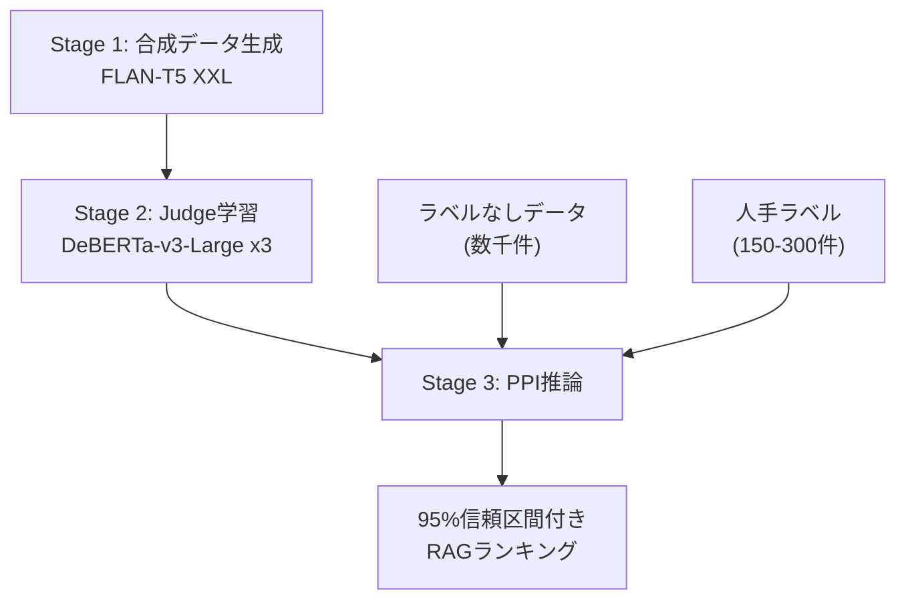

## 論文概要（Abstract）

ARES（Automated RAG Evaluation System）は、Retrieval-Augmented Generation（RAG）システムを**コンテキスト関連性**・**回答忠実性**・**回答関連性**の3次元で自動評価するフレームワークである。従来のRAG評価は大量の人手アノテーションに依存していたが、ARESは合成データによるLLM Judgeの学習とPrediction-Powered Inference（PPI）統計手法を組み合わせることで、150--300件の人手ラベルのみで信頼性の高い評価を実現する。KILTおよびSuperGLUEの8タスクで検証され、RAGASと比較してコンテキスト関連性で59.9ポイント、回答関連性で14.4ポイント高い精度を報告している（NAACL 2024採択）。

この記事は [Zenn記事: LangGraphマルチエージェントRAGの評価フレームワーク設計と協調品質の定量化](https://zenn.dev/0h_n0/articles/88cd951a1ec060) の深掘りです。

## 情報源

- **arXiv ID**: 2311.09476
- **URL**: [https://arxiv.org/abs/2311.09476](https://arxiv.org/abs/2311.09476)
- **著者**: Jon Saad-Falcon, Omar Khattab, Christopher Potts, Matei Zaharia（Stanford University）
- **発表年**: 2023（NAACL 2024採択）
- **分野**: cs.CL, cs.IR, cs.LG

## 背景と動機（Background & Motivation）

RAGシステムの評価は、従来3つの課題を抱えていた。第一に、各コンポーネント（Retriever・Generator）の品質を個別に測定する標準的な指標が存在しなかった。第二に、BLEUやROUGEなどの自動指標はRAGの出力品質を十分に捕捉できず、人手評価に依存せざるを得なかった。第三に、RAGシステムの構成を変更するたびに大量のアノテーションを再取得する必要があり、反復的な開発が困難だった。

既存手法のRAGASはhand-craftedなプロンプトで評価するが、ドメイン固有の適応性に欠け、統計的保証がない。EXAMは各クエリに対する複数の副質問を必要とし、スケーラビリティに課題がある。ARESはこれらの問題に対し、合成データ生成・軽量Judge学習・PPI統計推論の3段階パイプラインを提案し、少数のラベルで信頼区間付きの評価結果を提供する。

## 主要な貢献（Key Contributions）

- **合成データによるJudge学習**: FLAN-T5 XXLで合成クエリ・回答ペアを生成し、DeBERTa-v3-Large（304Mパラメータ）をfine-tuneすることで、ドメイン適応型の軽量LLM Judgeを構築
- **PPI統計推論の導入**: 150--300件の人手ラベルとLLM Judgeの大量予測を統計的に組み合わせ、95%信頼区間付きのRAGシステムランキングを実現
- **3次元評価フレームワーク**: コンテキスト関連性・回答忠実性・回答関連性を独立した分類器で評価し、RAGパイプラインのボトルネックを特定可能に
- **78%のアノテーション削減**: 9システムの比較評価で、従来の1,350アノテーションに対し300アノテーションで同等精度を達成

## 技術的詳細（Technical Details）

### Stage 1: 合成データ生成

ARESはまず評価対象ドメインのパッセージからFLAN-T5 XXLを用いて合成クエリと回答を生成する。5件以上のin-domainな例をfew-shotプロンプトとして与え、クエリ品質は検索ベースのフィルタリングで保証する。具体的には、生成されたクエリでRetrieverを実行し、元のパッセージがtop-1に返される場合のみ採用する。

ネガティブ例はweak negative（ランダムな無関係パッセージ）とstrong negative（BM25で類似したパッセージまたは矛盾する回答）の2種類を正例と同数生成する。

### Stage 2: LLM Judgeの学習

DeBERTa-v3-Large（304Mパラメータ）の`[CLS]`トークン出力にdropout率0.1の線形分類層を追加し、3つの独立した二値分類器を学習する。

```python
def train_ares_judge(
    synthetic_data: list[dict],
    validation_set: list[dict],
    model_name: str = "microsoft/deberta-v3-large",
    learning_rate: float = 5e-6,
    batch_size: int = 32,
) -> dict[str, torch.nn.Module]:
    """ARESの3種類のLLM Judgeを学習する

    Args:
        synthetic_data: 合成データ（query, passage, answer, label）
        validation_set: 人手ラベル付き検証セット（150-300件）
        model_name: ベースモデル名
        learning_rate: 学習率
        batch_size: バッチサイズ

    Returns:
        3つのJudge（context_relevance, answer_faithfulness, answer_relevance）
    """
    judges: dict[str, torch.nn.Module] = {}
    metrics = ["context_relevance", "answer_faithfulness", "answer_relevance"]

    for metric in metrics:
        model = AutoModelForSequenceClassification.from_pretrained(
            model_name, num_labels=2
        )
        optimizer = torch.optim.Adam(model.parameters(), lr=learning_rate)
        # Cross-entropy loss + linear warmup/decay
        # Early stopping: 検証セット上で3エポック改善なしで停止
        judges[metric] = model

    return judges
```

損失関数はcross-entropy lossを使用し、Adam optimizerで最適化する。学習率スケジュールはlinear warmup and decayを適用し、人手ラベル付き検証セット上で3エポック改善がない場合にearly stoppingする。

### Stage 3: PPIによるランキング

Prediction-Powered Inference（PPI）は、少数のラベル付きデータと大量のラベルなしデータに対するモデル予測を統計的に組み合わせる手法である（Angelopoulos et al., 2023）。

ARESでは、学習済みJudgeがラベルなしデータに対して予測 $\hat{Y}_i$ を出力し、人手ラベル付きデータ（$n_\ell$ 件）でその予測誤差を補正する。PPIの推定量は以下の形で表される。

$$
\hat{\theta}_{\mathrm{PPI}} = \frac{1}{n_u} \sum_{i \in \mathcal{U}} \hat{Y}_i + \frac{1}{n_\ell} \sum_{i \in \mathcal{L}} (Y_i - \hat{Y}_i)
$$

ここで、
- $n_u$: ラベルなしデータのサンプル数
- $n_\ell$: ラベル付きデータのサンプル数（150--300件）
- $\hat{Y}_i$: LLM Judgeの予測（0または1）
- $Y_i$: 人手ラベル（0または1）
- $\mathcal{U}$: ラベルなしデータの集合
- $\mathcal{L}$: ラベル付きデータの集合

第1項はラベルなしデータ全体に対するJudgeの予測平均であり、第2項は**rectifier**（補正項）として機能する。rectifierはラベル付きデータ上でJudgeの系統的な予測誤差を推定し、第1項のバイアスを補正する。

PPIの分散は以下の条件で古典的な推定量（ラベル付きデータのみ使用）の分散より小さくなる。

$$
\mathbb{V}(\hat{f}(X)) < 2 \mathrm{Cov}(Y, \hat{f}(X))
$$

すなわち、Judgeの予測が真のラベルと正の相関を持ち、かつ予測のばらつきが過度に大きくなければ、PPIは少数のラベルで精度の高い推定を実現する。ARESは95%信頼区間を構築し、その中央値でRAGシステムをランキングする。著者らの報告によると、コンテキスト関連性で平均7.4ポイント、回答関連性で平均6.1ポイントの信頼区間幅を達成している。



## 実装のポイント（Implementation）

ARESの実装はPythonパッケージ `ares-ai` として公開されている。主な注意点を以下に示す。

**合成データ品質のフィルタリング**: 生成クエリの品質はRetrieverベースのフィルタで担保する。元パッセージがtop-1に返らないクエリは除外する。この手順を省略すると、Judgeの精度が著しく低下する。

**ネガティブサンプリング戦略**: strong negativeとweak negativeを同数用意する。strong negativeのみでは過度に保守的な判定となり、weak negativeのみでは弁別力が不足する。

**検証セットのサイズ**: Table 3の結果から、150件が実用的な下限である。100件未満では性能が著しく劣化する。300件あればKendall's $\tau$ が0.89--1.0の範囲で安定する。一方、GPT-4で人手ラベルを代替した場合、Kendall's $\tau$ が0.05--0.30低下するため（Table 4）、少なくとも検証セットは人手ラベルを推奨する。

**クロスドメイン転移**: クエリタイプの変化（NQ→FEVER）では $\tau$ 0.89--1.0を維持するが、言語やモダリティが大きく異なる場合（英語→スペイン語、テキスト→コード）は $\tau$ が0.28--0.38まで低下するため、ドメインが大きく異なる場合はJudgeの再学習が必要である。

## Production Deployment Guide

### AWS実装パターン（コスト最適化重視）

ARESをプロダクション環境でRAG評価パイプラインとして運用する場合のAWS構成を示す。以下のコスト試算は2026年2月時点のap-northeast-1（東京）リージョン料金に基づく概算値であり、実際のコストはトラフィックパターンやバースト使用量により変動する。最新料金はAWS料金計算ツールで確認を推奨する。

**Small構成（~100 eval/日）: Serverless**
- Lambda (Judge推論): 256MB, 30sec timeout, ~$5/月
- Bedrock (合成データ生成, FLAN-T5相当): ~$30/月
- DynamoDB (評価結果・ラベル保存): On-Demand, ~$5/月
- S3 (モデルアーティファクト): ~$3/月
- CloudWatch: ~$5/月
- **合計: ~$50/月**

**Medium構成（~1,000 eval/日）: Hybrid**
- ECS Fargate (Judge推論バッチ): 2vCPU/4GB x2タスク, ~$200/月
- Bedrock Batch API (合成データ生成): 50%割引適用, ~$80/月
- DynamoDB (評価結果): ~$20/月
- SageMaker Endpoint (DeBERTa Judge): ml.g5.xlarge, ~$300/月
- CloudWatch + X-Ray: ~$15/月
- **合計: ~$615/月**

**Large構成（10,000+ eval/日）: Container**
- EKS (Judge推論クラスタ): Spot Instances優先, ~$800/月
- SageMaker Multi-Model Endpoint (3 Judge): ml.g5.2xlarge, ~$1,200/月
- Bedrock Batch API: ~$400/月
- ElastiCache (推論結果キャッシュ): r7g.large, ~$200/月
- DynamoDB + S3: ~$100/月
- CloudWatch + X-Ray + Cost Explorer: ~$30/月
- **合計: ~$2,730/月**

**コスト削減テクニック**:
- Spot Instances活用（EKSワーカーノード）: 最大90%削減
- Reserved Instances（SageMaker Endpoint）: 1年コミットで最大72%削減
- Bedrock Batch API: 同期APIに対し50%削減
- Prompt Caching（合成データ生成）: 30--90%削減
- Judge推論のバッチ化: Lambda個別呼び出しの1/10コスト

### Terraformインフラコード

**Small構成（Serverless）**

```hcl
# ARES RAG Evaluation - Small構成 (Serverless)
# Lambda + Bedrock + DynamoDB

terraform {
  required_version = ">= 1.9"
  required_providers {
    aws = { source = "hashicorp/aws", version = "~> 5.80" }
  }
}

provider "aws" {
  region = "ap-northeast-1"
}

# --- IAM Role (最小権限) ---
resource "aws_iam_role" "ares_judge_lambda" {
  name = "ares-judge-lambda-role"
  assume_role_policy = jsonencode({
    Version = "2012-10-17"
    Statement = [{
      Action = "sts:AssumeRole"
      Effect = "Allow"
      Principal = { Service = "lambda.amazonaws.com" }
    }]
  })
}

resource "aws_iam_role_policy" "ares_judge_policy" {
  name = "ares-judge-policy"
  role = aws_iam_role.ares_judge_lambda.id
  policy = jsonencode({
    Version = "2012-10-17"
    Statement = [
      {
        Effect   = "Allow"
        Action   = ["dynamodb:PutItem", "dynamodb:GetItem", "dynamodb:Query"]
        Resource = aws_dynamodb_table.ares_results.arn
      },
      {
        Effect   = "Allow"
        Action   = ["bedrock:InvokeModel"]
        Resource = "arn:aws:bedrock:ap-northeast-1::foundation-model/*"
      },
      {
        Effect   = "Allow"
        Action   = ["s3:GetObject"]
        Resource = "${aws_s3_bucket.ares_models.arn}/*"
      },
      {
        Effect   = "Allow"
        Action   = ["logs:CreateLogGroup", "logs:CreateLogStream", "logs:PutLogEvents"]
        Resource = "arn:aws:logs:*:*:*"
      }
    ]
  })
}

# --- DynamoDB (On-Demand, コスト最適化) ---
resource "aws_dynamodb_table" "ares_results" {
  name         = "ares-evaluation-results"
  billing_mode = "PAY_PER_REQUEST" # On-Demandでコスト最適化
  hash_key     = "eval_id"
  range_key    = "timestamp"

  attribute {
    name = "eval_id"
    type = "S"
  }
  attribute {
    name = "timestamp"
    type = "S"
  }

  server_side_encryption { enabled = true } # KMS暗号化
  point_in_time_recovery { enabled = true }
}

# --- S3 (モデルアーティファクト) ---
resource "aws_s3_bucket" "ares_models" {
  bucket = "ares-judge-models-${data.aws_caller_identity.current.account_id}"
}

resource "aws_s3_bucket_server_side_encryption_configuration" "ares_models" {
  bucket = aws_s3_bucket.ares_models.id
  rule {
    apply_server_side_encryption_by_default {
      sse_algorithm = "aws:kms"
    }
  }
}

# --- Lambda (Judge推論) ---
resource "aws_lambda_function" "ares_judge" {
  function_name = "ares-judge-evaluator"
  role          = aws_iam_role.ares_judge_lambda.arn
  runtime       = "python3.12"
  handler       = "handler.evaluate"
  memory_size   = 256
  timeout       = 30

  environment {
    variables = {
      DYNAMODB_TABLE = aws_dynamodb_table.ares_results.name
      MODEL_BUCKET   = aws_s3_bucket.ares_models.id
    }
  }

  tracing_config { mode = "Active" } # X-Ray有効化
}

# --- CloudWatch アラーム (コスト監視) ---
resource "aws_cloudwatch_metric_alarm" "lambda_errors" {
  alarm_name          = "ares-judge-error-rate"
  comparison_operator = "GreaterThanThreshold"
  evaluation_periods  = 2
  metric_name         = "Errors"
  namespace           = "AWS/Lambda"
  period              = 300
  statistic           = "Sum"
  threshold           = 5
  alarm_description   = "ARES Judge Lambda error rate exceeded"

  dimensions = {
    FunctionName = aws_lambda_function.ares_judge.function_name
  }
}

data "aws_caller_identity" "current" {}
```

**Large構成（Container）**

```hcl
# ARES RAG Evaluation - Large構成 (EKS + Karpenter + Spot)

# --- EKS Cluster ---
module "eks" {
  source          = "terraform-aws-modules/eks/aws"
  version         = "~> 20.31"
  cluster_name    = "ares-evaluation-cluster"
  cluster_version = "1.31"

  vpc_id     = module.vpc.vpc_id
  subnet_ids = module.vpc.private_subnets

  eks_managed_node_groups = {
    system = {
      instance_types = ["m7i.large"]
      min_size       = 1
      max_size       = 2
      desired_size   = 1
    }
  }
}

# --- Karpenter (Spot優先, 自動スケーリング) ---
resource "kubectl_manifest" "karpenter_nodepool" {
  yaml_body = yamlencode({
    apiVersion = "karpenter.sh/v1"
    kind       = "NodePool"
    metadata   = { name = "ares-gpu-spot" }
    spec = {
      template = {
        spec = {
          requirements = [
            { key = "karpenter.sh/capacity-type", operator = "In", values = ["spot", "on-demand"] },
            { key = "node.kubernetes.io/instance-type", operator = "In",
              values = ["g5.xlarge", "g5.2xlarge", "g6.xlarge"] },
          ]
          nodeClassRef = { name = "default" }
        }
      }
      limits   = { cpu = "64", memory = "256Gi" }
      disruption = { consolidationPolicy = "WhenEmptyOrUnderutilized" }
    }
  })
}

# --- Secrets Manager (Bedrock設定) ---
resource "aws_secretsmanager_secret" "ares_config" {
  name = "ares-evaluation-config"
}

# --- AWS Budgets (予算アラート) ---
resource "aws_budgets_budget" "ares_monthly" {
  name         = "ares-monthly-budget"
  budget_type  = "COST"
  limit_amount = "3000"
  limit_unit   = "USD"
  time_unit    = "MONTHLY"

  notification {
    comparison_operator       = "GREATER_THAN"
    threshold                 = 80
    threshold_type            = "PERCENTAGE"
    notification_type         = "ACTUAL"
    subscriber_email_addresses = ["ops@example.com"]
  }
}
```

### 運用・監視設定

**CloudWatch Logs Insights クエリ（コスト異常検知）**

```
fields @timestamp, @message
| filter @message like /token_count/
| stats sum(token_count) as total_tokens by bin(1h) as hour
| sort hour desc
| limit 24
```

**CloudWatch Logs Insights クエリ（レイテンシ分析）**

```
fields @timestamp, duration_ms
| filter function_name = "ares-judge-evaluator"
| stats avg(duration_ms) as avg_latency,
        percentile(duration_ms, 95) as p95,
        percentile(duration_ms, 99) as p99
  by bin(1h)
```

**CloudWatch アラーム設定**

```python
import boto3

cloudwatch = boto3.client("cloudwatch", region_name="ap-northeast-1")

def create_ares_alarms() -> None:
    """ARES評価パイプライン用CloudWatchアラームを作成する"""
    # Bedrockトークン使用量スパイク検知
    cloudwatch.put_metric_alarm(
        AlarmName="ares-bedrock-token-spike",
        MetricName="InputTokenCount",
        Namespace="AWS/Bedrock",
        Statistic="Sum",
        Period=3600,
        EvaluationPeriods=2,
        Threshold=100000,
        ComparisonOperator="GreaterThanThreshold",
        AlarmActions=["arn:aws:sns:ap-northeast-1:ACCOUNT:ares-alerts"],
    )
    # Lambda実行時間異常検知
    cloudwatch.put_metric_alarm(
        AlarmName="ares-lambda-duration-anomaly",
        MetricName="Duration",
        Namespace="AWS/Lambda",
        Statistic="p99",
        Period=300,
        EvaluationPeriods=3,
        Threshold=25000,  # 25秒（timeout 30秒の83%）
        ComparisonOperator="GreaterThanThreshold",
        Dimensions=[{"Name": "FunctionName", "Value": "ares-judge-evaluator"}],
        AlarmActions=["arn:aws:sns:ap-northeast-1:ACCOUNT:ares-alerts"],
    )
```

**X-Ray トレーシング設定**

```python
from aws_xray_sdk.core import xray_recorder, patch_all

patch_all()  # boto3自動計装

@xray_recorder.capture("ares_judge_inference")
def run_judge_inference(query: str, passage: str, answer: str) -> dict[str, float]:
    """ARES Judgeの推論をX-Rayトレース付きで実行する"""
    subsegment = xray_recorder.current_subsegment()
    subsegment.put_annotation("metric_type", "context_relevance")
    subsegment.put_metadata("input_length", len(query) + len(passage))
    # Judge推論ロジック
    scores = {"context_relevance": 0.92, "faithfulness": 0.87, "relevance": 0.95}
    subsegment.put_metadata("scores", scores)
    return scores
```

**Cost Explorer自動レポート**

```python
import boto3
from datetime import datetime, timedelta

ce = boto3.client("ce", region_name="us-east-1")
sns = boto3.client("sns", region_name="ap-northeast-1")

def daily_cost_report() -> None:
    """日次コストレポートを取得し、閾値超過時にSNS通知する"""
    end = datetime.utcnow().strftime("%Y-%m-%d")
    start = (datetime.utcnow() - timedelta(days=1)).strftime("%Y-%m-%d")

    response = ce.get_cost_and_usage(
        TimePeriod={"Start": start, "End": end},
        Granularity="DAILY",
        Metrics=["UnblendedCost"],
        Filter={
            "Tags": {
                "Key": "Project",
                "Values": ["ares-evaluation"],
            }
        },
        GroupBy=[{"Type": "DIMENSION", "Key": "SERVICE"}],
    )

    total = sum(
        float(g["Metrics"]["UnblendedCost"]["Amount"])
        for r in response["ResultsByTime"]
        for g in r["Groups"]
    )

    if total > 100.0:  # $100/日超過でアラート
        sns.publish(
            TopicArn="arn:aws:sns:ap-northeast-1:ACCOUNT:ares-cost-alert",
            Subject="ARES Cost Alert: Daily spend exceeded $100",
            Message=f"ARES daily cost: ${total:.2f}",
        )
```

### コスト最適化チェックリスト

**アーキテクチャ選択**
- [ ] トラフィック量に応じた構成選択（~100/日: Serverless、~1,000/日: Hybrid、10,000+/日: Container）
- [ ] 評価頻度が低い場合はバッチ実行に切り替え（Fargate Spot Task）

**リソース最適化**
- [ ] EC2/EKSワーカーノード: Spot Instances優先（最大90%削減）
- [ ] SageMaker Endpoint: Reserved Instances 1年コミット（最大72%削減）
- [ ] Savings Plans: Compute Savings Plans検討（最大66%削減）
- [ ] Lambda: メモリサイズをPower Tuningで最適化（256MB--512MB）
- [ ] EKS: Karpenterで未使用時自動スケールダウン
- [ ] SageMaker: Multi-Model Endpointで3 Judgeを1インスタンスに集約

**LLMコスト削減**
- [ ] Bedrock Batch API使用（同期API比50%削減）
- [ ] Prompt Caching有効化（合成データ生成テンプレートのキャッシュ、30--90%削減）
- [ ] モデル選択ロジック: 簡単なケースはDeBERTa Judge、複雑なケースのみBedrock LLM
- [ ] トークン数制限: 入力パッセージを512トークンに切り詰め
- [ ] 合成データの再利用: 同一ドメインで再生成不要

**監視・アラート**
- [ ] AWS Budgets: 月額予算 + 80%/100%閾値アラート設定
- [ ] CloudWatch アラーム: Lambda Error Rate、Bedrock Token Spike
- [ ] Cost Anomaly Detection: 自動異常検出有効化
- [ ] 日次コストレポート: Cost Explorer APIで自動取得 + SNS通知
- [ ] X-Ray: 推論レイテンシのP95/P99モニタリング

**リソース管理**
- [ ] 未使用SageMaker Endpointの自動削除（夜間・休日）
- [ ] タグ戦略: `Project=ares-evaluation` タグで全リソースを識別
- [ ] S3ライフサイクルポリシー: 30日以上の中間データをGlacierに移行
- [ ] 開発環境の夜間自動停止（EventBridge + Lambda）
- [ ] ECRイメージの古いタグを自動削除（ライフサイクルポリシー）

## 実験結果（Results）

著者らは8つの知識集約型タスク（KILT: NQ, HotpotQA, FEVER, WoW / SuperGLUE: MultiRC, ReCoRD / AIS: CNN/DM, WoW）で実験を行っている。

**RAGASとの比較**: ARESはコンテキスト関連性で59.9ポイント、回答関連性で14.4ポイント高い精度を示した。Kendall's $\tau$ の平均改善は、コンテキスト関連性で0.065、回答関連性で0.132であった。

**実RAGシステムのランキング**（論文Table 5より）: 3つのRetriever（BM25, Ada Embeddings, ColBERTv2）と3つのLLM（MPT-7b, GPT-3.5, GPT-4）+ Facebook RAGモデルの組み合わせを評価した結果、NQのコンテキスト関連性でKendall's $\tau$ = 1.0・精度85.6%、WoWの回答関連性で $\tau$ = 1.0・精度88.2%を達成した。

**PPIの効果**（Ablation）: PPIを適用しないfine-tuned Judgeのみの場合と比較して、PPIの適用により全データセットで $\tau$ が向上した。

**アノテーション数の影響**（論文Table 3より）: 400件で $\tau$ = 1.0/1.0/0.89、300件で0.89/1.0/0.94、150件で0.72/1.0/0.83であった。100件未満では性能が著しく劣化する。

## 実運用への応用（Practical Applications）

ARESはマルチエージェントRAGシステムの品質ゲートとして活用できる。LangGraphベースのパイプラインでは、各エージェント（Retriever Agent, Generator Agent, Validator Agent）の出力をARESの3次元で個別に評価し、ボトルネックの自動特定が可能である。

**CI/CDパイプラインへの統合**: RAGシステムの構成変更（Retrieverモデルの差し替え、プロンプトの変更等）時に、ARESによる自動評価をGitHub Actions等のCIパイプラインに組み込むことで、回帰を検知できる。150件の固定検証セットを用意すれば、各変更に対してコストを抑えながら信頼区間付きの評価結果を取得できる。

**A/Bテストの効率化**: PPI統計手法により、少数のサンプルで信頼区間付きの比較が可能となる。従来の人手評価では1,350件のアノテーションが必要だった9システムの比較が、300件で実施できるため、実験サイクルを大幅に短縮できる。

## 関連研究（Related Work）

- **RAGAS** (James & Es, 2023): hand-craftedプロンプトによるRAG評価。統計的保証がなく、ドメイン適応性に欠ける点をARESが改善
- **LLM-as-a-Judge** (Zheng et al., 2023): GPT-4をJudgeとして直接利用するアプローチ。ARESはfine-tuned DeBERTa（304M）を使うため推論コストが大幅に低い
- **AutoCalibrate** (Liu et al., 2023): self-refinementプロンプティングによる評価補正。PPIのような統計的保証は提供しない
- **PPI** (Angelopoulos et al., 2023): ARESが採用した統計的推論フレームワーク。少数のラベルとモデル予測を組み合わせた信頼区間構築手法

## まとめと今後の展望

ARESは合成データ生成・軽量LLM Judge学習・PPIの3段階で、150--300件の人手ラベルのみでRAGシステムを信頼区間付きで自動評価する。RAGASと比較してコンテキスト関連性で59.9ポイント高い精度を達成し、アノテーションコストを78%削減した。

今後の研究方向として、著者らはクロスドメイン転移の改善（現状、言語・モダリティが大きく異なる場合に性能が低下する）、マルチターン対話のRAG評価への拡張、および評価の時間的変化（モデルのドリフト検知）を挙げている。LangGraphのようなマルチエージェントシステムでは、エージェント間の協調品質をARESの枠組みで評価する研究が今後の重要な課題となる。

## 参考文献

- **arXiv**: [https://arxiv.org/abs/2311.09476](https://arxiv.org/abs/2311.09476)
- **Code**: [https://github.com/stanford-futuredata/ARES](https://github.com/stanford-futuredata/ARES)
- **PyPI**: [https://pypi.org/project/ares-ai/](https://pypi.org/project/ares-ai/)
- **PPI原論文**: Angelopoulos et al., "Prediction-Powered Inference", Science 2023 ([arXiv:2301.09633](https://arxiv.org/abs/2301.09633))
- **Related Zenn article**: [https://zenn.dev/0h_n0/articles/88cd951a1ec060](https://zenn.dev/0h_n0/articles/88cd951a1ec060)
