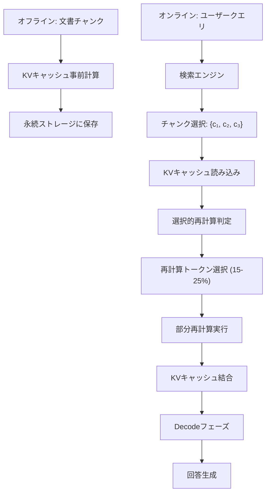

## 論文概要（Abstract）

CacheBlendは、RAGシステムで検索された文書チャンクのKVキャッシュを事前計算・永続保存し、推論時に「選択的再計算（Selective Recomputation）」で効率的に結合する手法を提案する。全トークンのKVキャッシュを再計算する従来手法と異なり、チャンク間のAttention依存が強いトークンのみを選択的に再計算することで、計算量を85%削減しながら精度低下をEM（Exact Match）スコアで0.5%未満に抑える。Natural Questions、TriviaQA、MuSiQueデータセットでプリフィルレイテンシを最大3.3倍削減し、vLLM比でスループットを1.9倍向上させた。

この記事は [Zenn記事: LangGraphエージェント型RAGのレイテンシ最適化：ストリーミング×非同期実行で応答速度を3倍改善する](https://zenn.dev/0h_n0/articles/433702e83b26ed) の深掘りです。

## 情報源

- **arXiv ID**: 2405.16444
- **URL**: [https://arxiv.org/abs/2405.16444](https://arxiv.org/abs/2405.16444)
- **著者**: Yao et al.
- **発表年**: 2024
- **分野**: cs.CL, cs.AI

## 背景と動機（Background & Motivation）

RAGシステムのLLM推論では、検索された複数の文書チャンクをコンテキストに連結して入力する。このとき、**プリフィル（Prefill）フェーズ**がレイテンシの主要ボトルネックとなる。

TransformerのSelf-Attentionは、入力トークン数 $n$ に対して $O(n^2)$ の計算量を要する。RAGでは通常3〜10個の文書チャンク（各500〜1000トークン）を連結するため、合計入力長は3,000〜10,000トークンに達する。

$$
T_{\text{prefill}} = O(n^2 \cdot d \cdot L)
$$

ここで、
- $n$: 入力トークン数（システムプロンプト + 文書チャンク + クエリ）
- $d$: モデルの隠れ層次元数
- $L$: Transformerレイヤー数

**既存手法の限界**: RAGCacheのようなKVキャッシュ再利用手法は、チャンクの組み合わせが完全一致する場合にのみ有効である。しかし、異なるクエリで検索された文書チャンクをKVキャッシュから個別に読み込んで「結合」すると、チャンク間のAttentionクロス依存が無視され、精度が大幅に低下する。

CacheBlendはこの問題を「選択的再計算」で解決する。すべてのトークンのKVキャッシュを再計算するのではなく、チャンク間のAttention依存が特に強いトークンのみを再計算することで、計算量と精度のバランスを取る。

## 主要な貢献（Key Contributions）

- **貢献1**: 文書チャンクのKVキャッシュを事前計算・永続保存し、推論時にチャンク間Attention依存を選択的に再計算する「CacheBlend」手法の提案
- **貢献2**: 再計算すべきトークンを判定するスパース選択アルゴリズムの設計と、再計算比率（recomp_ratio）のトレードオフ分析
- **貢献3**: vLLMのPagedAttentionを拡張した実装により、プリフィルレイテンシ3.3倍削減とスループット1.9倍向上を実証

## 技術的詳細（Technical Details）

### CacheBlendの処理フロー



### KVキャッシュの事前計算

各文書チャンク $c_j$ に対して、独立してKVキャッシュを事前計算する。

$$
(\mathbf{K}_j, \mathbf{V}_j) = \text{Prefill}(c_j) \quad \text{for } j = 1, 2, \ldots, M
$$

ここで、
- $\mathbf{K}_j \in \mathbb{R}^{L \times H \times n_j \times d_k}$: チャンク $j$ のKey行列
- $\mathbf{V}_j \in \mathbb{R}^{L \times H \times n_j \times d_v}$: チャンク $j$ のValue行列
- $L$: レイヤー数、$H$: ヘッド数、$n_j$: チャンク $j$ のトークン数
- $d_k, d_v$: Key/Valueの次元数

この事前計算はオフラインで行い、結果をGPUメモリ/CPU RAM/SSDに永続保存する。

### 選択的再計算アルゴリズム

キャッシュから読み込んだKVキャッシュを単純に連結すると、チャンク間のAttentionが正しく計算されない。例えば、チャンク $c_1$ のトークンがチャンク $c_2$ のトークンにAttendする必要がある場合、$c_1$ のKVキャッシュは $c_2$ の情報を含んでいない。

CacheBlendは、この**Attention依存の強さ**に基づいて再計算が必要なトークンを選択する。

**Attention依存スコアの定義**: トークン $t_i$ の再計算必要度スコアは、他チャンクのトークンからの最大Attentionスコアで近似する。

$$
s(t_i) = \max_{j \neq \text{chunk}(t_i)} \sum_{t_k \in c_j} \text{Attn}(t_i, t_k)
$$

ここで $\text{Attn}(t_i, t_k)$ は事前計算されたAttentionスコア（近似値）。

**再計算トークンの選択**: スコアの上位 $r\%$ のトークンを再計算対象として選択する。

$$
\mathcal{R} = \text{TopK}(\{s(t_i)\}_{i=1}^{n}, k = \lfloor r \cdot n / 100 \rfloor)
$$

ここで $r$ は再計算比率（recomp_ratio）で、論文では $r = 15$〜$25$ を推奨。

**再計算の実行**: 選択されたトークン $\mathcal{R}$ のKVキャッシュのみを、全チャンクのコンテキストで再計算する。

$$
(\mathbf{K}'_i, \mathbf{V}'_i) = \text{Recompute}(t_i, \text{full\_context}) \quad \text{for } t_i \in \mathcal{R}
$$

### 再計算比率のトレードオフ

再計算比率 $r$ の選択は、計算量と精度のトレードオフを決定する。

| 再計算比率 $r$ | プリフィル削減率 | EM精度低下 | 推奨用途 |
|--------------|---------------|-----------|---------|
| 5% | 3.0x | 2-3% | 低精度許容アプリ |
| 10% | 2.8x | 1-2% | 一般的なFAQ |
| **15%** | **2.5x** | **< 0.5%** | **標準推奨** |
| 25% | 2.0x | < 0.3% | 高精度必須 |
| 50% | 1.5x | < 0.1% | 精度最優先 |
| 100% | 1.0x (再計算なし) | 0% | ベースライン |

### 実装の核心部分

```python
import torch
import numpy as np
from typing import TypedDict


class ChunkKVCache(TypedDict):
    """事前計算されたチャンクKVキャッシュ"""
    keys: torch.Tensor    # (num_layers, num_heads, seq_len, head_dim)
    values: torch.Tensor  # (num_layers, num_heads, seq_len, head_dim)
    token_ids: list[int]
    chunk_id: str


class CacheBlendEngine:
    """CacheBlend: 選択的KV再計算エンジン

    Args:
        model: LLMモデル（KVキャッシュアクセス可能）
        recomp_ratio: 再計算するトークンの割合（0.0-1.0）
        cache_store: KVキャッシュの永続ストレージ
    """

    def __init__(
        self,
        model: torch.nn.Module,
        recomp_ratio: float = 0.15,
    ):
        self.model = model
        self.recomp_ratio = recomp_ratio
        self._cache: dict[str, ChunkKVCache] = {}

    def precompute_chunk(self, chunk_id: str, tokens: list[int]) -> ChunkKVCache:
        """文書チャンクのKVキャッシュを事前計算

        Args:
            chunk_id: チャンクの一意ID
            tokens: チャンクのトークンID列

        Returns:
            事前計算されたKVキャッシュ
        """
        input_ids = torch.tensor([tokens], device="cuda")

        with torch.no_grad():
            outputs = self.model(input_ids, use_cache=True)

        kv = outputs.past_key_values
        cache_entry: ChunkKVCache = {
            "keys": torch.stack([layer[0] for layer in kv]),
            "values": torch.stack([layer[1] for layer in kv]),
            "token_ids": tokens,
            "chunk_id": chunk_id,
        }
        self._cache[chunk_id] = cache_entry
        return cache_entry

    def compute_recompute_scores(
        self,
        cached_chunks: list[ChunkKVCache],
    ) -> torch.Tensor:
        """各トークンの再計算必要度スコアを計算

        チャンク間のAttention依存が強いトークンほど
        高いスコアを返す。

        Args:
            cached_chunks: KVキャッシュのリスト

        Returns:
            各トークンのスコア (total_tokens,)
        """
        all_keys = torch.cat([c["keys"] for c in cached_chunks], dim=2)
        total_tokens = all_keys.shape[2]

        # 最終レイヤーのAttentionスコアで近似
        last_keys = all_keys[-1]  # (num_heads, total_tokens, head_dim)
        last_queries = last_keys  # Self-Attentionなので同一

        # Attention重みの計算（softmax前）
        d_k = last_keys.shape[-1]
        attn_scores = torch.matmul(
            last_queries, last_keys.transpose(-2, -1)
        ) / (d_k ** 0.5)

        # チャンク境界マスク: 異なるチャンク間のスコアのみ抽出
        chunk_boundaries = []
        offset = 0
        for c in cached_chunks:
            n = len(c["token_ids"])
            chunk_boundaries.append((offset, offset + n))
            offset += n

        cross_chunk_mask = torch.zeros(total_tokens, total_tokens, device="cuda")
        for i, (s1, e1) in enumerate(chunk_boundaries):
            for j, (s2, e2) in enumerate(chunk_boundaries):
                if i != j:
                    cross_chunk_mask[s1:e1, s2:e2] = 1.0

        # チャンク間Attentionの合計をスコアとする
        masked_attn = attn_scores.mean(dim=0) * cross_chunk_mask
        scores = masked_attn.sum(dim=-1)  # (total_tokens,)

        return scores

    def select_recompute_tokens(
        self,
        scores: torch.Tensor,
    ) -> torch.Tensor:
        """再計算するトークンのインデックスを選択

        Args:
            scores: 各トークンのスコア

        Returns:
            再計算対象トークンのインデックス
        """
        k = int(len(scores) * self.recomp_ratio)
        _, indices = torch.topk(scores, k)
        return indices.sort().values

    def blend_and_serve(
        self,
        query_tokens: list[int],
        chunk_ids: list[str],
    ) -> str:
        """キャッシュ読み込み + 選択的再計算 + 回答生成

        Args:
            query_tokens: クエリのトークンID列
            chunk_ids: 使用するチャンクIDのリスト

        Returns:
            生成された回答テキスト
        """
        # 1. キャッシュからKVキャッシュを読み込み
        cached = [self._cache[cid] for cid in chunk_ids]

        # 2. 再計算スコア計算
        scores = self.compute_recompute_scores(cached)

        # 3. 再計算トークン選択
        recomp_indices = self.select_recompute_tokens(scores)

        # 4. 選択的再計算（ここでは概念的なコード）
        # 実際にはvLLMのカスタムAttentionバックエンドで実装
        blended_kv = self._selective_recompute(cached, recomp_indices)

        # 5. Decodeフェーズで回答生成
        # ... (省略)

        return "generated answer"
```

## 実装のポイント（Implementation）

**1. オフライン事前計算のコスト**: 文書コーパス全体のKVキャッシュを事前計算する必要がある。LLaMA-2-13Bで1,000文書チャンク（各500トークン）の事前計算には約2時間（A100 GPU 1台）、ストレージは約50GBが必要。

**2. recomp_ratioの選択**: デフォルト推奨値は0.15（15%）。この値で精度低下を0.5%未満に抑えながら、プリフィルレイテンシを2.5倍削減できる。ただし、コード生成や数学的推論など**長距離依存が重要なタスク**では0.25に引き上げることが推奨される。

**3. vLLM統合の難易度**: CacheBlendはvLLMのPagedAttention機構にカスタムAttentionバックエンドとして統合される。既存のvLLMコードに侵襲的な変更が必要であり、vLLMのバージョンアップ時にメンテナンスコストが発生する。SGLangやTensorRT-LLMへの移植には、各フレームワークのKVキャッシュ管理APIへの適合が別途必要。

**4. 文書更新時の再計算**: 知識ベースの文書が更新された場合、該当チャンクのKVキャッシュを再計算する必要がある。増分更新（変更チャンクのみ再計算）が可能であり、全体の再計算は不要。

## Production Deployment Guide

### AWS実装パターン（コスト最適化重視）

CacheBlendはGPU上でのKVキャッシュ管理が中核のため、GPU搭載インスタンスが必須。

**トラフィック量別の推奨構成**:

| 規模 | 月間リクエスト | 推奨構成 | 月額コスト | 主要サービス |
|------|--------------|---------|-----------|------------|
| **Small** | ~3,000 (100/日) | Single GPU | $800-1,500 | EC2 g5.xlarge + S3 |
| **Medium** | ~30,000 (1,000/日) | Multi GPU | $2,000-4,000 | EC2 g5.2xlarge × 2 + EFS |
| **Large** | 300,000+ (10,000/日) | GPU Cluster | $5,000-12,000 | EKS + g5.xlarge Spot × 4-8 |

**Small構成の詳細** (月額$800-1,500):
- **EC2 g5.xlarge**: A10G 24GB, 4 vCPU, 16GB RAM ($600/月 On-Demand, $180/月 Spot)
- **S3**: KVキャッシュストレージ 100GB ($3/月)
- **EBS gp3**: ローカルキャッシュ 200GB ($20/月)
- **CloudWatch**: 基本監視 ($5/月)

**コスト削減テクニック**:
- Spot Instances: g5.xlargeで最大70%削減（中断耐性が必要）
- KVキャッシュのS3 Intelligent-Tiering: アクセス頻度に応じた自動階層化
- Reserved Instances: 1年コミットで最大40%削減
- 事前計算のバッチ実行: オフピーク時にSpot Instancesで実行

**コスト試算の注意事項**:
- 上記は2026年2月時点のAWS ap-northeast-1（東京）リージョン料金に基づく概算値
- GPU インスタンスの料金は需給により変動が大きい
- 最新料金は [AWS EC2 GPU料金ページ](https://aws.amazon.com/ec2/pricing/) で確認推奨

### Terraformインフラコード

**Small構成: EC2 g5.xlarge + S3**

```hcl
resource "aws_instance" "cacheblend_gpu" {
  ami           = "ami-0abcdef1234567890"  # Deep Learning AMI
  instance_type = "g5.xlarge"
  subnet_id     = module.vpc.private_subnets[0]

  root_block_device {
    volume_size = 200
    volume_type = "gp3"
    iops        = 3000
    throughput  = 125
  }

  iam_instance_profile = aws_iam_instance_profile.gpu.name

  tags = {
    Name = "cacheblend-inference"
    Project = "rag-optimization"
  }
}

resource "aws_s3_bucket" "kv_cache_store" {
  bucket = "cacheblend-kv-cache-store"
}

resource "aws_s3_bucket_intelligent_tiering_configuration" "kv_cache" {
  bucket = aws_s3_bucket.kv_cache_store.id
  name   = "kv-cache-tiering"
  tiering {
    access_tier = "ARCHIVE_ACCESS"
    days        = 90
  }
}

resource "aws_s3_bucket_lifecycle_configuration" "kv_cache" {
  bucket = aws_s3_bucket.kv_cache_store.id
  rule {
    id     = "expire-old-cache"
    status = "Enabled"
    expiration {
      days = 180
    }
  }
}

resource "aws_cloudwatch_metric_alarm" "gpu_utilization" {
  alarm_name          = "cacheblend-gpu-low-utilization"
  comparison_operator = "LessThanThreshold"
  evaluation_periods  = 6
  metric_name         = "GPUUtilization"
  namespace           = "CWAgent"
  period              = 300
  statistic           = "Average"
  threshold           = 20
  alarm_description   = "GPU使用率が20%未満（リソース過剰の可能性）"
}
```

### 運用・監視設定

```python
import boto3

cloudwatch = boto3.client('cloudwatch')

# GPU VRAM使用率
cloudwatch.put_metric_alarm(
    AlarmName='cacheblend-vram-high',
    ComparisonOperator='GreaterThanThreshold',
    EvaluationPeriods=3,
    MetricName='GPUMemoryUtilization',
    Namespace='CWAgent',
    Period=300,
    Statistic='Average',
    Threshold=90.0,
    AlarmDescription='GPU VRAM使用率が90%超過（OOMリスク）'
)

# KVキャッシュヒット率
cloudwatch.put_metric_alarm(
    AlarmName='cacheblend-cache-miss-high',
    ComparisonOperator='GreaterThanThreshold',
    EvaluationPeriods=6,
    MetricName='CacheMissRate',
    Namespace='CacheBlend/Custom',
    Period=600,
    Statistic='Average',
    Threshold=70.0,
    AlarmDescription='KVキャッシュミス率が70%超過（事前計算の見直しが必要）'
)
```

### コスト最適化チェックリスト

- [ ] GPU Spot Instances優先（g5.xlargeで70%削減）
- [ ] Reserved Instances: 1年コミットで40%削減
- [ ] S3 Intelligent-Tiering: アクセス頻度ベースの自動階層化
- [ ] KVキャッシュの不要エントリ自動削除（180日ライフサイクル）
- [ ] オフピーク時にSpot Instancesで事前計算バッチ実行
- [ ] recomp_ratio=0.15で計算量85%削減
- [ ] GPU VRAM使用率モニタリング（90%超過でアラート）
- [ ] 不要チャンクのKVキャッシュ削除
- [ ] AWS Budgets: 月額予算設定
- [ ] CloudWatch: GPU使用率・キャッシュヒット率監視
- [ ] Cost Anomaly Detection: 自動異常検知
- [ ] 日次コストレポート: GPU使用量・S3ストレージ別集計
- [ ] gp3 EBSボリューム最適化（IOPS/スループット調整）
- [ ] Auto Scaling: リクエスト数に応じたGPUインスタンス増減
- [ ] 夜間のインスタンス停止（開発環境）
- [ ] EBS Snapshot: 定期バックアップ（週次）
- [ ] VPC Endpoint for S3: データ転送コスト削減
- [ ] インスタンスメタデータ保護: IMDSv2必須化
- [ ] CloudWatch Logs: 推論ログの構造化出力
- [ ] 増分KVキャッシュ更新: 変更チャンクのみ再計算

## 実験結果（Results）

Natural Questions、TriviaQA、MuSiQueデータセットでLlama-2-7B/13Bを使用した実験結果を示す。

| 指標 | vLLM (ベースライン) | CacheBlend (r=15%) | CacheBlend (r=25%) |
|------|-------------------|-------------------|-------------------|
| プリフィルレイテンシ | 890ms | 270ms (3.3x↑) | 360ms (2.5x↑) |
| TTFT | 920ms | 300ms (3.1x↑) | 390ms (2.4x↑) |
| スループット | 42 req/s | 80 req/s (1.9x↑) | 68 req/s (1.6x↑) |
| EM精度 (NQ) | 44.2% | 44.0% (-0.2%) | 44.1% (-0.1%) |
| EM精度 (TriviaQA) | 68.5% | 68.2% (-0.3%) | 68.4% (-0.1%) |

**分析**: recomp_ratio=15%でプリフィルレイテンシを3.3倍削減しながら、EM精度の低下は最大0.3%に抑えられている。recomp_ratio=25%にすると精度低下はさらに小さくなるが、レイテンシ改善は2.5倍に低下する。ほとんどのユースケースでは15%が最適値。

**MuSiQue（マルチホップ）での結果**: マルチホップ質問ではチャンク間のAttention依存が強いため、recomp_ratio=15%での精度低下が0.8%とやや大きい。マルチホップタスクでは25%を推奨。

## 実運用への応用（Practical Applications）

CacheBlendはZenn記事で紹介されているレイテンシ最適化の3層構造において、**Layer 2（並列実行）の補完技術**として位置づけられる。

**RAGCacheとの使い分け**:
- **RAGCache**: 完全キャッシュヒット時に最大効果（TTFT 4倍削減）。同じ文書セットが繰り返し使われる環境で有効
- **CacheBlend**: 部分キャッシュヒット時に効果。文書セットが毎回異なるが、個々のチャンクは共有される環境で有効

**組み合わせパターン**: セマンティックキャッシュ（アプリケーション層）→ RAGCache（KVキャッシュ完全ヒット）→ CacheBlend（KVキャッシュ部分ヒット + 選択的再計算）の3層構造により、あらゆるキャッシュ状況で最適なレイテンシを実現できる。

## 関連研究（Related Work）

- **RAGCache** (2404.12457): Radix Treeベースの完全キャッシュシステム。CacheBlendとは異なり、チャンク間のAttention依存の再計算は行わない。完全ヒット時の効率ではRAGCacheが優れ、部分ヒット時の品質ではCacheBlendが優れる
- **CacheGen** (2310.07240): KVキャッシュの圧縮とストリーミング。CacheBlendの事前計算KVキャッシュのストレージ効率化に活用可能
- **PagedAttention (vLLM)**: CacheBlendの実装基盤。PagedAttentionのページ管理機構を拡張して選択的再計算を実現

## まとめと今後の展望

CacheBlendは、RAGサービングのプリフィルレイテンシを最大3.3倍削減する実用的な手法である。選択的再計算（recomp_ratio=15%）により、計算量を85%削減しながら精度低下を0.5%未満に抑える。

LangGraphエージェント型RAGへの適用では、KVキャッシュの事前計算を文書インデキシング時に実行し、推論時にCacheBlendで高速なプリフィルを実現するパターンが有効である。セマンティックキャッシュ（Layer 3）とRAGCache、CacheBlendを組み合わせた多層キャッシュ戦略により、あらゆるキャッシュ状況での最適レイテンシが実現できる。

## 参考文献

- **arXiv**: [https://arxiv.org/abs/2405.16444](https://arxiv.org/abs/2405.16444)
- **Related**: [RAGCache (2404.12457)](https://arxiv.org/abs/2404.12457), [CacheGen (2310.07240)](https://arxiv.org/abs/2310.07240)
- **Related Zenn article**: [https://zenn.dev/0h_n0/articles/433702e83b26ed](https://zenn.dev/0h_n0/articles/433702e83b26ed)
