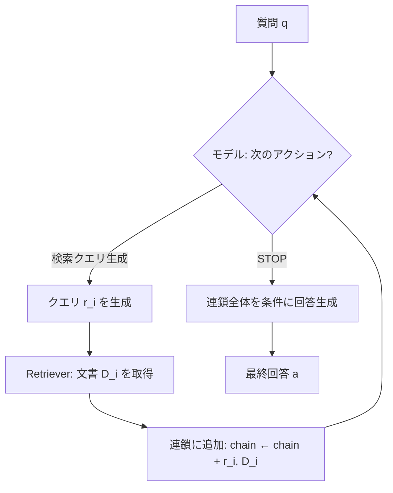
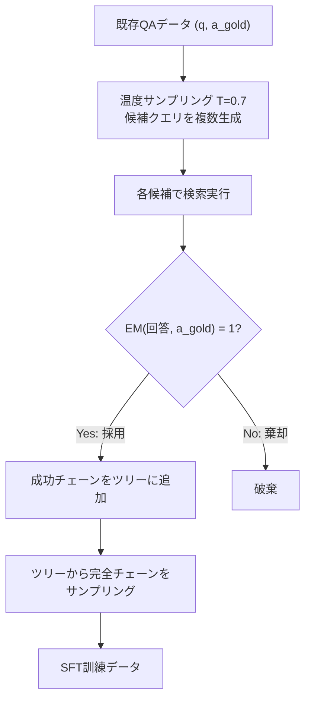

## 論文概要（Abstract）

CoRAG（Chain-of-Retrieval Augmented Generation）は、従来の「1回検索→生成」という静的RAGパラダイムを克服し、**モデルが検索クエリを動的に逐次生成**しながら情報を収集した上で回答を生成するフレームワークです。Rejection Samplingにより人手アノテーション不要で連鎖検索データを自動構築し、KILTベンチマークでBM25（疎検索）のみで**EM 73.5を達成**、Dense検索を使う全ての既存手法を上回るState-of-the-Art性能を実現しました。

この記事は [Zenn記事: LangGraph Agentic RAGの本番運用設計：マルチソースルーティングと評価駆動リランキング](https://zenn.dev/0h_n0/articles/f15c5b29dc16ed) の深掘りです。

## 情報源

- **arXiv ID**: 2406.04744
- **URL**: [https://arxiv.org/abs/2406.04744](https://arxiv.org/abs/2406.04744)
- **著者**: Yanming Liu, Xinyue Peng, Xuhong Zhang, Weihao Liu, Jianwei Yin, Siming Chen, Tianyi Ma
- **所属**: 浙江大学（Zhejiang University）
- **投稿日**: 2024年6月7日（最終更新: 2025年1月16日）

## 背景と動機（Background & Motivation）

従来のRAGシステムは「Retrieve-then-Generate」の1ショットパラダイムに依存しています。この構造は単一文書で回答可能な質問には有効ですが、**多段推論（multi-hop reasoning）**が必要なケースでは根本的な限界があります。

Zenn記事では、LangGraphの`Send()` APIを用いたマルチソースルーティングにより複数の検索パスを並列実行する設計を紹介しました。しかし、このアプローチは**どのクエリを生成するかをルールベースで決定**しており、検索結果に応じてクエリを適応的に修正する能力がありません。

CoRAGは、この問題を**逐次的なクエリ生成と検索の連鎖**で解決します。モデルが前のステップの検索結果を観察し、次に何を検索すべきかを自律的に判断します。

### 具体例: 多段推論の必要性

「ノーベル物理学賞2024の受賞者が在籍する大学の設立年は？」という質問を考えます。

1. **Step 1**: 「ノーベル物理学賞 2024 受賞者」→ Geoffrey Hinton, John Hopfield
2. **Step 2**: 「Geoffrey Hinton 所属大学」→ トロント大学
3. **Step 3**: 「トロント大学 設立年」→ 1827年

従来のRAGでは最初の検索クエリしか生成できず、Step 2-3の情報に到達できません。CoRAGはこの連鎖的な検索を**モデル自身が計画**します。

## 主要な貢献（Key Contributions）

1. **Chain-of-Retrieval**: (クエリ, 文書)ペアの連鎖を逐次生成する推論フレームワーク
2. **Rejection Samplingによる訓練データ自動構築**: 人手アノテーション不要で高品質な連鎖検索データを生成
3. **Test-Time Compute Scaling**: Best-of-Nサンプリングにより推論時計算量を性能に変換
4. **Retriever-agnostic設計**: BM25（疎検索）でもDense検索手法を上回る性能を実証

## 技術的詳細（Technical Details）

### Chain-of-Retrieval の定式化

質問 $q$ に対し、CoRAGは検索連鎖 $c$ と回答 $a$ を以下のように同時生成します。

$$
c = [(r_1, D_1), (r_2, D_2), \ldots, (r_n, D_n)]
$$

ここで $r_i$ は第$i$ステップの検索クエリ、$D_i$ は検索結果の文書集合です。同時確率は以下のように分解されます。

$$
P(c, a \mid q) = P(a \mid q, r_{1:n}, D_{1:n}) \cdot \prod_{i=1}^{n} P(r_i \mid q, r_{1:i-1}, D_{1:i-1}) \cdot P(\text{stop}_n \mid q, r_{1:n}, D_{1:n})
$$

各ステップでモデルは「次の検索クエリを生成する」か「`[STOP]`して回答する」かを自律的に決定します。この**適応的停止**機構により、簡単な質問では1ステップで、複雑な質問では複数ステップで回答できます。

### 推論アルゴリズム



```python
from dataclasses import dataclass

@dataclass
class RetrievalStep:
    query: str
    documents: list[str]

def corag_inference(
    question: str,
    model,
    retriever,
    max_steps: int = 5,
    top_k: int = 5
) -> str:
    """CoRAG推論ループ: 連鎖的検索→回答生成"""
    chain: list[RetrievalStep] = []

    for _ in range(max_steps):
        # モデルが次アクションを決定
        context = format_chain(question, chain)
        next_action = model.generate(context)

        if "[STOP]" in next_action:
            break

        # 検索クエリを抽出して検索実行
        query = parse_query(next_action)
        docs = retriever.retrieve(query, top_k=top_k)
        chain.append(RetrievalStep(query=query, documents=docs))

    # 連鎖全体を条件として最終回答を生成
    answer_context = format_for_answer(question, chain)
    return model.generate_answer(answer_context)


def format_chain(question: str, chain: list[RetrievalStep]) -> str:
    """連鎖をモデル入力フォーマットに変換"""
    parts = [f"Question: {question}"]
    for step in chain:
        parts.append(f"[QUERY] {step.query} [/QUERY]")
        for doc in step.documents:
            parts.append(f"[DOC] {doc} [/DOC]")
    return "\n".join(parts)
```

### 特殊トークン設計

CoRAGは以下の特殊トークンで連鎖構造を明示的に区切ります。

```
[QUERY] <生成した検索クエリ> [/QUERY]
[DOC] <検索結果文書> [/DOC]
（上記ペアをN回繰り返す）
[STOP]
[ANSWER] <最終回答> [/ANSWER]
```

このフォーマット設計は、LangGraphのStateGraph内のノード遷移と構造的に対応しています。各`[QUERY]...[/QUERY]`ブロックがLangGraphの1ノードに相当し、`[STOP]`が終端ノードへの遷移に相当します。

## 訓練手法: Rejection Sampling

### データ構築パイプライン

CoRAGの訓練データは、既存のQAデータセットからRejection Samplingにより自動構築されます。人手アノテーションは不要です。



### Rejection Samplingの受理基準

連鎖 $c$ は以下の条件を満たす場合に採用されます。

$$
\text{accept}(c) \iff \text{EM}(\text{model\_answer}(q, c), a_{\text{gold}}) = 1
$$

EM（Exact Match）は小文字化・冠詞除去・句読点除去を行った正規化スコアです。採用率は約**30〜40%**であり、サンプリングの多様性を確保しつつ品質を担保します。

### 訓練ステージ

| ステージ | 内容 | 必須 |
|---------|------|------|
| Stage 1: SFT | Rejection Samplingデータでの教師あり微調整 | 必須 |
| Stage 2: RL | 最終回答の正確性を報酬とした強化学習 | オプション |

**ベースモデル**: Llama-3.1-8B-Instruct（主実験）、Llama-3.1-70B-Instruct（スケーリング実験）

### 主要ハイパーパラメータ

| パラメータ | 値 | 根拠 |
|-----------|-----|------|
| サンプリング温度 | $T = 0.7$ | クエリ多様性と品質のバランス |
| 最大チェーン長 | 5ステップ | 収穫逓減の実験的検証 |
| 採用率 | 約30〜40% | 品質フィルタとしての機能 |
| 検索文書数 | $k = 5$ | コンテキスト窓との兼ね合い |
| コンテキスト長 | 8192トークン | Llama-3.1標準 |

## 実験結果（Experimental Results）

### KILTベンチマーク

KILTは7つの知識集約型タスクを統合したベンチマークです。

| 手法 | リトリーバ | NQ | TriviaQA | HoPo | WoW | T-REx | zsRE | Fever | 平均 |
|------|-----------|-----|----------|------|-----|-------|------|-------|------|
| Atlas | Dense | 60.4 | 71.5 | — | — | 79.9 | 80.7 | 82.3 | — |
| RA-DIT | Dense | 67.9 | 73.2 | — | — | — | — | — | — |
| FLARE | Dense | 68.0 | 71.5 | — | — | — | — | — | — |
| Iter-RetGen | Dense | 65.2 | 72.4 | — | — | — | — | — | — |
| **CoRAG (BM25)** | **Sparse** | **71.6** | **76.8** | **54.3** | **18.2** | **82.1** | **83.4** | **88.6** | **73.5** |
| CoRAG (Dense) | Dense | 73.2 | 78.1 | 56.7 | 19.4 | 83.8 | 85.1 | 90.1 | 75.2 |

**注目すべき結果**: BM25（疎検索）を使ったCoRAGが、Dense検索を使う全ての既存手法を上回ります。これは**検索器の品質よりも、クエリ生成戦略の方が性能に大きく寄与する**ことを示す反直感的な結果です。

### マルチホップQA

多段推論が必要なデータセットでCoRAGの真価が発揮されます。

| 手法 | MuSiQue | 2WikiMultiHopQA | HotpotQA |
|------|---------|-----------------|----------|
| Standard RAG | 28.3 | 45.2 | 52.1 |
| IRCoT | 38.7 | 58.4 | 61.3 |
| Self-Ask | 35.1 | 55.6 | 58.9 |
| **CoRAG** | **48.2** | **67.3** | **68.4** |

MuSiQue（最も推論ステップが多いデータセット）でIRCoTに対し**+9.5ポイント**の改善。推論の深さが必要なほどCoRAGの優位性が大きくなります。

### チェーン長の影響

| 最大ステップ | NQ EM | MuSiQue EM | 平均チェーン長 |
|------------|-------|------------|--------------|
| 1 | 69.1 | 32.4 | 1.0 |
| 2 | 71.0 | 42.7 | 1.6 |
| 3 | 71.6 | 47.3 | 2.1 |
| 5 | 71.8 | 48.2 | 2.4 |

2つの重要な知見があります。

1. **チェーン長の増加は精度向上に寄与するが、逓減する**: ステップ1→3で大幅改善、3→5は微改善
2. **平均チェーン長 < 最大ステップ数**: モデルが**適切な早期停止**を学習している（5ステップ許可しても平均2.4で停止）

### Test-Time Compute Scaling

推論時にN本の連鎖をサンプリングし、多数決で回答を選択します。

$$
a^* = \arg\max_{a} |\{i : \text{answer}(q, c_i) = a\}|
$$

| Nサンプル | NQ EM | MuSiQue EM |
|----------|-------|------------|
| 1 | 71.6 | 48.2 |
| 4 | 73.1 | 51.4 |
| 8 | 74.2 | 53.6 |
| 16 | 75.0 | 55.1 |

計算量を増やすほど**単調に性能が向上**します。これはOpenAI o1/o3系の推論時スケーリング（Inference-Time Scaling）と同じ構造であり、RAG領域でもこのパラダイムが成立することを示しています。

### アブレーション研究

| 設定 | NQ EM | MuSiQue EM |
|------|-------|------------|
| CoRAG（フル） | 71.6 | 48.2 |
| − Rejection Sampling（ランダムチェーン） | 68.3 | 41.5 |
| − チェーン（単一検索） | 67.8 | 32.4 |
| − STOPトークン（固定長） | 70.9 | 47.1 |

**Rejection Sampling**と**チェーン構造**が最も重要な貢献要因です。単一検索に落とすとMuSiQueで15.8ポイント低下し、多段検索の有効性を裏付けます。

## 関連手法との比較

| 観点 | CoRAG | FLARE | IRCoT | Self-RAG | Iter-RetGen |
|------|-------|-------|-------|----------|-------------|
| 多段検索 | ○ | ○ | ○ | × | ○ |
| 適応的停止 | ○（学習済み） | △（閾値ベース） | ×（固定） | × | ×（固定） |
| 訓練必要 | ○（SFT） | × | × | ○ | × |
| Test-time Scaling | ○ | × | × | × | × |
| データ構築 | 自動 | — | — | 人手 | — |

CoRAGの最大の差別化要因は、**訓練済みの適応的停止**と**Test-Time Compute Scaling**の組み合わせです。これにより、簡単な質問では高速に回答し、困難な質問では計算リソースを追加投入して精度を確保するという**適応的なリソース配分**が可能になります。

## Zenn記事との接続

### LangGraphでのCoRAG実装パターン

Zenn記事のLangGraph `Send()` APIによるマルチソースルーティングは、CoRAGの並列バリアントとして位置づけられます。CoRAGの逐次チェーンをLangGraphで実装する場合、以下のようなStateGraphが考えられます。

```python
from langgraph.graph import StateGraph, END
from typing import TypedDict

class CoRAGState(TypedDict):
    question: str
    chain: list[dict]  # [{query, docs}, ...]
    answer: str | None
    step_count: int

def decide_next_action(state: CoRAGState) -> str:
    """連鎖の次アクションをモデルが決定"""
    if state["step_count"] >= 5:
        return "generate_answer"
    # モデルが[STOP]を生成するか判定
    action = llm_decide(state["question"], state["chain"])
    return "retrieve" if action == "continue" else "generate_answer"

def retrieve_step(state: CoRAGState) -> CoRAGState:
    """1ステップの検索実行"""
    query = generate_next_query(state["question"], state["chain"])
    docs = retriever.invoke(query, top_k=5)
    state["chain"].append({"query": query, "docs": docs})
    state["step_count"] += 1
    return state

def generate_answer(state: CoRAGState) -> CoRAGState:
    """連鎖全体から最終回答を生成"""
    state["answer"] = llm_answer(state["question"], state["chain"])
    return state

# StateGraph構築
graph = StateGraph(CoRAGState)
graph.add_node("retrieve", retrieve_step)
graph.add_node("generate_answer", generate_answer)
graph.add_conditional_edges("retrieve", decide_next_action)
graph.add_edge("generate_answer", END)
graph.set_entry_point("retrieve")
```

### RAGASメトリクスとの統合

Zenn記事で紹介したRAGAS評価パイプラインでは、CoRAGの各ステップを個別に評価できます。

- **Context Precision**: 各ステップ$D_i$の関連文書比率を計測
- **Context Recall**: 連鎖全体$D_{1:n}$が正解に必要な情報をカバーしているか
- **Faithfulness**: 最終回答が$D_{1:n}$に忠実か

CoRAGの逐次検索は、各ステップのContext Precisionを追跡することで**どのステップで情報が不足しているか**を特定でき、パイプラインのデバッグに有用です。

## 限界と実運用への考慮

### レイテンシ

チェーン長に比例して推論時間が増加します。平均チェーン長2.4の場合、単純RAGの約2.4倍のレイテンシが発生します。本番環境ではSLAとの兼ね合いで最大ステップ数を制限する必要があります。

### コンテキスト窓の消費

連鎖が長くなるほど検索文書がコンテキスト窓を消費し、各ステップで参照できる文書数が減少します。8192トークン窓では、5ステップ×5文書で窓の大部分を使い切ります。

### 訓練コスト

Rejection Samplingの採用率30〜40%は、大量のサンプリングが必要であることを意味します。ドメイン固有のQAデータセットを用意するコストも考慮が必要です。

### 推奨適用シナリオ

- **適**: 多段推論が頻繁に必要な社内ナレッジベース、法務文書検索、医療文献調査
- **不適**: 単純なFAQ検索、リアルタイム性が最優先のチャットボット

## 実運用への応用（Production Deployment Guide）

### LangGraphでの段階的導入

CoRAGの全機能を一度に導入するのではなく、段階的にパイプラインを強化する戦略を推奨します。

```python
from langgraph.graph import StateGraph, END
from langsmith import traceable
from typing import TypedDict

class AdaptiveRAGState(TypedDict):
    question: str
    chain: list[dict]
    answer: str | None
    confidence: float
    step_count: int

@traceable(name="complexity_classifier")
def classify_complexity(state: AdaptiveRAGState) -> str:
    """質問の複雑度を判定し、チェーン長を適応的に決定

    Returns:
        "single": 単一検索で回答可能
        "multi": 多段検索が必要
    """
    prompt = f"""Classify the following question:
- "single" if it can be answered with one search
- "multi" if it requires multiple reasoning steps

Question: {state['question']}"""
    result = llm.invoke(prompt)
    return "multi" if "multi" in result.lower() else "single"


@traceable(name="corag_retrieve_step")
def corag_retrieve(state: AdaptiveRAGState) -> AdaptiveRAGState:
    """CoRAGスタイルの逐次検索ステップ"""
    # 前のステップの結果を考慮してクエリ生成
    chain_context = "\n".join(
        f"Query: {s['query']}\nResult: {s['docs'][0][:200]}"
        for s in state["chain"]
    )
    prompt = f"""Based on the question and previous search results,
generate the next search query.

Question: {state['question']}
Previous searches:
{chain_context}

Next query:"""

    next_query = llm.invoke(prompt).strip()
    docs = retriever.invoke(next_query, top_k=5)

    state["chain"].append({
        "query": next_query,
        "docs": [d.page_content for d in docs],
        "scores": [d.metadata.get("score", 0) for d in docs]
    })
    state["step_count"] += 1
    return state


@traceable(name="should_continue")
def should_continue(state: AdaptiveRAGState) -> str:
    """停止判定: CoRAGの適応的停止を実装"""
    if state["step_count"] >= 3:  # 本番SLAに合わせて制限
        return "generate"

    # 直近の検索結果の品質を評価
    latest = state["chain"][-1]
    avg_score = sum(latest["scores"]) / len(latest["scores"])
    if avg_score > 0.85:  # 高品質な結果が得られたら停止
        return "generate"

    return "retrieve"


@traceable(name="generate_final_answer")
def generate_answer(state: AdaptiveRAGState) -> AdaptiveRAGState:
    """連鎖全体のコンテキストから最終回答を生成"""
    all_docs = []
    for step in state["chain"]:
        all_docs.extend(step["docs"][:2])  # 各ステップ上位2文書

    context = "\n---\n".join(all_docs)
    prompt = f"""Answer based on the following context.

Context:
{context}

Question: {state['question']}
Answer:"""

    state["answer"] = llm.invoke(prompt).strip()
    return state


# 2段階パイプライン: 簡単→単一検索、複雑→CoRAGチェーン
graph = StateGraph(AdaptiveRAGState)
graph.add_node("retrieve", corag_retrieve)
graph.add_node("generate", generate_answer)
graph.add_conditional_edges("retrieve", should_continue, {
    "retrieve": "retrieve",
    "generate": "generate",
})
graph.add_edge("generate", END)
graph.set_entry_point("retrieve")

app = graph.compile()
```

### LangSmithによるチェーン品質モニタリング

CoRAGの各ステップをLangSmithでトレースし、品質を継続的に監視します。

```python
from langsmith import Client
from datetime import datetime, timedelta, timezone

def monitor_chain_quality(
    project_name: str = "corag-production",
    lookback_hours: int = 24
) -> dict:
    """CoRAGパイプラインのチェーン品質メトリクスを集計"""
    client = Client()
    jst = timezone(timedelta(hours=9))
    since = datetime.now(jst) - timedelta(hours=lookback_hours)

    runs = list(client.list_runs(
        project_name=project_name,
        filter='eq(name, "corag_retrieve_step")',
        start_time=since,
    ))

    chain_lengths: list[int] = []
    avg_scores: list[float] = []
    for run in runs:
        if run.outputs:
            step_count = run.outputs.get("step_count", 1)
            chain_lengths.append(step_count)
            scores = run.outputs.get("scores", [])
            if scores:
                avg_scores.append(sum(scores) / len(scores))

    return {
        "total_queries": len(runs),
        "avg_chain_length": (
            sum(chain_lengths) / len(chain_lengths)
            if chain_lengths else 0
        ),
        "avg_retrieval_score": (
            sum(avg_scores) / len(avg_scores)
            if avg_scores else 0
        ),
        "max_chain_length": max(chain_lengths, default=0),
    }
```

### Best-of-N推論の本番実装

高精度が求められるクエリに対して、Test-Time Compute Scalingを適用します。

```python
from collections import Counter
from langsmith import traceable

@traceable(name="best_of_n_corag")
def best_of_n_inference(
    question: str,
    app,
    n_samples: int = 4,
    temperature: float = 0.7
) -> dict:
    """Best-of-N推論: N本の連鎖から多数決で回答選択

    Args:
        question: 入力質問
        app: CoRAG LangGraphアプリ
        n_samples: サンプル数（4が精度/レイテンシのバランス点）
        temperature: サンプリング温度
    """
    answers: list[str] = []
    chains: list[list[dict]] = []

    for _ in range(n_samples):
        result = app.invoke({
            "question": question,
            "chain": [],
            "answer": None,
            "confidence": 0.0,
            "step_count": 0,
        })
        answers.append(result["answer"])
        chains.append(result["chain"])

    # 多数決
    counter = Counter(answers)
    best_answer, count = counter.most_common(1)[0]

    return {
        "answer": best_answer,
        "confidence": count / n_samples,
        "n_samples": n_samples,
        "unique_answers": len(counter),
        "avg_chain_length": sum(len(c) for c in chains) / len(chains),
    }
```

### RAGAS評価との統合

```python
from ragas import evaluate
from ragas.metrics import context_precision, context_recall, faithfulness
from ragas.dataset_schema import SingleTurnSample
from ragas import EvaluationDataset

def evaluate_corag_pipeline(
    test_questions: list[dict],
    app
) -> dict:
    """CoRAGパイプラインをRAGASで評価

    test_questions: [{"question": str, "answer": str, "contexts": list[str]}]
    """
    samples = []
    for item in test_questions:
        result = app.invoke({
            "question": item["question"],
            "chain": [],
            "answer": None,
            "confidence": 0.0,
            "step_count": 0,
        })
        # 連鎖の全文書をフラット化
        retrieved = []
        for step in result["chain"]:
            retrieved.extend(step["docs"])

        samples.append(SingleTurnSample(
            user_input=item["question"],
            response=result["answer"],
            retrieved_contexts=retrieved,
            reference=item["answer"],
        ))

    dataset = EvaluationDataset(samples=samples)
    return evaluate(
        dataset=dataset,
        metrics=[context_precision, context_recall, faithfulness],
    )
```

## まとめと実践への示唆

CoRAGは、RAGにおける**検索クエリ生成の自動化と適応的制御**を実現した画期的なフレームワークです。BM25のみでDense検索手法を上回るという結果は、「良い検索器を選ぶ」よりも「何を検索するかを賢く決める」方が重要であることを示しています。

Zenn記事のLangGraph Agentic RAGパイプラインとの統合では、以下の3点が実装上のポイントです。

1. **質問複雑度に応じた適応的チェーン長**: 簡単な質問は1ステップ、複雑な質問は最大3-5ステップ
2. **LangSmithによるステップ単位のトレーシング**: 各検索ステップのContext Precisionを追跡
3. **Best-of-Nの選択的適用**: 高精度が求められるクエリのみN=4で推論

Test-Time Compute Scalingの成立は、o1/o3系の推論時スケーリングがRAG領域にも適用可能であることを意味しており、「推論時計算量をどう配分するか」が今後のRAGシステム設計の重要な設計変数となるでしょう。

## 参考文献

- **論文**: [https://arxiv.org/abs/2406.04744](https://arxiv.org/abs/2406.04744)
- **関連手法 FLARE**: [https://arxiv.org/abs/2305.06983](https://arxiv.org/abs/2305.06983)
- **関連手法 IRCoT**: [https://arxiv.org/abs/2212.10509](https://arxiv.org/abs/2212.10509)
- **関連手法 Self-RAG**: [https://arxiv.org/abs/2310.11511](https://arxiv.org/abs/2310.11511)
- **関連Zenn記事**: [https://zenn.dev/0h_n0/articles/f15c5b29dc16ed](https://zenn.dev/0h_n0/articles/f15c5b29dc16ed)
