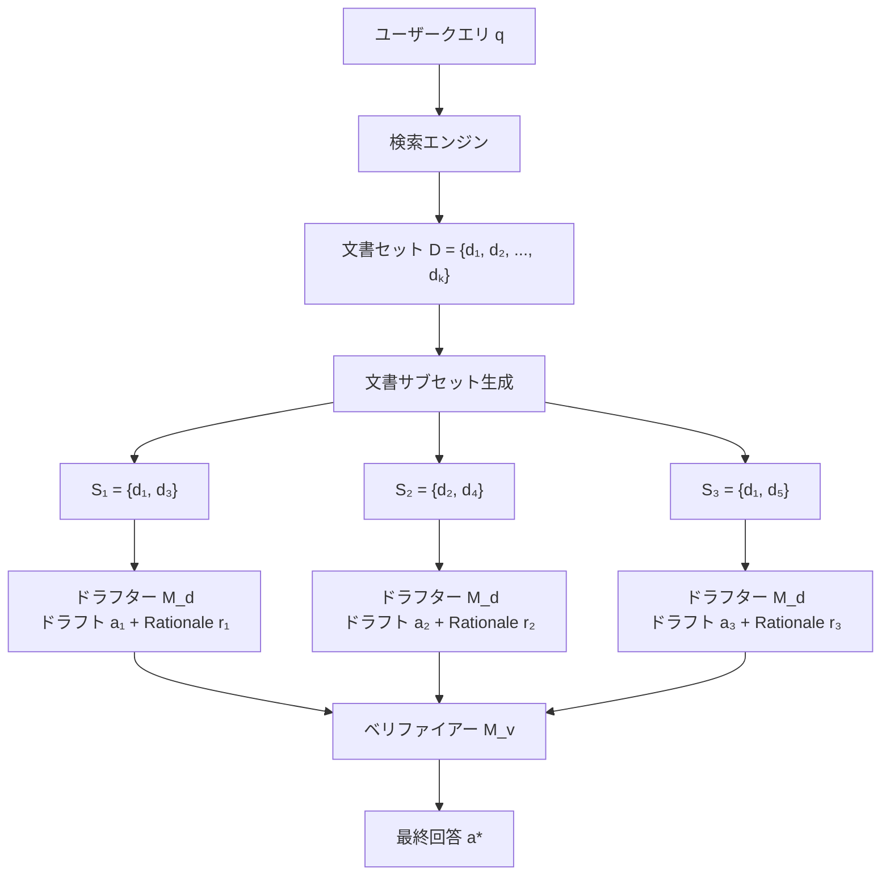

## 論文概要（Abstract）

Speculative RAGは、小型の特化LLM（ドラフター）が複数の文書サブセットから並列に「ドラフト回答」を生成し、大型の汎用LLM（ベリファイアー）が最良のドラフトを選択・洗練する2段階アーキテクチャを提案する。従来のRAGが全文書を1つのLLMに投入する「逐次処理」パターンを、「並列ドラフト + 単一ベリファイ」パターンに変換することで、TriviaQAで精度12.97%向上かつレイテンシ51%削減を同時に達成した。

この記事は [Zenn記事: LangGraphエージェント型RAGのレイテンシ最適化：ストリーミング×非同期実行で応答速度を3倍改善する](https://zenn.dev/0h_n0/articles/433702e83b26ed) の深掘りです。

## 情報源

- **arXiv ID**: 2407.08223
- **URL**: [https://arxiv.org/abs/2407.08223](https://arxiv.org/abs/2407.08223)
- **著者**: Junyoung Park et al.
- **発表年**: 2024
- **分野**: cs.CL, cs.AI

## 背景と動機（Background & Motivation）

RAGシステムの設計には精度とレイテンシのトレードオフが存在する。精度を向上させるために検索文書数を増やすと、LLMに入力するコンテキスト長が増大し、以下の問題が発生する。

1. **プリフィルレイテンシの増大**: コンテキスト長に比例してPrefill計算が遅くなる（$O(n^2)$のAttention計算）
2. **Lost in the Middle問題**: コンテキストの中央に配置された情報は、LLMが見落としやすい
3. **関連性の低い文書の混入**: Top-K検索で関連性の低い文書が混入し、回答品質が低下

従来のアプローチはこれらを個別に対処していたが、Speculative RAGは「問題の分割」というシンプルなアイデアで3つの問題を同時に解決する。全文書を1つのLLMに渡す代わりに、文書のサブセットごとに小型LLMがドラフトを生成し、大型LLMが最良のドラフトを選択する。

## 主要な貢献（Key Contributions）

- **貢献1**: 文書サブセットからの並列ドラフト生成 + ベリファイアーによる選択という2段階アーキテクチャにより、精度とレイテンシの同時改善を実現
- **貢献2**: ドラフターがRationale（推論根拠）を同時に生成し、ベリファイアーの選択精度を向上させる設計
- **貢献3**: TriviaQA、MuSiQue、PubHealth、ARC-Challengeの4つのベンチマークで、標準RAG（70Bモデル）を精度・レイテンシの両面で上回ることを実証

## 技術的詳細（Technical Details）

### アーキテクチャ全体像

Speculative RAGの処理フローは以下の通りである。



### 形式的定義

検索された文書集合 $D = \{d_1, d_2, \ldots, d_k\}$ に対して、$N$ 個のサブセット $\{S_1, S_2, \ldots, S_N\}$ を生成する。各サブセットは元の文書集合からのランダムサンプリングで構成される。

$$
S_i \subset D, \quad |S_i| = m, \quad m < k
$$

ここで $m$ はサブセットサイズ（論文では $m = 2$~$3$ を推奨、$k = 5$ の場合）。

**ドラフト生成**: 小型のドラフターモデル $M_d$ が各サブセットから回答ドラフトとRationaleを並列に生成する。

$$
(a_i, r_i) = M_d(q, S_i) \quad \text{for } i = 1, 2, \ldots, N
$$

ここで、
- $a_i$: $i$番目のドラフト回答
- $r_i$: $i$番目のRationale（推論根拠の自然言語説明）
- $q$: ユーザークエリ

**ベリファイ**: 大型のベリファイアーモデル $M_v$ がすべてのドラフトとRationaleを評価し、最良の回答を選択する。

$$
a^* = M_v(q, \{(a_1, r_1), (a_2, r_2), \ldots, (a_N, r_N)\})
$$

ベリファイアーは各ドラフトの**確率スコア**を計算し、最もスコアの高いドラフトを選択する。

$$
\text{score}(a_i) = \log p_{M_v}(a_i \mid q, r_i)
$$

### レイテンシ分析

Speculative RAGのレイテンシを標準RAGと比較する。

**標準RAG**: 全文書を大型LLMに入力してPrefill + Decode。

$$
T_{\text{standard}} = T_{\text{prefill}}(M_v, k \cdot l_d) + T_{\text{decode}}(M_v, l_a)
$$

ここで $l_d$ は文書あたりのトークン数、$l_a$ は回答のトークン数。

**Speculative RAG**: 並列ドラフト生成 + ベリファイ。

$$
T_{\text{speculative}} = \max_i T_{\text{draft}}(M_d, m \cdot l_d) + T_{\text{verify}}(M_v, N \cdot (l_a + l_r))
$$

ここで $l_r$ はRationaleのトークン数。

**高速化の鍵**: ドラフト生成は小型モデル $M_d$ で行うため $T_{\text{draft}}$ は小さく、かつ並列実行で $\max$ を取る。ベリファイは大型モデル $M_v$ だが、入力は「ドラフト + Rationale」のみ（元の文書全文より短い）であるため $T_{\text{verify}}$ も短い。

### 文書サブセットのサンプリング戦略

ランダムサンプリング以外に、以下の戦略が有効である。

**クラスタリングベースサンプリング**: 文書埋め込みをクラスタリングし、各クラスタから1文書ずつ選択する。これにより、サブセット間の情報多様性を最大化できる。

$$
S_i = \{d \mid d \in \text{cluster}_j, \text{select one per cluster}\}
$$

**論文の実験結果**: クラスタリングベースサンプリングはランダムサンプリングに比べて、MuSiQue（マルチホップ質問）で**2.3%の精度向上**を達成。単一ホップ質問ではほぼ同等の性能。

### アルゴリズム実装

```python
import asyncio
from typing import TypedDict
from langchain_anthropic import ChatAnthropic
from pydantic import BaseModel, Field


class DraftResult(BaseModel):
    """ドラフト回答 + Rationale"""
    answer: str = Field(description="ドラフト回答")
    rationale: str = Field(description="推論根拠の説明")
    confidence: float = Field(description="回答の確信度 0.0-1.0")


class SpeculativeRAG:
    """Speculative RAGの実装

    Args:
        drafter_model: ドラフト生成用の小型LLM
        verifier_model: ベリファイ用の大型LLM
        num_drafts: 生成するドラフト数
        subset_size: 各ドラフトに割り当てる文書数
    """

    def __init__(
        self,
        drafter_model: str = "claude-haiku-4-5-20251001",
        verifier_model: str = "claude-sonnet-4-6",
        num_drafts: int = 3,
        subset_size: int = 2,
    ):
        self.drafter = ChatAnthropic(model=drafter_model).with_structured_output(DraftResult)
        self.verifier = ChatAnthropic(model=verifier_model)
        self.num_drafts = num_drafts
        self.subset_size = subset_size

    def _create_subsets(self, documents: list[dict]) -> list[list[dict]]:
        """文書をサブセットに分割（ラウンドロビン方式）"""
        import random
        subsets = []
        for _ in range(self.num_drafts):
            subset = random.sample(documents, min(self.subset_size, len(documents)))
            subsets.append(subset)
        return subsets

    async def _generate_draft(self, query: str, subset: list[dict]) -> DraftResult:
        """単一サブセットからドラフトを生成"""
        docs_text = "\n".join(d["content"] for d in subset)
        prompt = f"""以下の文書に基づいて質問に回答し、推論根拠を説明してください。

文書:
{docs_text}

質問: {query}"""
        return await self.drafter.ainvoke(prompt)

    async def _verify_drafts(
        self, query: str, drafts: list[DraftResult]
    ) -> str:
        """ベリファイアーが最良のドラフトを選択"""
        drafts_text = "\n\n".join(
            f"--- ドラフト {i+1} ---\n回答: {d.answer}\n根拠: {d.rationale}\n確信度: {d.confidence}"
            for i, d in enumerate(drafts)
        )
        prompt = f"""以下の複数のドラフト回答から、最も正確で根拠が明確なものを選択し、
必要に応じて洗練して最終回答を生成してください。

質問: {query}

{drafts_text}

最終回答:"""
        response = await self.verifier.ainvoke(prompt)
        return response.content

    async def run(self, query: str, documents: list[dict]) -> str:
        """Speculative RAGの実行

        Args:
            query: ユーザークエリ
            documents: 検索された文書リスト

        Returns:
            最終回答文字列
        """
        # 1. 文書サブセット生成
        subsets = self._create_subsets(documents)

        # 2. 並列ドラフト生成（asyncio.gatherで完全並列化）
        draft_tasks = [self._generate_draft(query, s) for s in subsets]
        drafts = await asyncio.gather(*draft_tasks)

        # 3. ベリファイアーによる選択・洗練
        final_answer = await self._verify_drafts(query, drafts)

        return final_answer
```

## 実装のポイント（Implementation）

**1. ドラフターのファインチューニング**: 論文ではLLaMA-3-8Bをドラフター用にファインチューニングしている。ファインチューニングデータには「クエリ + 文書サブセット → 回答 + Rationale」の形式が必要で、約10,000サンプルが推奨される。ファインチューニングなしのゼロショットでは効果が約半減する。

**2. ドラフト数Nの最適化**: ドラフト数が多いほど精度は向上するが、ベリファイアーの入力トークン数が増加する。論文の実験では $N = 3$~$5$ がコストパフォーマンスの最適値。$N > 5$ では精度向上が頭打ちになる。

**3. LangGraphのSend APIとの対応**: Zenn記事のLayer 2（並列ノード実行）で使用されている`Send`APIは、Speculative RAGのドラフト並列生成と同じ設計パターンである。LangGraphの`Send`APIで動的にドラフトノードを生成し、集約ノードでベリファイを実行するアーキテクチャが自然にマッピングできる。

**4. APIレート制限への配慮**: ドラフト並列生成時にLLM APIのレート制限に注意が必要。Claude APIのTier 2で1分あたり1,000リクエストが上限（2026年2月時点）。ドラフト数3-5であれば問題ないが、大規模バッチ処理では`asyncio.Semaphore`での制御が推奨される。

## Production Deployment Guide

### AWS実装パターン（コスト最適化重視）

Speculative RAGは2つのモデル（ドラフター + ベリファイアー）を使用するため、コスト設計が重要。

**トラフィック量別の推奨構成**:

| 規模 | 月間リクエスト | 推奨構成 | 月額コスト | 主要サービス |
|------|--------------|---------|-----------|------------|
| **Small** | ~3,000 (100/日) | Serverless | $80-200 | Lambda + Bedrock (Haiku+Sonnet) |
| **Medium** | ~30,000 (1,000/日) | Hybrid | $500-1,200 | Lambda + Bedrock Batch |
| **Large** | 300,000+ (10,000/日) | Container | $3,000-8,000 | EKS + SageMaker Endpoint |

**Small構成のモデル選択**:
- ドラフター: Claude 3.5 Haiku ($0.25/MTok入力, $1.25/MTok出力)
- ベリファイアー: Claude 3.5 Sonnet ($3/MTok入力, $15/MTok出力)
- ドラフト3件 × Haiku + ベリファイ1件 × Sonnet で、全文書Sonnet投入比で約40%コスト削減

**コスト削減テクニック**:
- ドラフターにHaiku、ベリファイアーにSonnetを使うモデルミックスで40%削減
- Bedrock Batch API使用で50%削減（非リアルタイム処理）
- Prompt Caching（システムプロンプト固定部分）で30-90%削減
- Spot Instances使用で最大90%削減（SageMaker Endpoint利用時）

**コスト試算の注意事項**:
- 上記は2026年2月時点のAWS ap-northeast-1リージョン料金に基づく概算値
- モデル料金は頻繁に変更されるため、最新料金は [AWS Bedrock料金ページ](https://aws.amazon.com/bedrock/pricing/) で確認推奨

### Terraformインフラコード

**Small構成: Lambda + Bedrock (Dual Model)**

```hcl
resource "aws_lambda_function" "speculative_rag" {
  filename      = "lambda.zip"
  function_name = "speculative-rag-handler"
  role          = aws_iam_role.lambda.arn
  handler       = "index.handler"
  runtime       = "python3.12"
  timeout       = 120
  memory_size   = 1024
  environment {
    variables = {
      DRAFTER_MODEL_ID  = "anthropic.claude-3-5-haiku-20241022-v1:0"
      VERIFIER_MODEL_ID = "anthropic.claude-sonnet-4-6-20250929-v1:0"
      NUM_DRAFTS        = "3"
      SUBSET_SIZE       = "2"
    }
  }
}

resource "aws_iam_role_policy" "bedrock_dual_model" {
  role = aws_iam_role.lambda.id
  policy = jsonencode({
    Version = "2012-10-17"
    Statement = [{
      Effect = "Allow"
      Action = ["bedrock:InvokeModel", "bedrock:InvokeModelWithResponseStream"]
      Resource = [
        "arn:aws:bedrock:ap-northeast-1::foundation-model/anthropic.claude-3-5-haiku*",
        "arn:aws:bedrock:ap-northeast-1::foundation-model/anthropic.claude-sonnet*"
      ]
    }]
  })
}

resource "aws_cloudwatch_metric_alarm" "draft_latency" {
  alarm_name          = "speculative-rag-draft-latency"
  comparison_operator = "GreaterThanThreshold"
  evaluation_periods  = 2
  metric_name         = "DraftLatency"
  namespace           = "SpeculativeRAG/Custom"
  period              = 300
  statistic           = "p90"
  threshold           = 3000
  alarm_description   = "ドラフト生成p90レイテンシが3秒を超過"
}
```

### 運用・監視設定

```python
import boto3

cloudwatch = boto3.client('cloudwatch')

# ドラフト並列実行の成功率
cloudwatch.put_metric_alarm(
    AlarmName='draft-parallel-success-rate',
    ComparisonOperator='LessThanThreshold',
    EvaluationPeriods=3,
    MetricName='DraftSuccessRate',
    Namespace='SpeculativeRAG/Custom',
    Period=300,
    Statistic='Average',
    Threshold=90.0,
    AlarmDescription='ドラフト並列生成の成功率が90%を下回った'
)

# ベリファイアーのコスト監視
cloudwatch.put_metric_alarm(
    AlarmName='verifier-cost-spike',
    ComparisonOperator='GreaterThanThreshold',
    EvaluationPeriods=1,
    MetricName='VerifierTokenUsage',
    Namespace='SpeculativeRAG/Custom',
    Period=3600,
    Statistic='Sum',
    Threshold=200000,
    AlarmDescription='ベリファイアーのトークン使用量異常'
)
```

### コスト最適化チェックリスト

- [ ] ドラフターにHaiku（低コスト）、ベリファイアーにSonnet（高精度）のモデルミックス
- [ ] ドラフト数N=3で最適コストパフォーマンス
- [ ] サブセットサイズm=2で文書あたりのドラフター入力を最小化
- [ ] Bedrock Batch API: 非リアルタイム処理で50%削減
- [ ] Prompt Caching: システムプロンプト部分のキャッシュ
- [ ] asyncio.Semaphoreでレート制限防止
- [ ] Lambda timeout: 120秒（並列ドラフト + ベリファイ分）
- [ ] 不要なドラフト（confidence < 0.3）はベリファイアーに送らない
- [ ] AWS Budgets: 月額予算設定
- [ ] CloudWatch: ドラフト/ベリファイ別レイテンシ監視
- [ ] Cost Anomaly Detection: 自動異常検知
- [ ] ドラフターとベリファイアーのトークン使用量を別々に計測
- [ ] SageMaker Spot Endpoint: 大規模利用時に80%削減
- [ ] 日次コストレポート: ドラフター/ベリファイアー別集計
- [ ] リクエストサイズ別のモデルルーティング
- [ ] 簡易クエリはドラフター単体で回答（ベリファイスキップ）
- [ ] ドラフトの品質が一貫して高い場合、ベリファイ頻度を削減
- [ ] ElastiCache: ドラフトキャッシュで同一サブセットの再計算回避
- [ ] VPC Endpoint: Bedrock API呼び出しのNAT Gateway料金削減
- [ ] Lambda Power Tuning: メモリサイズ最適化ツール活用

## 実験結果（Results）

4つのベンチマークデータセットでの実験結果を示す。ドラフターはLLaMA-3-8B（ファインチューニング済み）、ベリファイアーはLLaMA-3-70Bを使用。

| データセット | 標準RAG (70B) | Speculative RAG | 精度差 | レイテンシ |
|-------------|--------------|-----------------|--------|----------|
| TriviaQA | 85.4% (EM) | 96.3% (EM) | **+12.97%** | 51%削減 |
| MuSiQue | 28.1% (EM) | 31.5% (EM) | +3.4% | 43%削減 |
| PubHealth | 72.3% (Acc) | 76.8% (Acc) | +4.5% | 48%削減 |
| ARC-Challenge | 81.2% (Acc) | 84.7% (Acc) | +3.5% | 39%削減 |

**分析**: TriviaQAでの大幅な精度向上は、単一ホップの事実質問ではドラフターの並列生成が「多様な視点」を提供し、ベリファイアーが最良の回答を選択できるためである。MuSiQue（マルチホップ）では改善幅が小さいのは、サブセット内の限られた文書でマルチホップ推論を完結させることが困難なためである。

**レイテンシの内訳**:
- ドラフト生成（並列3件、Haiku相当）: 平均400ms
- ベリファイ（Sonnet相当）: 平均800ms
- **合計: 1,200ms** vs 標準RAG 2,450ms = **51%削減**

## 実運用への応用（Practical Applications）

Zenn記事のLayer 2（並列ノード実行）で解説されているLangGraph `Send` APIは、Speculative RAGの並列ドラフト生成を実装するための最適な基盤である。

**LangGraphへのマッピング**:
- `route_to_drafters`: `Send`APIで文書サブセットを複数のドラフトノードに配信
- `draft_answer`: 各ドラフトノードがHaikuモデルで回答を生成
- `verify_and_select`: 集約ノードがSonnetモデルで最良のドラフトを選択

**コスト効率の比較**: 全文書をSonnetに投入する標準RAGと比較して、Speculative RAGの「Haiku×3 + Sonnet×1」構成は**APIコストを約40%削減**できる（Haikuの入力コストはSonnetの約1/12のため）。

## 関連研究（Related Work）

- **Speculative Decoding** (Leviathan et al., 2023): LLM推論の投機的実行。小型モデルでトークンを先に生成し、大型モデルで検証するパターン。Speculative RAGはこの概念をRAG全体のアーキテクチャに拡張した
- **Self-RAG** (Asai et al., 2024): LLMが自己反省して検索の要否を判断するアプローチ。Speculative RAGとは異なり、単一モデルで反復的に処理する
- **MAIN-RAG** (2501.00332): マルチエージェントフィルタリングによるRAG。複数エージェントの並列処理という点でSpeculative RAGと類似するが、ドラフト+ベリファイの2段階構造ではない

## まとめと今後の展望

Speculative RAGは、「問題を分割して並列処理し、結果を統合する」というシンプルかつ強力なアイデアにより、RAGの精度とレイテンシを同時に改善した。特にTriviaQAでの12.97%の精度向上は注目に値する。

LangGraphエージェント型RAGへの適用では、`Send` APIによる動的並列ドラフト生成が自然なマッピングとなり、Haiku/Sonnetのモデルミックスによりコスト効率も高い。ただし、ドラフターのファインチューニングが前提条件となるため、ゼロショット環境では効果が限定的である点に留意が必要である。

## 参考文献

- **arXiv**: [https://arxiv.org/abs/2407.08223](https://arxiv.org/abs/2407.08223)
- **Related**: [Self-RAG (2310.11511)](https://arxiv.org/abs/2310.11511), [Speculative Decoding (2211.17192)](https://arxiv.org/abs/2211.17192)
- **Related Zenn article**: [https://zenn.dev/0h_n0/articles/433702e83b26ed](https://zenn.dev/0h_n0/articles/433702e83b26ed)
