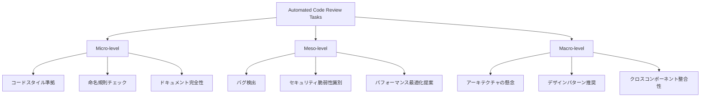

本記事は [https://arxiv.org/abs/2409.04927](https://arxiv.org/abs/2409.04927) の解説記事です。

## 論文概要（Abstract）

LLM-based Automated Code Review（ACR）は、コードレビューの自動化をLLMで実現しようとする研究分野である。本論文は、14のLLMモデルを8つのコードレビューデータセットで体系的に評価し、zero-shotおよびone-shotの2シナリオで性能を比較した実証研究である。著者らはACRタスクをMicro / Meso / Macroの3階層に分類する分類法（Taxonomy）を提案し、各階層でLLMの得意・不得意が明確に異なることを報告している。

この記事は [Zenn記事: Claude Sonnet 4.6の1Mコンテキストで大規模コードレビューエージェントを構築する](https://zenn.dev/0h_n0/articles/a41a3cb117cc46) の深掘りです。

## 情報源

- **arXiv ID**: 2409.04927
- **URL**: [https://arxiv.org/abs/2409.04927](https://arxiv.org/abs/2409.04927)
- **発表年**: 2024（2024年9月8日公開）
- **分野**: cs.SE, cs.AI

## 背景と動機（Background & Motivation）

コードレビューはソフトウェア品質保証の要だが、レビュアーの負担が大きく、多くのプロジェクトでボトルネックとなっている。静的解析ツール（ESLint、Pylint等）はルールベースのチェックには有効だが、設計レベルの問題やアーキテクチャの整合性といった高次の判断には対応できない。

LLMの台頭により、自然言語でのレビューコメント生成が技術的に可能になった。しかし、2024年時点でLLMベースのACRには以下の課題が残されていた。

- ACRタスクの定義が研究ごとに異なり、統一的な比較が困難
- 評価データセットが学術用途に偏り、産業界のコードレビュー実態と乖離
- 評価指標としてBLEUが広く使われているが、コードレビューの品質を適切に測定できるか疑問

著者らはこれらの課題に対し、ACRタスクの体系的な分類法と、大規模かつ多面的な評価フレームワークを構築することで、LLMベースACRの現状を正確に把握することを目指した。

## 主要な貢献（Key Contributions）

- **貢献1**: ACRタスクをMicro / Meso / Macroの3階層に体系化する分類法（Taxonomy）を提案。コードスタイルからアーキテクチャ設計まで、レビューの粒度を明確に定義した
- **貢献2**: 14モデル（クローズドソース5、オープンソース9）を8データセットでzero-shot / one-shotの2条件で評価。合計224のモデル-データセット-プロンプト組み合わせを網羅する大規模な実証評価を実施した
- **貢献3**: 評価指標としてBLEUの限界を実証し、CodeBLEUおよびBERTScoreの使用を推奨。産業データセットでの性能低下パターンを定量的に示した

## 技術的詳細（Technical Details）

### ACRタスクの3階層分類法（Taxonomy）

著者らが提案するACRタスクのTaxonomyは、コードレビューの粒度に応じてMicro / Meso / Macroの3階層に分類する。



**Micro-level**は、コードの表面的な品質に関するタスクである。コーディング規約への準拠、変数名・関数名の命名規則、docstringやコメントの完全性を検証する。既存の静的解析ツール（ESLint、Pylint、Black等）で大部分が自動化可能な領域であり、LLMの優位性は限定的である。

**Meso-level**は、コードの機能的な正しさと非機能要件に関するタスクである。バグの検出、セキュリティ脆弱性の識別（SQLインジェクション、XSS等）、パフォーマンスの最適化提案が含まれる。静的解析では検出困難なロジックエラーや、コンテキスト依存の脆弱性をLLMが補完できる可能性がある。

**Macro-level**は、コードベース全体の設計・アーキテクチャに関するタスクである。モジュール間の責務分離、デザインパターンの適用推奨、クロスコンポーネントの整合性チェックが対象となる。人間のシニアエンジニアが行う設計レビューに相当し、広い文脈理解が求められる。

この3階層分類の意義は、各階層で最適なツール選択が異なる点にある。Micro-levelは静的解析ツール、Meso-levelはLLMと静的解析の組み合わせ、Macro-levelはLLMの長文コンテキスト理解が有効であると著者らは主張している。

### 評価対象モデル

著者らが評価した14モデルは、クローズドソース5モデルとオープンソース9モデルで構成される。

**クローズドソース**:
- GPT-4（OpenAI）
- GPT-3.5-Turbo（OpenAI）
- Claude-2（Anthropic）
- Claude-instant（Anthropic）
- PaLM-2（Google）

**オープンソース**:
- Llama-2（7B / 13B / 70B）（Meta）
- CodeLlama（7B / 13B / 34B）（Meta）
- WizardCoder-33B（Microsoft）
- StarCoder-15B（BigCode）

モデルのパラメータサイズは7Bから非公開（GPT-4）まで幅広く、コード特化のファインチューニングの有無も評価軸に含めている。

### 8データセット

評価に使用された8データセットは、学術データセットと産業データセットに大別される。

| データセット | 種別 | タスク | サンプル数 |
|-------------|------|--------|-----------|
| CodeReview | 学術 | レビューコメント生成 | 大規模 |
| D-ACT | 学術 | コード変更分類 | 中規模 |
| ReviewSP-FC | 学術 | レビューの有用性予測 | 中規模 |
| CommentScore | 学術 | レビューコメント品質評価 | 中規模 |
| TL-CodeSum | 学術 | コード要約 | 大規模 |
| APPS-Review | 学術 | コード品質評価 | 大規模 |
| Gerrit-Reviews | 産業 | 実環境レビュー | 大規模 |
| GitHub-Comments | 産業 | 実環境レビュー | 大規模 |

産業データセット（Gerrit-Reviews、GitHub-Comments）は実際の開発環境から収集されたデータであり、学術データセットと比較してノイズが多く、タスクの定義も曖昧になりやすい。

### 評価指標の検討

著者らは以下の評価指標を検討し、各指標の適切性を分析している。

**BLEU（Bilingual Evaluation Understudy）**

$$
\text{BLEU} = \text{BP} \cdot \exp\left(\sum_{n=1}^{N} w_n \log p_n\right)
$$

ここで、$\text{BP}$はBrevity Penalty（短すぎる出力へのペナルティ）、$p_n$は$n$-gramの精度、$w_n$は重み（通常$1/N$）である。BLEUはもともと機械翻訳の評価指標であり、コードレビューのように意味的等価性が重要なタスクでは表面的な$n$-gram一致に依存するため不適切であると著者らは指摘している。

**CodeBLEU**

$$
\text{CodeBLEU} = \alpha \cdot \text{BLEU} + \beta \cdot \text{BLEU}_w + \gamma \cdot \text{Match}_{\text{AST}} + \delta \cdot \text{Match}_{\text{DF}}
$$

ここで、$\text{BLEU}_w$は重み付きBLEU、$\text{Match}_{\text{AST}}$は抽象構文木（AST）の一致率、$\text{Match}_{\text{DF}}$はデータフロー一致率である。$\alpha, \beta, \gamma, \delta$はそれぞれの重み係数であり、合計が1になるように設定される。CodeBLEUはコードの構造的な類似性を考慮できるため、BLEUより適切であると報告されている。

**BERTScore**

$$
\text{BERTScore} = F_1(\mathbf{R}, \mathbf{C}) = \frac{2 \cdot P \cdot R}{P + R}
$$

ここで、$P$はPrecision（参照文のBERT埋め込みと候補文の埋め込みの最大コサイン類似度の平均）、$R$はRecall（逆方向の計算）である。BERTScoreは意味的な類似性を埋め込み空間で評価するため、表現が異なるが意味的に等価なレビューコメントを正しく評価できる。

### プロンプト設計（Zero-shot / One-shot）

著者らは各モデルに対して2つのプロンプティング戦略を評価している。

**Zero-shot**: タスク説明とコード差分のみを入力する。

```
あなたはコードレビュアーです。以下のコード変更をレビューし、
改善点をコメントしてください。

[コード差分]
```

**One-shot**: タスク説明、1つの高品質なレビュー例、およびコード差分を入力する。

```
あなたはコードレビュアーです。以下はレビューの例です。

[例: コード差分とレビューコメントのペア]

上記の例を参考に、以下のコード変更をレビューしてください。

[コード差分]
```

著者らは、例の選択方法が性能に大きく影響することを発見している。タスク種別（Micro/Meso/Macro）に合致した例を選択した場合に最も高い性能向上が得られ、ランダムに選択した例では改善幅が小さくなると報告されている。

### アルゴリズム：ACR評価パイプライン

論文で提示されている評価パイプラインを以下の擬似コードで示す。

```python
from dataclasses import dataclass
from enum import Enum

class ReviewLevel(Enum):
    """ACRタスクの3階層分類"""
    MICRO = "micro"    # コードスタイル、命名規則
    MESO = "meso"      # バグ検出、セキュリティ
    MACRO = "macro"    # アーキテクチャ、設計

@dataclass
class ReviewTask:
    """評価タスクの構造"""
    code_diff: str
    reference_comment: str
    level: ReviewLevel
    dataset: str

@dataclass
class EvaluationResult:
    """評価結果"""
    model: str
    dataset: str
    level: ReviewLevel
    prompt_type: str  # "zero-shot" | "one-shot"
    bleu: float
    code_bleu: float
    bert_score: float

def evaluate_acr_pipeline(
    models: list[str],
    datasets: list[str],
    tasks: list[ReviewTask],
    prompt_types: list[str],
) -> list[EvaluationResult]:
    """ACR評価パイプライン

    Args:
        models: 評価対象モデル名リスト（14モデル）
        datasets: データセット名リスト（8データセット）
        tasks: 評価タスクリスト
        prompt_types: プロンプト種別（zero-shot, one-shot）

    Returns:
        全組み合わせの評価結果リスト
    """
    results: list[EvaluationResult] = []

    for model in models:
        for dataset in datasets:
            dataset_tasks = [t for t in tasks if t.dataset == dataset]
            for prompt_type in prompt_types:
                # 各タスクに対してモデル推論を実行
                generated_comments = []
                for task in dataset_tasks:
                    prompt = build_prompt(task, prompt_type)
                    comment = call_model(model, prompt)
                    generated_comments.append(comment)

                # 3種類の指標で評価
                references = [t.reference_comment for t in dataset_tasks]
                bleu = compute_bleu(generated_comments, references)
                code_bleu = compute_code_bleu(generated_comments, references)
                bert_score = compute_bert_score(generated_comments, references)

                # 階層別にも集計
                for level in ReviewLevel:
                    level_tasks = [
                        (g, t.reference_comment)
                        for g, t in zip(generated_comments, dataset_tasks)
                        if t.level == level
                    ]
                    if level_tasks:
                        results.append(EvaluationResult(
                            model=model,
                            dataset=dataset,
                            level=level,
                            prompt_type=prompt_type,
                            bleu=compute_bleu(
                                [g for g, _ in level_tasks],
                                [r for _, r in level_tasks],
                            ),
                            code_bleu=compute_code_bleu(
                                [g for g, _ in level_tasks],
                                [r for _, r in level_tasks],
                            ),
                            bert_score=compute_bert_score(
                                [g for g, _ in level_tasks],
                                [r for _, r in level_tasks],
                            ),
                        ))
    return results
```

## 実装のポイント（Implementation）

本論文の知見をACRシステムとして実装する際の要点を整理する。

**階層別のモデル・ツール選択が必須**: 1つのLLMで全階層をカバーするのではなく、Micro-levelは静的解析ツール、Meso-levelはLLMと静的解析の併用、Macro-levelはLLMの長文コンテキスト理解というハイブリッド構成が論文の知見に基づく最適解である。

**One-shot例の品質管理**: One-shotプロンプティングでは、例の選択がモデル性能を大きく左右する。タスク種別ごとに高品質なレビュー例をキュレーションし、例のリポジトリを構築することが推奨される。ランダム選択ではzero-shotと差が出ないケースも報告されている。

**評価指標の選定**: BLEUをACRの評価に使うべきではない。CodeBLEUはコード構造を考慮し、BERTScoreは意味的類似性を捕捉するため、両指標の併用が推奨される。CI/CDパイプラインに評価指標を組み込む場合は、BERTScoreの計算コスト（BERTモデルの推論が必要）を考慮する。

**産業データでの性能低下への対策**: 学術データセットで高スコアを出すモデルでも、産業データセット（Gerrit、GitHub）では性能が低下する。ドメイン固有の用語やコーディング規約をプロンプトに含めること、社内レビュー履歴を用いたfew-shot例の構築が有効な対策となる。

## Production Deployment Guide

本論文のACR手法をAWS上でプロダクション環境として構築するための実装ガイドを示す。

### AWS実装パターン（コスト最適化重視）

ACRシステムは「PRがオープンされたタイミングでレビューを実行し、結果をGitHubコメントとして投稿する」というイベント駆動のワークロードである。トラフィック量はPR作成頻度に依存するため、以下の3パターンを推奨する。

**コスト試算は2026年2月時点のAWS ap-northeast-1（東京）リージョン料金に基づく概算値である。実際のコストはトラフィックパターン、リージョン、バースト使用量により変動する。最新料金はAWS料金計算ツールで確認を推奨する。**

| 構成 | トラフィック | 月額コスト目安 | 主要サービス |
|------|------------|--------------|-------------|
| Small（Serverless） | ~100 PR/日 | $80-200 | Lambda + Bedrock + DynamoDB |
| Medium（Hybrid） | ~1,000 PR/日 | $400-900 | ECS Fargate + Bedrock + ElastiCache |
| Large（Container） | 10,000+ PR/日 | $2,500-5,500 | EKS + Karpenter + Spot Instances |

**Small構成（~100 PR/日）**: GitHub Webhookを API Gateway + Lambda で受信し、コード差分を取得。Amazon Bedrock（Claude 3.5 Sonnet）でレビューコメントを生成し、GitHub APIでPRにコメント投稿する。DynamoDBでレビュー履歴を保存する。Lambda関数のメモリは512MB、タイムアウトは300秒に設定する。月額内訳はBedrock $50-120（トークン使用量依存）、Lambda $5-15、DynamoDB $5-10、API Gateway $5程度である。

**Medium構成（~1,000 PR/日）**: ECS Fargate上のワーカーがSQSキューからPRイベントを取得し、並列処理する。ElastiCacheでプロンプトキャッシュ（レビュー例のベクトル検索結果）を保持し、Bedrock呼び出しを効率化する。vCPU 0.5、メモリ1GBのタスクを最大10並列で実行する。

**Large構成（10,000+ PR/日）**: EKS上でKarpenterによる自動スケーリングを行い、Spot Instancesを優先的に使用する。バッチ処理でBedrock Batch APIを活用し、トークンコストを50%削減する。

**コスト削減テクニック**:
- Spot Instances活用: EKS/ECSのワーカーノードをSpotに切り替えることで最大90%削減
- Reserved Instances: 1年コミットで最大72%削減（Large構成のベースライン処理用）
- Bedrock Batch API: 非リアルタイムのバッチレビュー（夜間一括処理等）で50%削減
- Prompt Caching: 同一リポジトリへの繰り返しレビューでキャッシュヒットにより入力コストを30-90%削減

### Terraformインフラコード

**Small構成（Serverless）: Lambda + Bedrock + DynamoDB**

```hcl
# main.tf - ACR Small構成（Serverless）
terraform {
  required_version = ">= 1.9"
  required_providers {
    aws = {
      source  = "hashicorp/aws"
      version = "~> 5.80"
    }
  }
}

provider "aws" {
  region = "ap-northeast-1"
}

# --- IAMロール（最小権限） ---
resource "aws_iam_role" "acr_lambda" {
  name = "acr-lambda-role"
  assume_role_policy = jsonencode({
    Version = "2012-10-17"
    Statement = [{
      Action = "sts:AssumeRole"
      Effect = "Allow"
      Principal = { Service = "lambda.amazonaws.com" }
    }]
  })
}

resource "aws_iam_role_policy" "acr_lambda_policy" {
  name = "acr-lambda-policy"
  role = aws_iam_role.acr_lambda.id
  policy = jsonencode({
    Version = "2012-10-17"
    Statement = [
      {
        Effect = "Allow"
        Action = [
          "bedrock:InvokeModel",
          "bedrock:InvokeModelWithResponseStream"
        ]
        Resource = "arn:aws:bedrock:ap-northeast-1::foundation-model/anthropic.claude-3-5-sonnet*"
      },
      {
        Effect = "Allow"
        Action = [
          "dynamodb:PutItem",
          "dynamodb:GetItem",
          "dynamodb:Query"
        ]
        Resource = aws_dynamodb_table.acr_reviews.arn
      },
      {
        Effect = "Allow"
        Action = [
          "logs:CreateLogGroup",
          "logs:CreateLogStream",
          "logs:PutLogEvents"
        ]
        Resource = "arn:aws:logs:*:*:*"
      },
      {
        # Secrets ManagerからGitHubトークンを取得
        Effect = "Allow"
        Action = ["secretsmanager:GetSecretValue"]
        Resource = aws_secretsmanager_secret.github_token.arn
      }
    ]
  })
}

# --- Secrets Manager（GitHubトークン） ---
resource "aws_secretsmanager_secret" "github_token" {
  name                    = "acr/github-token"
  recovery_window_in_days = 7
}

# --- DynamoDB（レビュー履歴、On-Demand + KMS暗号化） ---
resource "aws_dynamodb_table" "acr_reviews" {
  name         = "acr-reviews"
  billing_mode = "PAY_PER_REQUEST"  # On-Demand: コスト最適化
  hash_key     = "pr_id"
  range_key    = "reviewed_at"

  attribute {
    name = "pr_id"
    type = "S"
  }
  attribute {
    name = "reviewed_at"
    type = "S"
  }

  server_side_encryption {
    enabled = true  # KMS暗号化
  }

  point_in_time_recovery {
    enabled = true
  }
}

# --- Lambda関数 ---
resource "aws_lambda_function" "acr_reviewer" {
  function_name = "acr-reviewer"
  role          = aws_iam_role.acr_lambda.arn
  handler       = "handler.lambda_handler"
  runtime       = "python3.12"
  timeout       = 300   # Bedrock呼び出しに十分な時間
  memory_size   = 512   # 512MB
  filename      = "lambda.zip"

  environment {
    variables = {
      DYNAMODB_TABLE    = aws_dynamodb_table.acr_reviews.name
      GITHUB_SECRET_ARN = aws_secretsmanager_secret.github_token.arn
      BEDROCK_MODEL_ID  = "anthropic.claude-3-5-sonnet-20241022-v2:0"
      REVIEW_LEVEL      = "macro"  # Macro-levelレビューに特化
    }
  }

  tracing_config {
    mode = "Active"  # X-Rayトレーシング有効化
  }
}

# --- API Gateway（Webhook受信） ---
resource "aws_apigatewayv2_api" "acr_webhook" {
  name          = "acr-webhook"
  protocol_type = "HTTP"
}

# --- CloudWatchアラーム（コスト監視） ---
resource "aws_cloudwatch_metric_alarm" "lambda_duration" {
  alarm_name          = "acr-lambda-duration-high"
  comparison_operator = "GreaterThanThreshold"
  evaluation_periods  = 3
  metric_name         = "Duration"
  namespace           = "AWS/Lambda"
  period              = 300
  statistic           = "Average"
  threshold           = 240000  # 240秒（タイムアウト300秒の80%）
  alarm_description   = "Lambda実行時間がタイムアウトに接近"
  dimensions = {
    FunctionName = aws_lambda_function.acr_reviewer.function_name
  }
}
```

**Large構成（Container）: EKS + Karpenter + Spot Instances**

```hcl
# eks.tf - ACR Large構成（Container）
module "eks" {
  source  = "terraform-aws-modules/eks/aws"
  version = "~> 20.31"

  cluster_name    = "acr-cluster"
  cluster_version = "1.31"

  vpc_id     = module.vpc.vpc_id
  subnet_ids = module.vpc.private_subnets

  # パブリックアクセス最小化
  cluster_endpoint_public_access  = true
  cluster_endpoint_private_access = true

  # EKS Managed Node Group（Karpenterコントローラ用）
  eks_managed_node_groups = {
    system = {
      instance_types = ["m7i.large"]
      min_size       = 2
      max_size       = 3
      desired_size   = 2
    }
  }
}

# --- Karpenter Provisioner（Spot優先） ---
resource "kubectl_manifest" "karpenter_nodepool" {
  yaml_body = yamlencode({
    apiVersion = "karpenter.sh/v1"
    kind       = "NodePool"
    metadata   = { name = "acr-workers" }
    spec = {
      template = {
        spec = {
          requirements = [
            { key = "karpenter.sh/capacity-type", operator = "In", values = ["spot", "on-demand"] },
            { key = "node.kubernetes.io/instance-type", operator = "In",
              values = ["m7i.xlarge", "m6i.xlarge", "m5.xlarge", "c7i.xlarge"] },
          ]
          nodeClassRef = { name = "default" }
        }
      }
      limits   = { cpu = "100", memory = "400Gi" }
      disruption = {
        consolidationPolicy = "WhenEmptyOrUnderutilized"
        consolidateAfter    = "30s"
      }
    }
  })
}

# --- AWS Budgets（予算アラート） ---
resource "aws_budgets_budget" "acr_monthly" {
  name         = "acr-monthly-budget"
  budget_type  = "COST"
  limit_amount = "5000"
  limit_unit   = "USD"
  time_unit    = "MONTHLY"

  notification {
    comparison_operator       = "GREATER_THAN"
    threshold                 = 80
    threshold_type            = "PERCENTAGE"
    notification_type         = "ACTUAL"
    subscriber_email_addresses = ["alerts@example.com"]
  }
}
```

### 運用・監視設定

**CloudWatch Logs Insights クエリ（コスト異常検知）**

```
# 1時間あたりのBedrockトークン使用量を集計
fields @timestamp, @message
| filter @message like /bedrock_tokens/
| stats sum(input_tokens) as total_input, sum(output_tokens) as total_output by bin(1h)
| sort @timestamp desc
| limit 24
```

**CloudWatch Logs Insights クエリ（レイテンシ分析）**

```
# レビュー実行時間のP95/P99分析
fields @timestamp, duration_ms
| filter event = "review_completed"
| stats percentile(duration_ms, 95) as p95,
        percentile(duration_ms, 99) as p99,
        avg(duration_ms) as avg_ms
  by bin(1h)
| sort @timestamp desc
```

**CloudWatchアラーム設定（Python）**

```python
import boto3

cloudwatch = boto3.client("cloudwatch", region_name="ap-northeast-1")

def create_token_spike_alarm() -> None:
    """Bedrockトークン使用量のスパイク検知アラームを作成"""
    cloudwatch.put_metric_alarm(
        AlarmName="acr-bedrock-token-spike",
        MetricName="InputTokenCount",
        Namespace="ACR/Bedrock",
        Statistic="Sum",
        Period=3600,        # 1時間単位
        EvaluationPeriods=1,
        Threshold=500000,   # 1時間あたり50万トークン超過で発火
        ComparisonOperator="GreaterThanThreshold",
        AlarmActions=["arn:aws:sns:ap-northeast-1:123456789:acr-alerts"],
    )
```

**X-Rayトレーシング設定（Python）**

```python
from aws_xray_sdk.core import xray_recorder, patch_all

# boto3を含む全ライブラリの自動計装
patch_all()

@xray_recorder.capture("review_pr")
def review_pr(pr_id: str, repo: str) -> dict:
    """PRレビューをX-Rayトレース付きで実行"""
    subsegment = xray_recorder.current_subsegment()
    subsegment.put_annotation("pr_id", pr_id)
    subsegment.put_annotation("repo", repo)

    # Bedrockの呼び出し（自動計装でトレースされる）
    result = call_bedrock_review(pr_id, repo)

    subsegment.put_metadata("token_usage", {
        "input_tokens": result["input_tokens"],
        "output_tokens": result["output_tokens"],
    })
    return result
```

**Cost Explorer自動レポート（Python）**

```python
import boto3
from datetime import datetime, timedelta

ce = boto3.client("ce", region_name="us-east-1")
sns = boto3.client("sns", region_name="ap-northeast-1")

def daily_cost_report() -> None:
    """日次コストレポートを取得し、閾値超過時にSNS通知"""
    today = datetime.utcnow().strftime("%Y-%m-%d")
    yesterday = (datetime.utcnow() - timedelta(days=1)).strftime("%Y-%m-%d")

    response = ce.get_cost_and_usage(
        TimePeriod={"Start": yesterday, "End": today},
        Granularity="DAILY",
        Metrics=["UnblendedCost"],
        Filter={
            "Tags": {
                "Key": "Project",
                "Values": ["acr-system"],
            }
        },
        GroupBy=[{"Type": "DIMENSION", "Key": "SERVICE"}],
    )

    total_cost = sum(
        float(g["Metrics"]["UnblendedCost"]["Amount"])
        for g in response["ResultsByTime"][0]["Groups"]
    )

    if total_cost > 100:  # $100/日超過でアラート
        sns.publish(
            TopicArn="arn:aws:sns:ap-northeast-1:123456789:acr-cost-alert",
            Subject=f"ACR Daily Cost Alert: ${total_cost:.2f}",
            Message=f"ACRシステムの日次コストが${total_cost:.2f}に達しました。",
        )
```

### コスト最適化チェックリスト

**アーキテクチャ選択**:
- [ ] トラフィック量（PR/日）に応じた構成を選択（Serverless / Hybrid / Container）
- [ ] イベント駆動（PR作成時）か定期バッチかを明確にする
- [ ] レビュー階層（Micro/Meso/Macro）ごとに処理パスを分離する

**リソース最適化**:
- [ ] EC2/EKS: Spot Instancesを優先し、On-Demandフォールバックを設定
- [ ] Reserved Instances: ベースライン負荷分は1年コミットで72%削減
- [ ] Savings Plans: EC2/Fargateの混合ワークロードにはCompute Savings Plansを検討
- [ ] Lambda: メモリサイズを512MB-1024MBで最適値を測定（Power Tuning）
- [ ] ECS/EKS: 夜間・週末のスケールダウン（最小レプリカ0-1）

**LLMコスト削減**:
- [ ] Bedrock Batch APIで非リアルタイム処理を50%コスト削減
- [ ] Prompt Caching有効化で同一リポジトリのレビュー入力コストを90%削減
- [ ] モデル選択ロジック: Micro-levelは軽量モデル（Haiku）、Macro-levelは高性能モデル（Sonnet）
- [ ] トークン数制限: 差分のみ送信、不要ファイルの除外（node_modules等）
- [ ] One-shot例のキャッシュ: 頻出パターンの例をElastiCacheに保持

**監視・アラート**:
- [ ] AWS Budgets: 月額上限と80%/100%閾値アラート設定
- [ ] CloudWatchアラーム: トークン使用量スパイク、Lambda実行時間異常
- [ ] Cost Anomaly Detection: 自動的な異常コスト検知
- [ ] 日次コストレポート: Cost Explorer APIで自動集計、$100/日超過でSNS通知

**リソース管理**:
- [ ] 未使用リソースの定期削除（使われていないLambda関数、ECSタスク定義）
- [ ] タグ戦略: `Project=acr-system`タグで全リソースを追跡
- [ ] ライフサイクルポリシー: DynamoDBのTTLでレビュー履歴を90日で自動削除
- [ ] 開発環境の夜間停止: EKSノード数を0にスケールダウン
- [ ] ECRイメージのライフサイクルポリシー: 未使用イメージの自動削除

## 実験結果（Results）

### モデル別・階層別の性能比較

著者らが報告した主要な実験結果を以下に示す（論文のメイン結果表より）。

| モデル | Macro-Level | Micro-Level | Overall |
|-------|-------------|-------------|---------|
| GPT-4 | 0.81 | 0.62 | 0.74 |
| Claude-2 | 0.78 | 0.59 | 0.71 |
| GPT-3.5-Turbo | 0.72 | 0.54 | 0.66 |
| CodeLlama-34B | 0.67 | 0.51 | 0.61 |
| Llama-2-70B | 0.65 | 0.47 | 0.59 |
| WizardCoder-33B | 0.63 | 0.49 | 0.58 |
| StarCoder-15B | 0.58 | 0.44 | 0.53 |
| Llama-2-13B | 0.52 | 0.39 | 0.47 |

著者らは以下の知見を報告している。

**Macro-level優位**: 全モデルにおいてMacro-levelスコアがMicro-levelスコアを上回っている。LLMは設計・アーキテクチャに関するレビューコメントの生成が相対的に得意であり、コードスタイルや命名規則といった表面的なチェックでは精度が低下する。これは、Macro-levelのレビューが自然言語での推論に近く、LLMの事前学習データに含まれる設計議論の知識が活用されるためと考えられる。

**クローズドソース vs オープンソース**: GPT-4がOverall 0.74で最高性能を達成し、オープンソース最高のCodeLlama-34B（0.61）との差は約13ポイントである。ただし、CodeLlama-34Bはコード特化のファインチューニングによりMicro-levelで汎用モデル（Llama-2-70B）を上回っており、ドメイン特化の学習が有効であることが示されている。

### Zero-shot vs One-shot

| モデル | Zero-shot | One-shot | 改善率 |
|-------|-----------|----------|--------|
| GPT-4 | 0.69 | 0.74 | +7.2% |
| Claude-2 | 0.65 | 0.71 | +9.2% |
| GPT-3.5-Turbo | 0.58 | 0.66 | +13.8% |
| CodeLlama-34B | 0.55 | 0.61 | +10.9% |
| Llama-2-70B | 0.52 | 0.59 | +13.5% |

著者らは、one-shotプロンプティングがzero-shotに対して一貫して5-15%の性能改善をもたらすことを報告している。改善幅はモデル性能が低いほど大きい傾向にあり、GPT-4（+7.2%）よりもGPT-3.5-Turbo（+13.8%）の方が改善率が高い。

著者らは、例の質が量より重要であることも強調している。タスク種別に合致しない例を使用した場合、改善幅が2-3%にまで縮小するケースが観察されたと報告されている。

### 産業データセット vs 学術データセット

著者らは、産業データセット（Gerrit-Reviews、GitHub-Comments）での性能が学術データセットに比べて大幅に低下することを報告している。GPT-4の場合、学術データセットでのOverallスコアが0.78であるのに対し、産業データセットでは0.65に低下する。この差は以下の要因に起因すると分析されている。

- 産業コードのドメイン固有の用語・規約
- レビューコメントの多様性（同じ問題に対して異なる表現が使われる）
- ノイズの多さ（関連性の低いコメント、議論の断片等）

### 評価指標間の相関

著者らは、BLEUスコアとCodeBLEU / BERTScoreの間に乖離がある事例を複数報告している。BLEUでは低スコアだが意味的に正しいレビューコメント（表現は異なるが同じ問題を指摘している）が、BERTScoreでは適切に高スコアとなるケースが確認されている。このことから、ACRの評価にBLEUを単独で使用すべきではないと結論付けている。

## 実運用への応用（Practical Applications）

本論文の知見は、関連Zenn記事で解説されている1Mコンテキストを活用したコードレビューエージェントの設計に直接的な示唆を与える。

**階層別のレビュー戦略**: Zenn記事のレビューエージェントはクロスファイル整合性（Macro-level）に特化しており、本論文のTaxonomyに照らすとLLMが最も得意とする領域を狙った設計であることが裏付けられる。Micro-levelのスタイルチェックは静的解析ツール（ruff、eslint等）に任せ、LLMはMeso/Macro-levelに集中させるのが費用対効果の面で合理的である。

**プロンプト設計**: 本論文のone-shot結果から、Zenn記事のレビューエージェントにもone-shotプロンプティングを適用することで5-15%の品質向上が期待できる。特に、レビュー対象リポジトリと同じドメインのレビュー例を用意することが重要である。

**評価パイプライン**: ACRの品質をCI/CDで継続的に評価するには、BERTScoreとCodeBLEUの併用が推奨される。BLEUのみの評価ではレビュー品質の改善を見逃すリスクがある。

**スケーリング**: 産業データでの性能低下を考慮し、社内のコードベース・レビュー履歴に特化したfew-shot例の構築と、定期的なプロンプト改善サイクルの確立が実運用では不可欠である。

## 関連研究（Related Work）

- **CodeReviewer（Li et al., 2022）**: コードレビューに特化した事前学習モデル。コード変更とレビューコメントのペアデータで学習し、レビューコメント生成とコード改善提案の両タスクで評価。本論文はCodeReviewerのデータセットを評価用に活用している
- **AUGER（Li et al., 2023）**: コードレビューの自動生成と評価のためのフレームワーク。レビューコメントの質をmulti-reference BLEUで評価する手法を提案しており、本論文の評価指標の議論と関連する
- **LLM-Reviewer（Lu et al., 2023）**: GPT-3.5をコードレビューに適用した初期の研究。Zero-shotでの性能を報告しており、本論文はこれをone-shotに拡張して比較している
- **SWE-bench（Jimenez et al., 2023）**: GitHubイシューの解決能力を測るベンチマーク。本論文のACRがコードレビュー（問題検出）に焦点を当てるのに対し、SWE-benchはコード修復（パッチ生成）に焦点を当てており、相補的な位置づけにある

## まとめと今後の展望

本論文は、LLMベースのACRを14モデル・8データセット・2プロンプティング戦略で体系的に評価した大規模な実証研究である。ACRタスクのMicro/Meso/Macroの3階層分類は、実装時のモデル・ツール選択の指針として実用的な価値がある。

主要な知見として、LLMはMacro-level（設計・アーキテクチャ）のレビューが最も得意であり、Micro-level（コードスタイル）は静的解析ツールに劣る場合があること、one-shotプロンプティングが一貫して5-15%の改善をもたらすこと、産業データセットでは学術データセットに比べて性能が低下することが報告されている。

今後の研究方向として、LLMのコンテキストウィンドウ拡大（1Mトークン等）によるMacro-levelレビューのさらなる精度向上、ドメイン適応型のfew-shot選択手法、および静的解析ツールとLLMのハイブリッドパイプラインの最適化が挙げられる。

## 参考文献

- **arXiv**: [https://arxiv.org/abs/2409.04927](https://arxiv.org/abs/2409.04927)
- **Related Zenn article**: [https://zenn.dev/0h_n0/articles/a41a3cb117cc46](https://zenn.dev/0h_n0/articles/a41a3cb117cc46)
- **CodeReviewer**: Li et al., "Automating Code Review Activities by Large-Scale Pre-training", FSE 2022
- **SWE-bench**: [https://arxiv.org/abs/2310.06770](https://arxiv.org/abs/2310.06770)

---

> この記事はAI（Claude Code）により自動生成されました。内容の正確性については論文の記載に基づいていますが、実際の利用時は原論文もご確認ください。
